# 10 Exposing Kubernetes Pod

## Content
- 37 [Service](#37-service)
- 38 [Ingress Controller](#38-ingress-controller)
- 39 [Ingress Over TLS](#39-ingress-over-tls)

Delete the previous minikube and start fresh Minikube cluster

    bash --> minikube delete
    bash --> minikube start --cpus 4 --memory 8192 --driver docker

Start minikube tunnel and don't close the terminal

    bash --> minikube tunnel

## 37 Service
[⬆ Back to top](#top)

So far, we have used a load balancer service to expose pod functionality. A load balancer is one type of Kubernetes service that exposes pod functionality to the outside Kubernetes world. Kubernetes also provides several other service types. We saw the node port at the very beginning of the hands-on, where we exposed the Hello World application.

Kubernetes also provides the ClusterIP service type, which exposes the pod only to the internal cluster, not to the outside world. A ClusterIP is the default type when creating a service. 

We have already seen a load balancer, but here is more detail. We have two applications, one blue and one yellow, each with two replicas distributed across three worker nodes. We can create a load balancer blue for the blue application. and load balancer yellow for the yellow application. We have a client outside the Kubernetes cluster. The client will access via the load balancer's external IP address. Mind the keyword 'external'. We will see it later on the demo. Consequently, in real life, we need to reserve IP addresses for the load balancer, and if we use the cloud, this might incur a cost. A load balancer can use a low port number, including the standard HTTP port 80. Note that we can also use port 443, but it doesn't mean the load balancer will automatically use a TLS certificate. Each load balancer can use multiple ports that expose the pod behind it. See the load balancer node in this diagram, which has two open ports.
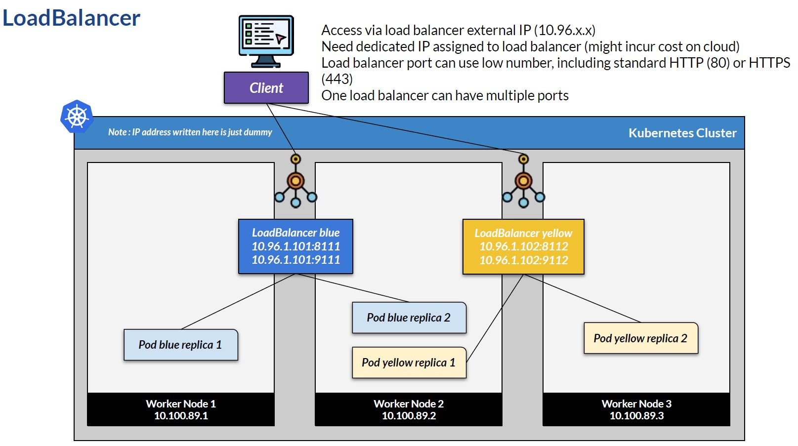

NodePort is a simpler version of a load balancer. On a single worker node, we cannot see the difference, but on multi-worker nodes, this is what happens. While in the load balancer, clients access through the load balancer IP address, On nodeport, the client accesses nodeport via the worker IP address. In this sample, the blue node port exposes port 30111, so the client can access using one of the black IPs: 10.100.89.1, 2, or 3 and port 30111. And so does the yellow node port, which can be accessed using one of the black IP addresses on port 30112. Using a node port means we access the worker node IP address, and does not need a dedicated IP address for the node port. By default, node ports can only be assigned a high port in this range. We can assign the port or let Kubernetes automatically assign a free port in this range. One node port cannot have more than one port assigned. This behavior might be good for local development. Still, in practice, node ports are not suitable because we need to maintain an IP address and a port that can be automatically assigned.
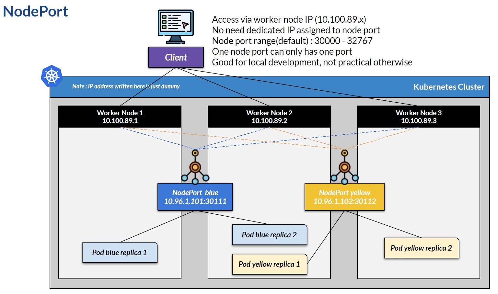

Cluster IP is the default service type if none is written in the service configuration. Cluster IP is only meant for internal access within the cluster, so the client cannot connect to the cluster IP service. If, for debugging purposes, a client must connect to the cluster IP, It can still be done using kubectl proxy. But this is only for debugging, not suitable for real transactions. The important point here is that cluster IP is meant only for exposing the service internally within the cluster, not for external clients. Accessing via kubectl proxy is possible, but the URL will be long and include the proxy endpoint.
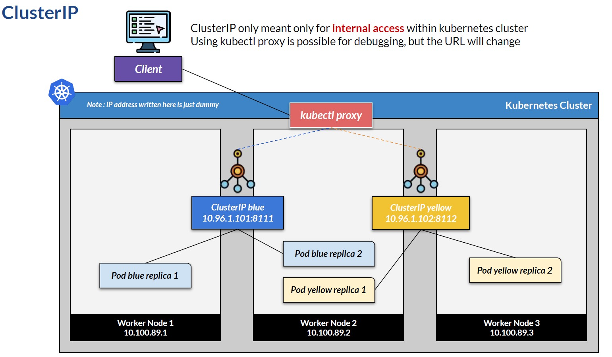

In the next video, we will see a sample of all three service types. We will have two containers: 
- devops blue running on port 8111, and 
- devops yellow on port 8112 

Both are simple REST API, Each deployment contains a single pod with a single container. We will create a deployment with two replicas.

The demo will create four podsin total. Please wait around 1 to 2 minutes until all pods are ready. Depending on your laptop's resources, it might take longer for the pod to be ready. If your laptop is low on CPU or memory, the pod might not even be ready. In that case, you can reduce the replica count to 1, which requires fewer resources. 

When using minikube, we need to open a tunnel so that minikube can redirect traffic. Open a terminal and type this. 

    bash --> minikube tunnel

This terminal must remain open. 

Let's try one by one. In the source scripts, see the service folder - \devops-kubernetes-resources-references\kubernetes-istio-scripts\kubernetes\service. Here is a deployment file that deploys only the pods - deployment-service.yml

Then we have another three files - service-clusterip.yml, service-loadbalancer.yml and service-nodeport.yml. Each service file contains two services, one to expose the blue deployment and one forthe yellow deployment.

First, let's deploy.

    bash --> kubectl apply -f deployment-service.yml

    # result:
    namespace/devops created
    deployment.apps/devops-service-blue-deployment created
    deployment.apps/devops-service-yellow-deployment created

Wait around 100 seconds and check the deployment

    bash --> kubectl get deployment -n devops

    # result:
    NAME                               READY   UP-TO-DATE   AVAILABLE   AGE
    devops-service-blue-deployment     2/2     2            2           107s
    devops-service-yellow-deployment   2/2     2            2           107s

Check theservice-loadbalancer file. We have already seen this kind of configuration in previous lessons. This configuration simulates the load balancer deployment shown on the previous slide, where each load balancer opens two ports, each pointing to the same deployment. To connect to the service for a given deployment, we will use a different label selector. The difference is that since we open two ports, we need to name each one. The same configuration applies to yellow, just a different port is opened.

service-loadbalancer.yml

```yaml
apiVersion: v1
kind: Service
metadata:
  namespace: devops
  name: devops-blue-loadbalancer
  labels:
    app.kubernetes.io/name: devops-service-blue
spec:
  selector:
    app.kubernetes.io/name: devops-service-blue
  type: LoadBalancer
  ports:
  - port: 8111
    targetPort: 8111
    name: blue-loadbalancer-one
  - port: 9111
    targetPort: 8111
    name: blue-loadbalancer-two

---

apiVersion: v1
kind: Service
metadata:
  namespace: devops
  name: devops-yellow-loadbalancer
  labels:
    app.kubernetes.io/name: devops-service-yellow
spec:
  selector:
    app.kubernetes.io/name: devops-service-yellow
  type: LoadBalancer
  ports:
  - port: 8112
    targetPort: 8112
    name: yellow-loadbalancer-one
  - port: 9112
    targetPort: 8112
    name: yellow-loadbalancer-two
```

Apply it.

    bash --> kubectl apply -f service-loadbalancer.yml

    # result:
    service/devops-blue-loadbalancer created
    service/devops-yellow-loadbalancer created

Then check the service. I will check the blue sample. 

    CMD --> kubectl get service -n devops -o wide devops-blue-loadbalancer

    # result:
    NAME                       TYPE           CLUSTER-IP       EXTERNAL-IP   PORT(S)                         AGE   SELECTOR
    devops-blue-loadbalancer   LoadBalancer   10.106.100.118   127.0.0.1     8111:31621/TCP,9111:31992/TCP   86s   app.kubernetes.io/name=devops-service-blue

The yellow will have a similar configuration. See that this has a field cluster IP, which is a virtual private IP and not accessible from the outside. And there is an external IP address accessible by the client. In this case, it is localhost. 

If we describe the service, it will have two endpoints, meaning traffic will be distributed between two replicas. 

    CMD --> kubectl describe service -n devops devops-blue-loadbalancer

    # result:
    Name:                     devops-blue-loadbalancer
    Namespace:                devops
    Labels:                   app.kubernetes.io/name=devops-service-blue
    Annotations:              <none>
    Selector:                 app.kubernetes.io/name=devops-service-blue
    Type:                     LoadBalancer
    IP Family Policy:         SingleStack
    IP Families:              IPv4
    IP:                       10.106.100.118
    IPs:                      10.106.100.118
    LoadBalancer Ingress:     127.0.0.1 (VIP)
    Port:                     blue-loadbalancer-one  8111/TCP
    TargetPort:               8111/TCP
    NodePort:                 blue-loadbalancer-one  31621/TCP
    Endpoints:                10.244.0.61:8111,10.244.0.62:8111
    Port:                     blue-loadbalancer-two  9111/TCP
    TargetPort:               8111/TCP
    NodePort:                 blue-loadbalancer-two  31992/TCP
    Endpoints:                10.244.0.61:8111,10.244.0.62:8111
    Session Affinity:         None
    External Traffic Policy:  Cluster
    Internal Traffic Policy:  Cluster
    Events:                   <none>

Open Postman or curl, and hit the blue endpoint. I will use curl. 

    CMD --> curl http://localhost:8111/devops/blue/api/hello

    # result:
    Version [2.0.0] Hello from app [devops-blue running at 10.244.0.62] on k8s pod [devops-service-blue-deployment-55d9b7687d-t4s4q]
    Version [2.0.0] Hello from app [devops-blue running at 10.244.0.61] on k8s pod [devops-service-blue-deployment-55d9b7687d-t4s4q]

Notice that we get redirected to a different blue pod. And since we open two ports for blue, we can also use port 9111 to access the blue pod.

    CMD --> curl http://localhost:9111/devops/blue/api/hello

    # result:
    Version [2.0.0] Hello from app [devops-blue running at 10.244.0.62] on k8s pod [devops-service-blue-deployment-55d9b7687d-t4s4q]
    Version [2.0.0] Hello from app [devops-blue running at 10.244.0.61] on k8s pod [devops-service-blue-deployment-55d9b7687d-t4s4q]

The same goes for the yellow load balancer, where we can use ports 8112 or 9112, as defined, to access the yellow pod.

    CMD --> curl http://localhost:8112/devops/yellow/api/hello
    CMD --> curl http://localhost:9112/devops/yellow/api/hello

    # result:
    Version [2.0.0] Hello from app [devops-yellow running at 10.244.0.60] on k8s pod [devops-service-yellow-deployment-5fc8dc689f-qfx28]
    Version [2.0.0] Hello from app [devops-yellow running at 10.244.0.59] on k8s pod [devops-service-yellow-deployment-5fc8dc689f-d7b5z]

Let's delete the load balancer so we can start fresh with the next type.

    bash --> kubectl delete -f service-loadbalancer.yml

    # result:
    service "devops-blue-loadbalancer" deleted from devops namespace
    service "devops-yellow-loadbalancer" deleted from devops namespace

Check theservice-nodeport file. This configurationwill simulate the nodeport deployment from the previous slide, where each node port serves as an entry point to a single pod. We also use a label selector to connect to the correct pod. In the port section, we need to define the port and the target port, which is the pod on the port. These two will have the same value on the node port configuration. The third one (the node port element) is optional. If we define it, Kubernetes will open this port so we can access the pod from the host on this port. In this sample, I define it on port 30111 for blue and 30112 for yellow. If we define a node port, it must fall within a specific range. If we don't define it, Kubernetes will automatically assign a random free port to us.

service-nodeport.yml

```yaml
apiVersion: v1
kind: Service
metadata:
  namespace: devops
  name: devops-blue-nodeport
  labels:
    app.kubernetes.io/name: devops-service-blue
spec:
  selector:
    app.kubernetes.io/name: devops-service-blue
  type: NodePort
  ports:
  - port: 8111        # pod port to expose
    targetPort: 8111  # pod port to expose
    nodePort: 30111   # optional, if this element not exists then k8s will assign free port between 30000-32767

---

apiVersion: v1
kind: Service
metadata:
  namespace: devops
  name: devops-yellow-nodeport
  labels:
    app.kubernetes.io/name: devops-service-yellow
spec:
  selector:
    app.kubernetes.io/name: devops-service-yellow
  type: NodePort
  ports:
  - port: 8112        # pod port to expose
    targetPort: 8112  # pod port to expose
    nodePort: 30112   # optional, if this element not exists then k8s will assign free port between 30000-32767
```

Try to apply it.

    bash --> kubectl apply -f service-nodeport.yml

    # result:
    service/devops-blue-nodeport created
    service/devops-yellow-nodeport created

Then check the service. I will check the blue for the sample. 

    bash --> kubectl get service -n devops -o wide devops-blue-nodeport

    # result:
    NAME                   TYPE       CLUSTER-IP      EXTERNAL-IP   PORT(S)          AGE    SELECTOR
    devops-blue-nodeport   NodePort   10.100.123.72   <none>        8111:30111/TCP   101s   app.kubernetes.io/name=devops-service-blue

See that this only has a field cluster IP, which is a virtual private IP and not accessible from the outside. It does not have an external IP address. To access this service, we can use the worker node's IP address, which in this case is my laptop. Since we run the Docker node on the laptop, we can use localhost. The port is exposed at 30111, as seen here. If we don't define the node port, the randomly assigned port can be checked here - 8111:30111/TCP. 

If we describe the service, it will have two endpoints, meaning traffic will be distributed between two replicas.

    bash --> kubectl describe service -n devops devops-blue-nodeport

    # result:
    Name:                     devops-blue-nodeport
    Namespace:                devops
    Labels:                   app.kubernetes.io/name=devops-service-blue
    Annotations:              <none>
    Selector:                 app.kubernetes.io/name=devops-service-blue
    Type:                     NodePort
    IP Family Policy:         SingleStack
    IP Families:              IPv4
    IP:                       10.100.123.72
    IPs:                      10.100.123.72
    Port:                     <unset>  8111/TCP
    TargetPort:               8111/TCP
    NodePort:                 <unset>  30111/TCP
    Endpoints:                10.244.0.62:8111,10.244.0.61:8111
    Session Affinity:         None
    External Traffic Policy:  Cluster
    Internal Traffic Policy:  Cluster
    Events:                   <none>

However, exposing a nodeport in minikube isn't straightforward. Open Postman or curl, and hit the blue endpoint.

I will use curl to port 30111, as defined on the configuration. However we can't connect.

    browser --> curl http://localhost:30111/devops/blue/api/hello

    # result: curl: (7) Failed to connect to localhost port 30111 after 2250 ms: Could not connect to server

The issue is that, with Minikube, localhost doesn't map directly to Kubernetes services. Minikube runs in its own virtual machine or container, so we need to access it via the minikube service URL or via port forwarding. For example, use the service URL. Add the URL parameter to the service command.

    bash --> minikube service -n devops devops-blue-nodeport --url

    # result: http://127.0.0.1:51718

This command opens a random port that we can use to access the node port.

Try to curl again to the exposed service URL, and now we will get a response.

    bash --> curl http://127.0.0.1:51718/devops/blue/api/hello

    # result:
    Version [2.0.0] Hello from app [devops-blue running at 10.244.0.61] on k8s pod [devops-service-blue-deployment-55d9b7687d-5nh48]
    Version [2.0.0] Hello from app [devops-blue running at 10.244.0.62] on k8s pod [devops-service-blue-deployment-55d9b7687d-t4s4q]

Let's delete the service so we can start fresh with the next type. 

    bash --> kubectl delete -f service-nodeport.yml

    # result:
    service "devops-blue-nodeport" deleted from devops namespace
    service "devops-yellow-nodeport" deleted from devops namespace


Check the service-clusterip file - service-clusterip.yml. This configuration will simulate cluster IP deployment on the previous slide. We use a label selector to connect to the correct pod. In the port section, we only need to define the port. But if we later want to debug the pod using kubectl proxy, we should name the port. The name can be anything; this one is just for a sample. 

service-clusterip.yml

```yaml
apiVersion: v1
kind: Service
metadata:
  namespace: devops
  name: devops-blue-clusterip
  labels:
    app.kubernetes.io/name: devops-service-blue
spec:
  selector:
    app.kubernetes.io/name: devops-service-blue
  ports:
  - port: 8111
    name: http      # optional, to be used for accessing through kubectl proxy
---
apiVersion: v1
kind: Service
metadata:
  namespace: devops
  name: devops-yellow-clusterip
  labels:
    app.kubernetes.io/name: devops-service-yellow
spec:
  selector:
    app.kubernetes.io/name: devops-service-yellow
  ports:
  - port: 8112
    name: http      # optional, to be used for accessing through kubectl proxy
```


Try to apply it. 

    bash --> kubectl apply -f service-clusterip.yml

    # result:
    service/devops-blue-clusterip created
    service/devops-yellow-clusterip created

Then check the service. I will check the blue for the sample. 

    bash --> kubectl get service -n devops -o wide devops-blue-clusterip

    # result:
    NAME                    TYPE        CLUSTER-IP      EXTERNAL-IP   PORT(S)    AGE   SELECTOR
    devops-blue-clusterip   ClusterIP   10.97.173.117   <none>        8111/TCP   90s   app.kubernetes.io/name=devops-service-blue

See that this only has a field cluster IP, which is a virtual private IP and not accessible from the outside. The port exposed is 8111. 

If we describe the service, it will have two endpoints, meaning traffic will be distributed between two replicas. 

    bash --> kubectl describe service -n devops devops-blue-clusterip

    # result:
    Name:                     devops-blue-clusterip
    Namespace:                devops
    Labels:                   app.kubernetes.io/name=devops-service-blue
    Annotations:              <none>
    Selector:                 app.kubernetes.io/name=devops-service-blue
    Type:                     ClusterIP
    IP Family Policy:         SingleStack
    IP Families:              IPv4
    IP:                       10.97.173.117
    IPs:                      10.97.173.117
    Port:                     http  8111/TCP
    TargetPort:               8111/TCP
    Endpoints:                10.244.0.62:8111,10.244.0.61:8111
    Session Affinity:         None
    Internal Traffic Policy:  Cluster
    Events:                   <none>

To hit the cluster IP, we need to run this command to create a kubectl proxy, which will open a proxy on port 8888. 

    CMD --> kubectl proxy --port=8888

    # result: Starting to serve on 127.0.0.1:8888

Open Postman or curl, and try to hit the blue endpoint through the proxy. I will use Postman. Notice the endpoint, which becomes quite long since we need to hit it via a proxy. So we need to tell the proxy which namespace we want to access, the service name, and the port name, which we define in the service configuration.

    Postman/Service/ClueterIP/GET Hello Blue
    # result: 
    Version [2.0.0] Hello from app [devops-blue running at 10.244.0.61] on k8s pod [devops-service-blue-deployment-55d9b7687d-5nh48]
    Version [2.0.0] Hello from app [devops-blue running at 10.244.0.62] on k8s pod [devops-service-blue-deployment-55d9b7687d-t4s4q]

Thesame way with yellow cluster ip. The difference is in the service name.

    Postman/Service/ClueterIP/GET Hello Yellow
    # result: 
    Version [2.0.0] Hello from app [devops-yellow running at 10.244.0.59] on k8s pod [devops-service-yellow-deployment-5fc8dc689f-d7b5z]
    Version [2.0.0] Hello from app [devops-yellow running at 10.244.0.60] on k8s pod [devops-service-yellow-deployment-5fc8dc689f-qfx28]

Let's delete the service so we can start fresh with the next type.

    bash --> kubectl delete namespace devops

[⬆ Back to top](#top)


## 38 Ingress Controller
[⬆ Back to top](#top)

We saw this diagram when using a load balancer. This diagram shows how we expose the pod to the outer Kubernetes world. In reality, we will have a lot of services to be exposed, Which means a lot of load balancers. And if we use the cloud, that means reserving many IP addresses, which may require payment, and the domain name must also be maintained.
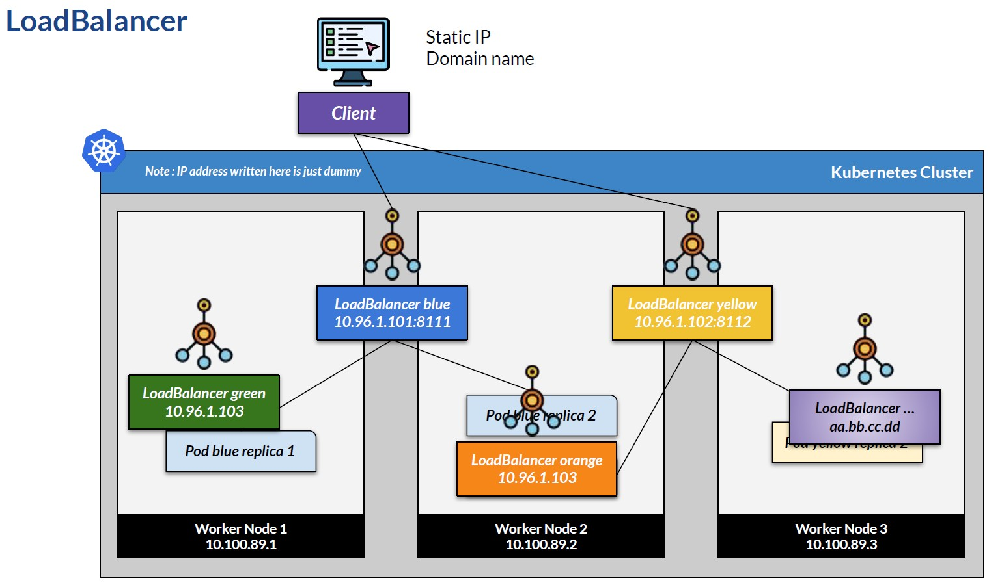

What if we have something that can be used as a single IP address, meaning a single URL endpoint that can access any pod? We can add a URL path after the domain, and it will redirect traffic to the correct pod. Meet ingress, which is exactly what it's used for. Well, actually, not only the ingress. An ingress in Kubernetes is like a rulebook for defining traffic routing. The ingress controller implements the rules and redirects traffic accordingly. The client actually accesses the ingress controller. Ingress and ingress controller are not Kubernetes services. They are traffic controllers. It actually redirects traffic to the service, based on a set of rules, For example, using a path. The service can be any type: ClusterIP, NodePort, or even a load balancer. The service will connect to the pod, as we have learned. In practice, we usually use a cluster IP service, as the ingress and the ingress controller handle external exposure.
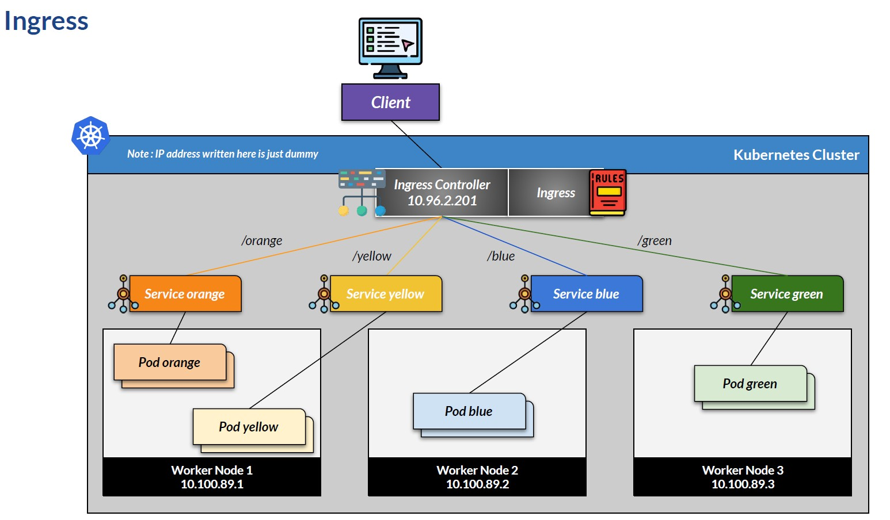

Ingress is a set of rules defined as a Kubernetes object via a configuration file. The ingress controller is a separate component that needs to be installed. An ingress controller is basically a load balancer, but with a set of rules that make it more powerful than the built-in Kubernetes load balancer. For example, we can use an Nginx Ingress Controller or a cloud-specific Ingress Controller. In addition, several providers offer ingress controller products. 

In the next demo, we will learn this. We have two services, and we will write ingress rules so that the ingress controller routes traffic based on the client's URL path. We will use the Nginx Ingress Controller. Since everything in this demo is on localhost, we might not be able to see the real power of the ingress controller, but the concept should be clear.
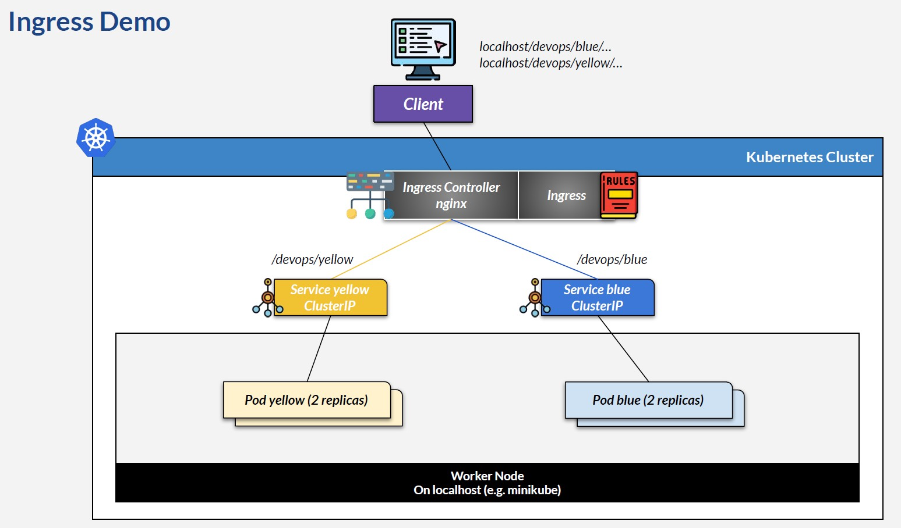

The demo will create four pods in total. Please wait around 1 to 2 minutes until all pods are ready. Depending on your laptop's resources, it might take longer for the pod to be ready. If your laptop is low on CPU or memory, the pod might not even be ready. On folder ingress, you can reduce the replica count to 1, which requires fewer resources.

Open file devops-ingress.yml. Nothing special here. We deploy blue and yellow pods with two replicas each. Then we will create a service for each, with a type cluster IP.

Apply thisdeployment

    bash --> kubectl apply -f devops-ingress.yml

    # result:
    namespace/devops created
    deployment.apps/devops-ingress-blue-deployment created
    deployment.apps/devops-ingress-yellow-deployment created
    service/devops-blue-clusterip created
    service/devops-yellow-clusterip created

Then open file ingress-nginx-1.yml. Here, we will define the ingress rules.

ingress-nginx-1.yml

```yaml
apiVersion: networking.k8s.io/v1
kind: Ingress
metadata:
  namespace: devops
  name: devops-ingress-nginx
  labels:
    app.kubernetes.io/name: devops-ingress-nginx
  annotations:
    nginx.ingress.kubernetes.io/service-upstream: "true"
    nginx.ingress.kubernetes.io/proxy-connect-timeout: "8"
    nginx.ingress.kubernetes.io/proxy-send-timeout: "8"
    nginx.ingress.kubernetes.io/proxy-read-timeout: "8"
spec:
  ingressClassName: nginx
  rules:
  - http:
      paths:
      - path: /devops/blue
        pathType: Prefix
        backend:
          service:
            name: devops-blue-clusterip
            port:
              number: 8111
      - path: /devops/yellow
        pathType: Prefix
        backend:
          service:
            name: devops-yellow-clusterip
            port:
              number: 8112
```

It does not matter if we install the ingress controller first or configure the ingress first. Notice the kind is ingress. Then we define some nginx-specific configuration in annotations. These annotations can vary depending on the ingress controller we use. For complete documentation on the nginx ingress controller, including the nginx annotation, please see the links on the course resources and references, the last section of this course. This configuration will forward using the existing path specified in spec.rules.http.paths. In other words, the client's URL path will be forwarded to the service as-is. Using annotations, we can modify the nginx configuration. For example, nginx's default timeout is 1 minute. If Nginx receives no response from the backend within 1 minute, it will consider the request a timeout. In this sample, we will set the timeout to only 8 seconds. In the ingress class name, we use nginx. We set the rules on the spec. The rules can vary depending on our needs. In this sample configuration, we will forward any requests from the client with a URL starting with /devops/blue to the devops-blue cluster IP service on port 8111. Every URL starting with /devops/yellow will be routed to the devops-yellow cluster IP service on port 8112.

Apply these ingress rules.

    bash --> kubectl apply -f ingress-nginx-1.yml

    # result: ingress.networking.k8s.io/devops-ingress-nginx created

And check that ingress is created.

    bash --> kubectl get ingress -n devops 

    # result:
    NAME                   CLASS   HOSTS   ADDRESS   PORTS   AGE
    devops-ingress-nginx   nginx   *                 80      18s

Review the ingress details and ensure backends are routed to the pod IP addresses.

    bash --> kubectl describe ingress -n devops devops-ingress-nginx

    # result:
    Name:             devops-ingress-nginx
    Labels:           app.kubernetes.io/name=devops-ingress-nginx
    Namespace:        devops
    Address:
    Ingress Class:    nginx
    Default backend:  <default>
    Rules:
    Host        Path  Backends
    ----        ----  --------
    *
                /devops/blue     devops-blue-clusterip:8111 (10.244.0.66:8111)
                /devops/yellow   devops-yellow-clusterip:8112 (10.244.0.65:8112)
    Annotations:  nginx.ingress.kubernetes.io/proxy-connect-timeout: 8
                nginx.ingress.kubernetes.io/proxy-read-timeout: 8
                nginx.ingress.kubernetes.io/proxy-send-timeout: 8
                nginx.ingress.kubernetes.io/service-upstream: true
    Events:       <none>

We now need to install the Nginx IngressController. On minikube, we can enable the ingress add-on.

    bash --> minikube addons enable ingress

Then create a tunnel.

    bash --> minikube tunnel

Ensurethe controller pod is ready before continuing.

    bash --> kubectl get pod -n ingress-nginx

    # result:
    NAME                                        READY   STATUS      RESTARTS   AGE
    ingress-nginx-admission-create-zbwf8        0/1     Completed   0          81s
    ingress-nginx-admission-patch-99s22         0/1     Completed   0          81s
    ingress-nginx-controller-8675c6b56f-hkts2   1/1     Running     0          81s  # running - OK

We also have a new service for the controller, on namespace ingress-nginx.

    bash --> kubectl get service -n ingress-nginx

    # result:
    NAME                                 TYPE        CLUSTER-IP      EXTERNAL-IP   PORT(S)                      AGE
    ingress-nginx-controller             NodePort    10.109.215.57   <none>        80:31305/TCP,443:30309/TCP   2m2s
    ingress-nginx-controller-admission   ClusterIP   10.98.14.47     <none>        443/TCP                      2m2s

To expose the nginx ingress controller via a minikube tunnel, we need a service with type load Balancer. If such a service does not exist, create one using the file ingress-nginx-loadbalancer.yml. 

ingress-nginx-loadbalancer.yml

```yaml
apiVersion: v1
kind: Service
metadata:
  name: ingress-nginx-loadbalancer
  namespace: ingress-nginx
  labels:
    app.kubernetes.io/name: ingress-nginx
    app.kubernetes.io/component: controller
spec:
  type: LoadBalancer
  ports:
  - name: http
    port: 80
    targetPort: 80
    protocol: TCP
  - name: https
    port: 443
    targetPort: 443
    protocol: TCP
  selector:
    app.kubernetes.io/name: ingress-nginx
    app.kubernetes.io/component: controller
    app.kubernetes.io/instance: ingress-nginx
```

    bash --> kubectl apply -f ingress-nginx-loadbalancer.yml

    # result: service/ingress-nginx-loadbalancer created

Ensure it exists.

    bash --> kubectl get service -n ingress-nginx

    # result:
    NAME                                 TYPE           CLUSTER-IP      EXTERNAL-IP   PORT(S)                      AGE
    ingress-nginx-controller             NodePort       10.109.215.57   <none>        80:31305/TCP,443:30309/TCP   4m42s
    ingress-nginx-controller-admission   ClusterIP      10.98.14.47     <none>        443/TCP                      4m42s
    ingress-nginx-loadbalancer           LoadBalancer   10.103.98.212   127.0.0.1     80:31124/TCP,443:31625/TCP   89s

Since we already defined the ingress, we can try it. Open the Postman collection and try to access hello blue or hello yellow under the ingress folder. And we will get the response.

    Postman/Ingress/ GET Hello Blue - 1

    # result:
    Version [2.0.0] Hello from app [devops-blue running at 10.244.0.66] on k8s pod [devops-ingress-blue-deployment-69b7ff7d84-99tj2]

    Postman/Ingress/ GET Hello Yellow - 1

    # result:
    Version [2.0.0] Hello from app [devops-yellow running at 10.244.0.65] on k8s pod [devops-ingress-yellow-deployment-79657dbd7c-xrg4j]

If we add configuration using an annotation, the configuration should already be applied. For example, open the delay endpoint. This delay endpoint will simulate a long process that takes seconds on the input parameter.
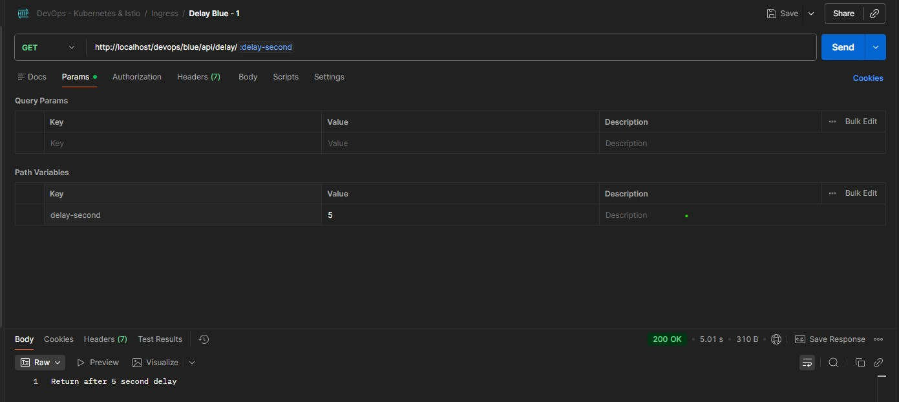

Since we configure an 8-second delay, when we hit the delay endpoint with a parameter greater than 8, we will get a gateway timeout. It's not exactly at second 9 that we get a response. There will be additional time from nginx, but it will return a gateway timeout status. 
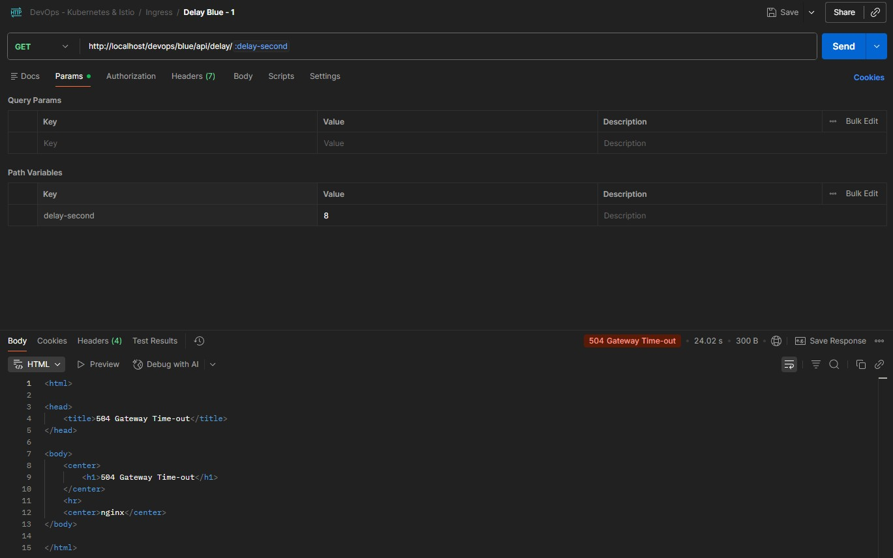

Remove the ingress to start fresh.

    bash --> kubectl delete -f ingress-nginx-1.yml

    # result: ingress.networking.k8s.io "devops-ingress-nginx" deleted from devops namespace

Nginx Ingress can apply more rules. In the ingress file ingress-nginx-2.yml, I provide sample two. This sample has the same metadata as the ingress one, but the rule is different. This time, we will use a different path to redirect traffic. URLs with the path 'the-blue' will be redirected to the blue service, and URLs with the path 'the-yellow' will be redirected to the yellow service. In the annotation, we use rewrite target to rewrite the URL using the first capture group, which, in this sample configuration, matches any character that follows 'the-blue' or 'the-yellow'. This means we will rewrite the URL by using only the first capture group when redirecting traffic to the service.

ingress-nginx-2.yml

```yaml
apiVersion: networking.k8s.io/v1
kind: Ingress
metadata:
  namespace: devops
  name: devops-ingress-nginx
  labels:
    app.kubernetes.io/name: devops-ingress-nginx
  annotations:
    nginx.ingress.kubernetes.io/rewrite-target: /$1                 # first capture group only
    nginx.ingress.kubernetes.io/proxy-connect-timeout: "8"
    nginx.ingress.kubernetes.io/proxy-send-timeout: "8"
    nginx.ingress.kubernetes.io/proxy-read-timeout: "8"
spec:
  ingressClassName: nginx
  rules:
  - http:
      paths:
      - path: /the-blue/(.*)
        pathType: ImplementationSpecific
        backend:
          service:
            name: devops-blue-clusterip
            port:
              number: 8111
      - path: /the-yellow/(.*)
        pathType: ImplementationSpecific
        backend:
          service:
            name: devops-yellow-clusterip
            port:
              number: 8112
```

In simpler terms, this configuration will remove the 'the-blue' or 'the-yellow' prefix received by the backend.

Apply this file.

    bash --> kubectl apply -f ingress-nginx-2.yml

    # result: ingress.networking.k8s.io/devops-ingress-nginx created

Open Postman and try to hit the second sample endpoint for blue or yellow.

    Postman/Ingress/GET Hello Blue - 2

    # result:
    Version [2.0.0] Hello from app [devops-blue running at 10.244.0.66] on k8s pod [devops-ingress-blue-deployment-69b7ff7d84-99tj2]

    Postman/Ingress/GET Hello Yellow - 2

    # result:
    Version [2.0.0] Hello from app [devops-yellow running at 10.244.0.65] on k8s pod [devops-ingress-yellow-deployment-79657dbd7c-xrg4j]


We can try delay two, which has the same functionality as delay one, with a different URL.

Remove the ingress to startfresh.

    bash --> kubectl delete -f ingress-nginx-2.yml

    # result: ingress.networking.k8s.io "devops-ingress-nginx" deleted from devops namespace

In most applications, we use a readable domain (the light pink part) instead of the numerical IP address. The Domain Name System is responsible for translating a domain name into a matching IP address. In practice, we will find cases where we have several backends, each with its own domain name, and users access them through the domain name, most of the time via a subdomain. We can even use a single domain name, with paths routed seamlessly to different backends. This behavior can be achieved using an ingress controller. But first, we must know a few things. 
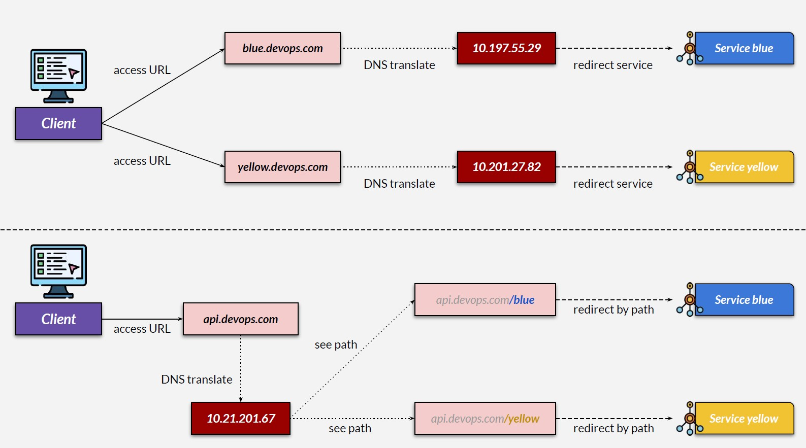

In this sample,'API' is a subdomain, and domain.com isthe domain. This address is human-readable, but computers need to know the exact IP address for routing traffic. The Domain Name System (DNS) translates readable domain names into IP addresses, enabling traffic to be routed to the correct destination. On the internet, we can use many DNS providers, like Google Cloud DNS or AWS Route 53. Locally, for development purposes, we can use a hosts file to simulate DNS. In Windows, this is the host file. On Linux or macOS, this is the hosts file. Either the actual DNS or the host file will contain an entry that maps a human-readable address into an IP address. For the next lesson, we will simulate DNS using a local host file.
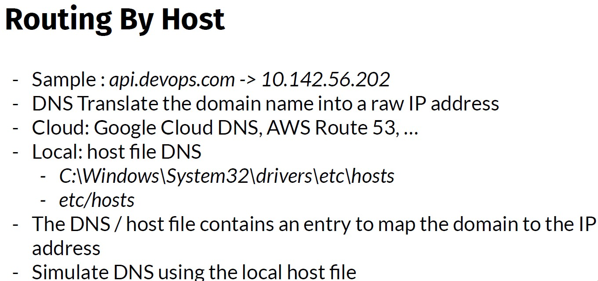

In this course, we will use several domain names, although all point to the same local IP address. Please set these host names on your laptop. 
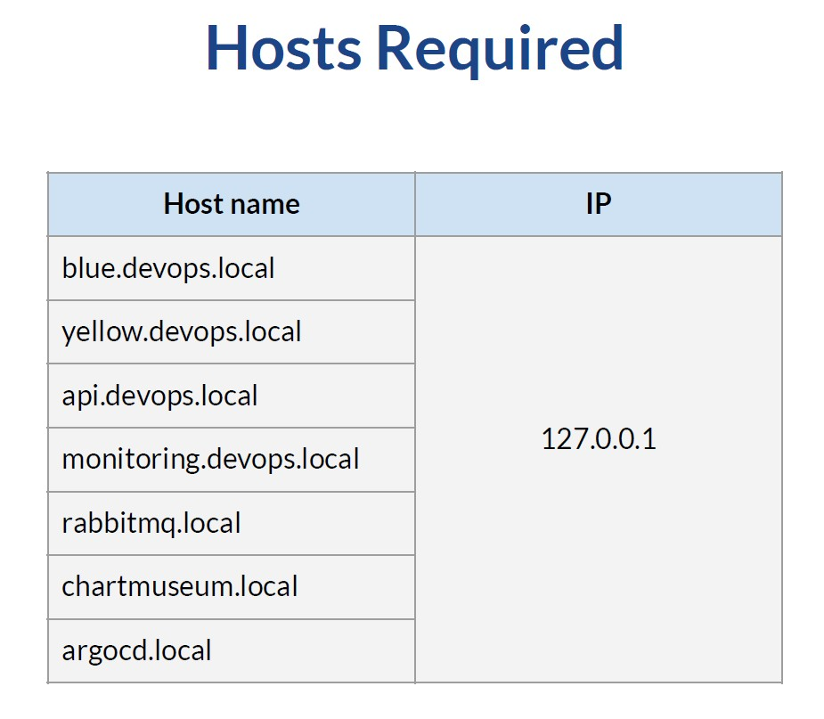

When an application forwards an HTTP request, behind the scenes, it will contain the Host request header, which specifies the host and port number of the server to which the request is being sent. 

So if we send a request to this URL, the host header will contain this. This mechanism can later be used to achieve our goal. 

This is what we will create in the next video. We will have two domains: blue.devops.local and yellow.devops.local. Since we use localhost, we will edit the hosts file to map those domains to the local IP 127.0.0.1. Then, based on the domain, we will redirect traffic to the correct service.
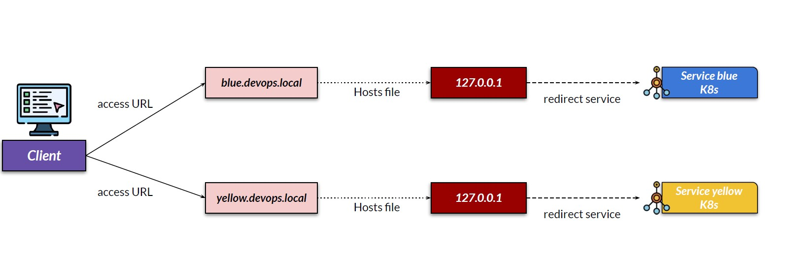

First, add an entry to the hosts file. I use Windows so that I will edit this file. We need to edit as an administrator. Then add this entry. [ 127.0.0.1 blue.devops.local 127.0.0.1 yellow.devops.local ] 

Add host address to Windows host list
- Open PowerShell as Admin

		terminal --> notepad C:\Windows\System32\drivers\etc\hosts

- add 
```text
127.0.0.1 blue.devops.local             # added 
127.0.0.1 yellow.devops.local           # added
127.0.0.1 api.devops.local
127.0.0.1 monitoring.devops.local
127.0.0.1 rabbitmq.devops.local
127.0.0.1 chartmuseum.devops.local
127.0.0.1 argocd.devops.local
```
- save the file and exit

On the Kubernetes script, open ingress-nginx-3.yml.

```yaml
apiVersion: networking.k8s.io/v1
kind: Ingress
metadata:
  namespace: devops
  name: devops-ingress-nginx-host-blue
  labels:
    app.kubernetes.io/name: devops-ingress-nginx
spec:
  ingressClassName: nginx
  rules:
  - host: blue.devops.local
    http:
      paths:
      - path: /
        pathType: Prefix
        backend:
          service:
            name: devops-blue-clusterip
            port:
              number: 8111

---

apiVersion: networking.k8s.io/v1
kind: Ingress
metadata:
  namespace: devops
  name: devops-ingress-nginx-host-yellow
  labels:
    app.kubernetes.io/name: devops-ingress-nginx
spec:
  ingressClassName: nginx
  rules:
  - host: yellow.devops.local
    http:
      paths:
      - path: /
        pathType: Prefix
        backend:
          service:
            name: devops-yellow-clusterip
            port:
              number: 8112
```

We define two ingress rules here, one for each host. First is for the blue rule. We will redirect anything that targets blue.devops.local into the blue service. This is achieved using a host rule. Any path will be redirected to the blue service on port 8111. Second is for the yellow rule. We will redirect any traffic targeting yellow.devops.local into the yellow service. Any path will be redirected to the yellow service on port 8112. 

Apply these rules.

    bash --> kubectl apply -f ingress-nginx-3.yml

    # result:
    ingress.networking.k8s.io/devops-ingress-nginx-host-blue created
    ingress.networking.k8s.io/devops-ingress-nginx-host-yellow created

Check that we now have two ingress.

    bash --> kubectl get ingress -n devops

    # result:
    NAME                               CLASS   HOSTS                 ADDRESS   PORTS   AGE
    devops-ingress-nginx-host-blue     nginx   blue.devops.local               80      30s
    devops-ingress-nginx-host-yellow   nginx   yellow.devops.local             80      30s

And that the blue ingress has an endpoint to blue pods.

    bash --> kubectl describe ingress devops-ingress-nginx-host-blue -n devops

    # result:
    Name:             devops-ingress-nginx-host-blue
    Labels:           app.kubernetes.io/name=devops-ingress-nginx
    Namespace:        devops
    Address:          192.168.49.2
    Ingress Class:    nginx
    Default backend:  <default>
    Rules:
    Host               Path  Backends
    ----               ----  --------
    blue.devops.local
                        /   devops-blue-clusterip:8111 (10.244.0.66:8111)
    Annotations:         <none>
    Events:
    Type    Reason  Age                From                      Message
    ----    ------  ----               ----                      -------
    Normal  Sync    36s (x2 over 77s)  nginx-ingress-controller  Scheduled for sync

Similarly, yellow ingress traffic is redirected to yellow pods.

    bash --> kubectl describe ingress devops-ingress-nginx-host-yellow -n devops

    # result:
    Name:             devops-ingress-nginx-host-yellow
    Labels:           app.kubernetes.io/name=devops-ingress-nginx
    Namespace:        devops
    Address:          192.168.49.2
    Ingress Class:    nginx
    Default backend:  <default>
    Rules:
    Host                 Path  Backends
    ----                 ----  --------
    yellow.devops.local
                        /   devops-yellow-clusterip:8112 (10.244.0.65:8112)
    Annotations:           <none>
    Events:
    Type    Reason  Age               From                      Message
    ----    ------  ----              ----                      -------
    Normal  Sync    79s (x2 over 2m)  nginx-ingress-controller  Scheduled for sync

This endpoint will echo the request. Notice the received request header, which contains the host header blue.devops.local. So this is redirected to the blue pod, as shown in the response header. 

    Postman/Ingress/GET Echo Blue - 3

    # result:
    Protocol : HTTP/1.1 (via plain HTTP)

    Path : /api/echo

    Method : GET

    Headers :

    Host : blue.devops.local
    X-Request-ID : ee96bd67c79958a092ad4fbd81f6e290
    X-Real-IP : 10.244.0.1
    X-Forwarded-Host : blue.devops.local
    X-Forwarded-Port : 80
    X-Forwarded-Proto : http
    X-Forwarded-Scheme : http
    X-Scheme : http
    User-Agent : PostmanRuntime/7.51.1
    Accept : */*
    Cache-Control : no-cache
    Postman-Token : c5418469-caeb-43cf-a699-df47b1e1de62
    Accept-Encoding : gzip, deflate, br

    Cookies : null

    Parameters :

    Body : null

    Headers: K8s-Pod-Name / devops-ingress-blue-deployment-69b7ff7d84-99tj2

When we execute yellow 3, the host header contains yellow.devops.local and is served by the yellow pod, as shown in the response header.

Delete this rule.

    bash --> kubectl delete -f ingress-nginx-3.yml

    # result:
    ingress.networking.k8s.io "devops-ingress-nginx-host-blue" deleted from devops namespace
    ingress.networking.k8s.io "devops-ingress-nginx-host-yellow" deleted from devops namespace

This is what we will create in the next video. We will have one domain: api.devops.local. We will edit the hosts file to map the host to the local IP address using 127.0.0.1. Then, based on the path after the domain, we will redirect traffic to the correct service. So the 'slash blue' is to blue service, and the 'slash yellow' is to yellowservice.
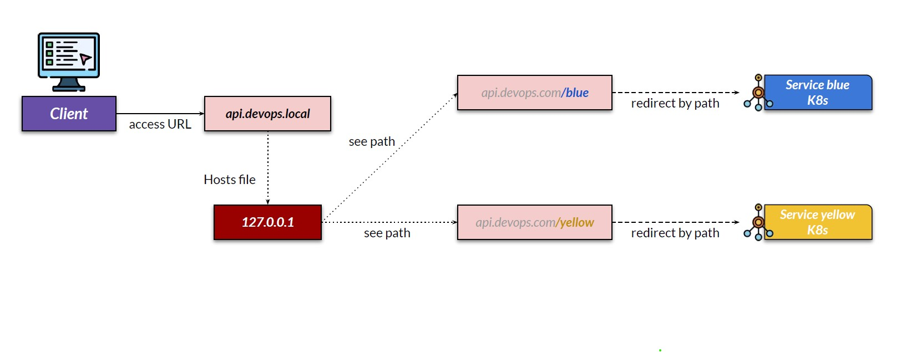

Add another entry to the hosts file. Add host address to Windows host list
- Open PowerShell as Admin

		terminal --> notepad C:\Windows\System32\drivers\etc\hosts

- add 
```text
127.0.0.1 blue.devops.local
127.0.0.1 yellow.devops.local
127.0.0.1 api.devops.local          # added 
127.0.0.1 monitoring.devops.local
127.0.0.1 rabbitmq.devops.local
127.0.0.1 chartmuseum.devops.local
127.0.0.1 argocd.devops.local
```
- save the file and exit

On the Kubernetes script, open ingress-nginx-4.yaml.

```yaml
apiVersion: networking.k8s.io/v1
kind: Ingress
metadata:
  namespace: devops
  name: devops-ingress-nginx-host-single
  labels:
    app.kubernetes.io/name: devops-ingress-nginx
  annotations:
    nginx.ingress.kubernetes.io/client-max-body-size: 10m
    nginx.ingress.kubernetes.io/proxy-body-size: 10m
    nginx.ingress.kubernetes.io/proxy-connect-timeout: 300s
    nginx.ingress.kubernetes.io/proxy-read-timeout: 300s
    nginx.ingress.kubernetes.io/proxy-send-timeout: 300s
spec:
  ingressClassName: nginx
  rules:
  - host: api.devops.local
    http:
      paths:
      - path: /devops/blue
        pathType: Prefix
        backend:
          service:
            name: devops-blue-clusterip
            port:
              number: 8111
      - path: /devops/yellow
        pathType: Prefix
        backend:
          service:
            name: devops-yellow-clusterip
            port:
              number: 8112
```

We define a single ingress rule here since we only use a single host. We will redirect anything that targeting api.devops.local into Kubernetes. This time, we will combine the rules with the path so that everything starting with '/devops/blue' is redirected to the blue service. Everything started with '/devops/yellow' will be redirected to the yellow service.

Apply this ingress.

    bash --> kubectl apply -f ingress-nginx-4.yml

    # result: ingress.networking.k8s.io/devops-ingress-nginx-host-single created

Open Postman and execute echo blue 4. Notice the received request header, which contains the host header api.devops.local.

    Postman/Ingress/GET Echo Blue - 4

    # result:
    Protocol : HTTP/1.1 (via plain HTTP)

    Path : /api/echo

    Method : GET

    Headers :

    Host : api.devops.local
    X-Request-ID : af9202c6941b240688a385784b203e96
    X-Real-IP : 10.244.0.1
    X-Forwarded-Host : api.devops.local
    X-Forwarded-Port : 80
    X-Forwarded-Proto : http
    X-Forwarded-Scheme : http
    X-Scheme : http
    User-Agent : PostmanRuntime/7.51.1
    Accept : */*
    Cache-Control : no-cache
    Postman-Token : 8271a7f0-5d5b-4715-8052-c6ea5e5417ab
    Accept-Encoding : gzip, deflate, br

    Cookies : null

    Parameters :

    Body : null

    Headers:: K8s-Pod-Name / devops-ingress-blue-deployment-69b7ff7d84-99tj2

This traffic is redirected to the blue pod, as shown in the response header. 

When we execute yellow 4, the host header contains the same: api.devops.local, but served by yellow pod, as shown in the response header.

    Postman/Ingress/GET Echo Blue - 4

    # result:
    Protocol : HTTP/1.1 (via plain HTTP)

    Path : /api/echo

    Method : GET

    Headers :

    Host : api.devops.local
    X-Request-ID : a0aed9aace68621331dec91821f2043d
    X-Real-IP : 10.244.0.1
    X-Forwarded-Host : api.devops.local
    X-Forwarded-Port : 80
    X-Forwarded-Proto : http
    X-Forwarded-Scheme : http
    X-Scheme : http
    User-Agent : PostmanRuntime/7.51.1
    Accept : */*
    Cache-Control : no-cache
    Postman-Token : 2e664914-65bc-4f18-b4f1-6e0bd76599aa
    Accept-Encoding : gzip, deflate, br

    Cookies : null

    Parameters :

    Body : null

    Headers:: K8s-Pod-Name / devops-ingress-yellow-deployment-79657dbd7c-xrg4j

Deletethis rule. And delete the deployment.

    bash --> kubectl delete -f ingress-nginx-4.yml

    # result: ingress.networking.k8s.io "devops-ingress-nginx-host-single" deleted from devops namespace

    bash --> kubectl delete -f devops-ingress.yml

    # result:
    namespace "devops" deleted
    deployment.apps "devops-ingress-blue-deployment" deleted from devops namespace
    deployment.apps "devops-ingress-yellow-deployment" deleted from devops namespace
    service "devops-blue-clusterip" deleted from devops namespace
    service "devops-yellow-clusterip" deleted from devops namespace

[⬆ Back to top](#top)


## 39 Ingress Over TLS
[⬆ Back to top](#top)

In practice, we secure traffic using HTTPS, an HTTP protocol that encrypts and secures web traffic using TLS (Transport Layer Security). We can easily set a TLS certificate on the Kubernetes ingress. We need a TLS certificate. In reality, such a certificate is issued by a trusted certificate authority. Locally, we can generate a self-signed TLS certificate. Note that most apps do not trust self-signed certificates. Thus, if we use Postman or a browser, we need to turn off validation later. To generate a self-signed certificate, we can use OpenSSL or online tools. Check the link to the course resources and references.

First, generate a TLS certificate on https://regery.com/en/security/ssl-tools/self-signed-certificate-generator for 'api.devops.local'. Download the public and private key pair. 

[Back to Section 11 Helm - Kubernetes Package Manager / 41 Nginx Ingress Controller Retirement](../Section%2011%20Helm%20-%20Kubernetes%20Package%20Manager/Section%2011%20Helm%20-%20Kubernetes%20Package%20Manager%20Notes.md#return-point-1)   
[Back to Section 11 Helm - Kubernetes Package Manager / 43 Gateway API Hands On](../Section%2011%20Helm%20-%20Kubernetes%20Package%20Manager/Section%2011%20Helm%20-%20Kubernetes%20Package%20Manager%20Notes.md#return-point-2)    
[Back to Section 13 Ingress Controller on Kubernetes / 49 Ingress Combination](../Section%2013%20Ingress%20Controller%20on%20Kubernetes/Section%2013%20Ingress%20Controller%20on%20Kubernetes%20Notes.md#return-point-2)    
[Back to Section 17 Creating and Using Helm Charts / 59 Harbor](../Section%2017%20Creating%20and%20Using%20Helm%20Charts/Section%2017%20Creating%20nad%20Using%20Helm%20Charts%20Notes.md#return-point-1)   
[Back to Section 17 Creating and Using Helm Charts / 60 Multiple Configurations](../Section%2017%20Creating%20and%20Using%20Helm%20Charts/Section%2017%20Creating%20nad%20Using%20Helm%20Charts%20Notes.md#return-point-2)


Then, create a secret from these TLS certificates. This syntax creates a TLS secret, which we will use later. 

    bash --> kubectl create secret tls api-devops-local-cert --key C:\Users\user_name\Downloads\api-devops.local-privateKey.key --cert C:\Users\user_name\Downloads\api-devops.local.crt

    # result: secret/api-devops-local-cert created
    
Open folder \devops-kubernetes-resources-references\kubernetes-istio-scripts\kubernetes\ingress-tls. See the deployment file - devops-ingress.yml. We have already seen this before, which will only create one DevOps blue and one DevOps yellow, and expose them as cluster IP.

Open ingress-nginx-tls.yml. This configuration is almost identical to the previous ingress 4.

ingress-nginx-tls.yml

```yaml
apiVersion: networking.k8s.io/v1
kind: Ingress
metadata:
  namespace: devops
  name: devops-ingress-tls-nginx
  labels:
    app.kubernetes.io/name: devops-ingress-tls-nginx
spec:
  ingressClassName: nginx
  tls:
    - secretName: api-devops-local-cert
      hosts:
        - api.devops.local
  rules:
  - host: api.devops.local
    http:
      paths:
      - path: /devops/blue
        pathType: Prefix
        backend:
          service:
            name: devops-blue-clusterip
            port:
              number: 8111
      - path: /devops/yellow
        pathType: Prefix
        backend:
          service:
            name: devops-yellow-clusterip
            port:
              number: 8112
```

The difference is in the TLS section, where we refer to the TLS created previously on the secret, with DNS to api.devops.local.

Apply these files.

    bash --> kubectl apply -f devops-ingress.yml

    # result:
    namespace/devops created
    deployment.apps/devops-ingress-tls-blue-deployment created
    deployment.apps/devops-ingress-tls-yellow-deployment created
    service/devops-blue-clusterip created
    service/devops-yellow-clusterip created

    bash --> kubectl apply -f ingress-nginx-tls.yml

    # result: ingress.networking.k8s.io/devops-ingress-tls-nginx created

If everything goes well, we should now be able to access blue and yellow using HTTPS.

Wait 100 seconds and open thePostman collection in the Ingress TLS folder. See the blue endpoint, which is now using HTTPS. Try to execute it.

If you get an SSL error, turn off the verification. The error happened because we used a free, self-signed certificate.

See the received request in blue, which uses the HTTPS scheme.

    # result:
    Protocol : HTTP/1.1 (via secure TLS / HTTPS)

    Path : /api/echo

    Method : GET

    Headers :

    Host : api.devops.local
    X-Request-ID : 536bba0955363994281cd4f5e4b7270e
    X-Real-IP : 10.244.0.1
    X-Forwarded-Host : api.devops.local
    X-Forwarded-Port : 443
    X-Forwarded-Proto : https
    X-Forwarded-Scheme : https
    X-Scheme : https
    User-Agent : PostmanRuntime/7.51.1
    Accept : */*
    Cache-Control : no-cache
    Postman-Token : 929a4a20-5b59-426e-b597-503dfbd14e71
    Accept-Encoding : gzip, deflate, br

    Cookies : null

    Parameters :

    Body : null

Open the yellow endpoint in the same folder. Notice here that the endpoint uses HTTP, but when we hit it, ingress will redirect it to HTTPS by default, so the scheme is also HTTPS.

    # result:
    Protocol : HTTP/1.1 (via secure TLS / HTTPS)

    Path : /api/echo

    Method : GET

    Headers :

    Host : api.devops.local
    X-Request-ID : e3b5d0b2b218c794169b1a75904a20f0
    X-Real-IP : 10.244.0.1
    X-Forwarded-Host : api.devops.local
    X-Forwarded-Port : 443
    X-Forwarded-Proto : https
    X-Forwarded-Scheme : https
    X-Scheme : https
    User-Agent : PostmanRuntime/7.51.1
    Accept : */*
    Cache-Control : no-cache
    Postman-Token : b2bd5c7e-ebd4-46f1-9df4-084c0c93ecc9
    Accept-Encoding : gzip, deflate, br
    Referer : http://api.devops.local/devops/yellow/api/echo

    Cookies : null

    Parameters :

    Body : null

Delete the resources

    bash --> kubectl delete -f ingress-nginx-tls.yml
    bash --> kubectl delete -f devops-ingress.yml

[⬆ Back to top](#top)

