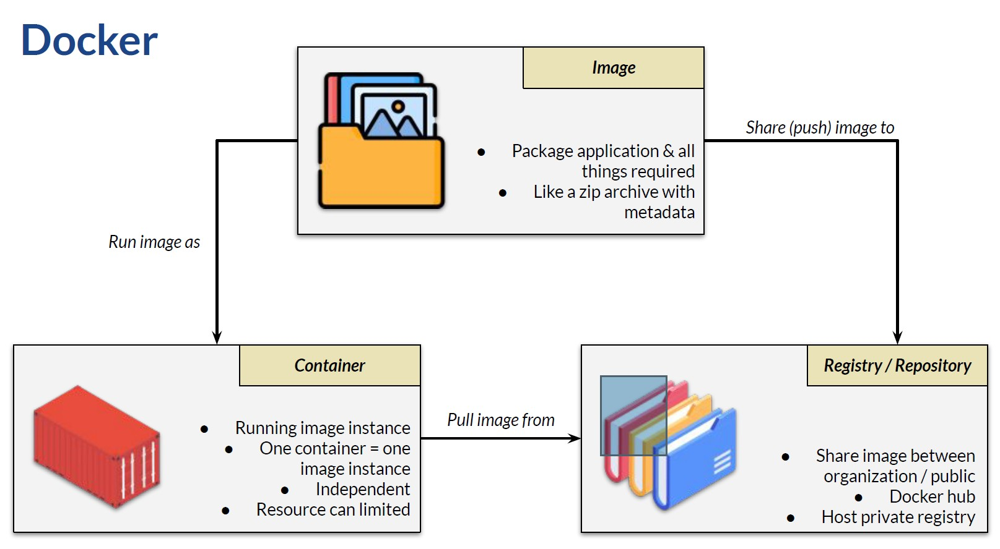
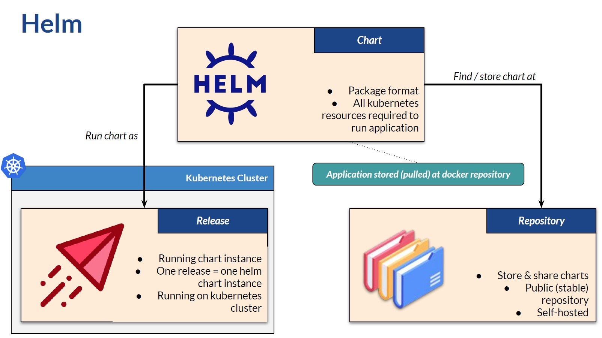
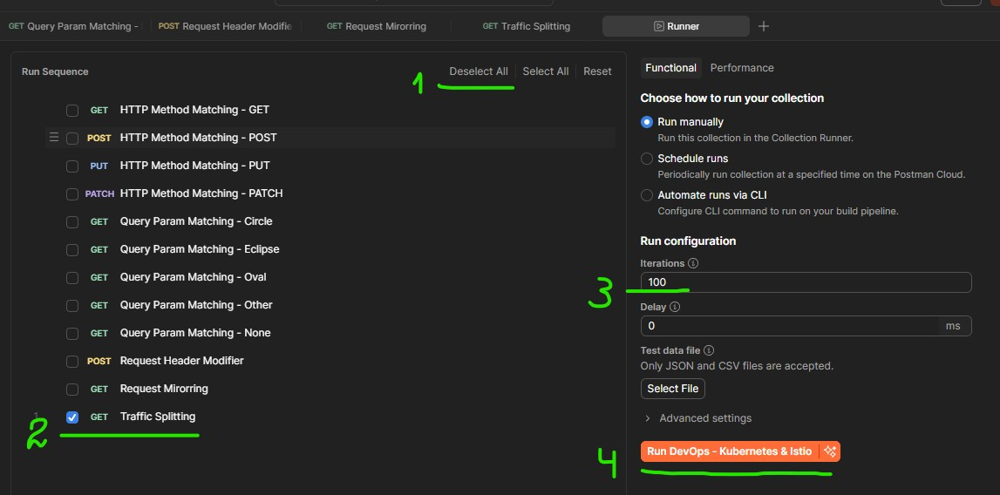
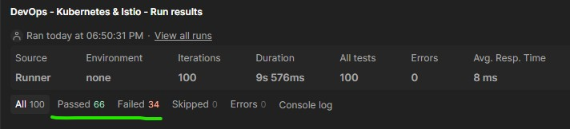
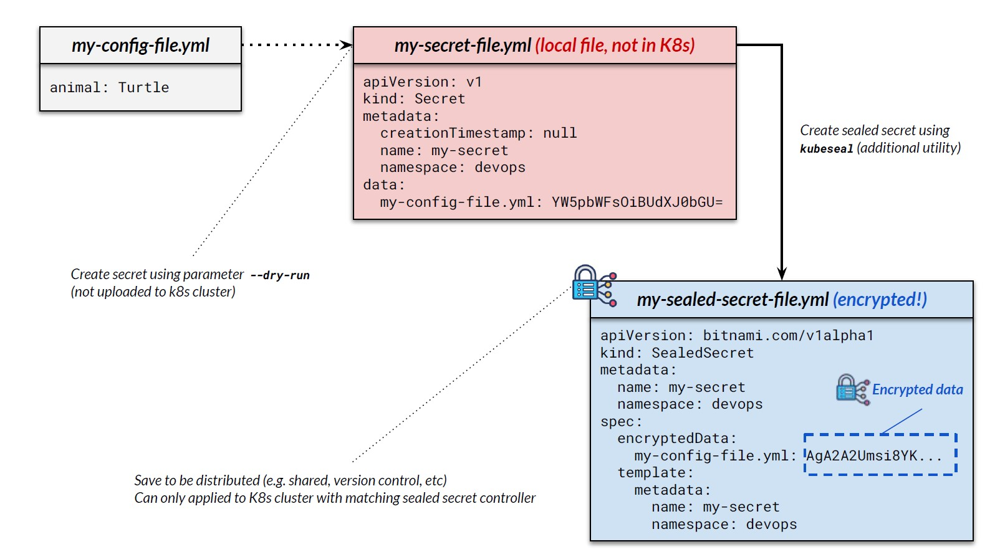
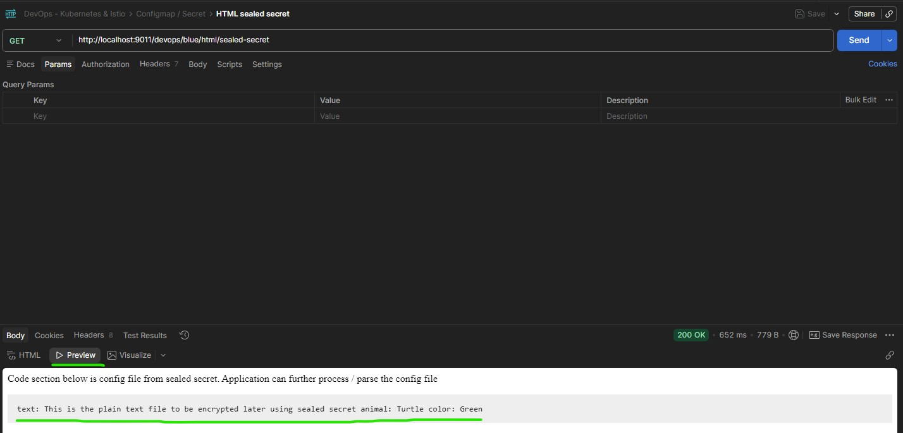

# Section 11 Helm - Kubernetes Package Manager

## Content
- 40 [Introducing Helm](#40-introducing-helm)
- 41 [Nginx Ingress Controller Retirement](#41-nginx-ingress-controller-retirement)
- 42 [Gateway API Theory](#42-gateway-api-theory)
- 43 [Gateway API Hands On](#43-gateway-api-hands-on)
- 44 [Gateway API Traffic Management](#44-gateway-api-traffic-management)
  - [deploy resources](#deploy-resources)
  - [method matching URLs](#method-matching-urls)
  - [method matching parameter](#method-matching-parameter)
  - [method header modifier](#method-header-modifier)
  - [method mirroring](#method-mirroring)
  - [method traffic splitting](#method-traffic-splitting)
- 45 [Sealed Secret](#45-sealed-secret)

Delete the previous minikube and start fresh Minikube cluster

    bash --> minikube delete
    bash --> minikube start --cpus 4 --memory 8192 --driver docker

Start minikube tunnel and don't close the terminal

    bash --> minikube tunnel

## 40 Introducing Helm
[⬆ Back to top](#top)

A more complex application requires multiple Docker containers working together. Consider a WordPress application that requires MySQL to be functional. So we need to install the MySQL and WordPress containers and configure them to work together. Seems familiar? It requires container orchestration. We already saw the demo on Docker Compose. Kubernetes is a more powerful orchestrator compared to Docker Compose. Remember, in Kubernetes, we can have multiple containers in a pod, which works as a single entity. Multiple containers across multiple pods might act together as a complex system. It is a powerful feature, but installing and configuring pods to work together can be tedious. Fortunately, there is Helm. Helm is a package manager for Kubernetes that makes it easier to find, use, and even share applications. Helm helps us a lot with installing, configuring, and managing applications in a Kubernetes cluster.

We saw thisdiagram when we learned about Docker. 




Helm also contains three nodes with similar functionality, using a different term.  Helm package application using a Helm chart. A Helm chart contains all Kubernetes resources required to run applications. Think of a chart as equivalent to a Linux package manager (such as APT) or Windows (such as Chocolatey). Helm charts are stored and shared using a Helm repository. When we need to install something, we can find the chart repository. We can use the public Helm repository, usually known as the Helm stable repository. Some providers might host their own repository. We can even easily host a Helm repository. When we run a Helm chart inside a Kubernetes cluster, we create a release. For example, when we run two WordPress Helm charts on a Kubernetes cluster, it means we have two WordPress releases. Notice that there is no connection between release and repository. Behind the scenes, Helm is a Kubernetes application resource, and the application is a container pulled from the Docker repository, not the Helm chart repository.



To start using Helm, we need to install it - https://helm.sh/docs/v2/using_helm/install/. Go to the Helm website and follow the installation guide. The easiest way is to use an Operating system package manager, such as Brew on Mac or Chocolatey on Windows. Helm also provides a binary installation guide. The installation is straightforward, as explained in the documentation. When finished, check the installation by typing "helm version" in the terminal.

    CMD --> helm version

    # result:
    version.BuildInfo{Version:"v4.0.1", GitCommit:"12500dd401faa7629f30ba5d5bff36287f3e94d3", GitTreeState:"clean", GoVersion:"go1.25.4", KubeClientVersion:"v1.34"}

A good place to start looking for a Helm chart is Artifact Hub - https://artifacthub.io/. Try to find Jenkins or any other application we need. There are many Jenkins charts. Let's use the one from the official provider - https://artifacthub.io/packages/helm/jenkinsci/jenkins. Thensee the install link.

    CMD --> helm repo add jenkinsci https://charts.jenkins.io/

    # result: "jenkinsci" has been added to your repositories

    CMD --> helm repo list

    # result:
    NAME                    URL
    bitnami                 https://charts.bitnami.com/bitnami
    jenkinsci               https://charts.jenkins.io/


    CMD --> helm install my-jenkins jenkinsci/jenkins --version 5.9.2

    # result:
    NAME: my-jenkins
    LAST DEPLOYED: Thu Mar  5 11:22:44 2026
    NAMESPACE: default
    STATUS: deployed
    REVISION: 1
    DESCRIPTION: Install complete
    NOTES:
    1. Get your 'admin' user password by running:
    kubectl exec --namespace default -it svc/my-jenkins -c jenkins -- /bin/cat /run/secrets/additional/chart-admin-password && echo
    2. Get the Jenkins URL to visit by running these commands in the same shell:
    echo http://127.0.0.1:8080
    kubectl --namespace default port-forward svc/my-jenkins 8080:8080

    3. Login with the password from step 1 and the username: admin
    4. Configure security realm and authorization strategy
    5. Use Jenkins Configuration as Code by specifying configScripts in your values.yaml file, see documentation: http://127.0.0.1:8080/configuration-as-code and examples: https://github.com/jenkinsci/configuration-as-code-plugin/tree/master/demos

    For more information on running Jenkins on Kubernetes, visit:
    https://cloud.google.com/solutions/jenkins-on-container-engine

    For more information about Jenkins Configuration as Code, visit:
    https://jenkins.io/projects/jcasc/


    NOTE: Consider using a custom image with pre-installed plugins

First, we must add the repo. Check that the repository now exists. Then we can install the release from the newly added chart. This step will install Jenkins with the release name my-jenkins. Behind the screen, this will create all resources under the releasename my-jenkins. For example, check the pod and we will see there is a pod named my-jenkins. 

    CMD --> kubectl get pods

    # result:
    NAME           READY   STATUS    RESTARTS   AGE
    my-jenkins-0   2/2     Running   0          2m12s

We can also see a list of releases by using this command.

    CMD --> helm list

    # result:
    NAME            NAMESPACE       REVISION        UPDATED                                 STATUS          CHART           APP VERSION
    my-jenkins      default         1               2026-03-05 11:22:44.6002045 +0200 EET   deployed        jenkins-5.9.2   2.541.2

Wait a while until the pods become ready. Then follow the on-screen instructions to confirm that Jenkins is installed.

    CMD --> kubectl exec --namespace default -it svc/my-jenkins -c jenkins -- /bin/cat /run/secrets/additional/chart-admin-password && echo

    # result: <PASSWORD> is on.

    CMD --> echo http://127.0.0.1:8080

    # result: http://127.0.0.1:8080

    CMD --> kubectl --namespace default port-forward svc/my-jenkins 8080:8080

    # result:
    Forwarding from 127.0.0.1:8080 -> 8080
    Forwarding from [::1]:8080 -> 8080

    Dont close the terminal !!!

We can now access jenkins on http://127.0.0.1:8080

To removethe release, use Helm's uninstall command.

    CMD --> helm uninstall my-jenkins

    # result: release "my-jenkins" uninstalled

We can use Helm to install, share, and even create our own Helm chart. Hosting a Helm repository is even easier. We can host using cloud storage or dedicated repository tools. In this lesson, we learn the basic usage, as we will use Helm for installing some tools in the next lesson. 

Another sample is for deploying the HAProxy ingress controller. First, ensure the minikube ingress addon is disabled. 

    CMD --> minikube addons disable ingress

    # result: * "The 'ingress' addon is disabled

Then we can install using Helm. Find the HAProxy on the artifacthub - https://artifacthub.io/packages/helm/haproxytech/haproxy. Then use the helm command to install it. Install it with the name "HAproxyingress", in the namespace "HAProxy", creatingthe namespace if it does not exist. 

    CMD --> helm repo add haproxytech https://haproxytech.github.io/helm-charts

    # result: "haproxytech" has been added to your repositories


    CMD --> helm install haproxy-ingress haproxytech/haproxy -n haproxy --create-namespace

    # result:
    level=WARN msg="unable to find exact version; falling back to closest available version" chart=haproxy requested="" selected=1.28.0
    NAME: haproxy-ingress
    LAST DEPLOYED: Thu Mar  5 11:41:35 2026
    NAMESPACE: haproxy
    STATUS: deployed
    REVISION: 1
    DESCRIPTION: Install complete
    TEST SUITE: None
    NOTES:
    HAProxy has been has been successfully installed. This Chart is used to run HAProxy as a regular application,
    as opposed to HAProxy Ingress Controller Chart.

    Controller image deployed is: "docker.io/haproxytech/haproxy-alpine:3.3.1".
    Your HAProxy app is of a "Deployment" kind.

    Service ports mapped are:
    - name: http
        containerPort: 80
        protocol: TCP
    - name: https
        containerPort: 443
        protocol: TCP
    - name: stat
        containerPort: 1024
        protocol: TCP

    To be able to bind to privileged ports as non-root, the following is required:

    securityContext:
    enabled: true
    runAsUser: 1000
    runAsGroup: 1000
    initContainers:
    - name: sysctl
        image: "busybox:musl"
        command:
        - /bin/sh
        - -c
        - sysctl -w net.ipv4.ip_unprivileged_port_start=0
        securityContext:
        privileged: true

    Node IP can be found with:
    $ kubectl --namespace haproxy get nodes -o jsonpath="{.items[0].status.addresses[1].address}"

    For more examples and up to date documentation, please visit:
    * Helm chart documentation: https://github.com/haproxytech/helm-charts/tree/main/haproxy
    * HAProxy Alpine Docker container documentation: https://github.com/haproxytech/haproxy-docker-alpine
    * HAProxy documentation: https://www.haproxy.org/download/2.7/doc/configuration.txt

Check that the HAProxy service is now available.

    bash --> kubectl get pods -n haproxy

    # result:
    NAME                               READY   STATUS    RESTARTS   AGE
    haproxy-ingress-7f8ccbc546-hx24n   1/1     Running   0          77s

[⬆ Back to top](#top)


## 41 Nginx Ingress Controller Retirement
[⬆ Back to top](#top)

The Nginx Ingress Controller is officially retired in early 2026 and will no longer be updated, including no security patches. However, Nginx was very popular and widely used, so companies might take some time to migrate away from it. The migration might target the gateway API or the ingress controller from another provider, such as HAProxy or Traefik.

We will learn more about the Gateway API soon. The course includes lessons on Nginx because it is widely used and you might still encounter it in your workplace, so the course provides the information. As an alternative to Nginx, the course will also provide some examples of the HAProxy ingress controller.

First, we need to install the HA Proxy ingress controller using Helm. Go to the artifact hub, find the HAProxy Kubernetes ingress, and install it - https://artifacthub.io/packages/helm/haproxytech/kubernetes-ingress.

Ensure there is no helm release named "haproxy-ingress" in the "haproxy" namespace.

    CMD --> helm uninstall haproxy-ingress -n haproxy

    # result: release "haproxy-ingress" uninstalled

Let's install the HAProxy ingress controller in the haproxy namespace and create a load balancer service accessible from localhost.

    CMD --> helm repo add haproxytech https://haproxytech.github.io/helm-charts

    CMD --> helm upgrade --install haproxy-ingress haproxytech/kubernetes-ingress -n haproxy --create-namespace --set controller.service.type=LoadBalancer --set controller.ingressClass=haproxy

    # result:
    Release "haproxy-ingress" does not exist. Installing it now.
    level=WARN msg="unable to find exact version; falling back to closest available version" chart=kubernetes-ingress requested="" selected=1.49.0
    NAME: haproxy-ingress
    LAST DEPLOYED: Thu Mar  5 11:53:13 2026
    NAMESPACE: haproxy
    STATUS: deployed
    REVISION: 1
    DESCRIPTION: Install complete
    TEST SUITE: None
    NOTES:
    HAProxy Kubernetes Ingress Controller has been successfully installed.

    Controller image deployed is: "docker.io/haproxytech/kubernetes-ingress:3.2.6".
    Your controller is of a "Deployment" kind. Your controller service is running as a "LoadBalancer" type.
    RBAC authorization is enabled.
    Controller ingress.class is set to "haproxy" so make sure to use same annotation for
    Ingress resource.

    Service ports mapped are:
    - name: admin
        containerPort: 6060
        protocol: TCP
    - name: http
        containerPort: 8080
        protocol: TCP
    - name: https
        containerPort: 8443
        protocol: TCP
    - name: stat
        containerPort: 1024
        protocol: TCP
    - name: quic
        containerPort: 8443
        protocol: UDP

    Node IP can be found with:
    $ kubectl --namespace haproxy get nodes -o jsonpath="{.items[0].status.addresses[1].address}"

    The following ingress resource routes traffic to pods that match the following:
    * service name: web
    * client's Host header: webdemo.com
    * path begins with /

    ---
    apiVersion: networking.k8s.io/v1
    kind: Ingress
    metadata:
        name: web-ingress
        namespace: default
        annotations:
        ingress.class: "haproxy"
    spec:
        rules:
        - host: webdemo.com
        http:
            paths:
            - path: /
            backend:
                serviceName: web
                servicePort: 80

    In case that you are using multi-ingress controller environment, make sure to use ingress.class annotation and match it
    with helm chart option controller.ingressClass.

    For more examples and up to date documentation, please visit:
    * Helm chart documentation: https://github.com/haproxytech/helm-charts/tree/main/kubernetes-ingress
    * Controller documentation: https://www.haproxy.com/documentation/kubernetes/latest/
    * Annotation reference: https://github.com/haproxytech/kubernetes-ingress/tree/master/documentation
    * Image parameters reference: https://github.com/haproxytech/kubernetes-ingress/blob/master/documentation/controller.md

Ensure the load balancer service is created.

    CMD --> kubectl get service -n haproxy

    # result:
    NAME                                 TYPE           CLUSTER-IP     EXTERNAL-IP   PORT(S)                                                                  AGE
    haproxy-ingress-kubernetes-ingress   LoadBalancer   10.96.124.51   <pending>     80:31130/TCP,443:32232/TCP,443:32232/UDP,1024:31882/TCP,6060:31131/TCP   93s

Go to the ingress folder, and you will find several HAProxy ingress configuration files. Each HAProxy file is equivalent to the Nginx configuration we saw earlier in the lesson about the ingress controller. However, see the difference, especially in the ingress class name and annotation. There is no standardization for some aspects of an ingress controller, such as the annotation. Thus, to achieve the same functionality as the Nginx Ingress Controller, we must use a HAProxy-specific configuration.

First, execute the devops-ingress YML to create the blue and yellowpods and their cluster IP services.

    CMD --> kubectl apply -f devops-ingress.yml

    # result:
    namespace/devops created
    deployment.apps/devops-ingress-blue-deployment created
    deployment.apps/devops-ingress-yellow-deployment created
    service/devops-blue-clusterip created
    service/devops-yellow-clusterip created

The first HAProxy ingress configuration file creates a Kubernetes Ingress resource with HAProxy as the ingress controller. It defines two routes: /devops/blue forwards traffic to the devops-blue-clusterip service on port 8111, while /devops/yellow routes traffic to the devops-yellow-clusterip service on port 8112. The annotations set timeout values of 8 seconds for connections, server responses, and client requests.

ingress-haproxy-1.yml

```yaml
apiVersion: networking.k8s.io/v1
kind: Ingress
metadata:
  namespace: devops
  name: devops-ingress-haproxy
  labels:
    app.kubernetes.io/name: devops-ingress-haproxy
  annotations:
    haproxy.org/timeout-connect: "8s"
    haproxy.org/timeout-server: "8s"
    haproxy.org/timeout-client: "8s"
spec:
  ingressClassName: haproxy
  rules:
  - http:
      paths:
      - path: /devops/blue
        pathType: Prefix
        backend:
          service:
            name: devops-blue-clusterip
            port:
              number: 8111
      - path: /devops/yellow
        pathType: Prefix
        backend:
          service:
            name: devops-yellow-clusterip
            port:
              number: 8112
```

Apply this configuration.

    CMD --> kubectl apply -f ingress-haproxy-1.yml

    # result: ingress.networking.k8s.io/devops-ingress-haproxy created

Open Postman in theingress folder and ensure the route to the blue and yellow pods works as expected.

    Postman Collection / Ingress / GET Hello Blue - 1

    # result:
    Version [2.0.0] Hello from app [devops-blue running at 10.244.0.84] on k8s pod [devops-ingress-blue-deployment-69b7ff7d84-p8g9l]

    Postman Collection / Ingress / GET Hello Yellow - 1

    # result:
    Version [2.0.0] Hello from app [devops-yellow running at 10.244.0.85] on k8s pod [devops-ingress-yellow-deployment-79657dbd7c-j59tm]

Also, try simulating a long-running process with a delay of more than 8 seconds; it will return a timeout error.

    Postman Collection / Ingress / GET Delay Blue - 2
    Params / Path Variables / delay-seconds: 10

    # result:
    <html><body><h1>504 Gateway Time-out</h1>
    The server didn't respond in time.
    </body></html>


    Postman Collection / Ingress / GET Delay Yellow - 1
    Params / Path Variables / delay-seconds: 10

    # result:
    <html>

    <body>
        <h1>504 Gateway Time-out</h1>
        The server didn't respond in time.
    </body>

    </html>

Delete the ingress rules.

    CMD --> kubectl delete -f ingress-haproxy-1.yml

    # result: ingress.networking.k8s.io "devops-ingress-haproxy" deleted from devops namespace

The second HA Proxy configuration file is an example of path-based routing with path rewriting. Requests to /the-blue/anything are routed to the blue service on port 8111, while /the-yellow/anything goes to the yellow service on port 8112. The path-rewrite annotation strips the blue and the yellow prefixes before forwarding, so a request to /the-blue/api/something becomes /api/something at the backend. The ingress also configures 8-second timeouts.

ingress-haproxy-2.yml

```yaml
apiVersion: networking.k8s.io/v1
kind: Ingress
metadata:
  namespace: devops
  name: devops-ingress-haproxy
  labels:
    app.kubernetes.io/name: devops-ingress-haproxy
  annotations:
    haproxy.org/path-rewrite: "/the-blue/(.*) /\\1\n/the-yellow/(.*) /\\1"
    haproxy.org/timeout-connect: "8s"
    haproxy.org/timeout-server: "8s"
    haproxy.org/timeout-client: "8s"
spec:
  ingressClassName: haproxy
  rules:
  - http:
      paths:
      - path: /the-blue
        pathType: Prefix
        backend:
          service:
            name: devops-blue-clusterip
            port:
              number: 8111
      - path: /the-yellow
        pathType: Prefix
        backend:
          service:
            name: devops-yellow-clusterip
            port:
              number: 8112
```

Apply this ingress configuration.

    CMD --> kubectl apply -f ingress-haproxy-2.yml

    # result: ingress.networking.k8s.io/devops-ingress-haproxy created

Open Postman. Ensure that endpoint sample 2 for blue and yellow returns a successful response.

    Postman Collection / Ingress / GET Hello Blue - 2

    # result:
    Version [2.0.0] Hello from app [devops-blue running at 10.244.0.84] on k8s pod [devops-ingress-blue-deployment-69b7ff7d84-p8g9l]

    Postman Collection / Ingress / GET Hello Yellow - 2

    # result:
    Version [2.0.0] Hello from app [devops-yellow running at 10.244.0.85] on k8s pod [devops-ingress-yellow-deployment-79657dbd7c-j59tm]

Delete the ingress rules.

    CMD --> kubectl delete -f ingress-haproxy-2.yml

    # result: ingress.networking.k8s.io "devops-ingress-haproxy" deleted from devops namespace

The third configuration file uses host-based routing by creating two separate ingress resources, each handling a different hostname. Requests to blue.devops.local are routed to the blue service on port 8111, while requests to yellow.devops.local are routed to the yellow service on port 8112.

ingress-haproxy-3.yml

```yaml
apiVersion: networking.k8s.io/v1
kind: Ingress
metadata:
  namespace: devops
  name: devops-ingress-haproxy-host-blue
  labels:
    app.kubernetes.io/name: devops-ingress-haproxy
spec:
  ingressClassName: haproxy
  rules:
  - host: blue.devops.local
    http:
      paths:
      - path: /
        pathType: Prefix
        backend:
          service:
            name: devops-blue-clusterip
            port:
              number: 8111

---

apiVersion: networking.k8s.io/v1
kind: Ingress
metadata:
  namespace: devops
  name: devops-ingress-haproxy-host-yellow
  labels:
    app.kubernetes.io/name: devops-ingress-haproxy
spec:
  ingressClassName: haproxy
  rules:
  - host: yellow.devops.local
    http:
      paths:
      - path: /
        pathType: Prefix
        backend:
          service:
            name: devops-yellow-clusterip
            port:
              number: 8112
```

Apply this ingress configuration. 

    CMD --> kubectl apply -f ingress-haproxy-3.yml

    # result: 
    ingress.networking.k8s.io/devops-ingress-haproxy-host-blue created
    ingress.networking.k8s.io/devops-ingress-haproxy-host-yellow created

Ensure you have already set the local hostname in the host file. See the ingress controller lesson if you need to refresh your understanding of the how-to.

Add host address to Windows host list
- Open PowerShell as Admin

		terminal --> notepad C:\Windows\System32\drivers\etc\hosts

- add 
  
    ```text
    127.0.0.1 blue.devops.local
    127.0.0.1 yellow.devops.local
    127.0.0.1 api.devops.local
    127.0.0.1 monitoring.devops.local
    127.0.0.1 rabbitmq.devops.local
    127.0.0.1 chartmuseum.devops.local
    127.0.0.1 argocd.devops.local
    ```

- save the file and exit

Open Postman. Ensure that endpoint sample 3 for blueand yellow returns a successful response.

    Postman Collection / Ingress / GET Echo Blue - 3

    # result:
    Protocol : HTTP/1.1 (via plain HTTP)

    Path : /api/echo

    Method : GET

    Headers :

    user-agent : PostmanRuntime/7.52.0
    accept : */*
    cache-control : no-cache
    postman-token : 5f5ce3d6-67f7-481b-ba20-c65f55cc73f3
    host : blue.devops.local
    accept-encoding : gzip, deflate, br

    Cookies : null

    Parameters :

    Body : null


    Postman Collection / Ingress / GET Echo Yellow - 3

    # result:
    Protocol : HTTP/1.1 (via plain HTTP)

    Path : /api/echo

    Method : GET

    Headers :

    user-agent : PostmanRuntime/7.52.0
    accept : */*
    cache-control : no-cache
    postman-token : adba1bd9-73e6-406f-b793-120954b6a58c
    host : yellow.devops.local
    accept-encoding : gzip, deflate, br

    Cookies : null

    Parameters :

    Body : null


Delete the ingress rules.

    CMD --> kubectl delete -f ingress-haproxy-3.yml

    # result:
    ingress.networking.k8s.io "devops-ingress-haproxy-host-blue" deleted from devops namespace
    ingress.networking.k8s.io "devops-ingress-haproxy-host-yellow" deleted from devops namespace

The fourth configuration file combines host-based and path-based routing in a single resource using one hostname. All traffic comes through "api dot devops dot local", but the ingress routes requests based on path prefixes: /devops/blue goes to the blue service on port 8111, and /devops/yellow goes to the yellow service on port 8112. There is no path rewriting annotation, so the full path (including /devops/blue or /devops/yellow) is forwarded to the backend services.

ingress-haproxy-4.yml

```yaml
apiVersion: networking.k8s.io/v1
kind: Ingress
metadata:
  namespace: devops
  name: devops-ingress-haproxy-host-single
  labels:
    app.kubernetes.io/name: devops-ingress-haproxy
spec:
  ingressClassName: haproxy
  rules:
  - host: api.devops.local
    http:
      paths:
      - path: /devops/blue
        pathType: Prefix
        backend:
          service:
            name: devops-blue-clusterip
            port:
              number: 8111
      - path: /devops/yellow
        pathType: Prefix
        backend:
          service:
            name: devops-yellow-clusterip
            port:
              number: 8112
              
```

Apply this ingress configuration.

    CMD --> kubectl apply -f ingress-haproxy-4.yml

    # result: ingress.networking.k8s.io/devops-ingress-haproxy-host-single created

Open Postman. Ensure that endpoint sample 4 for blue and yellow returns a successful response.

    Postman Collection / Ingress / GET Echo Blue - 4

    # result:
    Protocol : HTTP/1.1 (via plain HTTP)

    Path : /api/echo

    Method : GET

    Headers :

    user-agent : PostmanRuntime/7.52.0
    accept : */*
    cache-control : no-cache
    postman-token : 058dd31b-3308-4bbb-a8e1-f9237346b520
    host : api.devops.local
    accept-encoding : gzip, deflate, br

    Cookies : null

    Parameters :

    Body : null


    Postman Collection / Ingress / GET Echo Yellow - 4

    # result:
    Protocol : HTTP/1.1 (via plain HTTP)

    Path : /api/echo

    Method : GET

    Headers :

    user-agent : PostmanRuntime/7.52.0
    accept : */*
    cache-control : no-cache
    postman-token : 2f4b31d2-0aee-4e45-8397-3e55cbd5d64f
    host : api.devops.local
    accept-encoding : gzip, deflate, br

    Cookies : null

    Parameters :

    Body : null

Delete all HA Proxy and deployment configurations.

    CMD --> kubectl delete -f devops-ingress.yml

    # result:
    namespace "devops" deleted
    deployment.apps "devops-ingress-blue-deployment" deleted from devops namespace
    deployment.apps "devops-ingress-yellow-deployment" deleted from devops namespace
    service "devops-blue-clusterip" deleted from devops namespace
    service "devops-yellow-clusterip" deleted from devops namespace

Let's see how HAProxy handles TLS. 

    CMD --> kubectl create secret tls api-devops-local-cert --key C:\Users\user_name\Downloads\api-devops.local-privateKey.key --cert C:\Users\user_name\Downloads\api-devops.local.crt

    # result: secret/api-devops-local-cert created

###### return point 1

Ensure the TLS certificate has already been installed in your minikube. If you need to know how, please see the previous lesson about [Ingress over TLS](../Section%2010%20Exposing%20Kubernetes%20Pod/Section%2010%20Exposing%20Kubernetes%20Pod%20Notes.md#39-ingress-over-tls)

Navigate to the "ingress-tls" folder in the resources, and run the devops-ingress file, which contains deployments and cluster IP services for the blue and yellow pods. 

    CMD --> kubectl apply -f devops-ingress.yml

    # result:
    namespace/devops created
    deployment.apps/devops-ingress-tls-blue-deployment created
    deployment.apps/devops-ingress-tls-yellow-deployment created
    service/devops-blue-clusterip created
    service/devops-yellow-clusterip created

Wait 80 seconds and check the pods

    CMD --> kubectl get pods -n devops

    # result:
    NAME                                                    READY   STATUS    RESTARTS   AGE
    devops-ingress-tls-blue-deployment-7b778fdb8d-d7nvb     1/1     Running   0          84s
    devops-ingress-tls-yellow-deployment-5ddbf6ff77-cmbrz   1/1     Running   0          84s

Check the YML file for TLS over HAProxy. This Kubernetes Ingress configures HAProxy to handle HTTPS traffic for "api dot devops dot local" with automatic HTTP-to-HTTPS redirection on port 443. The TLS certificate is stored in the api-devops-local-cert Secret and secures all traffic to the host. For routing, requests to /devops/blue are forwarded to the devops-blue-clusterip service on port 8111, while /devops/yellow routes to devops-yellow-clusterip on port 8112.

ingress-haproxy-tls.yml

```yaml
apiVersion: networking.k8s.io/v1
kind: Ingress
metadata:
  namespace: devops
  name: devops-ingress-tls-haproxy
  labels:
    app.kubernetes.io/name: devops-ingress-tls-haproxy
  annotations:
    haproxy.org/ssl-redirect: "true"
    haproxy.org/ssl-redirect-port: "443"
spec:
  ingressClassName: haproxy
  tls:
    - secretName: api-devops-local-cert
      hosts:
        - api.devops.local
  rules:
  - host: api.devops.local
    http:
      paths:
      - path: /devops/blue
        pathType: Prefix
        backend:
          service:
            name: devops-blue-clusterip
            port:
              number: 8111
      - path: /devops/yellow
        pathType: Prefix
        backend:
          service:
            name: devops-yellow-clusterip
            port:
              number: 8112
```

Apply the ingress configuration.

    CMD --> kubectl apply -f ingress-haproxy-tls.yml

    # result: ingress.networking.k8s.io/devops-ingress-tls-haproxy created

 Open Postman in the ingress TLS folder. Ensure the blue endpoint runs using HTTPS. Ensure the yellow endpoint runs even when accessed via plain HTTP, which HAProxy automatically redirects to HTTPS.

REQUEST: Postman Collection / Ingress - TLS / GET Echo Blue - TLS - https://api.devops.local/devops/blue/api/echo

    # result:
    Protocol : HTTP/1.1 (via secure TLS / HTTPS)

    Path : /api/echo

    Method : GET

    Headers :

    host : api.devops.local
    user-agent : PostmanRuntime/7.52.0
    accept : */*
    cache-control : no-cache
    postman-token : d1547d5a-26de-48bb-b725-8712f3c14ad2
    accept-encoding : gzip, deflate, br
    x-forwarded-proto : https                                   # uses https

    Cookies : null

    Parameters :

    Body : null


REQUEST: Postman Collection / Ingress - TLS / GET Echo Yellow - TLS - http://api.devops.local/devops/yellow/api/echo

    # result:
    Protocol : HTTP/1.1 (via secure TLS / HTTPS)

    Path : /api/echo

    Method : GET

    Headers :

    host : api.devops.local
    user-agent : PostmanRuntime/7.52.0
    accept : */*
    cache-control : no-cache
    postman-token : 9b7b486d-472b-46a0-bfdc-6ce038e4b8d4
    accept-encoding : gzip, deflate, br
    referer : http://api.devops.local/devops/yellow/api/echo
    x-forwarded-proto : https                                   # uses https

    Cookies : null

    Parameters :

    Body : null

Delete the ingress rules

    CMD --> kubectl delete -f ingress-haproxy-tls.yml

    # result: ingress.networking.k8s.io "devops-ingress-tls-haproxy" deleted from devops namespace

    CMD --> kubectl delete -f devops-ingress.yml

    # result:
    namespace "devops" deleted
    deployment.apps "devops-ingress-tls-blue-deployment" deleted from devops namespace
    deployment.apps "devops-ingress-tls-yellow-deployment" deleted from devops namespace
    service "devops-blue-clusterip" deleted from devops namespace
    service "devops-yellow-clusterip" deleted from devops namespace

[⬆ Back to top](#top)


## 42 Gateway API Theory
[⬆ Back to top](#top)

Ingress controllers provide a centralized way to manage external access to services running in a Kubernetes cluster, primarily focusing on HTTP and HTTPS traffic at Layer 7 of the network. However, the Ingress controller has several limitations. It only covers HTTP or HTTPS traffic, with basic features such as TLS termination and simple content-based routing. It relies heavily on annotations for extensibility. This annotation-based approach has created significant problems. Each Ingress controller implementation uses its own vendor-specific annotations, making it difficult or impossible to switch between controllers. Advanced features like traffic splitting also require custom annotations that vary by provider, and are not always supported by a particular provider. 

While ingress controller mechanisms have long been widely used to expose HTTP applications in Kubernetes, the Gateway API is emerging as a more flexible and future-ready alternative. Gateway API addresses the Ingress controller's limitations through a fundamentally different design. While Ingress only supports HTTP and HTTPS, Gateway API natively supports both Layer 4 protocols like TCP and UDP, as well as Layer 7 protocols, including HTTP, HTTPS, and gRPC. The Gateway API defines a common set of Kubernetes objects that all compliant gateway API implementations must support, enabling users to switch between implementations with reduced migration costs and eliminating vendor lock-in. Gateway API includes native support for features beyond simple routing, such as request mirroring, traffic splitting, header-based matching, and fine-grained traffic metrics without requiring provider-specific annotations. 

Gateway API introduces three distinct resource types that map to organizational roles:
- Gateway: Owned by cluster operators, defining the actual traffic handling infrastructure instance.
- GatewayClass: Managed by infrastructure providers, defining the type of load balancer or proxy.
- Routes: Managed by application developers, defining routing rules for specific services.

Several providers already have the Gateways API implementation. Many of them are well-known players, such as Nginx, Traefik, or Istio. The Kubernetes project has officially frozen Ingress development, with all new networking features being added to the Gateway API. However, it is important to emphasize that moving to the Gateway API is a "strong recommendation," not a "mandatory requirement." The Kubernetes community recommends using the Gateway API because it is better aligned with the future networking direction.

However, Ingress is not being forcefully removed in the near term. Kubernetes Clusters running Ingress-based architectures will continue to function, and for many workloads (especially simple HTTP routing), the Ingress API still works reliably. Organizations can adopt the Gateway API gradually, run both models side by side during the transition, or even keep using Ingress for smaller or legacy systems.

The recommendation to migrate becomes a strong candidate in these scenarios. Our applications require advanced traffic management features, including weighted traffic splitting, header-based routing, traffic mirroring, and retry policies. For new deployments or greenfield projects, choosing Gateway API from the start makes sense, given that the future direction is toward Gateway API.

[⬆ Back to top](#top)


## 43 Gateway API Hands On
[⬆ Back to top](#top)

Nginx is a high-performance web server and reverse proxy widely used for traffic routing, load balancing, and TLS termination. It is developed and maintained by a company named F5, which also provides multiple Kubernetes networking solutions built on top of the Nginx core. In Kubernetes, F5 offers two different products: Nginx Ingress Controller and Nginx Gateway Fabric. While both use Nginx under the hood, they target different Kubernetes APIs and serve different purposes. 

- The Nginx Ingress Controller implements the Kubernetes Ingress API. It is mature and widely adopted, but constrained by the Ingress design. F5 officially freezes the Nginx Ingress Controller development in early 2026. 
- The Nginx Gateway Fabric implements the newer Gateway API, which is designed as the successor to ingress.

Although both products come from the same vendor (F5), they are separate and not interchangeable. In this lesson, we will use Nginx Gateway Fabric to learn how to manage Kubernetes traffic using the Gateway API. 

Navigate to the artifact hub and find the Nginx gateway fabric - artifacthub.io/packages/helm/nginx-gateway-fabric/nginx-gateway-fabric. See the documentation. Here, it states that wemust first install the Gateway API resources before installing the Gateway API itself. 

Open a terminal. Copy and paste the syntax to create the Gateway API resources.

    CMD --> kubectl kustomize https://github.com/nginx/nginx-gateway-fabric/config/crd/gateway-api/standard | kubectl apply -f -

    # result:
    customresourcedefinition.apiextensions.k8s.io/backendtlspolicies.gateway.networking.k8s.io created
    customresourcedefinition.apiextensions.k8s.io/gatewayclasses.gateway.networking.k8s.io created
    customresourcedefinition.apiextensions.k8s.io/gateways.gateway.networking.k8s.io created
    customresourcedefinition.apiextensions.k8s.io/grpcroutes.gateway.networking.k8s.io created
    customresourcedefinition.apiextensions.k8s.io/httproutes.gateway.networking.k8s.io created
    customresourcedefinition.apiextensions.k8s.io/listenersets.gateway.networking.k8s.io created
    customresourcedefinition.apiextensions.k8s.io/referencegrants.gateway.networking.k8s.io created
    customresourcedefinition.apiextensions.k8s.io/tlsroutes.gateway.networking.k8s.io created
    validatingadmissionpolicy.admissionregistration.k8s.io/safe-upgrades.gateway.networking.k8s.io created
    validatingadmissionpolicybinding.admissionregistration.k8s.io/safe-upgrades.gateway.networking.k8s.io created

Then install the gateway API in the nginx-gateway namespace, creating it if it does not exist yet.

    CMD --> helm upgrade --install my-nginx-gateway-api oci://ghcr.io/nginx/charts/nginx-gateway-fabric --create-namespace -n nginx-gateway

    # result:
    Release "my-nginx-gateway-api" does not exist. Installing it now.
    Pulled: ghcr.io/nginx/charts/nginx-gateway-fabric:2.4.2
    Digest: sha256:dc86ff2fad1f5f000cab6bf0d953f7a3c1347550834c41249798c670414ecc1a
    NAME: my-nginx-gateway-api
    LAST DEPLOYED: Thu Mar  5 14:31:17 2026
    NAMESPACE: nginx-gateway
    STATUS: deployed
    REVISION: 1
    DESCRIPTION: Install complete
    TEST SUITE: None

Ensure that a service with type cluster IP is created in the nginx-gateway namespace.

    CMD --> kubectl get service -n nginx-gateway

    # result:
    NAME                                        TYPE        CLUSTER-IP       EXTERNAL-IP   PORT(S)   AGE
    my-nginx-gateway-api-nginx-gateway-fabric   ClusterIP   10.110.225.209   <none>        443/TCP   65s

###### return point 2

The configuration will require a TLS certificate to be defined in the devops namespace. Thus, you must ensure that the secret already exists in the devops namespace. We can obtain the self-service certificate, as shown in the lesson on [Ingress over TLS](../Section%2010%20Exposing%20Kubernetes%20Pod/Section%2010%20Exposing%20Kubernetes%20Pod%20Notes.md#39-ingress-over-tls)

    CMD --> kubectl create namespace devops

    # result: namespace/devops created

    CMD --> kubectl create secret tls api-devops-local-cert --key C:\Users\user_name\Downloads\api-devops.local-privateKey.key --cert C:\Users\user_name\Downloads\api-devops.local.crt -n devops

    # result: secret/api-devops-local-cert created

Ensure we create the Kubernetes secret in the devops namespace.

    CMD --> kubectl get secret -n devops

    # result:
    NAME                    TYPE                DATA   AGE
    api-devops-local-cert   kubernetes.io/tls   2      59s

Navigate to the course resource, folder "gateway API". Open the devops-gateway-api-class YML file - devops-gateway-api-class.yml. This Kubernetes configuration defines a namespace: devops. The thing related to Gateway API setup is a Gateway resource named "devops-gateway" that serves as an entry point for traffic into the cluster. The Gateway uses the nginx gateway class and defines two listeners: one for HTTP traffic on port 80 and another for HTTPS traffic on port 443. The HTTP listener accepts unencrypted traffic, while the HTTPS listener is configured specifically for the hostname "api.devops.local" with TLS termination enabled. The HTTPS listener references a Kubernetes Secret named "api-devops-local-cert" that contains the SSL/TLS certificate for securing the connection. Both listeners restrict route attachments to routes within the same namespace (the devops namespace) via the "allowedRoutes" configuration. This Gateway acts as an entry point for traffic into the cluster, handling SSL termination and routing requests to backend services defined by HTTPRoute resources that reference this Gateway. The "Same" setting for allowedRoutes means that only HTTPRoute resources in the same namespace (devops) are allowed to use this Gateway.

devops-gateway-api-class.yml

```yaml
apiVersion: v1
kind: Namespace
metadata:
  name: devops

---

apiVersion: gateway.networking.k8s.io/v1
kind: Gateway
metadata:
  name: devops-gateway
  namespace: devops
spec:
  gatewayClassName: nginx
  listeners:
  - name: http
    port: 80
    protocol: HTTP
    allowedRoutes:
      namespaces:
        from: Same
  - name: https
    port: 443
    protocol: HTTPS
    hostname: api.devops.local
    tls:
      mode: Terminate
      certificateRefs:
      - kind: Secret
        name: api-devops-local-cert
    allowedRoutes:
      namespaces:
        from: Same
```

Apply this file.

    CMD --> kubectl apply -f devops-gateway-api-class.yml

    # result:
    Warning: resource namespaces/devops is missing the kubectl.kubernetes.io/last-applied-configuration annotation which is required by kubectl apply. kubectl apply should only be used on resources created declaratively by either kubectl create --save-config or kubectl apply. The missing annotation will be patched automatically.
    namespace/devops configured
    gateway.gateway.networking.k8s.io/devops-gateway created

In the "gateway API" folder, there is a YML file "devops-gateway-api-app" that contains the blue and yellow application, and their cluster IP services.

devops-gateway-api-app.yml

```yaml
apiVersion: v1
kind: Namespace
metadata:
  name:  devops

---

apiVersion: apps/v1
kind: Deployment
metadata:
  namespace: devops
  name: devops-gateway-api-blue-deployment
  labels:
    app.kubernetes.io/name: devops-gateway-api-blue
spec:
  selector:
    matchLabels:
      app.kubernetes.io/name: devops-gateway-api-blue
  template:
    metadata:
      labels:
        app.kubernetes.io/name: devops-gateway-api-blue
        app.kubernetes.io/version: 2.0.0
    spec:
      containers:
      - name: devops-blue
        image: timpamungkas/devops-blue:2.0.0
        resources:
          limits:
            cpu: "0.3"
            memory: 200M
        ports:
        - name:  http
          containerPort: 8111
          protocol: TCP
        readinessProbe:
          httpGet:
            path: /devops/blue/actuator/health/readiness
            port: 8111
            scheme: HTTP
          initialDelaySeconds: 60
          periodSeconds: 30
          timeoutSeconds: 5
          failureThreshold: 5
        livenessProbe:
          httpGet:
            path: /devops/blue/actuator/health/liveness
            port: 8111
            scheme: HTTP
          initialDelaySeconds: 60
          periodSeconds: 30
          timeoutSeconds: 5
          failureThreshold: 5
  replicas: 1

---

apiVersion: apps/v1
kind: Deployment
metadata:
  namespace: devops
  name: devops-gateway-api-yellow-deployment
  labels:
    app.kubernetes.io/name: devops-gateway-api-yellow
spec:
  selector:
    matchLabels:
      app.kubernetes.io/name: devops-gateway-api-yellow
  template:
    metadata:
      labels:
        app.kubernetes.io/name: devops-gateway-api-yellow
        app.kubernetes.io/version: 2.0.0
    spec:
      containers:
      - name: devops-yellow
        image: timpamungkas/devops-yellow:2.0.0
        resources:
          limits:
            cpu: "0.3"
            memory: 200M
        ports:
        - name:  http
          containerPort: 8112
          protocol: TCP
        readinessProbe:
          httpGet:
            path: /devops/yellow/actuator/health/readiness
            port: 8112
            scheme: HTTP
          initialDelaySeconds: 60
          periodSeconds: 30
          timeoutSeconds: 5
          failureThreshold: 5
        livenessProbe:
          httpGet:
            path: /devops/yellow/actuator/health/liveness
            port: 8112
            scheme: HTTP
          initialDelaySeconds: 60
          periodSeconds: 30
          timeoutSeconds: 5
          failureThreshold: 5
  replicas: 1

---

apiVersion: v1
kind: Service
metadata:
  namespace: devops
  name: devops-blue-clusterip
  labels:
    app.kubernetes.io/name: devops-gateway-api-blue
spec:
  selector:
    app.kubernetes.io/name: devops-gateway-api-blue
  ports:
  - port: 8111
    name: http      # optional, to be used for accessing through kubectl proxy

---

apiVersion: v1
kind: Service
metadata:
  namespace: devops
  name: devops-yellow-clusterip
  labels:
    app.kubernetes.io/name: devops-gateway-api-yellow
spec:
  selector:
    app.kubernetes.io/name: devops-gateway-api-yellow
  ports:
  - port: 8112
    name: http      # optional, to be used for accessing through kubectl proxy
```

Apply the configuration.

    CMD --> kubectl apply -f devops-gateway-api-app.yml

    # result: 
    deployment.apps/devops-gateway-api-blue-deployment created
    deployment.apps/devops-gateway-api-yellow-deployment created
    service/devops-blue-clusterip created
    service/devops-yellow-clusterip created

See the first Gateway Nginx configuration file - devops-gateway-api-route-1.yml. This configuration defines HTTP path-based routing rules for traffic within the "devops" namespace. The route is attached to a parent gateway called "devops-gateway" and creates two distinct routing rules based on URL path prefixes. The first rule matches any requests starting with "/devops/blue" and forwards them to a ClusterIP service named "devops-blue-clusterip" on port 8111. In contrast, the second rule matches requests beginning with "/devops/yellow" and routes them to "devops-yellow-clusterip" on port 8112. Both rules include an 8-second request timeout, meaning any request that exceeds this duration will be terminated.

devops-gateway-api-route-1.yml

```yaml
apiVersion: gateway.networking.k8s.io/v1
kind: HTTPRoute
metadata:
  name: devops-path-route
  namespace: devops
spec:
  parentRefs:
  - name: devops-gateway
  rules:
  - matches:
    - path:
        type: PathPrefix
        value: /devops/blue
    backendRefs:
    - name: devops-blue-clusterip
      port: 8111
    timeouts:
      request: 8s
  - matches:
    - path:
        type: PathPrefix
        value: /devops/yellow
    backendRefs:
    - name: devops-yellow-clusterip
      port: 8112
    timeouts:
      request: 8s
```

Apply this rule.

    CMD --> kubectl apply -f devops-gateway-api-route-1.yml

    # result: httproute.gateway.networking.k8s.io/devops-path-route created

Start minikube tunnel and don't close the terminal

    bash --> minikube tunnel

Open Postman in the "Gateway API" folder. Notice that the blue and yellow URLs defined in this folder resemble those in the "Ingress" folder, indicating how we can achieve the same functionality on ingress using a more modern Gateway API. Try to execute the blue and yellow API, and ensure they return a successful response.

Postman Collection / Gateway API / GET Hello Blue - 1 - http://localhost/devops/blue/api/hello

    # result:
    Version [2.0.0] Hello from app [devops-blue running at 10.244.0.93] on k8s pod [devops-gateway-api-blue-deployment-b8d76d74d-kgjbs]


Postman Collection / Gateway API / GET Hello Yellow - 1 - http://localhost/devops/yellow/api/hello

    # result:
    Version [2.0.0] Hello from app [devops-yellow running at 10.244.0.94] on k8s pod [devops-gateway-api-yellow-deployment-7cfccc6c7-sjc9w]

Delete the HTTP route.

    CMD --> kubectl delete -f devops-gateway-api-route-1.yml

    # result: httproute.gateway.networking.k8s.io "devops-path-route" deleted from devops namespace

See the second gateway configuration file. This Kubernetes Gateway is very similar to the previous one, but uses different path prefixes for routing. It attaches to the "devops-gateway" and defines two routing rules with URL rewriting. The first rule matches requests with paths starting with "/the-blue" and directs them to the "devops-blue-clusterip" service on port 8111, while the second rule captures requests beginning with "/the-yellow" and routes them to "devops-yellow-clusterip" on port 8112. Both rules maintain the same 8-second request timeout configuration. The key difference from the first configuration is simply the path prefix values ("/the-blue" and "/the-yellow" instead of "/devops/blue" and "/devops/yellow").

devops-gateway-api-route-2.yml

```yaml
apiVersion: gateway.networking.k8s.io/v1
kind: HTTPRoute
metadata:
  name: devops-prefix-route
  namespace: devops
spec:
  parentRefs:
  - name: devops-gateway
  rules:
  - matches:
    - path:
        type: PathPrefix
        value: /the-blue
    filters:
    - type: URLRewrite
      urlRewrite:
        path:
          type: ReplacePrefixMatch
          replacePrefixMatch: ""
    backendRefs:
    - name: devops-blue-clusterip
      port: 8111
    timeouts:
      request: 8s
  - matches:
    - path:
        type: PathPrefix
        value: /the-yellow
    filters:
    - type: URLRewrite
      urlRewrite:
        path:
          type: ReplacePrefixMatch
          replacePrefixMatch: ""
    backendRefs:
    - name: devops-yellow-clusterip
      port: 8112
    timeouts:
      request: 8s
```

Apply this rule.

    CMD --> kubectl apply -f devops-gateway-api-route-2.yml

    # result: httproute.gateway.networking.k8s.io/devops-prefix-route created

Open Postman in the "Gateway API" folder. Try to execute the blue and yellow API, and ensure they return a successful response.

Postman Collection / Gateway API / GET Hello Blue - 2 - http://localhost/the-blue/devops/blue/api/hello

    # result:
    Version [2.0.0] Hello from app [devops-blue running at 10.244.0.93] on k8s pod [devops-gateway-api-blue-deployment-b8d76d74d-kgjbs]


Postman Collection / Gateway API / GET Hello Yellow - 2 - http://localhost/the-yellow/devops/yellow/api/hello

    # result:
    Version [2.0.0] Hello from app [devops-yellow running at 10.244.0.94] on k8s pod [devops-gateway-api-yellow-deployment-7cfccc6c7-sjc9w]


Delete the HTTP route.

    CMD --> kubectl delete -f devops-gateway-api-route-2.yml

    # result: httproute.gateway.networking.k8s.io "devops-prefix-route" deleted from devops namespace

See the third gateway configuration file - devops-gateway-api-route-3.yml. This configuration implements both hostname-based and path-based HTTP routing. It declares two hostnames at the spec level: "blue.devops.local" and "yellow.devops.local". The routing rules combine path-prefix matching and exact Host-header matching. The first rule requires requests to have the path "/devops/blue" AND the Host header "blue.devops.local" to route to "devops-blue-clusterip" on port 8111 The second rule requires "/devops/yellow" AND "yellow.devops.local" to route to "devops-yellow-clusterip" on port 8112. This dual-matching approach provides more specific routing control than path-only or hostname-only configurations. Both rules maintain the 8-second request timeout.

devops-gateway-api-route-3.yml

```yaml
apiVersion: gateway.networking.k8s.io/v1
kind: HTTPRoute
metadata:
  name: devops-hostname-route
  namespace: devops
spec:
  parentRefs:
  - name: devops-gateway
  hostnames:
  - blue.devops.local
  - yellow.devops.local
  rules:
  - matches:
    - path:
        type: PathPrefix
        value: /devops/blue
      headers:
      - type: Exact
        name: Host
        value: blue.devops.local
    backendRefs:
    - name: devops-blue-clusterip
      port: 8111
    timeouts:
      request: 8s
  - matches:
    - path:
        type: PathPrefix
        value: /devops/yellow
      headers:
      - type: Exact
        name: Host
        value: yellow.devops.local
    backendRefs:
    - name: devops-yellow-clusterip
      port: 8112
    timeouts:
      request: 8s
```

Apply this rule.

    CMD --> kubectl apply -f devops-gateway-api-route-3.yml

    # result: httproute.gateway.networking.k8s.io/devops-hostname-route created

Open Postman in the "Gateway API" folder. Try to execute the blue and yellow API, and ensure they return a successful response.

Postman Collection / Gateway API / GET Hello Blue - 3 - http://blue.devops.local/devops/blue/api/echo

    # result:
    Protocol : HTTP/1.1 (via plain HTTP)

    Path : /api/echo

    Method : GET

    Headers :

    Host : blue.devops.local
    X-Real-IP : 10.244.0.1
    X-Forwarded-Proto : http
    X-Forwarded-Host : blue.devops.local
    X-Forwarded-Port : 80
    User-Agent : PostmanRuntime/7.52.0
    Accept : */*
    Cache-Control : no-cache
    Postman-Token : 8cc52918-490d-45fb-b640-462741da7417
    Accept-Encoding : gzip, deflate, br

    Cookies : null

    Parameters :

    Body : null


Postman Collection / Gateway API / GET Hello Yellow - 3 - http://yellow.devops.local/devops/yellow/api/echo

    # result:
    Protocol : HTTP/1.1 (via plain HTTP)

    Path : /api/echo

    Method : GET

    Headers :

    Host : yellow.devops.local
    X-Real-IP : 10.244.0.1
    X-Forwarded-Proto : http
    X-Forwarded-Host : yellow.devops.local
    X-Forwarded-Port : 80
    User-Agent : PostmanRuntime/7.52.0
    Accept : */*
    Cache-Control : no-cache
    Postman-Token : d88bd05e-5f5d-4bea-8696-0a78eb2662c7
    Accept-Encoding : gzip, deflate, br

    Cookies : null

    Parameters :

    Body : null

Delete the HTTP route. 

    CMD --> kubectl delete -f devops-gateway-api-route-3.yml

    # result: httproute.gateway.networking.k8s.io "devops-hostname-route" deleted from devops namespace

Open the fourth gateway configuration file - devops-gateway-api-route-4.yml. This HTTPRoute configures traffic routing for the hostname "api.devops.local" through the devops-gateway in the devops namespace. It defines two path-based routing rules: requests to /devops/blue are forwarded to the devops-blue-clusterip service on port 8111, while requests to /devops/yellow go to the devops-yellow-clusterip service on port 8112. Both routes use PathPrefix matching, meaning they'll match any path starting with those prefixes (such as /devops/blue/status). Each route has an 8-second request timeout configured.

devops-gateway-api-route-4.yml

```yaml
apiVersion: gateway.networking.k8s.io/v1
kind: HTTPRoute
metadata:
  name: devops-api-hostname-route
  namespace: devops
spec:
  parentRefs:
  - name: devops-gateway
  hostnames:
  - api.devops.local
  rules:
  - matches:
    - path:
        type: PathPrefix
        value: /devops/blue
    backendRefs:
    - name: devops-blue-clusterip
      port: 8111
    timeouts:
      request: 8s
  - matches:
    - path:
        type: PathPrefix
        value: /devops/yellow
    backendRefs:
    - name: devops-yellow-clusterip
      port: 8112
    timeouts:
      request: 8s
```

Apply this rule.

    CMD --> kubectl apply -f devops-gateway-api-route-4.yml

    # result: httproute.gateway.networking.k8s.io/devops-api-hostname-route created

Open Postman in the "Gateway API" folder. Try to execute the blue and yellow API, and ensure they return a successful response.


Postman Collection / Gateway API / GET Hello Blue - 3 - http://api.devops.local/devops/blue/api/echo

    # result:
    Protocol : HTTP/1.1 (via plain HTTP)

    Path : /api/echo

    Method : GET

    Headers :

    Host : api.devops.local
    X-Real-IP : 10.244.0.1
    X-Forwarded-Proto : http
    X-Forwarded-Host : api.devops.local
    X-Forwarded-Port : 80
    User-Agent : PostmanRuntime/7.52.0
    Accept : */*
    Cache-Control : no-cache
    Postman-Token : bbf3243d-0869-4a49-8dbc-e08a197826fb
    Accept-Encoding : gzip, deflate, br

    Cookies : null

    Parameters :

    Body : null


Postman Collection / Gateway API / GET Hello Yellow - 3 - http://api.devops.local/devops/yellow/api/echo

    # result:
    Protocol : HTTP/1.1 (via plain HTTP)

    Path : /api/echo

    Method : GET

    Headers :

    Host : api.devops.local
    X-Real-IP : 10.244.0.1
    X-Forwarded-Proto : http
    X-Forwarded-Host : api.devops.local
    X-Forwarded-Port : 80
    User-Agent : PostmanRuntime/7.52.0
    Accept : */*
    Cache-Control : no-cache
    Postman-Token : 0f659023-629e-4e88-babf-96dc1dd0eff1
    Accept-Encoding : gzip, deflate, br

    Cookies : null

    Parameters :

    Body : null

Delete the HTTP route.

    CMD --> kubectl delete -f devops-gateway-api-route-4.yml

    # result: httproute.gateway.networking.k8s.io "devops-api-hostname-route" deleted from devops namespace

Open the TLS gateway configuration file - devops-gateway-api-route-tls.yml. This Kubernetes Gateway API configuration sets up HTTP-to-HTTPS redirection and secure routing. The first HTTPRoute resource (devops-http-redirect) listens on the HTTP section of the Gateway and automatically redirects all traffic to api.devops.local to HTTPS using a 301 permanent redirect. This redirection is accomplished through a RequestRedirect filter that changes the scheme from http to https while preserving the rest of the URL. The second HTTPRoute (the devops-api-hostname-route) handles the actual HTTPS traffic by listening on the Gateway's HTTPS section. It routes requests from api.devops.local based on path prefixes: /devops/blue goes to the blue service on port 8111, and /devops/yellow routes to the yellow service on port 8112. Each route includes an 8-second request timeout to prevent. This two-resource approach ensures all HTTP traffic is securely upgraded to HTTPS before being processed by the application backends.

devops-gateway-api-route-tls.yml

```yaml
# Redirect HTTP to HTTPS
apiVersion: gateway.networking.k8s.io/v1
kind: HTTPRoute
metadata:
  name: devops-http-redirect
  namespace: devops
spec:
  parentRefs:
  - name: devops-gateway
    sectionName: http
  hostnames:
  - api.devops.local
  rules:
  - filters:
    - type: RequestRedirect
      requestRedirect:
        scheme: https
        statusCode: 301

---

# HTTPS routes only
apiVersion: gateway.networking.k8s.io/v1
kind: HTTPRoute
metadata:
  name: devops-api-hostname-route
  namespace: devops
spec:
  parentRefs:
  - name: devops-gateway
    sectionName: https
  hostnames:
  - api.devops.local
  rules:
  - matches:
    - path:
        type: PathPrefix
        value: /devops/blue
    backendRefs:
    - name: devops-blue-clusterip
      port: 8111
    timeouts:
      request: 8s
  - matches:
    - path:
        type: PathPrefix
        value: /devops/yellow
    backendRefs:
    - name: devops-yellow-clusterip
      port: 8112
    timeouts:
      request: 8s
```

Apply this rule.

    CMD --> kubectl apply -f devops-gateway-api-route-tls.yml

    # result: 
    httproute.gateway.networking.k8s.io/devops-http-redirect created
    httproute.gateway.networking.k8s.io/devops-api-hostname-route created

Open Postman in the "Gateway API" folder. Try to execute the blue API, which uses the HTTPS scheme. Ensure it returns a successful response and that the received request uses HTTPS. In the yellow TLS API, we use HTTP. However, when we run it, the gateway API redirects the request to the HTTPS scheme. Thus, the yellow backend will receive an HTTPS request. 

Postman Collection / Gateway API / GET Hello Blue - TLS - https://api.devops.local/devops/blue/api/echo

    # result:
    Protocol : HTTP/1.1 (via secure TLS / HTTPS)

    Path : /api/echo

    Method : GET

    Headers :

    Host : api.devops.local
    X-Real-IP : 10.244.0.1
    X-Forwarded-Proto : https                       # uses https
    X-Forwarded-Host : api.devops.local
    X-Forwarded-Port : 443
    user-agent : PostmanRuntime/7.52.0
    accept : */*
    cache-control : no-cache
    postman-token : b0a6521d-4cbb-44ae-8a1c-6ae3a1ac5203
    accept-encoding : gzip, deflate, br

    Cookies : null

    Parameters :

    Body : null


Postman Collection / Gateway API / GET Hello Yellow - TLS - http://api.devops.local/devops/yellow/api/echo

    # result:
    Protocol : HTTP/1.1 (via secure TLS / HTTPS)

    Path : /api/echo

    Method : GET

    Headers :

    Host : api.devops.local
    X-Real-IP : 10.244.0.1
    X-Forwarded-Proto : https                       # uses https
    X-Forwarded-Host : api.devops.local
    X-Forwarded-Port : 443
    user-agent : PostmanRuntime/7.52.0
    accept : */*
    cache-control : no-cache
    postman-token : c0a98ce9-9197-4978-b9e1-2f4dcb9a1c4d
    accept-encoding : gzip, deflate, br
    referer : http://api.devops.local/devops/yellow/api/echo

    Cookies : null

    Parameters :

    Body : null

Delete the HTTP route.

    CMD --> kubectl delete -f devops-gateway-api-route-tls.yml

    # result: 
    httproute.gateway.networking.k8s.io "devops-http-redirect" deleted from devops namespace
    httproute.gateway.networking.k8s.io "devops-api-hostname-route" deleted from devops namespace

[⬆ Back to top](#top)


## 44 Gateway API Traffic Management
[⬆ Back to top](#top)

The Gateway API provides built-in traffic management capabilities. All compliant Gateway API implementations enable fine-grained control over how requests flow through the backend. These features are standardized and remain consistent across implementations. This standardization means we can use traffic management across any gateway API implementation without relying on provider-specific extensions. There are several capabilities provided. 

HTTP method matching allows routing decisions based on the HTTP verb used in a request, such as GET, POST, PUT, or DELETE. This feature is useful when different operations on the same endpoint require different handling. For example, read-only requests (GET) can be routed to a larger pool or read-optimized service instances, while write operations (POST or PUT) are routed to a smaller, more strictly controlled backend. This separation improves scalability and reduces risk, especially for APIs with heavy read traffic and sensitive write operations. HTTP query parameter matching enables routing based on the presence or value of query parameters in a request URL. This feature is commonly used for feature flags, experimental behavior, or conditional logic without changing the API path. A sample use case is enabling a beta feature for selected users by adding a query parameter such as version, with value beta, routing those requests to a newer service version while keeping the default behavior unchanged for other users. 

HTTP request header modification allows the gateway API to add, remove, or modify HTTP request headers as traffic flows through the gateway and pass the modified headers to the backend. This feature is often used to propagate identity, environment, or tracing information across services. For example, a gateway can inject a header containing the environment (production, test, or staging). The backend API code can have logic that behaves differently, such as strict data restrictions in the production environment but more flexible in non-production environments. HTTP Request mirroring sends a copy of the traffic to a secondary backend without impacting the original request or response. The mirrored request is processed independently, and its response is discarded. This feature is valuable for testing new service versions or analyzing behavior under real-world traffic patterns. For instance, a team can mirror production traffic to a new recommendation engine to observe accuracy and latency before making it live. 

HTTP Weighted traffic splitting distributes traffic across multiple backends based on defined percentages. This feature is a foundational capability for progressive delivery strategies such as canary releases and blue-green deployments. A common scenario is gradually rolling out a new service version by sending 5% of traffic to the new version while 95% continue using the stable version. If no issues are observed, the weight can be increased incrementally until the new version fully replaces the old one. The Gateway API also supports routing TCP and gRPC requests, extending its capabilities beyond traditional HTTP traffic. TCP routing enables the gateway to handle any TCP-based protocol, such as databases, message queues, and custom application protocols that operate at the Layer 4 network. gRPC support is a valuable feature given its growing adoption in microservice architectures, where services communicate using Protocol Buffers over HTTP2. The Gateway API provides native gRPC routing capabilities, with basic features similar to those available for HTTP. 

Before continuing, ensure you have cleaned up resources from previous lessons, particularly in the devops namespace. For ease, we can delete the DevOps namespace. 

    CMD --> kubectl delete namespace devops

    # result: namespace "devops" deleted

### Deploy Resources
[⬆ Back to top](#top)

Navigate to the Kubernetes script for the course in the Gateway API traffic management folder. See the file devops-gateway-api-app.yml. This deployment file provides two blue application instances with different versions. One instance uses the image version 2.0.0, and the other uses 2.0.1. We then expose each pod using a cluster IP service.

Apply this file.

    CMD --> kubectl apply -f devops-gateway-api-app.yml

    # result:
    namespace/devops created
    deployment.apps/devops-ingress-blue-deployment-2-0-0 created
    deployment.apps/devops-ingress-blue-deployment-2-0-1 created
    service/devops-blue-clusterip-2-0-0 created
    service/devops-blue-clusterip-2-0-1 created

Then, open the file devops-gateway-api-class.yml. In this file, we define the gateway. This time, we only use HTTP traffic for simplification.

devops-gateway-api-class.yml

```yaml
apiVersion: v1
kind: Namespace
metadata:
  name: devops

---

apiVersion: gateway.networking.k8s.io/v1
kind: Gateway
metadata:
  name: devops-gateway
  namespace: devops
spec:
  gatewayClassName: nginx
  listeners:
  - name: http
    port: 80
    protocol: HTTP
    allowedRoutes:
      namespaces:
        from: Same
```

Apply this file.

    CMD --> kubectl apply -f devops-gateway-api-class.yml

    # result: 
    namespace/devops unchanged
    gateway.gateway.networking.k8s.io/devops-gateway created

### method matching URLs
[⬆ Back to top](#top)

See the file gateway-api-http-method-matching.yml. This configuration defines HTTP routing rules for the devops-gateway gateway we just created. The HTTPRoute focuses on HTTP method–based routing for requests targeting the same URL path. Two routing rules are defined for requests whose path starts with /devops/blue. The first rule explicitly matches GET and POST requests with the path prefix /devops/blue. Any request that satisfies both the path and method conditions is forwarded to the Cluster IP service for the application version 2.0.0 on port 8111. Thus, the GET and POST traffic is to be served by version 2.0.0 of the application. For any other HTTP methods (such as PUT, DELETE, or PATCH) targeting /devops/blue will be routed to the Cluster IP service for the application version 2.0.1. Gateway API evaluates rules in order. Thus, the second rule applies only when the earlier method-specific matches do not.

gateway-api-http-method-matching.yml

```yaml
apiVersion: gateway.networking.k8s.io/v1
kind: HTTPRoute
metadata:
  name: devops-blue-http-method-matching
  namespace: devops
spec:
  parentRefs:
  - name: devops-gateway
    namespace: devops
  rules:
  # Route GET and POST requests to version 2.0.0
  - matches:
    - path:
        type: PathPrefix
        value: /devops/blue
      method: GET
    - path:
        type: PathPrefix
        value: /devops/blue
      method: POST
    backendRefs:
    - name: devops-blue-clusterip-2-0-0
      port: 8111
  # Route all other HTTP methods to version 2.0.1
  - matches:
    - path:
        type: PathPrefix
        value: /devops/blue
    backendRefs:
    - name: devops-blue-clusterip-2-0-1
      port: 8111
```

Apply this HTTP Route. 

    CMD --> kubectl apply -f gateway-api-http-method-matching.yml

    # result: httproute.gateway.networking.k8s.io/devops-blue-http-method-matching created

Open Postman in the Gateway API Traffic Management folder. Send GET and POST requests to the devopsblue endpoint and verify that they are handled by version 2.0.0 of the service.

Postman Collection / Gateway API traffic Management / HTTP Method Matching - GET
    - http://localhost/devops/blue/api/echo
  
    # result:
    Protocol : HTTP/1.1 (via plain HTTP)

    Path : /api/echo

    Method : GET

    Headers :

    Host : localhost
    X-Real-IP : 10.244.0.1
    X-Forwarded-Proto : http
    X-Forwarded-Host : localhost
    X-Forwarded-Port : 80
    User-Agent : PostmanRuntime/7.52.0
    Accept : */*
    Cache-Control : no-cache
    Postman-Token : 3a3269fa-050c-4fe7-b242-7974b11e7dda
    Accept-Encoding : gzip, deflate, br

    Cookies : null

    Parameters :

    Body : null

    Headers: K8s-App-Version / 	2.0.0

Postman Collection / Gateway API traffic Management / HTTP Method Matching - POST
    - http://localhost/devops/blue/api/echo
  
    # result:
    Protocol : HTTP/1.1 (via plain HTTP)

    Path : /api/echo

    Method : POST

    Headers :

    Host : localhost
    X-Real-IP : 10.244.0.1
    X-Forwarded-Proto : http
    X-Forwarded-Host : localhost
    X-Forwarded-Port : 80
    Content-Length : 0
    User-Agent : PostmanRuntime/7.52.0
    Accept : */*
    Cache-Control : no-cache
    Postman-Token : 4bea2345-176f-481b-89bb-62fe9009db7d
    Accept-Encoding : gzip, deflate, br

    Cookies : null

    Parameters :

    Body : null

    Headers: K8s-App-Version / 2.0.0

Next, try sending a request using another HTTP method and confirm that it is routed to version 2.0.1 instead.

Postman Collection / Gateway API traffic Management / HTTP Method Matching - PUT
    - http://localhost/devops/blue/api/echo
  
    # result:
    Protocol : HTTP/1.1 (via plain HTTP)

    Path : /api/echo

    Method : PUT

    Headers :

    Host : localhost
    X-Real-IP : 10.244.0.1
    X-Forwarded-Proto : http
    X-Forwarded-Host : localhost
    X-Forwarded-Port : 80
    Content-Length : 0
    User-Agent : PostmanRuntime/7.52.0
    Accept : */*
    Cache-Control : no-cache
    Postman-Token : 4bb86d07-b1a4-459d-b308-5c309dccebee
    Accept-Encoding : gzip, deflate, br

    Cookies : null

    Parameters :

    Body : null

    Headers: K8s-App-Version / 2.0.1


Delete the HTTP route.

    CMD --> kubectl delete -f gateway-api-http-method-matching.yml

    # result: 
    httproute.gateway.networking.k8s.io "devops-blue-http-method-matching" deleted from devops namespace

### method matching parameter
[⬆ Back to top](#top)

See the file gateway-api-query-parameter-matching.yml. This configuration defines query parameter–based routing. The first rule matches requests with the path prefix devopsblue and a query parameter named shape whose value is circle, eclipse, or oval. Any request that satisfies the path condition and includes one of these query parameter values is routed to version 2.0.0 of the application. The second rule matches any other request to /devops/blue that does not meet the query-parameter conditions in the first rule and forwards traffic to version 2.0.1 of the application. 

gateway-api-query-parameter-matching.yml

```yaml
apiVersion: gateway.networking.k8s.io/v1
kind: HTTPRoute
metadata:
  name: devops-blue-query-parameter-matching
  namespace: devops
spec:
  parentRefs:
  - name: devops-gateway
    namespace: devops
  rules:
  # Route requests to /devops/blue with shape=circle, eclipse, or oval to version 2.0.0
  - matches:
    - path:
        type: PathPrefix
        value: /devops/blue
      queryParams:
      - name: shape
        value: circle
    - path:
        type: PathPrefix
        value: /devops/blue
      queryParams:
      - name: shape
        value: eclipse
    - path:
        type: PathPrefix
        value: /devops/blue
      queryParams:
      - name: shape
        value: oval
    backendRefs:
    - name: devops-blue-clusterip-2-0-0
      port: 8111
  # Route all other requests to version 2.0.1
  - matches:
    - path:
        type: PathPrefix
        value: /devops/blue
    backendRefs:
    - name: devops-blue-clusterip-2-0-1
      port: 8111
```

Apply this HTTP Route.

    CMD --> kubectl apply -f gateway-api-query-parameter-matching.yml

    # result:
    httproute.gateway.networking.k8s.io/devops-blue-query-parameter-matching created

Open Postman in the Gateway API Traffic Management folder. Send requests to the blue application with the query parameter shape set to one of circle, eclipse, or oval. Verify that they are handled by version 2.0.0. 

Postman Collection / Gateway API traffic Management / Query Param Matching - Circle
    - http://localhost/devops/blue/api/hello?shape=circle
  
    # result:
    Version [2.0.0] Hello from app [devops-blue running at 10.244.0.103] on k8s pod [devops-ingress-blue-deployment-2-0-0-5f47dc6b65-9zlfb]

Postman Collection / Gateway API traffic Management / Query Param Matching - Eclipse
    - http://localhost/devops/blue/api/hello?shape=eclipse
  
    # result:
    Version [2.0.0] Hello from app [devops-blue running at 10.244.0.103] on k8s pod [devops-ingress-blue-deployment-2-0-0-5f47dc6b65-9zlfb]

Postman Collection / Gateway API traffic Management / Query Param Matching - Oval
    - http://localhost/devops/blue/api/hello?shape=oval
  
    # result:
    Version [2.0.0] Hello from app [devops-blue running at 10.244.0.103] on k8s pod [devops-ingress-blue-deployment-2-0-0-5f47dc6b65-9zlfb]

Then, try using a different value or omit the shape parameter entirely, and confirm that the request is routed to version 2.0.1.

Postman Collection / Gateway API traffic Management / Query Param Matching - Other
    - http://localhost/devops/blue/api/hello?shape=square
  
    # result:
    Version [2.0.1] Hello from app [devops-blue running at 10.244.0.104] on k8s pod [devops-ingress-blue-deployment-2-0-1-bc9d4f8cd-pss87]

Postman Collection / Gateway API traffic Management / Query Param Matching - None
    - http://localhost/devops/blue/api/hello
  
    # result:
    Version [2.0.1] Hello from app [devops-blue running at 10.244.0.104] on k8s pod [devops-ingress-blue-deployment-2-0-1-bc9d4f8cd-pss87]

Delete the HTTP route.

    CMD --> kubectl delete -f gateway-api-query-parameter-matching.yml

    # result:
    httproute.gateway.networking.k8s.io "devops-blue-query-parameter-matching" deleted from devops namespace

### method header modifier
[⬆ Back to top](#top)

See the file gateway-api-request-header-modifier.yml. This configuration demonstrates request header manipulation. The route defines a single routing rule that matches all requests whose path starts with /devops/blue. Any request matching this path prefix is forwarded to the backend service version 2.0.0. However, before the request is sent to the backend, a Request Header Modifier filter is applied. Using this filter, the Gateway API modifies HTTP request headers in three ways, as defined in the configuration.

- First, it adds a new header named my-header-added-by-gateway-api with a static value of a-static-value. This header will always be present in the request received by the backend service. 
- Second, it sets the value of an existing header named my-header-to-be-changed-by-gateway-api to this-is-new-value-from-gateway-api. If the header already exists, its value is overwritten; if it does not exist, it is created with this value. 
- Finally, it removes the header named my-header-to-be-removed-by-gateway-api from the request before forwarding it to the backend.

gateway-api-request-header-modifier.yml

```yaml
apiVersion: gateway.networking.k8s.io/v1
kind: HTTPRoute
metadata:
  name: devops-blue-header-modifier
  namespace: devops
spec:
  parentRefs:
  - name: devops-gateway
    namespace: devops
  rules:
  - matches:
    - path:
        type: PathPrefix
        value: /devops/blue
    filters:
    - type: RequestHeaderModifier
      requestHeaderModifier:
        add:
        - name: my-header-added-by-gateway-api
          value: a-static-value
        set:
        - name: my-header-to-be-changed-by-gateway-api
          value: this-is-new-value-from-gateway-api
        remove:
        - my-header-to-be-removed-by-gateway-api
    backendRefs:
    - name: devops-blue-clusterip-2-0-0
      port: 8111
```

Apply this HTTP Route. 

    CMD --> kubectl apply -f gateway-api-request-header-modifier.yml

    # result: httproute.gateway.networking.k8s.io/devops-blue-header-modifier created

Open Postman in the Gateway API Traffic Management folder. Send a request to the blue endpoint, including headers that match those being modified or removed. Verify in the backend response that the new header has been added, the specified header value has been changed, and the unwanted header has been removed.

Postman Collection / Gateway API traffic Management / Request Header Modifier       
    - Address: http://localhost/devops/blue/api/echo        
    - Headers:      
                my-header-to-be-changed-by-gateway-api: lorem-ipsum     
                my-header-to-be-removed-by-gateway-api: dolor-sit-amet      
  
    # result:
    Protocol : HTTP/1.1 (via plain HTTP)

    Path : /api/echo

    Method : POST

    Headers :

    my-header-added-by-gateway-api : a-static-value                                 # added heade
    my-header-to-be-changed-by-gateway-api : this-is-new-value-from-gateway-api     # changed header
    Host : localhost
    X-Real-IP : 10.244.0.1
    X-Forwarded-Proto : http
    X-Forwarded-Host : localhost
    X-Forwarded-Port : 80
    Content-Length : 0
    User-Agent : PostmanRuntime/7.52.0
    Accept : */*
    Cache-Control : no-cache
    Postman-Token : d7afe66d-854d-4d0e-95f8-e966d283cda4
    Accept-Encoding : gzip, deflate, br

    Cookies : null

    Parameters :

    Body : null

Delete the HTTP route.

    CMD --> kubectl delete -f gateway-api-request-header-modifier.yml

    # result:
    httproute.gateway.networking.k8s.io "devops-blue-header-modifier" deleted from devops namespace

### method mirroring
[⬆ Back to top](#top)

See the file gateway-api-request-mirroring.yml. The configuration focuses on request mirroring for traffic targeting the /devops/blue path. A single routing rule is defined for requests whose path starts with /devops/blue. All matching requests are normally forwarded to the primary backend, which is the ClusterIP service for application version 2.0.0. In addition to the primary forwarding behavior, this route applies a RequestMirror filter. The filter creates a copy of each incoming request and sends that mirrored request to a secondary backend the application version 2.0.1. The mirrored request is sent in parallel and does not affect the response returned to the client. As a result, clients always receive responses from version 2.0.0, while version 2.0.1 receives the same traffic passively for testing, validation, logging, or performance analysis. This approach allows you to observe real production traffic on a new version of the application without exposing it directly to users.

gateway-api-request-mirroring.yml

```yaml
apiVersion: gateway.networking.k8s.io/v1
kind: HTTPRoute
metadata:
  name: devops-blue-request-mirroring
  namespace: devops
spec:
  parentRefs:
  - name: devops-gateway
    namespace: devops
  rules:
  - matches:
    - path:
        type: PathPrefix
        value: /devops/blue
    filters:
    - type: RequestMirror
      requestMirror:
        backendRef:
          name: devops-blue-clusterip-2-0-1
          port: 8111
    backendRefs:
    - name: devops-blue-clusterip-2-0-0
      port: 8111
```

Apply this route.

    CMD --> kubectl apply -f gateway-api-request-mirroring.yml

    # result:
    httproute.gateway.networking.k8s.io/devops-blue-request-mirroring created

Install Jaeger tracer

    CMD --> kubectl create namespace jaeger

    # result: namespace/jaeger created

    CMD --> kubectl apply -f jaeger.yml

    # result:
    deployment.apps/jaeger created
    service/jaeger created

Open Postman in the Gateway API Traffic Management folder. Send requests to the blue endpoint and verify that responses come from version 2.0.0. 

Postman Collection / Gateway API traffic Management / Request Mirorring    
    - Address: http://localhost/devops/blue/api/hello       
   
    # result:
    Version [2.0.0] Hello from app [devops-blue running at 10.244.0.103] on k8s pod [devops-ingress-blue-deployment-2-0-0-5f47dc6b65-9zlfb]

At the same time, check the logs of version 2.0.1 to confirm that it is receiving mirrored requests.

    CMD --> kubectl get pods -n devops

    # result:
    NAME                                                    READY   STATUS    RESTARTS   AGE
    devops-gateway-nginx-d94b4d795-c9q47                    1/1     Running   0          106s
    devops-ingress-blue-deployment-2-0-0-5f47dc6b65-pjz6p   1/1     Running   0          3m48s
    devops-ingress-blue-deployment-2-0-1-79f8d4fc96-khw75   1/1     Running   0          3m48s

    CMD --> kubectl logs -n devops -f devops-ingress-blue-deployment-2-0-1-79f8d4fc96-khw75

    # result:
    [Devops-Blue] 16:39:52.338  INFO --- com.course.devops.blue.Application       : Starting Application v2.0.1 using Java 25.0.1 with PID 1 (/devops-blue.jar started by root in /)
    [Devops-Blue] 16:39:52.343  INFO --- com.course.devops.blue.Application       : No active profile set, falling back to 1 default profile: "default"
    [Devops-Blue] 16:40:08.039  INFO --- o.s.cloud.context.scope.GenericScope     : BeanFactory id=776051c6-2aa0-35d6-80db-fc70eee27c48
    [Devops-Blue] 16:40:11.237  INFO --- o.s.boot.tomcat.TomcatWebServer          : Tomcat initialized with port 8111 (http)
    [Devops-Blue] 16:40:11.334  INFO --- o.apache.catalina.core.StandardService   : Starting service [Tomcat]
    [Devops-Blue] 16:40:11.334  INFO --- o.apache.catalina.core.StandardEngine    : Starting Servlet engine: [Apache Tomcat/11.0.14]
    [Devops-Blue] 16:40:12.133  INFO --- b.w.c.s.WebApplicationContextInitializer : Root WebApplicationContext: initialization completed in 18997 ms
    [Devops-Blue] 16:40:31.734  INFO --- o.s.b.a.e.web.EndpointLinksResolver      : Exposing 4 endpoints beneath base path '/actuator'
    [Devops-Blue] 16:40:32.728  INFO --- o.s.boot.tomcat.TomcatWebServer          : Tomcat started on port 8111 (http) with context path '/devops/blue'
    [Devops-Blue] 16:40:32.832  INFO --- com.course.devops.blue.Application       : Started Application in 47.3 seconds (process running for 54.091)
    [Devops-Blue] 16:40:33.932  WARN --- o.s.core.events.SpringDocAppInitializer  : SpringDoc /v3/api-docs endpoint is enabled by default. To disable it in production, set the property 'springdoc.api-docs.enabled=false'
    [Devops-Blue] 16:40:33.933  WARN --- o.s.core.events.SpringDocAppInitializer  : SpringDoc /swagger-ui.html endpoint is enabled by default. To disable it in production, set the property 'springdoc.swagger-ui.enabled=false'
    [Devops-Blue] 16:40:38.440  INFO --- o.a.c.c.C.[.[localhost].[/devops/blue]   : Initializing Spring DispatcherServlet 'dispatcherServlet'
    [Devops-Blue] 16:40:38.440  INFO --- o.s.web.servlet.DispatcherServlet        : Initializing Servlet 'dispatcherServlet'
    [Devops-Blue] 16:40:38.442  INFO --- o.s.web.servlet.DispatcherServlet        : Completed initialization in 2 ms
    [Devops-Blue] 16:41:00.321  INFO --- c.course.devops.blue.api.DevopsBlueApi   : Calling hello devops-blue running at 10.244.0.15


Delete the route.

    CMD --> kubectl delete -f gateway-api-request-mirroring.yml

    # result:
    httproute.gateway.networking.k8s.io "devops-blue-request-mirroring" deleted from devops namespace

### method traffic splitting
[⬆ Back to top](#top)

See the file gateway-api-traffic-splitting.yml. This configuration focuses on traffic splitting between multiple backend services for requests targeting the same URL path. A single routing rule is defined for requests whose path starts with devopsblue. All requests that match this path are distributed across two backend services. The first backend points to application version 2.0.0 and is assigned a weight of 30. The second backend points to application version 2.0.1 and is assigned a weight of 70. The Gateway API uses these weights to distribute incoming traffic, meaning approximately 30% of requests are routed to version 2.0.0, and 70% to version 2.0.1.

gateway-api-traffic-splitting.yml

```yaml
apiVersion: gateway.networking.k8s.io/v1
kind: HTTPRoute
metadata:
  name: devops-blue-traffic-splitting
  namespace: devops
spec:
  parentRefs:
  - name: devops-gateway
    namespace: devops
  rules:
  - matches:
    - path:
        type: PathPrefix
        value: /devops/blue
    backendRefs:
    - name: devops-blue-clusterip-2-0-0
      port: 8111
      weight: 30
    - name: devops-blue-clusterip-2-0-1
      port: 8111
      weight: 70
```

Apply this HTTPRoute.

    CMD --> kubectl apply -f gateway-api-traffic-splitting.yml

    # result: httproute.gateway.networking.k8s.io/devops-blue-traffic-splitting created

Open Postman in the Gateway API Traffic Management folder. Send multiple requests to the devopsblue endpoint and observe that responses are served by both application versions over time, roughly following the configured 30-70 distribution.

Postman Collection / Gateway API traffic Management / Run       
    - Deselect All      
    - Select only GET Traffic Splitting     
    - Run Configuration / Iterations: 100       
    - Run       



Result:


    

Delete the route.

    CMD --> kubectl delete -f gateway-api-traffic-splitting.yml

    # result:
    httproute.gateway.networking.k8s.io "devops-blue-traffic-splitting" deleted from devops namespace

[⬆ Back to top](#top)


## 45 Sealed Secret
[⬆ Back to top](#top)

There are times when we need to share or upload a configuration to a version control system like git. But as we have seen, both Kubernetes configmap and secret are just plain formats. If we put the database password into a secret, base64-encode it and upload it to version control for a reason, then anybody who has access to that file will know the database password. There is a way to encrypt Kubernetes secrets, but it is not a built-in Kubernetes feature. For example, we can use the Bitnami product named Sealed Secrets to encrypt the Kubernetes secret so that it can be safely shared. Notice, however, that Kubernetes will eventually decrypt the secret and store it back as a base64-encoded Kubernetes secret. So everyone who has access to a Kubernetes cluster and can read the secret still reads the plain value. But we can safely share the sealed secret file. 

This lesson is the demonstration flow for using sealed secrets. We have the plain configuration file, with this content. We then create a secret file using the dry-run parameter, so the actual secret is only on the local laptop and not uploaded to the Kubernetes cluster. This local secret file is then processed as a sealed secret, using an additional utility called kubeseal. The result is a sealed secret file. Notice later that this file contains encrypted data. This sealed secret file is the one that should be saved for distribution or put into a version control system like git. This file can only be applied to a Kubernetes cluster with a matching sealed secret controller. So even if we have another Kubernetes cluster with a sealed secret controller installed, this other cluster will not be able to read the sealed secret.



First, we need to install the sealed secret into the Kubernetes cluster. We will install it using Helm. See the syntax in the course resources and references to install. 

    CMD --> helm upgrade --install sealed-secrets sealed-secrets --set-string fullnameOverride=sealed-secrets-controller --repo https://bitnami-labs.github.io/sealed-secrets --namespace kube-system

    # result:
    Release "sealed-secrets" does not exist. Installing it now.
    level=WARN msg="unable to find exact version; falling back to closest available version" chart=sealed-secrets requested="" selected=2.18.3
    NAME: sealed-secrets
    LAST DEPLOYED: Thu Mar  5 19:06:24 2026
    NAMESPACE: kube-system
    STATUS: deployed
    REVISION: 1
    DESCRIPTION: Install complete
    TEST SUITE: None
    NOTES:
    ** Please be patient while the chart is being deployed **

    You should now be able to create sealed secrets.

    1. Install the client-side tool (kubeseal) as explained in the docs below:

        https://github.com/bitnami-labs/sealed-secrets#installation-from-source

    2. Create a sealed secret file running the command below:

        kubectl create secret generic secret-name --dry-run=client --from-literal=foo=bar -o [json|yaml] | \
        kubeseal \
        --controller-name=sealed-secrets-controller \
        --controller-namespace=kube-system \
        --format yaml > mysealedsecret.[json|yaml]

    The file mysealedsecret.[json|yaml] is a commitable file.

    If you would rather not need access to the cluster to generate the sealed secret you can run:

        kubeseal \
        --controller-name=sealed-secrets-controller \
        --controller-namespace=kube-system \
        --fetch-cert > mycert.pem

    to retrieve the public cert used for encryption and store it locally. You can then run 'kubeseal --cert mycert.pem' instead to use the local cert e.g.

        kubectl create secret generic secret-name --dry-run=client --from-literal=foo=bar -o [json|yaml] | \
        kubeseal \
        --controller-name=sealed-secrets-controller \
        --controller-namespace=kube-system \
        --format [json|yaml] --cert mycert.pem > mysealedsecret.[json|yaml]

    3. Apply the sealed secret

        kubectl create -f mysealedsecret.[json|yaml]

    Running 'kubectl get secret secret-name -o [json|yaml]' will show the decrypted secret that was generated from the sealed secret.

    Both the SealedSecret and generated Secret must have the same name and namespace.

Install GO from here - https://go.dev/dl/

Set Path

    - Go to enviroment Variables - CMD --> rundll32 sysdm.cpl,EditEnvironmentVariables
    - In User Environment Varibales / Path add '%USERPROFILE%\go\bin' 

Check if go is installed successfully

    CMD --> go version

    # result: go version go1.26.0 windows/amd64


We also need to download the kubeseal utility tool. Follow the link inthe course resources and references to download kubeseal.

    CMD --> go install github.com/bitnami-labs/sealed-secrets/cmd/kubeseal@main

    # result:
    go: downloading github.com/bitnami-labs/sealed-secrets v0.36.1-0.20260303173158-16614cfe0c82
    go: downloading k8s.io/apimachinery v0.35.2
    go: downloading k8s.io/klog/v2 v2.130.1
    go: downloading k8s.io/client-go v0.35.2
    go: downloading github.com/mattn/go-isatty v0.0.20
    go: downloading github.com/google/renameio v0.1.0
    go: downloading github.com/spf13/pflag v1.0.10
    go: downloading github.com/Masterminds/sprig/v3 v3.3.0
    go: downloading github.com/mkmik/multierror v0.4.0
    go: downloading k8s.io/api v0.35.2
    go: downloading k8s.io/klog v1.0.0
    go: downloading golang.org/x/crypto v0.48.0
    go: downloading dario.cat/mergo v1.0.1
    go: downloading github.com/Masterminds/goutils v1.1.1
    go: downloading github.com/Masterminds/semver/v3 v3.4.0
    go: downloading github.com/huandu/xstrings v1.5.0
    go: downloading github.com/google/uuid v1.6.0
    go: downloading github.com/mitchellh/copystructure v1.2.0
    go: downloading github.com/shopspring/decimal v1.4.0
    go: downloading github.com/spf13/cast v1.7.0
    go: downloading github.com/go-logr/logr v1.4.3
    go: downloading k8s.io/utils v0.0.0-20251002143259-bc988d571ff4
    go: downloading sigs.k8s.io/randfill v1.0.0
    go: downloading golang.org/x/net v0.49.0
    go: downloading sigs.k8s.io/yaml v1.6.0
    go: downloading k8s.io/kube-openapi v0.0.0-20250910181357-589584f1c912
    go: downloading sigs.k8s.io/structured-merge-diff/v6 v6.3.0
    go: downloading golang.org/x/term v0.40.0
    go: downloading github.com/munnerz/goautoneg v0.0.0-20191010083416-a7dc8b61c822
    go: downloading github.com/mitchellh/reflectwalk v1.0.2
    go: downloading gopkg.in/inf.v0 v0.9.1
    go: downloading sigs.k8s.io/json v0.0.0-20250730193827-2d320260d730
    go: downloading go.yaml.in/yaml/v2 v2.4.3
    go: downloading golang.org/x/oauth2 v0.30.0
    go: downloading github.com/fxamacker/cbor/v2 v2.9.0
    go: downloading golang.org/x/time v0.9.0
    go: downloading github.com/json-iterator/go v1.1.12
    go: downloading golang.org/x/sys v0.41.0
    go: downloading github.com/davecgh/go-spew v1.1.2-0.20180830191138-d8f796af33cc
    go: downloading gopkg.in/evanphx/json-patch.v4 v4.13.0
    go: downloading github.com/x448/float16 v0.8.4
    go: downloading github.com/google/gnostic-models v0.7.0
    go: downloading google.golang.org/protobuf v1.36.8
    go: downloading github.com/modern-go/concurrent v0.0.0-20180306012644-bacd9c7ef1dd
    go: downloading github.com/modern-go/reflect2 v1.0.3-0.20250322232337-35a7c28c31ee
    go: downloading go.yaml.in/yaml/v3 v3.0.4
    go: downloading github.com/go-openapi/swag v0.23.0
    go: downloading github.com/emicklei/go-restful/v3 v3.12.2
    go: downloading github.com/go-openapi/jsonreference v0.21.0
    go: downloading github.com/go-openapi/jsonpointer v0.21.0
    go: downloading gopkg.in/yaml.v3 v3.0.1
    go: downloading github.com/mailru/easyjson v0.7.7
    go: downloading github.com/josharian/intern v1.0.0
    go: downloading golang.org/x/text v0.34.0

Check if installation is successfull:

    CMD --> kubeseal --version

    # result: kubeseal version: v0.36.1-0.20260303173158-16614cfe0c82

Then go to the folder where kubeseal is installed. Then we will seal this plain file - \sealed-secret\my-config-file.yml.

my-config-file.yml

```text
text: This is the plain text file to be encrypted later using sealed secret
animal: Turtle
color: Green
```
First, create a secret using the dry-run parameter so the output is displayed but not stored in the Kubernetes cluster. This file is a regular Kubernetes file. Copy and paste the output as my-secret-file.yml file.

    CMD --> kubectl create secret generic my-secret -n devops -o yaml --dry-run=client --from-file my-config-file.yml

result:     
```yaml
apiVersion: v1
data:
  my-config-file.yml: dGV4dDogVGhpcyBpcyB0aGUgcGxhaW4gdGV4dCBmaWxlIHRvIGJlIGVuY3J5cHRlZCBsYXRlciB1c2luZyBzZWFsZWQgc2VjcmV0DQphbmltYWw6IFR1cnRsZQ0KY29sb3I6IEdyZWVu
kind: Secret
metadata:
  name: my-secret
  namespace: devops
```

Create new file named my-secret-file.yml, paste the secret in it and save it.

At this point, wedon't have my-secret on the Kubernetes cluster. Ensure the "devops" namespace exists and ensure it does not have any secrets.

    CMD --> kubectl delete namespace devops

    # result: namespace "devops" deleted

    CMD --> kubectl create namespace devops

    # result: namespace/devops created

Then fetch the public certificate and store it in a file.

    CMD --> kubeseal --controller-name=sealed-secrets-controller --controller-namespace=kube-system --fetch-cert > mycert.pem

Then seal it with kubeseal, with the output written to a YAML file named my-sealed-secret-file.yml. This is the syntax. 

    Power Shell --> Get-Content my-secret-file.yml | kubeseal -o yaml mycert.pem | Out-File -Encoding utf8 my-sealed-secret-file.yml

Now that we have the sealed secret file, open it. Notice that the kind is a sealed secret. This data is encrypted, so if we use a base64 decoder, we will not be able to read the data.

my-sealed-secret-file.yml

```yaml
---
apiVersion: bitnami.com/v1alpha1
kind: SealedSecret
metadata:
  name: my-secret
  namespace: devops
spec:
  encryptedData:
    my-config-file.yml: AgB8/...Ek7Du4=     # encrypted
  template:
    metadata:
      name: my-secret
      namespace: devops
```

The only possible way to decrypt the data is to apply the sealed secret file to the Kubernetes cluster that encrypted it. 

    Power Shell --> kubectl apply -f my-sealed-secret-file.yml

    # result: sealedsecret.bitnami.com/my-secret created

Now we have the secret, decrypted from the sealed secret. 

    Power Shell --> kubectl get secret -n devops

    # result:
    NAME         TYPE     DATA   AGE
    my-secret    Opaque   1      40s

And the content is just a regular base64 secret. So, if we decode the data, we will get the plain-text value.

    Power Shell --> kubectl get secret -n devops -o json my-secret

    # result:
    {
        "apiVersion": "v1",
        "data": {
            "my-config-file.yml": "dGV4dDogVGhpcyBpcyB0aGUgcGxhaW4gdGV4dCBmaWxlIHRvIGJlIGVuY3J5cHRlZCBsYXRlciB1c2luZyBzZWFsZWQgc2VjcmV0DQphbmltYWw6IFR1cnRsZQ0KY29sb3I6IEdyZWVu"
        },
        "kind": "Secret",
        "metadata": {
            "creationTimestamp": "2026-03-05T18:54:36Z",
            "name": "my-secret",
            "namespace": "devops",
            "ownerReferences": [
                {
                    "apiVersion": "bitnami.com/v1alpha1",
                    "controller": true,
                    "kind": "SealedSecret",
                    "name": "my-secret",
                    "uid": "a61dcbd4-dcef-4398-bade-58c84546bbdc"
                }
            ],
            "resourceVersion": "12852",
            "uid": "b6c4cfee-1b48-4309-aef4-c2fcec70b388"
        },
        "type": "Opaque"
    }

Decode the secret

    CMD --> powershell -command "[System.Text.Encoding]::UTF8.GetString([System.Convert]::FromBase64String('dGV4dDogVGhpcyBpcyB0aGUgcGxhaW4gdGV4dCBmaWxlIHRvIGJlIGVuY3J5cHRlZCBsYXRlciB1c2luZyBzZWFsZWQgc2VjcmV0DQphbmltYWw6IFR1cnRsZQ0KY29sb3I6IEdyZWVu'))"

    # result:
    text: This is the plain text file to be encrypted later using sealed secret
    animal: Turtle
    color: Green

Then we can use the secret as usual. 

devops-sealed-secret.yml

```yaml
apiVersion: v1
kind: Namespace
metadata:
  name:  devops

---

apiVersion: apps/v1
kind: Deployment
metadata:
  namespace: devops
  name: devops-sealed-secret-deployment
  labels:
    app.kubernetes.io/name: devops-sealed-secret
spec:
  selector:
    matchLabels:
      app.kubernetes.io/name: devops-sealed-secret-pod
  template:
    metadata:
      labels:
        app.kubernetes.io/name: devops-sealed-secret-pod
        app.kubernetes.io/version: 2.0.0
    spec:
      containers:
      - name: devops-blue
        image: timpamungkas/devops-blue:2.0.0
        resources:
          limits:
            cpu: "0.3"
            memory: 200M
        ports:
        - name:  http
          containerPort: 8111
          protocol: TCP
        readinessProbe:
          httpGet:
            path: /devops/blue/actuator/health/readiness
            port: 8111
            scheme: HTTP
          initialDelaySeconds: 60
          periodSeconds: 30
          timeoutSeconds: 5
          failureThreshold: 4
        livenessProbe:
          httpGet:
            path: /devops/blue/actuator/health/liveness
            port: 8111
            scheme: HTTP
          initialDelaySeconds: 60
          periodSeconds: 30
          timeoutSeconds: 5
          failureThreshold: 4
        env:
          - name: DEVOPS_BLUE_CONFIG_FILE
            valueFrom:
              secretKeyRef:
                name: my-secret                 # secret name to be used (since apply-ing sealed secret will generate k8s secret)
                key: my-config-file.yml         # secret key (filename, since we create sealed secret from file)
  replicas: 1

---

apiVersion: v1
kind: Service
metadata:
  namespace: devops
  name: devops-sealed-secret-service
  labels:
    app.kubernetes.io/name: devops-sealed-secret
spec:
  selector:
    app.kubernetes.io/name: devops-sealed-secret-pod
  type:  LoadBalancer
  ports:
  - port: 9011         # port number to be available at host
    targetPort: 8111   # port on pod
```


Apply the deployment 

    CMD --> kubectl apply -f devops-sealed-secret.yml

    # result:
    Warning: resource namespaces/devops is missing the kubectl.kubernetes.io/last-applied-configuration annotation which is required by kubectl apply. kubectl apply should only be used on resources created declaratively by either kubectl create --save-config or kubectl apply. The missing annotation will be patched automatically.
    namespace/devops configured
    deployment.apps/devops-sealed-secret-deployment created
    service/devops-sealed-secret-service created

For example, open Postman and execute the endpoint \"sealed secret\" in the secret folder. This endpoint will take the configuration file content and pass it to the application for further processing.

Postman Collection / Configmap / Secret / HTML sealed secret
    - http://localhost:9011/devops/blue/html/sealed-secret

    # result:
    <!DOCTYPE html>
    <html lang="en">

    <head>
        <meta charset="UTF-8">
        <title>Kubernetes Sealed Secret</title>
    </head>

    <body>
        <p>Code section below is config file from sealed secret. Application can further process / parse the config file</p>

        <div style="background-color:#eeeeee; padding: 15px">
            <code>text: This is the plain text file to be encrypted later using sealed secret
    animal: Turtle
    color: Green</code>
        </div>

    </body>

    </html>

Click Preview tab to see the secret




Delete the resources

    CMD --> kubectl delete -f devops-sealed-secret.yml

    # result:
    namespace "devops" deleted
    deployment.apps "devops-sealed-secret-deployment" deleted from devops namespace
    service "devops-sealed-secret-service" deleted from devops namespace

[⬆ Back to top](#top)


