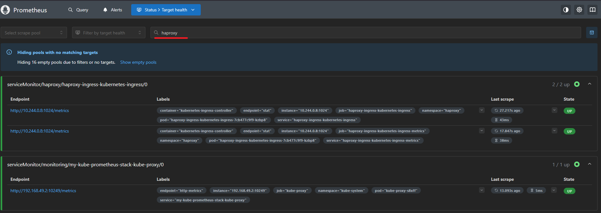
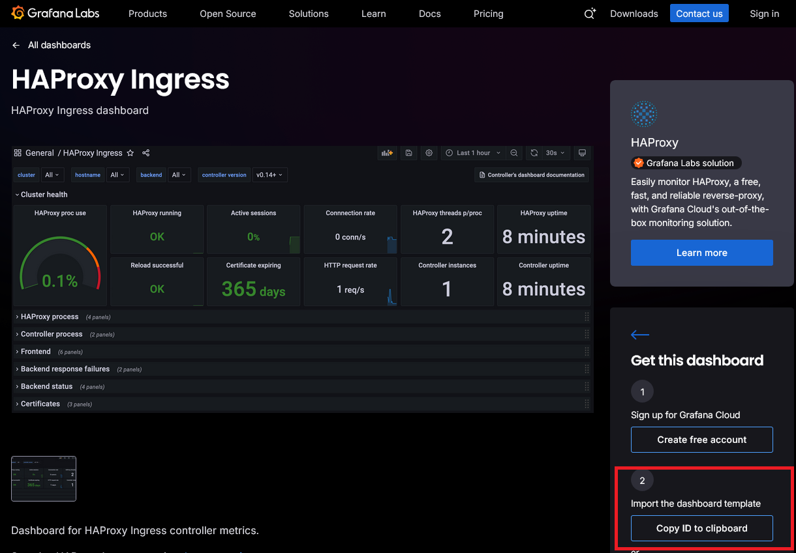
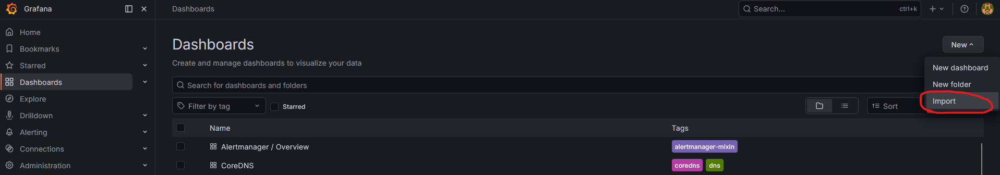
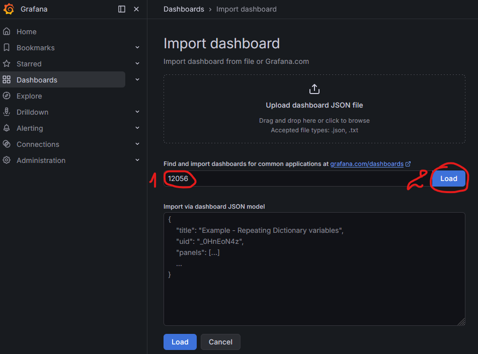
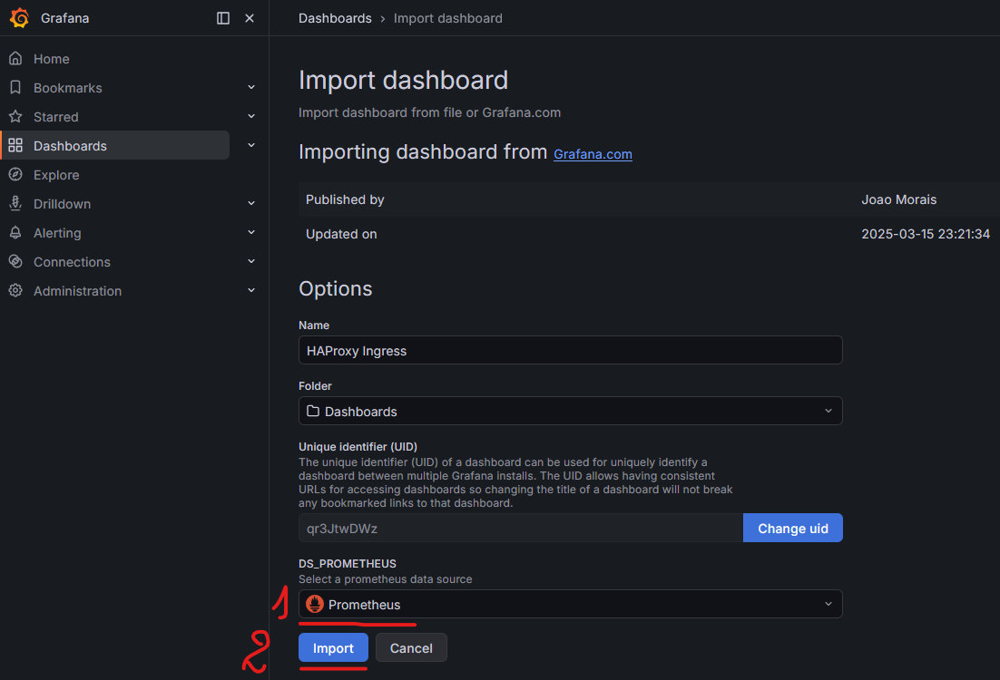
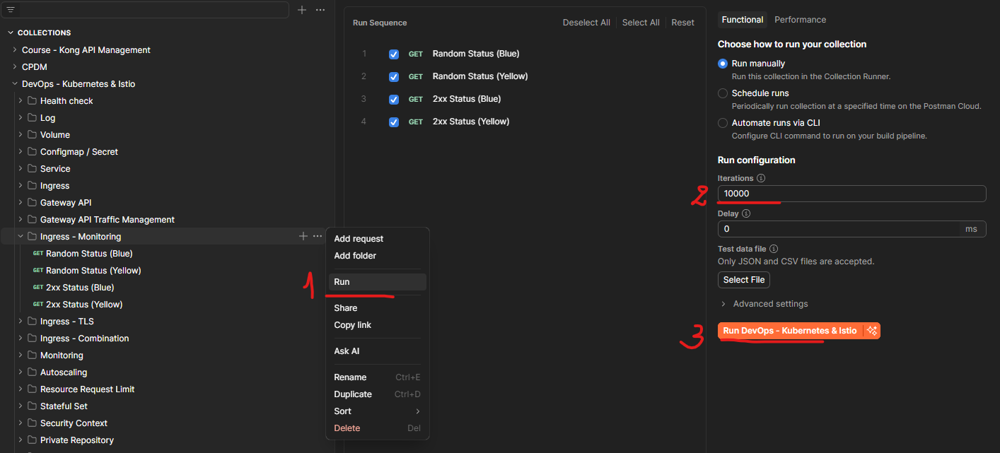
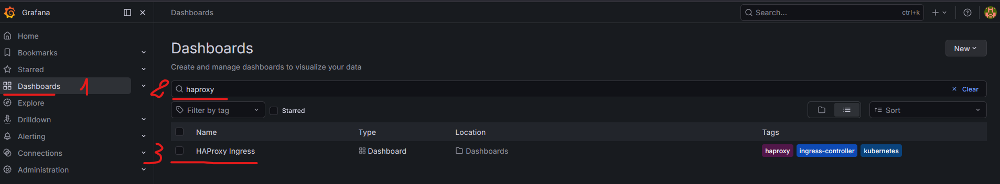
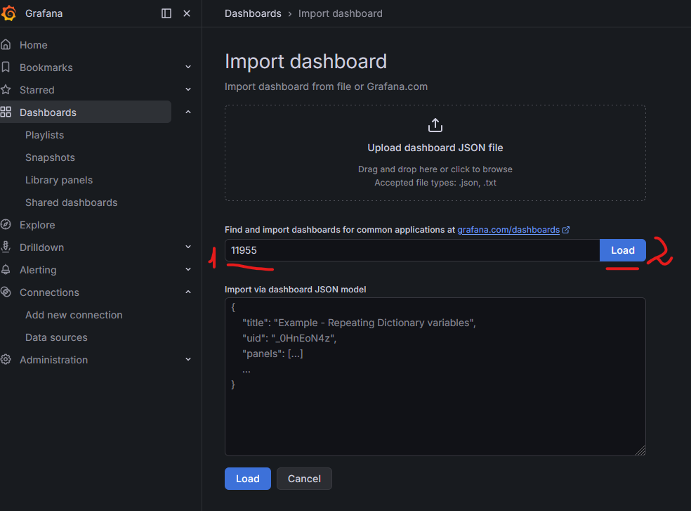
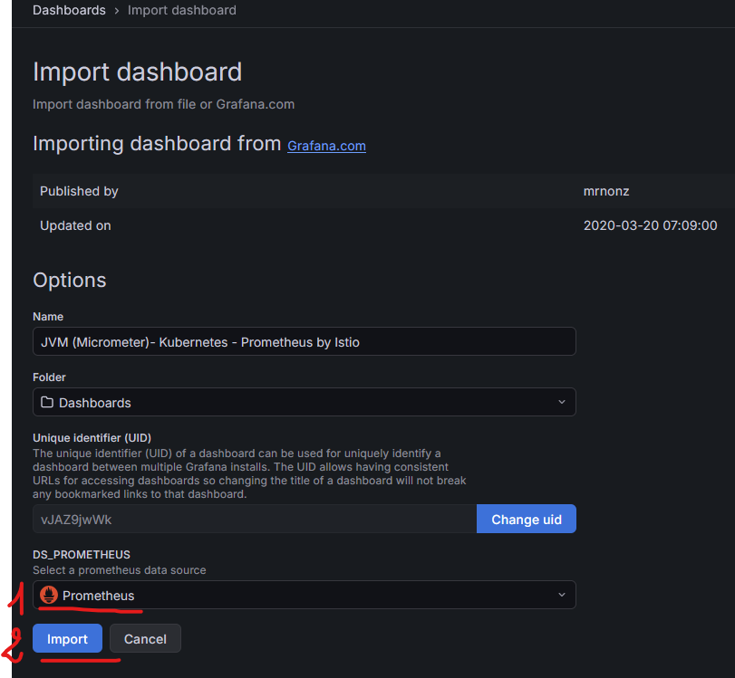
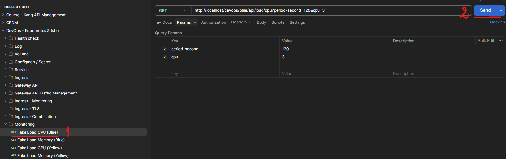

# Section 12 Observability on Kubernetes

## Content
- 46 [Resource Monitoring via Metrics Server](#46-resource-monitoring-via-metrics-server)
- 47 [Kube Prometheus Stack](#47-kube-prometheus-stack)
- 48 [HAProxy via Prometheus](#48-haproxy-via-prometheus)


Delete the previous minikube and start fresh Minikube cluster

    bash --> minikube delete
    bash --> minikube start --cpus 4 --memory 8192 --driver docker

List contexts

	bash --> kubectl config get-contexts

Set minikube contexts

	bash --> kubectl config use-context minikube

Start minikube tunnel and don't close the terminal

    bash --> minikube tunnel

Make sure that addresses are added to Windows hosts list
- Open PowerShell as Admin

		terminal --> notepad C:\Windows\System32\drivers\etc\hosts

- add 
```text
127.0.0.1 blue.devops.local
127.0.0.1 yellow.devops.local
127.0.0.1 api.devops.local
127.0.0.1 monitoring.devops.local
127.0.0.1 rabbitmq.devops.local
127.0.0.1 chartmuseum.devops.local
127.0.0.1 argocd.devops.local
```
- save the file and exit


## 46 Resource Monitoring via Metrics Server
[⬆ Back to top](#top)

Add helm repostiory

    CMD --> helm repo add haproxytech https://haproxytech.github.io/helm-charts

    # result: "haproxytech" has been added to your repositories

    CMD --> helm repo update

    # result:
    Hang tight while we grab the latest from your chart repositories...
    ...Successfully got an update from the "minio" chart repository
    ...Successfully got an update from the "haproxytech" chart repository
    ...Successfully got an update from the "external-secrets" chart repository
    ...Successfully got an update from the "argo" chart repository
    Update Complete. ⎈Happy Helming!⎈

Install kube-prometheus stack:

values-kube-prometheus.yml

```yaml
grafana:
  adminPassword: changeme
  ingress:
    enabled: true
    ingressClassName: haproxy
    annotations: 
      ingress.kubernetes.io/rewrite-target: /
    path: /grafana
  grafana.ini: 
    server:
      root_url: "%(protocol)s://%(domain)s:%(http_port)s/grafana"
      serve_from_sub_path: true

prometheus:
  ingress:
    enabled: true
    ingressClassName: haproxy
    annotations: 
      ingress.kubernetes.io/rewrite-target: /
    paths:
    - /prometheus
  prometheusSpec:
    routePrefix: /prometheus
    # for monitoring
    podMonitorSelectorNilUsesHelmValues: false
    serviceMonitorSelectorNilUsesHelmValues: false

alertmanager:
  ingress:
    enabled: true
    ingressClassName: haproxy
    annotations: 
      ingress.kubernetes.io/rewrite-target: /
    paths:
    - /alertmanager
  alertmanagerSpec:
    routePrefix: /alertmanager
```

    CMD --> helm upgrade --install my-kube-prometheus-stack --repo https://prometheus-community.github.io/helm-charts kube-prometheus-stack --namespace monitoring --create-namespace --values values-kube-prometheus.yml

    # result:
    Release "my-kube-prometheus-stack" does not exist. Installing it now.
    NAME: my-kube-prometheus-stack
    LAST DEPLOYED: Wed Mar 11 17:23:36 2026
    NAMESPACE: monitoring
    STATUS: deployed
    REVISION: 1
    DESCRIPTION: Install complete
    TEST SUITE: None
    NOTES:
    kube-prometheus-stack has been installed. Check its status by running:
    kubectl --namespace monitoring get pods -l "release=my-kube-prometheus-stack"

    Get Grafana 'admin' user password by running:

    kubectl --namespace monitoring get secrets my-kube-prometheus-stack-grafana -o jsonpath="{.data.admin-password}" | base64 -d ; echo

    Access Grafana local instance:

    export POD_NAME=$(kubectl --namespace monitoring get pod -l "app.kubernetes.io/name=grafana,app.kubernetes.io/instance=my-kube-prometheus-stack" -oname)
    kubectl --namespace monitoring port-forward $POD_NAME 3000

    Get your grafana admin user password by running:

    kubectl get secret --namespace monitoring -l app.kubernetes.io/component=admin-secret -o jsonpath="{.items[0].data.admin-password}" | base64 --decode ; echo


    Visit https://github.com/prometheus-operator/kube-prometheus for instructions on how to create & configure Alertmanager and Prometheus instances using the Operator.
    

Install haproxy controller:

values-ingress-haproxy.yml

```yaml
controller:
  resources:
    limits:
      cpu: 300m
      memory: 400Mi
  autoscaling:
    enabled: true
    minReplicas: 1
    maxReplicas: 2
    targetCPUUtilizationPercentage: 70
    targetMemoryUtilizationPercentage: 65
  service:
    type: LoadBalancer
  # add below sections for monitoring
  stats:
    enabled: true
    port: 1024
  serviceMonitor:
    enabled: true
```

    CMD --> helm install haproxy-ingress haproxytech/kubernetes-ingress --namespace haproxy --create-namespace --set controller.ingressClass=haproxy --values values-ingress-haproxy.yml

    # result:
    NAME: haproxy-ingress
    LAST DEPLOYED: Wed Mar 11 17:17:24 2026
    NAMESPACE: haproxy
    STATUS: deployed
    REVISION: 1
    DESCRIPTION: Install complete
    TEST SUITE: None
    NOTES:
    HAProxy Kubernetes Ingress Controller has been successfully installed.

    Controller image deployed is: "docker.io/haproxytech/kubernetes-ingress:3.2.6".
    Your controller is of a "Deployment" kind. Your controller service is running as a "LoadBalancer" type.
    RBAC authorization is enabled.
    Controller ingress.class is set to "haproxy" so make sure to use same annotation for
    Ingress resource.

    Service ports mapped are:
    - name: admin
        containerPort: 6060
        protocol: TCP
    - name: http
        containerPort: 8080
        protocol: TCP
    - name: https
        containerPort: 8443
        protocol: TCP
    - name: stat
        containerPort: 1024
        protocol: TCP
    - name: quic
        containerPort: 8443
        protocol: UDP

    Node IP can be found with:
    $ kubectl --namespace haproxy get nodes -o jsonpath="{.items[0].status.addresses[1].address}"

    The following ingress resource routes traffic to pods that match the following:
    * service name: web
    * client's Host header: webdemo.com
    * path begins with /

    ---
    apiVersion: networking.k8s.io/v1
    kind: Ingress
    metadata:
        name: web-ingress
        namespace: default
        annotations:
        ingress.class: "haproxy"
    spec:
        rules:
        - host: webdemo.com
        http:
            paths:
            - path: /
            backend:
                serviceName: web
                servicePort: 80

    In case that you are using multi-ingress controller environment, make sure to use ingress.class annotation and match it
    with helm chart option controller.ingressClass.

    For more examples and up to date documentation, please visit:
    * Helm chart documentation: https://github.com/haproxytech/helm-charts/tree/main/kubernetes-ingress
    * Controller documentation: https://www.haproxy.com/documentation/kubernetes/latest/
    * Annotation reference: https://github.com/haproxytech/kubernetes-ingress/tree/master/documentation
    * Image parameters reference: https://github.com/haproxytech/kubernetes-ingress/blob/master/documentation/controller.md


Apply the sample application configuration:

    CMD --> kubectl apply -f devops-monitoring.yml

    # result:
    namespace/devops created
    deployment.apps/devops-monitoring-blue-deployment created
    deployment.apps/devops-monitoring-yellow-deployment created
    service/devops-blue-clusterip created
    service/devops-yellow-clusterip created
    ingress.networking.k8s.io/devops-monitoring-haproxy created

Wait 3-5 minutes and ensure all pods are ready

    CMD --> kubectl get pods -n haproxy

    # result:
    NAME                                                  READY   STATUS    RESTARTS   AGE
    haproxy-ingress-kubernetes-ingress-7cb477c9f9-9cc7q   1/1     Running   0          11m

    CMD --> kubectl get pods -n monitoring

    # result:
    NAME                                                           READY   STATUS    RESTARTS   AGE
    alertmanager-my-kube-prometheus-stack-alertmanager-0           2/2     Running   0          4m35s
    my-kube-prometheus-stack-grafana-5b44ffb4fd-72bm8              3/3     Running   0          4m47s
    my-kube-prometheus-stack-kube-state-metrics-5f5768b946-zv2b8   1/1     Running   0          4m47s
    my-kube-prometheus-stack-operator-856db56774-rxvs2             1/1     Running   0          4m47s
    my-kube-prometheus-stack-prometheus-node-exporter-vbbwd        1/1     Running   0          4m47s
    prometheus-my-kube-prometheus-stack-prometheus-0               2/2     Running   0          4m35s

    CMD --> kubectl get pods -n devops

    # result:
    NAME                                                   READY   STATUS    RESTARTS   AGE
    devops-monitoring-blue-deployment-849b65fd5-v55jt      1/1     Running   0          2m19s
    devops-monitoring-yellow-deployment-74bc89449b-dxbfj   1/1     Running   0          2m19s

Start minikube tunnel and don't close the terminal

    CMD --> minikube tunnel


Access Prometheus at http://localhost:9090/targets

Search for 'haproxy' metrics




Search and install Grafana Dashboard - https://grafana.com/grafana/dashboards/      
    - find dashboard 'haproxy ingress' - https://grafana.com/grafana/dashboards/12056-haproxy-ingress/      
    - copy the dashboard ID and import it in grafana



Open grafana at http://localhost/grafana and login with     
    - username: admin       
    - password: changeme        

Import the dashboard into grafana







Open Postman Collection / Ingress - Monitoring and run the collection many times to create metrics



Wait few minutes and open grafana haproxy dashboard and check the presented data




[⬆ Back to top](#top)


## 47 Kube Prometheus Stack
[⬆ Back to top](#top)

To see more visualized, historical resource usages, we can use more tools. A common free tool for this is Prometheus. Prometheus is commonly combined with Grafana as a visualization dashboard. The Prometheus community already provides Helm installations for those stacks, which include a custom dashboard. To do this, we will install the kube-prometheus-stack Helm chart. Please ensure that Helm, Ingress, and the Metrics Server are already running on your cluster.

Prometheus works by a pull-based mechanism. An application, or pod, must provide an endpoint (usually an HTTP endpoint) that exposes its own metrics. We configure Prometheus to scrape metrics from that endpoint. Usually, configuration is done using these annotations on the pod. A note: The kube-prometheus stack might not work perfectly on local Kubernetes, such as minikube. For the Prometheus lesson, feel free to use Kubernetes on Google Cloud if your local minikube does not show the expected result. If you want to try using Google Cloud Kubernetes, start with the lesson on setting it up, then return here. Feel free to experiment and explore. 

Delete the previous minikube and start fresh Minikube cluster

    bash --> minikube delete
    bash --> minikube start --cpus 4 --memory 8192 --driver docker

The Kube Prometheus stack can be exposed through an ingress controller. Thus, we will install the HA Proxy ingress controller using Helm. Go to the artifact hub, find the HAProxy Kubernetes ingress, and install it. Let's install the HAProxy ingress controller in the haproxy namespace and create a load balancer service accessible from localhost. 

    CMD --> helm install haproxy-ingress haproxytech/kubernetes-ingress --namespace haproxy --create-namespace --set controller.service.type=LoadBalancer --set controller.ingressClass=haproxy

    # result:
    NAME: haproxy-ingress
    LAST DEPLOYED: Wed Mar 11 22:45:29 2026
    NAMESPACE: haproxy
    STATUS: deployed
    REVISION: 1
    DESCRIPTION: Install complete
    TEST SUITE: None
    NOTES:
    HAProxy Kubernetes Ingress Controller has been successfully installed.

    Controller image deployed is: "docker.io/haproxytech/kubernetes-ingress:3.2.6".
    Your controller is of a "Deployment" kind. Your controller service is running as a "LoadBalancer" type.
    RBAC authorization is enabled.
    Controller ingress.class is set to "haproxy" so make sure to use same annotation for
    Ingress resource.

    Service ports mapped are:
      - name: admin
        containerPort: 6060
        protocol: TCP
      - name: http
        containerPort: 8080
        protocol: TCP
      - name: https
        containerPort: 8443
        protocol: TCP
      - name: stat
        containerPort: 1024
        protocol: TCP
      - name: quic
        containerPort: 8443
        protocol: UDP

    Node IP can be found with:
      $ kubectl --namespace haproxy get nodes -o jsonpath="{.items[0].status.addresses[1].address}"

    The following ingress resource routes traffic to pods that match the following:
      * service name: web
      * client's Host header: webdemo.com
      * path begins with /

      ---
      apiVersion: networking.k8s.io/v1
      kind: Ingress
      metadata:
        name: web-ingress
        namespace: default
        annotations:
          ingress.class: "haproxy"
      spec:
        rules:
        - host: webdemo.com
          http:
            paths:
            - path: /
              backend:
                serviceName: web
                servicePort: 80

    In case that you are using multi-ingress controller environment, make sure to use ingress.class annotation and match it
    with helm chart option controller.ingressClass.

    For more examples and up to date documentation, please visit:
      * Helm chart documentation: https://github.com/haproxytech/helm-charts/tree/main/kubernetes-ingress
      * Controller documentation: https://www.haproxy.com/documentation/kubernetes/latest/
      * Annotation reference: https://github.com/haproxytech/kubernetes-ingress/tree/master/documentation
      * Image parameters reference: https://github.com/haproxytech/kubernetes-ingress/blob/master/documentation/controller.md

If you need a refresher on the details or the syntax for installing, please see the earlier lesson on ingress.

See the deployment configuration for this lesson. Here, we define blue and yellow applications.

We also expose them using the Cluster IP service. Additionally, we add an ingress rule to allow access to them via the ingress controller.

Apply this file.

    CMD --> kubectl apply -f devops-monitoring.yml

    # result:
    namespace/devops created
    deployment.apps/devops-monitoring-blue-deployment created
    deployment.apps/devops-monitoring-yellow-deployment created
    service/devops-blue-clusterip created
    service/devops-yellow-clusterip created
    ingress.networking.k8s.io/devops-monitoring-haproxy created

To install the Kube Prometheus stack, we will use Helm. The syntax available in the course resources & references, which is located in the last section of this course. We will see that it has a parameter: values-monitoring.yaml.

If we open the folder monitoring-kube-prometheus, we will see the file. So we must run the helm command and pass the path of this file. A Helm chart can include configuration parameters. These values can be overridden during installation. 

values-monitoring.yaml

```yaml
grafana:
  adminPassword: changeme
  ingress:
    enabled: true
    ingressClassName: haproxy
    annotations: 
      ingress.kubernetes.io/rewrite-target: /
    path: /grafana
  grafana.ini: 
    server:
      root_url: "%(protocol)s://%(domain)s:%(http_port)s/grafana"
      serve_from_sub_path: true

prometheus:
  ingress:
    enabled: true
    ingressClassName: haproxy
    annotations:
      ingress.kubernetes.io/rewrite-target: /
    paths:
    - /prometheus
  prometheusSpec:
    routePrefix: /prometheus

alertmanager:
  ingress:
    enabled: true
    ingressClassName: haproxy
    annotations: 
      ingress.kubernetes.io/rewrite-target: /
    paths:
    - /alertmanager
  alertmanagerSpec:
    routePrefix: /alertmanager
```

One way to override it is to use a YAML file and pass it as a Helm parameter, as we will do. In this file, we define several items. In the Grafana section, we define the admin password. Then we enable the ingress at the path /grafana. The kube-prometheus stack will create the ingress rule for us using this configuration, as well as the prometheus and alertmanager sections, where we ask kube-prometheus-stack to create the ingress for us.

Install it.

    CMD --> helm upgrade --install my-kube-prometheus-stack --repo https://prometheus-community.github.io/helm-charts kube-prometheus-stack --namespace monitoring --create-namespace --values values-monitoring.yaml

    # result:
    NAME: my-kube-prometheus-stack
    LAST DEPLOYED: Wed Mar 11 22:56:12 2026
    NAMESPACE: monitoring
    STATUS: deployed
    REVISION: 1
    DESCRIPTION: Install complete
    TEST SUITE: None
    NOTES:
    kube-prometheus-stack has been installed. Check its status by running:
    kubectl --namespace monitoring get pods -l "release=my-kube-prometheus-stack"

    Get Grafana 'admin' user password by running:

    kubectl --namespace monitoring get secrets my-kube-prometheus-stack-grafana -o jsonpath="{.data.admin-password}" | base64 -d ; echo

    Access Grafana local instance:

    export POD_NAME=$(kubectl --namespace monitoring get pod -l "app.kubernetes.io/name=grafana,app.kubernetes.io/instance=my-kube-prometheus-stack" -oname)
    kubectl --namespace monitoring port-forward $POD_NAME 3000

    Get your grafana admin user password by running:

    kubectl get secret --namespace monitoring -l app.kubernetes.io/component=admin-secret -o jsonpath="{.items[0].data.admin-password}" | base64 --decode ; echo


    Visit https://github.com/prometheus-operator/kube-prometheus for instructions on how to create & configure Alertmanager and Prometheus instances using the Operator.

Then wait for all pods to become ready. The application and the monitoring stack. 

    CMD --> kubectl get pods -n devops

    # result:
    NAME                                                   READY   STATUS    RESTARTS   AGE
    devops-monitoring-blue-deployment-849b65fd5-lg9f6      1/1     Running   0          7m28s
    devops-monitoring-yellow-deployment-74bc89449b-dtg65   1/1     Running   0          7m28s


    CMD --> kubectl get pods -n monitoring

    # result:
    NAME                                                           READY   STATUS    RESTARTS   AGE
    alertmanager-my-kube-prometheus-stack-alertmanager-0           2/2     Running   0          110s
    my-kube-prometheus-stack-grafana-5b44ffb4fd-z6p4r              3/3     Running   0          2m8s
    my-kube-prometheus-stack-kube-state-metrics-5f5768b946-t5m6z   1/1     Running   0          2m8s
    my-kube-prometheus-stack-operator-856db56774-hm8wf             1/1     Running   0          2m8s
    my-kube-prometheus-stack-prometheus-node-exporter-4868q        1/1     Running   0          2m8s
    prometheus-my-kube-prometheus-stack-prometheus-0               2/2     Running   0          109s

To gather metrics using Prometheus, several steps are required. These steps differ for each backend programming language. In this course example, the application uses Spring Boot, which enables the Prometheus Actuator to export metrics. Thus, the demonstration can only work for a Spring Boot application with the same characteristics. We need a ServiceMonitor Kubernetes object. The service monitor specifies how Prometheus should discover and scrape metrics from Kubernetes services. Think of it as a bridge between our application services and Prometheus, telling Prometheus, "monitor this service at this endpoint using these parameters."

See the file devops-service-monitor.yml. The configuration file defines a service monitor for each service: blue and yellow. Both ServiceMonitors live in the devops namespace and are labeled with release: my-kube-prometheus-stack, which allows the Prometheus instance from that Helm release to discover them automatically. The first ServiceMonitor, devops-blue-servicemonitor, targets the blue application, while the second targets the yellow application. The endpoints section defines how Prometheus should scrape metrics from those services. Metrics are collected from Spring Boot style actuator endpoints, with paths ending in /actuator/prometheus. Prometheus scrapes metrics every 10 seconds. A 5-second timeout prevents slow or unresponsive endpoints from blocking the scrape cycle.

devops-service-monitor.yml

```yaml
apiVersion: monitoring.coreos.com/v1
kind: ServiceMonitor
metadata:
  name: devops-blue-servicemonitor
  namespace: devops
  labels:
    release: my-kube-prometheus-stack
    app.kubernetes.io/name: devops-monitoring-blue
spec:
  selector:
    matchLabels:
      app.kubernetes.io/name: devops-monitoring-blue
  endpoints:
  - port: http
    path: /devops/blue/actuator/prometheus
    interval: 10s
    scrapeTimeout: 5s

---

apiVersion: monitoring.coreos.com/v1
kind: ServiceMonitor
metadata:
  name: devops-yellow-servicemonitor
  namespace: devops
  labels:
    release: my-kube-prometheus-stack
    app.kubernetes.io/name: devops-monitoring-yellow
spec:
  selector:
    matchLabels:
      app.kubernetes.io/name: devops-monitoring-yellow
  endpoints:
  - port: http
    path: /devops/yellow/actuator/prometheus
    interval: 10s
    scrapeTimeout: 5s
```

Apply this file.

    CMD --> kubectl apply -f devops-service-monitor.yml

    # result:
    servicemonitor.monitoring.coreos.com/devops-blue-servicemonitor created
    servicemonitor.monitoring.coreos.com/devops-yellow-servicemonitor created

Start minikube tunnel and don't close the terminal

    CMD --> minikube tunnel

Go to the Prometheus target screen at http://localhost/prometheus/targets and ensurethe blue and yellow targets exist and are running. 

We can see the visualization in Grafana, which Prometheus scrapes.

Login to grafana - http://localhost/grafana/        
    - username: admin       
    - password: changeme        

 The kube-prometheus stack already has several custom dashboards. For example, this one shows the resource usage per namespace or for each pod. Feel free to explore the dashboard. 
 
 Grafana can also send an alert when a metric value exceeds a threshold, but we will not discuss it here. However, for a Spring Boot application, the built-in Kube Prometheus dashboard does not accurately describe Java metrics. For example of a Java dashboard, let's import dashboard 11955 to show Java Virtual Machine Metrics.

        
 


Open the Postman collection and try to run a fake load. I will run CPU load on blue for 2 minutes. Also, a memory load on blue for 2 minutes.

 


Open the Java dashboard in Grafana and see that memory and CPU usage change over time. 

Delete the previous minikube 

    CMD --> minikube delete


[⬆ Back to top](#top)


## 48 HAProxy via Prometheus
[⬆ Back to top](#top)

Start fresh Minikube cluster

    CMD --> minikube start --cpus 4 --memory 8192 --driver docker

Ingress, Prometheus, and Grafana are popular stacks. HAProxy is a good choice for an ingress controller. When we use them, we can monitor HAProxy statistics in Grafana. When using Kubernetes, certain steps are required for such configurations. In this lesson, we will learn how to configure them and create an HAProxy dashboard on Grafana.

Important note: 
The kube-prometheus stack might not work perfectly, especially on local Kubernetes like minikube. For the Prometheus lesson, you can use Kubernetes on Google Cloud. If you want to try using Google Cloud Kubernetes, skip to the Istio service-mesh section and use Google Cloud Kubernetes. Feel free to experiment and explore. 


In the course's resources folder, the monitoring-ingress-nginx folder contains several YAML files. The devops-monitoring.yml file is a sample application to be deployed. This configuration includes a blue pod, a yellow pod, and service for both. We use a cluster IP for the service. The configuration also defines ingress rules that expose both services via different paths. 

Values-ingress-haproxy.yml is the HAProxy configuration. We will install the HAProxy using this configuration. To enable the monitoring integration with the kube-prometheus stack, we need to add the following configuration. This configuration can also be read in the HAProxy documentation, in case the version is updated.

Values-ingress-haproxy.yml

```yaml
controller:
  resources:
    limits:
      cpu: 300m
      memory: 400Mi
  autoscaling:
    enabled: true
    minReplicas: 1
    maxReplicas: 2
    targetCPUUtilizationPercentage: 70
    targetMemoryUtilizationPercentage: 65
  service:
    type: LoadBalancer
  # add below sections for monitoring
  stats:
    enabled: true
    port: 1024
  serviceMonitor:
    enabled: true
```

The values-kube-prometheus.yml file is for the kube-prometheus-stack configuration. We will reconfigure Prometheus using this configuration. This configuration will create ingress rules for Prometheus and Grafana, so we can see them without using port forwarding. In the Prometheus section, we need to add these monitoring configurations. 

values-kube-prometheus.yml 

```yaml
grafana:
  adminPassword: changeme
  ingress:
    enabled: true
    ingressClassName: haproxy
    annotations: 
      ingress.kubernetes.io/rewrite-target: /
    path: /grafana
  grafana.ini: 
    server:
      root_url: "%(protocol)s://%(domain)s:%(http_port)s/grafana"
      serve_from_sub_path: true

prometheus:
  ingress:
    enabled: true
    ingressClassName: haproxy
    annotations: 
      ingress.kubernetes.io/rewrite-target: /
    paths:
    - /prometheus
  prometheusSpec:
    routePrefix: /prometheus
    # for monitoring
    podMonitorSelectorNilUsesHelmValues: false
    serviceMonitorSelectorNilUsesHelmValues: false

alertmanager:
  ingress:
    enabled: true
    ingressClassName: haproxy
    annotations: 
      ingress.kubernetes.io/rewrite-target: /
    paths:
    - /alertmanager
  alertmanagerSpec:
    routePrefix: /alertmanager
```

We need to install HAProxy, but this time we need to specify the configuration file location. Let's run this command in the folder monitoring-ingress-haproxy so we can use the values-ingress-haproxy YAML file.

    CMD --> helm install haproxy-ingress haproxytech/kubernetes-ingress --namespace haproxy --create-namespace --set controller.service.type=LoadBalancer --set controller.ingressClass=haproxy

    # result:
    NAME: haproxy-ingress
    LAST DEPLOYED: Fri Mar 13 14:42:05 2026
    NAMESPACE: haproxy
    STATUS: deployed
    REVISION: 1
    DESCRIPTION: Install complete
    TEST SUITE: None
    NOTES:
    HAProxy Kubernetes Ingress Controller has been successfully installed.

    Controller image deployed is: "docker.io/haproxytech/kubernetes-ingress:3.2.6".
    Your controller is of a "Deployment" kind. Your controller service is running as a "LoadBalancer" type.
    RBAC authorization is enabled.
    Controller ingress.class is set to "haproxy" so make sure to use same annotation for
    Ingress resource.

    Service ports mapped are:
      - name: admin
        containerPort: 6060
        protocol: TCP
      - name: http
        containerPort: 8080
        protocol: TCP
      - name: https
        containerPort: 8443
        protocol: TCP
      - name: stat
        containerPort: 1024
        protocol: TCP
      - name: quic
        containerPort: 8443
        protocol: UDP

    Node IP can be found with:
      $ kubectl --namespace haproxy get nodes -o jsonpath="{.items[0].status.addresses[1].address}"

    The following ingress resource routes traffic to pods that match the following:
      * service name: web
      * client's Host header: webdemo.com
      * path begins with /

      ---
      apiVersion: networking.k8s.io/v1
      kind: Ingress
      metadata:
        name: web-ingress
        namespace: default
        annotations:
          ingress.class: "haproxy"
      spec:
        rules:
        - host: webdemo.com
          http:
            paths:
            - path: /
              backend:
                serviceName: web
                servicePort: 80

    In case that you are using multi-ingress controller environment, make sure to use ingress.class annotation and match it
    with helm chart option controller.ingressClass.

    For more examples and up to date documentation, please visit:
      * Helm chart documentation: https://github.com/haproxytech/helm-charts/tree/main/kubernetes-ingress
      * Controller documentation: https://www.haproxy.com/documentation/kubernetes/latest/
      * Annotation reference: https://github.com/haproxytech/kubernetes-ingress/tree/master/documentation
      * Image parameters reference: https://github.com/haproxytech/kubernetes-ingress/blob/master/documentation/controller.md

Still in the same folder, install the kube-prometheus stack usingthe YAML configuration file. 

    CMD --> helm upgrade --install my-kube-prometheus-stack --repo https://prometheus-community.github.io/helm-charts kube-prometheus-stack --namespace monitoring --create-namespace --values values-kube-prometheus.yml

    # result:
    Release "my-kube-prometheus-stack" does not exist. Installing it now.
    NAME: my-kube-prometheus-stack
    LAST DEPLOYED: Fri Mar 13 14:44:19 2026
    NAMESPACE: monitoring
    STATUS: deployed
    REVISION: 1
    DESCRIPTION: Install complete
    TEST SUITE: None
    NOTES:
    kube-prometheus-stack has been installed. Check its status by running:
    kubectl --namespace monitoring get pods -l "release=my-kube-prometheus-stack"

    Get Grafana 'admin' user password by running:

    kubectl --namespace monitoring get secrets my-kube-prometheus-stack-grafana -o jsonpath="{.data.admin-password}" | base64 -d ; echo

    Access Grafana local instance:

    export POD_NAME=$(kubectl --namespace monitoring get pod -l "app.kubernetes.io/name=grafana,app.kubernetes.io/instance=my-kube-prometheus-stack" -oname)
    kubectl --namespace monitoring port-forward $POD_NAME 3000

    Get your grafana admin user password by running:

    kubectl get secret --namespace monitoring -l app.kubernetes.io/component=admin-secret -o jsonpath="{.items[0].data.admin-password}" | base64 --decode ; echo


    Visit https://github.com/prometheus-operator/kube-prometheus for instructions on how to create & configure Alertmanager and Prometheus instances using the Operator.

Deploy the sample application. We can apply the DevOps-monitoring YAML file.

    CMD --> kubectl apply -f devops-monitoring.yml

    # result:
    namespace/devops created
    deployment.apps/devops-monitoring-blue-deployment created
    deployment.apps/devops-monitoring-yellow-deployment created
    service/devops-blue-clusterip created
    service/devops-yellow-clusterip created
    ingress.networking.k8s.io/devops-monitoring-haproxy created

Wait and ensure all pods are ready. 

    CMD --> kubectl get pods -n haproxy

    # result:
    NAME                                                  READY   STATUS    RESTARTS   AGE
    haproxy-ingress-kubernetes-ingress-7cb477c9f9-9cc7q   1/1     Running   0          11m

    CMD --> kubectl get pods -n monitoring

    # result:
    NAME                                                           READY   STATUS    RESTARTS   AGE
    alertmanager-my-kube-prometheus-stack-alertmanager-0           2/2     Running   0          4m35s
    my-kube-prometheus-stack-grafana-5b44ffb4fd-72bm8              3/3     Running   0          4m47s
    my-kube-prometheus-stack-kube-state-metrics-5f5768b946-zv2b8   1/1     Running   0          4m47s
    my-kube-prometheus-stack-operator-856db56774-rxvs2             1/1     Running   0          4m47s
    my-kube-prometheus-stack-prometheus-node-exporter-vbbwd        1/1     Running   0          4m47s
    prometheus-my-kube-prometheus-stack-prometheus-0               2/2     Running   0          4m35s

    CMD --> kubectl get pods -n devops

    # result:
    NAME                                                   READY   STATUS    RESTARTS   AGE
    devops-monitoring-blue-deployment-849b65fd5-v55jt      1/1     Running   0          2m19s
    devops-monitoring-yellow-deployment-74bc89449b-dxbfj   1/1     Running   0          2m19s

Remember to enable minikube tunneling so we can access the ingress controller.

    CMD --> minikube tunnel

Try to access Prometheus at http://localhost/prometheus/targets.

Make sure that there are HAProxy metrics here.


To visualize, we can use Grafana. As open-source monitoring, the Grafana community provides many dashboards. Try searching "grafana dashboard" online and go to this link. Find the dashboard for HAPRoxy ingress. Import the dashboards into Grafana. We can copy the dashboard ID from the website and paste the ID into Grafana.

Search and install Grafana Dashboard - https://grafana.com/grafana/dashboards/      
    - find dashboard 'haproxy ingress' - https://grafana.com/grafana/dashboards/12056-haproxy-ingress/      
    - copy the dashboard ID and import it in grafana


Open grafana at http://localhost/grafana and login with     
    - username: admin       
    - password: changeme        

Import the dashboard into grafana


Open Postman Collection / Ingress - Monitoring and run the collection many times to create metrics


Wait few minutes and open grafana haproxy dashboard and check the presented data


PICS

[⬆ Back to top](#top)
