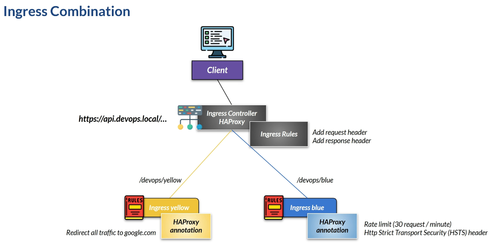
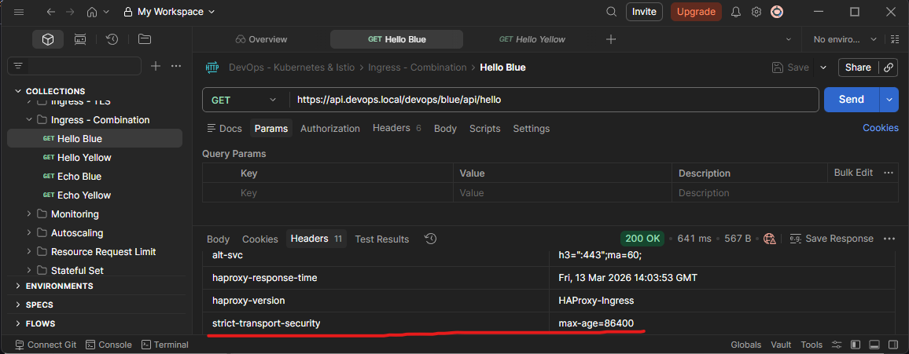
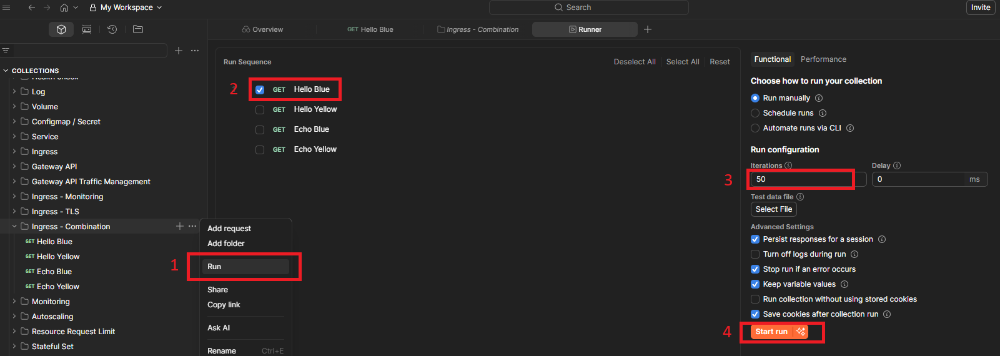
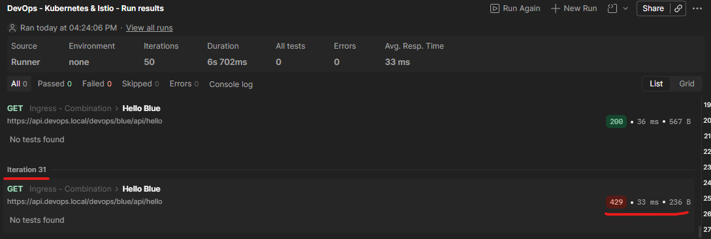
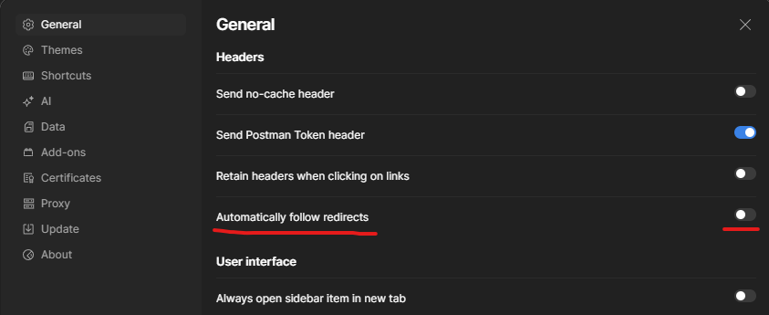
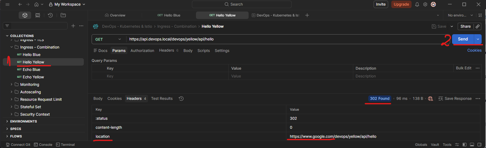
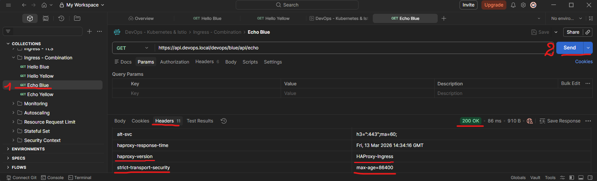
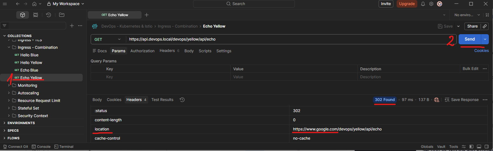

# Section 13 Ingress Controller on Kubernetes

## Content
- 49 [Ingress Combination](#49-ingress-combination)

Delete the previous minikube and start fresh Minikube cluster

    bash --> minikube delete
    bash --> minikube start --cpus 4 --memory 8192 --driver docker

List contexts

	bash --> kubectl config get-contexts

Set minikube contexts

	bash --> kubectl config use-context minikube

Start minikube tunnel and don't close the terminal

    bash --> minikube tunnel

Make sure that address are added to Windows host list
- Open PowerShell as Admin

		terminal --> notepad C:\Windows\System32\drivers\etc\hosts

- add 
```text
127.0.0.1 blue.devops.local             # required 
127.0.0.1 yellow.devops.local           # required 
127.0.0.1 api.devops.local              # required 
127.0.0.1 monitoring.devops.local
127.0.0.1 rabbitmq.devops.local
127.0.0.1 chartmuseum.devops.local
127.0.0.1 argocd.devops.local
```
- save the file and exit


## 49 Ingress Combination

[⬆ Back to top](#top)

Ingress plays a vital role in practice. We have already seen how to create and configure the HAProxy Ingress component step by step. In this lesson, we will see how we can combine ingress configurations for more complex use cases. 

We will have HAProxy as an ingress controller. In this sample, we will add a request header and a response header to each traffic. We will create rules for a specific single host using the HTTPS protocol. Based on the path, we will redirect traffic to the yellow or blue pod. So we have two ingress, each with a different rule. We can add HAProxy annotations to each ingress to specify rules that apply only to that ingress. For example, we will redirect any traffic that goes to yellow, so every time we access the yellow ingress, we will be redirected to the Google website. In blue, we will set a rate limit of 30 hits per minute for any endpoint. We will also add the HSTS response header, which is usually used for security. HAProxy has more configuration. You can find the complete configuration in the HAProxy documentation.



Go to the ingress-combination folder. First, see the deployment file - ingress-combination-deployment.yml. Nothing special—we will deploy a blue and a yellow pod, along with the cluster IP service.

Apply this file.

    CMD --> kubectl apply -f ingress-combination-deployment.yml

    # result:
    namespace/devops created
    deployment.apps/ingress-combination-blue-deployment created
    deployment.apps/ingress-combination-yellow-deployment created
    service/devops-blue-clusterip created
    service/devops-yellow-clusterip created

###### return point 2

We will need a TLS certificate, so generate one and make it a Kubernetes secret. See the lesson [Ingress over TLS](../Section%2010%20Exposing%20Kubernetes%20Pod/Section%2010%20Exposing%20Kubernetes%20Pod%20Notes.md#39-ingress-over-tls) for a refresher. 

    CMD --> kubectl create secret tls api-devops-local-cert --key C:\Users\user_name\Downloads\api-devops.local-privateKey.key --cert C:\Users\user_name\Downloads\api-devops.local.crt

    # result: secret/api-devops-local-cert created

The values-ingress-haproxy.yml file configures the HAProxy installation. Install HAProxy using Helm, passing the values YAML file. 

values-ingress-haproxy.yml

```yaml
controller:
  resources:
    limits:
      cpu: 300m
      memory: 400Mi
  autoscaling:
    enabled: true
    minReplicas: 1
    maxReplicas: 2
    targetCPUUtilizationPercentage: 70
    targetMemoryUtilizationPercentage: 65
  service:
    type: LoadBalancer
  # add below sections for monitoring
  stats:
    enabled: true
    port: 1024
  serviceMonitor:
    enabled: true
```

    CMD --> helm install haproxy-ingress haproxytech/kubernetes-ingress --namespace haproxy --create-namespace --set controller.ingressClass=haproxy --values values-ingress-haproxy.yml

    # result:
    NAME: haproxy-ingress
    LAST DEPLOYED: Fri Mar 13 15:38:04 2026
    NAMESPACE: haproxy
    STATUS: deployed
    REVISION: 1
    DESCRIPTION: Install complete
    TEST SUITE: None
    NOTES:
    HAProxy Kubernetes Ingress Controller has been successfully installed.

    Controller image deployed is: "docker.io/haproxytech/kubernetes-ingress:3.2.6".
    Your controller is of a "Deployment" kind. Your controller service is running as a "LoadBalancer" type.
    RBAC authorization is enabled.
    Controller ingress.class is set to "haproxy" so make sure to use same annotation for
    Ingress resource.

    Service ports mapped are:
    - name: admin
        containerPort: 6060
        protocol: TCP
    - name: http
        containerPort: 8080
        protocol: TCP
    - name: https
        containerPort: 8443
        protocol: TCP
    - name: stat
        containerPort: 1024
        protocol: TCP
    - name: quic
        containerPort: 8443
        protocol: UDP

    Node IP can be found with:
    $ kubectl --namespace haproxy get nodes -o jsonpath="{.items[0].status.addresses[1].address}"

    The following ingress resource routes traffic to pods that match the following:
    * service name: web
    * client's Host header: webdemo.com
    * path begins with /

    ---
    apiVersion: networking.k8s.io/v1
    kind: Ingress
    metadata:
        name: web-ingress
        namespace: default
        annotations:
        ingress.class: "haproxy"
    spec:
        rules:
        - host: webdemo.com
        http:
            paths:
            - path: /
            backend:
                serviceName: web
                servicePort: 80

    In case that you are using multi-ingress controller environment, make sure to use ingress.class annotation and match it
    with helm chart option controller.ingressClass.

    For more examples and up to date documentation, please visit:
    * Helm chart documentation: https://github.com/haproxytech/helm-charts/tree/main/kubernetes-ingress
    * Controller documentation: https://www.haproxy.com/documentation/kubernetes/latest/
    * Annotation reference: https://github.com/haproxytech/kubernetes-ingress/tree/master/documentation
    * Image parameters reference: https://github.com/haproxytech/kubernetes-ingress/blob/master/documentation/controller.md

Then we will create the ingress rules. In the ingress-combination-ingress YAML file, we separate the blue and yellow ingress settings, even though they are on the same host. This is because we will have a different configuration for each. We can add an annotation to the ingress to further configure it. For example, in blue ingress, we will set a rate limit to allow only 30 requests per minute. Exceed that value, and we will reject the requests with a 429 status code. We will also add the Strict Transport Security response header before returning the response to the client. For the yellow ingress, we can use a different configuration. We will not limit traffic. Instead, we will redirect all traffic to Google when accessing the yellow route.

So if we later access the yellow ingress, we will get the Google homepage. We will also set some custom request headers on the backend and send custom response headers to the client.

ingress-combination-ingress.yml

```yaml
apiVersion: networking.k8s.io/v1
kind: Ingress
metadata:
  namespace: devops
  name: ingress-combination-haproxy-blue
  labels:
    app.kubernetes.io/name: ingress-combination-haproxy-blue
  annotations:
    haproxy.org/rate-limit-period: 1m                       # timeframe for request rate limit
    haproxy.org/rate-limit-requests: "30"                   # request rate limit
    haproxy.org/rate-limit-status-code: "429"               # reject exceeded requests with status code
    # Add custom request headers (sent to backend)
    haproxy.org/request-set-header: |
      HAProxy-Request-Time %[date(),http_date]
      HAProxy-Source devops-course
      HAProxy-More-Request-Header just-sample-dummy-header
    # Add custom response headers (sent to client)
    haproxy.org/response-set-header: |                      # Strict Transport Security response header
      HAProxy-Response-Time %[date(),http_date]
      HAProxy-Version HAProxy-Ingress
      Strict-Transport-Security "max-age=86400"
spec:
  ingressClassName: haproxy
  tls:
    - secretName: api-devops-local-cert
      hosts:
        - api.devops.local
  rules:
  - host: api.devops.local
    http:
      paths:
      - path: /devops/blue
        pathType: Prefix
        backend:
          service:
            name: devops-blue-clusterip
            port:
              number: 8111

---

apiVersion: networking.k8s.io/v1
kind: Ingress
metadata:
  namespace: devops
  name: ingress-combination-haproxy-yellow
  labels:
    app.kubernetes.io/name: ingress-combination-haproxy-yellow
  annotations:
    haproxy.org/request-redirect: https://www.google.com            # redirect to google
    # Add custom request headers (sent to backend)
    haproxy.org/request-set-header: |                               # custom request headers
      HAProxy-Request-Time %[date(),http_date]
      HAProxy-Source devops-course
      HAProxy-More-Request-Header just-sample-dummy-header
    # Add custom response headers (sent to client)
    haproxy.org/response-set-header: |                              # custom response headers
      HAProxy-Response-Time %[date(),http_date]
      HAProxy-Version HAProxy-Ingress
spec:
  ingressClassName: haproxy
  tls:
    - secretName: api-devops-local-cert
      hosts:
        - api.devops.local
  rules:
  - host: api.devops.local
    http:
      paths:
      - path: /devops/yellow
        pathType: Prefix
        backend:
          service:
            name: devops-yellow-clusterip
            port:
              number: 8112
```

Apply these ingress.

    CMD --> kubectl apply -f ingress-combination-ingress.yml

    # result:
    ingress.networking.k8s.io/ingress-combination-haproxy-blue created
    ingress.networking.k8s.io/ingress-combination-haproxy-yellow created


At this point, try to access the blue endpoint from Postman.

Postman Collection / Ingress Combination / GET Hello Blue       
    - address: https://api.devops.local/devops/blue/api/hello       

    # result:
    Version [2.0.0] Hello from app [devops-blue running at 10.244.0.4] on k8s pod [ingress-combination-blue-deployment-8499bbf578-mmb6d]

See the response header. It includes a Strict-Transport-Security (HSTS) header.




Also, if we run this endpoint multiple times, it will only receive 30 requests per minute. Well, maybe not exactly 30, but on 31 or 32. Try it. Run 50 times without delay, and we will see that, around request 31, it will be rejected with a 429 status code, as defined in the ingress configuration. 






On the yellow API, if we hit it, we will be redirected to the Google page. For details, I will turn off Postman's automatic follow-redirect.



When we hit the yellow endpoint, we will get a status code 302 (temporary redirect). In the response header, we will get the redirect URL to Google.


Postman Collection / Ingress Combination / GET Hello Yellow       
    - address: https://api.devops.local/devops/yellow/api/hello
  


Run the blue echo endpoint.

Postman Collection / Ingress Combination / GET Echo Blue       
    - address: https://api.devops.local/devops/blue/api/echo     

See here: we got a new request header on the backend, as defined in the ingress configuration. Also, if we check the response headers, we will receive the custom response header defined in the previous ingress configuration. 



What about the yellow echo endpoint?

Postman Collection / Ingress Combination / GET Echo Yellow       
    - address: https://api.devops.local/devops/yellow/api/echo

Make sure that the Postman follow redirect is off, and run the yellow echo. Since we define that everything that goes to yellow will be redirected to the Google website, we do not receive an echo response body; instead, we receive a 302 redirect status.




[⬆ Back to top](#top)

