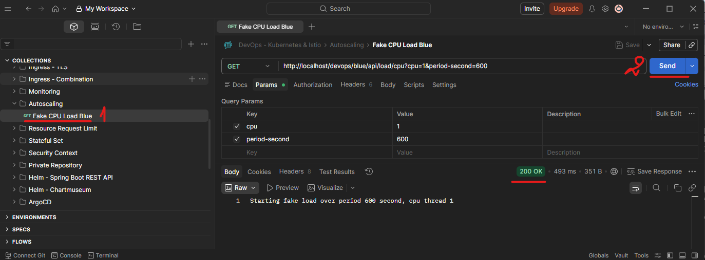
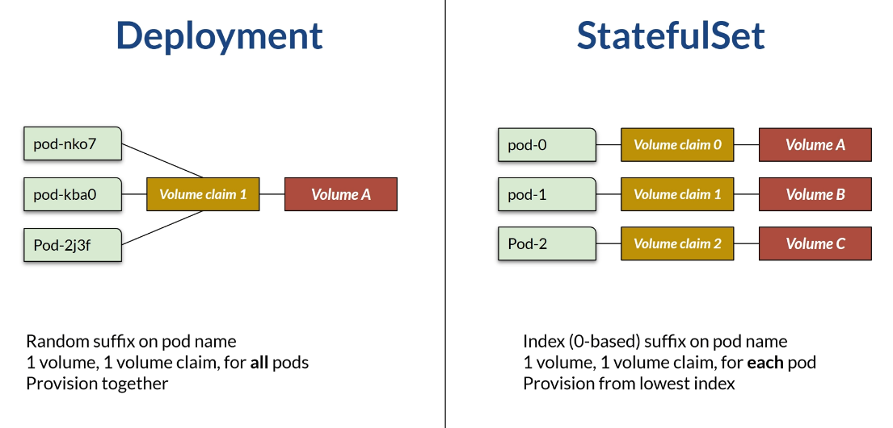
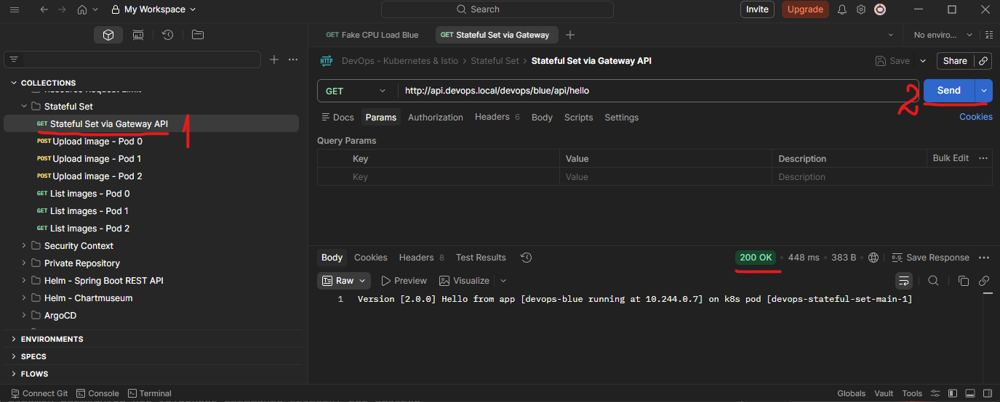
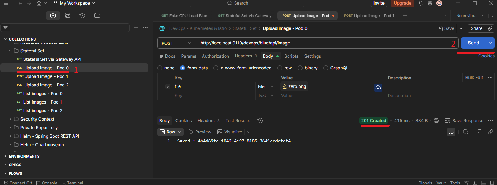
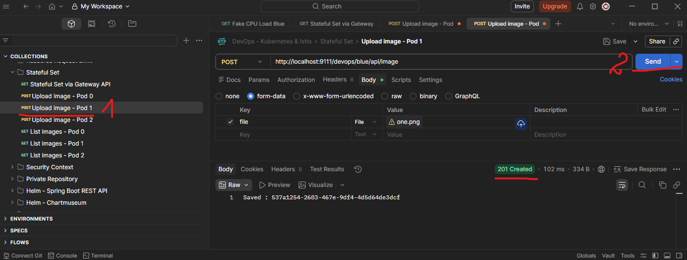
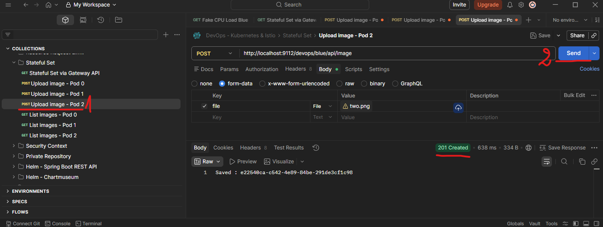
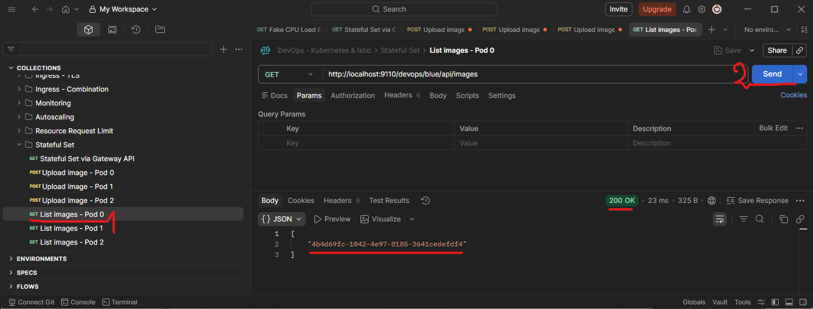
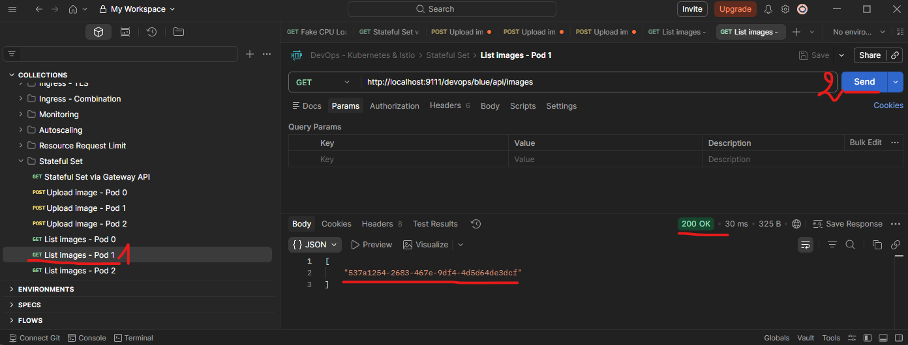
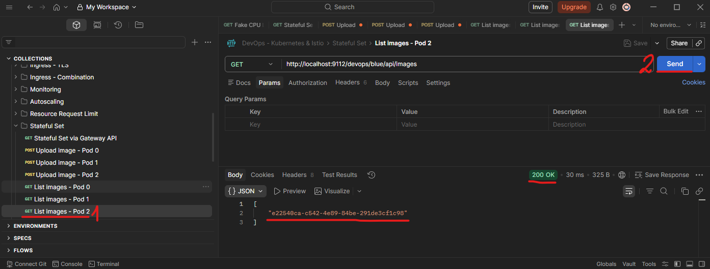

# Section 14 Autoscaling & Stateful Set

## Content
- 50 [Horizontal Autoscaling](#50-horizontal-autoscaling)
- 51 [Stateful Set](#51-stateful-set)

Delete the previous minikube and start fresh Minikube cluster

    bash --> minikube delete
    bash --> minikube start --cpus 4 --memory 8192 --driver docker

List contexts

	bash --> kubectl config get-contexts

Set minikube contexts

	bash --> kubectl config use-context minikube

Start minikube tunnel and don't close the terminal

    bash --> minikube tunnel

Make sure that address are added to Windows host list
- Open PowerShell as Admin

		terminal --> notepad C:\Windows\System32\drivers\etc\hosts

- add 
```text
127.0.0.1 localhost                     
127.0.0.1 blue.devops.local             # required 
127.0.0.1 yellow.devops.local           # required 
127.0.0.1 api.devops.local              # required 
127.0.0.1 monitoring.devops.local
127.0.0.1 rabbitmq.devops.local
127.0.0.1 chartmuseum.devops.local
127.0.0.1 argocd.devops.local
```
- save the file and exit

## 50 Horizontal Autoscaling

In the earlier section, I mentioned that a ship captain can create or remove a pod replica, based on a certain threshold. For example, if the CPU usage is above 500 millicores. This feature is called a horizontal pod autoscaler. To use it, we need the metrics server running, because, as you already saw, it monitors the resource. 

Enable it on minikube:

    CMD --> minikube addons enable metrics-server

    # result:
    💡  metrics-server is an addon maintained by Kubernetes. For any concerns contact minikube on GitHub.
    You can view the list of minikube maintainers at: https://github.com/kubernetes/minikube/blob/master/OWNERS
        ▪ Using image registry.k8s.io/metrics-server/metrics-server:v0.8.1
    🌟  The 'metrics-server' addon is enabled

In this lesson, we will create a sample Horizontal Pod Autoscaler. We will start with 1 blue replica and a maximum of 3. A horizontal pod autoscaler increases or decreases the number of pods based on CPU load. Kubernetes will query the resource periodically and add or remove replicas based on a quantitative metric. The behavior for add or remove, such as the query interval or the time window used to calculate average CPU, can be overridden, but the default value is usually sufficient. 

HPA will have two behaviors: scale up and scale down. Both will require periodic resource usage from the metrics server, calculated over a certain period. Scale-up adds more replicas when resource usage exceeds a specified threshold. Scale down will remove the replica when the resource usage is below the threshold metric. This behavior and the threshold metrics can be configured using HPA. HPA already provides a default policy for scaling up or down, which specifies how it will scale and over what time period. We can also define our own policy. For many use cases, the default policy is enough, and we only define the threshold metric. 

Open folder autoscaling. Here is the deployment file, devops-autoscaling.yml. This configuration will create one replica of the blue application and expose it through ingress org gateway API. Nothing new, we have learn about this. 

The new thing is in the file devops-hpa.yml. Here, we define a Horizontal Pod Autoscaler. The HPA will target a particular deployment, so the kind and name in the target ref spec must match the deployment name. We need at least 1 replica, but no more than 3. In here, we don't define any scale-up or scale-down policy. Therefore, we will use the default policy. In the default policy, scaling down will take longer. This behavior means that if usage exceeds the threshold, a new pod will be added immediately. But when usage is below the metric, it will wait for a few minutes to ensure the resource is truly below the metric before scaling down. The default policy can be changed at any time, so check the Kubernetes API reference for the HPA if we need to know the policy. We define the threshold metrics in this section. Here, we define the thresholds as 60% memory usage and 50% CPU usage. So if usage is above or below this threshold, autoscaling will be triggered, either up or down.

devops-hpa.yml

```yaml
apiVersion: autoscaling/v2
kind: HorizontalPodAutoscaler
metadata:
  namespace: devops
  name: devops-autoscaling-hpa
  labels:
    app.kubernetes.io/name: devops-autoscaling
spec:
  scaleTargetRef:
    apiVersion: apps/v1
    kind: Deployment
    name: devops-autoscaling-deployment     # A
  minReplicas: 1
  maxReplicas: 3
  metrics:
    - type: Resource
      resource:
        name: memory
        target:
          type: Utilization
          averageUtilization: 85                # memory threshold
    - type: Resource
      resource:
        name: cpu
        target:
          type: Utilization
          averageUtilization: 70                # CPU threshold
```

Please ensure you allocate enough memory and CPU to minikube before trying the demo. Also, ensure you install the gateway API. 

Install API Gateway CRD

    CMD --> kubectl kustomize https://github.com/nginx/nginx-gateway-fabric/config/crd/gateway-api/standard | kubectl apply -f -

    # result:
    customresourcedefinition.apiextensions.k8s.io/backendtlspolicies.gateway.networking.k8s.io created
    customresourcedefinition.apiextensions.k8s.io/gatewayclasses.gateway.networking.k8s.io created
    customresourcedefinition.apiextensions.k8s.io/gateways.gateway.networking.k8s.io created
    customresourcedefinition.apiextensions.k8s.io/grpcroutes.gateway.networking.k8s.io created
    customresourcedefinition.apiextensions.k8s.io/httproutes.gateway.networking.k8s.io created
    customresourcedefinition.apiextensions.k8s.io/listenersets.gateway.networking.k8s.io created
    customresourcedefinition.apiextensions.k8s.io/referencegrants.gateway.networking.k8s.io created
    customresourcedefinition.apiextensions.k8s.io/tlsroutes.gateway.networking.k8s.io created
    validatingadmissionpolicy.admissionregistration.k8s.io/safe-upgrades.gateway.networking.k8s.io created
    validatingadmissionpolicybinding.admissionregistration.k8s.io/safe-upgrades.gateway.networking.k8s.io created

Install the Fabric Gateway Api in nginx-gateway namespace

    CMD --> helm upgrade --install my-nginx-gateway-api oci://ghcr.io/nginx/charts/nginx-gateway-fabric --create-namespace -n nginx-gateway

    # result:
    Release "my-nginx-gateway-api" does not exist. Installing it now.
    Pulled: ghcr.io/nginx/charts/nginx-gateway-fabric:2.4.2
    Digest: sha256:dc86ff2fad1f5f000cab6bf0d953f7a3c1347550834c41249798c670414ecc1a
    NAME: my-nginx-gateway-api
    LAST DEPLOYED: Fri Mar 13 22:43:18 2026
    NAMESPACE: nginx-gateway
    STATUS: deployed
    REVISION: 1
    DESCRIPTION: Install complete
    TEST SUITE: None

Ensure that a service with type cluster IP is created in the nginx-gateway namespace.

    CMD --> kubectl get service -n nginx-gateway

    # result:
    NAME                                        TYPE        CLUSTER-IP       EXTERNAL-IP   PORT(S)   AGE
    my-nginx-gateway-api-nginx-gateway-fabric   ClusterIP   10.110.225.209   <none>        443/TCP   65s

Apply this applications manifest. 

    CMD --> kubectl apply -f devops-autoscaling.yml

    # result:
    namespace/devops created
    deployment.apps/devops-autoscaling-deployment created
    service/devops-blue-clusterip created
    gateway.gateway.networking.k8s.io/devops-gateway created
    httproute.gateway.networking.k8s.io/devops-path-route created

Apply HPA horizonal autoscaler

    CMD --> kubectl apply -f devops-hpa.yml

    # result: horizontalpodautoscaler.autoscaling/devops-autoscaling-hpa created

We can see the Horizontal Pod Autoscaler. 

    CMD --> kubectl get hpa -n devops

    # result:
    NAME                     REFERENCE                                  NAME                     REFERENCE                                  TARGETS                        MINPODS   MAXPODS   REPLICAS   AGE
    devops-autoscaling-hpa   Deployment/devops-autoscaling-deployment   memory: 31%/85%, cpu: 0%/70%   1         3         1          3h19m

Wait a moment while the metrics server populates resource usage, and we can see the actual versus the threshold. 

Or, for further information, including scale event, describe the HorizontalPod Autoscaler.

    CMD --> kubectl describe hpa -n devops devops-autoscaling-hpa

    # result: 

    ```yaml
    Name:                                                     devops-autoscaling-hpa
    Namespace:                                                devops
    Labels:                                                   app.kubernetes.io/name=devops-autoscaling
    Annotations:                                              <none>
    CreationTimestamp:                                        Fri, 13 Mar 2026 18:08:52 +0200
    Reference:                                                Deployment/devops-autoscaling-deployment
    Metrics:                                                  ( current / target )
    resource memory on pods  (as a percentage of request):  <unknown> / 85%
    resource cpu on pods  (as a percentage of request):     <unknown> / 70%
    Min replicas:                                             1
    Max replicas:                                             3
    Deployment pods:                                          1 current / 0 desired
    Conditions:
    Type           Status  Reason                   Message
    ----           ------  ------                   -------
    AbleToScale    True    SucceededGetScale        the HPA controller was able to get the target's current scale
    ScalingActive  False   FailedGetResourceMetric  the HPA was unable to compute the replica count: failed to get memory utilization: unable to get metrics for resource memory: unable to fetch metrics from resource metrics API: the server could not find the requested resource (get pods.metrics.k8s.io)
    Events:
    Type     Reason                   Age                     From                       Message
    ----     ------                   ----                    ----                       -------
    Warning  FailedGetResourceMetric  3m20s (x701 over 178m)  horizontal-pod-autoscaler  failed to get memory utilization: unable to get metrics for resource memory: unable to fetch metrics from resource metrics API: the server could not find the requested resource (get pods.metrics.k8s.io)
    ```

Currently, we have only one pod replica, as indicated by the HPA.

    CMD --> kubectl get pods -n devops

    # result:
    NAME                                             READY   STATUS    RESTARTS   AGE
    devops-autoscaling-deployment-857d6855cf-6fp7f   1/1     Running   0          98s
    devops-gateway-nginx-7d8845445f-mvptm            1/1     Running   0          98s

Open the Postman collection in the folder autoscaling. Here, I provide an API to fake CPU load. Run thisendpoint with one CPU thread for 600 seconds.



 We can see the HPA metrics. Kubernetes will periodically gather metrics, so give it some time. Try querying the HPA several times until we see that CPU utilization is above the threshold. Notice that the replica has now become 2.

    CMD --> kubectl get hpa -n devops -w

    # result:
    NAME                     REFERENCE                                  TARGETS                          MINPODS   MAXPODS   REPLICAS   AGE
    devops-autoscaling-hpa   Deployment/devops-autoscaling-deployment   memory: 29%/85%, cpu: 100%/70%   1         3         2          6m50s

If we describe the event on HPA, we will see that it scales up.

    CMD --> kubectl describe hpa -n devops devops-autoscaling-hpa

    # result: 

    ```yaml
    Name:                                                     devops-autoscaling-hpa
    Namespace:                                                devops
    Labels:                                                   app.kubernetes.io/name=devops-autoscaling
    Annotations:                                              <none>
    CreationTimestamp:                                        Fri, 13 Mar 2026 18:08:52 +0200
    Reference:                                                Deployment/devops-autoscaling-deployment
    Metrics:                                                  ( current / target )
    resource memory on pods  (as a percentage of request):  <unknown> / 85%
    resource cpu on pods  (as a percentage of request):     <unknown> / 70%
    Min replicas:                                             1
    Max replicas:                                             3
    Deployment pods:                                          1 current / 0 desired
    Conditions:
    Type           Status  Reason                   Message
    ----           ------  ------                   -------
    AbleToScale    True    SucceededGetScale        the HPA controller was able to get the target's current scale
    ScalingActive  False   FailedGetResourceMetric  the HPA was unable to compute the replica count: failed to get memory utilization: unable to get metrics for resource memory: unable to fetch metrics from resource metrics API: the server could not find the requested resource (get pods.metrics.k8s.io)
    Events:
    Type     Reason                   Age                     From                       Message
    ----     ------                   ----                    ----                       -------
    Warning  FailedGetResourceMetric  3m20s (x701 over 178m)  horizontal-pod-autoscaler  failed to get memory utilization: unable to get metrics for resource memory: unable to fetch metrics from resource metrics API: the server could not find the requested resource (get pods.metrics.k8s.io)
    Normal   SuccessfulRescale             13m                horizontal-pod-autoscaler  New size: 2; reason: cpu resource utilization (percentage of request) above target
    ```

    CMD --> kubectl get pods -n devops

    # result:
    NAME                                             READY   STATUS    RESTARTS   AGE
    devops-autoscaling-deployment-857d6855cf-5lq6l   1/1     Running   0          2m28s
    devops-autoscaling-deployment-857d6855cf-6fp7f   1/1     Running   0          7m22s
    devops-gateway-nginx-7d8845445f-mvptm            1/1     Running   0          7m22s

When the endpoint finishes running and the CPU is back below the threshold, wait a few minutes for HPA to scale down. The scaling down can take a few minutes, depending on the HPA scale-down policy. Currently, it takes at least 5 minutes for the CPU to drop below the threshold.

    CMD --> kubectl get hpa -n devops -w

    # result:
    NAME                     REFERENCE                                  TARGETS                        MINPODS   MAXPODS   REPLICAS   AGE
    devops-autoscaling-hpa   Deployment/devops-autoscaling-deployment   memory: 30%/85%, cpu: 0%/70%   1         3         2          19m
    devops-autoscaling-hpa   Deployment/devops-autoscaling-deployment   memory: 30%/85%, cpu: 0%/70%   1         3         2          19m
    devops-autoscaling-hpa   Deployment/devops-autoscaling-deployment   memory: 30%/85%, cpu: 0%/70%   1         3         2          20m
    devops-autoscaling-hpa   Deployment/devops-autoscaling-deployment   memory: 30%/85%, cpu: 0%/70%   1         3         2          21m
    devops-autoscaling-hpa   Deployment/devops-autoscaling-deployment   memory: 30%/85%, cpu: 0%/70%   1         3         2          22m
    devops-autoscaling-hpa   Deployment/devops-autoscaling-deployment   memory: 30%/85%, cpu: 0%/70%   1         3         1          22m
    devops-autoscaling-hpa   Deployment/devops-autoscaling-deployment   memory: 30%/85%, cpu: 0%/70%   1         3         1          23m

    CMD --> kubectl get pods -n devops

    # result:
    NAME                                             READY   STATUS    RESTARTS   AGE
    devops-autoscaling-deployment-857d6855cf-6fp7f   1/1     Running   0          24m
    devops-gateway-nginx-7d8845445f-mvptm            1/1     Running   0          24m

[⬆ Back to top](#top)


## 51 Stateful Set

[⬆ Back to top](#top)

Delete the previous minikube and start fresh Minikube cluster

    bash --> minikube delete
    bash --> minikube start --cpus 4 --memory 8192 --driver docker
    bash --> minikube tunnel

So far, we have used a deployment object to deploy the application. As we can see, each time we deploy an application, a pod replica will be created. Each pod replica will have a unique suffix on the pod name. We can also mount a volume to each pod replica. Depends on the volume type, behaviour will vary. Some, such as emptydir, can cause data loss if a pod is recreated or scaled. 

There are use cases where a pod requires fixed naming. This means Kubernetes DNS will be predictable and consistent, since it's based on pod names. Also, each pod must always use the same volume. For example, a cluster of RabbitMQ message brokers that consists of several RabbitMQ instances (or pods) requires a fixed URL, represented by a fixed pod name that remains the same after restarts. Another example is an Elasticsearch cluster, whose data is distributed among instances. This means each Elasticsearch instance requires a fixed URL and a fixed volume bind, so that pod 1 always refers to volume 1, even after a restart. To handle this requirement, we can use a Kubernetes StatefulSet. 

## StatefulSet

StatefulSet configuration is similar to that of a deployment. Additionally, we can add a volume template to a statefulset. Pods in a stateful set will have fixed names with an index, such as pod-0, pod-1, and so on. When pods are restarted, they will keep that name. Volume on the stateful set pod is also stable. Pod-0 will always get volume 0, pod 1 gets volume 1, etc. Deleting or scaling down a stateful set will not delete the volume. The index for a pod name always starts at 0 and increments by 1. So the order of creation, or deletion, is predictable. Creation starts at 0 and increases by 1. Deletion will delete the pod with the highest index, decrementing it by 1 until it reaches 0. 

This is the difference between creating a deployment and a stateful set. Assume we will have three replicas. On deployment, the pod has a random suffix as its name. Each pod will have 1 volume and 1 volume claim. All objects (pod, volume, and volume claim) will be provisioned together. And this is for a stateful set. Notice the animation. Pod will be provisioned from the lowest index. The index is numeric, starts at 0, and is used as a suffix on the pod name. Each volume will have 1 claim per pod. 



Open the folder stateful set. To begin with, let's see the deployment - devops-deployment.yml. 

    CMD --> kubectl apply -f devops-deployment.yml

Check the pod, volume, and volume claim. And we will see that all are provisioned together, as in the last diagram.

    CMD --> kubectl get pods,pv,pvc -n devops

    # result:
    NAME                                                  READY   STATUS    RESTARTS      AGE
    pod/devops-volume-deployment-local-644d76b588-5fxx5   1/1     Running   1 (23m ago)   24m
    pod/devops-volume-deployment-local-644d76b588-kzbm9   1/1     Running   1 (16m ago)   24m
    pod/devops-volume-deployment-local-644d76b588-vfchg   1/1     Running   0             24m

    NAME                                                 CAPACITY   ACCESS MODES   RECLAIM POLICY   STATUS   CLAIM                                  STORAGECLASS           VOLUMEATTRIBUTESCLASS   REASON   AGE
    persistentvolume/upload-minikube-persistent-volume   100M       RWO            Retain           Bound    devops/upload-minikube-pv-claim-name   default-storageclass   <unset>                          24m

    NAME                                                  STATUS   VOLUME                              CAPACITY   ACCESS MODES   STORAGECLASS           VOLUMEATTRIBUTESCLASS   AGE
    persistentvolumeclaim/upload-minikube-pv-claim-name   Bound    upload-minikube-persistent-volume   100M       RWO            default-storageclass   <unset>                 24m

Delete them.

    CMD --> kubectl delete -f devops-deployment.yml

    # result:
    namespace "devops" deleted
    persistentvolume "upload-minikube-persistent-volume" deleted
    persistentvolumeclaim "upload-minikube-pv-claim-name" deleted from devops namespace
    deployment.apps "devops-volume-deployment-local" deleted from devops namespace
    service "devops-volume-service" deleted from devops namespace

Now, let's examine the stateful set YAML file - devops-stateful-set.yml. We define two volumes. We are using a standard storage class with dynamic provisioning. Means a volume will be created when needed, without us explicitly defining it. It is supported by minikube. Then we create a service. This service is headless, with no cluster IP service. It will be used to provide the network identity for stateful pods. The stateful set configuration is not much different from deployment.

We need to define the headless service. In a stateful set, we can use a volume claim template to create a persistent volume claim. Note that we have three replicas, while we only define two persistent volumes. Since the standard storage class can dynamically provision volume, a new persistent volume will be automatically created for the third replica. 

devops-stateful-set.yml

```yaml
apiVersion: v1
kind: Namespace
metadata:
  name:  devops

---

apiVersion: v1
kind: PersistentVolume
metadata:
  namespace: devops
  name: pv-a
spec:
  capacity:
    storage: 100M
  accessModes:
  - ReadWriteOnce
  persistentVolumeReclaimPolicy: Retain
  storageClassName: standard
  hostPath:
    path: /data/statefulset/pv-a
  nodeAffinity:
    required:
      nodeSelectorTerms:
      - matchExpressions:
        - key: kubernetes.io/hostname
          operator: In
          values:
          - minikube

---

apiVersion: v1
kind: PersistentVolume
metadata:
  namespace: devops
  name: pv-b
spec:
  capacity:
    storage: 100M
  accessModes:
  - ReadWriteOnce
  persistentVolumeReclaimPolicy: Retain
  storageClassName: standard
  hostPath:
    path: /data/statefulset/pv-b
  nodeAffinity:
    required:
      nodeSelectorTerms:
      - matchExpressions:
        - key: kubernetes.io/hostname
          operator: In
          values:
          - minikube

---

apiVersion: v1
kind: Service
metadata:
  namespace: devops
  name: devops-stateful-set-headless-service
  labels:
    app.kubernetes.io/name: devops-stateful-set
spec:
  clusterIP: None      # Create headless service
  selector:
    app.kubernetes.io/name: devops-stateful-set-pod
  ports:
  - port: 8111

---

apiVersion: apps/v1
kind: StatefulSet
metadata:
  namespace: devops
  name: devops-stateful-set-main
  labels:
    app.kubernetes.io/name: devops-stateful-set
spec:
  selector:
    matchLabels:
      app.kubernetes.io/name: devops-stateful-set-pod
  template:
    metadata:
      labels:
        app.kubernetes.io/name: devops-stateful-set-pod
        app.kubernetes.io/version: 2.0.0
    spec:
      containers:
      - name: devops-blue
        image: timpamungkas/devops-blue:2.0.0
        resources:
          limits:
            cpu: "0.3"
            memory: 200M
        ports:
        - name:  http
          containerPort: 8111
          protocol: TCP
        readinessProbe:
          httpGet:
            path: /devops/blue/actuator/health/readiness
            port: 8111
            scheme: HTTP
          initialDelaySeconds: 60
          periodSeconds: 30
          timeoutSeconds: 5
          failureThreshold: 4
        livenessProbe:
          httpGet:
            path: /devops/blue/actuator/health/liveness
            port: 8111
            scheme: HTTP
          initialDelaySeconds: 60
          periodSeconds: 30
          timeoutSeconds: 5
          failureThreshold: 4
        volumeMounts:
          - name: pod-storage
            mountPath: /upload/image
          - name: pod-storage
            mountPath: /upload/doc
  serviceName: devops-stateful-set-headless-service    # required
  volumeClaimTemplates:
    - metadata:
        name: pod-storage
      spec:
        storageClassName: standard
        resources:
          requests:
            storage: 20Mi
        accessModes:
        - ReadWriteOnce
  replicas: 3
```

Apply the stateful set.

    CMD --> kubectl apply -f devops-stateful-set.yml

    # result:
    namespace/devops created
    persistentvolume/pv-a created
    persistentvolume/pv-b created
    service/devops-stateful-set-headless-service created
    statefulset.apps/devops-stateful-set-main created

And as we can see, only one pod will be created at a time. 

    CMD --> kubectl get pods,pv,pvc -n devops

    # result:
    NAME                             READY   STATUS    RESTARTS   AGE
    pod/devops-stateful-set-main-0   0/1     Running   0          60s

    NAME                    CAPACITY   ACCESS MODES   RECLAIM POLICY   STATUS      CLAIM                                           STORAGECLASS   VOLUMEATTRIBUTESCLASS   REASON   AGE
    persistentvolume/pv-a   100M       RWO            Retain           Bound       devops/pod-storage-devops-stateful-set-main-0   standard       <unset>                          60s
    persistentvolume/pv-b   100M       RWO            Retain           Available                                                   standard       <unset>                          60s

    NAME                                                           STATUS   VOLUME   CAPACITY   ACCESS MODES   STORAGECLASS   VOLUMEATTRIBUTESCLASS   AGE
    persistentvolumeclaim/pod-storage-devops-stateful-set-main-0   Bound    pv-a     100M       RWO            standard       <unset>                 60s

When the pod with the lowest index is ready, the next index will be created. Also, the third volume is automatically created for us.

    CMD --> kubectl get pods,pv,pvc -n devops

    # result:
    NAME                             READY   STATUS              RESTARTS   AGE
    pod/devops-stateful-set-main-0   1/1     Running             0          2m4s
    pod/devops-stateful-set-main-1   1/1     Running             0          62s
    pod/devops-stateful-set-main-2   0/1     ContainerCreating   0          0s

    NAME                                                        CAPACITY   ACCESS MODES   RECLAIM POLICY   STATUS   CLAIM                                           STORAGECLASS   VOLUMEATTRIBUTESCLASS   REASON   AGE
    persistentvolume/pv-a                                       100M       RWO            Retain           Bound    devops/pod-storage-devops-stateful-set-main-0   standard       <unset>                          2m4s
    persistentvolume/pv-b                                       100M       RWO            Retain           Bound    devops/pod-storage-devops-stateful-set-main-1   standard       <unset>                          2m4s
    persistentvolume/pvc-5e5e4396-8c66-4de2-9c9c-c69c8d218b34   20Mi       RWO            Delete           Bound    devops/pod-storage-devops-stateful-set-main-2   standard       <unset>                          0s

    NAME                                                           STATUS   VOLUME                                     CAPACITY   ACCESS MODES   STORAGECLASS   VOLUMEATTRIBUTESCLASS   AGE
    persistentvolumeclaim/pod-storage-devops-stateful-set-main-0   Bound    pv-a                                       100M       RWO            standard       <unset>                 2m4s
    persistentvolumeclaim/pod-storage-devops-stateful-set-main-1   Bound    pv-b                                       100M       RWO            standard       <unset>                 62s
    persistentvolumeclaim/pod-storage-devops-stateful-set-main-2   Bound    pvc-5e5e4396-8c66-4de2-9c9c-c69c8d218b34   20Mi       RWO            standard       <unset>                 0s

Stateful sets are like deployments, where we can create regular services, like load balancers. Or even create a gateway API HTTP route for accessing the stateful set. 

Install API Gateway CRD

    CMD --> kubectl kustomize https://github.com/nginx/nginx-gateway-fabric/config/crd/gateway-api/standard | kubectl apply -f -

    # result:
    customresourcedefinition.apiextensions.k8s.io/backendtlspolicies.gateway.networking.k8s.io created
    customresourcedefinition.apiextensions.k8s.io/gatewayclasses.gateway.networking.k8s.io created
    customresourcedefinition.apiextensions.k8s.io/gateways.gateway.networking.k8s.io created
    customresourcedefinition.apiextensions.k8s.io/grpcroutes.gateway.networking.k8s.io created
    customresourcedefinition.apiextensions.k8s.io/httproutes.gateway.networking.k8s.io created
    customresourcedefinition.apiextensions.k8s.io/listenersets.gateway.networking.k8s.io created
    customresourcedefinition.apiextensions.k8s.io/referencegrants.gateway.networking.k8s.io created
    customresourcedefinition.apiextensions.k8s.io/tlsroutes.gateway.networking.k8s.io created
    validatingadmissionpolicy.admissionregistration.k8s.io/safe-upgrades.gateway.networking.k8s.io created
    validatingadmissionpolicybinding.admissionregistration.k8s.io/safe-upgrades.gateway.networking.k8s.io created

Install the Fabric Gateway Api in nginx-gateway namespace

    CMD --> helm upgrade --install my-nginx-gateway-api oci://ghcr.io/nginx/charts/nginx-gateway-fabric --create-namespace -n nginx-gateway

    # result:
    Release "my-nginx-gateway-api" does not exist. Installing it now.
    Pulled: ghcr.io/nginx/charts/nginx-gateway-fabric:2.4.2
    Digest: sha256:dc86ff2fad1f5f000cab6bf0d953f7a3c1347550834c41249798c670414ecc1a
    NAME: my-nginx-gateway-api
    LAST DEPLOYED: Fri Mar 13 22:43:18 2026
    NAMESPACE: nginx-gateway
    STATUS: deployed
    REVISION: 1
    DESCRIPTION: Install complete
    TEST SUITE: None

Ensure that a service with type cluster IP is created in the nginx-gateway namespace.

    CMD --> kubectl get service -n nginx-gateway

    # result:
    NAME                                        TYPE        CLUSTER-IP       EXTERNAL-IP   PORT(S)   AGE
    my-nginx-gateway-api-nginx-gateway-fabric   ClusterIP   10.110.225.209   <none>        443/TCP   65s

For example, see the stateful set gateway API file - devops-stateful-set-gateway-api.yml.

devops-stateful-set-gateway-api.yml

```yaml
apiVersion: v1
kind: Service
metadata:
  namespace: devops
  name: devops-stateful-set-clusterip
  labels:
    app.kubernetes.io/name: devops-stateful-set
spec:
  selector:
    app.kubernetes.io/name: devops-stateful-set-pod
  ports:
  - port: 8111
    name: http

---

apiVersion: gateway.networking.k8s.io/v1
kind: Gateway
metadata:
  name: devops-gateway
  namespace: devops
spec:
  gatewayClassName: nginx
  listeners:
  - name: http
    protocol: HTTP
    port: 80
    hostname: api.devops.local
    allowedRoutes:
      namespaces:
        from: Same

---

apiVersion: gateway.networking.k8s.io/v1
kind: HTTPRoute
metadata:
  name: devops-httproute-stateful-set
  namespace: devops
  labels:
    app.kubernetes.io/name: devops-httproute-stateful-set
spec:
  parentRefs:
  - name: devops-gateway
  hostnames:
  - api.devops.local
  rules:
  - matches:
    - path:
        type: PathPrefix
        value: /devops/blue
    backendRefs:
    - name: devops-stateful-set-clusterip
      port: 8111
```

This is not different from what we have learned about the gateway API. It will create the gateway API objects. When we run it, we will be able to access the stateful set. 

    CMD --> kubectl apply -f devops-stateful-set-gateway-api.yml

    # result:
    service/devops-stateful-set-clusterip created
    gateway.gateway.networking.k8s.io/devops-gateway created
    httproute.gateway.networking.k8s.io/devops-httproute-stateful-set created


Postman Collection / Stateful Set / GET Stateful Set via Gateway        
    - address: http://api.devops.local/devops/blue/api/hello
    

<br>
<br>
We can also accessthe pod another way, such as port forwarding. I will open three port forwards, one for each pod. 

DONT CLOSE THE TERMINALS !!!

    new CMD --> kubectl port-forward -n devops devops-stateful-set-main-0 9110:8111

    # result:
    Forwarding from 127.0.0.1:9110 -> 8111
    Forwarding from [::1]:9110 -> 8111

    new CMD --> kubectl port-forward -n devops devops-stateful-set-main-1 9111:8111

    # result:
    Forwarding from 127.0.0.1:9111 -> 8111
    Forwarding from [::1]:9111 -> 8111

    new CMD --> kubectl port-forward -n devops devops-stateful-set-main-2 9112:8111

    # result:
    Forwarding from 127.0.0.1:9112 -> 8111
    Forwarding from [::1]:9112 -> 8111


From the Postman, I will upload one image to each pod. 






<br>
<br>
Using port forwarding, we can access the pod directly. When we list the images, we will have one image per pod. Notice the image ID for each pod. 
<br>




    
<br>
<br>

As we know, storage is alwaysclaimed by the same pod, even during podrestarts or delete-and-recreate operations. For example, let's scale down the stateful set to a single replica.

devops-stateful-set.yml

```yaml
...
---

apiVersion: apps/v1
kind: StatefulSet
metadata:
  namespace: devops
...
  replicas: 1                           # scale down to a single replica
```

Apply the changes

    CMD --> kubectl apply -f devops-stateful-set.yml

    # result:
    namespace/devops unchanged
    persistentvolume/pv-a unchanged
    persistentvolume/pv-b unchanged
    service/devops-stateful-set-headless-service unchanged
    statefulset.apps/devops-stateful-set-main configured

List pods

    CMD --> kubectl get pods -n devops

    # result:
    NAME                                    READY   STATUS    RESTARTS   AGE
    devops-gateway-nginx-78fc9f99d8-7lxn7   1/1     Running   0          44m
    devops-stateful-set-main-0              1/1     Running   0          45m    # one replica only

Or, more extreme, stop and then restart minikube.

    CMD --> minikube stop

    # result:
    ✋  Stopping node "minikube"  ...
    🛑  Powering off "minikube" via SSH ...
    🛑  1 node stopped.

    CMD --> minikube start

    # result:
    😄  minikube v1.38.1 on Microsoft Windows 11 Home 25H2
    ✨  Using the docker driver based on existing profile
    👍  Starting "minikube" primary control-plane node in "minikube" cluster
    🚜  Pulling base image v0.0.50 ...
    🔄  Restarting existing docker container for "minikube" ...
    🐳  Preparing Kubernetes v1.35.1 on Docker 29.2.1 ...
    🔎  Verifying Kubernetes components...
        ▪ Using image gcr.io/k8s-minikube/storage-provisioner:v5
    🌟  Enabled addons: default-storageclass, storage-provisioner
    🏄  Done! kubectl is now configured to use "minikube" cluster and "default" namespace by default

Now scale the stateful set back to 3 replicas.

devops-stateful-set.yml

```yaml
...
---

apiVersion: apps/v1
kind: StatefulSet
metadata:
  namespace: devops
...
  replicas: 3                           # scale up back to 3 replicas
```

Apply the changes

    CMD --> kubectl apply -f devops-stateful-set.yml

    # result:
    namespace/devops unchanged
    persistentvolume/pv-a unchanged
    persistentvolume/pv-b unchanged
    service/devops-stateful-set-headless-service unchanged
    statefulset.apps/devops-stateful-set-main configured

Wait for the pods t be running and start the port forward for three pods.

    new CMD --> kubectl port-forward -n devops devops-stateful-set-main-0 9110:8111

    # result:
    Forwarding from 127.0.0.1:9110 -> 8111
    Forwarding from [::1]:9110 -> 8111

    new CMD --> kubectl port-forward -n devops devops-stateful-set-main-1 9111:8111

    # result:
    Forwarding from 127.0.0.1:9111 -> 8111
    Forwarding from [::1]:9111 -> 8111

    new CMD --> kubectl port-forward -n devops devops-stateful-set-main-2 9112:8111

    # result:
    Forwarding from 127.0.0.1:9112 -> 8111
    Forwarding from [::1]:9112 -> 8111

Then check the image list.


As we can see, each pod will maintain the same volume, and the image list will remain the same as before scaling down. The drawback is that we cannot retrieve the whole dataset. So if we have 10 data and 3 replicas, 2 of them might be on the first volume, 5 on the second, and the rest on the third. However, there is no straightforward way to obtain all 10 data points.

[⬆ Back to top](#top)

