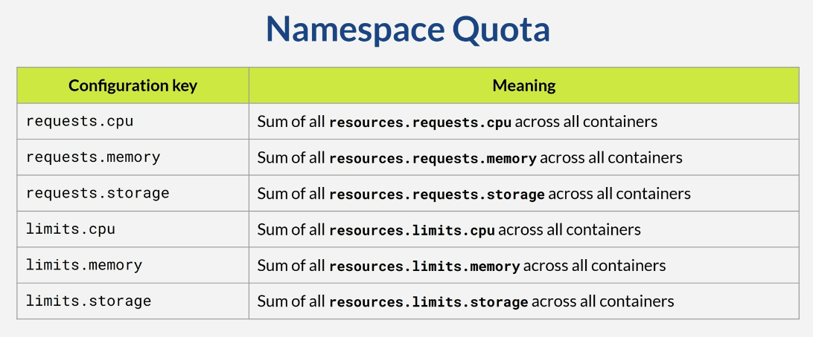
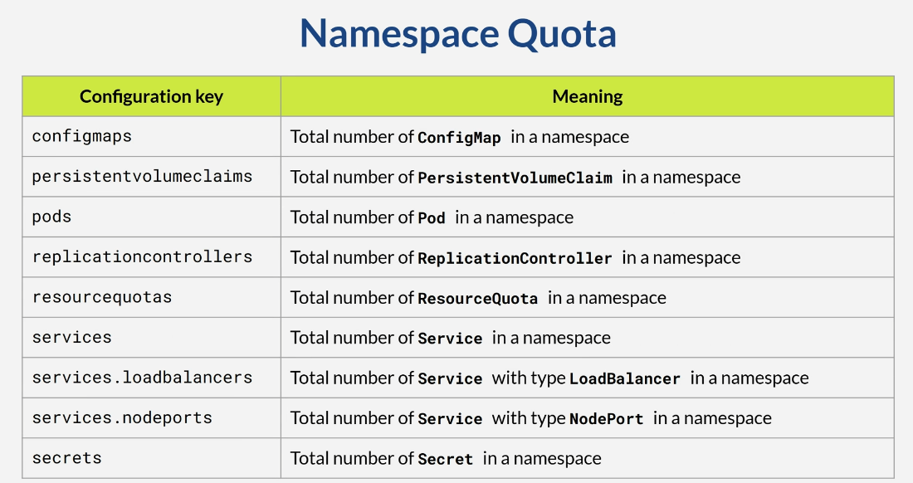

# Section 15 Quota & Service Account

## Content
- 52 [Resource Quota](#52-resource-quota)
- 53 [Namespace Quota](#53-namespace-quota)
- 54 [Service Account](#54-service-account)

Make sure that address are added to Windows host list
- Open PowerShell as Admin

        terminal --> notepad C:\Windows\System32\drivers\etc\hosts

- add 
```text
127.0.0.1 localhost                     
127.0.0.1 blue.devops.local
127.0.0.1 yellow.devops.local
127.0.0.1 api.devops.local
127.0.0.1 monitoring.devops.local
127.0.0.1 rabbitmq.devops.local
127.0.0.1 chartmuseum.devops.local
127.0.0.1 argocd.devops.local
```
- save the file and exit

## 52 Resource Quota

[⬆ Back to top](#top)

Each container in a Kubernetes pod can have a resource quota. A resource is an item required for an application to run, such as CPU, memory, or storage. The quota is optional, but it is a good idea to put it in the configuration. Hence, a container on a pod will not consume all available resources and disturb others.

There are two types of quota: 
- requests
- limits

Requests are the minimum resources required by the application. If the existing Kubernetes cluster does not have the resources required by the requested specification, the pod will not be alive. 

On the contrary, a limit is the maximum resource an application can use. A pod will not be allowed to exceed the resource limit.

Let's see an example. I will delete my minikube. And recreate it. 

    CMD --> minikube delete
    CMD --> minikube start --memory 4000 --cpus 2 --extra-config=kubelet.housekeeping-interval=10s

Notice that my minikube only has 2 cores and 4 GB of memory.

Open the folder resources-request-limits on the invalid file - devops-blue-invalid-one.yml. Here, we request 6 gigabytes of memory, while minikube has only 4 gigabytes available. 

devops-blue-invalid-one.yml

```yaml
apiVersion: v1
kind: Namespace
metadata:
  name:  devops

---

apiVersion: apps/v1
kind: Deployment
metadata:
  namespace: devops
  name: devops-blue-deployment
  labels:
    app.kubernetes.io/name: devops-blue
spec:
  selector:
    matchLabels:
      app.kubernetes.io/name: devops-blue
  template:
    metadata:
      labels:
        app.kubernetes.io/name: devops-blue
        app.kubernetes.io/version: 2.0.0
    spec:
      containers:
      - name: devops-blue
        image: timpamungkas/devops-blue:2.0.0
        resources:
          requests:
            cpu : "0.15"
            memory: 20Gi     # Too large (current minikube only has 4 Gigabyte)
          limits:
            cpu : "4"
            memory: 32Gi     # That's OK even if larger than overall kubernetes resource, this is max limit
        ports:
        - name:  http
          containerPort: 8111
          protocol: TCP
        readinessProbe:
          httpGet:
            path: /devops/blue/actuator/health/readiness
            port: 8111
            scheme: HTTP
          initialDelaySeconds: 60
          periodSeconds: 30
          timeoutSeconds: 5
          failureThreshold: 4
        livenessProbe:
          httpGet:
            path: /devops/blue/actuator/health/liveness
            port: 8111
            scheme: HTTP
          initialDelaySeconds: 60
          periodSeconds: 30
          timeoutSeconds: 5
          failureThreshold: 4
  replicas: 1
```

So if we apply this configuration file, we will encounteran error.

    CMD --> kubectl apply -f devops-blue-invalid-one.yml

    # result:
    namespace/devops created
    deployment.apps/devops-blue-deployment created

Check the pod, which will have a pending status. If we look at the details, we willsee the error, although it is not very clear. 

    CMD --> kubectl get pods -n devops

    # result:
    NAME                                      READY   STATUS    RESTARTS   AGE
    devops-blue-deployment-75bdbf98df-rbrbx   0/1     Pending   0          8s

    CMD --> kubectl describe pod -n devops devops-blue-deployment-75bdbf98df-rbrbx

    # result:
    ...
    Events:
        Type     Reason            Age   From               Message
        ----     ------            ----  ----               -------
        Warning  FailedScheduling  39s   default-scheduler  0/1 nodes are available: 1 Insufficient memory. no new claims to deallocate, preemption: 0/1 nodes are available: 1 Preemption is not helpful for scheduling.

Delete the resources

    CMD --> kubectl delete -f devops-blue-invalid-one.yml

On file invalid two - devops-blue-invalid-two.yml, the limit is smaller than the request. Since the limit is the maximum threshold, this is not allowed.

devops-blue-invalid-two.yml

```yaml
apiVersion: v1
kind: Namespace
metadata:
  name:  devops

---

apiVersion: apps/v1
kind: Deployment
metadata:
  namespace: devops
  name: devops-blue-deployment
  labels:
    app.kubernetes.io/name: devops-blue
spec:
  selector:
    matchLabels:
      app.kubernetes.io/name: devops-blue
  template:
    metadata:
      labels:
        app.kubernetes.io/name: devops-blue
        app.kubernetes.io/version: 2.0.0
    spec:
      containers:
      - name: devops-blue
        image: timpamungkas/devops-blue:2.0.0
        resources:
          limits:
            cpu : "1"
            memory: 200M   
          requests:
            cpu : "0.15"
            memory: 250M   # limits must be less or equal than requests
        ports:
        - name:  http
          containerPort: 8111
          protocol: TCP
        readinessProbe:
          httpGet:
            path: /devops/blue/actuator/health/readiness
            port: 8111
            scheme: HTTP
          initialDelaySeconds: 60
          periodSeconds: 30
          timeoutSeconds: 5
          failureThreshold: 4
        livenessProbe:
          httpGet:
            path: /devops/blue/actuator/health/liveness
            port: 8111
            scheme: HTTP
          initialDelaySeconds: 60
          periodSeconds: 30
          timeoutSeconds: 5
          failureThreshold: 4
  replicas: 1
```

If we apply this configuration file, it will be rejected. 

    CMD --> kubectl apply -f devops-blue-invalid-two.yml

    # result:
    namespace/devops created
    The Deployment "devops-blue-deployment" is invalid: spec.template.spec.containers[0].resources.requests: Invalid value: "250M": must be less than or equal to memory limit of 200M

Delete the resources

    CMD --> kubectl delete -f devops-blue-invalid-two.yml

On file invalid three - devops-blue-invalid-three.yml, we provision a volume with a size of 100 megabytes. But for the persistent volume claim, we request 105 megabytes, which exceeds the provisioned volume. 

devops-blue-invalid-three.yml

```yaml
apiVersion: v1
kind: Namespace
metadata:
  name:  devops

---

apiVersion: storage.k8s.io/v1
kind: StorageClass
metadata:
  namespace: devops
  name: devops-blue-storage-class-name    # A1
provisioner: kubernetes.io/no-provisioner
volumeBindingMode: WaitForFirstConsumer

---

apiVersion: v1
kind: PersistentVolume
metadata:
  namespace: devops
  name: devops-blue-persistent-volume     # B1
spec:
  capacity:
    storage: 100M   # E1
  accessModes:
  - ReadWriteOnce
  persistentVolumeReclaimPolicy: Retain
  storageClassName: devops-blue-storage-class-name    # A1
  local:
    # path: /usr/share/k8s-local-storage/image              # Linux / Mac, use linux-style path
    path: /run/desktop/mnt/host/d/k8s-local-storage/image   # Windows, use this syntax to mount at folder d:/k8s-local-storage/image
  nodeAffinity:
    required:
      nodeSelectorTerms:
      - matchExpressions:
        - key: kubernetes.io/hostname
          operator: In
          values:
          - minikube    # selector need to be changed based on `kubectl describe node`, and value on matching label 

---

kind: PersistentVolumeClaim
apiVersion: v1
metadata:
  namespace: devops
  name: devops-blue-pv-claim-name    # C1
spec:
  accessModes:
  - ReadWriteOnce
  storageClassName: devops-blue-storage-class-name  # A1
  resources:
    requests:
      storage: 105M   # Invalid, persistent volume only allow 100M (# E1) but requesting more

---

apiVersion: apps/v1
kind: Deployment
metadata:
  namespace: devops
  name: devops-blue-deployment
  labels:
    app.kubernetes.io/name: devops-blue
spec:
  selector:
    matchLabels:
      app.kubernetes.io/name: devops-blue
  template:
    metadata:
      labels:
        app.kubernetes.io/name: devops-blue
        app.kubernetes.io/version: 2.0.0
    spec:
      containers:
      - name: devops-blue
        image: timpamungkas/devops-blue:2.0.0
        resources:
          limits:
            cpu : "1"
            memory: 200M   
          requests:
            cpu : "0.15"
            memory: 200M
        ports:
        - name:  http
          containerPort: 8111
          protocol: TCP
        readinessProbe:
          httpGet:
            path: /devops/blue/actuator/health/readiness
            port: 8111
            scheme: HTTP
          initialDelaySeconds: 60
          periodSeconds: 30
          timeoutSeconds: 5
          failureThreshold: 4
        livenessProbe:
          httpGet:
            path: /devops/blue/actuator/health/liveness
            port: 8111
            scheme: HTTP
          initialDelaySeconds: 60
          periodSeconds: 30
          timeoutSeconds: 5
          failureThreshold: 4
        volumeMounts:
          - name: pod-image-storage   # D1
            mountPath: /upload/image
      volumes:
        - name: pod-image-storage   # D1
          persistentVolumeClaim:
            claimName: devops-blue-pv-claim-name   # C1
  replicas: 1
```

If we apply this configuration file, it will result in an error, where the volume is not bound. See the volume, volume claim, and pod. Since the volume claim cannot be obtained, the pod will not run.

    CMD --> kubectl apply -f devops-blue-invalid-three.yml

    # result:
    namespace/devops created
    storageclass.storage.k8s.io/devops-blue-storage-class-name created
    persistentvolume/devops-blue-persistent-volume created
    persistentvolumeclaim/devops-blue-pv-claim-name created
    deployment.apps/devops-blue-deployment created

List the pods

    CMD --> kubectl get persistentvolume,persistentvolumeclaim,pods -n devops

    # result:
    NAME                                             CAPACITY   ACCESS MODES   RECLAIM POLICY   STATUS      CLAIM   STORAGECLASS                     VOLUMEATTRIBUTESCLASS   REASON   AGE
    persistentvolume/devops-blue-persistent-volume   100M       RWO            Retain           Available           devops-blue-storage-class-name   <unset>                          2m31s

    NAME                                              STATUS    VOLUME   CAPACITY   ACCESS MODES   STORAGECLASS                     VOLUMEATTRIBUTESCLASS   AGE
    persistentvolumeclaim/devops-blue-pv-claim-name   Pending                                      devops-blue-storage-class-name   <unset>                 2m31s

    NAME                                          READY   STATUS    RESTARTS   AGE
    pod/devops-blue-deployment-6847df79fd-wp7d2   0/1     Pending   0          2m31s

Describe the pod

    CMD --> kubectl describe pod devops-blue-deployment-6847df79fd-wp7d2 -n devops

    # result:
    ...
    Events:
        Type     Reason            Age    From               Message
        ----     ------            ----   ----               -------
        Warning  FailedScheduling  3m51s  default-scheduler  0/1 nodes are available: 1 node(s) didn't find available persistent volumes to bind. no new claims to deallocate, preemption: 0/1 nodes are available: 1 Preemption is not helpful for scheduling.

Delete the resources

    CMD --> kubectl delete -f devops-blue-invalid-three.yml

[⬆ Back to top](#top)


## 53 Namespace Quota

[⬆ Back to top](#top)

Delete minikube from the previous lesson

    CMD --> minikube delete

Let's see more details about the namespace. A namespace is a virtual area within a Kubernetes cluster used to group Kubernetes objects logically. Pods with the same characteristics can be placed in the same namespace. There is no fixed standard for using namespaces. Some organizations might use the environment for namespace: development, test, production, etc. Some might use the project name. Others might use the team name, Et cetera. Each Kubernetes cluster will have at least two namespaces. Default, which is created when the cluster itself is created. And kube-system, where any pod related to the Kubernetes system was put.

When we deploy a resource into a namespace, it must be unique within that namespace. For example, we can use the deployment name \"hello-world\" only once in namespace X. But if we have multiple namespaces, we can deploy using the deployment name \"hello-world\" on namespace Y or Z. We can limit resources for each namespace. It is not only hardware resources, but also Kubernetes resources, like the number of pods, config maps, persistent volume claims, etc. To limit or set a quota for each namespace, we can create a Kubernetes resource quota object.

The following table shows the possible namespace quotas to be defined in the configuration. 


<br>
<br>


<br>
<br>

Let's open the resource quota folder and see the resource quota file - devops-resourcequota.yml. Here we define that the CPU limit is 2, the memory limit is 8 gigabytes, and there must be no more than four ConfigMaps in the devops namespace.

devops-resourcequota.yml

```yaml
apiVersion: v1
kind: Namespace
metadata:
  name:  devops

---

apiVersion: v1
kind: ResourceQuota
metadata:
  name: devops-namespace-quota
  namespace: devops
spec:
  hard:
    limits.cpu: "2"
    limits.memory: 8Gi
    configmaps: "4"
```

Apply the quota.

    CMD --> kubectl apply -f devops-resourcequota.yml

    # result:
    namespace/devops created
    resourcequota/devops-namespace-quota created

See thedeployment file. Here, we create a pod with a 0.5 CPU limit and a 1 GB memory limit. We create 5replicas of the pod.

devops-deployment.yml

```yaml
apiVersion: apps/v1
kind: Deployment
metadata:
  namespace: devops
  name: devops-blue-deployment
  labels:
    app.kubernetes.io/name: devops-blue
spec:
  selector:
    matchLabels:
      app.kubernetes.io/name: devops-blue
  template:
    metadata:
      labels:
        app.kubernetes.io/name: devops-blue
        app.kubernetes.io/version: 2.0.0
    spec:
      containers:
      - name: devops-blue
        image: timpamungkas/devops-blue:2.0.0
        resources:
          requests:
            cpu : "0.15"
            memory: 200M
          limits:
            cpu : "0.5"
            memory: 1Gi
        ports:
        - name:  http
          containerPort: 8111
          protocol: TCP
        readinessProbe:
          httpGet:
            path: /devops/blue/actuator/health/readiness
            port: 8111
            scheme: HTTP
          initialDelaySeconds: 60
          periodSeconds: 30
          timeoutSeconds: 5
          failureThreshold: 4
        livenessProbe:
          httpGet:
            path: /devops/blue/actuator/health/liveness
            port: 8111
            scheme: HTTP
          initialDelaySeconds: 60
          periodSeconds: 30
          timeoutSeconds: 5
          failureThreshold: 4
  replicas: 5
```

Apply the deployment.

    CMD --> kubectl apply -f devops-deployment.yml

    # result: deployment.apps/devops-blue-deployment created

See the pod in the devops namespace. There will be only 4 pods. Since each pod has a 0.5 CPU limit, 4 pods will consume the namespace's CPU quota, so the 5th pod will not be created. 

    CMD --> kubectl get pods -n devops
    
    # result:
    NAME                                      READY   STATUS    RESTARTS   AGE
    devops-blue-deployment-7bcf688665-6m8ms   1/1     Running   0          2m5s
    devops-blue-deployment-7bcf688665-89j68   1/1     Running   0          2m5s
    devops-blue-deployment-7bcf688665-h84r5   1/1     Running   0          2m5s
    devops-blue-deployment-7bcf688665-v6gxc   1/1     Running   0          2m5s


We can see the quota and quota usage by describing the resource quota object. 

    CMD --> kubectl get resourcequota -n devops

    # result:
    NAME                     REQUEST           LIMIT                                     AGE
    devops-namespace-quota   configmaps: 1/4   limits.cpu: 2/2, limits.memory: 4Gi/8Gi   4m

    CMD --> kubectl describe resourcequota devops-namespace-quota -n devops
    
    # result:
    Name:          devops-namespace-quota
    Namespace:     devops
    Resource       Used  Hard
    --------       ----  ----
    configmaps     1     4
    limits.cpu     2     2
    limits.memory  4Gi   8Gi

To make sure, we can create a pod using a pod configuration file, which will provide a more detailed error message.

devops-pod.yml

```yaml
apiVersion: v1
kind: Pod
metadata:
  name: devops-blue-pod
  namespace: devops
  labels:
    app.kubernetes.io/name: devops-blue
    app.kubernetes.io/version: 2.0.0
spec:
  containers:
  - name: devops-blue
    image: timpamungkas/devops-blue:2.0.0
    resources:
      requests:
        cpu : "0.15"
        memory: 200M
      limits:
        cpu : "0.5"
        memory: 1Gi
    ports:
    - name:  http
      containerPort: 8111
      protocol: TCP
    readinessProbe:
      httpGet:
        path: /devops/blue/actuator/health/readiness
        port: 8111
        scheme: HTTP
      initialDelaySeconds: 60
      periodSeconds: 30
      timeoutSeconds: 5
      failureThreshold: 4
    livenessProbe:
      httpGet:
        path: /devops/blue/actuator/health/liveness
        port: 8111
        scheme: HTTP
      initialDelaySeconds: 60
      periodSeconds: 30
      timeoutSeconds: 5
      failureThreshold: 4
```

Create the pod

    CMD --> kubectl apply -f devops-pod.yml

    # result:
    Error from server (Forbidden): error when creating "devops-pod.yml": pods "devops-blue-pod" is forbidden: exceeded quota: devops-namespace-quota, requested: limits.cpu=500m, used: limits.cpu=2, limited: limits.cpu=2

Currently, we have used 1 configmap. Thisconfigmap is a Kubernetes auto-generated certificate. So we can still create three moreconfigmaps. 

Show resource quotas

    CMD --> kubectl describe resourcequota devops-namespace-quota -n devops
    
    # result:
    Name:          devops-namespace-quota
    Namespace:     devops
    Resource       Used  Hard
    --------       ----  ----
    configmaps     1     4
    limits.cpu     2     2
    limits.memory  4Gi   8Gi

List configmaps

    CMD --> kubectl get configmap -n devops

    # result:
    NAME               DATA   AGE
    kube-root-ca.crt   1      7m20s

In the devops-configmap yml file, we will create three configmaps. 

And we have a devops-configmap-four yml file for the fourth configmap.

devops-configmap.yml

```yaml
kind: ConfigMap 
apiVersion: v1 
metadata:
  namespace: devops
  name: devops-configmap-one
data:
  sample: "Dummy sample for first configmap"

---

kind: ConfigMap 
apiVersion: v1 
metadata:
  namespace: devops
  name: devops-configmap-two
data:
  another-sample: "Dummy sample for second configmap"

---

kind: ConfigMap 
apiVersion: v1 
metadata:
  namespace: devops
  name: devops-configmap-three
data:
  more-sample: "Dummy sample for third configmap"  
```

Apply the first three configmaps.

    CMD --> kubectl apply -f devops-configmap.yml

    # result:
    configmap/devops-configmap-one created
    configmap/devops-configmap-two created
    configmap/devops-configmap-three created

Now we have all the configmap quotas used. 

Creating more ConfigMaps will fail.

devops-configmap-four.yml

```yaml
kind: ConfigMap 
apiVersion: v1 
metadata:
  namespace: devops
  name: devops-configmap-four
data:
  sample-key: "Dummy sample for fourth configmap"
```

    CMD --> kubectl apply -f devops-configmap-four.yml

    # result:
    Error from server (Forbidden): error when creating "devops-configmap-four.yml": configmaps "devops-configmap-four" is forbidden: exceeded quota: devops-namespace-quota, requested: configmaps=1, used: configmaps=4, limited: configmaps=4

[⬆ Back to top](#top)


## 54 Service Account

[⬆ Back to top](#top)

Delete the minikube cluster from the previous lesson and create fresh one

    CMD --> minikube delete
    CMD --> minikube start --cpus 4 --memory 8192 --driver docker

There are two types of users in Kubernetes. When we use kubectl, we authenticate as a user account, a human user. Another type is a service account, which is a non-human account. This type of account is usually used to authenticate from a pod within a cluster. These service accounts are Kubernetes objects, so we can create them using YAML configuration. A service account is mounted in pods to allow communication between services. Unlike user accounts, which work globally across all Kubernetes namespaces, service accounts are specific to a namespace. When we create a pod, if we do not specify a service account, it is automatically assigned to the default service account in the same namespace. 

Open the service account folder and view the default YAML file - devops-default-sa.yml. This file is a YAML file we saw in a previous lecture. It will create a DevOps namespace and deploy one blue pod. 

devops-default-sa.yml

```yaml
apiVersion: v1
kind: Namespace
metadata:
  name:  devops

---

apiVersion: apps/v1
kind: Deployment
metadata:
  namespace: devops
  name: devops-blue-deployment
  labels:
    app.kubernetes.io/name: devops-blue
spec:
  selector:
    matchLabels:
      app.kubernetes.io/name: devops-blue
  template:
    metadata:
      labels:
        app.kubernetes.io/name: devops-blue
        app.kubernetes.io/version: 2.0.0
    spec:
      containers:
      - name: devops-blue
        image: timpamungkas/devops-blue:2.0.0
        resources:
          limits:
            cpu : "0.3"
            memory: 200M
        ports:
        - name:  http
          containerPort: 8111
          protocol: TCP
        readinessProbe:
          httpGet:
            path: /devops/blue/actuator/health/readiness
            port: 8111
            scheme: HTTP
          initialDelaySeconds: 60
          periodSeconds: 30
          timeoutSeconds: 5
          failureThreshold: 4
        livenessProbe:
          httpGet:
            path: /devops/blue/actuator/health/liveness
            port: 8111
            scheme: HTTP
          initialDelaySeconds: 60
          periodSeconds: 30
          timeoutSeconds: 5
          failureThreshold: 4
  replicas: 1
```

Apply it.

    CMD --> kubectl apply -f devops-default-sa.yml

    # result:
    namespace/devops created
    deployment.apps/devops-blue-deployment created


When we check the namespace, we will find one service account named default.

    CMD --> kubectl get sa -n devops

    # result:
    NAME      AGE
    default   75s
    
The pod specification will use this default service account.

List pods

    CMD --> kubectl get pods -n devops

    # result:
    NAME                                     READY   STATUS    RESTARTS   AGE
    devops-blue-deployment-7b9978796-6fkwh   0/1     Running   0          118s

Describe the pod to check used service account

    CMD --> kubectl describe pod devops-blue-deployment-7b9978796-6fkwh -n devops

    # result:
    Name:             devops-blue-deployment-7b9978796-6fkwh
    Namespace:        devops
    Priority:         0
    Service Account:  default
    ...

I will remove this deployment.

    CMD --> kubectl delete -f devops-default-sa.yml

    # result:
    namespace "devops" deleted
    deployment.apps "devops-blue-deployment" deleted from devops namespace

On the folder service account, see the service-account file - devops-service-account.yml. This configuration will create a DevOps namespace and deploy one blue pod. Additionally, we create our own service account, and refer to the pod spec. Notice the placement, the service account is part of the pod specification, so it needs to use correct indentation.

devops-service-account.yml

```yaml
apiVersion: v1
kind: Namespace
metadata:
  name:  devops

---

apiVersion: v1
kind: ServiceAccount
metadata:
  namespace: devops
  name: my-service-account

---

apiVersion: apps/v1
kind: Deployment
metadata:
  namespace: devops
  name: devops-blue-deployment
  labels:
    app.kubernetes.io/name: devops-blue
spec:
  selector:
    matchLabels:
      app.kubernetes.io/name: devops-blue
  template:
    metadata:
      labels:
        app.kubernetes.io/name: devops-blue
        app.kubernetes.io/version: 2.0.0
    spec:
      containers:
      - name: devops-blue
        image: timpamungkas/devops-blue:2.0.0
        resources:
          requests:
            cpu : "0.15"
            memory: 200M
          limits:
            cpu : "0.15"
            memory: 200M
        ports:
        - name:  http
          containerPort: 8111
          protocol: TCP
        readinessProbe:
          httpGet:
            path: /devops/blue/actuator/health/readiness
            port: 8111
            scheme: HTTP
          initialDelaySeconds: 60
          periodSeconds: 30
          timeoutSeconds: 5
          failureThreshold: 4
        livenessProbe:
          httpGet:
            path: /devops/blue/actuator/health/liveness
            port: 8111
            scheme: HTTP
          initialDelaySeconds: 60
          periodSeconds: 30
          timeoutSeconds: 5
          failureThreshold: 4
      serviceAccountName: my-service-account
  replicas: 1
```

Apply it.

    CMD --> kubectl apply -f devops-service-account.yml

    # result:
    namespace/devops created
    serviceaccount/my-service-account created
    deployment.apps/devops-blue-deployment created

When we check the namespace, it will have an additional service account.

    CMD --> kubectl get sa -n devops

    # result:
    NAME                 AGE
    default              24s
    my-service-account   24s

The pod specificationwill use this custom service account.


List pods

    CMD --> kubectl get pods -n devops

    # result:
    NAME                                      READY   STATUS    RESTARTS   AGE
    devops-blue-deployment-646847c756-w87w6   0/1     Running   0          81s

Describe the pod to check used service account

    CMD --> kubectl describe pod devops-blue-deployment-646847c756-w87w6 -n devops

    # result:
    Name:             devops-blue-deployment-646847c756-w87w6
    Namespace:        devops
    Priority:         0
    Service Account:  my-service-account
    ...

Delete the resources

    CMD --> kubectl delete -f devops-service-account.yml

    # result:
    namespace "devops" deleted
    serviceaccount "my-service-account" deleted from devops namespace
    deployment.apps "devops-blue-deployment" deleted from devops namespace

[⬆ Back to top](#top)
