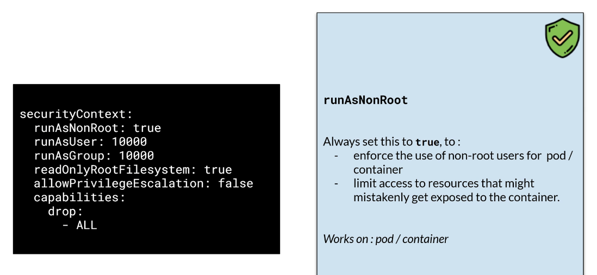
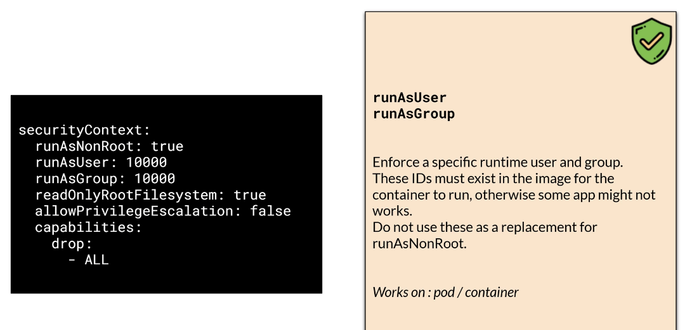
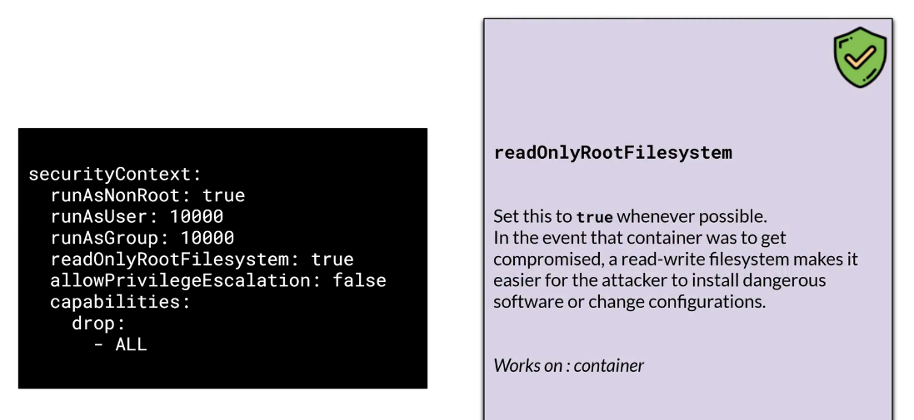
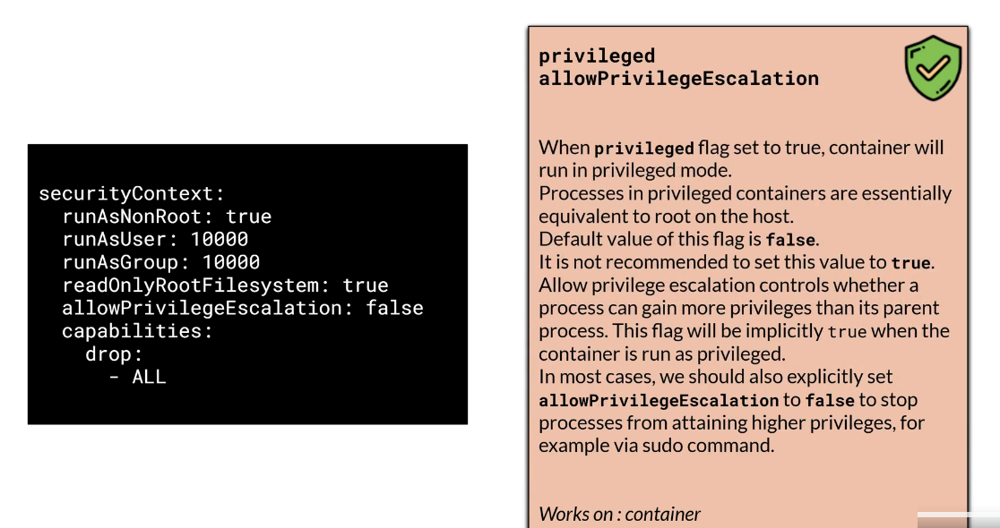
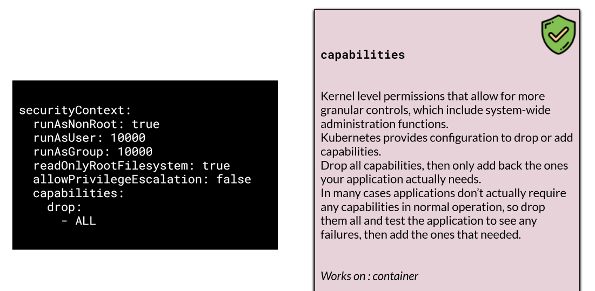
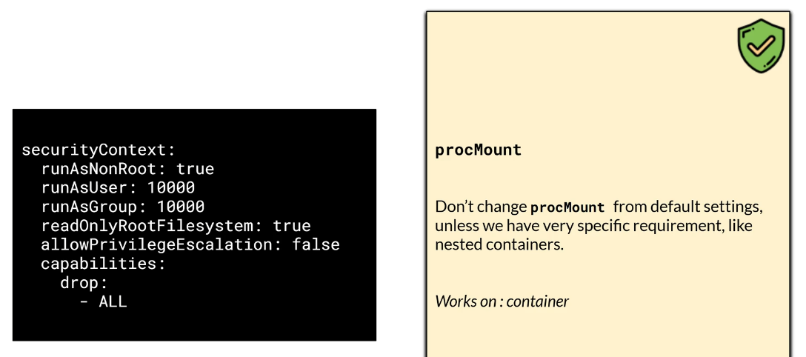
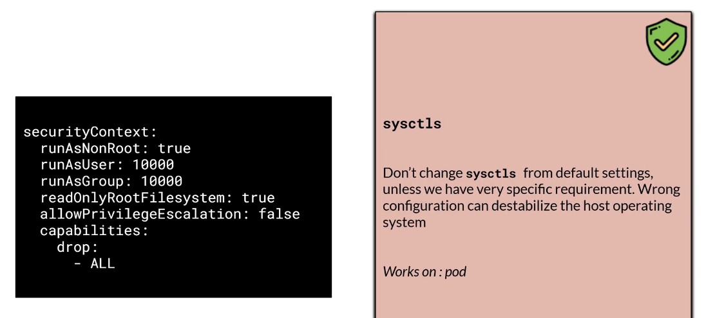
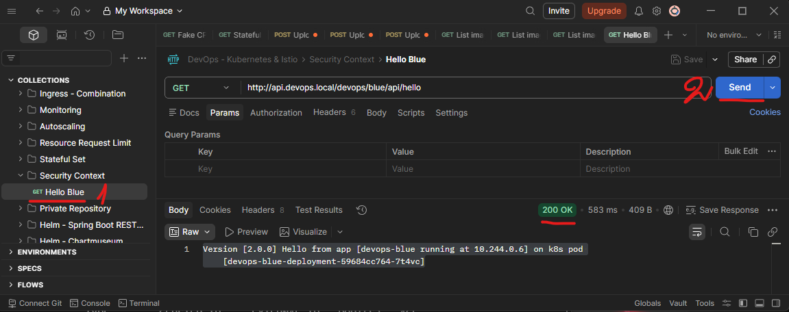

# Section 16 Secure Pod & Repository

## Content
- 55 [Security Context](#55-security-context)
- 56 [Private Image Repository](#56-private-image-repository)

Delete the previous minikube and start fresh Minikube cluster

    bash --> minikube delete
    bash --> minikube start --cpus 4 --memory 8192 --driver docker

List contexts

    bash --> kubectl config get-contexts

Set minikube contexts

    bash --> kubectl config use-context minikube

Start minikube tunnel and don't close the terminal

    bash --> minikube tunnel

Make sure that address are added to Windows host list
- Open PowerShell as Admin

        terminal --> notepad C:\Windows\System32\drivers\etc\hosts

- add 
```text
127.0.0.1 localhost                     
127.0.0.1 blue.devops.local             # required 
127.0.0.1 yellow.devops.local           # required 
127.0.0.1 api.devops.local              # required 
127.0.0.1 monitoring.devops.local
127.0.0.1 rabbitmq.devops.local
127.0.0.1 chartmuseum.devops.local
127.0.0.1 argocd.devops.local
```
- save the file and exit


## 55 Security Context

[⬆ Back to top](#top)

In general security, we have the term \"least privilege principle\". It states that users and applications should only have the necessary privileges to complete their tasks. For example, if an application should only read data, don't give it permission to write or delete. How can we ensure that each pod or container in Kubernetes has the permissions it requires while avoiding over-permissioning? The answer is security context. Kubernetes security context defines privileges, or permissions for individual pods or containers.

To use a security context in Kubernetes, we add a block of security context configuration within the deployment. We can add the block to the pod, container, or both. If we add the security context to both, then the one on the container will take priority. This behavior is useful if we have more than one container on a pod. We can define \"default\" security context on the pod level, But it can still override the security context per container. However, some settings work only in a container.

There aresome security contexts we can use. Here they are.Note that the order of setting does not matter. Always set runAsNonRoot to true to enforce the use of a non-root user for a pod or container. We limit access to any resources by using a non-root user. 


<br>
<br>
Use runAsUser or runAsGroup to enforce a specific runtime user and group. In some cases, we need to ensure the ID exists in the image container. Otherwise, some applications might not work properly. Don't use these settings as a replacement for runAsNonRoot. 


<br>
<br>
Set read-only root filesystem to true. When a container gets compromised, a read-write filesystem makes it easier for the attacker to install malicious software or change the configuration. Setting this to true will make the filesystem read-only, mitigating the attack. This flag works only on the container. 


<br>
<br>
When the privileged flag is set to true, the container will run in privileged mode. Processes in privileged containers are equivalent to root on the host. The default value of this flag is false. It is not recommended to set this value to true. Allow privilege escalation controls whether a process can gain additional privileges beyond those of its parent process. This flag is implicitly true when the container is run with privileged mode. In most cases, we should also explicitly set allowPrivilegeEscalation to false to prevent processes from gaining higher privileges, for example, via the sudo command. This behavior only works on a container. 


<br>
<br>
Capabilities are kernel-level permissions that provide more granular controls, including the ability to change file permissions, control the network subsystem, and perform system-wide administration functions. Kubernetes provides configuration to drop or add capabilities. The recommended practice is to drop all capabilities, then only add back the ones your application actually needs. In many cases, applications don't actually require any capabilities in normal operation, so drop them all, test for failures, then add the ones that are needed. 


<br>
<br>
Some settings should not be changed, unless you really know what you're doing. These are procMount, which works on a container. 


<br>
<br>
And sysctls, which work on the pod.


<br>
<br>
Although it can't be seen directly on the application, it is a good idea to set the security context. For example, this configuration file - devops-security-context.yml has a security context on the pod level. Notice that the run-as-user and run-as-group have IDs that do not exist in the Docker image. However, this will not cause any problems, since the image is a Java application that does not require access for a specific user. The Java application requires 1 writable folder: tmp, which is why we mount an empty directory for it. This empty dir will have read-write permission, and we need it since we set the read-only filesystem to true. This behavior is specific to a Java application. 

Specific to this blue application, it has 2 upload functionalities (image and document), so we mount 2 additional writable volumes to accommodate them.

devops-security-context.yml

```yaml
apiVersion: v1
kind: Namespace
metadata:
  name:  devops

---

apiVersion: apps/v1
kind: Deployment
metadata:
  namespace: devops
  name: devops-blue-deployment
  labels:
    app.kubernetes.io/name: devops-blue
spec:
  selector:
    matchLabels:
      app.kubernetes.io/name: devops-blue
  template:
    metadata:
      labels:
        app.kubernetes.io/name: devops-blue
        app.kubernetes.io/version: 2.0.0
    spec:
      containers:
      - name: devops-blue
        image: timpamungkas/devops-blue:2.0.0
        resources:
          requests:
            cpu : "0.15"
            memory: 200M
          limits:
            cpu : "0.3"
            memory: 200M
        ports:
        - name:  http
          containerPort: 8111
          protocol: TCP
        readinessProbe:
          httpGet:
            path: /devops/blue/actuator/health/readiness
            port: 8111
            scheme: HTTP
          initialDelaySeconds: 60
          periodSeconds: 30
          timeoutSeconds: 5
          failureThreshold: 4
        livenessProbe:
          httpGet:
            path: /devops/blue/actuator/health/liveness
            port: 8111
            scheme: HTTP
          initialDelaySeconds: 60
          periodSeconds: 30
          timeoutSeconds: 5
          failureThreshold: 4
        securityContext:
          runAsNonRoot: true
          # not exists, but does not matter since no process requires specific user id 
          runAsUser: 10000
          runAsGroup: 10000
          readOnlyRootFilesystem: true
          allowPrivilegeEscalation: false
          capabilities:
            drop:
              - ALL
        volumeMounts:
          # the container needs 3 read-write volumes
          # tmp for java temporary folder
          # 1 folder for upload image, and 1 more folder for upload doc 
          - name: tmp
            mountPath: /tmp/
          - name: upload-image-empty-dir
            mountPath: /upload/image
          - name: upload-doc-empty-dir
            mountPath: /upload/doc
      volumes:
        - name: tmp
          emptyDir: {}
        - name: upload-image-empty-dir
          emptyDir: {}
        - name: upload-doc-empty-dir
          emptyDir: {}
  replicas: 1

---

apiVersion: v1
kind: Service
metadata:
  namespace: devops
  name: devops-blue-clusterip
  labels:
    app.kubernetes.io/name: devops-blue
spec:
  selector:
    app.kubernetes.io/name: devops-blue
  ports:
  - port: 8111
    name: http

---

# Open this part if you use HAProxy ingress

# apiVersion: networking.k8s.io/v1
# kind: Ingress
# metadata:
#   namespace: devops
#   name: ingress-devops-blue
#   labels:
#     app.kubernetes.io/name: devops-blue
# spec:
#   ingressClassName: haproxy
#   rules:
#   - host: api.devops.local
#     http:
#       paths:
#       - path: /devops/blue
#         pathType: Prefix
#         backend:
#           service:
#             name: devops-blue-clusterip
#             port:
#               number: 8111

---

apiVersion: gateway.networking.k8s.io/v1
kind: Gateway
metadata:
  name: devops-gateway
  namespace: devops
spec:
  gatewayClassName: nginx
  listeners:
  - name: http
    protocol: HTTP
    port: 80
    hostname: api.devops.local
    allowedRoutes:
      namespaces:
        from: Same

---

apiVersion: gateway.networking.k8s.io/v1
kind: HTTPRoute
metadata:
  name: devops-api-httproute
  namespace: devops
spec:
  parentRefs:
  - name: devops-gateway
  hostnames:
  - api.devops.local
  rules:
  - matches:
    - path:
        type: PathPrefix
        value: /devops/blue
    backendRefs:
    - name: devops-blue-clusterip
      port: 8111
    timeouts:
      request: 8s
```

Ensure you install the gateway API. 

Install API Gateway CRD

    CMD --> kubectl kustomize https://github.com/nginx/nginx-gateway-fabric/config/crd/gateway-api/standard | kubectl apply -f -

    # result:
    customresourcedefinition.apiextensions.k8s.io/backendtlspolicies.gateway.networking.k8s.io created
    customresourcedefinition.apiextensions.k8s.io/gatewayclasses.gateway.networking.k8s.io created
    customresourcedefinition.apiextensions.k8s.io/gateways.gateway.networking.k8s.io created
    customresourcedefinition.apiextensions.k8s.io/grpcroutes.gateway.networking.k8s.io created
    customresourcedefinition.apiextensions.k8s.io/httproutes.gateway.networking.k8s.io created
    customresourcedefinition.apiextensions.k8s.io/listenersets.gateway.networking.k8s.io created
    customresourcedefinition.apiextensions.k8s.io/referencegrants.gateway.networking.k8s.io created
    customresourcedefinition.apiextensions.k8s.io/tlsroutes.gateway.networking.k8s.io created
    validatingadmissionpolicy.admissionregistration.k8s.io/safe-upgrades.gateway.networking.k8s.io created
    validatingadmissionpolicybinding.admissionregistration.k8s.io/safe-upgrades.gateway.networking.k8s.io created

Install the Fabric Gateway Api in nginx-gateway namespace

    CMD --> helm upgrade --install my-nginx-gateway-api oci://ghcr.io/nginx/charts/nginx-gateway-fabric --create-namespace -n nginx-gateway

    # result:
    Release "my-nginx-gateway-api" does not exist. Installing it now.
    Pulled: ghcr.io/nginx/charts/nginx-gateway-fabric:2.4.2
    Digest: sha256:dc86ff2fad1f5f000cab6bf0d953f7a3c1347550834c41249798c670414ecc1a
    NAME: my-nginx-gateway-api
    LAST DEPLOYED: Fri Mar 13 22:43:18 2026
    NAMESPACE: nginx-gateway
    STATUS: deployed
    REVISION: 1
    DESCRIPTION: Install complete
    TEST SUITE: None

Ensure that a service with type cluster IP is created in the nginx-gateway namespace.

    CMD --> kubectl get service -n nginx-gateway

    # result:
    NAME                                        TYPE        CLUSTER-IP       EXTERNAL-IP   PORT(S)   AGE
    my-nginx-gateway-api-nginx-gateway-fabric   ClusterIP   10.110.225.209   <none>        443/TCP   65s


Run it.

    CMD --> kubectl apply -f devops-security-context.yml

    # result:
    namespace/devops created
    deployment.apps/devops-blue-deployment created
    service/devops-blue-clusterip created
    gateway.gateway.networking.k8s.io/devops-gateway created
    httproute.gateway.networking.k8s.io/devops-api-httproute created

Start minikube tunnel

    CMD --> minikube tunnel

And it will work just fine.

Postman Collection / Security Context / GET Hello Blue      
    - address: http://api.devops.local/devops/blue/api/hello

    # result:
    Version [2.0.0] Hello from app [devops-blue running at 10.244.0.6] on k8s pod [devops-blue-deployment-59684cc764-7t4vc]


<br>
<br>
Delete the resources

    CMD --> kubectl delete -f devops-security-context.yml

    # result:
    namespace "devops" deleted
    deployment.apps "devops-blue-deployment" deleted from devops namespace
    service "devops-blue-clusterip" deleted from devops namespace
    gateway.gateway.networking.k8s.io "devops-gateway" deleted from devops namespace
    httproute.gateway.networking.k8s.io "devops-api-httproute" deleted from devops namespace

[⬆ Back to top](#top)


## 56 Private Image Repository

[⬆ Back to top](#top)

Delete minikube cluster and start one fresh

    CMD --> minikube delete
    CMD --> minikube start --cpus 4 --memory 8192 --driver docker

So far, we have used a public Docker image for the course. In reality, we might use a private repository accessible with specific credentials. In this lesson, we will learn how to use an image from a private Docker repository. I will use my private Docker repository, but I cannot share the password with you. If you need practice, you can create your own private Docker repository. I will deploy the devops-red Docker image from my private repository - timpamungkas/devops-red:2.0.0.

The first step is to create a secret for Docker credentials. Unlike regular secrets, Docker credential requires a specific type and data to be used. Create the devops namespace if it doesn't exist.

    CMD --> kubectl create namespace devops

    # result: namespace/devops created

Ensure you install the gateway API. 

Install API Gateway CRD

    CMD --> kubectl kustomize https://github.com/nginx/nginx-gateway-fabric/config/crd/gateway-api/standard | kubectl apply -f -

    # result:
    customresourcedefinition.apiextensions.k8s.io/backendtlspolicies.gateway.networking.k8s.io created
    customresourcedefinition.apiextensions.k8s.io/gatewayclasses.gateway.networking.k8s.io created
    customresourcedefinition.apiextensions.k8s.io/gateways.gateway.networking.k8s.io created
    customresourcedefinition.apiextensions.k8s.io/grpcroutes.gateway.networking.k8s.io created
    customresourcedefinition.apiextensions.k8s.io/httproutes.gateway.networking.k8s.io created
    customresourcedefinition.apiextensions.k8s.io/listenersets.gateway.networking.k8s.io created
    customresourcedefinition.apiextensions.k8s.io/referencegrants.gateway.networking.k8s.io created
    customresourcedefinition.apiextensions.k8s.io/tlsroutes.gateway.networking.k8s.io created
    validatingadmissionpolicy.admissionregistration.k8s.io/safe-upgrades.gateway.networking.k8s.io created
    validatingadmissionpolicybinding.admissionregistration.k8s.io/safe-upgrades.gateway.networking.k8s.io created

Install the Fabric Gateway Api in nginx-gateway namespace

    CMD --> helm upgrade --install my-nginx-gateway-api oci://ghcr.io/nginx/charts/nginx-gateway-fabric --create-namespace -n nginx-gateway

    # result:
    Release "my-nginx-gateway-api" does not exist. Installing it now.
    Pulled: ghcr.io/nginx/charts/nginx-gateway-fabric:2.4.2
    Digest: sha256:dc86ff2fad1f5f000cab6bf0d953f7a3c1347550834c41249798c670414ecc1a
    NAME: my-nginx-gateway-api
    LAST DEPLOYED: Fri Mar 13 22:43:18 2026
    NAMESPACE: nginx-gateway
    STATUS: deployed
    REVISION: 1
    DESCRIPTION: Install complete
    TEST SUITE: None

Ensure that a service with type cluster IP is created in the nginx-gateway namespace.

    CMD --> kubectl get service -n nginx-gateway

    # result:
    NAME                                        TYPE        CLUSTER-IP       EXTERNAL-IP   PORT(S)   AGE
    my-nginx-gateway-api-nginx-gateway-fabric   ClusterIP   10.110.225.209   <none>        443/TCP   65s

You can see the Kubernetes syntax to create such a secret. Adjust the credentialsto your own. 

    CMD --> kubectl create secret -n devops docker-registry dockerhub-secret --docker-server=https://index.docker.io/v1/ --docker-username=your-username --docker-password=your-password --docker-email=your-email@email.com

    # result: secret/dockerhub-secret created

We will get this kind of secret. 

    DMC --> kubectl get secret dockerhub-secret -n devops -o yaml

    # result:
    apiVersion: v1
    data:
    .dockerconfigjson: xxxx...xxxx
    kind: Secret
    metadata:
    creationTimestamp: "xxxx-xx-xxxxx:xx:xxx"
    name: dockerhub-secret
    namespace: devops
    resourceVersion: "2967"
    uid: xxxxxxxx-xxxx-xxxx-xxxx-xxxxxxxxxxxx
    type: kubernetes.io/dockerconfigjson

Note that the type is Docker config json, and it contains one data, which is actually credentials in a particular format.

Now that we have the secret, we can use it on the deployment file. We add configuration image pull secrets and use thesecret we have just created.

Apply the YAML file, and we will get the red container running.

    CMD --> kubectl apply -f devops-private-repository.yml

    # result:
    deployment.apps/devops-red-deployment created
    service/devops-red-clusterip created
    gateway.gateway.networking.k8s.io/devops-gateway created
    httproute.gateway.networking.k8s.io/devops-api-httproute created

Note that this video uses my private repository, which you do not have access to. To get hands-on, you need to use your own image and private repository.

[⬆ Back to top](#top)
