# Section 17 Creating and Using Helm Charts

## Content
- 57 [Creating Helm Chart](#57-creating-helm-chart)
- 58 [ChartMuseum](#58-chartmuseum)
- 59 [Harbor](#59-harbor)
- 60 [Multiple Configurations](#60-multiple-configurations)
- 61 [GitHub as Helm Repository](#61-github-as-helm-repository)
- 62 [Multiple Helm Charts](#62-multiple-helm-charts)

Delete the previous minikube and start fresh Minikube cluster

    bash --> minikube delete
    bash --> minikube start --cpus 4 --memory 8192 --driver docker

List contexts

    bash --> kubectl config get-contexts

Set minikube contexts

    bash --> kubectl config use-context minikube

Start minikube tunnel and don't close the terminal

    bash --> minikube tunnel

Make sure that address are added to Windows host list
- Open PowerShell as Admin

        terminal --> notepad C:\Windows\System32\drivers\etc\hosts

- add 
```text
127.0.0.1 localhost                     
127.0.0.1 blue.devops.local
127.0.0.1 yellow.devops.local           
127.0.0.1 api.devops.local
127.0.0.1 monitoring.devops.local
127.0.0.1 rabbitmq.devops.local
127.0.0.1 chartmuseum.local      # required 
127.0.0.1 harbor.local           # required 
127.0.0.1 argocd.devops.local
```
- save the file and exit

## 57 Creating Helm Chart

[⬆ Back to top](#top)

As we saw in the previous lesson, installing with Helm charts is easy and the preferred way to work with Kubernetes. In this lesson, we will learn how to create our own Helm chart. We will use a sample Java Spring Boot application. You don't need to know Java to work through this lesson. I will explain some parts of the Java code, but only enough for the DevOps role.

The Helm chart is about a generic template. Packaging an application as a Helm chart actually creates a template for the Kubernetes objects required, such as pods, services, and a pod autoscaler. But instead of a fixed parameter, as we learnt, we create a template for those resources and package them as a Helm chart. When creating a Helm release, we can either define parameter values or use the default values defined in the Helm chart. By packaging the Kubernetes resources, we then install the Helm chart using a single command. We can use versioning in the Helm chart, so updating it is as simple as creating a new version. 

In this lesson, I will not type line by line. A Helm chart is a template, but each application type will have its own template, tailored to its behavior. A Java application will have a different template from a Python application. A Java application written with framework X will have a different template than one written with framework Y. I provide a sample custom Helm chart for a Java application written with Spring Boot, since the devops blue, yellow, and red we saw is also written with Spring Boot. As usual, you can download the source from the last lesson of the course, on the lesson titled Resources & References. Navigate to the folder helm-charts, which contains the helm chart itself. And then apply the release, point the values file to the appropriate subfolder in the Kubernetes folder. 

We create a Helm chart using the Helm create command. Helm will create several required files and folders, as shown in this structure. In the templates folder, there are TPL files used internally. We will not touch them. There are also several YAML files we are already familiar with, such as those for creating deployments, ingress, etc. We can customize or add more YAML files. These are template files, and we can use variables in them. We can also create dynamic templates using logic and the Helm templating language. When we run a Helm install, Helm injects variables into the templates and creates the Kubernetes resources. The 'Chart dot yaml' file contains metadata for our Helm chart, such as the name, description, and version. This file contains basic information regarding the Helm chart. 'Values dot yaml' contains key-value pairs used as Helm release parameters. Even the generated one already contains many key-value pairs. These key-values will eventually be used in YAML files in the templates folder, and we can override them.

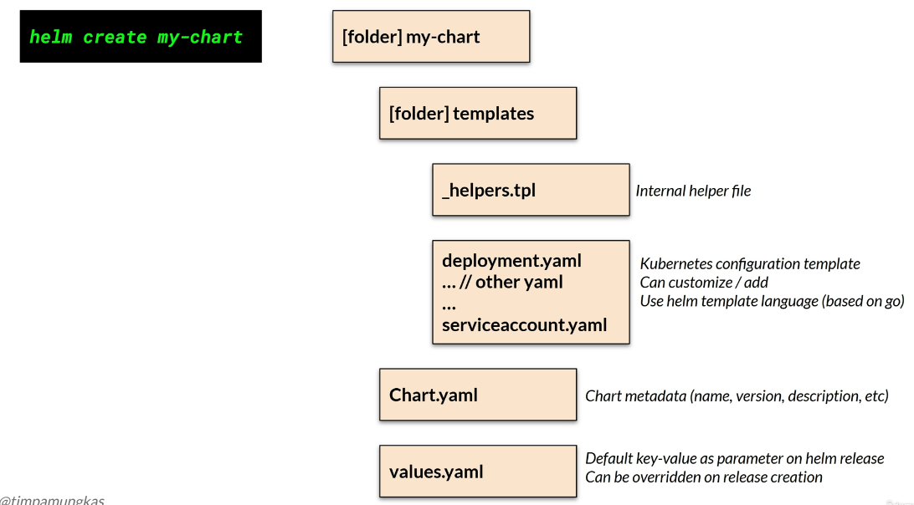
<br>
<br>

To create a Helm chart, go to any folder. Then use the command 'helm create chart name'. 

    CMD --> helm create spring-boot-rest-api

    # result: Creating spring-boot-rest-api

In this case, my chart name is spring-boot-rest-api in kebab-case. This command will create a folder and the files shown on the previous slide. 

Edit the metadata on Chart.yaml. We will update the description. And the version. The version is the semantic versioning for the Helm chart itself, and this time we will use version 0.1.0.

Chart.yaml

```yaml
apiVersion: v2
name: spring-boot-rest-api
description: Spring Boot REST API helm chart example

# A chart can be either an 'application' or a 'library' chart.
#
# Application charts are a collection of templates that can be packaged into versioned archives
# to be deployed.
#
# Library charts provide useful utilities or functions for the chart developer. They're included as
# a dependency of application charts to inject those utilities and functions into the rendering
# pipeline. Library charts do not define any templates and therefore cannot be deployed.
type: application

# This is the chart version. This version number should be incremented each time you make changes
# to the chart and its templates, including the app version.
# Versions are expected to follow Semantic Versioning (https://semver.org/)
version: 0.1.0

# This is the version number of the application being deployed. This version number should be
# incremented each time you make changes to the application. Versions are not expected to
# follow Semantic Versioning. They should reflect the version the application is using.
# It is recommended to use it with quotes.
appVersion: "1.16.0"
```

Since Helmpackages files into a chart, we can also set file patterns to be ignored during packaging. Such filepatterns were defined in the .helmignore file. 

.helmignore

```yaml
# Patterns to ignore when building packages.
# This supports shell glob matching, relative path matching, and
# negation (prefixed with !). Only one pattern per line.
.DS_Store
# Common VCS dirs
.git/
.gitignore
.bzr/
.bzrignore
.hg/
.hgignore
.svn/
# Common backup files
*.swp
*.bak
*.tmp
*.orig
*~
# Various IDEs
.project
.idea/
*.tmproj
.vscode/
```

The values.yaml file already contains default values to be used during release, and we can customize, update, or add to them. 

Under folder templates, several Kubernetes configuration files already exist. See the deployment.yaml. This file is the Kubernetes deployment template. So this syntax with double curly braces is the Helm templating language, which allows this Helm chart to accept dynamic variables. This case shows how the _helpers.tpl file works. For example, this fullname field is derived from somewhere with the help of _helpers.tpl. 

deployment.yaml

```yaml
apiVersion: apps/v1
kind: Deployment
metadata:
  name: {{ include "spring-boot-rest-api.fullname" . }}
  labels:
    {{- include "spring-boot-rest-api.labels" . | nindent 4 }}
spec:
  {{- if not .Values.autoscaling.enabled }}
  replicas: {{ .Values.replicaCount }}
  {{- end }}
  selector:
    matchLabels:
      {{- include "spring-boot-rest-api.selectorLabels" . | nindent 6 }}
  template:
    metadata:
      {{- with .Values.podAnnotations }}
      annotations:
        {{- toYaml . | nindent 8 }}
      {{- end }}
      labels:
        {{- include "spring-boot-rest-api.labels" . | nindent 8 }}
        {{- with .Values.podLabels }}
        {{- toYaml . | nindent 8 }}
        {{- end }}
    spec:
      {{- with .Values.imagePullSecrets }}
      imagePullSecrets:
        {{- toYaml . | nindent 8 }}
      {{- end }}
      serviceAccountName: {{ include "spring-boot-rest-api.serviceAccountName" . }}
      {{- with .Values.podSecurityContext }}
      securityContext:
        {{- toYaml . | nindent 8 }}
      {{- end }}
      containers:
        - name: {{ .Chart.Name }}
          {{- with .Values.securityContext }}
          securityContext:
            {{- toYaml . | nindent 12 }}
          {{- end }}
          image: "{{ .Values.image.repository }}:{{ .Values.image.tag | default .Chart.AppVersion }}"
          imagePullPolicy: {{ .Values.image.pullPolicy }}
          ports:
            - name: http
              containerPort: {{ .Values.service.port }}
              protocol: TCP
          {{- with .Values.livenessProbe }}
          livenessProbe:
            {{- toYaml . | nindent 12 }}
          {{- end }}
          {{- with .Values.readinessProbe }}
          readinessProbe:
            {{- toYaml . | nindent 12 }}
          {{- end }}
          {{- with .Values.resources }}
          resources:
            {{- toYaml . | nindent 12 }}
          {{- end }}
          {{- with .Values.volumeMounts }}
          volumeMounts:
            {{- toYaml . | nindent 12 }}
          {{- end }}
      {{- with .Values.volumes }}
      volumes:
        {{- toYaml . | nindent 8 }}
      {{- end }}
      {{- with .Values.nodeSelector }}
      nodeSelector:
        {{- toYaml . | nindent 8 }}
      {{- end }}
      {{- with .Values.affinity }}
      affinity:
        {{- toYaml . | nindent 8 }}
      {{- end }}
      {{- with .Values.tolerations }}
      tolerations:
        {{- toYaml . | nindent 8 }}
      {{- end }}
```

In here, it defines the fullname field, which is actually determined by certain if-else logic and then truncated to 63 characters. We can refer to the values.yaml file by using the '.values' variable. 

```yaml
{{/*
Expand the name of the chart.
*/}}
{{- define "spring-boot-rest-api.name" -}}
{{- default .Chart.Name .Values.nameOverride | trunc 63 | trimSuffix "-" }}
{{- end }}

{{/*
Create a default fully qualified app name.
We truncate at 63 chars because some Kubernetes name fields are limited to this (by the DNS naming spec).
If release name contains chart name it will be used as a full name.
*/}}
{{- define "spring-boot-rest-api.fullname" -}}
{{- if .Values.fullnameOverride }}
{{- .Values.fullnameOverride | trunc 63 | trimSuffix "-" }}
{{- else }}
{{- $name := default .Chart.Name .Values.nameOverride }}
{{- if contains $name .Release.Name }}
{{- .Release.Name | trunc 63 | trimSuffix "-" }}
{{- else }}
{{- printf "%s-%s" .Release.Name $name | trunc 63 | trimSuffix "-" }}
{{- end }}
{{- end }}
{{- end }}

{{/*
Create chart name and version as used by the chart label.
*/}}
{{- define "spring-boot-rest-api.chart" -}}
{{- printf "%s-%s" .Chart.Name .Chart.Version | replace "+" "_" | trunc 63 | trimSuffix "-" }}
{{- end }}

{{/*
Common labels
*/}}
{{- define "spring-boot-rest-api.labels" -}}
helm.sh/chart: {{ include "spring-boot-rest-api.chart" . }}
{{ include "spring-boot-rest-api.selectorLabels" . }}
{{- if .Chart.AppVersion }}
app.kubernetes.io/version: {{ .Chart.AppVersion | quote }}
{{- end }}
app.kubernetes.io/managed-by: {{ .Release.Service }}
{{- end }}

{{/*
Selector labels
*/}}
{{- define "spring-boot-rest-api.selectorLabels" -}}
app.kubernetes.io/name: {{ include "spring-boot-rest-api.name" . }}
app.kubernetes.io/instance: {{ .Release.Name }}
{{- end }}

{{/*
Create the name of the service account to use
*/}}
{{- define "spring-boot-rest-api.serviceAccountName" -}}
{{- if .Values.serviceAccount.create }}
{{- default (include "spring-boot-rest-api.fullname" .) .Values.serviceAccount.name }}
{{- else }}
{{- default "default" .Values.serviceAccount.name }}
{{- end }}
{{- end }}

```

For example, in deployment.yaml, we check whether values.yaml contains the key autoscaling, sub-key enabled, with a value of true; if so, we set the replica value using the values.yaml key replica count. The syntax is similar to that of other files.

We can use the generated template, customize it, or even delete it. For example, suppose the API version is deprecated. We can change this to a newer version. 

hpa.yaml

```yaml
{{- if .Values.autoscaling.enabled }}
apiVersion: autoscaling/v5              # change from v2 to newer version v5
kind: HorizontalPodAutoscaler
metadata:
  name: {{ include "spring-boot-rest-api.fullname" . }}
  labels:
    {{- include "spring-boot-rest-api.labels" . | nindent 4 }}
spec:
  scaleTargetRef:
    apiVersion: apps/v1
    kind: Deployment
    name: {{ include "spring-boot-rest-api.fullname" . }}
  minReplicas: {{ .Values.autoscaling.minReplicas }}
  maxReplicas: {{ .Values.autoscaling.maxReplicas }}
  metrics:
    {{- if .Values.autoscaling.targetCPUUtilizationPercentage }}
    - type: Resource
      resource:
        name: cpu
        target:
          type: Utilization
          averageUtilization: {{ .Values.autoscaling.targetCPUUtilizationPercentage }}
    {{- end }}
    {{- if .Values.autoscaling.targetMemoryUtilizationPercentage }}
    - type: Resource
      resource:
        name: memory
        target:
          type: Utilization
          averageUtilization: {{ .Values.autoscaling.targetMemoryUtilizationPercentage }}
    {{- end }}
{{- end }}
```

The 'Helm create' command also generates YAML files for services, ingress, gateway API HTTP routes, etc.

Remember, the template language is essentially Go template syntax, indicated by double curly braces. To learn more about the Go template language, see the link in the course resources. However, when creating this Helm template, we mostly use simple templating, so we don't need to be Go template experts. The helm template language itself is quite complex and takes some time to master. Luckily, the documentation is quite complete - https://helm.sh/docs/chart_template_guide/values_files. 

Here is the syntax we can use in our custom Helm charts. Watch the red text and read the description. 

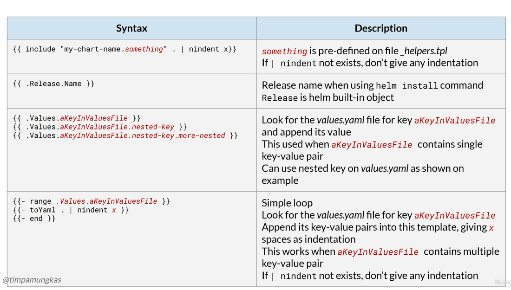
<br>
<br>

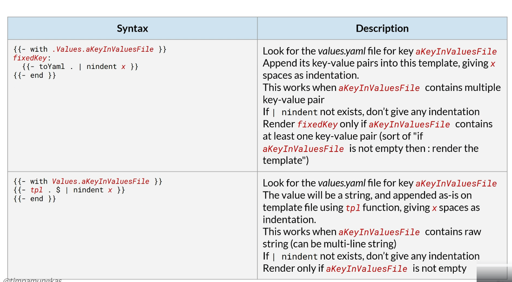
<br>
<br>

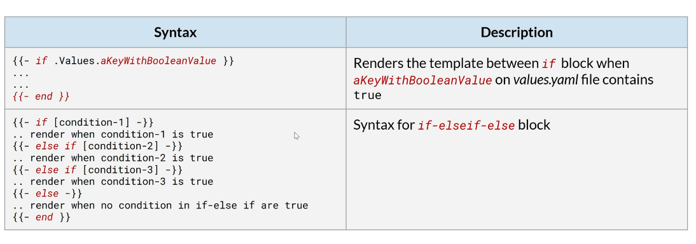
<br>
<br>

Let's copy and paste the YAML files from the course resources and references, and we will discuss them. 

OK, now we have the modified YAML files for the Spring Boot application. Let's discuss the deployment.yaml. We have two predefined labels here, and we can add more labels by defining them in 'values dot yaml' under the key deployment labels. Don't forget to add the correct indentation: 4 spaces. We can add annotations based on 'values dot yaml', key deploymentAnnotations. For the selector, we need to create a matching entry. Luckily, the helpers file already has predefined entries for selector labels, so we use them here for consistency. Suppose we see the definition of selector labels on helpers.tpl, we will see these entries. If we want, we can also customize the helpers.tpl file.

helm-charts\spring-boot-rest-api\templates\deployment.yaml

```yaml
apiVersion: apps/v1
kind: Deployment
metadata:
  name: {{ include "spring-boot-rest-api.fullname" . }}
  labels:
    app.kubernetes.io/name: {{ include "spring-boot-rest-api.name" . }}     # label 1
    app.kubernetes.io/instance: {{ .Release.Name }}                         # label 2
    {{- with .Values.deploymentLabels }}                                    # additional labels
    {{- toYaml . | nindent 4 }}
    {{- end }}
  {{- with .Values.deploymentAnnotations }}       # added annotations with values.yaml file
  annotations:
    {{- toYaml . | nindent 4 }}
  {{- end }}
spec:
  replicas: {{ .Values.replicaCount }}
  selector:
    matchLabels:
      {{- include "spring-boot-rest-api.selectorLabels" . | nindent 6 }}    # matching entry selector
  template:
    metadata:
      labels:
        {{- include "spring-boot-rest-api.selectorLabels" . | nindent 8 }}
      annotations:
        prometheus.io/scrape: "true"
        prometheus.io/port: "{{ .Values.actuatorPort }}"
        prometheus.io/path: {{ .Values.prometheusPath }}
        {{- range .Values.podAnnotations }}                     # pod annotations
        {{- toYaml . | nindent 8 }}
        {{- end }}
    spec:
      {{- with .Values.imagePullSecrets }}                      # pull image secrets if exists
      imagePullSecrets:
        {{- toYaml . | nindent 8 }}
      {{- end }}
      serviceAccountName: {{ include "spring-boot-rest-api.serviceAccountName" . }}
      containers:
        - name: {{ include "spring-boot-rest-api.name" . }}
          # image pull string information
          image: "{{ .Values.image.repository }}:{{ .Values.image.tag | default .Chart.AppVersion }}"
          # use chart app version if image tag do not exist
          imagePullPolicy: {{ .Values.image.pullPolicy }}
          ports:
            - name: http
              containerPort: {{ .Values.applicationPort }}
              protocol: TCP
          livenessProbe:
            httpGet:
              path: {{ .Values.health.liveness.path }}
              port: {{ .Values.actuatorPort }}
            initialDelaySeconds: {{ .Values.health.liveness.initialDelaySeconds }}
            periodSeconds: {{ .Values.health.liveness.periodSeconds }}
            timeoutSeconds: {{ .Values.health.liveness.timeoutSeconds }}
            failureThreshold: {{ .Values.health.liveness.failureThreshold }}
          readinessProbe:
            httpGet:
              path: {{ .Values.health.readiness.path }}
              port: {{ .Values.actuatorPort }}
            initialDelaySeconds: {{ .Values.health.readiness.initialDelaySeconds }}
            periodSeconds: {{ .Values.health.readiness.periodSeconds }}
            timeoutSeconds: {{ .Values.health.readiness.timeoutSeconds }}
            failureThreshold: {{ .Values.health.readiness.failureThreshold }}
          resources:
            {{- get .Values.sizemap .Values.size | pluck "resources" | first | toYaml | nindent 12 }}
          volumeMounts:
            - name: tmp
              mountPath: /tmp/
            {{- with .Values.extraVolumeMounts }}
            {{- tpl . $ | nindent 12 }}
            {{- end }}
          env:
            - name: JAVA_OPTS
              value: {{ get .Values.sizemap .Values.size | pluck "java-options" | first | quote }}
            {{- with .Values.extraEnv }}
            {{- tpl . $ | nindent 12 }}
            {{- end }}
          {{- with .Values.containerSecurityContext }}
          securityContext:
            {{- toYaml . | nindent 12 }}
          {{- end }}
      volumes:
        - name: tmp
          emptyDir: {}
        {{- with .Values.extraVolumes }}
        {{- tpl . $ | nindent 8 }}
        {{- end }}
      {{- with .Values.nodeSelector }}
      nodeSelector:
        {{- toYaml . | nindent 8 }}
      {{- end }}
      {{- with .Values.affinity }}
      affinity:
        {{- toYaml . | nindent 8 }}
      {{- end }}
      {{- with .Values.tolerations }}
      tolerations:
        {{- toYaml . | nindent 8 }}
      {{- end }}
```

In the annotations template, we have several fixed entries for Prometheus, and we can also add custom entries by looping over values from a file using the key 'podAnnotations'. If the pod annotations contain an entry, it will be appended to the rendered template. In this line, we render image pull secrets if they exist. The container image will join two strings from the values file, from the keys 'image repository' and 'image tag'. If the image tag does not exist, then it will use the chart app version. These lines (41 - 60 from deployment.yaml) will render the port definition and health check based on the content in values.yml. The resource is rather unique. 

See the values in the YAML file. 

value.yaml

```yaml
replicaCount: 1
image:
  pullPolicy: IfNotPresent
  repository: ""
  tag: ""

imagePullSecrets: []
nameOverride: ""
fullnameOverride: ""

applicationPort: 8080
actuatorPort: 8080
prometheusPath: /actuator/prometheus

deploymentLabels: {}

deploymentAnnotations: {}

podAnnotations: {}

selectorLabels: {}

health:
  liveness:
    port: 8080
    path: /actuator/health/liveness
    initialDelaySeconds: 60
    periodSeconds: 30
    timeoutSeconds: 5
    failureThreshold: 4
  readiness:
    port: 8080
    path: /actuator/health/readiness
    initialDelaySeconds: 60
    periodSeconds: 30
    timeoutSeconds: 5
    failureThreshold: 4

serviceAccount:
  # Specifies whether a service account should be created
  create: false
  # Annotations to add to the service account
  annotations: {}
  # The name of the service account to use.
  # If not set and create is true, a name is generated using the fullname template
  name: ""

autoscaling:
  enabled: false
  minReplicas: 1
  maxReplicas: 5
  targetCPUUtilizationPercentage: 75
  targetMemoryUtilizationPercentage: 75

service:
  type: ClusterIP
  port: 80
  annotations: {}

ingress:
  enabled: false
  annotations: {}
  tls: []
       
nodeSelector: {}

tolerations: []

affinity: {}

# environment variable
extraEnv: {}

containerSecurityContext:
  runAsNonRoot: true
  runAsUser: 100000
  runAsGroup: 100000
  readOnlyRootFilesystem: true
  allowPrivilegeEscalation: false
  capabilities:
    drop:
      - ALL

extraVolumes: {}

size: "small"

sizemap:
  small:
    resources:
      requests:
        cpu: 200m
        memory: 384Mi
      limits:
        cpu: 500m
        memory: 512Mi
    java-options: >-
      -XX:+UseContainerSupport
      -XX:MaxRAMPercentage=75.0
      -Djava.net.preferIPv4Stack=true
      -Djava.awt.headless=true
  medium:
    resources:
      requests:
        cpu: 500m
        memory: 512Mi
      limits:
        cpu: 750m
        memory: 768Mi
    java-options: >-
      -XX:+UseContainerSupport
      -XX:MaxRAMPercentage=80.0
      -Djava.net.preferIPv4Stack=true
      -Djava.awt.headless=true
  large:
    resources:
      requests:
        cpu: 750m
        memory: 768Mi
      limits:
        cpu: 1000m
        memory: 1Gi
    java-options: >-
      -XX:+UseContainerSupport
      -XX:MaxRAMPercentage=85.0
      -Djava.net.preferIPv4Stack=true
      -Djava.awt.headless=true
  xlarge:
    resources:
      requests:
        cpu: 1000m
        memory: 1Gi
      limits:
        cpu: 2000m
        memory: 2Gi
    java-options: >-
      -XX:+UseContainerSupport
      -XX:MaxRAMPercentage=90.0
      -Djava.net.preferIPv4Stack=true
      -Djava.awt.headless=true
```

In here, we have a sizemap entry (line 88 - 127 in the values.yaml). This entry is actually a list with several keys: small, medium, large, and extra large. Each entry will have resources and a Java-options sub-entry.

```yaml
sizemap:
  small:
    resources:
      requests:
        cpu: 200m
        memory: 384Mi
      limits:
        cpu: 500m
        memory: 512Mi
    java-options: >-
      -XX:+UseContainerSupport
      -XX:MaxRAMPercentage=75.0
      -Djava.net.preferIPv4Stack=true
      -Djava.awt.headless=true
  medium:
    resources:
      requests:
        cpu: 500m
        memory: 512Mi
      limits:
        cpu: 750m
        memory: 768Mi
    java-options: >-
      -XX:+UseContainerSupport
      -XX:MaxRAMPercentage=80.0
      -Djava.net.preferIPv4Stack=true
      -Djava.awt.headless=true
  large:
    resources:
      requests:
        cpu: 750m
        memory: 768Mi
      limits:
        cpu: 1000m
        memory: 1Gi
    java-options: >-
      -XX:+UseContainerSupport
      -XX:MaxRAMPercentage=85.0
      -Djava.net.preferIPv4Stack=true
      -Djava.awt.headless=true
```

The resources include requests and limits, which we will use in the deployment.yaml template. So this line will get sizemap entry, as defined in the values file, with key 'size' (line 62 in deployment.yaml). 

```yaml
{{- get .Values.sizemap .Values.size | pluck "resources" | first | toYaml | nindent 12 }}
```

We define the default value as 'small' (line 86) in value.yaml. 

```yaml
size: "small"
```

So by default, this line will take sizemap, where the entry is 'small' (line 89 - 101 in values.yaml). 

```yaml
small:
    resources:
      requests:
        cpu: 200m
        memory: 384Mi
      limits:
        cpu: 500m
        memory: 512Mi
    java-options: >-
      -XX:+UseContainerSupport
      -XX:MaxRAMPercentage=75.0
      -Djava.net.preferIPv4Stack=true
      -Djava.awt.headless=true
```

But it contains two sub-entries: resources and java-options. We only need resources in this part, so we take the 'resources' sub-entry and convert it to YAML with 12-space indentation (line 62 in deployment.yaml). 

```yaml
{{- get .Values.sizemap .Values.size | pluck "resources" | first | toYaml | nindent 12 }}
```

In the volume mount section (line 63 - 68 in deployment.yaml), we have a mount volume named 'tmp' for the temporary folder, which is required by the Spring Boot application. 

```yaml
volumeMounts:
  - name: tmp
    mountPath: /tmp/
  {{- with .Values.extraVolumeMounts }}
  {{- tpl . $ | nindent 12 }}
  {{- end }}
```

But we can also have extra volume mounts. In here, we use the TPL function to render a string from the values file for the key' extra volume mounts', with 12-space indentation (line 62 in deployment.yaml). 

```yaml
{{- get .Values.sizemap .Values.size | pluck "resources" | first | toYaml | nindent 12 }}
```

In the Java options, we use the same logic as in the resource section, taking the value from the predefined 'sizemap' (line 769 - 74 in deployment.yaml). But this time, we take the sub-entry 'java-options' and, instead of converting it to YAML, we quote the value. 

```yaml
env:
  - name: JAVA_OPTS
    value: {{ get .Values.sizemap .Values.size | pluck "java-options" | first | quote }}
  {{- with .Values.extraEnv }}
  {{- tpl . $ | nindent 12 }}
  {{- end }}
{{- with .Values.containerSecurityContext }}
```

For example, this value is actually a string, written as multi-line (line 97 - 101) in the values.yaml file, indicated by a greater-than sign and a dash. These 4 lines will be taken, concatenated into a single line string, and quoted. 

```yaml
java-options: >-
  -XX:+UseContainerSupport
  -XX:MaxRAMPercentage=75.0
  -Djava.net.preferIPv4Stack=true
  -Djava.awt.headless=true
```

In line 75 from deployment.yaml, we add a security context based on values.yaml key containerSecurityContext, if such a key exists. 

```yaml
{{- with .Values.containerSecurityContext }}
```

Don't forget to use correct indentation: 12 spaces (line 77 in deployment.yaml). 

```yaml
{{- toYaml . | nindent 12 }}
```

In the volume section (line 79 - 96 in deployment.yaml), we have one default volume for the tmp folder, which is an empty directory. This part is required, since we have one default volume mount predefined above. But since we can have an extra volume mount, we must also accommodate for extra volume. These lines will append node selector, affinity, and tolerations if such entries exist in the values.yaml file. 

```yaml
volumes:
  - name: tmp
    emptyDir: {}
  {{- with .Values.extraVolumes }}
  {{- tpl . $ | nindent 8 }}
  {{- end }}
{{- with .Values.nodeSelector }}
nodeSelector:
  {{- toYaml . | nindent 8 }}
{{- end }}
{{- with .Values.affinity }}
affinity:
  {{- toYaml . | nindent 8 }}
{{- end }}
{{- with .Values.tolerations }}
tolerations:
  {{- toYaml . | nindent 8 }}
{{- end }}
```

Now see the generated hpa.yaml file.

hpa.yaml

```yaml
{{- if .Values.autoscaling.enabled }}
apiVersion: autoscaling/v2
kind: HorizontalPodAutoscaler
metadata:
  name: {{ include "spring-boot-rest-api.fullname" . }}
  labels:
    {{- include "spring-boot-rest-api.labels" . | nindent 4 }}
spec:
  scaleTargetRef:
    apiVersion: apps/v1
    kind: Deployment
    name: {{ include "spring-boot-rest-api.fullname" . }}
  minReplicas: {{ .Values.autoscaling.minReplicas }}
  maxReplicas: {{ .Values.autoscaling.maxReplicas }}
  metrics:
    {{- if .Values.autoscaling.targetCPUUtilizationPercentage }}
    - type: Resource
      resource:
        name: cpu
        target:
          type: Utilization
          averageUtilization: {{ .Values.autoscaling.targetCPUUtilizationPercentage }}
    {{- end }}
    {{- if .Values.autoscaling.targetMemoryUtilizationPercentage }}
    - type: Resource
      resource:
        name: memory
        target:
          type: Utilization
          averageUtilization: {{ .Values.autoscaling.targetMemoryUtilizationPercentage }}
    {{- end }}
{{- end }}
```

This file content will only be rendered if the values file, key autoscaling, and subkey enabled are set to true. So by default hpa.yaml will not exist unless we enable it. The same concept applies for other resources such as httproute.yaml or ingress.yaml. 

httproute.yaml

```yaml
{{- if .Values.httpRoute.enabled -}}
{{- $fullName := include "spring-boot-rest-api.fullname" . -}}
{{- $svcPort := .Values.service.port -}}
apiVersion: gateway.networking.k8s.io/v1
kind: HTTPRoute
metadata:
  name: {{ $fullName }}
  labels:
    {{- include "spring-boot-rest-api.labels" . | nindent 4 }}
  {{- with .Values.httpRoute.annotations }}
  annotations:
    {{- toYaml . | nindent 4 }}
  {{- end }}
spec:
  parentRefs:
    {{- with .Values.httpRoute.parentRefs }}
      {{- toYaml . | nindent 4 }}
    {{- end }}
  {{- with .Values.httpRoute.hostnames }}
  hostnames:
    {{- toYaml . | nindent 4 }}
  {{- end }}
  rules:
    {{- range .Values.httpRoute.rules }}
    {{- with .matches }}
    - matches:
      {{- toYaml . | nindent 8 }}
    {{- end }}
    {{- with .filters }}
      filters:
      {{- toYaml . | nindent 8 }}
    {{- end }}
      backendRefs:
        - name: {{ $fullName }}
          port: {{ $svcPort }}
          weight: 1
    {{- end }}
{{- end }}

```

ingress.yaml

```yaml
{{- if .Values.ingress.enabled -}}
apiVersion: networking.k8s.io/v1
kind: Ingress
metadata:
  name: {{ include "spring-boot-rest-api.fullname" . }}
  labels:
    {{- include "spring-boot-rest-api.labels" . | nindent 4 }}
  {{- with .Values.ingress.annotations }}
  annotations:
    {{- toYaml . | nindent 4 }}
  {{- end }}
spec:
  {{- with .Values.ingress.className }}
  ingressClassName: {{ . }}
  {{- end }}
  {{- if .Values.ingress.tls }}
  tls:
    {{- range .Values.ingress.tls }}
    - hosts:
        {{- range .hosts }}
        - {{ . | quote }}
        {{- end }}
      secretName: {{ .secretName }}
    {{- end }}
  {{- end }}
  rules:
    {{- range .Values.ingress.hosts }}
    - host: {{ .host | quote }}
      http:
        paths:
          {{- range .paths }}
          - path: {{ .path }}
            {{- with .pathType }}
            pathType: {{ . }}
            {{- end }}
            backend:
              service:
                name: {{ include "spring-boot-rest-api.fullname" $ }}
                port:
                  number: {{ $.Values.service.port }}
          {{- end }}
    {{- end }}
{{- end }}
```

For the other YAML files, we do not need to make any changes. The generated file is sufficient.

Right now, we have the helm charts and values.yaml file. This values.yaml file is just a default one. We can create our own, as we did when we installed the Helm chart in previous chapters. Our own values file is required, for example, to define which Spring Boot Docker image we will use. 

So we have this "values-spring-boot dot yaml" file in the folder helm-spring-boot-rest-api-01. We will use it to create the Helm release and expose the service via the gateway API. In the file, we define several items.

values-spring-boot.yml

```yaml
# -------------------------------------------------------
# For deployment
image:
  repository: timpamungkas/devops-yellow
  tag: 2.0.0

applicationPort: 8112

actuatorPort: 8112

prometheusPath: /devops/yellow/actuator/prometheus

health:
  liveness:
    path: /devops/yellow/actuator/health/liveness
  readiness:
    path: /devops/yellow/actuator/health/readiness

# Mind the | which indicates this is raw string
extraVolumeMounts: |
  - name: upload-image-empty-dir
    mountPath: /upload/image
  - name: upload-doc-empty-dir
    mountPath: /upload/doc

# Mind the | which indicates this is raw string
extraVolumes: |
  - name: upload-image-empty-dir
    emptyDir: {}
  - name: upload-doc-empty-dir
    emptyDir: {}

# -------------------------------------------------------
# For service
service:
  type: ClusterIP
  port: 8112

# -------------------------------------------------------
# For autoscaling
autoscaling:
  enabled: true
  minReplicas: 1
  maxReplicas: 3

# -------------------------------------------------------
# For gateway API
# The gateway `devops-gateway` must already exists

httpRoute:
  enabled: true
  annotations: {}
  parentRefs:
    - name: devops-gateway
  hostnames:
    - api.devops.local
  rules:
    - matches:
        - path:
            type: PathPrefix
            value: /devops/yellow
      filters: []

# -------------------------------------------------------
# For ingress
ingress:
  enabled: false
  className: haproxy
  annotations: 
    haproxy.org/rate-limit-period: 1m
    haproxy.org/rate-limit-requests: "30"
    haproxy.org/rate-limit-status-code: "429"
  hosts:
  - host: api.devops.local
    paths:
    - path: /devops/yellow
      pathType: Prefix      
```

The image repository, tag, ports, and path for the Prometheus data collector and health check (line 3 - 17). 

We also need two additional volume mounts for uploading images and documents. Since we use the TPL function in the deployment template file, we use the pipe character to define a raw string to embed in the deployment YAML file. So these lines will be appended as extra volume mounts on deployment. And so do these lines, which will be appended as an extra volume on deployment (line 21 - 31). These lines are for service (line 35 - 37). These are for autoscaling(line 41 - 44). We enable it with a replica count of 1-3. 

In this example, we will expose the service using the gateway API (line 54). The gateway resource named 'devops-gateway' must already exist. A gateway is usually created once by the Kubernetes Admin, and then reused. Thus, in this example, gateway creation is not included in the Helm chart. 

These are sample ingress configurations for using HAPRoxy (line 66 - 77). However, since we are going to expose the service using the Gateway API, this setting is disabled. Alternatively, this section can be omitted entirely. We add a custom annotation for rate limiting. We then define the ingress rules using these configurations. 

How do we create a release for our Spring Boot Helm chart, using the values-spring-boot YAML file? In the previous lesson, we accessed the repository via the internet to obtain a Helm chart, but in this simple lesson, we don't. We don't have a Helm repository. We have a local folder. So that's what we will use for this case. We need to be in a folder where Helm charts are available. That means, in this folder - helm-charts.

Then we define the place where the values file will be used. In this case, it is in a different folder, so we need to define the exact path to the values-spring-boot.yaml file. 

You can copy and paste the command to execute Helm for Spring Boot REST API from the lecture resource in the last section of the course.

But wait, how can we be so sure that everything will go well? What if we define the template wrong, or the custom values wrong? Helm provides a template command that renders the template using the values file, but does not execute it. This step is optional, but this feature helps us check whether our template will work as expected. The command is using helm template. You can copy and paste the command to execute helm template from the lecture resource in the last section of the course. 

Let's start with the Helm template. Remember, this step is optional, but useful for debugging. When I execute this.

    helm-charts CMD --> helm template helm-yellow-01 spring-boot-rest-api --namespace devops --create-namespace --values ..\helm-spring-boot-rest-api-01\values-spring-boot.yml

Result:

```yaml
---
# Source: spring-boot-rest-api/templates/service.yaml
apiVersion: v1
kind: Service
metadata:
  name: helm-yellow-01-spring-boot-rest-api
  labels:
    helm.sh/chart: spring-boot-rest-api-0.1.0
    app.kubernetes.io/name: spring-boot-rest-api
    app.kubernetes.io/instance: helm-yellow-01
    app.kubernetes.io/version: "1.16.0"
    app.kubernetes.io/managed-by: Helm
spec:
  type: ClusterIP
  ports:
    - port: 8112
      targetPort: http
      protocol: TCP
      name: http
  selector:
    app.kubernetes.io/name: spring-boot-rest-api
    app.kubernetes.io/instance: helm-yellow-01
---
# Source: spring-boot-rest-api/templates/deployment.yaml
apiVersion: apps/v1
kind: Deployment
metadata:
  name: helm-yellow-01-spring-boot-rest-api
  labels:
    app.kubernetes.io/name: spring-boot-rest-api
    app.kubernetes.io/instance: helm-yellow-01
spec:
  replicas: 1
  selector:
    matchLabels:
      app.kubernetes.io/name: spring-boot-rest-api
      app.kubernetes.io/instance: helm-yellow-01
  template:
    metadata:
      labels:
        app.kubernetes.io/name: spring-boot-rest-api
        app.kubernetes.io/instance: helm-yellow-01
      annotations:
        prometheus.io/scrape: "true"
        prometheus.io/port: "8112"
        prometheus.io/path: /devops/yellow/actuator/prometheus
    spec:
      serviceAccountName: default
      containers:
        - name: spring-boot-rest-api
          image: "timpamungkas/devops-yellow:2.0.0"
          imagePullPolicy: IfNotPresent
          ports:
            - name: http
              containerPort: 8112
              protocol: TCP
          livenessProbe:
            httpGet:
              path: /devops/yellow/actuator/health/liveness
              port: 8112
            initialDelaySeconds: 60
            periodSeconds: 30
            timeoutSeconds: 5
            failureThreshold: 4
          readinessProbe:
            httpGet:
              path: /devops/yellow/actuator/health/readiness
              port: 8112
            initialDelaySeconds: 60
            periodSeconds: 30
            timeoutSeconds: 5
            failureThreshold: 4
          resources:
            limits:
              cpu: 500m
              memory: 512Mi
            requests:
              cpu: 200m
              memory: 384Mi
          volumeMounts:
            - name: tmp
              mountPath: /tmp/
            - name: upload-image-empty-dir
              mountPath: /upload/image
            - name: upload-doc-empty-dir
              mountPath: /upload/doc

          env:
            - name: JAVA_OPTS
              value: "-XX:+UseContainerSupport -XX:MaxRAMPercentage=75.0 -Djava.net.preferIPv4Stack=true -Djava.awt.headless=true"
          securityContext:
            allowPrivilegeEscalation: false
            capabilities:
              drop:
              - ALL
            readOnlyRootFilesystem: true
            runAsGroup: 100000
            runAsNonRoot: true
            runAsUser: 100000
      volumes:
        - name: tmp
          emptyDir: {}
        - name: upload-image-empty-dir
          emptyDir: {}
        - name: upload-doc-empty-dir
          emptyDir: {}
---
# Source: spring-boot-rest-api/templates/hpa.yaml
apiVersion: autoscaling/v2
kind: HorizontalPodAutoscaler
metadata:
  name: helm-yellow-01-spring-boot-rest-api
  labels:
    helm.sh/chart: spring-boot-rest-api-0.1.0
    app.kubernetes.io/name: spring-boot-rest-api
    app.kubernetes.io/instance: helm-yellow-01
    app.kubernetes.io/version: "1.16.0"
    app.kubernetes.io/managed-by: Helm
spec:
  scaleTargetRef:
    apiVersion: apps/v1
    kind: Deployment
    name: helm-yellow-01-spring-boot-rest-api
  minReplicas: 1
  maxReplicas: 3
  metrics:
    - type: Resource
      resource:
        name: cpu
        target:
          type: Utilization
          averageUtilization: 75
    - type: Resource
      resource:
        name: memory
        target:
          type: Utilization
          averageUtilization: 75
---
# Source: spring-boot-rest-api/templates/httproute.yaml
apiVersion: gateway.networking.k8s.io/v1
kind: HTTPRoute
metadata:
  name: helm-yellow-01-spring-boot-rest-api
  labels:
    helm.sh/chart: spring-boot-rest-api-0.1.0
    app.kubernetes.io/name: spring-boot-rest-api
    app.kubernetes.io/instance: helm-yellow-01
    app.kubernetes.io/version: "1.16.0"
    app.kubernetes.io/managed-by: Helm
spec:
  parentRefs:
    - name: devops-gateway
  hostnames:
    - api.devops.local
  rules:
    - matches:
        - path:
            type: PathPrefix
            value: /devops/yellow
      backendRefs:
        - name: helm-yellow-01-spring-boot-rest-api
          port: 8112
          weight: 1
---
# Source: spring-boot-rest-api/templates/tests/test-connection.yaml
apiVersion: v1
kind: Pod
metadata:
  name: "helm-yellow-01-spring-boot-rest-api-test-connection"
  labels:
    helm.sh/chart: spring-boot-rest-api-0.1.0
    app.kubernetes.io/name: spring-boot-rest-api
    app.kubernetes.io/instance: helm-yellow-01
    app.kubernetes.io/version: "1.16.0"
    app.kubernetes.io/managed-by: Helm
  annotations:
    "helm.sh/hook": test
spec:
  containers:
    - name: wget
      image: busybox
      command: ['wget']
      args: ['helm-yellow-01-spring-boot-rest-api:8112']
  restartPolicy: Never
```

It will render the template, along with the values file defined on the flag, to the console. I can copy-paste the entire console output into a text file and run kubectl apply against it. Of course, it is not how we use the Helm template. 

Alternatively, I can generate the files into some directory by passing theoutput-dir flag, like this. 

    helm-charts CMD --> helm template helm-yellow-01 spring-boot-rest-api --namespace devops --create-namespace --values ..\helm-spring-boot-rest-api-01\values-spring-boot.yml --output-dir d:/hel-template-output

    # result:
    wrote d:/hel-template-output\spring-boot-rest-api/templates/service.yaml
    wrote d:/hel-template-output\spring-boot-rest-api/templates/deployment.yaml
    wrote d:/hel-template-output\spring-boot-rest-api/templates/hpa.yaml
    wrote d:/hel-template-output\spring-boot-rest-api/templates/httproute.yaml
    wrote d:/hel-template-output\spring-boot-rest-api/templates/tests/test-connection.yaml

This step will generate several files in this folder - deployment.yaml, hpa.yaml, httproute.yaml and service.yaml

What if we want to know whether we have done everything correctly? This is just a YAML file. The YAML structure (such as indentation and key-value formatting) might be correct, but it does not guarantee that this will run smoothly on Kubernetes. For example, if we have wrong indentation on the template. After all, Helm is creating a Kubernetes object that, behind the scenes, applies the configuration file. Well, we can run kubectl apply with the flag dry-run, to simulate installation, without actually applying the configuration file. 

For example, let's run a dry run on the deployment file generated by helm template in folder 'd_hel-template-output_example_output\spring-boot-rest-api\templates'

    CMD --> kubectl apply -f deployment.yaml --dry-run=server

    # result: deployment.apps/helm-yellow-01-spring-boot-rest-api created (server dry run)

If everything goes well, we will have the message above, but no actual pod will be deployed. 

On the contrary, suppose the generated file has an error. For example, let's say I put a typo in the Helm deployment template (line 69 in deployment.yaml). 

deployment.yaml

```yaml
securityContextxxxxxxxxxxx:             # error in the section name
```

Running kubectl apply, with or without the dry-run flag, will produce this message. Which we can then use to fix our Helm template or values file. 

    CMD --> kubectl apply -f deployment.yaml --dry-run=server

    # result:
    Error from server (BadRequest): error when creating "deployment.yaml": Deployment in version "v1" cannot be handled as a Deployment: strict decoding error: unknown field "spec.template.spec.containers[0].securityContextxxxxxxxxxxx"

As with other files, we can apply it in a dry run for simulation. Remember, the simulation part is optional. 

Remove the typo in the deployment.yaml file and save it with correct sytax

deployment.yaml

```yaml
securityContext:             # save correct yaml file
```

Dry rub the hpa.yaml

    CMD --> kubectl apply -f hpa.yaml --dry-run=server

    # result: 
    horizontalpodautoscaler.autoscaling/helm-yellow-01-spring-boot-rest-api created (server dry run)

Before run httproute we need to install Gateway API

    CMD --> kubectl kustomize https://github.com/nginx/nginx-gateway-fabric/config/crd/gateway-api/standard | kubectl apply -f -

    # result:
    customresourcedefinition.apiextensions.k8s.io/backendtlspolicies.gateway.networking.k8s.io created
    customresourcedefinition.apiextensions.k8s.io/gatewayclasses.gateway.networking.k8s.io created
    customresourcedefinition.apiextensions.k8s.io/gateways.gateway.networking.k8s.io created
    customresourcedefinition.apiextensions.k8s.io/grpcroutes.gateway.networking.k8s.io created
    customresourcedefinition.apiextensions.k8s.io/httproutes.gateway.networking.k8s.io created
    customresourcedefinition.apiextensions.k8s.io/listenersets.gateway.networking.k8s.io created
    customresourcedefinition.apiextensions.k8s.io/referencegrants.gateway.networking.k8s.io created
    customresourcedefinition.apiextensions.k8s.io/tlsroutes.gateway.networking.k8s.io created
    validatingadmissionpolicy.admissionregistration.k8s.io/safe-upgrades.gateway.networking.k8s.io created
    validatingadmissionpolicybinding.admissionregistration.k8s.io/safe-upgrades.gateway.networking.k8s.io created

Install the Fabric Gateway Api in nginx-gateway namespace

    CMD --> helm upgrade --install my-nginx-gateway-api oci://ghcr.io/nginx/charts/nginx-gateway-fabric --create-namespace -n nginx-gateway

    # result:
    Release "my-nginx-gateway-api" does not exist. Installing it now.
    Pulled: ghcr.io/nginx/charts/nginx-gateway-fabric:2.4.2
    Digest: sha256:dc86ff2fad1f5f000cab6bf0d953f7a3c1347550834c41249798c670414ecc1a
    NAME: my-nginx-gateway-api
    LAST DEPLOYED: Fri Mar 13 22:43:18 2026
    NAMESPACE: nginx-gateway
    STATUS: deployed
    REVISION: 1
    DESCRIPTION: Install complete
    TEST SUITE: None

Dry run the httproute.yaml file

    CMD --> kubectl apply -f httproute.yaml --dry-run=server

    # result:
    httproute.gateway.networking.k8s.io/helm-yellow-01-spring-boot-rest-api created (server dry run)

Since we will expose the service using the gateway API, ensure you have already installed one. For the gateway resource, run the YAML script in the helm-spring-boot-gateway-api folder. This configuration is just like what we already learned about the gateway API; no change, even when used with a custom Helm chart. 

gateway-general.yml

```yaml
apiVersion: gateway.networking.k8s.io/v1
kind: Gateway
metadata:
  name: devops-gateway
  namespace: devops
spec:
  gatewayClassName: nginx
  listeners:
  - name: http
    protocol: HTTP
    port: 80
    hostname: api.devops.local
    allowedRoutes:
      namespaces:
        from: Same
```

    CMD --> kubectl create namespace devops

    # result: namespace/devops created

    CMD --> kubectl apply -f gateway-general.yml

    # result: gateway.gateway.networking.k8s.io/devops-gateway created

Now let's get back to the helm-charts folder and run the actual release. Just use the Helm command for installation, as we already did when we learned about Helm using an existing chart for nginx or kube-prometheus. Like this.

    helm-charts CMD --> helm upgrade --install helm-yellow-01 spring-boot-rest-api --namespace devops --create-namespace --values ..\helm-spring-boot-rest-api-01\values-spring-boot.yml

    # result:
    Release "helm-yellow-01" does not exist. Installing it now.
    NAME: helm-yellow-01
    LAST DEPLOYED: Mon Mar 16 23:25:23 2026
    NAMESPACE: devops
    STATUS: deployed
    REVISION: 1
    DESCRIPTION: Install complete
    NOTES:
    1. Get the application URL by running these commands:
        export APP_HOSTNAME=api.devops.local
        echo "Visit http://$APP_HOSTNAME/devops/yellow to use your application"

        NOTE: Your HTTPRoute depends on the listener configuration of your gateway and your HTTPRoute rules.
        The rules can be set for path, method, header and query parameters.
        You can check the gateway configuration with 'kubectl get --namespace devops gateway/devops-gateway -o yaml'

If everything goes well, the status will be deployed. 

    CMD --> helm list -n devops

    # result:
    NAME            NAMESPACE       REVISION        UPDATED                                 STATUS          CHART                           APP VERSION
    helm-yellow-01  devops          1               2026-03-16 23:25:23.3128904 +0200 EET   deployed        spring-boot-rest-api-0.1.0      1.16.0

And we will get objects as defined. 

    CMD --> kubectl get deployment,pod,service,hpa,httproute -n devops

    # result:
    NAME                                                  READY   UP-TO-DATE   AVAILABLE   AGE
    deployment.apps/devops-gateway-nginx                  1/1     1            1           5m39s
    deployment.apps/helm-yellow-01-spring-boot-rest-api   1/1     1            1           2m18s

    NAME                                                     READY   STATUS    RESTARTS   AGE
    pod/devops-gateway-nginx-5784c4f546-qt9ml                1/1     Running   0          5m39s
    pod/helm-yellow-01-spring-boot-rest-api-6887d456-fvkzc   1/1     Running   0          2m18s

    NAME                                          TYPE           CLUSTER-IP      EXTERNAL-IP   PORT(S)        AGE
    service/devops-gateway-nginx                  LoadBalancer   10.96.140.156   <pending>     80:32040/TCP   5m39s
    service/helm-yellow-01-spring-boot-rest-api   ClusterIP      10.99.208.108   <none>        8112/TCP       2m18s

    NAME                                                                      REFERENCE                                        TARGETS                                     MINPODS   MAXPODS   REPLICAS   AGE
    horizontalpodautoscaler.autoscaling/helm-yellow-01-spring-boot-rest-api   Deployment/helm-yellow-01-spring-boot-rest-api   cpu: <unknown>/75%, memory: <unknown>/75%   1         3         1          2m18s

    NAME                                                                      HOSTNAMES              AGE
    httproute.gateway.networking.k8s.io/helm-yellow-01-spring-boot-rest-api   ["api.devops.local"]   2m18s

Check in Postman, and we should be able to connect to the pod but first open minikube tunnel

    CMD --> minikube tunnel

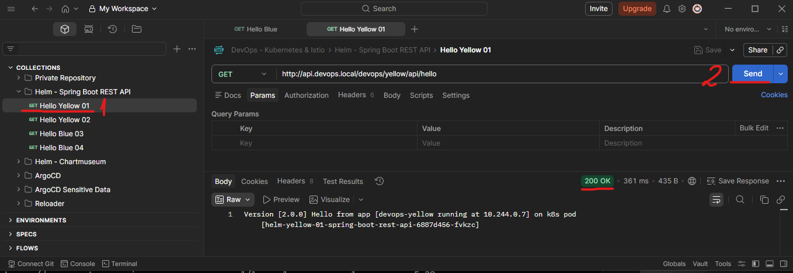
<br>
<br>

Nice, we learn the basics of creating and using our own Helm.

Don't forget to clean up the cluster by deleting any Helm releases so we can start fresh for the next lesson.

    CMD --> helm uninstall -n devops helm-yellow-01

    # result: release "helm-yellow-01" uninstalled

    CMD --> kubectl delete namespace devops

    # result: namespace "devops" deleted


[⬆ Back to top](#top)


## 58 ChartMuseum

[⬆ Back to top](#top)

Delete the previous minikube and start fresh Minikube cluster

    bash --> minikube delete
    bash --> minikube start --cpus 4 --memory 8192 --driver docker

In reality, we need our own chart repository to store our custom Helm charts and reuse them. Such a repository can be a cloud storage service, such as AWS S3 or Google Cloud Storage. But some tools can be used for this, like ChartMuseum. Behind the scenes, Chartmuseum can use various storage, such as local or cloud storage. In this lesson, we will learn how to use ChartMuseum with local storage to host our own chart repository. The ChartMuseum itself is a Helm artifact, so we install it on our Kubernetes cluster and use it to host our charts. As usual, you can copy and paste the command for this lesson from the lecture resource in the last section of the course. 

Install HAProxy

    CMD --> helm upgrade --install my-haproxy kubernetes-ingress --repo https://haproxytech.github.io/helm-charts --namespace haproxy --create-namespace --set controller.service.type=LoadBalancer

    # result:
    Release "my-haproxy" does not exist. Installing it now.
    NAME: my-haproxy
    LAST DEPLOYED: Tue Mar 17 10:06:27 2026
    NAMESPACE: haproxy
    STATUS: deployed
    REVISION: 1
    DESCRIPTION: Install complete
    TEST SUITE: None
    NOTES:
    HAProxy Kubernetes Ingress Controller has been successfully installed.

    Controller image deployed is: "docker.io/haproxytech/kubernetes-ingress:3.2.6".
    Your controller is of a "Deployment" kind. Your controller service is running as a "LoadBalancer" type.
    RBAC authorization is enabled.
    Controller ingress.class is set to "haproxy" so make sure to use same annotation for
    Ingress resource.

    Service ports mapped are:
    - name: admin
        containerPort: 6060
        protocol: TCP
    - name: http
        containerPort: 8080
        protocol: TCP
    - name: https
        containerPort: 8443
        protocol: TCP
    - name: stat
        containerPort: 1024
        protocol: TCP
    - name: quic
        containerPort: 8443
        protocol: UDP

    Node IP can be found with:
    $ kubectl --namespace haproxy get nodes -o jsonpath="{.items[0].status.addresses[1].address}"

    The following ingress resource routes traffic to pods that match the following:
    * service name: web
    * client's Host header: webdemo.com
    * path begins with /

    ---
    apiVersion: networking.k8s.io/v1
    kind: Ingress
    metadata:
        name: web-ingress
        namespace: default
        annotations:
        ingress.class: "haproxy"
    spec:
        rules:
        - host: webdemo.com
        http:
            paths:
            - path: /
            backend:
                serviceName: web
                servicePort: 80

    In case that you are using multi-ingress controller environment, make sure to use ingress.class annotation and match it
    with helm chart option controller.ingressClass.

    For more examples and up to date documentation, please visit:
    * Helm chart documentation: https://github.com/haproxytech/helm-charts/tree/main/kubernetes-ingress
    * Controller documentation: https://www.haproxy.com/documentation/kubernetes/latest/
    * Annotation reference: https://github.com/haproxytech/kubernetes-ingress/tree/master/documentation
    * Image parameters reference: https://github.com/haproxytech/kubernetes-ingress/blob/master/documentation/controller.md


To install ChartMuseum using Helm, see the guidance on Artifact Hub - https://artifacthub.io/packages/helm/chartmuseum/chartmuseum

It requires several configurations, which are available in the YAML file under the helm-chartmuseum folder - values-chartmuseum.yml. We will use local storage, enable the Chartmuseum API, and set its base path. We will also secure the ChartMuseum using the username and password from the Kubernetes secret. The local storage will be persisted using this configuration. This is a configuration regarding resource quota and limit. And we will enable ingress, using HAProxy with ChartMuseum as the path.

values-chartmuseum.yml

```yaml
env:
  open:
    STORAGE: local
    DISABLE_API: false                          # API enabled
    CONTEXT_PATH: chartmuseum                   # local storage
  existingSecret: chartmuseum-credential
  existingSecretMappings:
    BASIC_AUTH_USER: chartmuseum-username       # kubernetes secret username
    BASIC_AUTH_PASS: chartmuseum-password       # kubernetes secret password

persistence:                    # persistent local storage
  enabled: true
  accessMode: ReadWriteOnce
  size: 500Mi

resources:                      # limits for local strage
  requests:
  limits:
    cpu: "0.4"
    memory: 350M

ingress:                        # ingress using haproxy as path
  enabled: "true"
  ingressClassName: haproxy
  pathType: Prefix
  hosts:
  - name: chartmuseum.local
    path: /chartmuseum
```

First, create a namespace and a secret for credentials.

    CMD --> kubectl apply -f secret-chartmuseum.yml

    # result: 
    namespace/chartmuseum created
    secret/chartmuseum-credential created

Let's install ChartMuseum by using Helm and the values-chartmuseum.yml configuration file. In the host, we use chartmuseum.local as the host name. So don't forget to add this DNS entry to your hosts file.

    CMD -->  helm upgrade --install my-chartmuseum chartmuseum --repo https://chartmuseum.github.io/charts --namespace chartmuseum --create-namespace --values values-chartmuseum.yml

    # result:
    NAME: my-chartmuseum
    LAST DEPLOYED: Tue Mar 17 09:20:47 2026
    NAMESPACE: chartmuseum
    STATUS: deployed
    REVISION: 1
    DESCRIPTION: Install complete
    TEST SUITE: None
    NOTES:
    ** Please be patient while the chart is being deployed **

    Get the ChartMuseum URL by running:

    export POD_NAME=$(kubectl get pods --namespace chartmuseum -l "app=chartmuseum" -l "release=my-chartmuseum" -o jsonpath="{.items[0].metadata.name}")
    echo http://127.0.0.1:8080chartmuseum/
    kubectl port-forward $POD_NAME 8080:8080 --namespace chartmuseum

Start minikube tunnel

    CMD --> minikube tunnel

When done, open Postman in the folder Chartmuseum, and you should be able to access the health check endpoint. Notice that we secure it using the username "chartmuseum" and the password "password". If it succeeds, ChartMuseum is ready for use.

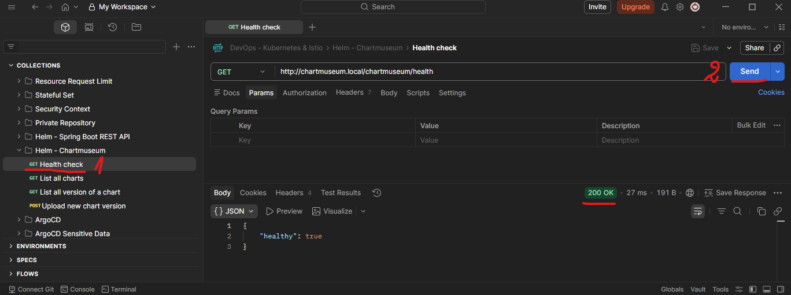

The next step is to upload our custom chart to ChartMuseum. To do this, we can package the chart. Go to the folder helm-charts, and execute the helm package command to package the Spring Boot rest api helm chart. 

    helm-charts CMD --> helm package spring-boot-rest-api

    # result:
    Successfully packaged chart and saved it to: D:\repos\Practical Devops - Kubernetes & Istio with Google Cloud\Section 17 Creating and Using Helm Charts\helm-charts\spring-boot-rest-api-0.1.0.tgz

It will generate a tar archive that we can upload to ChartMuseum. We can upload it using the API. Select the binary tar file as the request body, and upload it. 

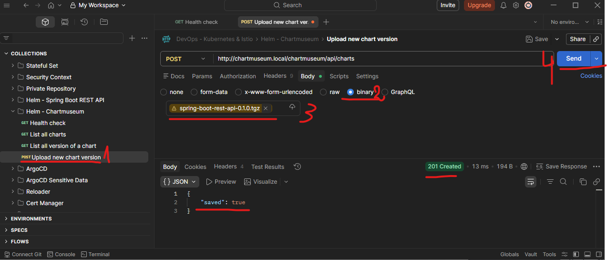

Now, when we check the list of charts, we should see our Spring Boot rest api chart, version 0.1.0. It is now ready to use. 

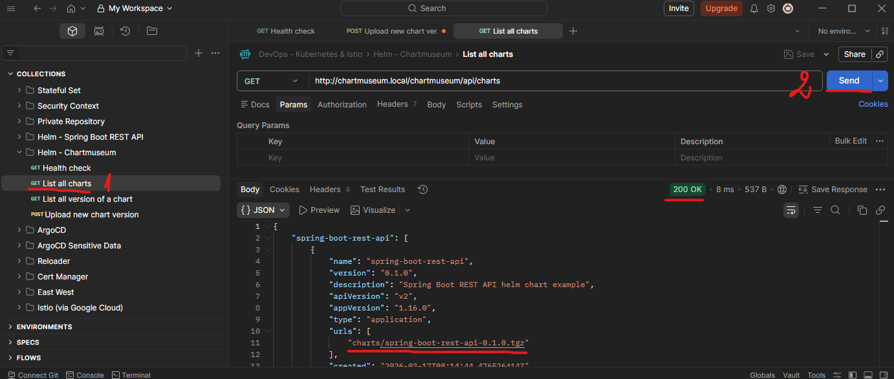

Now we can treat our local repository as a regular Helm chart repository. We can add a repository using the ChartMuseum URL we just installed, or use a flag with the helm command. Like this. In the folder Spring Boot REST API 02, I will install the Yellow image using a specific values file. These values are almost identical to those in the Spring Boot REST API 01. The difference is that we turn off autoscaling, so it will only generate exactly 1 replica, since 1 is the default value on the helm chart template. Also, we use HAProxy ingress instead of the gateway API.

Create the release.

    Spring Boot REST API 02 CMD --> helm upgrade --install helm-yellow-02 spring-boot-rest-api --repo http://chartmuseum.local/chartmuseum --username chartmuseum --password password --namespace devops --create-namespace --values values-spring-boot.yml --version 0.1.0

    # result:
    Release "helm-yellow-02" does not exist. Installing it now.
    NAME: helm-yellow-02
    LAST DEPLOYED: Tue Mar 17 10:22:54 2026
    NAMESPACE: devops
    STATUS: deployed
    REVISION: 1
    DESCRIPTION: Install complete
    NOTES:
    1. Get the application URL by running these commands:
    http://yellow.devops.local/devops/yellow

Notice a few things. First, the repo flag is using chartmuseum, our local Helm repository. Since we secure ChartMuseum with a username and password, we must provide those credentials. 

Wait a few moments until the pod is ready. 

    CMD --> kubectl get pods -n devops

    # result:
    NAME                                                   READY   STATUS    RESTARTS   AGE
    helm-yellow-02-spring-boot-rest-api-67b46f7dcc-mwhdt   1/1     Running   0          96s

Then check the yellow from Postman.

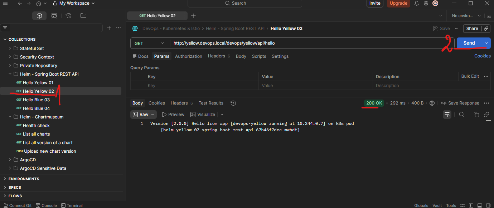

Don't forget to clean up the cluster by deleting any deployments so wecan start fresh for the next lesson.

    CMD --> helm uninstall helm-yellow-02 -n devops

    # result: release "helm-yellow-02" uninstalled

    CMD --> kubectl delete namespace devops

    # result: namespace "devops" deleted

[⬆ Back to top](#top)


## 59 Harbor

[⬆ Back to top](#top)

Delete the previous minikube and start fresh Minikube cluster

    bash --> minikube delete
    bash --> minikube start --cpus 4 --memory 8192 --driver docker

ChartMuseum is still usable and works well for simple use cases. However, modern Helm versions support the OCI (Open Container Initiative) standard, which allows Helm charts to be stored and distributed in the same way as container images. For this purpose, we can use Harbor instead of ChartMuseum. Harbor fully supports this OCI-based approach. Harbor is a complete artifact registry that can store container images, Helm charts, and other OCI artifacts in a single system. Because of this, Harbor is widely adopted in real-world Kubernetes platforms and is often used as the central registry for both Docker images and Helm charts. Harbor also has several out-of-the-box features, such as authentication, role-based access control, and a web-based user interface that makes it easy to browse images and Helm charts. In addition, Harbor supports vulnerability scanning, content trust, and policy enforcement. 

We will install Harbor on our Kubernetes cluster using Helm. We will put HAProxy ingress to access Harbor, via the DNS name 'harbor.local'. As usual, you can copy and paste the commands for this lesson from the course resources. 

First, add the Harbor Helm repository.

    CMD --> helm repo add harbor https://helm.goharbor.io

    # result: "harbor" has been added to your repositories

Update repos

    CMD --> helm repo update

    # result:
    Hang tight while we grab the latest from your chart repositories...
    ...Successfully got an update from the "chartmuseum" chart repository
    ...Successfully got an update from the "harbor" chart repository
    ...Successfully got an update from the "haproxytech" chart repository
    Update Complete. ⎈Happy Helming!⎈

###### return point 1

In most real-world setups, Harbor is always accessed over HTTPS. Thus, let's configure TLS for 'harbor.local', assuming we already have a certificate and a private key. To obtain those files, see the lesson [Ingress over TLS](../Section%2010%20Exposing%20Kubernetes%20Pod/Section%2010%20Exposing%20Kubernetes%20Pod%20Notes.md#39-ingress-over-tls) for a refresher. 

Create certificates on https://regery.com/en/security/ssl-tools/self-signed-certificate-generator using 'harbor.local'. Save the certificates.

Create a Kubernetes TLS secret in the harbor namespace. 

Create 'harbor' namespace

    CMD --> kubectl create namespace harbor

    # result: namespace/harbor created

Create a secret from TLS certificates

    CMD --> kubectl create secret tls harbor-local-cert --key C:\Users\user_name\Downloads\harbor-local-privateKey.key --cert C:\Users\user_name\Downloads\harbor-local.crt --namespace harbor

    # result: secret/harbor-local-cert created

 Install HAProxy

    CMD --> helm upgrade --install my-haproxy kubernetes-ingress --repo https://haproxytech.github.io/helm-charts --namespace haproxy --create-namespace --set controller.service.type=LoadBalancer

    # result:
    Release "my-haproxy" does not exist. Installing it now.
    NAME: my-haproxy
    LAST DEPLOYED: Tue Mar 17 13:08:58 2026
    NAMESPACE: haproxy
    STATUS: deployed
    REVISION: 1
    DESCRIPTION: Install complete
    TEST SUITE: None
    NOTES:
    HAProxy Kubernetes Ingress Controller has been successfully installed.

    Controller image deployed is: "docker.io/haproxytech/kubernetes-ingress:3.2.6".
    Your controller is of a "Deployment" kind. Your controller service is running as a "LoadBalancer" type.
    RBAC authorization is enabled.
    Controller ingress.class is set to "haproxy" so make sure to use same annotation for
    Ingress resource.

    Service ports mapped are:
    - name: admin
        containerPort: 6060
        protocol: TCP
    - name: http
        containerPort: 8080
        protocol: TCP
    - name: https
        containerPort: 8443
        protocol: TCP
    - name: stat
        containerPort: 1024
        protocol: TCP
    - name: quic
        containerPort: 8443
        protocol: UDP

    Node IP can be found with:
    $ kubectl --namespace haproxy get nodes -o jsonpath="{.items[0].status.addresses[1].address}"

    The following ingress resource routes traffic to pods that match the following:
    * service name: web
    * client's Host header: webdemo.com
    * path begins with /

    ---
    apiVersion: networking.k8s.io/v1
    kind: Ingress
    metadata:
        name: web-ingress
        namespace: default
        annotations:
        ingress.class: "haproxy"
    spec:
        rules:
        - host: webdemo.com
        http:
            paths:
            - path: /
            backend:
                serviceName: web
                servicePort: 80

    In case that you are using multi-ingress controller environment, make sure to use ingress.class annotation and match it
    with helm chart option controller.ingressClass.

    For more examples and up to date documentation, please visit:
    * Helm chart documentation: https://github.com/haproxytech/helm-charts/tree/main/kubernetes-ingress
    * Controller documentation: https://www.haproxy.com/documentation/kubernetes/latest/
    * Annotation reference: https://github.com/haproxytech/kubernetes-ingress/tree/master/documentation
    * Image parameters reference: https://github.com/haproxytech/kubernetes-ingress/blob/master/documentation/controller.md

Check if haproxy pods are running

    CMD --> kubectl get pods -n haproxy

    # result:
    NAME                                            READY   STATUS    RESTARTS   AGE
    my-haproxy-kubernetes-ingress-86b7bd887-2ssr9   1/1     Running   0          2m42s
    my-haproxy-kubernetes-ingress-86b7bd887-jfjlc   1/1     Running   0          2m42s

Check the helm-harbor folder, where we have the values-harbor configuration for demo purposes - values-harbor.yml. In this configuration, we expose Harbor using HAProxy ingress and set the external URL to 'harbor.local'. We enable TLS for secure access, using the TLS secret we have just created. We set the accessible harbor URL to 'harbor.local' using HTTPS and the admin password. We enable persistence so our images and Helm charts are stored on persistent volumes. We explicitly disable ChartMuseum because we are using OCI-based Helm charts, which do not require a traditional Helm chart repository. We also disable Notary and Trivy to keep the setup lightweight for local development. Notary provides image signing and verification to ensure image integrity and trust, while Trivy performs vulnerability scanning on container images. Both features are commonly enabled in production environments, but are not essential for a local demo.

values-harbor.yml

```yaml
expose:
  type: ingress
  ingress:
    className: haproxy
    hosts:
      core: harbor.local    
  tls:
    enabled: true
    certSource: secret
    secret:
      secretName: harbor-local-cert
  
externalURL: https://harbor.local           # expose local address

harborAdminPassword: harbor12345            # set admin password

persistence:                                # use persistent volumes
  enabled: true
  persistentVolumeClaim:
    registry:
      size: 100M

chartmuseum:                                # disable chartmuseum
  enabled: false

trivy:                                      # keep it light for local development
  enabled: false

notary:                                     # keep it light for local development
  enabled: false
```

Install Harbor using Helm and the values file.

    helm-harbor CMD --> helm upgrade --install harbor harbor/harbor --namespace harbor --create-namespace --values values-harbor.yml

    # result:
    Release "harbor" does not exist. Installing it now.
    NAME: harbor
    LAST DEPLOYED: Tue Mar 17 13:19:20 2026
    NAMESPACE: harbor
    STATUS: deployed
    REVISION: 1
    DESCRIPTION: Install complete
    TEST SUITE: None
    NOTES:
    Please wait for several minutes for Harbor deployment to complete.
    Then you should be able to visit the Harbor portal at https://harbor.local
    For more details, please visit https://github.com/goharbor/harbor

Since we use 'harbor.local' as DNS, add the entry to the hosts file.

Once the pods are ready

    CMD --> kubectl get pods -n harbor

    # result:
    NAME                                 READY   STATUS    RESTARTS      AGE
    harbor-core-5c8bcb7659-wzxbn         1/1     Running   0             2m10s
    harbor-database-0                    1/1     Running   0             2m10s
    harbor-jobservice-85767d79cf-glvxk   1/1     Running   4 (77s ago)   2m10s
    harbor-portal-787564b9b9-b7sng       1/1     Running   0             2m10s
    harbor-redis-0                       1/1     Running   0             2m10s
    harbor-registry-84c4688877-k564n     2/2     Running   0             2m10s

Start minikube tunnel

    CMD --> minikube tunnel

Open a browser and navigate to 'harbor.local'. Log in using username 'admin' and password 'harbor12345.' In the Harbor UI, create a new project named 'helm-charts'. Set it to public for simplicity in this lesson. This project will store our Helm charts. 

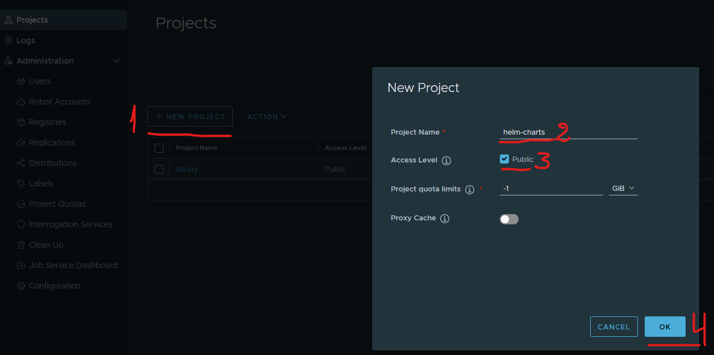

Go to the folder containing our Helm charts and package the Spring Boot REST API chart. 

    helm-charts CMD --> helm package spring-boot-rest-api

    # result:
    Successfully packaged chart and saved it to: D:\repos\Practical Devops - Kubernetes & Istio with Google Cloud\Section 17 Creating and Using Helm Charts\helm-charts\spring-boot-rest-api-0.1.0.tgz

Harbor supports Helm charts using the OCI standard. First, log in to Harbor using the helm terminal command. Note that we use the insecure flag because we use a self-signed TLS certificate.

    CMD --> helm registry login harbor.local --username admin --password harbor12345 --insecure

    # result:
    level=WARN msg="using --password via the CLI is insecure. Use --password-stdin"
    Login Succeeded

Then push the tar file into Harbor. If the command succeeds, our Helm chart is now stored in Harbor. 

    CMD --> helm push spring-boot-rest-api-0.1.0.tgz oci://harbor.local/helm-charts --insecure-skip-tls-verify

    # result:
    Pushed: harbor.local/helm-charts/spring-boot-rest-api:0.1.0
    Digest: sha256:f73823d6ed9fec4b5af51cd50b77f870c1d639fbab77e884f9506b401ea347dc

We can verify this in the Harbor User interface - https://harbor.local/harbor/projects/2/repositories. 

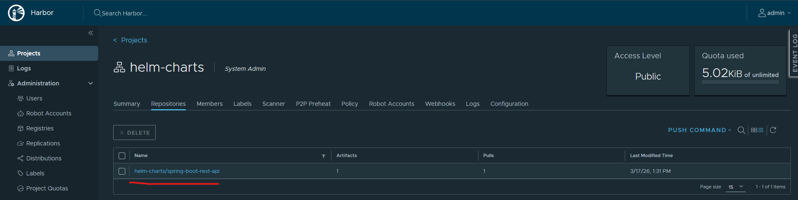

Now we can treat Harbor as a regular Helm repository.

In the Spring Boot REST API 02 folder, we have the values-spring-boot.yml file that we used in the ChartMuseum lesson. We will use the same file to demonstrate that ChartMuseum or Harbor usage does not affect the chart's behavior.

values-spring-boot.yml

```yaml
# -------------------------------------------------------
# For deployment
image:
  repository: timpamungkas/devops-yellow
  tag: 2.0.0

applicationPort: 8112

actuatorPort: 8112

prometheusPath: /devops/yellow/actuator/prometheus

health:
  liveness:
    path: /devops/yellow/actuator/health/liveness
  readiness:
    path: /devops/yellow/actuator/health/readiness

# Mind the | which indicates this is raw string
extraVolumeMounts: |
  - name: upload-image-empty-dir
    mountPath: /upload/image
  - name: upload-doc-empty-dir
    mountPath: /upload/doc

# Mind the | which indicates this is raw string
extraVolumes: |
  - name: upload-image-empty-dir
    emptyDir: {}
  - name: upload-doc-empty-dir
    emptyDir: {}

# -------------------------------------------------------
# For service
service:
  type: ClusterIP
  port: 8112

# -------------------------------------------------------
# For autoscaling
autoscaling:
  enabled: false

# -------------------------------------------------------
# For gateway API
# The gateway `devops-gateway` must already exists

httpRoute:
  enabled: false
  annotations: {}
  parentRefs:
    - name: devops-gateway
  hostnames:
    - api.devops.local
  rules:
    - matches:
        - path:
            type: PathPrefix
            value: /devops/yellow
      filters: []

# -------------------------------------------------------
# For ingress
ingress:
  enabled: true
  className: haproxy
  annotations: 
    haproxy.org/rate-limit-period: 1m
    haproxy.org/rate-limit-requests: "30"
    haproxy.org/rate-limit-status-code: "429"
  hosts:
  - host: yellow.devops.local
    paths:
    - path: /devops/yellow
      pathType: Prefix      
```

Install the chart using Harbor as a Helm repository.

    helm-spring-boot-rest-api-02 CMD --> helm upgrade --install helm-yellow-02 oci://harbor.local/helm-charts/spring-boot-rest-api --version 0.1.0 --namespace devops --create-namespace --values values-spring-boot.yml --insecure-skip-tls-verify

    # result:
    Release "helm-yellow-02" does not exist. Installing it now.
    Pulled: harbor.local/helm-charts/spring-boot-rest-api:0.1.0
    Digest: sha256:f73823d6ed9fec4b5af51cd50b77f870c1d639fbab77e884f9506b401ea347dc
    NAME: helm-yellow-02
    LAST DEPLOYED: Tue Mar 17 13:38:25 2026
    NAMESPACE: devops
    STATUS: deployed
    REVISION: 1
    DESCRIPTION: Install complete
    NOTES:
    1. Get the application URL by running these commands:
    http://yellow.devops.local/devops/yellow

Since we set the harbor project as a public repository, we don't need to pass any credentials. However, since we use a self-signed certificate, we need to bypass the TLS verification. In real life, with a real TLS certificate, the insecure flag should be omitted.

Wait a few moments until the pod is ready.

    CMD --> kubectl get pods -n devops

    # result:
    NAME                                                   READY   STATUS    RESTARTS   AGE
    helm-yellow-02-spring-boot-rest-api-67b46f7dcc-zzwzv   1/1     Running   0          102s

Ensure minikube tunnel is running

    CMD --> minikube tunnel

Use Postman to access the yellow endpoint.

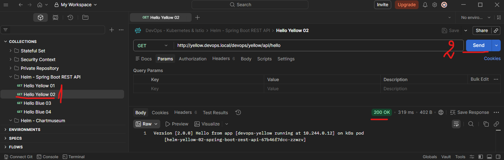
<br>
<br>

If the response is successful, the deployment is complete.

Finally, don't forget to clean up the cluster by deleting any deployments so we can start fresh for the next lesson.

    CMD --> minikube delete

[⬆ Back to top](#top)


## 60 Multiple Configurations

[⬆ Back to top](#top)

Start fresh Minikube cluster

    bash --> minikube start --cpus 4 --memory 8192 --driver docker

We will install Harbor on our Kubernetes cluster using Helm. We will put HAProxy ingress to access Harbor, via the DNS name 'harbor.local'. As usual, you can copy and paste the commands for this lesson from the course resources. 

First, add the Harbor Helm repository.

    CMD --> helm repo add harbor https://helm.goharbor.io

    # result: "harbor" has been added to your repositories

Update repos

    CMD --> helm repo update

    # result:
    Hang tight while we grab the latest from your chart repositories...
    ...Successfully got an update from the "chartmuseum" chart repository
    ...Successfully got an update from the "harbor" chart repository
    ...Successfully got an update from the "haproxytech" chart repository
    Update Complete. ⎈Happy Helming!⎈

###### return point 2

In most real-world setups, Harbor is always accessed over HTTPS. Thus, let's configure TLS for 'harbor.local', assuming we already have a certificate and a private key. To obtain those files, see the lesson [Ingress over TLS](../Section%2010%20Exposing%20Kubernetes%20Pod/Section%2010%20Exposing%20Kubernetes%20Pod%20Notes.md#39-ingress-over-tls) for a refresher. 

Create certificates on https://regery.com/en/security/ssl-tools/self-signed-certificate-generator using 'harbor.local'. Save the certificates.

Create a Kubernetes TLS secret in the harbor namespace. 

Create 'harbor' namespace

    CMD --> kubectl create namespace harbor

    # result: namespace/harbor created

Create a secret from TLS certificates

    CMD --> kubectl create secret tls harbor-local-cert --key C:\Users\user_name\Downloads\harbor-local-privateKey.key --cert C:\Users\user_name\Downloads\harbor-local.crt --namespace harbor

    # result: secret/harbor-local-cert created

 Install HAProxy

    CMD --> helm upgrade --install my-haproxy kubernetes-ingress --repo https://haproxytech.github.io/helm-charts --namespace haproxy --create-namespace --set controller.service.type=LoadBalancer

    # result:
    Release "my-haproxy" does not exist. Installing it now.
    NAME: my-haproxy
    LAST DEPLOYED: Tue Mar 17 13:08:58 2026
    NAMESPACE: haproxy
    STATUS: deployed
    REVISION: 1
    DESCRIPTION: Install complete
    TEST SUITE: None
    NOTES:
    HAProxy Kubernetes Ingress Controller has been successfully installed.

    Controller image deployed is: "docker.io/haproxytech/kubernetes-ingress:3.2.6".
    Your controller is of a "Deployment" kind. Your controller service is running as a "LoadBalancer" type.
    RBAC authorization is enabled.
    Controller ingress.class is set to "haproxy" so make sure to use same annotation for
    Ingress resource.

    Service ports mapped are:
    - name: admin
        containerPort: 6060
        protocol: TCP
    - name: http
        containerPort: 8080
        protocol: TCP
    - name: https
        containerPort: 8443
        protocol: TCP
    - name: stat
        containerPort: 1024
        protocol: TCP
    - name: quic
        containerPort: 8443
        protocol: UDP

    Node IP can be found with:
    $ kubectl --namespace haproxy get nodes -o jsonpath="{.items[0].status.addresses[1].address}"

    The following ingress resource routes traffic to pods that match the following:
    * service name: web
    * client's Host header: webdemo.com
    * path begins with /

    ---
    apiVersion: networking.k8s.io/v1
    kind: Ingress
    metadata:
        name: web-ingress
        namespace: default
        annotations:
        ingress.class: "haproxy"
    spec:
        rules:
        - host: webdemo.com
        http:
            paths:
            - path: /
            backend:
                serviceName: web
                servicePort: 80

    In case that you are using multi-ingress controller environment, make sure to use ingress.class annotation and match it
    with helm chart option controller.ingressClass.

    For more examples and up to date documentation, please visit:
    * Helm chart documentation: https://github.com/haproxytech/helm-charts/tree/main/kubernetes-ingress
    * Controller documentation: https://www.haproxy.com/documentation/kubernetes/latest/
    * Annotation reference: https://github.com/haproxytech/kubernetes-ingress/tree/master/documentation
    * Image parameters reference: https://github.com/haproxytech/kubernetes-ingress/blob/master/documentation/controller.md

Check if haproxy pods are running

    CMD --> kubectl get pods -n haproxy

    # result:
    NAME                                            READY   STATUS    RESTARTS   AGE
    my-haproxy-kubernetes-ingress-86b7bd887-2ssr9   1/1     Running   0          2m42s
    my-haproxy-kubernetes-ingress-86b7bd887-jfjlc   1/1     Running   0          2m42s

Check the helm-harbor folder, where we have the values-harbor configuration for demo purposes - values-harbor.yml. In this configuration, we expose Harbor using HAProxy ingress and set the external URL to 'harbor.local'. We enable TLS for secure access, using the TLS secret we have just created. We set the accessible harbor URL to 'harbor.local' using HTTPS and the admin password. We enable persistence so our images and Helm charts are stored on persistent volumes. We explicitly disable ChartMuseum because we are using OCI-based Helm charts, which do not require a traditional Helm chart repository. We also disable Notary and Trivy to keep the setup lightweight for local development. Notary provides image signing and verification to ensure image integrity and trust, while Trivy performs vulnerability scanning on container images. Both features are commonly enabled in production environments, but are not essential for a local demo.

values-harbor.yml

```yaml
expose:
  type: ingress
  ingress:
    className: haproxy
    hosts:
      core: harbor.local    
  tls:
    enabled: true
    certSource: secret
    secret:
      secretName: harbor-local-cert
  
externalURL: https://harbor.local           # expose local address

harborAdminPassword: harbor12345            # set admin password

persistence:                                # use persistent volumes
  enabled: true
  persistentVolumeClaim:
    registry:
      size: 100M

chartmuseum:                                # disable chartmuseum
  enabled: false

trivy:                                      # keep it light for local development
  enabled: false

notary:                                     # keep it light for local development
  enabled: false
```

Install Harbor using Helm and the values file.

    helm-harbor CMD --> helm upgrade --install harbor harbor/harbor --namespace harbor --create-namespace --values values-harbor.yml

    # result:
    Release "harbor" does not exist. Installing it now.
    NAME: harbor
    LAST DEPLOYED: Tue Mar 17 13:19:20 2026
    NAMESPACE: harbor
    STATUS: deployed
    REVISION: 1
    DESCRIPTION: Install complete
    TEST SUITE: None
    NOTES:
    Please wait for several minutes for Harbor deployment to complete.
    Then you should be able to visit the Harbor portal at https://harbor.local
    For more details, please visit https://github.com/goharbor/harbor

Since we use 'harbor.local' as DNS, add the entry to the hosts file.

Once the pods are ready

    CMD --> kubectl get pods -n harbor

    # result:
    NAME                                 READY   STATUS    RESTARTS      AGE
    harbor-core-5c8bcb7659-wzxbn         1/1     Running   0             2m10s
    harbor-database-0                    1/1     Running   0             2m10s
    harbor-jobservice-85767d79cf-glvxk   1/1     Running   4 (77s ago)   2m10s
    harbor-portal-787564b9b9-b7sng       1/1     Running   0             2m10s
    harbor-redis-0                       1/1     Running   0             2m10s
    harbor-registry-84c4688877-k564n     2/2     Running   0             2m10s

Start minikube tunnel

    CMD --> minikube tunnel

Open a browser and navigate to 'harbor.local'. Log in using username 'admin' and password 'harbor12345.' In the Harbor UI, create a new project named 'helm-charts'. Set it to public for simplicity in this lesson. This project will store our Helm charts. 


<br>
<br>

Go to the folder containing our Helm charts and package the Spring Boot REST API chart. 

    helm-charts CMD --> helm package spring-boot-rest-api

    # result:
    Successfully packaged chart and saved it to: D:\repos\Practical Devops - Kubernetes & Istio with Google Cloud\Section 17 Creating and Using Helm Charts\helm-charts\spring-boot-rest-api-0.1.0.tgz

Harbor supports Helm charts using the OCI standard. First, log in to Harbor using the helm terminal command. Note that we use the insecure flag because we use a self-signed TLS certificate.

    CMD --> helm registry login harbor.local --username admin --password harbor12345 --insecure

    # result:
    level=WARN msg="using --password via the CLI is insecure. Use --password-stdin"
    Login Succeeded

Then push the tar file into Harbor. If the command succeeds, our Helm chart is now stored in Harbor. 

    CMD --> helm push spring-boot-rest-api-0.1.0.tgz oci://harbor.local/helm-charts --insecure-skip-tls-verify

    # result:
    Pushed: harbor.local/helm-charts/spring-boot-rest-api:0.1.0
    Digest: sha256:f73823d6ed9fec4b5af51cd50b77f870c1d639fbab77e884f9506b401ea347dc

We can verify this in the Harbor User interface - https://harbor.local/harbor/projects/2/repositories. 


<br>
<br>

Now we can treat Harbor as a regular Helm repository.

In reality, we cannot rely on a single values file. We might deploy the same Docker image and several configurations. But there are different configurations between development, test, and production environments. In this case, we can use multiple 'values' files. One values file for general configuration, and several other 'values' files, one for each environment. Then we can pass multiple file arguments when creating a Helm release. 

For example,open the Helm Spring Boot REST API 3. Thereare 3 value files here - values.yml, values-dev.yml and values-prod.yml. The name is up to you, but for simplicity, the values.yml is the general configuration. This time, we will deploy a blue Docker image, and the rest of the configuration should be familiar to you. This configuration will be used for all environments. 

values.yml

```yaml
image:
  repository: timpamungkas/devops-blue
  tag: 2.0.0

applicationPort: 8111

actuatorPort: 8111

prometheusPath: /devops/blue/actuator/prometheus

health:
  liveness:
    port: 8111
    path: /devops/blue/actuator/health/liveness
  readiness:
    port: 8111
    path: /devops/blue/actuator/health/readiness

extraVolumeMounts: |
  - name: upload-image-empty-dir
    mountPath: /upload/image
  - name: upload-doc-empty-dir
    mountPath: /upload/doc

extraVolumes: |
  - name: upload-image-empty-dir
    emptyDir: {}
  - name: upload-doc-empty-dir
    emptyDir: {}

service:
  type: ClusterIP
  port: 80

httpRoute:
  enabled: false

ingress:
  enabled: true
  className: haproxy
  hosts:
  - host: api.devops.local
    paths:
    - path: /devops/blue
      pathType: Prefix
```


Then we have values-dev.yml and values-prod.yml Which has the same key entry, but a different value. For example, the production rate limit is higher, and the environment variables differ between the two files.

values-dev.yml

```yaml
autoscaling:
  enabled: false

ingress:
  annotations: 
    haproxy.org/rate-limit-period: 1m
    haproxy.org/rate-limit-requests: "10"
    haproxy.org/rate-limit-status-code: "429"

extraEnv: |
  - name: DEVOPS_BLUE_HTML_BG_COLOR
    value: "#dcecf2"
  - name: DEVOPS_BLUE_HTML_TEXT_COLOR
    value: "#000000"
  - name: HARDCODED_ENVIRONMENT_VARIABLE
    value: This is from values-dev.yml
  - name: DEVOPS_BLUE_HTML_TEXT_ONE
    value: This is from values-dev.yml
  - name: DEVOPS_BLUE_HTML_TEXT_TWO
    value: This is from values-dev.yml
  - name: DEVOPS_BLUE_HTML_TEXT_THREE
    value: This is from values-dev.yml
  - name: DEVOPS_BLUE_HTML_TEXT_FOUR
    value: This is from values-dev.yml
  - name: DEVOPS_BLUE_HTML_TEXT_FIVE
    value: This is from values-dev.yml
  - name: DEVOPS_BLUE_HTML_TEXT_SIX
    value: This is from values-dev.yml
```

values-prod.yml

```yaml
autoscaling:
  enabled: true

ingress:
  annotations: 
    haproxy.org/rate-limit-period: 1m
    haproxy.org/rate-limit-requests: "30"
    haproxy.org/rate-limit-status-code: "429"

extraEnv: |
  - name: DEVOPS_BLUE_HTML_BG_COLOR
    value: "#0644d4"
  - name: DEVOPS_BLUE_HTML_TEXT_COLOR
    value: "#ffffff"
  - name: HARDCODED_ENVIRONMENT_VARIABLE
    value: This is from values-prod.yml
  - name: DEVOPS_BLUE_HTML_TEXT_ONE
    value: This is from values-prod.yml
  - name: DEVOPS_BLUE_HTML_TEXT_TWO
    value: This is from values-prod.yml
  - name: DEVOPS_BLUE_HTML_TEXT_THREE
    value: This is from values-prod.yml
  - name: DEVOPS_BLUE_HTML_TEXT_FOUR
    value: This is from values-prod.yml
  - name: DEVOPS_BLUE_HTML_TEXT_FIVE
    value: This is from values-prod.yml
  - name: DEVOPS_BLUE_HTML_TEXT_SIX
    value: This is from values-prod.yml
```

Let's create a Helm release with two files: values and values-dev. To do this, we can set multiple values in a flag. If a key appears multiple times in a YAML file, the right most occurrence takes priority.

    helm-spring-boot-rest-api-03 CMD --> helm upgrade --install helm-blue-03 oci://harbor.local/helm-charts/spring-boot-rest-api --namespace devops --create-namespace --insecure-skip-tls-verify --version 0.1.0 --values values.yml --values values-dev.yml

    # result:
    Release "helm-blue-03" does not exist. Installing it now.
    Pulled: harbor.local/helm-charts/spring-boot-rest-api:0.1.0
    Digest: sha256:a192ee5d89959634d1bb3b831b77d28b5980f8072c0c724b67a60ec8d8878449
    NAME: helm-blue-03
    LAST DEPLOYED: Tue Mar 17 14:22:45 2026
    NAMESPACE: devops
    STATUS: deployed
    REVISION: 1
    DESCRIPTION: Install complete
    NOTES:
    1. Get the application URL by running these commands:
    http://api.devops.local/devops/blue

Wait a while for the pod to run 

    CMD --> kubectl get pods -n devops

    # result:
    NAME                                                 READY   STATUS    RESTARTS   AGE
    helm-blue-03-spring-boot-rest-api-654cdc7b8c-k76pj   1/1     Running   0          95s

Ensure minikube tunnel is running

    CMD --> minikube tunnel

Check via Postman, where we will get HTML elementsfrom values-dev.yaml.

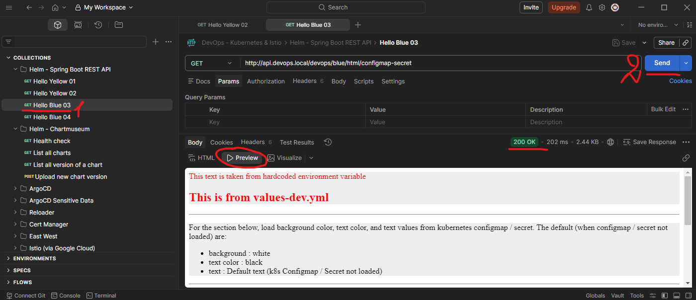
<br>
<br>

Similarly, if we want to use values from values-prod.yml, we can pass the file as an argument.

    helm-spring-boot-rest-api-03 CMD --> helm upgrade --install helm-blue-03 oci://harbor.local/helm-charts/spring-boot-rest-api --namespace devops --create-namespace --insecure-skip-tls-verify --version 0.1.0 --values values.yml --values values-prod.yml

    # result:
    Pulled: harbor.local/helm-charts/spring-boot-rest-api:0.1.0
    Digest: sha256:a192ee5d89959634d1bb3b831b77d28b5980f8072c0c724b67a60ec8d8878449
    Release "helm-blue-03" has been upgraded. Happy Helming!
    NAME: helm-blue-03
    LAST DEPLOYED: Tue Mar 17 14:28:45 2026
    NAMESPACE: devops
    STATUS: deployed
    REVISION: 2
    DESCRIPTION: Upgrade complete
    NOTES:
    1. Get the application URL by running these commands:
    http://api.devops.local/devops/blue

Wait a while for the pod to run 

    CMD --> kubectl get pods -n devops

    # result:
    NAME                                                 READY   STATUS    RESTARTS   AGE
    helm-blue-03-spring-boot-rest-api-76bff6cdb4-m4sfb   1/1     Running   0          105s

Ensure minikube tunnel is running

    CMD --> minikube tunnel

Test Postman request again

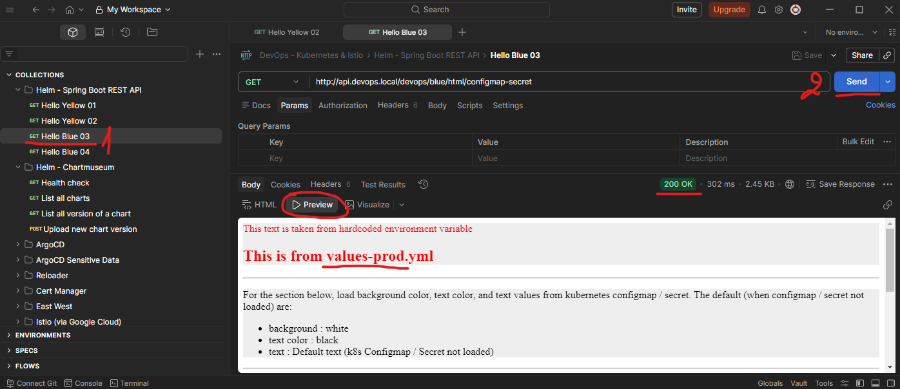
<br>
<br>
    
Don't forget to clean up the cluster by deleting any deploymentsso we can start fresh for the next lesson.

    CMD --> minikube delete


[⬆ Back to top](#top)


## 61 GitHub as Helm Repository

[⬆ Back to top](#top)

[Back to Section 18 GitOps and Problems That it Solves / 65 GitOp with ArgoCD](../Section%2018%20GitOps%20and%20Problems%20That%20it%20Solves/Section%2018%20GitOps%20and%20Problems%20That%20it%20Solves%20Notes.md#return-point-2)    
[Back to Section 18 GitOps and Problems That it Solves / 70 ArgoCD Sensitive Data](../Section%2018%20GitOps%20and%20Problems%20That%20it%20Solves/Section%2018%20GitOps%20and%20Problems%20That%20it%20Solves%20Notes.md#return-point-3)


In addition to ChartMuseum, we can also use GitHub as a Helm chart repository. We can use either a public or a private GitHub repository. In this lesson, we will learn how to create a Helm repository using GitHub. This lesson assumes you already have a GitHub account and are familiar with basic Git commands, such as clone, push, and pull.

Create a new GitHub repository. Let's name it devops-helm-charts. Add a readme file. 

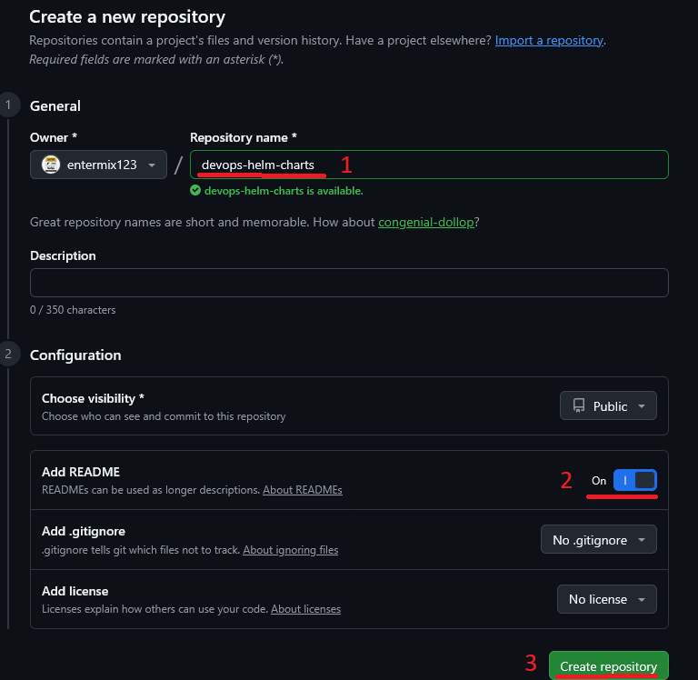
<br>
<br>

Still on GitHub, create a new branch named gh-pages, with the main branch as the source. 

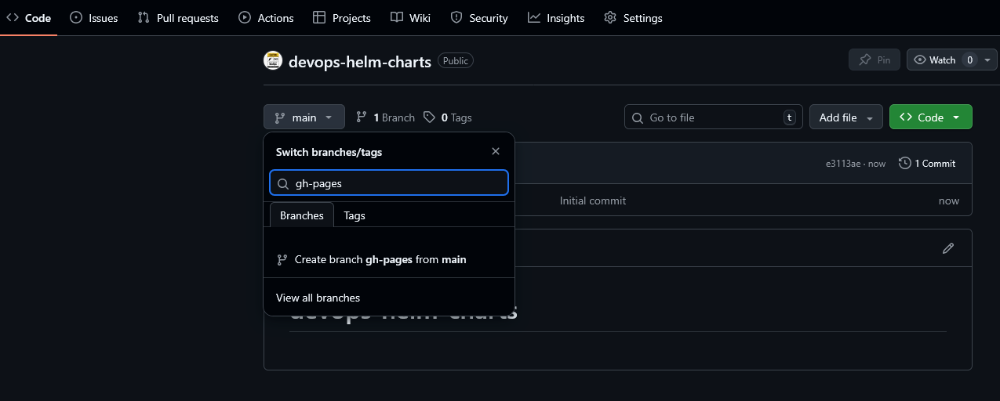
<br>
<br>

In the GitHub settings, enable GitHub Pages with the gh-pages branch as the source. Note this link, which will later be used as the Helm repository URL.

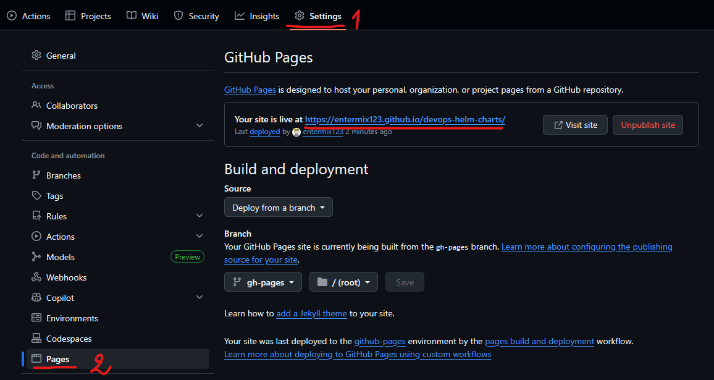
<br>
<br>

We can also follow the documentation at this link - https://github.com/marketplace/actions/helm-chart-releaser if any updates or customizations areneeded. 

Clone this repository to your local machine, using the main branch.

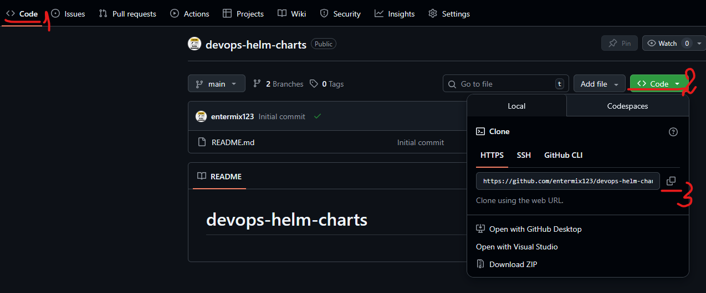
<br>
<br>

Create clone of the repository locally

    d:/repos CMD --> git clone https://github.com/entermix123/devops-helm-charts.git     
    d:/repos CMD --> cd devops-helm-charts       
    d:/repos/devops-helm-charts CMD --> git checkout main        
   
Then create folder 'charts'. Under the folder charts, copy the 'spring-boot-rest-api' Helm source from the previous lesson:
(Section 17 Creating and Using Helm Charts\helm-charts\spring-boot-rest-api)

charts
    |-- spring-boot-rest-api

To automate the chart release as a repository, we need to add a GitHub action. A GitHub action is an automation pipeline from GitHub. In this case, we will use Helm's official action to publish the chart. Create a new folder in ".github" subfolder "workflows". Add helm-release.yaml.

.github
    |-- workflows
            |-- helm-release.yaml

From the documentation - https://github.com/marketplace/actions/helm-chart-releaser#example-workflow, copy the GitHub Action configuration into helm-release.yml.

helm-release.yml

```yaml
name: Release Charts

on:
  push:
    branches:
      - main

jobs:
  release:
    # depending on default permission settings for your org (contents being read-only or read-write for workloads), you will have to add permissions
    # see: https://docs.github.com/en/actions/security-guides/automatic-token-authentication#modifying-the-permissions-for-the-github_token
    permissions:
      contents: write
    runs-on: ubuntu-latest
    steps:
      - name: Checkout
        uses: actions/checkout@v4
        with:
          fetch-depth: 0

      - name: Configure Git
        run: |
          git config user.name "$GITHUB_ACTOR"
          git config user.email "$GITHUB_ACTOR@users.noreply.github.com"

      - name: Run chart-releaser
        uses: helm/chart-releaser-action@v1.7.0
        env:
          CR_TOKEN: "${{ secrets.GITHUB_TOKEN }}"
```

Then push this repository. Notice which branch you push the code to. It should be the main branch.

    d:/repos/devops-helm-charts CMD --> git add .
    d:/repos/devops-helm-charts CMD --> git commit -a -m 'add helm chart release'

    # result:
    [main c97bf96] add helm chart release
    13 files changed, 565 insertions(+)
    create mode 100644 .github/workflows/helm-release.yaml
    create mode 100644 spring-boot-rest-api/.helmignore
    create mode 100644 spring-boot-rest-api/Chart.yaml
    create mode 100644 spring-boot-rest-api/templates/NOTES.txt
    create mode 100644 spring-boot-rest-api/templates/_helpers.tpl
    create mode 100644 spring-boot-rest-api/templates/deployment.yaml
    create mode 100644 spring-boot-rest-api/templates/hpa.yaml
    create mode 100644 spring-boot-rest-api/templates/httproute.yaml
    create mode 100644 spring-boot-rest-api/templates/ingress.yaml
    create mode 100644 spring-boot-rest-api/templates/service.yaml
    create mode 100644 spring-boot-rest-api/templates/serviceaccount.yaml
    create mode 100644 spring-boot-rest-api/templates/tests/test-connection.yaml
    create mode 100644 spring-boot-rest-api/values.yaml

    d:/repos/devops-helm-charts CMD --> git push

When we push thisfile, the GitHub action will be triggered. Check the status from this menu. Make sure all jobs run well.

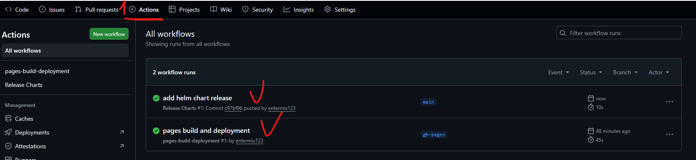        
<br>
<br>
Then, if we check the gh-pages branch, we will have an index.yaml file there. A GitHub action automatically generates this file, and opening it shows a list of Helm charts in thisrepository. 

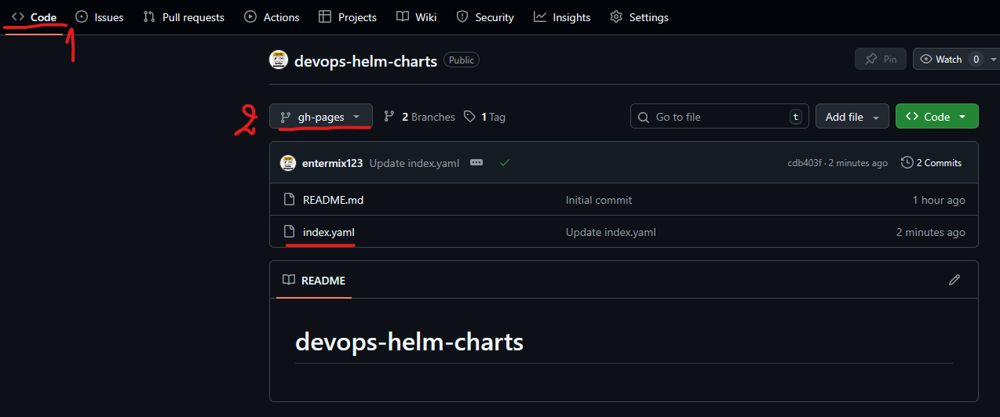
<br>
<br>

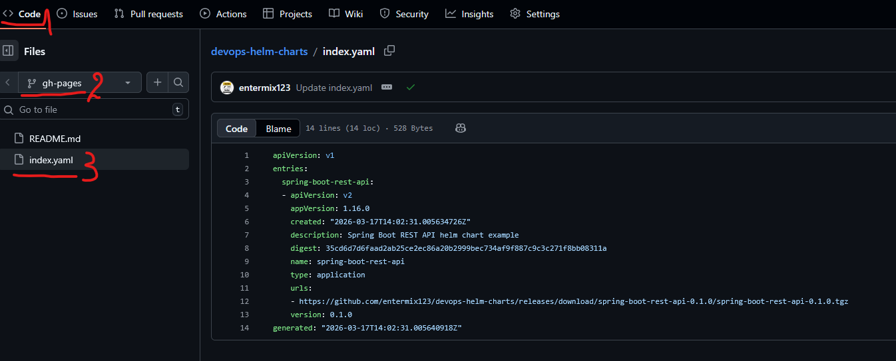      
<br>
<br>

Now we can use this Helm repository.

Stert new minikube  cluster 

    CMD --> minikube start --cpus 4 --memory 8192 --driver docker

Install HAProxy

    CMD --> helm upgrade --install my-haproxy kubernetes-ingress --repo https://haproxytech.github.io/helm-charts --namespace haproxy --create-namespace --set controller.service.type=LoadBalancer

    # result:
    Release "my-haproxy" does not exist. Installing it now.
    NAME: my-haproxy
    LAST DEPLOYED: Tue Mar 17 16:20:35 2026
    NAMESPACE: haproxy
    STATUS: deployed
    REVISION: 1
    DESCRIPTION: Install complete
    TEST SUITE: None
    NOTES:
    HAProxy Kubernetes Ingress Controller has been successfully installed.

    Controller image deployed is: "docker.io/haproxytech/kubernetes-ingress:3.2.6".
    Your controller is of a "Deployment" kind. Your controller service is running as a "LoadBalancer" type.
    RBAC authorization is enabled.
    Controller ingress.class is set to "haproxy" so make sure to use same annotation for
    Ingress resource.

    Service ports mapped are:
    - name: admin
        containerPort: 6060
        protocol: TCP
    - name: http
        containerPort: 8080
        protocol: TCP
    - name: https
        containerPort: 8443
        protocol: TCP
    - name: stat
        containerPort: 1024
        protocol: TCP
    - name: quic
        containerPort: 8443
        protocol: UDP

    Node IP can be found with:
    $ kubectl --namespace haproxy get nodes -o jsonpath="{.items[0].status.addresses[1].address}"

    The following ingress resource routes traffic to pods that match the following:
    * service name: web
    * client's Host header: webdemo.com
    * path begins with /

    ---
    apiVersion: networking.k8s.io/v1
    kind: Ingress
    metadata:
        name: web-ingress
        namespace: default
        annotations:
        ingress.class: "haproxy"
    spec:
        rules:
        - host: webdemo.com
        http:
            paths:
            - path: /
            backend:
                serviceName: web
                servicePort: 80

    In case that you are using multi-ingress controller environment, make sure to use ingress.class annotation and match it
    with helm chart option controller.ingressClass.

    For more examples and up to date documentation, please visit:
    * Helm chart documentation: https://github.com/haproxytech/helm-charts/tree/main/kubernetes-ingress
    * Controller documentation: https://www.haproxy.com/documentation/kubernetes/latest/
    * Annotation reference: https://github.com/haproxytech/kubernetes-ingress/tree/master/documentation
    * Image parameters reference: https://github.com/haproxytech/kubernetes-ingress/blob/master/documentation/controller.md

Now I will run the Helm blue again. But this time, I will use GitHub as a Helm repository rather than ChartMuseum.

    helm-spring-boot-rest-api-03 CMD --> helm upgrade --install helm-blue-github spring-boot-rest-api --repo https://entermix123.github.io/devops-helm-charts/ --namespace devops --create-namespace --version 0.1.0 --values values.yml --values values-dev.yml

    # result:
    Release "helm-blue-github" does not exist. Installing it now.
    NAME: helm-blue-github
    LAST DEPLOYED: Tue Mar 17 16:13:48 2026
    NAMESPACE: devops
    STATUS: deployed
    REVISION: 1
    DESCRIPTION: Install complete
    NOTES:
    1. Get the application URL by running these commands:
    http://api.devops.local/devops/blue


Wait few minutes for the pod to be running

    CMD --> kubectl get pods -n devops

    # result:
    NAME                                                     READY   STATUS    RESTARTS   AGE
    helm-blue-github-spring-boot-rest-api-797dcc97f7-m9nlc   1/1     Running   0          97s

Ensure minikube tunnel is running

    CMD --> minikube tunnel

Try Postman request

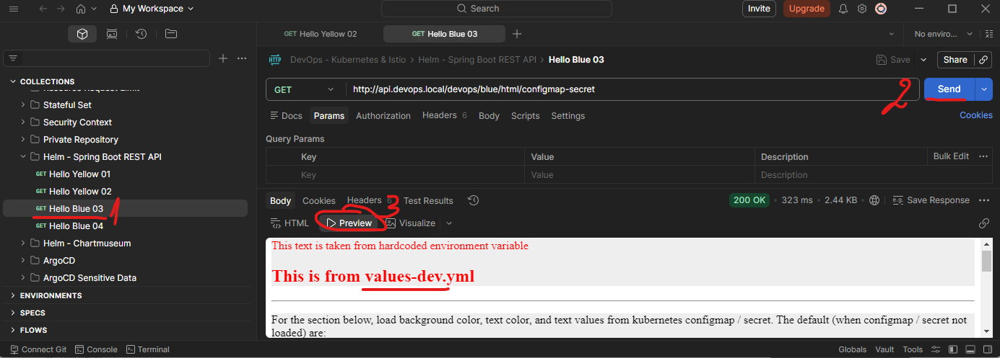   
<br>
<br>

Don't forget to clean up the cluster by deleting any deployments so we can start fresh for the next lesson.

    CMD --> minikube delete

[⬆ Back to top](#top)


## 62 Multiple Helm Charts

[⬆ Back to top](#top)

Sometimes we need multiple applications or multiple Helm charts as a single unit. For example, for system S, we might need an application X helm chart, an application Y helm chart, and Redis for caching. All three must exist for system S to run. This characteristic means that system S depends on X, Y, and Redis. And the system S itself must run on Kubernetes, using Helm. We can achieve this by creating a chart for system S. But the S helm chart itself does not contain a Kubernetes object. Instead, it contains dependencies for X, Y, and Redis. Then the S chart will define values for all three dependencies.

As we have already learn, when creating a Helm chart, we will get several YAML files. The important file is Chart.yaml, which actually contains chart metadata. In this case, the S chart will contain only Chart.yaml, not a Kubernetes object template. So we can create Chart.yaml without using the helm command, and declare dependencies for X, Y, and redis. We later create values.yaml and override values required for chart S. Notice that the filename and extension must be Chart.yaml. 

In the folder helm-spring-rest-04, there is a subfolder 'chart-with-dependencies'. Inside, there is only Chart.yaml. In that file, we declare dependencies for two charts: our Spring Boot REST API from the previous lesson about the GitHub repository and Redis from the Bitnami repository. That's all, no other files. 

Chart.yaml

```yaml
# A Helm chart, created by helm create chart-dependencies

apiVersion: v2
name: my-devops-chart
type: application
version: 2.0.0
appVersion: 2.0.0

# declare dependencies here
dependencies:
  - name: spring-boot-rest-api
    version: 0.1.0
    repository: https://entermix123.github.io/devops-helm-charts/
  - name: redis
    version: 24.1.0
    repository: https://charts.bitnami.com/bitnami
```

In the spring-rest-04 folder itself, there are the files values.yaml and values-dev.yaml. Both contain values to be injected into Spring Rest and Redis charts. But the structure is different. Now we have a root element: spring-boot-rest-api, which indicates the key below is for injection into the Spring REST API chart. As well as on Redis. To inject values into Redis, we need to put the Redis keys under the root key named redis, which indicates the chart dependency. 

values.yml

```yaml
spring-boot-rest-api:                       # root element
  image:
    repository: timpamungkas/devops-blue
    tag: 2.0.0

  applicationPort: 8111

  actuatorPort: 8111

  prometheusPath: /devops/blue/actuator/prometheus

  health:
    liveness:
      port: 8111
      path: /devops/blue/actuator/health/liveness
    readiness:
      port: 8111
      path: /devops/blue/actuator/health/readiness

  extraVolumeMounts: |
    - name: upload-image-empty-dir
      mountPath: /upload/image
    - name: upload-doc-empty-dir
      mountPath: /upload/doc

  extraVolumes: |
    - name: upload-image-empty-dir
      emptyDir: {}
    - name: upload-doc-empty-dir
      emptyDir: {}

  service:
    type: ClusterIP
    port: 80

  httpRoute:
    enabled: false

  ingress:
    enabled: true
    className: haproxy
    hosts:
    - host: api.devops.local
      paths:
      - path: /devops/blue
        pathType: Prefix
```

values-dev.yml

```yaml
spring-boot-rest-api:                       # root element
  autoscaling:
    enabled: false
  ingress:
    annotations: 
      haproxy.org/rate-limit-period: 1m
      haproxy.org/rate-limit-requests: "10"
      haproxy.org/rate-limit-status-code: "429"

redis:                                      # root element
  replica:
    replicaCount: 1
    autoscaling:
      enabled: false
```

To run this chart with dependencies, open a terminal and go to the folder helm spring rest api 4, subfolder chart with dependencies. As usual, you can copy and paste the command from the last lesson of the course. Run this command to update the dependencies.

This command will download the requireddependencies.

    helm-spring-boot-rest-api-04\chart-with-dependencies CMD --> helm dependency update

    # result:
    Getting updates for unmanaged Helm repositories...
    ...Successfully got an update from the "https://entermix123.github.io/devops-helm-charts/" chart repository
    ...Successfully got an update from the "https://charts.bitnami.com/bitnami" chart repository
    Hang tight while we grab the latest from your chart repositories...
    ...Successfully got an update from the "chartmuseum" chart repository
    ...Successfully got an update from the "harbor" chart repository
    ...Successfully got an update from the "haproxytech" chart repository
    Update Complete. ⎈Happy Helming!⎈
    Saving 2 charts
    Downloading spring-boot-rest-api from repo https://entermix123.github.io/devops-helm-charts/
    Downloading redis from repo https://charts.bitnami.com/bitnami
    Pulled: registry-1.docker.io/bitnamicharts/redis:24.1.0
    Digest: sha256:cba710f5ad93734be123a40f877ee805dd0e952c01afd19fb93ad1256754b599
    Deleting outdated charts


Start fresh minikube cluster

    CMD --> minikube start --cpus 4 --memory 8192 --driver docker

Install HAProxy

    CMD --> helm upgrade --install my-haproxy kubernetes-ingress --repo https://haproxytech.github.io/helm-charts --namespace haproxy --create-namespace --set controller.service.type=LoadBalancer

    # result:
    Release "my-haproxy" does not exist. Installing it now.
    NAME: my-haproxy
    LAST DEPLOYED: Tue Mar 17 10:06:27 2026
    NAMESPACE: haproxy
    STATUS: deployed
    REVISION: 1
    DESCRIPTION: Install complete
    TEST SUITE: None
    NOTES:
    HAProxy Kubernetes Ingress Controller has been successfully installed.

    Controller image deployed is: "docker.io/haproxytech/kubernetes-ingress:3.2.6".
    Your controller is of a "Deployment" kind. Your controller service is running as a "LoadBalancer" type.
    RBAC authorization is enabled.
    Controller ingress.class is set to "haproxy" so make sure to use same annotation for
    Ingress resource.

    Service ports mapped are:
    - name: admin
        containerPort: 6060
        protocol: TCP
    - name: http
        containerPort: 8080
        protocol: TCP
    - name: https
        containerPort: 8443
        protocol: TCP
    - name: stat
        containerPort: 1024
        protocol: TCP
    - name: quic
        containerPort: 8443
        protocol: UDP

    Node IP can be found with:
    $ kubectl --namespace haproxy get nodes -o jsonpath="{.items[0].status.addresses[1].address}"

    The following ingress resource routes traffic to pods that match the following:
    * service name: web
    * client's Host header: webdemo.com
    * path begins with /

    ---
    apiVersion: networking.k8s.io/v1
    kind: Ingress
    metadata:
        name: web-ingress
        namespace: default
        annotations:
        ingress.class: "haproxy"
    spec:
        rules:
        - host: webdemo.com
        http:
            paths:
            - path: /
            backend:
                serviceName: web
                servicePort: 80

    In case that you are using multi-ingress controller environment, make sure to use ingress.class annotation and match it
    with helm chart option controller.ingressClass.

    For more examples and up to date documentation, please visit:
    * Helm chart documentation: https://github.com/haproxytech/helm-charts/tree/main/kubernetes-ingress
    * Controller documentation: https://www.haproxy.com/documentation/kubernetes/latest/
    * Annotation reference: https://github.com/haproxytech/kubernetes-ingress/tree/master/documentation
    * Image parameters reference: https://github.com/haproxytech/kubernetes-ingress/blob/master/documentation/controller.md

Go to the folder that contains values.yml; in this case, one folder up. Then install the chart with dependencies. For the release, name it Helm Blue 04.

    helm-spring-boot-rest-api-04 CMD --> helm upgrade --install helm-blue-04 chart-with-dependencies --namespace devops --create-namespace --values values.yml --values values-dev.yml

    # result:
    Release "helm-blue-04" does not exist. Installing it now.
    level=INFO msg="warning: cannot overwrite table with non table for my-devops-chart.spring-boot-rest-api.extraVolumes (map[])"
    NAME: helm-blue-04
    LAST DEPLOYED: Tue Mar 17 16:48:26 2026
    NAMESPACE: devops
    STATUS: deployed
    REVISION: 1
    DESCRIPTION: Install complete

If we check the pods, there will be a Spring Boot pod and a Redis pod. The value for pods will be taken from values.yml and values-dev.yml.

    CMD --> kubectl get pods -n devops

    # result:
    NAME                                                 READY   STATUS    RESTARTS   AGE
    helm-blue-04-redis-master-0                          1/1     Running   0          98s
    helm-blue-04-redis-replicas-0                        1/1     Running   0          98s
    helm-blue-04-spring-boot-rest-api-6764f54549-82bpx   1/1     Running   0          98s

Don't forget to clean up the cluster by deleting any deploymentsso we can start fresh for the next lesson.

    CMD --> minikube delete

[⬆ Back to top](#top)