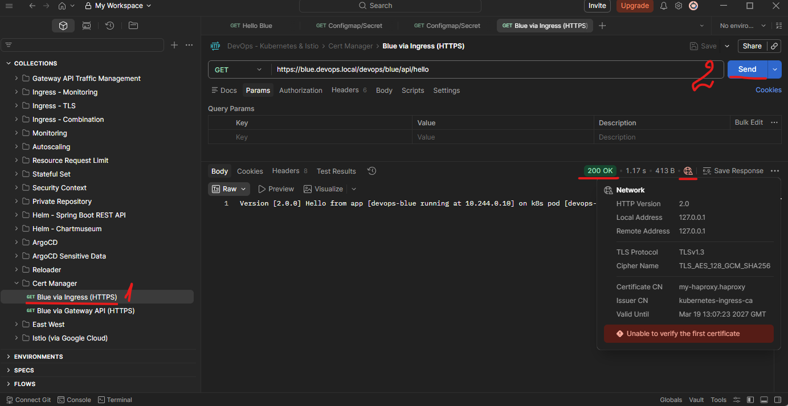

# Section 19 Managing Certificates on Kubernetes

## Content
- 72 [Cert Manager](#72-cert-manager)

Delete the previous minikube and start fresh Minikube cluster

    bash --> minikube delete
    bash --> minikube start --cpus 4 --memory 8192 --driver docker

List contexts

    bash --> kubectl config get-contexts

Set minikube contexts

    bash --> kubectl config use-context minikube

Start minikube tunnel and don't close the terminal

    bash --> minikube tunnel

Make sure that address are added to Windows host list
- Open PowerShell as Admin

        PowerShell --> notepad C:\Windows\System32\drivers\etc\hosts

- add 
```text
127.0.0.1 localhost                     
127.0.0.1 blue.devops.local
127.0.0.1 yellow.devops.local           
127.0.0.1 api.devops.local          # required
127.0.0.1 monitoring.devops.local
127.0.0.1 rabbitmq.devops.local
127.0.0.1 chartmuseum.local
127.0.0.1 harbor.local 
127.0.0.1 argocd.local
```
- save the file and exit


<br>
<br>


## 72 Cert Manager

[⬆ Back to top](#top)

HTTP communication can be secured using a TLS certificate, which is usually indicated by the protocol using HTTPS instead of HTTP. In Kubernetes, we can use cert-manager to add certificates and certificate issuers to Kubernetes clusters. Cert Manager also simplifies the process of obtaining, renewing, and using those certificates. Cert manager can issue certificates from various sources, such as Let's Encrypt. It will ensure certificates are valid and up to date, and attempt to renew certificates before they expire. 

In a local cluster, this does not have many effects, As a local cluster does not go anywhere through the internet. Even if we use cloud Kubernetes, the certificate must still be validated, and our Kubernetes cluster must have a registered domain name. So in this lesson, We will learn the basics of cert manager. However, the issued certificate will be fake. We can still use HTTPS, but since the certificate is fake, we will get a warning. 

Installing cert-manager can be done using Helm. As usual, the installation script is available in the last lesson of this course, in the Resources & References section. 

### Install Cert Manager

    CMD --> helm upgrade --install cert-manager cert-manager --repo https://charts.jetstack.io --namespace cert-manager --create-namespace --set crds.enabled="true"

    # result:
    Release "cert-manager" does not exist. Installing it now.
    NAME: cert-manager
    LAST DEPLOYED: Thu Mar 19 14:37:03 2026
    NAMESPACE: cert-manager
    STATUS: deployed
    REVISION: 1
    DESCRIPTION: Install complete
    TEST SUITE: None
    NOTES:
    cert-manager v1.20.0 has been deployed successfully!

    In order to begin issuing certificates, you will need to set up a ClusterIssuer
    or Issuer resource (for example, by creating a 'letsencrypt-staging' issuer).

    More information on the different types of issuers and how to configure them
    can be found in our documentation:

    https://cert-manager.io/docs/configuration/

    For information on how to configure cert-manager to automatically provision
    Certificates for Ingress resources, take a look at the `ingress-shim`
    documentation:

    https://cert-manager.io/docs/usage/ingress/

    For information on how to configure cert-manager to automatically provision
    Certificates for Gateway API resources, take a look at the `gateway resource`
    documentation:

    https://cert-manager.io/docs/usage/gateway/

Cert manager provides several CRD. 
- Issuer defines how cert-manager will request TLS certificates, Specific to a particular namespace in Kubernetes. This means we need to ensure that the Issuer is created in the same namespace as the certificates we want to create. 
- Cert manager also provides ClusterIssuer, which is meant to be a cluster-wide version of an issuer, which means only one setup for the entire namespace. 
- The third CRD is called a certificate to specify the details of the TLS we want to request. The certificate will refer to an issuer to define how they will be issued. 

Cert manager allows usage of ACME, or Automated Certificate Management Environment protocol (ACME). It is a protocol for automating the issuance and renewal of certificates, without human interaction. ACME protocol is free to use and requires very little time to configure, making it a usable component of security. In this lesson, we will use the ACME protocol provided by Let's Encrypt. 

Before starting, please ensure you already installed an ingress controller or a gateway API. We will see the configuration for both.

Please install HAProxy ingress controller or Nginx Gateway Fabric as needed.

### Ingress Setup - HAProxy Ingress controller

#### Install Ingress HAProxy controller with Helm

    CMD --> helm upgrade --install my-haproxy kubernetes-ingress --repo https://haproxytech.github.io/helm-charts --namespace haproxy --create-namespace --set controller.service.type=LoadBalancer

    # result:
    Release "my-haproxy" does not exist. Installing it now.
    NAME: my-haproxy
    LAST DEPLOYED: Thu Mar 19 14:53:51 2026
    NAMESPACE: haproxy
    STATUS: deployed
    REVISION: 1
    DESCRIPTION: Install complete
    TEST SUITE: None
    NOTES:
    HAProxy Kubernetes Ingress Controller has been successfully installed.

    Controller image deployed is: "docker.io/haproxytech/kubernetes-ingress:3.2.6".
    Your controller is of a "Deployment" kind. Your controller service is running as a "LoadBalancer" type.
    RBAC authorization is enabled.
    Controller ingress.class is set to "haproxy" so make sure to use same annotation for
    Ingress resource.

    Service ports mapped are:
    - name: admin
        containerPort: 6060
        protocol: TCP
    - name: http
        containerPort: 8080
        protocol: TCP
    - name: https
        containerPort: 8443
        protocol: TCP
    - name: stat
        containerPort: 1024
        protocol: TCP
    - name: quic
        containerPort: 8443
        protocol: UDP

    Node IP can be found with:
    $ kubectl --namespace haproxy get nodes -o jsonpath="{.items[0].status.addresses[1].address}"

    The following ingress resource routes traffic to pods that match the following:
    * service name: web
    * client's Host header: webdemo.com
    * path begins with /

    ---
    apiVersion: networking.k8s.io/v1
    kind: Ingress
    metadata:
        name: web-ingress
        namespace: default
        annotations:
        ingress.class: "haproxy"
    spec:
        rules:
        - host: webdemo.com
        http:
            paths:
            - path: /
            backend:
                serviceName: web
                servicePort: 80

    In case that you are using multi-ingress controller environment, make sure to use ingress.class annotation and match it
    with helm chart option controller.ingressClass.

    For more examples and up to date documentation, please visit:
    * Helm chart documentation: https://github.com/haproxytech/helm-charts/tree/main/kubernetes-ingress
    * Controller documentation: https://www.haproxy.com/documentation/kubernetes/latest/
    * Annotation reference: https://github.com/haproxytech/kubernetes-ingress/tree/master/documentation
    * Image parameters reference: https://github.com/haproxytech/kubernetes-ingress/blob/master/documentation/controller.md

Ensure HAProxy pods are running

    CMD --> kubectl get pods -n haproxy

    # result:
    NAME                                            READY   STATUS    RESTARTS   AGE
    my-haproxy-kubernetes-ingress-86b7bd887-bh7nb   1/1     Running   0          3m17s
    my-haproxy-kubernetes-ingress-86b7bd887-rc7ft   1/1     Running   0          3m17s

See the cert-manager folder in the course resources, and the devops-cert-manager-ingress-issuer.yml file for the ingress. Here, we define two cluster issuers. One is for a non-production, or staging environment. The other one is for the production environment. They have a similar structure, just with different server URLs —the ACME server. The one we will use here is staging, although we create a production environment cluster issuer to see the difference.

devops-cert-manager-ingress-issuer.yml

```yaml
# Non-production (staging) certificate

apiVersion: cert-manager.io/v1
kind: ClusterIssuer
metadata:
  name: letsencrypt-staging
spec:
  acme:
    server: https://acme-staging-v02.api.letsencrypt.org/directory
    # Update with your own email
    email: admin@timpamungkas.com
    privateKeySecretRef:
      name: letsencrypt-staging
    solvers:
    - http01:
        ingress:
          class:  haproxy

---

# Production certificate

apiVersion: cert-manager.io/v1
kind: ClusterIssuer
metadata:
  name: letsencrypt-prod
spec:
  acme:
    server: https://acme-v02.api.letsencrypt.org/directory
    # Update with your own email
    email: admin@timpamungkas.com
    privateKeySecretRef:
      name: letsencrypt-prod
    solvers:
    - http01:
        ingress:
          class:  haproxy
```

Apply this configuration file. 

    CMD --> kubectl apply -f devops-cert-manager-ingress-issuer.yml

    # result:
    clusterissuer.cert-manager.io/letsencrypt-staging created
    clusterissuer.cert-manager.io/letsencrypt-prod created

And we will get two cluster issuers.

    CMD --> kubectl get clusterissuer

    # result:
    NAME                  READY   AGE
    letsencrypt-prod      True    69s
    letsencrypt-staging   True    69s

We will install the certificate on the ingress. Let's deploy the sample application. This is just a sample application from previous lessons, where we deploy the Blue DevOps Docker and create a cluster IP service. Nothing new here. 

    cert-manager CMD --> kubectl apply -f devops-cert-manager-deployment.yml

    # result:
    namespace/devops created
    deployment.apps/devops-blue-deployment created
    service/devops-blue-clusterip created

Then, see the ingress rule. We will use cert-manager on the ingress. To do that, we need to add an annotation to the ingress configuration using the cluster issuer we created. Also, define a TLS section on the ingress. Cert-manager will manage this certificate, so we don't need to create the certificate manually.

devops-cert-manager-ingress.yml

```yaml
apiVersion: networking.k8s.io/v1
kind: Ingress
metadata:
  namespace: devops
  name: ingress-devops-blue
  labels:
    app.kubernetes.io/name: devops-blue
  annotations:
    cert-manager.io/cluster-issuer: letsencrypt-staging             # annotation
spec:
  ingressClassName: haproxy
  rules:
  - host: blue.devops.local
    http:
      paths:
      - path: /devops/blue
        pathType: Prefix
        backend:
          service:
            name: devops-blue-clusterip
            port:
              number: 8111
  tls:
    - hosts:
      - blue.devops.local
      secretName: my-devops-blue-cert
```

Apply this file.

    CMD --> kubectl apply -f devops-cert-manager-ingress.yml

    # result: ingress.networking.k8s.io/ingress-devops-blue created

And see that we now have one certificate.

    CMD --> kubectl get certificate -n devops

    # result:
    NAME                  READY   SECRET                AGE
    my-devops-blue-cert   False   my-devops-blue-cert   33s

But the status is not ready. Describe it. Then we will see an error message indicating that the domain is not accessible. 

    CMD --> kubectl describe certificate my-devops-blue-cert -n devops

    # result:
    ...
    Events:
    Type     Reason     Age   From                                       Message
    ----     ------     ----  ----                                       -------
    Normal   Issuing    86s   cert-manager-certificates-trigger          Issuing certificate as Secret does not exist
    Normal   Generated  86s   cert-manager-certificates-key-manager      Stored new private key in temporary Secret resource "my-devops-blue-cert-pptk2"
    Normal   Requested  86s   cert-manager-certificates-request-manager  Created new CertificateRequest resource "my-devops-blue-cert-1"
    Warning  Failed     84s   cert-manager-certificates-issuing          The certificate request has failed to complete and will be retried: Failed to wait for order resource "my-devops-blue-cert-1-1973114838" to become ready: order is in "errored" state: Failed to create Order: 400 urn:ietf:params:acme:error:rejectedIdentifier: Invalid identifiers requested :: Cannot issue for "blue.devops.local": Domain name does not end with a valid public suffix (TLD)

This error occurred because we use a local cluster that is not reachable from the internet. Behind the scenes, the ACME server (in this case, Let's Encrypt) needs to verify that we indeed own the domain. The cert manager will install a validation token, validate it, and expose it on the registered domain. But since this is a local domain that is not accessible from the internet, the validation process failed. Nevertheless, the certificate was still issued.

When we check the ingress, there will be a certificate issue event.

    CMD --> kubectl get ingress -n devops

    # result:
    NAME                  CLASS     HOSTS               ADDRESS   PORTS     AGE
    ingress-devops-blue   haproxy   blue.devops.local             80, 443   3m15s

    CMD --> kubectl describe ingress ingress-devops-blue -n devops

    # result:
    ...
    Events:
    Type    Reason             Age    From                       Message
    ----    ------             ----   ----                       -------
    Normal  CreateCertificate  3m44s  cert-manager-ingress-shim  Successfully created Certificate "my-devops-blue-cert"

Ensure minikube tunnel is up

    CMD --> minikube tunnel

We can now access the URL with HTTPS. Open Postman and access it. Ignore the warning. This warning happened because we use fake certificates on the local cluster. 


<br>
<br>


### Gateway API Setup

Now, let's see the cert manager configuration for the gateway API.

Create a fresh minikube cluster and install the gateway API to avoid conflicts with the ingress controller. 

    CMD --> minikube delete
    CMD --> minikube start --cpus 4 --memory 8192 --driver docker

#### Install Cert Manager

    CMD --> helm upgrade --install cert-manager cert-manager --repo https://charts.jetstack.io --namespace cert-manager --create-namespace --set crds.enabled="true"

    # result:
    Release "cert-manager" does not exist. Installing it now.
    NAME: cert-manager
    LAST DEPLOYED: Thu Mar 19 14:37:03 2026
    NAMESPACE: cert-manager
    STATUS: deployed
    REVISION: 1
    DESCRIPTION: Install complete
    TEST SUITE: None
    NOTES:
    cert-manager v1.20.0 has been deployed successfully!

    In order to begin issuing certificates, you will need to set up a ClusterIssuer
    or Issuer resource (for example, by creating a 'letsencrypt-staging' issuer).

    More information on the different types of issuers and how to configure them
    can be found in our documentation:

    https://cert-manager.io/docs/configuration/

    For information on how to configure cert-manager to automatically provision
    Certificates for Ingress resources, take a look at the `ingress-shim`
    documentation:

    https://cert-manager.io/docs/usage/ingress/

    For information on how to configure cert-manager to automatically provision
    Certificates for Gateway API resources, take a look at the `gateway resource`
    documentation:

    https://cert-manager.io/docs/usage/gateway/

#### Install Gateway API CRD and Fabric controller

Install Gateway API CRD

    CMD --> kubectl kustomize https://github.com/nginx/nginx-gateway-fabric/config/crd/gateway-api/standard | kubectl apply -f -

    # result:
    customresourcedefinition.apiextensions.k8s.io/backendtlspolicies.gateway.networking.k8s.io created
    customresourcedefinition.apiextensions.k8s.io/gatewayclasses.gateway.networking.k8s.io created
    customresourcedefinition.apiextensions.k8s.io/gateways.gateway.networking.k8s.io created
    customresourcedefinition.apiextensions.k8s.io/grpcroutes.gateway.networking.k8s.io created
    customresourcedefinition.apiextensions.k8s.io/httproutes.gateway.networking.k8s.io created
    customresourcedefinition.apiextensions.k8s.io/listenersets.gateway.networking.k8s.io created
    customresourcedefinition.apiextensions.k8s.io/referencegrants.gateway.networking.k8s.io created
    customresourcedefinition.apiextensions.k8s.io/tlsroutes.gateway.networking.k8s.io created
    validatingadmissionpolicy.admissionregistration.k8s.io/safe-upgrades.gateway.networking.k8s.io created
    validatingadmissionpolicybinding.admissionregistration.k8s.io/safe-upgrades.gateway.networking.k8s.io created

Install Gateway API Fabric Controller

    CMD --> helm upgrade --install my-nginx-gateway-api oci://ghcr.io/nginx/charts/nginx-gateway-fabric --create-namespace -n nginx-gateway --set service.type=LoadBalancer

    # result:
    Release "my-nginx-gateway-api" does not exist. Installing it now.
    Pulled: ghcr.io/nginx/charts/nginx-gateway-fabric:2.4.2
    Digest: sha256:dc86ff2fad1f5f000cab6bf0d953f7a3c1347550834c41249798c670414ecc1a
    NAME: my-nginx-gateway-api
    LAST DEPLOYED: Thu Mar 19 15:59:31 2026
    NAMESPACE: nginx-gateway
    STATUS: deployed
    REVISION: 1
    DESCRIPTION: Install complete
    TEST SUITE: None

First, apply the deployment objects.

    CMD --> kubectl apply -f devops-cert-manager-deployment.yml

    # result:
    namespace/devops created
    deployment.apps/devops-blue-deployment created
    service/devops-blue-clusterip created

In the cert-manager folder, there are files for the gateway API - devops-cert-manager-gateway-api-issuer.yml. Here, we define several Kubernetes resources related to TLS certificates. First, we define a self-signed certificate ClusterIssuer. As the name suggests, this creates self-signed certificates. Self-signed certificates are needed for .local domains because they are not publicly routable—Certificate Authorities like Let's Encrypt cannot reach .local addresses to perform domain validation. Then we have a Certificate object which uses the self-signed ClusterIssuer. The issued certificate will be stored in the secret named 'api-devops-local-cert'. However, for non-local domains, the following staging and production issuers can be used: The letsencrypt-staging ClusterIssuer uses Let's Encrypt's staging server for testing. It issues untrusted certificates suitable for development. The letsencrypt-prod ClusterIssuer uses Let's Encrypt's production server and issues publicly trusted certificates for real environments. Both use HTTP-01 challenges via the devops-gateway for domain validation. Note that HTTP-01 challenges require publicly accessible domains, which is why they cannot be used for .local domains. Let's Encrypt's servers cannot reach internal .local addresses to complete the validation.

devops-cert-manager-gateway-api-issuer.yml

```yaml
apiVersion: cert-manager.io/v1
kind: ClusterIssuer
metadata:
  name: selfsigned-issuer                   # cluster issuer self signed certificate
spec:
  selfSigned: {}

---

apiVersion: cert-manager.io/v1
kind: Certificate                           # certificate object
metadata:
  name: api-devops-local-cert
  namespace: devops
spec:
  secretName: api-devops-local-cert
  issuerRef:
    name: selfsigned-issuer
    kind: ClusterIssuer
  dnsNames:
  - api.devops.local

---

# Non-production (staging) certificate
apiVersion: cert-manager.io/v1
kind: ClusterIssuer
metadata:
  name: letsencrypt-staging
spec:
  acme:
    server: https://acme-staging-v02.api.letsencrypt.org/directory
    email: admin@timpamungkas.com
    privateKeySecretRef:
      name: letsencrypt-staging
    solvers:
    - http01:
        gatewayHTTPRoute:
          parentRefs:
          - name: devops-gateway
            namespace: devops
            kind: Gateway

---

# Production certificate
apiVersion: cert-manager.io/v1
kind: ClusterIssuer
metadata:
  name: letsencrypt-prod
spec:
  acme:
    server: https://acme-v02.api.letsencrypt.org/directory
    email: admin@timpamungkas.com
    privateKeySecretRef:
      name: letsencrypt-prod
    solvers:
    - http01:
        gatewayHTTPRoute:
          parentRefs:
          - name: devops-gateway
            namespace: devops
            kind: Gateway
```

Apply this file

    CMD -> kubectl apply -f devops-cert-manager-gateway-api-issuer.yml

    # result:
    clusterissuer.cert-manager.io/selfsigned-issuer created
    certificate.cert-manager.io/api-devops-local-cert created
    clusterissuer.cert-manager.io/letsencrypt-staging created
    clusterissuer.cert-manager.io/letsencrypt-prod created

devops-cert-manager-gateway-api.yml configuration file is for the gateway API objects. In this file, we create the gateway named devops-gateway that listens on HTTPS port 443 for the hostname 'api.devops.local'. In the earlier lesson in the course, we manually generated the TLS self-signed certificate for 'api.devops.local'. We still use the certificate reference when creating the gateway object. However, this time we will use cert-manager to issue a self-signed certificate instead of manually creating the TLS secret. We also define a single HTTP route for the DevOps Blue application, with the hostname 'api.devops.local'. For the HTTP route, nothing special related to cert manager.

devops-cert-manager-gateway-api.yml

```yaml
apiVersion: v1
kind: Namespace
metadata:
  name: devops

---

apiVersion: gateway.networking.k8s.io/v1
kind: Gateway
metadata:
  name: devops-gateway
  namespace: devops
spec:
  gatewayClassName: nginx
  listeners:
  - name: https
    port: 443
    protocol: HTTPS
    hostname: api.devops.local
    tls:
      mode: Terminate
      certificateRefs:
      - kind: Secret
        name: api-devops-local-cert
    allowedRoutes:
      namespaces:
        from: Same

---

apiVersion: gateway.networking.k8s.io/v1
kind: HTTPRoute
metadata:
  name: devops-api-hostname-route
  namespace: devops
spec:
  parentRefs:
  - name: devops-gateway
  hostnames:
  - api.devops.local
  rules:
  - matches:
    - path:
        type: PathPrefix
        value: /devops/blue
    backendRefs:
    - name: devops-blue-clusterip
      port: 8111
    timeouts:
      request: 8s
```

Apply this file.

    CMD --> kubectl apply -f devops-cert-manager-gateway-api.yml

    # result:
    namespace/devops unchanged
    gateway.gateway.networking.k8s.io/devops-gateway created
    httproute.gateway.networking.k8s.io/devops-api-hostname-route created

If we see the secret, there will be a TLS secret named 'api-devops-local-cert', which will be used by the gateway API. 

    CMD --> kubectl get secret -n devops

    # result:
    NAME                             TYPE                DATA   AGE
    api-devops-local-cert            kubernetes.io/tls   3      3m58s         # target secret
    devops-gateway-nginx-agent-tls   kubernetes.io/tls   3      47s

Make sure minikube tunnel is up

    CMD --> minikube tunnel

If we access the blue application through the Gateway API over HTTPS, it works as expected.


<br>
<br>

[⬆ Back to top](#top)

