# Section 20 Istio Service Mesh for East-West Traffic

## Content

- 73 [East-West Traffic](#73-east-west-traffic)
- 74 [Google Kubernetes Engine (GKE)](#74-google-kubernetes-engine-gke)
- 75 [Tip: Resource Request](#75-tip-resource-request)
- 76 [Observability & Control](#76-observability--control)
- [FULL SETUP - Start high resource minikube container](#start-high-resource-minikube-container)
- 77 [Install Kube Prometheus](#77-install-kube-prometheus)
- 78 [Install Ingress Controller](#78-install-ingress-controller)
- 79 [Istio Service Mesh](#79-istio-service-mesh)
- 80 [Install Istio](#80-install-istio)
- 81 [Check Prometheus](#81-check-prometheus)

Delete the previous minikube and start fresh Minikube cluster

    bash --> minikube delete
    bash --> minikube start --cpus 4 --memory 8192 --driver docker

List contexts

    bash --> kubectl config get-contexts

Set minikube contexts

    bash --> kubectl config use-context minikube

Start minikube tunnel and don't close the terminal

    bash --> minikube tunnel

Make sure that address are added to Windows host list

- Open PowerShell as Admin

        PowerShell --> notepad C:\Windows\System32\drivers\etc\hosts

- add

```text
127.0.0.1 localhost                     # required
127.0.0.1 blue.devops.local
127.0.0.1 yellow.devops.local           
127.0.0.1 api.devops.local
127.0.0.1 monitoring.devops.local
127.0.0.1 rabbitmq.devops.local
127.0.0.1 chartmuseum.local
127.0.0.1 harbor.local 
127.0.0.1 argocd.local
```

- save the file and exit


<br>
<br>

## 73 East-West Traffic

[⬆ Back to top](#top)

We have already seen this traffic flow, where the client calls the service through the ingress controller (or gateway API), which is served by a pod, and the response is returned to the client. Add a compass picture, and we will see traffic flow in the north-south direction. Hence, traffic between the client outside the cluster and the Kubernetes cluster is called north-south traffic.

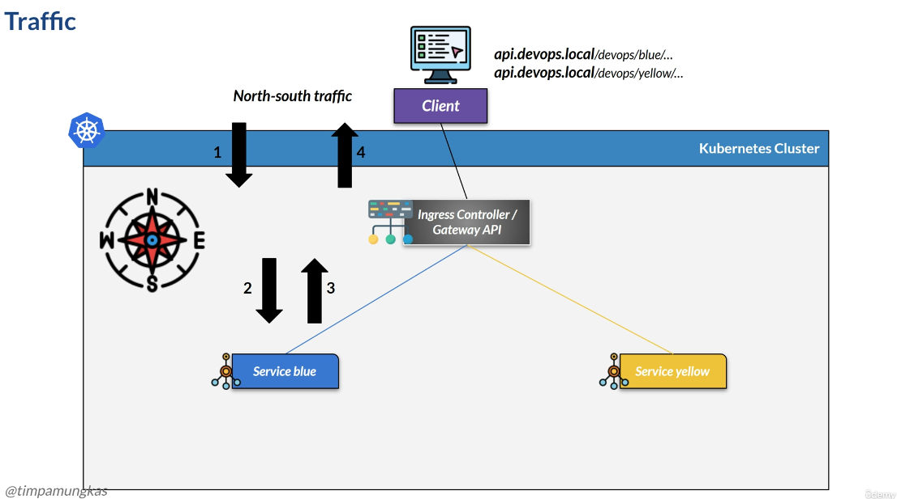
<br>
<br>

Sometimes, a service needs to call another service. For example, the client accesses the Blue service, then the Blue service needs to call the API on the Yellow service. This traffic can be handled by treating the blue service as a client that calls the yellow service via ingress. 

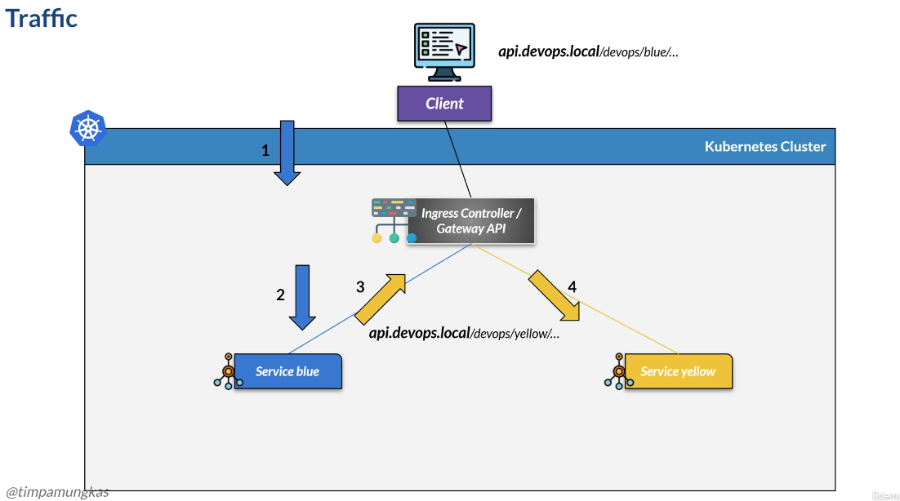
<br>
<br>

Then the response was returned using the same path. 

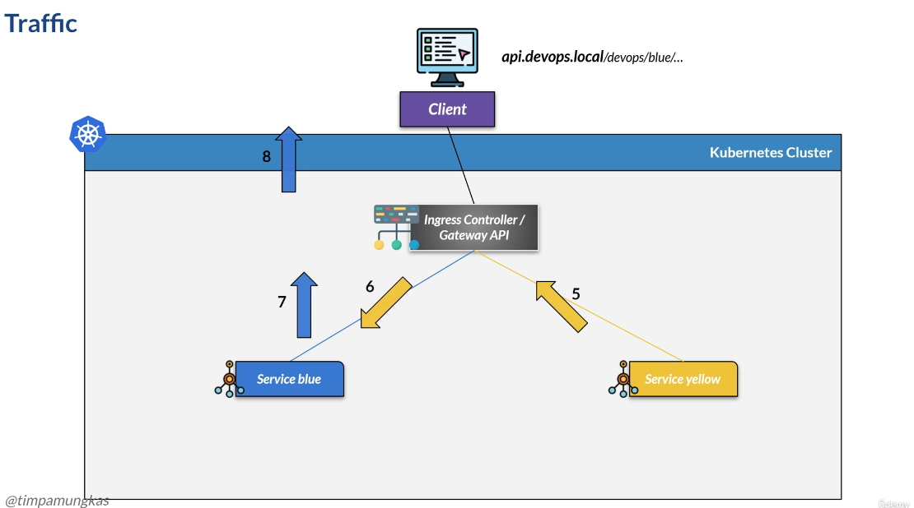
<br>
<br>

But there is another way, since both blue and yellow are on the same Kubernetes cluster. Instead of using ingress for blue service calls, blue can call yellow service directly. 

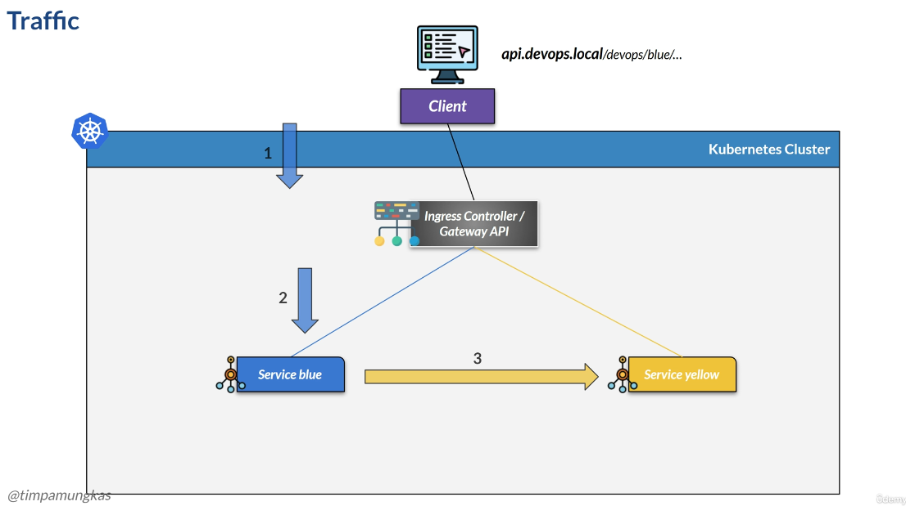
<br>
<br>

And the response will be returned later via the same path. 


<br>
<br>

Add another compass picture, and this service-to-service call flows east-west. Hence, the name 'east-west traffic'. 

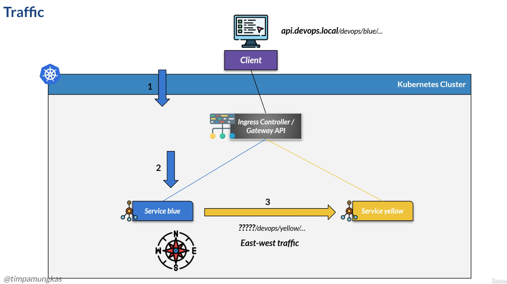
<br>
<br>

The question is: during the call, what is the yellow address to call?

Let's focus on both services. We already know that Kubernetes automatically assigns an internal IP address to each service. In addition to IP addresses, Kubernetes also automatically assigns a local domain name for each service. Each service will automatically have a domain name in the format service-name.namespace.svc.cluster.local.

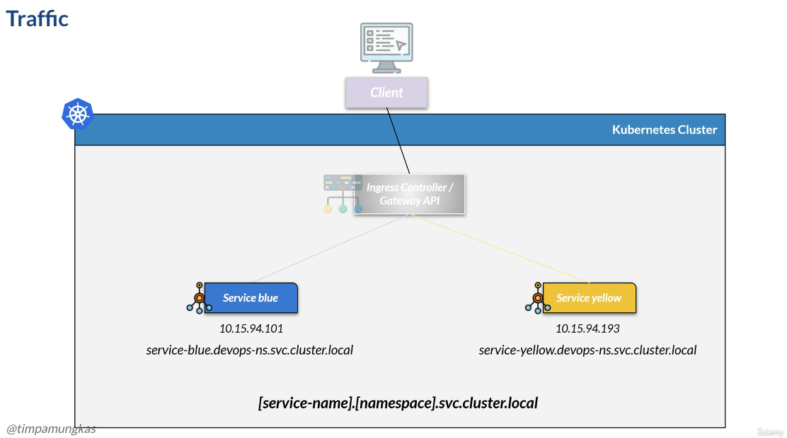
<br>
<br>

In this lesson, we will have three services: blue, yellow, and white. The main entry (the north-south) is the blue service, which we call via the ingress (or gateway API). These are the chain call examples.

- The first is just a one-level call in which blue calls yellow.

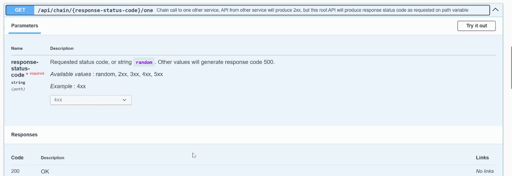
<br>
<br>

- Second, also a one-level call, but calling two different services: blue calls yellow, and blue calls white.

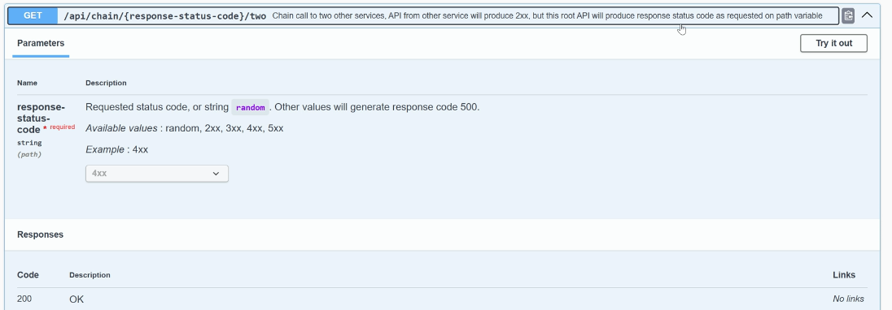
<br>
<br>

- Third is a two-level call, where blue calls yellow, and yellow calls white.

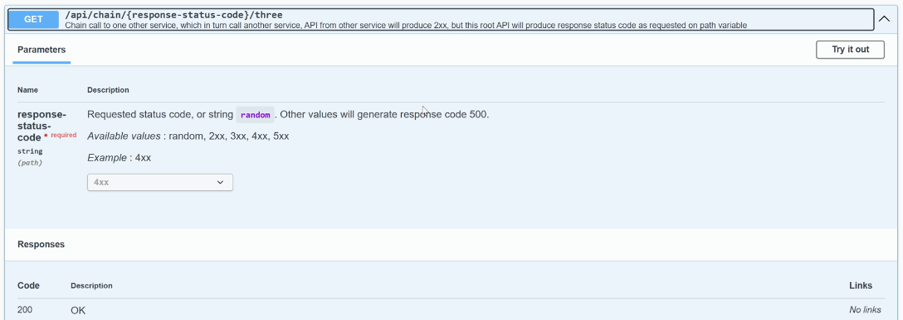
<br>
<br>

- Fourth is a one-level call. 

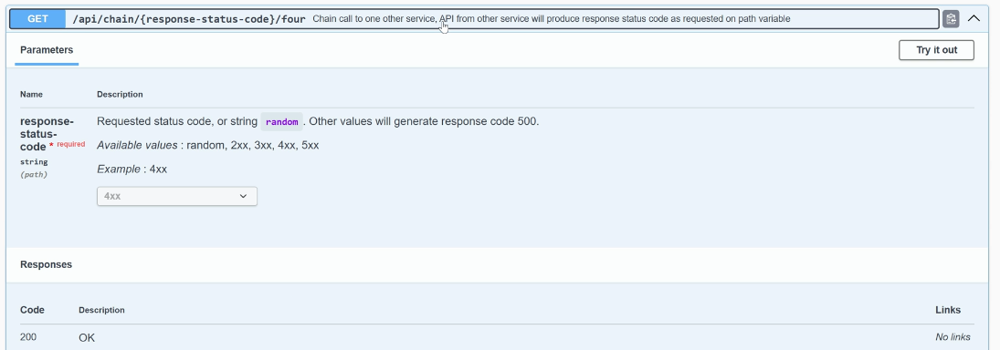
<br>
<br>

- Fifth is a two-level call.

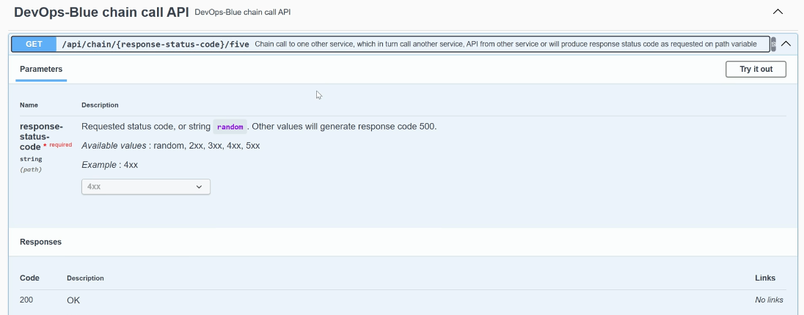
<br>
<br>

Several formats can be used to call a service from another service. We must also define the target port to be accessed. For example, if blue pod wants to access the yellow service, which is a cluster IP service with the name devops-yellow-svc, which runs on port 8112, in the namespace devops, We can use these addresses from the blue pod.

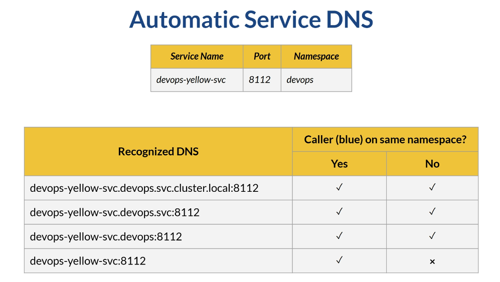
<br>
<br>

Notice that the shortest DNS path is recognized only if both the caller and the target are in the same namespace.

And this one is for white.

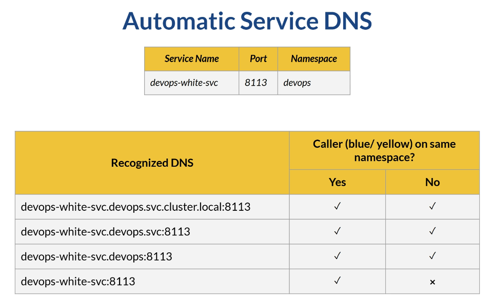
<br>
<br>

Open the east-west folder and view the devops-east-west-deployment.yml file. In the blue pod, we use an environment variable for the yellow address. This configuration will be used by the blue pod in the source code to call the yellow service. Notice that we use the yellow service name here, not the gateway API URL (or ingress, if you use one).

devops-east-west-deployment.yml

```yaml
apiVersion: v1
kind: Namespace
metadata:
  name:  devops

---

apiVersion: apps/v1
kind: Deployment
metadata:
  namespace: devops
  name: east-west-deployment-blue
  labels:
    app.kubernetes.io/name: east-west-blue
spec:
  selector:
    matchLabels:
      app.kubernetes.io/name: east-west-blue
  template:
    metadata:
      labels:
        app.kubernetes.io/name: east-west-blue
        app.kubernetes.io/version: 2.0.0
    spec:
      containers:
      - name: devops-blue
        image: timpamungkas/devops-blue:2.0.0
        resources:
          limits:
            cpu: "0.3"
            memory: 250M
        ports:
        - name:  http
          containerPort: 8111
          protocol: TCP
        readinessProbe:
          httpGet:
            path: /devops/blue/actuator/health/readiness
            port: 8111
            scheme: HTTP
          initialDelaySeconds: 60
          periodSeconds: 30
          timeoutSeconds: 5
          failureThreshold: 5
        livenessProbe:
          httpGet:
            path: /devops/blue/actuator/health/liveness
            port: 8111
            scheme: HTTP
          initialDelaySeconds: 60
          periodSeconds: 30
          timeoutSeconds: 5
          failureThreshold: 5
        env:
          - name: DEVOPS_YELLOW_URL
            # to local k8s cluster  
            value: http://devops-yellow-clusterip.devops:8112/devops/yellow
          - name: DEVOPS_WHITE_URL
            # to local k8s cluster  
            value: http://devops-white-clusterip.devops:8113/devops/white
  replicas: 1

---

apiVersion: apps/v1
kind: Deployment
metadata:
  namespace: devops
  name: east-west-deployment-yellow
  labels:
    app.kubernetes.io/name: east-west-yellow
spec:
  selector:
    matchLabels:
      app.kubernetes.io/name: east-west-yellow
  template:
    metadata:
      labels:
        app.kubernetes.io/name: east-west-yellow
        app.kubernetes.io/version: 2.0.0
    spec:
      containers:
      - name: devops-yellow
        image: timpamungkas/devops-yellow:2.0.0
        resources:
          limits:
            cpu: "0.3"
            memory: 250M
        ports:
        - name:  http
          containerPort: 8112
          protocol: TCP
        readinessProbe:
          httpGet:
            path: /devops/yellow/actuator/health/readiness
            port: 8112
            scheme: HTTP
          initialDelaySeconds: 60
          periodSeconds: 30
          timeoutSeconds: 5
          failureThreshold: 5
        livenessProbe:
          httpGet:
            path: /devops/yellow/actuator/health/liveness
            port: 8112
            scheme: HTTP
          initialDelaySeconds: 60
          periodSeconds: 30
          timeoutSeconds: 5
          failureThreshold: 5
        env:
          - name: DEVOPS_WHITE_URL
            # to local k8s cluster  
            value: http://devops-white-clusterip.devops:8113/devops/white
  replicas: 1

---

apiVersion: apps/v1
kind: Deployment
metadata:
  namespace: devops
  name: east-west-deployment-white
  labels:
    app.kubernetes.io/name: east-west-white
spec:
  selector:
    matchLabels:
      app.kubernetes.io/name: east-west-white
  template:
    metadata:
      labels:
        app.kubernetes.io/name: east-west-white
        app.kubernetes.io/version: 2.0.0
    spec:
      containers:
      - name: devops-white
        image: timpamungkas/devops-white:2.0.0
        resources:
          limits:
            cpu: "0.3"
            memory: 250M
        ports:
        - name:  http
          containerPort: 8113
          protocol: TCP
        readinessProbe:
          httpGet:
            path: /devops/white/actuator/health/readiness
            port: 8113
            scheme: HTTP
          initialDelaySeconds: 60
          periodSeconds: 30
          timeoutSeconds: 5
          failureThreshold: 5
        livenessProbe:
          httpGet:
            path: /devops/white/actuator/health/liveness
            port: 8113
            scheme: HTTP
          initialDelaySeconds: 60
          periodSeconds: 30
          timeoutSeconds: 5
          failureThreshold: 5
  replicas: 1

---

apiVersion: v1
kind: Service
metadata:
  namespace: devops
  name: devops-blue-clusterip
  labels:
    app.kubernetes.io/name: east-west-blue
spec:
  selector:
    app.kubernetes.io/name: east-west-blue
  ports:
  - port: 8111
    name: http

---

apiVersion: v1
kind: Service
metadata:
  namespace: devops
  name: devops-yellow-clusterip
  labels:
    app.kubernetes.io/name: east-west-yellow
spec:
  selector:
    app.kubernetes.io/name: east-west-yellow
  ports:
  - port: 8112
    name: http

---

apiVersion: v1
kind: Service
metadata:
  namespace: devops
  name: devops-white-clusterip
  labels:
    app.kubernetes.io/name: east-west-white
spec:
  selector:
    app.kubernetes.io/name: east-west-white
  ports:
  - port: 8113
    name: http
```

So, for this one, the name is defined in the service specification. In fact, we will not use any ingress or gateway API in east-west traffic. However, we still need an ingress or gateway API later for the north-south traffic. That's why there is another yml file for the gateway API - devops-east-west-gateway-api.yml. However, we will only configure the gateway API route for the blue service. Anyway, feel free to use an ingress controller instead of the gateway API.

Ok, let's start. I will start from a fresh minikube cluster.

    CMD --> minikube delete
    CMD --> minikube start --cpus 4 --memory 8192 --driver docker 

Don't forget to install the nginx gateway API.

#### Install Nginx Fabric Gateway API CRD and Nginx Fabric Controller

Install Gateway API CRD

    CMD --> kubectl kustomize https://github.com/nginx/nginx-gateway-fabric/config/crd/gateway-api/standard | kubectl apply -f -

    # result:
    customresourcedefinition.apiextensions.k8s.io/backendtlspolicies.gateway.networking.k8s.io created
    customresourcedefinition.apiextensions.k8s.io/gatewayclasses.gateway.networking.k8s.io created
    customresourcedefinition.apiextensions.k8s.io/gateways.gateway.networking.k8s.io created
    customresourcedefinition.apiextensions.k8s.io/grpcroutes.gateway.networking.k8s.io created
    customresourcedefinition.apiextensions.k8s.io/httproutes.gateway.networking.k8s.io created
    customresourcedefinition.apiextensions.k8s.io/listenersets.gateway.networking.k8s.io created
    customresourcedefinition.apiextensions.k8s.io/referencegrants.gateway.networking.k8s.io created
    customresourcedefinition.apiextensions.k8s.io/tlsroutes.gateway.networking.k8s.io created
    validatingadmissionpolicy.admissionregistration.k8s.io/safe-upgrades.gateway.networking.k8s.io created
    validatingadmissionpolicybinding.admissionregistration.k8s.io/safe-upgrades.gateway.networking.k8s.io created

Install Gateway API Fabric Controller

    CMD --> helm upgrade --install my-nginx-gateway-api oci://ghcr.io/nginx/charts/nginx-gateway-fabric --create-namespace -n nginx-gateway --set service.type=LoadBalancer

    # result:
    Release "my-nginx-gateway-api" does not exist. Installing it now.
    Pulled: ghcr.io/nginx/charts/nginx-gateway-fabric:2.4.2
    Digest: sha256:dc86ff2fad1f5f000cab6bf0d953f7a3c1347550834c41249798c670414ecc1a
    NAME: my-nginx-gateway-api
    LAST DEPLOYED: Thu Mar 19 15:59:31 2026
    NAMESPACE: nginx-gateway
    STATUS: deployed
    REVISION: 1
    DESCRIPTION: Install complete
    TEST SUITE: None

Apply the deployment.

    CMD --> kubectl apply -f devops-east-west-deployment.yml

    # result:
    namespace/devops created
    deployment.apps/east-west-deployment-blue created
    deployment.apps/east-west-deployment-yellow created
    deployment.apps/east-west-deployment-white created
    service/devops-blue-clusterip created
    service/devops-yellow-clusterip created
    service/devops-white-clusterip created

Install Gateway API configuration

    CMD --> kubectl apply -f devops-east-west-gateway-api.yml

    # result:
    namespace/devops unchanged
    gateway.gateway.networking.k8s.io/devops-gateway created
    httproute.gateway.networking.k8s.io/devops-api-north-south-route created

Remember to enable the minikube tunnel.

    CMD --> minikube tunnel

Open the Postman collection in the East-West folder. In here, we have a blue chain endpoint. This endpoint accesses the blue service, which, in turn, the blue pod calls the yellow service directly, hence east-west traffic. 

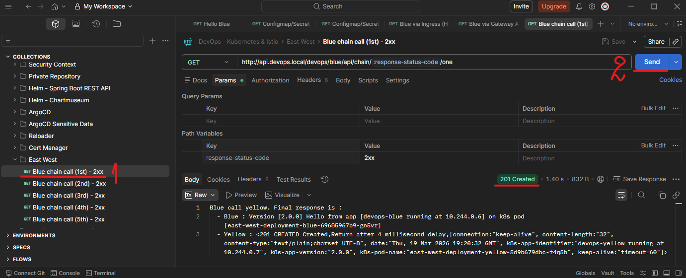
<br>
<br>

There are several endpoints, each with a different call chain. For example, the second endpoint chain is: blue calls yellow, and blue also calls white. 

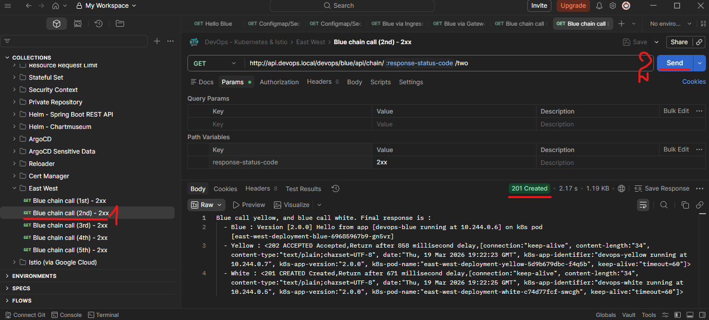
<br>
<br>

Try them and see the responses, which indicate multiple calls to multiple services.

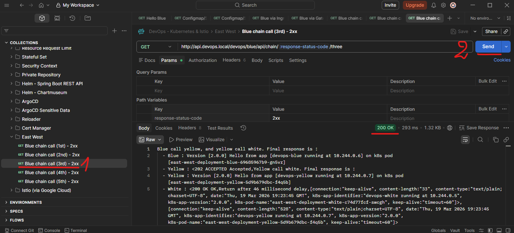
<br>
<br>

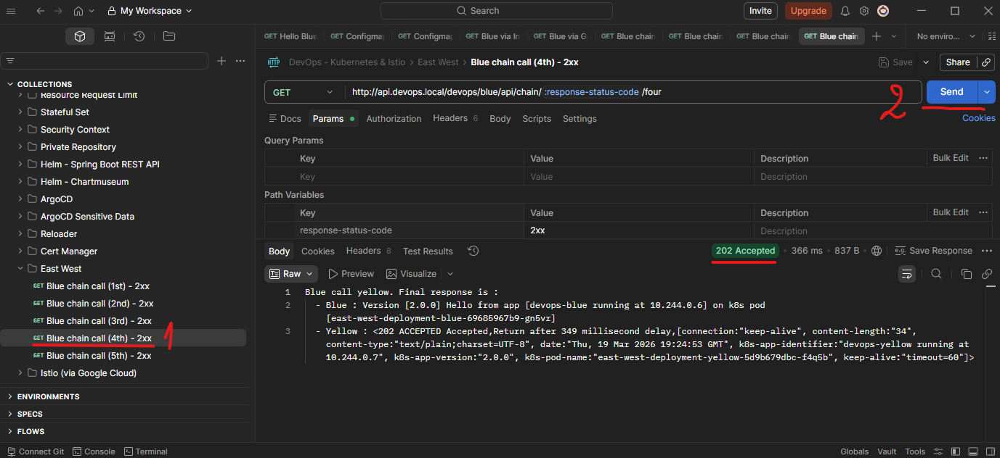
<br>
<br>

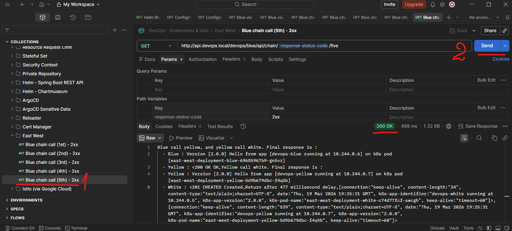
<br>
<br>

[⬆ Back to top](#top)

## 74 Google Kubernetes Engine (GKE)

[⬆ Back to top](#top)

For the next lesson, we will require large resources. It needs at least 12 gigabytes of free memory and 4 CPU cores to run well. If you can allocate such a resource, it is okay to run minikube. Some laptops might not have such resources. Therefore, we will use Google Cloud Kubernetes Engine. When I record this video, Google provides limited free usage for new users, But it might change at times. So be prepared to spend some bills on Google. 

Using Google Cloud requires a Google account with billing enabled. If you don't want to use Google Cloud, that's fine. You can still watch the lesson video to learn.

If you want to use Google Cloud and enable billing, please search for "enable Google Cloud billing" and follow the instructions on the Google website. At some point during service creation, Google will prompt you to enable billing if you haven't.

Since we are using a paid service, we must be careful with the cloud. Otherwise, the cloud payment will go up. For learning, delete any resources you use, like a Kubernetes cluster or SQL, when you are done. Google offers a free tier, but you are responsible for managing your own budget.

This lesson assumes you have already enabled billing on your Google account. Google will also redirect you to the billing page at some point to enable the payment. First, we need to log in to Google Cloud.

Go to https://cloud.google.com/, log in with your Google account, and click the console link. 


<br>
<br>

If you are a new user, create a new project.

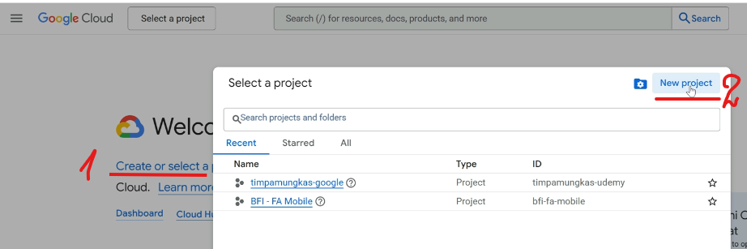
<br>
<br>

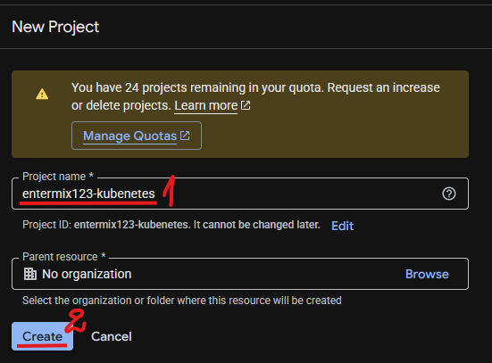
<br>
<br>

There are two types of Google Kubernetes Engine: Standard and Autopilot. GKE Standard provides full control over nodes, networking, and system components. It is best for workloads that require custom machine types, GPUs, or specialized networking, storage, or compliance configurations. This flexibility requires manual management of nodes, scaling, patching, and overall cluster health. 

GKE Autopilot is built for teams that want to focus on applications rather than cluster operations. It suits microservices, APIs, and variable workloads. 

Google automatically manages the infrastructure, and we are billed per pod instead of per node. Stricter security and configuration limits make it safer but less suitable for highly customized or system-level workloads. 

Choose Standard for control and flexibility, and Autopilot for simplicity and lower operational effort.

Go to the Kubernetes Engine page and enable the API when asked.

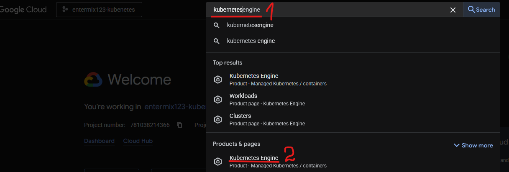
<br>
<br>

Wait a while, then create a new Kubernetes cluster. 

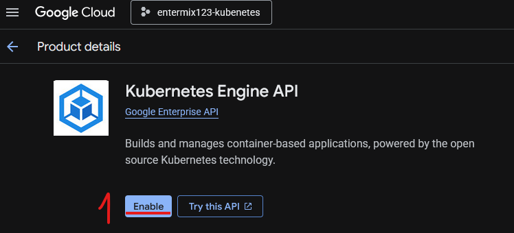
<br>
<br>

For this course, we will use a standard cluster because we need greater installation flexibility.

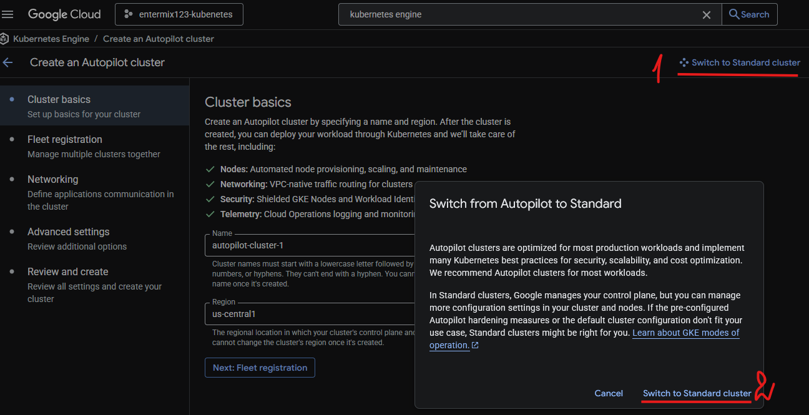
<br>
<br>

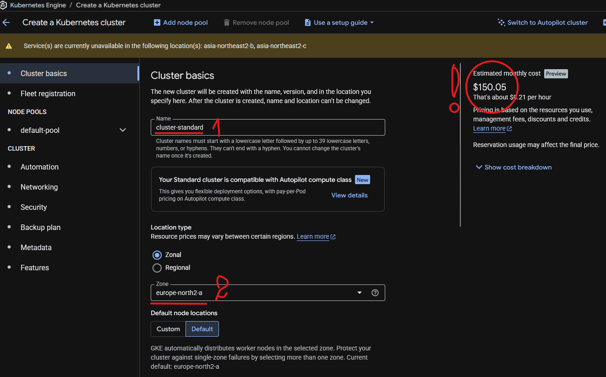
<br>
<br>

Create a new standard cluster with at least one node.

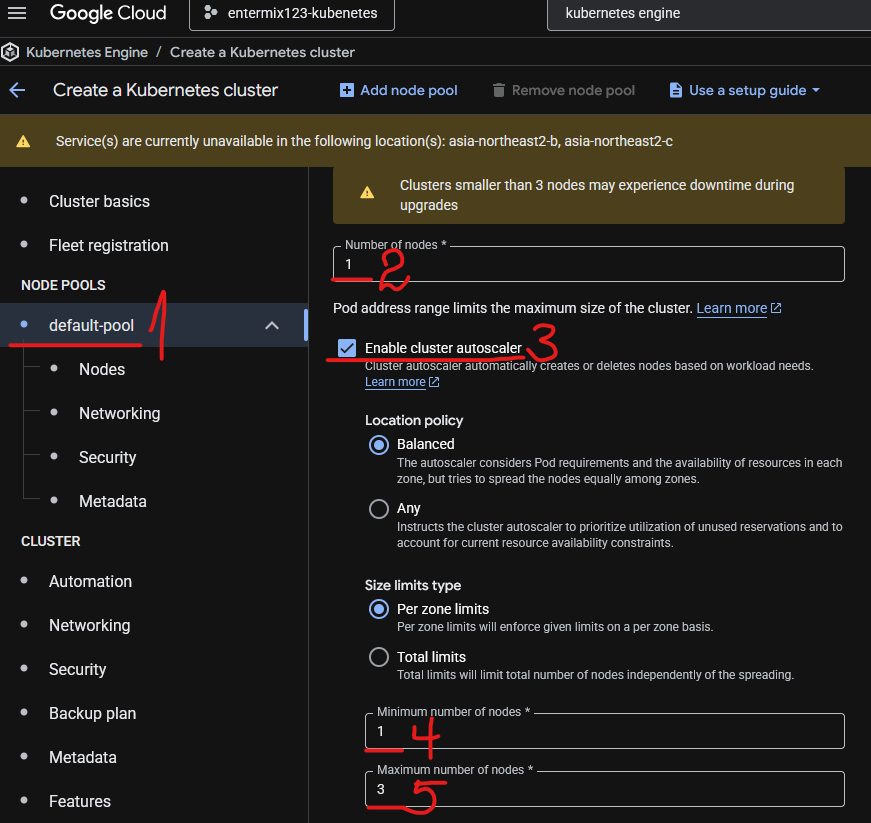
<br>
<br>

Ensure we have at least 4 CPU cores and 12 GB of memory. If later it is not enough, you can create a bigger machine. Create the Kubernetes cluster and wait a while.

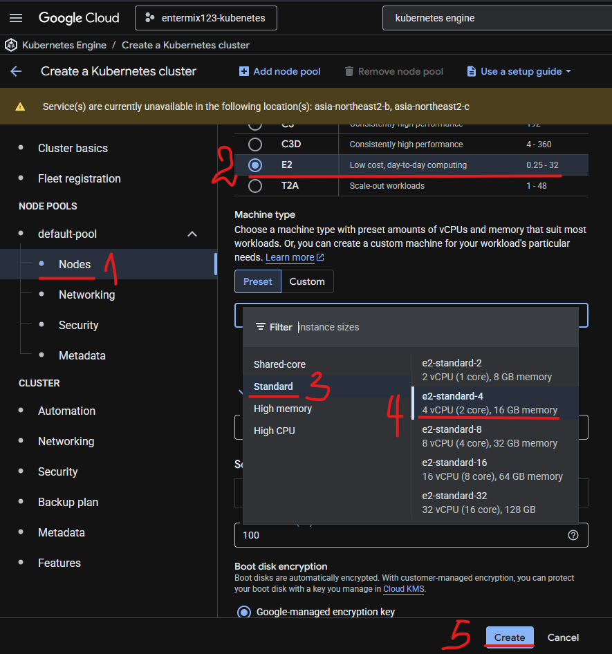
<br>
<br>

While waiting, install and download the Google Cloud SDK, which we will needto connect with our cluster.

    Search for 'install Google Cloud CLI' --> https://docs.cloud.google.com/sdk/docs/install-sdk

Initialize the configuration. To connect with the cluster, go to this page and copy the connect command.

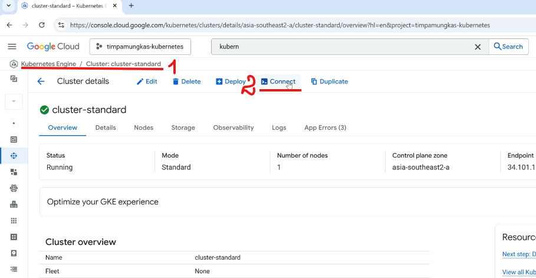
<br>
<br>

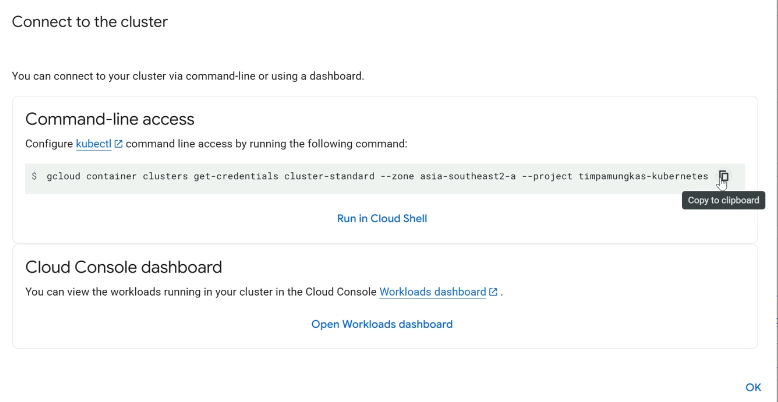
<br>
<br>

Execute the command from the local terminal.

    Google-Cloud SDK Shell -->  gcload container cluster get-credentials cluster-standard --zone europe-north2-a --project entermix123-kubernetes

If an error message appears because a required component is missing, follow the instructions to install it - https://docs.cloud.google.com/kubernetes-engine/docs/how-to/cluster-access-for-kubectl.

Try checking using one of the kubectl commands, for example, to see the cluster nodes. 

    CMD --> kubectl get nodes

    # result:
    NAME                                                STATUS     ROLES      AGE     VERSION
    gke-cluster-standard-default-pool-79000062-a-07r6   Ready      <none>     10m     v1.33.5-gke.2019000

From this point forward, we can use Google Kubernetes Engine in this course. Or, if you have enough resources on your laptop, keep using Minikube.

I want to remind you that Google billing runs 24/7, even if we don't use the kubectl command to interact with the cluster. To avoid huge costs on your credit card, when you are done with the course and need to take a break, don't forget to delete the Google Kubernetes cluster. Then, when you want to continue the course, create a new cluster.

You can delete the cluster from this page.

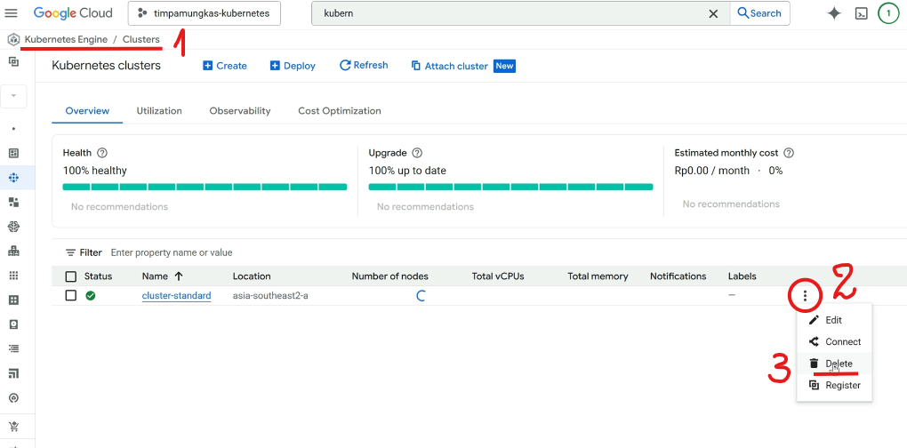
<br>
<br>


[⬆ Back to top](#top)

## 75 Tip: Resource Request

[⬆ Back to top](#top)

Remember about resource requests when we define deployment? It is a minimum amount of resources that must be available. In other words, a container will book that amount of resources. In the cloud, where we need to pay the bill, it is a good idea to set this resource request to a minimum. For example, only 20 million CPU cycles and 32 megabytes of memory.

This number is illustrative, as some applications require significant CPU or memory to start. The idea is to start small. Otherwise, the machine can be underutilized, as containers reserve high resources that are not actually required most of the time and cannot be used by other containers. A new node will be provisioned in the cloud, which means more bills to pay.

[⬆ Back to top](#top)

## 76 Observability & Control

[⬆ Back to top](#top)

In this section, we will learn how to observe & control east-west traffic in a Kubernetes cluster. We might have a system that slows down or gives an error. This case can happen for some reason, especially if traffic involves several nodes in the east-west call chain. However, observing the east-west traffic call chain is not straightforward. 

Suppose an east-west traffic, where one API call actually involves 4 nodes for east-west communication,

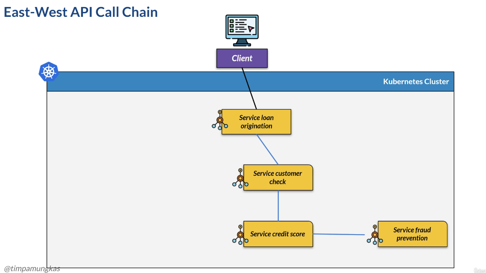
<br>
<br>

and the third node is down. This failure means the fourth node is actually never being called. 

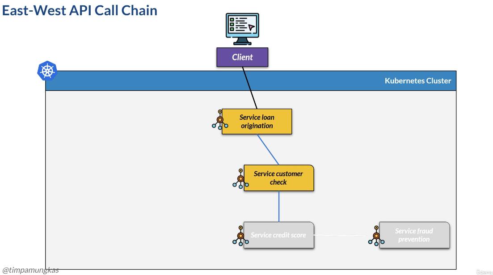
<br>
<br>

Since the third node is down. A call involving two nodes may be up. However, there is an algorithm bug on the second node that causes it to return an internal server error and, eventually, an error to the client.

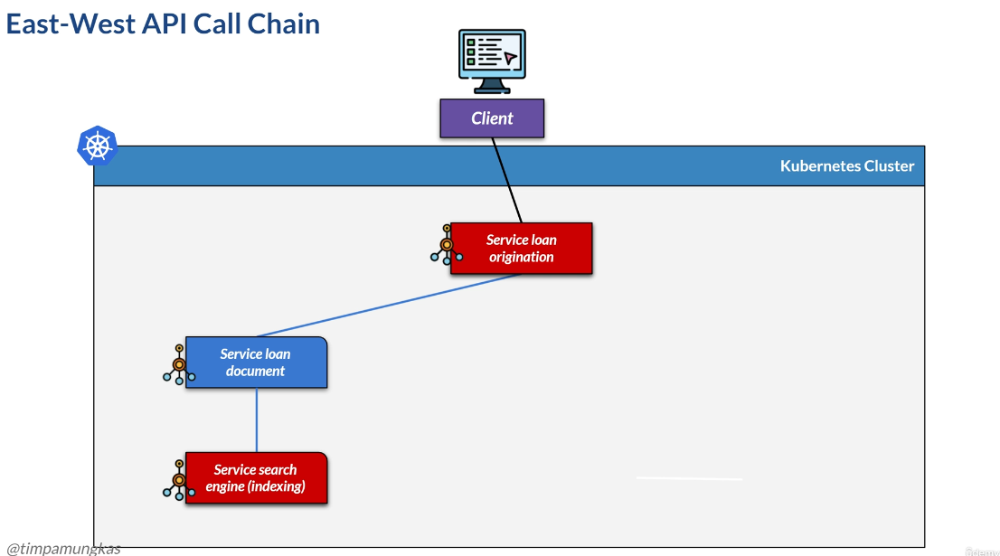
<br>
<br>

When a call from the north hits the API and produces a call chain involving several east-west nodes, a failure on the east-west traffic can cause an error throughout the chain, which eventually returns an error to the client. This case is known as cascading failure. Due to multiple nodes' involvement in the chain call, sometimes the engineer does not know exactly which node is the root cause of the error. If there are 5 API calls on the chain, which node has the most frequent errors? We will learn how to observe such cascading failures and get meaningful insight. The good news is that we will see this kind of traffic as a visual graph. Hence, interpreting traffic and pinpointing problematic traffic will be much easier. In effect, the DevOps team can pinpoint the problem and work with the software engineering team to fix it.

What if the error cannot be fixed fast? Or is there a security hole that causes the error and is too risky to keep the traffic flowing? 

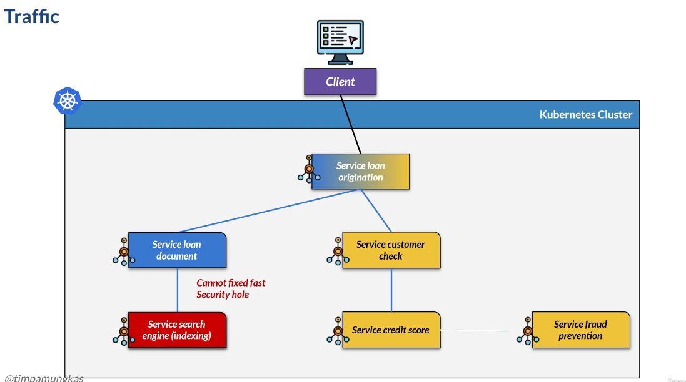
<br>
<br>

So, the temporary solution is to temporarily disconnect the problematic node from being called. 
The service is still up and running. However, we forbid the traffic from flowing there. But disconnecting a node in a microservice is not trivial. Maybe the one that must be closed is just east-west traffic from node P to node Q, but the other traffic, Including the north-south call to Q must be kept open. We can ask the P and Q software engineering teams to temporarily write code to disable traffic routing from P to Q. 

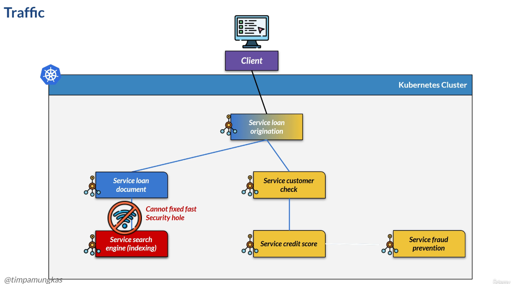
<br>
<br>

But there is a simpler and faster way using the Kubernetes infrastructure that we will learn. On an east-west call involving several nodes, we might also encounter slow API responses. But if 4 nodes are involved in the API call chain, which one takes the longest to process? 

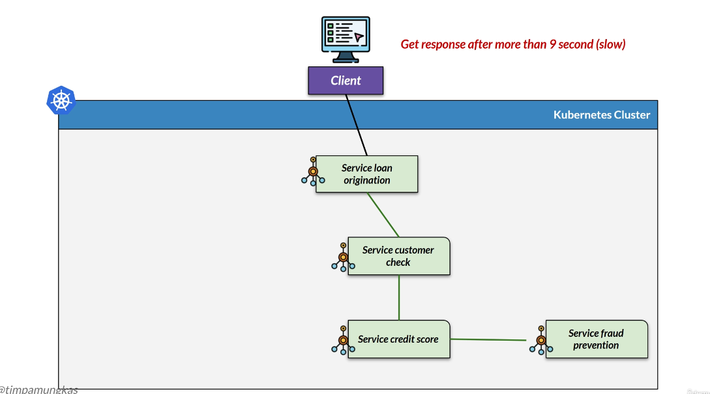
<br>
<br>

We can achieve this visibility without writing any code at all, using Kubernetes' distributed tracing feature. 

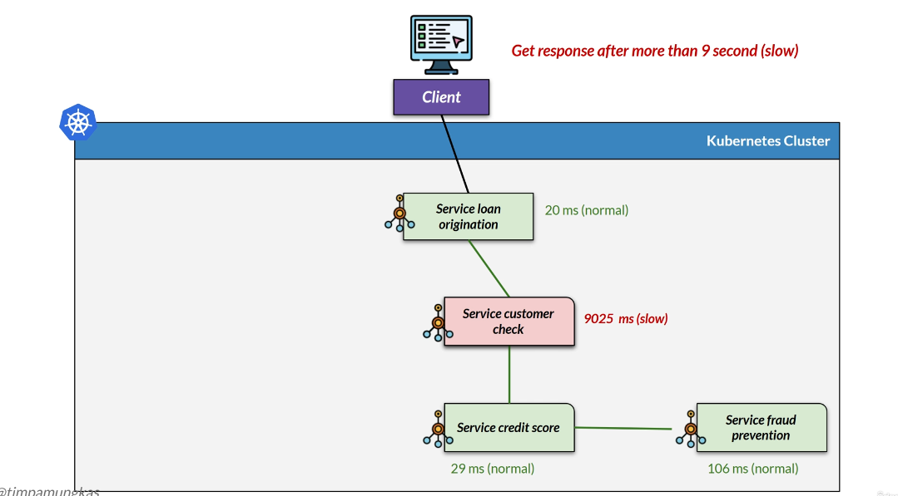
<br>
<br>

In the next lesson, we will install several tools for this section. Prometheus and Grafana are using the kube-prometheus stack, which we learned about earlier, with several configurations. Nginx as an ingress controller, Istio base and Istio daemon. Enabling sidecar injection for each namespace by adding the Istio label. Kiali is an Istio user interface. And Jaeger, a distributed tracing user interface. We will see each of them soon. As usual, the installation script is available in the Resources & References section of the course.

In this section, I will navigate the Kubernetes object using Lens UI. As the object is quite large and needs detailed inspection for the course.

As a reminder, we can download Lens UI from this website - https://lenshq.io/.

[⬆ Back to top](#top)


### Start high resource minikube container

Delete the previous minikube and start fresh Minikube cluster

    bash --> minikube delete
    bash --> minikube start --cpus 4 --memory 16384 --driver docker


## 77 Install Kube Prometheus

[⬆ Back to top](#top)

In the course resource, look for folders starting with 'istio'. We will install the tool set in sequence.

The Kube Prometheusstack is the first thing we install, since several other installations require Prometheus CRD. In the kube prometheus stack, we will use similar YAML values from themonitoring lesson. 

values-kube-prometheus.yml

```yaml
grafana:
  adminPassword: changeme
  ingress:
    enabled: true
    ingressClassName: haproxy
    annotations: 
      ingress.kubernetes.io/rewrite-target: /
    path: /grafana
  grafana.ini: 
    server:
      root_url: "%(protocol)s://%(domain)s:%(http_port)s/grafana"
      serve_from_sub_path: true

prometheus:
  ingress:
    enabled: true
    ingressClassName: haproxy
    annotations:
      ingress.kubernetes.io/rewrite-target: /
    paths:
    - /prometheus
  prometheusSpec:
    routePrefix: /prometheus
    podMonitorSelectorNilUsesHelmValues: false
    serviceMonitorSelectorNilUsesHelmValues: false
    podMonitorNamespaceSelector: {}
    podMonitorSelector: {}
    serviceMonitorNamespaceSelector: {}
    serviceMonitorSelector: {}
    logLevel: debug
  resources:
    limit:
      cpu: "0.3"
      memory: 384Mi

alertmanager:
  ingress:
    enabled: true
    ingressClassName: haproxy
    annotations:
      ingress.kubernetes.io/rewrite-target: /
    paths:
    - /alertmanager
  alertmanagerSpec:
    routePrefix: /alertmanager
  resources:
    limit:
      cpu: "0.2"
      memory: 128Mi
```

Install using Helm.

    CMD --> helm upgrade --install kube-prometheus-stack --repo https://prometheus-community.github.io/helm-charts kube-prometheus-stack --namespace istio-system --create-namespace -f values-kube-prometheus.yml

    # result:
    Release "kube-prometheus-stack" does not exist. Installing it now.
    NAME: kube-prometheus-stack
    LAST DEPLOYED: Sat Mar 21 21:18:04 2026
    NAMESPACE: istio-system
    STATUS: deployed
    REVISION: 1
    DESCRIPTION: Install complete
    TEST SUITE: None
    NOTES:
    kube-prometheus-stack has been installed. Check its status by running:
      kubectl --namespace istio-system get pods -l "release=kube-prometheus-stack"

    Get Grafana 'admin' user password by running:

      kubectl --namespace istio-system get secrets kube-prometheus-stack-grafana -o jsonpath="{.data.admin-password}" | base64 -d ; echo

    Access Grafana local instance:

      export POD_NAME=$(kubectl --namespace istio-system get pod -l "app.kubernetes.io/name=grafana,app.kubernetes.io/instance=kube-prometheus-stack" -oname)
      kubectl --namespace istio-system port-forward $POD_NAME 3000

    Get your grafana admin user password by running:

      kubectl get secret --namespace istio-system -l app.kubernetes.io/component=admin-secret -o jsonpath="{.items[0].data.admin-password}" | base64 --decode ; echo


    Visit https://github.com/prometheus-operator/kube-prometheus for instructions on how to create & configure Alertmanager and Prometheus instances using the Operator.

[⬆ Back to top](#top)

## 78 Install Ingress Controller

[⬆ Back to top](#top)

Add repo    

    CMD --> helm repo add haproxytech https://haproxytech.github.io/helm-charts
    CMD --> helm repo update

See the values-ingress-haproxy.yml file in the folder istio-ingress. It is almost identical to the HAProxy configuration from the monitoring lesson, with no Istio-specific configuration.

values-ingress-haproxy.yml

```yaml
controller:
  replicaCount: 1
  
  ingressClass: haproxy
  
  service:
    type: LoadBalancer
    enablePorts:
      http: true
      https: true
      stat: true
      admin: true
      quic: false
  
  resources:
    requests:
      memory: 128Mi
    limits:
      cpu: "0.3"
      memory: 256Mi

  autoscaling:
    enabled: false

  serviceMonitor:
    enabled: true
    extraLabels:
      release: kube-prometheus-stack
    endpoints:
      - port: stat
        path: /metrics
        scheme: http
        interval: 30s
```

Install HAProxy using Helm.

    CMD --> helm upgrade --install haproxy-ingress haproxytech/kubernetes-ingress --namespace haproxy --create-namespace --set controller.service.type=LoadBalancer --set controller.ingressClass=haproxy -f .\values-ingress-haproxy.yml

    # result:
    Release "haproxy-ingress" does not exist. Installing it now.
    NAME: haproxy-ingress
    LAST DEPLOYED: Sat Mar 21 22:01:22 2026
    NAMESPACE: haproxy
    STATUS: deployed
    REVISION: 1
    DESCRIPTION: Install complete
    TEST SUITE: None
    NOTES:
    HAProxy Kubernetes Ingress Controller has been successfully installed.

    Controller image deployed is: "docker.io/haproxytech/kubernetes-ingress:3.2.6".
    Your controller is of a "Deployment" kind. Your controller service is running as a "LoadBalancer" type.
    RBAC authorization is enabled.
    Controller ingress.class is set to "haproxy" so make sure to use same annotation for
    Ingress resource.

    Service ports mapped are:
      - name: admin
        containerPort: 6060
        protocol: TCP
      - name: http
        containerPort: 8080
        protocol: TCP
      - name: https
        containerPort: 8443
        protocol: TCP
      - name: stat
        containerPort: 1024
        protocol: TCP

    Node IP can be found with:
      $ kubectl --namespace haproxy get nodes -o jsonpath="{.items[0].status.addresses[1].address}"

    The following ingress resource routes traffic to pods that match the following:
      * service name: web
      * client's Host header: webdemo.com
      * path begins with /

      ---
      apiVersion: networking.k8s.io/v1
      kind: Ingress
      metadata:
        name: web-ingress
        namespace: default
        annotations:
          ingress.class: "haproxy"
      spec:
        rules:
        - host: webdemo.com
          http:
            paths:
            - path: /
              backend:
                serviceName: web
                servicePort: 80

    In case that you are using multi-ingress controller environment, make sure to use ingress.class annotation and match it
    with helm chart option controller.ingressClass.

    For more examples and up to date documentation, please visit:
      * Helm chart documentation: https://github.com/haproxytech/helm-charts/tree/main/kubernetes-ingress
      * Controller documentation: https://www.haproxy.com/documentation/kubernetes/latest/
      * Annotation reference: https://github.com/haproxytech/kubernetes-ingress/tree/master/documentation
      * Image parameters reference: https://github.com/haproxytech/kubernetes-ingress/blob/master/documentation/controller.md

After installation finishes, check the haproxy namespace. Verify that the ingress controller is created in Kubernetes. Check the service with type load balancer in the haproxy namespace. Notice that it has this external IP address, which is a Google Cloud IP address. This IP address is automatically assigned and will change each time we create a Kubernetes cluster or an ingress controller. This IP address is the one that we will use to access applications on the cluster. Your IP address will be different with this video, so please note your address and adjust your environment accordingly.

    CMD --> kubectl get service -n haproxy

    # result:
    NAME                                         TYPE           CLUSTER-IP      EXTERNAL-IP   PORT(S)                                                    AGE
    haproxy-ingress-kubernetes-ingress           LoadBalancer   10.98.206.172   127.0.0.1     80:32679/TCP,443:31640/TCP,1024:31325/TCP,6060:32256/TCP   20m
    haproxy-ingress-kubernetes-ingress-metrics   ClusterIP      10.105.170.40   <none>        1024/TCP 

### Optional    

Working with minikube we can start minikube tunnel and the service external Ip will becode 127.0.0.1

    CMD --> minikube tunnel


[⬆ Back to top](#top)

## 79 Istio Service Mesh

[⬆ Back to top](#top)

We know several things regarding network traffic. For example, the loan application has three microservices: loan origination, master data, and insurance. This example is, of course, oversimplified, as the real microservice architecture can have more microservices. The gray box is our data center. In this case, we use a Kubernetes cluster. We manage it, and it hosts three services. The loan application can be a web or mobile application that runs on the client's device, outside the data center. From the data center, we might need to access an external system owned by a third party, such as the Google Maps API or another provider. Network traffic that flows from a client application to any service within the data center is known as north-south traffic, or ingress traffic.


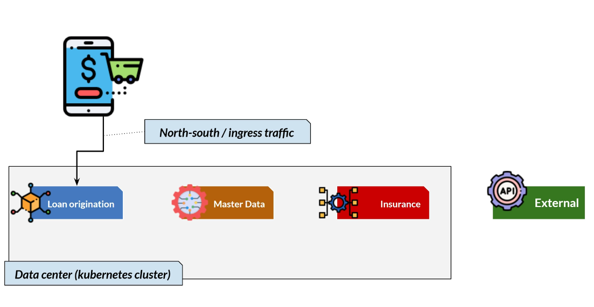
<br>
<br>

Traffic that flows from the data center to any service outside it is known as egress traffic. Inside the data center, network traffic can occur when one service calls an API provided by another service. This traffic is called east-west traffic. 

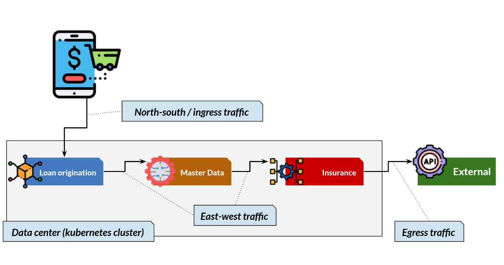
<br>
<br>

We manage north-south or ingress traffic using a Kubernetes ingress controller, or Gateway API. Although it is possible to put eachof our services behind an ingress or gateway API, a more suitable technology for managing east-west traffic is a service mesh. This service mesh is what we will learn about in the next lesson. 

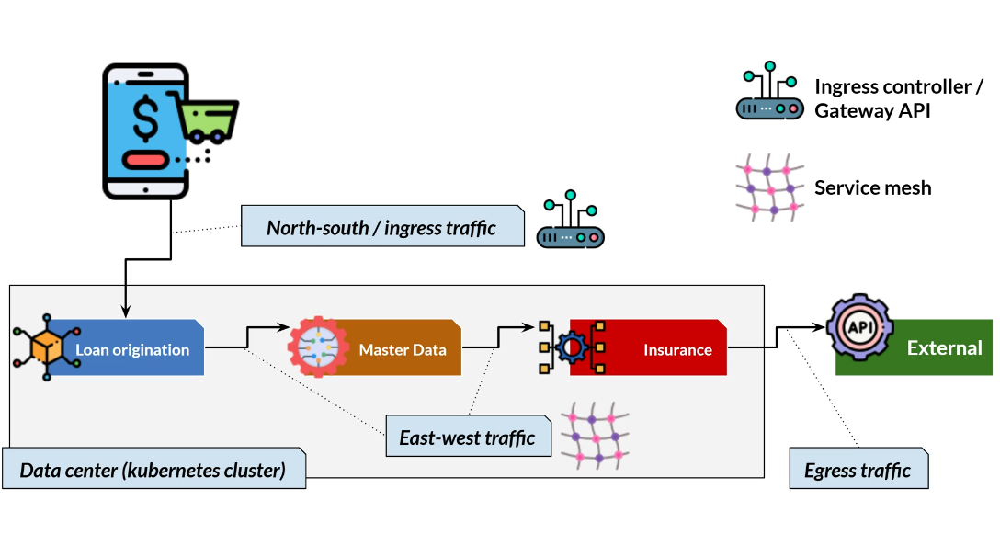
<br>
<br>

East-west traffic can become complicated, as shown in this picture, where red lines indicate many east-west communications among services. This case can bring some problems. 

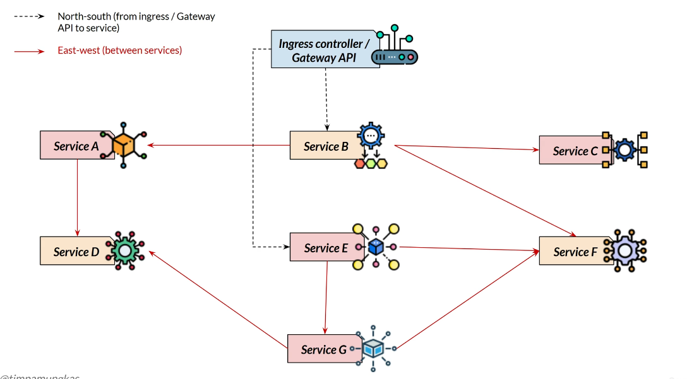
<br>
<br>

Communication between services might not be encrypted. It's usually just plain HTTP. There is no retry, so if service X calls service Y and Y becomes unavailable, service X will not try again. No metrics, which means we don't have visibility into east-west quality metrics, such as latency or the percentage error for each service. There is no access control, which means all services can communicate with each other. It uses plain, simple routing. If we have three instances of service Y, calls to service Y will be routed simply, such as round-robin, rather than more sophisticated methods, such as routing traffic to the least-busy instance. The software engineering team can handle all of that by adding coding in each service. But that will add to the engineering team's workload. This is where service mesh can help. 

We know that a service is a container that lives inside a pod. Without a service mesh, when service X calls service Y, it actually makes container-to-container calls, or application-to-application calls. Service mesh is software we deploy on Kubernetes. Conceptually, it acts as an additional layer during east-west traffic. So instead of direct calls, all east-west calls will go through the service mesh. We can intercept traffic and add some logic in the service mesh. This mesh logic can include encryption, retries, timeouts, and the addition of metrics and logs (basically, a solution to the problems we discussed on the previous slide). Then, with additional mesh logic, the traffic is routed to service Y, the target service. This service mesh layer is pluggable. We can add it to any service-to-service calls with minimal effort and no coding logic in each application. So when Y wants to call Z, we can also use the same concept by adding a Y-to-Z call to the service mesh. 

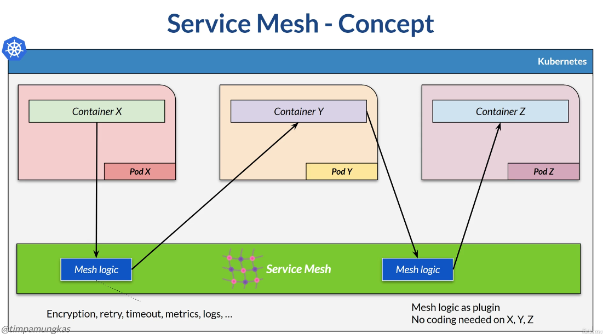
<br>
<br>

Service mesh has several abilities. 
- Observe and monitor all communications between individual microservices. 
- Secure connections between microservices. 
- Provides a circuit breaker on network traffic. 
- It has Traffic management capability, such as routing a certain percentage of traffic to microservice version 1 and the rest to microservice version 2, enabling "A" "B" testing or canary deployment. 

Network traffic itself is a complex topic, and not all software engineers are familiar with it. To remove this burden, service mesh does not require software engineers to change their source code. Instead, the service mesh handles this thing by using the sidecar proxy approach.

Do you know what a sidecar is? This is a sidecar attached to a motorcycle. A sidecar is an additional part of a motorcycle that allows it to carry an extra passenger or baggage without modifying the motorcycle itself. 

Let's zoom into the Kubernetes deployment with Istio as the service mesh. There, we have three microservices. X, Y, and Z are the main applications. Most of the time, we will not touch the application code at all to implement Istio. Instead, Istio service mesh will add a sidecar proxy. This sidecar proxy is another container, added to each pod, to intercept traffic and add mesh logic. The sidecar proxy is part of the pod, but no need to modify anything in the main application. 

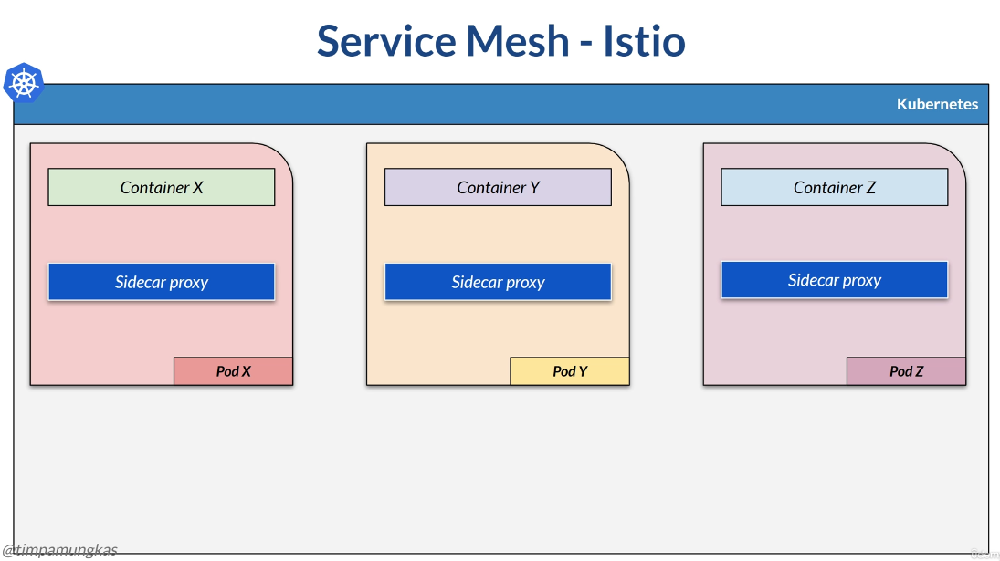
<br>
<br>

Traffic between microservices will then go through each microservice's sidecar proxy, rather than directly to the main application, so we can gather metrics or apply a policy via the sidecar proxy. Notice that the sidecar intercepts traffic for both the caller and the callee services, enabling service-mesh logic for all containers.

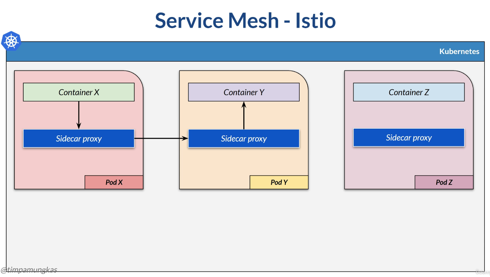
<br>
<br>

So service Y to service Z can also be routed through the sidecar proxy. On interception, the sidecar proxy then calls the Istio function (for example, to record metrics) when the service is called. Then, when the call gets a response, the sidecar proxy can call another function on Istio to record the http status response, and how long the call takes. 

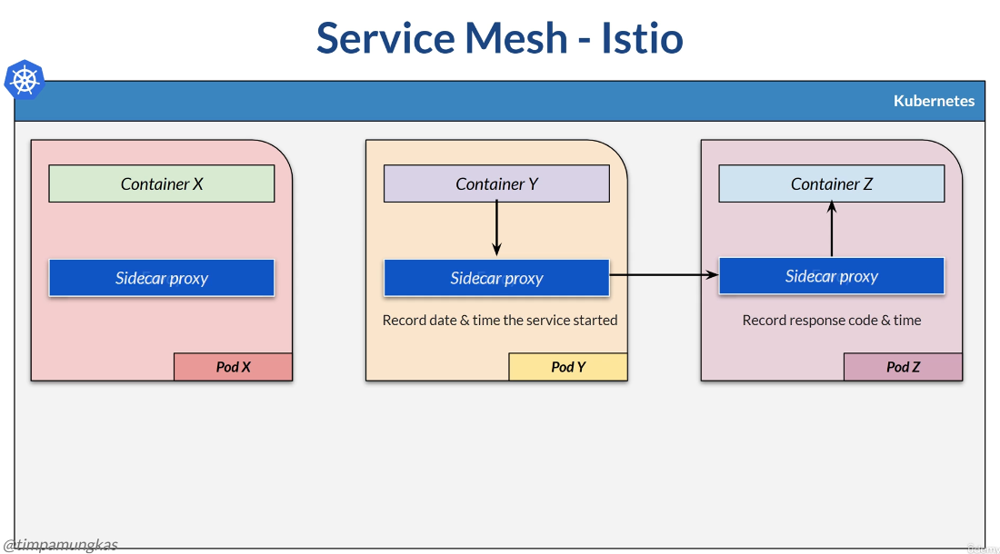
<br>
<br>

Istio is using Envoy as a sidecar. In other words, the sidecar proxy is the concept, and in Istio, it is implemented using Envoy. All the blue nodes (the sidecar proxy) are also known as the service-mesh data plane. The data plane is just one component of a service mesh. 

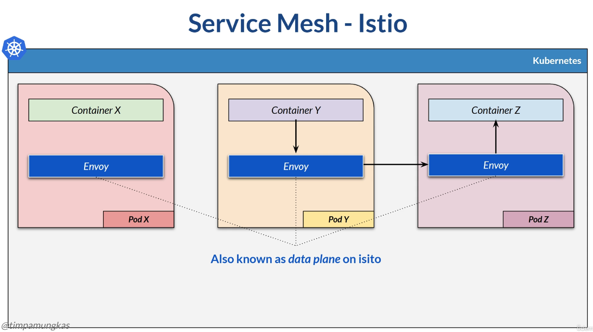
<br>
<br>

Another part is the control plane, which provides logic and configuration for the sidecar proxy. 

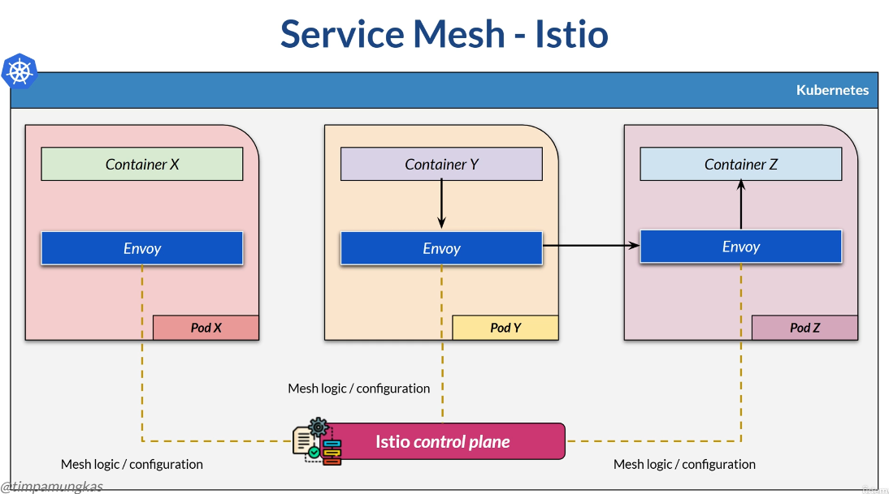
<br>
<br>

The main component of Istio is the control plane, commonly called istiod or the Istio daemon. The data plane, or sidecar proxy, is using Envoy. Envoy itself is a separate container injected using configuration. Therefore, a minimum (or none at all) application coding is required. But they are just background processes. Istio itself does not provide a user interface. Fortunately, there is an application named Kiali that provides this user interface. We will learn all of them in this course.

[⬆ Back to top](#top)

## 80 Install Istio

[⬆ Back to top](#top)

Istio installation basically creates the Istio base, which is the Istio CRD for Kubernetes, and installs the Istio daemon. Istio provides a complete setup document for guidance. 

As usual, the course command is also available in the last section, titled Resources & References. All required scripts for the service-mesh section will be placed in a folder named istio.

We will install Istio without any configuration, using the Google Helm chart. First, we need to install Istio. This step is just an Istio custom resource definition - CRD. We will install Istio in the namespace istio-system. 

    CMD --> helm upgrade --install istio-base base --repo https://istio-release.storage.googleapis.com/charts --namespace istio-system --create-namespace

    # result:
    Release "istio-base" does not exist. Installing it now.
    NAME: istio-base
    LAST DEPLOYED: Fri Mar 27 16:56:42 2026
    NAMESPACE: istio-system
    STATUS: deployed
    REVISION: 1
    DESCRIPTION: Install complete
    TEST SUITE: None
    NOTES:
    Istio base successfully installed!

    To learn more about the release, try:
      $ helm status istio-base -n istio-system
      $ helm get all istio-base -n istio-system

Install Istio CNI (Container Network Interface) - daemon

    CMD --> helm upgrade --install istio-cni cni --repo https://istio-release.storage.googleapis.com/charts --namespace istio-system --create-namespace

    # result:
    Release "istio-cni" does not exist. Installing it now.
    I0327 16:58:57.992049   13452 warnings.go:107] "Warning: spec.template.metadata.annotations[container.apparmor.security.beta.kubernetes.io/install-cni]: deprecated since v1.30; use the \"appArmorProfile\" field instead"
    NAME: istio-cni
    LAST DEPLOYED: Fri Mar 27 16:58:57 2026
    NAMESPACE: istio-system
    STATUS: deployed
    REVISION: 1
    DESCRIPTION: Install complete
    TEST SUITE: None
    NOTES:
    "istio-cni" successfully installed!

    To learn more about the release, try:
      $ helm status istio-cni -n istio-system
      $ helm get all istio-cni -n istio-system

Then we will install istiod (control plane)

    CMD --> helm upgrade --install istiod istiod --repo https://istio-release.storage.googleapis.com/charts --namespace istio-system

    # result:
    Release "istiod" does not exist. Installing it now.
    NAME: istiod
    LAST DEPLOYED: Fri Mar 27 18:08:31 2026
    NAMESPACE: istio-system
    STATUS: deployed
    REVISION: 1
    DESCRIPTION: Install complete
    TEST SUITE: None
    NOTES:
    "istiod" successfully installed!

    To learn more about the release, try:
      $ helm status istiod -n istio-system
      $ helm get all istiod -n istio-system

    Next steps:
      * Deploy a Gateway: https://istio.io/latest/docs/setup/additional-setup/gateway/
      * Try out our tasks to get started on common configurations:
        * https://istio.io/latest/docs/tasks/traffic-management
        * https://istio.io/latest/docs/tasks/security/
        * https://istio.io/latest/docs/tasks/policy-enforcement/
      * Review the list of actively supported releases, CVE publications and our hardening guide:
        * https://istio.io/latest/docs/releases/supported-releases/
        * https://istio.io/latest/news/security/
        * https://istio.io/latest/docs/ops/best-practices/security/

    For further documentation see https://istio.io website

Wait a while and check that we have 'istio-cni-node-xxxxx' and 'istiod-xxxxxxxxx-xxxxx' pod in the istio-system namespace.

    CMD --> kubectl get pods -n istio-system

    # result:
    NAME                                                        READY   STATUS    RESTARTS        AGE
    alertmanager-kube-prometheus-stack-alertmanager-0           2/2     Running   2 (5d19h ago)   5d20h
    istio-cni-node-j8bjx                                        1/1     Running   0               70m
    istiod-6dbf7db644-2hgv8                                     1/1     Running   0               32s
    kube-prometheus-stack-grafana-95cccf84-p959z                3/3     Running   3 (5d19h ago)   5d20h
    kube-prometheus-stack-kube-state-metrics-844c755cdf-c5r7k   1/1     Running   1 (5d19h ago)   5d20h
    kube-prometheus-stack-operator-bd9dfdfd8-9mmsf              1/1     Running   1 (5d19h ago)   5d20h
    kube-prometheus-stack-prometheus-node-exporter-5hkks        1/1     Running   1 (5d19h ago)   5d20h
    prometheus-kube-prometheus-stack-prometheus-0               2/2     Running   2 (5d19h ago)   5d20h

Prometheus can be used to scrape Istio data and later display the metrics in Grafana or Kiali. Prometheus works by calling an application's metrics endpoint, so we must tell Prometheus which endpoint and which applications to monitor. To do this, we create a pod monitoring object.

In the istio-basic folder, open the file istio-scrape.yml.

istio-scrape.yml

```yaml
apiVersion: monitoring.coreos.com/v1
kind: PodMonitor
metadata:
  name: istio-sidecar-monitor
  namespace: istio-system
  labels:
    release: kube-prometheus-stack
spec:
  selector:
    matchExpressions:
    - key: security.istio.io/tlsMode
      operator: Exists
  namespaceSelector:
    any: true
  podMetricsEndpoints:
  - path: /stats/prometheus
    interval: 15s
    relabelings:
    - action: keep
      sourceLabels: [__meta_kubernetes_pod_container_name]
      regex: "istio-proxy"
    - action: replace
      sourceLabels: [__address__]
      regex: ([^:]+)(?::\d+)?
      replacement: $1:15020
      targetLabel: __address__
    - action: replace
      sourceLabels: [__meta_kubernetes_namespace]
      targetLabel: namespace
    - action: replace
      sourceLabels: [__meta_kubernetes_pod_name]
      targetLabel: pod_name
    - action: replace
      sourceLabels: [__meta_kubernetes_pod_label_app]
      targetLabel: app
    - action: replace
      sourceLabels: [__meta_kubernetes_pod_label_version]
      targetLabel: version

---

apiVersion: monitoring.coreos.com/v1
kind: ServiceMonitor
metadata:
  name: istio-component-monitor
  namespace: istio-system
  labels:
    release: kube-prometheus-stack
spec: 
  jobLabel: istio
  targetLabels:
  - app
  namespaceSelector:
    matchNames:
    - istio-system
  selector:
    matchExpressions:
    - key: istio
      operator: In
      values:
      - pilot
  endpoints:
  - port: http-monitoring
    interval: 15s
```

We create this pod monitoring object to gather metrics from Istio, specifically from each Envoy proxy. This configuration may look complex because we want Prometheus to scrape an Istio endpoint that exposes both Istio and application metrics. Istio also exposes another built-in endpoint that provides only Istio metrics, which is not sufficient for our use case. We need to include this entire relabeling section (line 19 - 38), which is specific to Istio, so Prometheus knows which endpoint to scrape for combined Istio and application metrics. With this configuration, the pod monitor will collect metrics from each Envoy proxy at a fixed interval. 

We configure Prometheus to monitor all namespaces. Any namespace with label 'kube-prometheus-stack' will have the Istio sidecar injected, and Prometheus will scrape metrics only from those workloads. 

We also want to monitor the Istio daemon itself. To do this, we create a service monitor. This service monitor discovers services in the istio-system namespace that match the given selector. In a service monitor, we cannot specify a port number directly; instead, we must reference a named port (line 63). The Istio service we are interested in exposes a named port specifically intended for monitoring and scraping.

Apply this file.

    CMD --> kubectl apply -f istio-scrape.yml

    # result:
    podmonitor.monitoring.coreos.com/istio-sidecar-monitor created
    servicemonitor.monitoring.coreos.com/istio-component-monitor created

In Lens verify that there are two objects under the Monitoring CRD in the istio-system namespace: a PodMonitor and a ServiceMonitor.

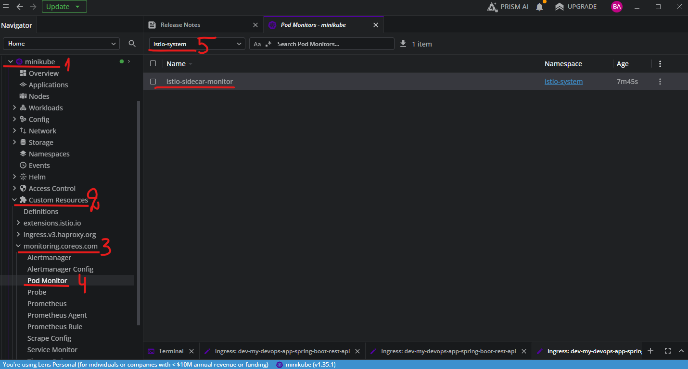
<br>
<br>

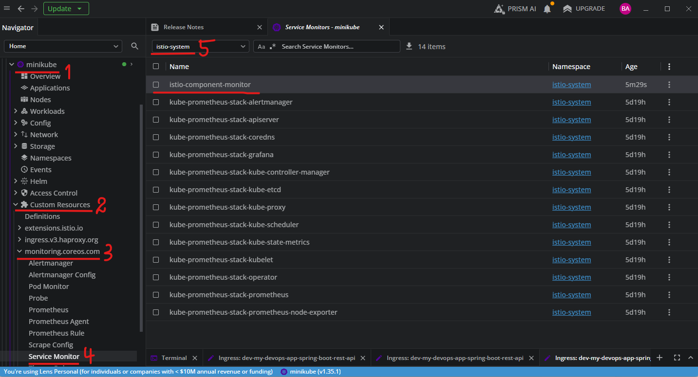
<br>
<br>

When we install Istio, it can automatically inject a sidecar proxy into pods in enabled namespaces. That's useful for our application services, but not for our HAProxy Ingress Controller. HAProxy is already a full-featured proxy that handles all incoming north-south traffic, so adding an Istio sidecar would put two proxies in series, increasing latency, wasting resources, and potentially adding unexpected behavior to HAProxy. With Istio, we cleanly split responsibilities: HAProxy handles north-south traffic entering the cluster, while Istio manages service-to-service (east-west) traffic within the cluster.

Thus, we need to disable Istio injection in the HAProxy namespace to keep HAProxy unmodified and let Istio focus on our internal services. To disable Istio injection, we set a specific label on the namespace metadata. 

disable-istio-on-ingress.yml

```yaml

apiVersion: v1
kind: Namespace
metadata:
  name:  haproxy
  labels:
    istio-injection: disabled
```

Run disable-istio-on-ingress.yml file and restart the deployment in the HAProxy namespace.

    CMD --> kubectl apply -f disable-istio-on-ingress.yml

    # result:
    Warning: resource namespaces/haproxy is missing the kubectl.kubernetes.io/last-applied-configuration annotation which is required by kubectl apply. kubectl apply should only be used on resources created declaratively by either kubectl create --save-config or kubectl apply. The missing annotation will be patched automatically.
    namespace/haproxy configured

    CMD --> kubectl rollout restart deployment -n haproxy

    # result: deployment.apps/haproxy-ingress-kubernetes-ingress restarted

On the other hand, Istio injection does not happen magically. We need to enable Istio injection for a specific namespace. In the HAProxy case, we explicitly turn off Istio injection. In the application, we must explicitly enable Istio injection. For example, now that we have Istio installed, let's deploy the application and see whether the sidecar proxy is injected. In the folder istio-basic, run a deployment configuration. This configuration will create a DevOps namespace with three pods, related services, and an ingress. 

    CMD --> kubectl apply -f devops-istio-basic-deployment-2.0.0.yml

    # result:
    namespace/devops created
    deployment.apps/istio-basic-deployment-blue created
    deployment.apps/istio-basic-deployment-yellow created
    deployment.apps/istio-basic-deployment-white created
    service/devops-blue-clusterip created
    service/devops-yellow-clusterip created
    service/devops-white-clusterip created
    ingress.networking.k8s.io/ingress-istio-basic-haproxy-blue created
    servicemonitor.monitoring.coreos.com/devops-blue-servicemonitor created
    servicemonitor.monitoring.coreos.com/devops-yellow-servicemonitor created
    servicemonitor.monitoring.coreos.com/devops-white-servicemonitor created

Wait a while until all pods are ready. Notice that each pod contains only one container. As we can see, the sidecar injection is not working, as no additional container in each pod. 

    CMD --> kubectl get pods -n devops

    # result:
    NAME                                             READY   STATUS    RESTARTS   AGE
    istio-basic-deployment-blue-58d55d9cbb-njt69     1/1     Running   0          92s
    istio-basic-deployment-white-57bd7b8cf5-bprzb    1/1     Running   0          99s
    istio-basic-deployment-yellow-748ccbdcf9-s2x2x   1/1     Running   0          106s

To make sure, see inside one of the pods, and we only see the application container. 

    CMD --> kubectl describe pod istio-basic-deployment-blue-58d55d9cbb-njt69 -n devops

    # result
    Name:             istio-basic-deployment-blue-58d55d9cbb-njt69
    Namespace:        devops
    Priority:         0
    Service Account:  default
    Node:             minikube/192.168.49.2
    Start Time:       Fri, 27 Mar 2026 17:26:48 +0200
    Labels:           app=istio-basic-blue
                      pod-template-hash=58d55d9cbb
                      version=2.0.0
    Annotations:      <none>
    Status:           Running
    IP:               10.244.0.21
    IPs:
      IP:           10.244.0.21
    Controlled By:  ReplicaSet/istio-basic-deployment-blue-58d55d9cbb
    Containers:
      devops-blue:
        Container ID:   docker://2a8dcfa69ca3391a385f65875581fe7959776c47f6f149e8c8a893c654f44fde
        Image:          timpamungkas/devops-blue:2.0.0
        Image ID:       docker-pullable://timpamungkas/devops-blue@sha256:6fc1e3a070eb6418cc85fa80532ad589548f1ea0a3d9a815a01c577739c5a8be
        Port:           8111/TCP (http)
        Host Port:      0/TCP (http)
        State:          Running
          Started:      Fri, 27 Mar 2026 17:27:16 +0200
        Ready:          True
        Restart Count:  0
        Limits:
          cpu:     300m
          memory:  300Mi
        Requests:
          cpu:        300m
          memory:     300Mi
        Liveness:     http-get http://:8111/devops/blue/actuator/health/liveness delay=60s timeout=5s period=60s #success=1 #failure=5
        Readiness:    http-get http://:8111/devops/blue/actuator/health/readiness delay=60s timeout=5s period=60s #success=1 #failure=5
        Environment:  <none>
        Mounts:
          /var/run/secrets/kubernetes.io/serviceaccount from kube-api-access-9skkv (ro)
    Conditions:
    ...

In this configuration, we explicitly enable Istio injection for the devops namespace. Run the file and restart the deployment on the DevOps namespace.

devops-istio-enable-sidecar.yml

```yaml
apiVersion: v1
kind: Namespace
metadata:
  name:  devops
  labels:
    istio-injection: enabled
```

    CMD --> kubectl apply -f devops-istio-enable-sidecar.yml

    # result: namespace/devops configured

    CMD --> kubectl rollout restart deployment -n devops

    # result:
    deployment.apps/istio-basic-deployment-blue restarted
    deployment.apps/istio-basic-deployment-white restarted
    deployment.apps/istio-basic-deployment-yellow restarted

See the pods, which now contain two containers: the main application and an automatically injected Istio sidecar.

    CMD --> kubectl get pods -n devops

    # result:
    NAME                                             READY   STATUS    RESTARTS   AGE
    istio-basic-deployment-blue-858894d5f6-rsz7m    2/2     Running   0           75s
    istio-basic-deployment-white-5867c888c5-znpmg   2/2     Running   0           75s
    istio-basic-deployment-yellow-8985dc9d9-kjk99   2/2     Running   0           75s

Describe pod and check sidecar container

    CMD --> kubectl describe pods istio-basic-deployment-blue-858894d5f6-rsz7m -n devops

    # result:
    ...
    istio-proxy:
        Container ID:  docker://43099ebd7f935362eba875b406a3186446e69dab4d2873fe96260817950d7412
        Image:         docker.io/istio/proxyv2:1.29.1
        Image ID:      docker-pullable://istio/proxyv2@sha256:af6e9eb76266df63c897a93db0e14fd6002080a0586b101ce9531b3f901591dc
        Port:          15090/TCP (http-envoy-prom)
    ...

[⬆ Back to top](#top)

## 81 Check Prometheus

[⬆ Back to top](#top)

At this point, we should already have Istio data on Prometheus

Start minikube tunnel

    CMD --> minikube tunnel

Access the ingress on the path http://localhost/prometheus/query and verify that there are metrics named 'istio'.

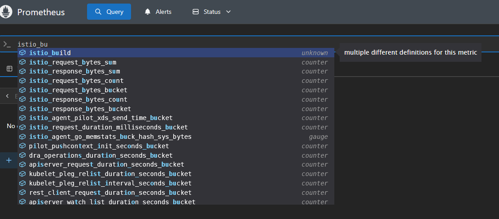
<br>
<br>


These are metrics gathered by the pod monitor and service monitor that we defined before.

And there are also application metrics. For example, those started with JVM, since we use a Java application.

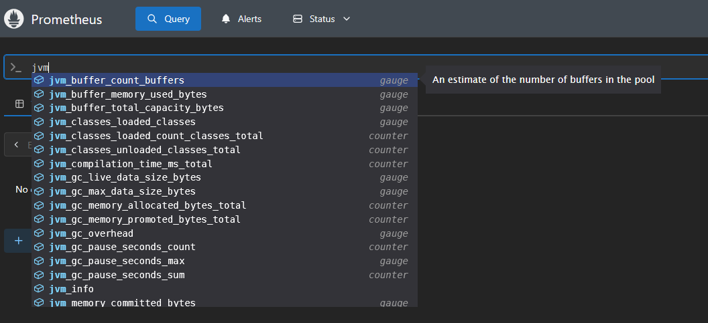
<br>
<br>


We can also verify that the Prometheus scraper is working via menu service discovery.

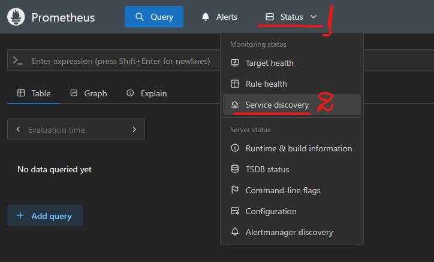
<br>
<br>

There should be a pod monitor and a service monitor for Istio. These are the monitors we created earlier. 

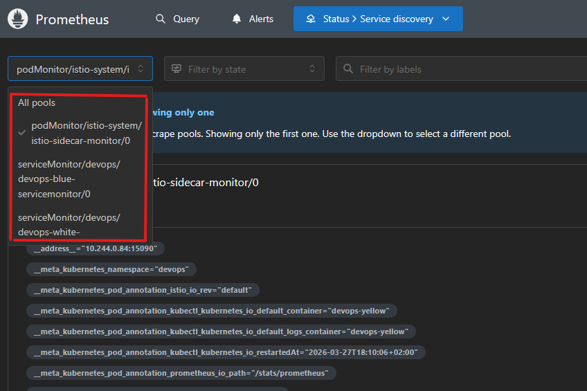
<br>
<br>

For details on which application was scraped, see the targets menu. 

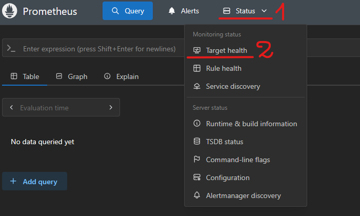
<br>
<br>

We can see the internal IP address, port, and other details.

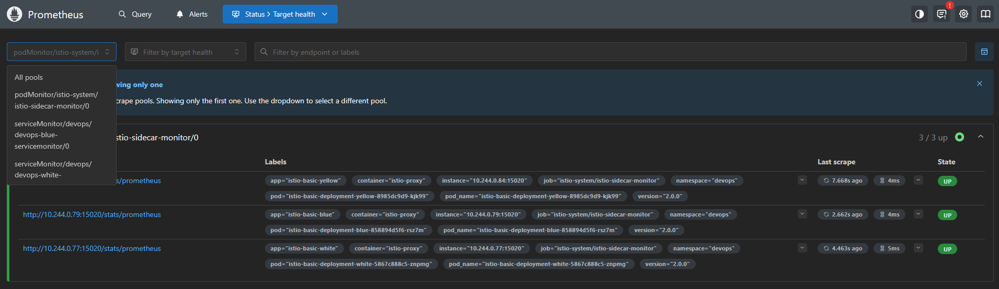
<br>
<br>

[⬆ Back to top](#top)
