# Section 21 Distributed Tracing

## Content
- 82 [Distributed Tracing](#82-distributed-tracing)
- 83 [Header Propagation](#83-header-propagation)
- 84 [Header Propagation With Open Telemetry Sidecar](#84-header-propagation-with-open-telemetry-sidecar)

We use the created minikube cluster from section 20 Istio Service Mesh for East-West Traffic with installed kube-prometheus stack, HAProxy Ingress Controller, Istio mesh and Application.

Start the cluster

    bash --> minikube start

Start minikube tunnel and don't close the terminal

    bash --> minikube tunnel

Make sure that address are added to Windows host list

- Open PowerShell as Admin

        PowerShell --> notepad C:\Windows\System32\drivers\etc\hosts

- add

```text
127.0.0.1 localhost                     # required
127.0.0.1 jaeger.local                  # required
127.0.0.1 blue.devops.local
127.0.0.1 yellow.devops.local           
127.0.0.1 api.devops.local
127.0.0.1 monitoring.devops.local
127.0.0.1 rabbitmq.devops.local
127.0.0.1 chartmuseum.local
127.0.0.1 harbor.local 
127.0.0.1 argocd.local
```

- save the file and exit

## 82 Distributed Tracing

[⬆ Back to top](#top)

Distributed tracing helps us with API chain calls. Imagine that we have 4 nodes on the API call.

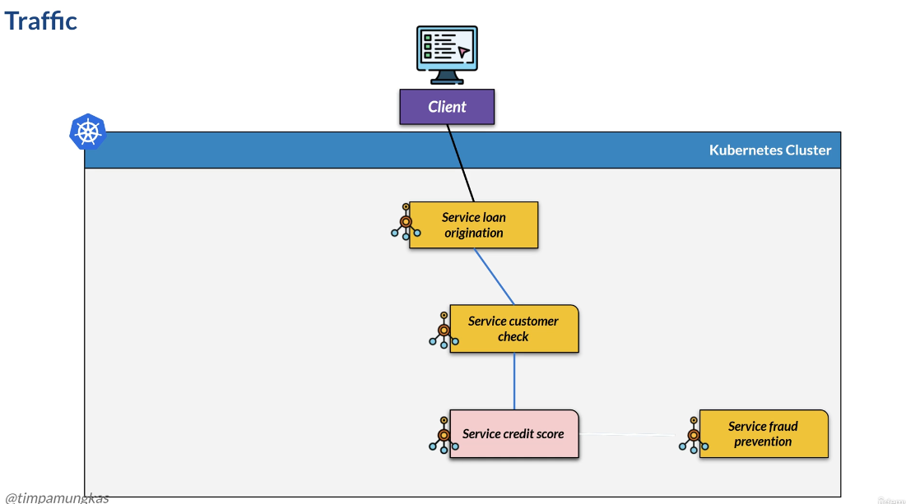
<br>
<br>

If the request returns slow responses or errors, how will we know which API is actually the problem? In a monolithic app, we can profile or debug it to know exactly where the culprit is. In distributed services, we cannot debug them the way we debug a monolithic app, but we can use a distributed tracing framework and a server to help us. With distributed tracing, each API call has a correlation ID that links it to other service calls in the API call chain. This correlation will be sent to the server, which will generate a visualization of the API call chain, including important data such as response time, response status, and the endpoint accessed. In this sample, we can see that API chain x has 4 nodes with IDs 901, 902, 903, and 904. We also know the time required per node and its response status code. Based on this distributed tracing visualization, we can now estimate which endpoint or service we should focus on.

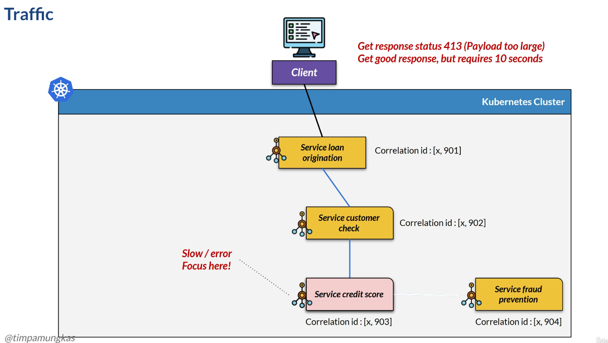
<br>
<br>

Two common open-source distributed tracing tools are Zipkin and Jaeger. In this lesson, we will use Jaeger version 2, which was relatively new when this course was created. There is a Jaeger Helm chart, but it is still in active development, and breaking changes might occur. In this course, we will install a specific version of the Helm chart so the configuration files on the course's resource will work. If you use a different or newer Helm chart version, please adjust the configuration accordingly.

The Jaeger version 2 installation requires cert-manager and opentelemetry. Follow the installation instructions in the course's resources and references, in the last section before installing Jaeger.


First, install cert-manager.

    CMD --> helm upgrade --install cert-manager cert-manager --repo https://charts.jetstack.io --namespace cert-manager --create-namespace --set crds.enabled="true"

    # result:
    Release "cert-manager" does not exist. Installing it now.
    NAME: cert-manager
    LAST DEPLOYED: Sat Mar 28 13:59:07 2026
    NAMESPACE: cert-manager
    STATUS: deployed
    REVISION: 1
    DESCRIPTION: Install complete
    TEST SUITE: None
    NOTES:
    cert-manager v1.20.1 has been deployed successfully!

    In order to begin issuing certificates, you will need to set up a ClusterIssuer
    or Issuer resource (for example, by creating a 'letsencrypt-staging' issuer).

    More information on the different types of issuers and how to configure them
    can be found in our documentation:

    https://cert-manager.io/docs/configuration/

    For information on how to configure cert-manager to automatically provision
    Certificates for Ingress resources, take a look at the `ingress-shim`
    documentation:

    https://cert-manager.io/docs/usage/ingress/

    For information on how to configure cert-manager to automatically provision
    Certificates for Gateway API resources, take a look at the `gateway resource`
    documentation:

    https://cert-manager.io/docs/usage/gateway/

Install Open Telemetry.

    CMD --> kubectl apply -f https://github.com/open-telemetry/opentelemetry-operator/releases/latest/download/opentelemetry-operator.yaml

    # result:
    namespace/opentelemetry-operator-system created
    customresourcedefinition.apiextensions.k8s.io/instrumentations.opentelemetry.io created
    customresourcedefinition.apiextensions.k8s.io/opampbridges.opentelemetry.io created
    customresourcedefinition.apiextensions.k8s.io/opentelemetrycollectors.opentelemetry.io created
    customresourcedefinition.apiextensions.k8s.io/targetallocators.opentelemetry.io created
    serviceaccount/opentelemetry-operator-controller-manager created
    role.rbac.authorization.k8s.io/opentelemetry-operator-leader-election-role created
    clusterrole.rbac.authorization.k8s.io/opentelemetry-operator-manager-role created
    clusterrole.rbac.authorization.k8s.io/opentelemetry-operator-metrics-reader created
    clusterrole.rbac.authorization.k8s.io/opentelemetry-operator-proxy-role created
    rolebinding.rbac.authorization.k8s.io/opentelemetry-operator-leader-election-rolebinding created
    clusterrolebinding.rbac.authorization.k8s.io/opentelemetry-operator-manager-rolebinding created
    clusterrolebinding.rbac.authorization.k8s.io/opentelemetry-operator-proxy-rolebinding created
    service/opentelemetry-operator-controller-manager-metrics-service created
    service/opentelemetry-operator-webhook-service created
    deployment.apps/opentelemetry-operator-controller-manager created
    certificate.cert-manager.io/opentelemetry-operator-serving-cert created
    issuer.cert-manager.io/opentelemetry-operator-selfsigned-issuer created
    mutatingwebhookconfiguration.admissionregistration.k8s.io/opentelemetry-operator-mutating-webhook-configuration created
    validatingwebhookconfiguration.admissionregistration.k8s.io/opentelemetry-operator-validating-webhook-configuration created
    
We will expose the Jaeger built-in user interface using HAProxy ingress. Thus, ensure we have an HAProxy ingress controller installed. The installation was performed in section 20 / 78 Install Ingress Controller on the current minikube cluster.

Go to the course folder istio-jaeger, where we have values-jaeger-all-in-one.yml file for Jaeger installation. Here, we expose the Jaeger User interface via HAProxy ingress on the host 'jaeger.local'.

values-jaeger-all-in-one.yml

```yaml
jaeger:
  ingress:
    enabled: true
    ingressClassName: haproxy
    hosts:
      - jaeger.local
```

Thus, ensure that we have set the DNS 'jaeger.local' to the localhost if we use minikube. 

Make sure that address are added to Windows host list

- Open PowerShell as Admin

        Admin PowerShell --> notepad C:\Windows\System32\drivers\etc\hosts

- add

```text
127.0.0.1 localhost                     # required
127.0.0.1 jaeger.local                  # required
```

Or, if you use Google Kubernetes Engine, ensure it is set to the Google Kubernetes IP address.

Add jaeger helm repository and update helm repos

    CMD --> helm repo add jaegertracing https://jaegertracing.github.io/helm-charts

    # result: "jaegertracing" has been added to your repositories

    CMD --> helm repo update

    # result: 
    Hang tight while we grab the latest from your chart repositories...
    ...Successfully got an update from the "chartmuseum" chart repository
    ...Successfully got an update from the "sealed-secrets" chart repository
    ...Successfully got an update from the "haproxytech" chart repository
    ...Successfully got an update from the "jaegertracing" chart repository
    ...Successfully got an update from the "minio" chart repository
    ...Successfully got an update from the "harbor" chart repository
    Update Complete. ⎈Happy Helming!⎈

Install Jaeger using values file

    CMD --> helm upgrade --install jaeger jaegertracing/jaeger --version 4.3.2 --values values-jaeger-all-in-one.yml --namespace jaeger --create-namespace

    # result:
    Release "jaeger" does not exist. Installing it now.
    NAME: jaeger
    LAST DEPLOYED: Sat Mar 28 14:16:29 2026
    NAMESPACE: jaeger
    STATUS: deployed
    REVISION: 1
    DESCRIPTION: Install complete
    TEST SUITE: None
    NOTES:
    ###################################################################
    ### ⚠️  EXPERIMENTAL - NO STABILITY GUARANTEES                  ###
    ###                                                             ###
    ### This chart is under active development.                     ###
    ### Breaking changes may occur in minor versions.               ###
    ###                                                             ###
    ### See README.md for configuration details.                    ###
    ###################################################################

    🚀 Congratulations on successfully installing Jaeger v2.14.1 (Chart v4.3.2)!

    To access the query UI:
    http://jaeger.local

Wait a while and check that the Jaeger service is running on namespace 'jaeger'.

    CMD --> kubectl get pods -n jaeger

    # result:
    NAME                      READY   STATUS    RESTARTS   AGE
    jaeger-859b5668cf-w289g   1/1     Running   0          118s

Try to access it on the http://jaeger.local.

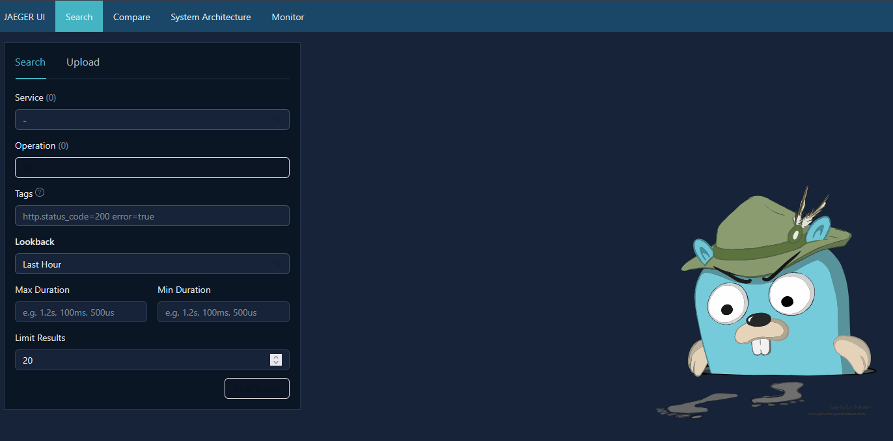
<br>
<br>

[⬆ Back to top](#top)


## 83 Header Propagation

[⬆ Back to top](#top)

A distributed tracing implementation does not need Istio or even Kubernetes. Even if we use a Linux or Windows virtual machine for our server, we can still use the distributed tracing feature. We can, for example, install Jaeger or Zipkin using a binary or Docker distribution. Then we adjust our code to send the correlation ID to Jaeger or Zipkin. The distributed tracing feature is the place in Istio where we might need to write code in our application to make it work, while the Envoy proxy already handles most other aspects. But this additional code is optional, as we will see later. The most important thing about distributed tracing is the correlation ID. To create a correlation ID, we need to implement a tracer using OpenTelemetry. 

A correlation ID is a specific HTTP request header that contains the trace ID, span ID, and parent span ID. These headers must be generated by the code and passed through all nodes in the call chain. These data can then be used to form a graph. For example, this call involves 3 nodes in sequence. The trace ID remains the same, while the span and parent ID will differ. The trace ID is an identifier for the overall process (the full API call chain). Trace ID is formed from one or more spans. One span is a call to one node. Each span will have a unique ID and a parent span ID. 

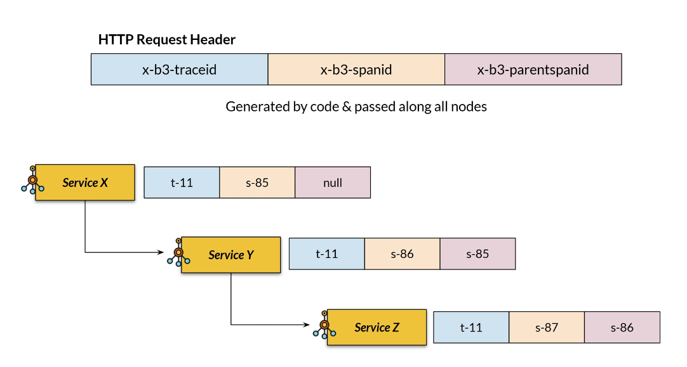
<br>
<br>

Another sample call chain is: X calls Y, and Y calls Z. Note that the parent span for Y and Z is the same as the X span ID. 

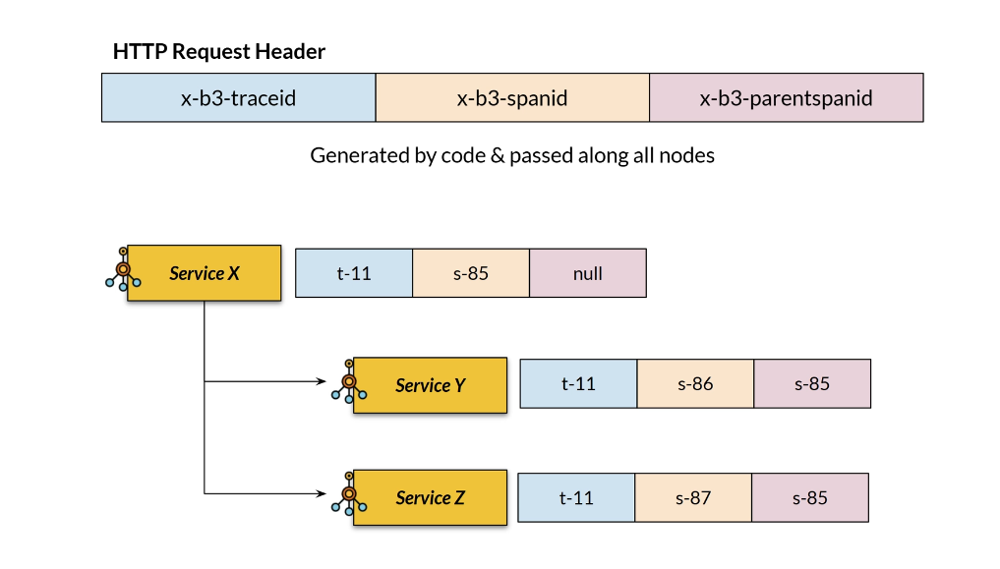
<br>
<br>

The sample applications used in this course are written in Spring Boot, with a configuration that automatically propagates headers using the Spring OpenTelemetry library. Thus, the application will be arranged correctly as a parent-child relationship in the Jaeger tracing. 

To deploy the application, go to the Jaeger folder in the course and open the deployment file for application version 2.0.1 - devops-istio-basic-deployment-2.0.1.yml. This file creates a namespace 'devops' with Istio injection enabled. This file creates blue, yellow, and white applications. Each is already configured in the Java code to propagate tracing headers. The source code for the Java application is also available on the course's resources and references. The file also creates a cluster IP service for the blue, yellow, and white applications. However, only the blue application is exposed via ingress. We also have several service monitors to send data to Prometheus. 

Ensure there is no 'devops' namespace. 

    CMD --> kubectl delete namespace devops

    # result: namespace "devops" deleted or Error from server (NotFound) 'devops" not found
    
Apply this file.

    CMD --> kubectl apply -f devops-istio-basic-deployment-2.0.1.yml

    # result:
    namespace/devops created
    deployment.apps/istio-basic-deployment-blue created
    deployment.apps/istio-basic-deployment-yellow created
    deployment.apps/istio-basic-deployment-white created
    service/devops-blue-clusterip created
    service/devops-yellow-clusterip created
    service/devops-white-clusterip created
    ingress.networking.k8s.io/ingress-istio-basic-haproxy-blue created
    servicemonitor.monitoring.coreos.com/devops-blue-servicemonitor created
    servicemonitor.monitoring.coreos.com/devops-yellow-servicemonitor created
    servicemonitor.monitoring.coreos.com/devops-white-servicemonitor created
    
We also have a configuration file to send tracing data to Jaeger - istio-jaeger-tracing.yml. The first object is a ConfigMap named 'istio' in the istio-system namespace that defines the core mesh configuration. It enables tracing globally and defines an extension provider called 'jaeger' that uses the OpenTelemetry protocol to send trace data to a Jaeger instance. The second object is a Telemetry custom resource that applies global tracing configuration to the mesh. It references the 'jaeger' provider and sets randomSamplingPercentage to 100.0, meaning every request will be traced.

istio-jaeger-tracing.yml

```yaml
apiVersion: v1
kind: ConfigMap
metadata:
  name: istio
  namespace: istio-system
data:
  mesh: |-
    enableTracing: true
    defaultConfig:
      tracing: {}
    extensionProviders:
    - name: jaeger
      opentelemetry:
        port: 4317
        service: jaeger.jaeger.svc.cluster.local

---

apiVersion: telemetry.istio.io/v1
kind: Telemetry
metadata:
  name: mesh-default
  namespace: istio-system
spec:
  tracing:
  - providers:
    - name: jaeger
    randomSamplingPercentage: 100.0
```

Apply this file.

    CMD --> kubectl apply -f istio-jaeger-tracing.yml

    # result:
    Warning: resource configmaps/istio is missing the kubectl.kubernetes.io/last-applied-configuration annotation which is required by kubectl apply. kubectl apply should only be used on resources created declaratively by either kubectl create --save-config or kubectl apply. The missing annotation will be patched automatically.
    configmap/istio configured
    telemetry.telemetry.istio.io/mesh-default created

Make sure minikube tunnel is up:

    CMD --> minikube tunnel

Open the Postman collection in the folder Istio. There are several endpoints here.

Try opening the hello endpoint. The first step is to define the Kubernetes address variable in the ingress. If you use Minikube, use localhost as the address.

If you use Google Cloud, you will see the ingress IP address here.    
     
    CMD --> kubectl get service -n haproxy

    # result
    NAME                                         TYPE           CLUSTER-IP      EXTERNAL-IP     PORT(S)                                                    AGE
    haproxy-ingress-kubernetes-ingress           LoadBalancer   10.98.206.172   34.101.120.209  80:32679/TCP,443:31640/TCP,1024:31325/TCP,6060:32256/TCP   6d17h        # TARGET EXTERNAL IP ADDRESS
    haproxy-ingress-kubernetes-ingress-metrics   ClusterIP      10.105.170.40   <none>          1024/TCP                                                   6d17h

Then change the Postman collection variable to the respective IP address. To test it, call the hello API, and if it works, we are ready to go.

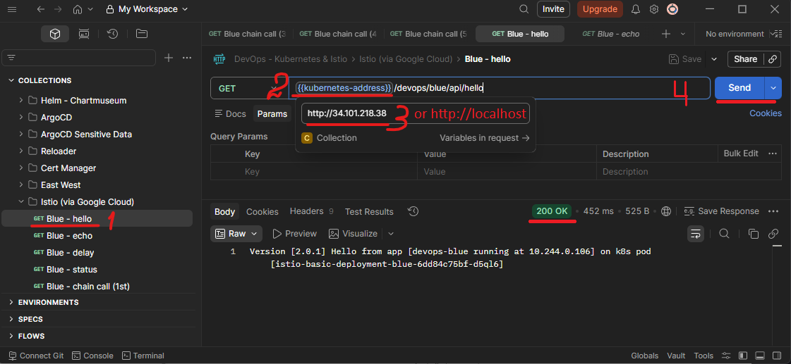
<br>
<br>

Inside the folder, there are several endpoints named "chain". This is the chain call: east-west traffic simulation. Now let's try to hit several chains and see what happens. 

Chain 1:

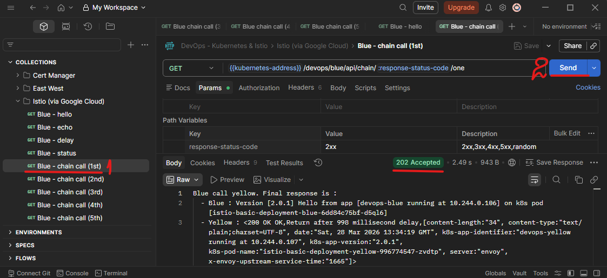
<br>
<br>

Chain 2:

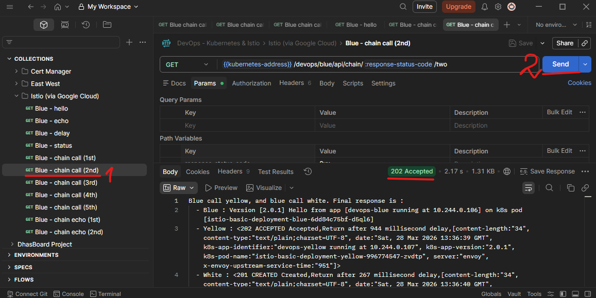
<br>
<br>

Chain 3:

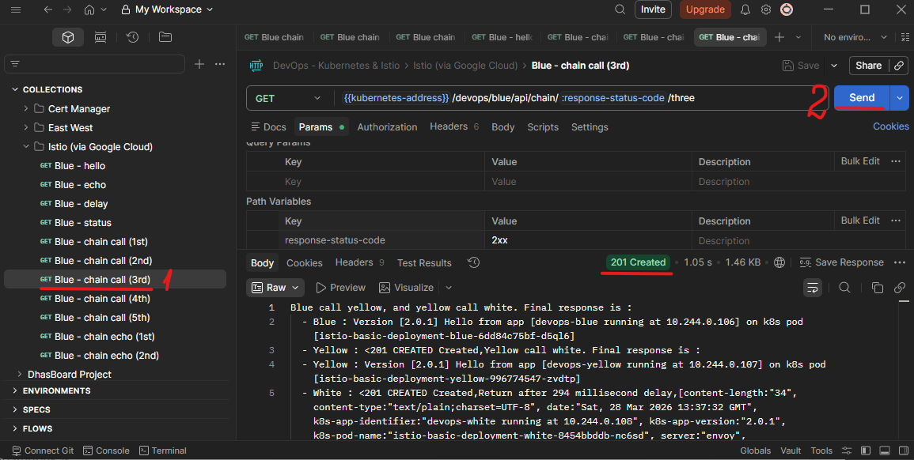
<br>
<br>

In the currently deployed application version 2.0.1, we have the OpenTelemetry propagate header. Therefore, if we open Jaeger, we will get the data - http://jaeger.local/search.

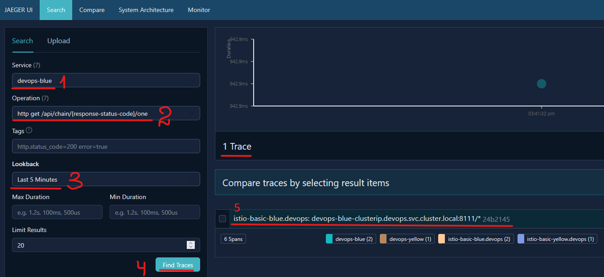
<br>
<br>

We can see that blue is the entry point, and eventually it has chained calls, such as blue calls yellow, blue calls white, or yellow calls white.

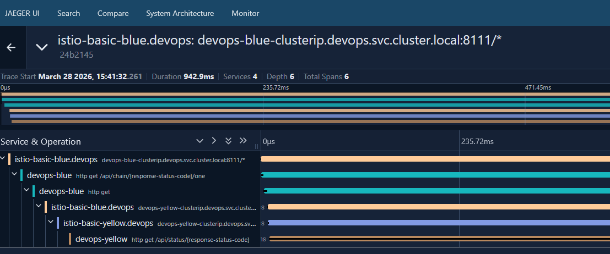
<br>
<br>

Chain 2 Traces:

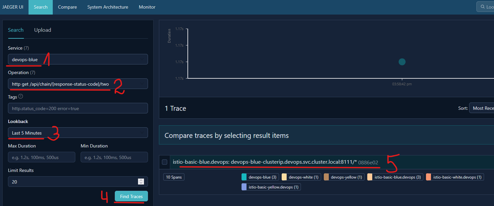
<br>
<br>


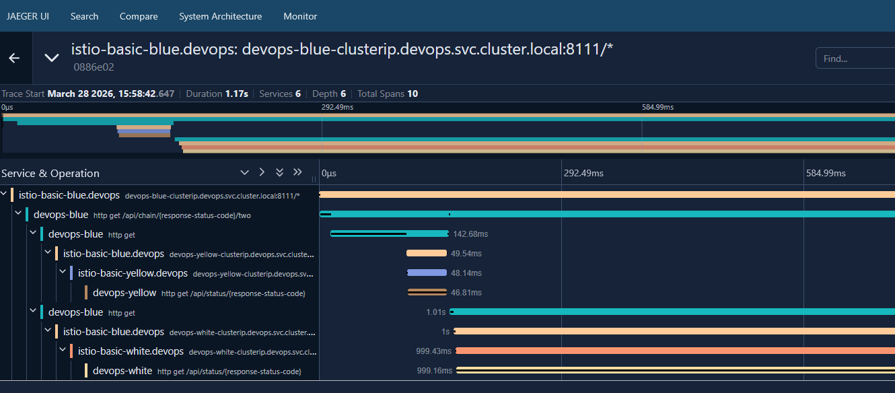
<br>
<br>

Chain 3 Traces:

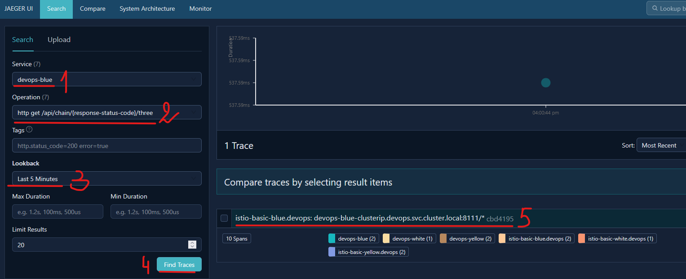
<br>
<br>


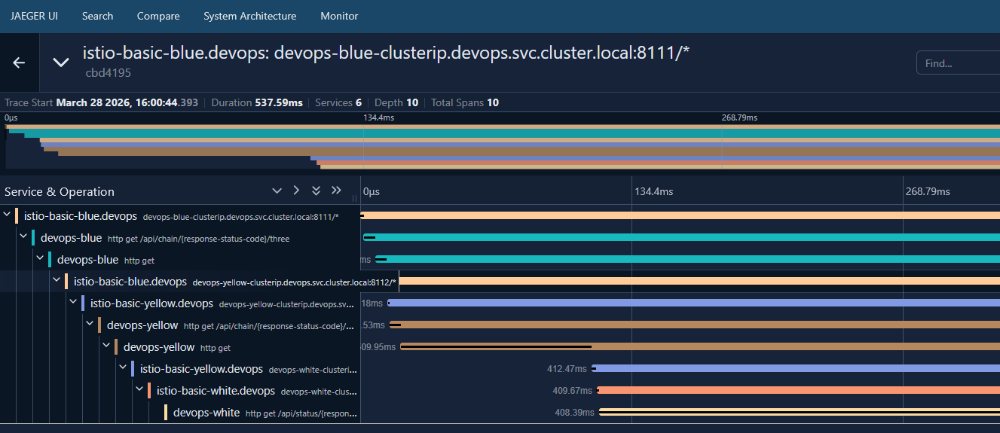
<br>
<br>

Remove the 2.0.1 deployment.

    CMD --> kubectl delete -f devops-istio-basic-deployment-2.0.1.yml

    # result:
    namespace "devops" deleted
    deployment.apps "istio-basic-deployment-blue" deleted from devops namespace
    deployment.apps "istio-basic-deployment-yellow" deleted from devops namespace
    deployment.apps "istio-basic-deployment-white" deleted from devops namespace
    service "devops-blue-clusterip" deleted from devops namespace
    service "devops-yellow-clusterip" deleted from devops namespace
    service "devops-white-clusterip" deleted from devops namespace
    ingress.networking.k8s.io "ingress-istio-basic-haproxy-blue" deleted from devops namespace
    servicemonitor.monitoring.coreos.com "devops-blue-servicemonitor" deleted from devops namespace
    servicemonitor.monitoring.coreos.com "devops-yellow-servicemonitor" deleted from devops namespace
    servicemonitor.monitoring.coreos.com "devops-white-servicemonitor" deleted from devops namespace

[⬆ Back to top](#top)


## 84 Header Propagation With Open Telemetry Sidecar

[⬆ Back to top](#top)

What if we want to trace existing application chain calls but can't modify the application source code to propagate tracing headers? OpenTelemetry also provides automatic instrumentation. We don't change the code. Instead, we can use the OpenTelemetry agent, which runs alongside the application to collect metrics and propagate tracing headers. We will use automatic instrumentation as a sidecar proxy. So, we can have another sidecar proxy in addition to Envoy. 

Ensure the OpenTelemetry operator is installed. At this point, we should already have it from the course about installing Jaeger. Go to the 'open telemetry sidecar' folder. 

Open file devops-open-telemetry-2.0.0.yml. We have a namespace with Istio injection enabled. However, if all you need is Jaeger and OpenTelemetry, this label is not needed. To send telemetry data using OpenTelemetry, we need an Instrumentation object. This object configures automatic instrumentation for applications in the devops namespace. We set the Jaeger service URL. The propagators section defines which context propagation formats to use for distributing the trace context header across services.

The sampler is set to 'parent-based always on'. If a trace has a parent span, it follows the parent's sampling decision; otherwise, it always samples. The Java section specifies the auto-instrumentation configuration for Java applications, including: The container image to use for injecting the OpenTelemetry Java agent. Environment variables that configure the agent to export only traces (excluding metrics or logs) using the OTLP protocol over HTTP with protobuf encoding. The application pods use image version 2.0.0, which does not support header propagation in the source code. 

In the application pods, we only need to add this specific annotation, and the OpenTelemetry sidecar proxy will be injected automatically (line 52 - 53). The rest of the file contains the clusterIP services for the pods and an ingress rule for the blue application.

Apply this file.

    CMD --> kubectl apply -f devops-open-telemetry-2.0.0.yml

    # result:
    namespace/devops created
    instrumentation.opentelemetry.io/otel-instrumentation created
    deployment.apps/istio-basic-deployment-blue created
    deployment.apps/istio-basic-deployment-yellow created
    deployment.apps/istio-basic-deployment-white created
    service/devops-blue-clusterip created
    service/devops-yellow-clusterip created
    service/devops-white-clusterip created
    ingress.networking.k8s.io/ingress-istio-basic-haproxy-blue created

Check the pod. We now have an additional sidecar proxy for OpenTelemetry.

    CMD --> kubectl get pods -n devops 

    # result:
    NAME                                             READY   STATUS    RESTARTS   AGE
    istio-basic-deployment-blue-654cf59bd8-jz9mn     1/2     Running   0          78s
    istio-basic-deployment-white-b78767755-cfjgh     1/2     Running   0          78s
    istio-basic-deployment-yellow-754c965cbb-s5j9j   1/2     Running   0          78s

    CMD --> kubectl describe pod istio-basic-deployment-blue-654cf59bd8-jz9mn -n devops 

    # result:
    ...
    Init Containers:
    istio-init:
        Container ID:  docker://50741bac8ac8c3861b77b724e9e93a0a3dac41fc9b0e55f3119b55a7bc988447
        Image:         docker.io/istio/proxyv2:1.29.1
        Image ID:      docker-pullable://istio/proxyv2@sha256:af6e9eb76266df63c897a93db0e14fd6002080a0586b101ce9531b3f901591dc
        Port:          <none>
        Host Port:     <none>
        Args:
    ...
    opentelemetry-auto-instrumentation-java:
    Container ID:  docker://f2f9aa370c26fb7de37bab50c4a236f1fb407a25bc69da44a8b73fce120715fa
    Image:         ghcr.io/open-telemetry/opentelemetry-operator/autoinstrumentation-java:latest
    Image ID:      docker-pullable://ghcr.io/open-telemetry/opentelemetry-operator/autoinstrumentation-java@sha256:dc0c94818e271f4d24ffe44b6894989c5d9c9d7302289bb8559f17dac7b1b159
    ...

Now, let's see whether the Jaeger tracing is correctly formed. Open Postman in the folder Istio, and access several chain endpoints.

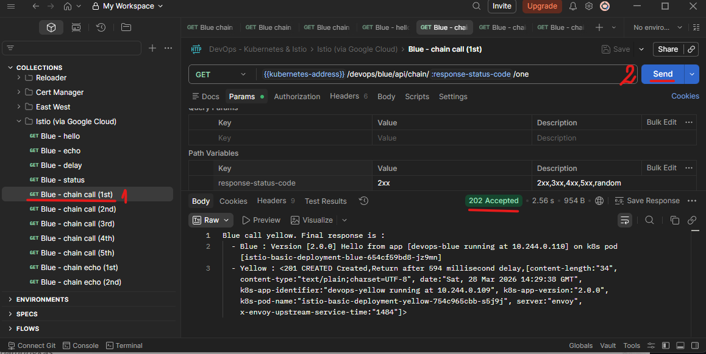
<br>
<br>

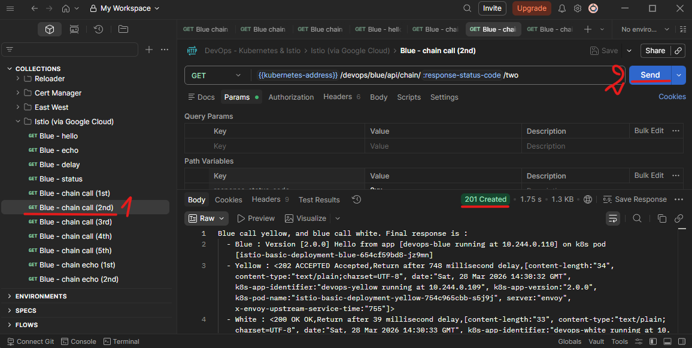
<br>
<br>

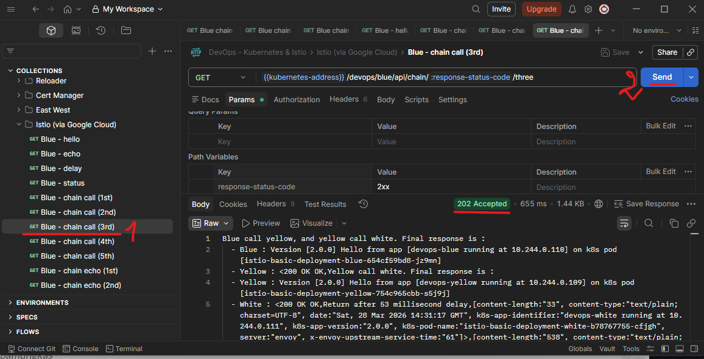
<br>
<br>

Find the trace on Jaeger and open the detail.

Chain call 1:

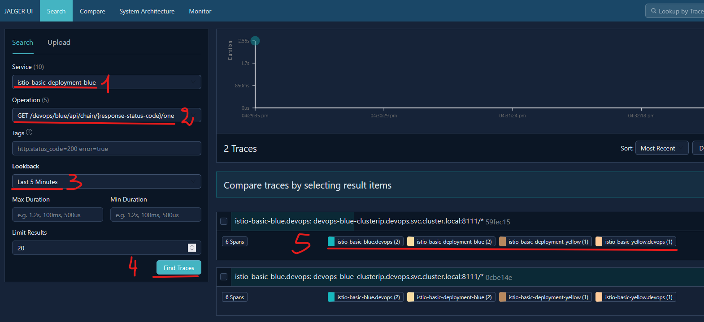
<br>
<br>

We can see that the chain call exists and has a correct relationship. All this without changing a single line of code.

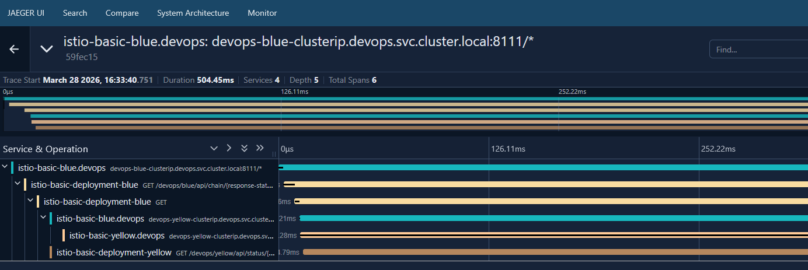
<br>
<br>

Chain call 2:

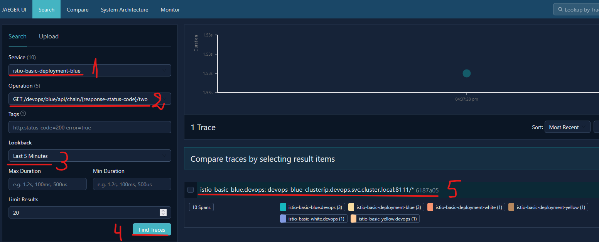
<br>
<br>

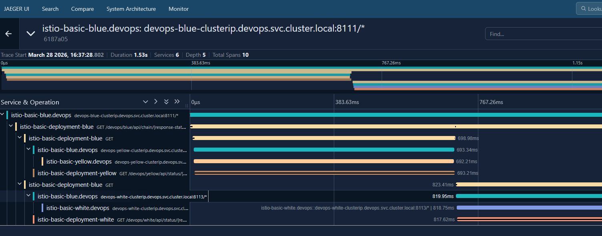
<br>
<br>

Chain call 3:

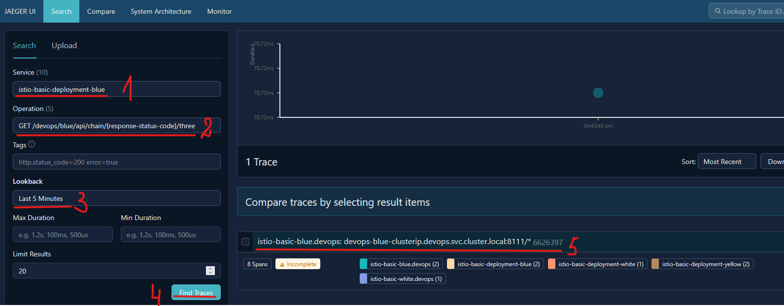
<br>
<br>

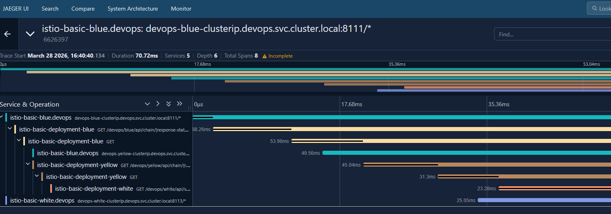
<br>
<br>

[⬆ Back to top](#top)
