# Section 23 Traffic Management Using Istio & Envoy

## Content
- 88 [Traffic Routing](#88-traffic-routing)
- 89 [Istio Traffic Management](#89-istio-traffic-management)
- 90 [Istio Load Balancer](#90-istio-load-balancer)
- 91 [Canary Release](#91-canary-release)
- 92 [Istio Virtual Service](#92-istio-virtual-service)
- 93 [Istio Destination Rule](#93-istio-destination-rule)
- 94 [Dark Launch](#94-dark-launch)
- 95 [Fallacies Distributed System](#95-fallacies-distributed-system)
- 96 [Fault Injection](#96-fault-injection)
- 97 [Fault Injection Delay](#97-fault-injection-delay)
- 98 [Fault Injection Abort](#98-fault-injection-abort)
- 99 [Fault Injection - Conditional Abort](#99-fault-injection---conditional-abort)

We use the created minikube cluster from section 20 Istio Service Mesh for East-West Traffic with installed kube-prometheus stack, HAProxy Ingress Controller, Istio service mesh, cert manager, opentelemtry and Jaeger.

Start the cluster

    bash --> minikube start

Start minikube tunnel and don't close the terminal

    bash --> minikube tunnel

Make sure that address are added to Windows host list

- Open PowerShell as Admin

        PowerShell --> notepad C:\Windows\System32\drivers\etc\hosts

- add

```text
127.0.0.1 localhost
127.0.0.1 jaeger.local
127.0.0.1 kiali
127.0.0.1 blue.devops.local
127.0.0.1 yellow.devops.local           
127.0.0.1 api.devops.local
127.0.0.1 monitoring.devops.local
127.0.0.1 rabbitmq.devops.local
127.0.0.1 chartmuseum.local
127.0.0.1 harbor.local 
127.0.0.1 argocd.local
```

- save the file and exit


<br>
<br>


## 88 Traffic Routing

[⬆ Back to top](#top)

Install Kiali server without login token requirements so we can craete routings

    CMD --> helm upgrade --install kiali-server kiali/kiali-server  --namespace istio-system --create-namespace --values values-kiali-server.yml --version 2.20.0

    CMD --> kubectl apply -f istio-prometheus-telemetry.yml

A powerful feature of Istio is its ability to route east-west traffic based on custom rules. For example, we have two versions of white. Both of these pods are behind the same Kubernetes service. 

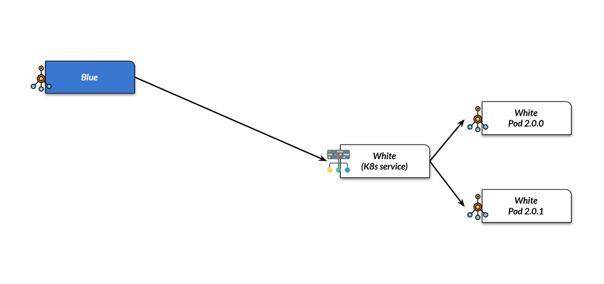
<br>
<br>

Then we define a custom rule. For example, only requests with this specific HTTP header will be redirected to version 2.0.1. 

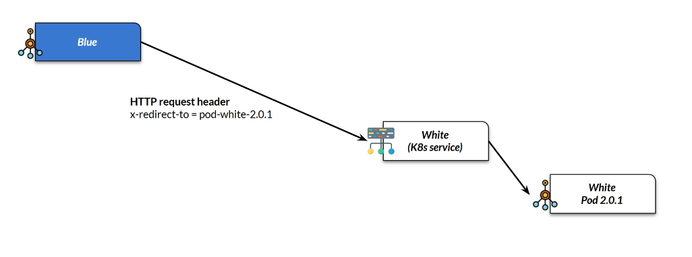
<br>
<br>

Other traffic with a different, but specific request header will be redirected to version 2.0.0. 

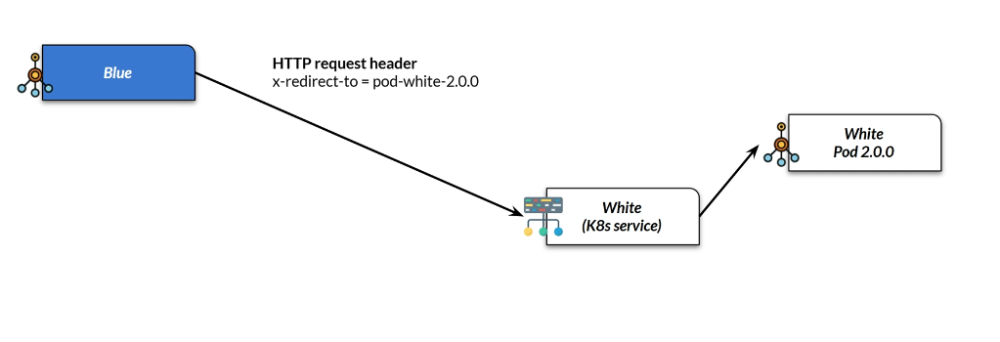
<br>
<br>

Traffic that does not match any rule will be redirected to either version 2.0.0 or 2.0.1.

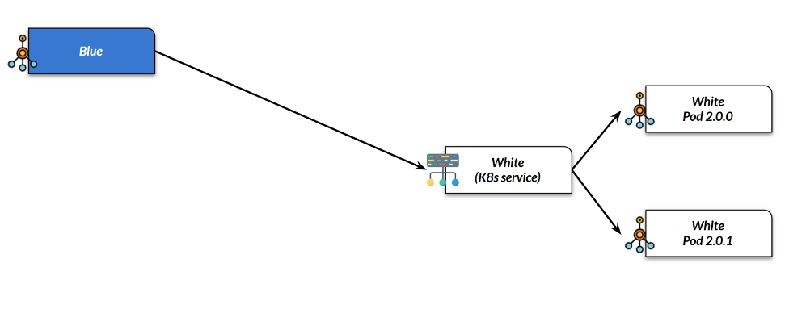
<br>
<br>

Istio uses two objects for routing: 
- destination rule
- virtual service

They are YAML configurations, like any other Kubernetes object. The good news is that we can use Kiali to generate and apply them automatically. Note that the Kiali wizard shown in this course may differ from other Kiali versions. But the concept remains the same. The only thing to notice is that wizards help auto-generate, but we can still, or even might need to, make adjustments, as we will see later in this lesson. 

First, destroy any deployments from the previous lesson to avoid confusion. 

    CMD --> kubectl delete namespace devops

    # result: namespace "devops" deleted

We will deploy white pods, but now with two versions, as in the previous diagram. Open the folder istio-07-traffic-routing, and see that there are two YAML files there. The devops-istio-routing-2.0.0.yml file will deploy the namespace and pod version 2.0.0. Nothing special with this file. File devops-istio-routing-2.0.1.yml also has nothing special. It will deploy pod version 2.0.1 This is a different version. Thus, we will give it a different name. Otherwise, the 2.0.0 pod will be replaced by this YAML, whereas we want to add a version rather than replace it. Make sure the pod has 'istio-routing-white' app label, same as 2.0.0. Also, add a version label since it is required for Kiali to work properly. 

Apply this to both files.

    CMD --> kubectl apply -f devops-istio-routing-2.0.0.yml

    # result:
    namespace/devops created
    instrumentation.opentelemetry.io/otel-instrumentation created
    deployment.apps/istio-routing-deployment-blue created
    deployment.apps/istio-routing-deployment-yellow created
    deployment.apps/istio-routing-deployment-white created

    CMD --> kubectl apply -f devops-istio-routing-2.0.1.yml

    # result:
    deployment.apps/istio-routing-deployment-white-additional created

Then, in the service file - devops-istio-routing-service.yml, there are two kinds of configurations: cluster IP services and ingress. The requirement is that we place any white pod behind the same white service. So, at the white service selector, we will use only one selector to match all white pods.

devops-istio-routing-service.yml

```yaml
apiVersion: v1
kind: Service
metadata:
  namespace: devops
  name: devops-blue-clusterip
  labels:
    app: istio-routing-blue
spec:
  selector:
    app: istio-routing-blue
  ports:
  - port: 8111
    name: http

---

apiVersion: v1
kind: Service
metadata:
  namespace: devops
  name: devops-yellow-clusterip
  labels:
    app: istio-routing-yellow
spec:
  selector:
    app: istio-routing-yellow
  ports:
  - port: 8112
    name: http

---

apiVersion: v1
kind: Service
metadata:
  namespace: devops
  name: devops-white-clusterip
  labels:
    # route to any white, so don't use version
    app: istio-routing-white
spec:
  selector:
    app: istio-routing-white
  ports:
  - port: 8113
    name: http

---

apiVersion: networking.k8s.io/v1
kind: Ingress
metadata:
  namespace: devops
  name: ingress-istio-routing-nginx-blue
  labels:
    app.kubernetes.io/name: ingress-istio-routing-nginx-blue
spec:
  ingressClassName: haproxy
  rules:
  - http:
      paths:
      - path: /devops/blue
        pathType: Prefix
        backend:
          service:
            name: devops-blue-clusterip
            port:
              number: 8111
```

Apply the file 

    CMD --> kubectl apply -f devops-istio-routing-service.yml

    # result:
    service/devops-blue-clusterip created
    service/devops-yellow-clusterip created
    service/devops-white-clusterip created
    ingress.networking.k8s.io/ingress-istio-routing-nginx-blue created

Wait a while until both pods are ready. 

    CMD --> kubectl get pods -n devops

    # result:
    NAME                                                         READY   STATUS    RESTARTS   AGE
    istio-routing-deployment-blue-6df97c9cb-sjr84                2/2     Running   0          4m3s
    istio-routing-deployment-white-5b7c486c9-khw25               2/2     Running   0          4m3s
    istio-routing-deployment-white-additional-868677dcf7-9bppv   2/2     Running   0          3m52s
    istio-routing-deployment-yellow-56bdc7449d-tg7ms             2/2     Running   0          4m3s

Then check that the service recognizes two white pods with different IP addresses. If not, try restarting your deployment. 

    CMD --> kubectl get svc -n devops

    # result:
    NAME                      TYPE        CLUSTER-IP       EXTERNAL-IP   PORT(S)    AGE
    devops-blue-clusterip     ClusterIP   10.111.211.247   <none>        8111/TCP   118s
    devops-white-clusterip    ClusterIP   10.102.190.131   <none>        8113/TCP   118s
    devops-yellow-clusterip   ClusterIP   10.106.209.42    <none>        8112/TCP   118s

Make sure minikube tunnel is up:

    CMD --> minikube tunnel

Open Postman and hit the chain five blue endpoint several times. We should see that some traffic is redirected to version 2.0.0 and some to 2.0.1. This traffic is more like random routing, but we know that the same request will be redirected to one of two pods. 

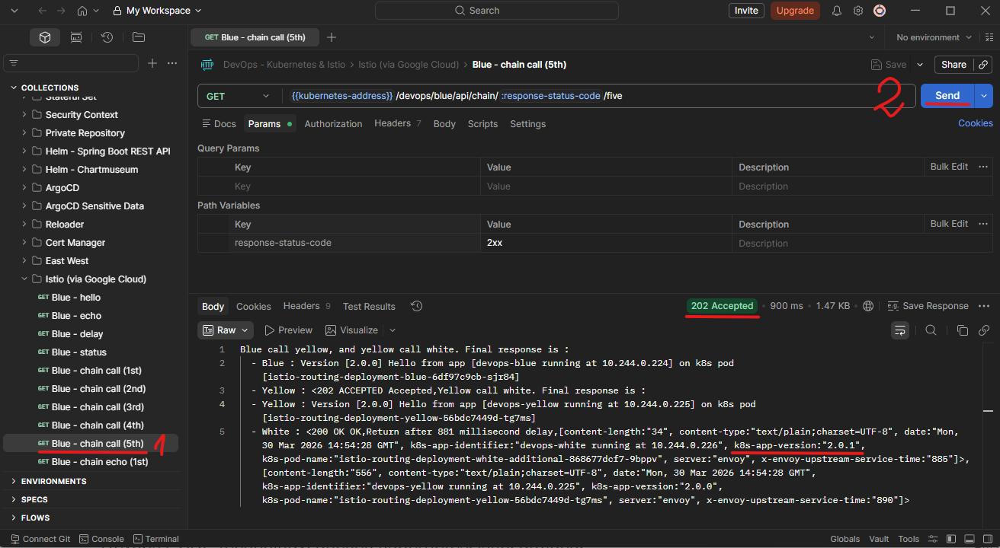
<br>
<br>

Now go to Kiali and open the service menu - https://localhost/kiali. On the white service, we can see traffic flowing into two pods behind it. 

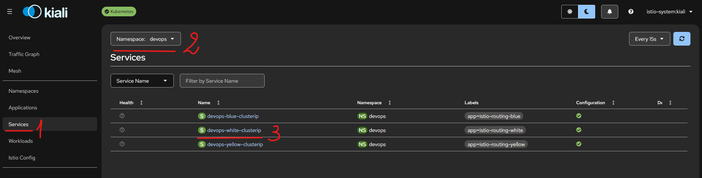
<br>
<br>

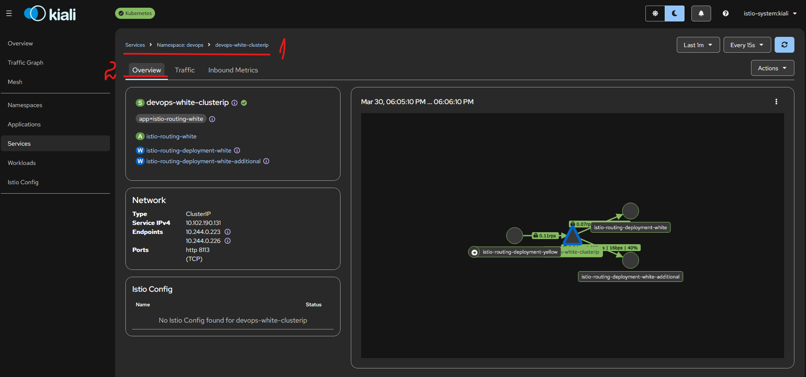
<br>
<br>

We will add a traffic route that redirects traffic with a certain request header to pod 2.0.1. Click the action button. Create a request routing. 

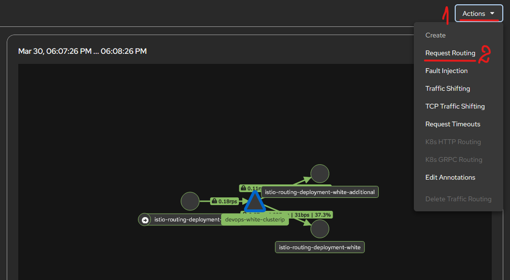
<br>
<br>

We can define one or more parameters as a rule. Or we can define no parameters so that the rule applies to all traffic. In this sample, we will route all traffic with a specific header into 2.0.1. 

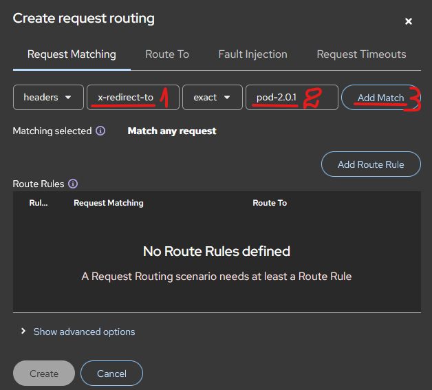
<br>
<br>

This rule is free, with no limitations on header names or anything like that. We can combine the rules as needed. Route 100% traffic that matches the rules into 2.0.1. 

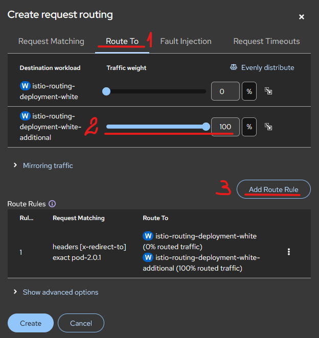
<br>
<br>

For the other specific header, route traffic to version 2.0.0. 

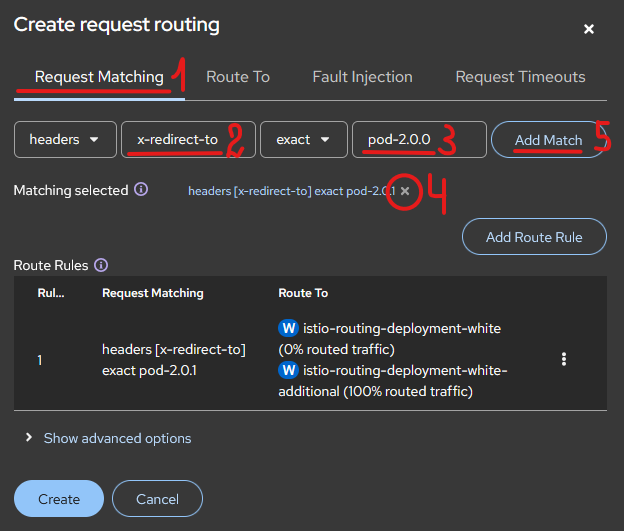
<br>
<br>

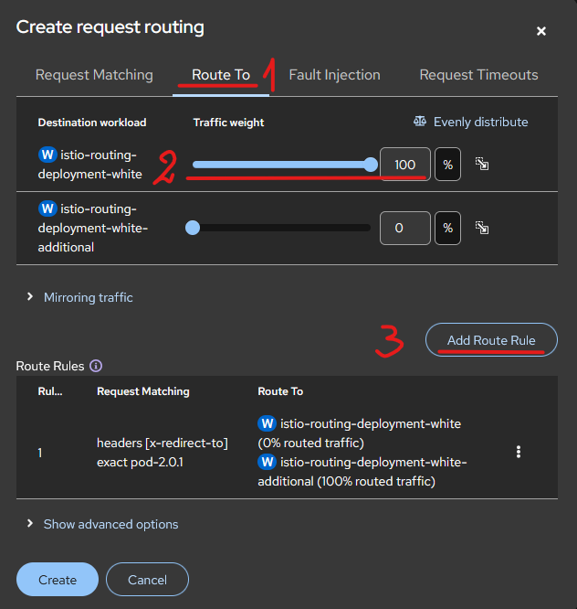
<br>
<br>

The third rule is for the default route when nothing else matches. In this case, we will set 50% of the traffic to 2.0.0 and 50% to 2.0.1.

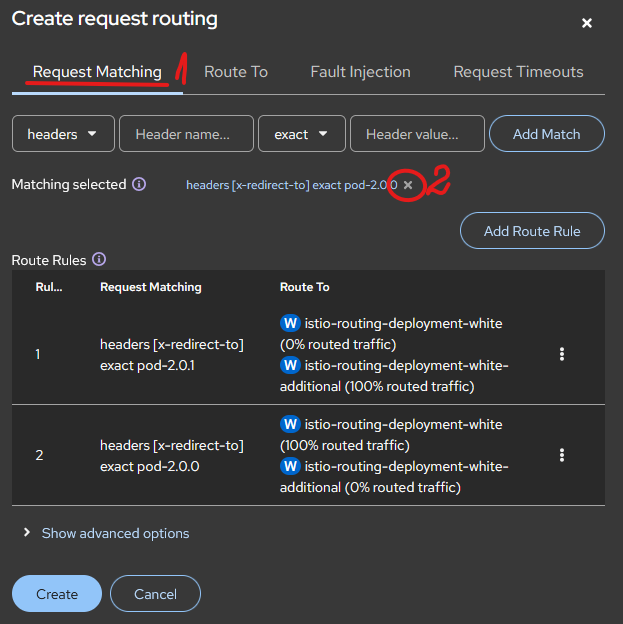
<br>
<br>

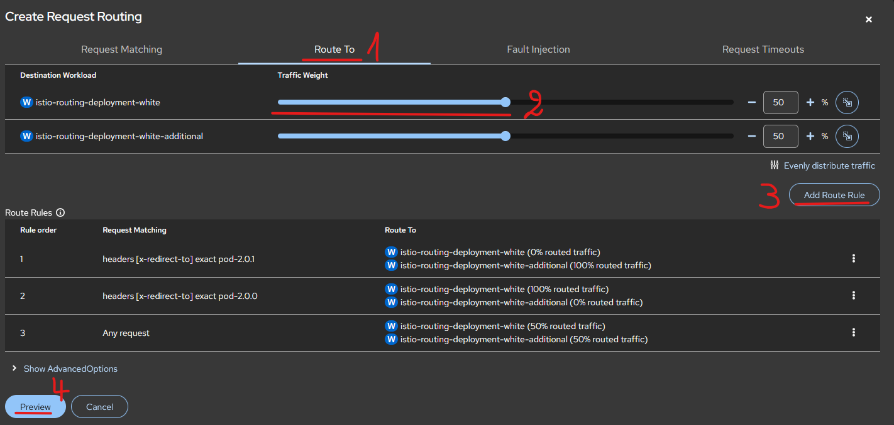
<br>
<br>

Create the rule. As we can see, in the preview, this wizard actually creates a destination rule and a virtual service. We will see more about this later. For now, create it. 

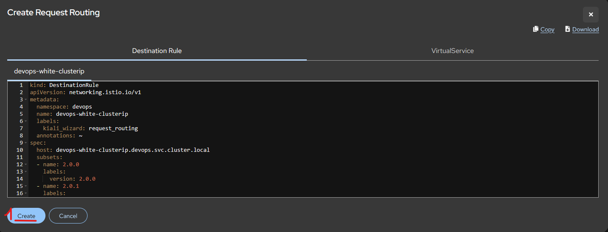
<br>
<br>

And we might get this error. 

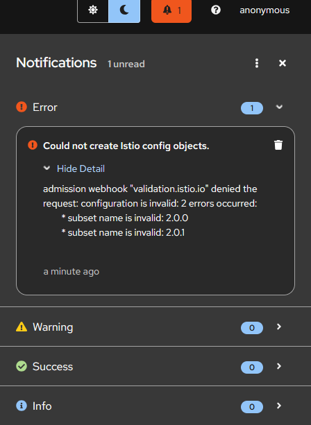
<br>
<br>

And check that we don't have any instance under CRD networking.istio.io. 

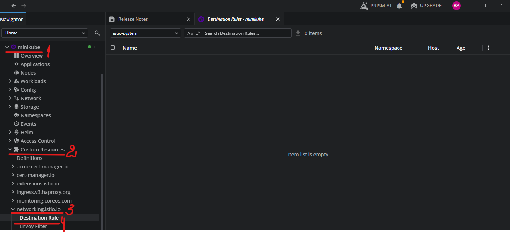
<br>
<br>

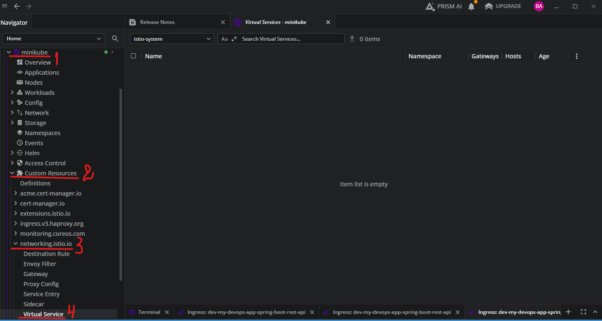
<br>
<br>

To see what happened, let's copy and paste the destination rule and virtual service. After all, they are just a YAML file. 

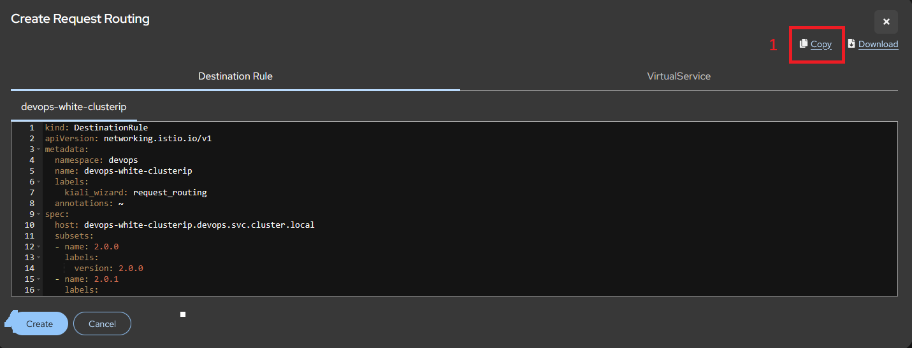
<br>
<br>

Save it in test-istio-preview.yml file

Apply this file manually. And we can see that the name is invalid. The Istio CRD only receives a string as a name. 

    CMD --> kubectl apply -f test-istio-preview.yml

    # result:
    Error from server: error when creating "test-istio-preview.yml": admission webhook "validation.istio.io" denied the request: configuration is invalid: 2 errors occurred:
        * subset name is invalid: 2.0.0
        * subset name is invalid: 2.0.1


    Error from server: error when creating "test-istio-preview.yml": admission webhook "validation.istio.io" denied the request: configuration is invalid: 6 errors occurred:
            * subset name is invalid: 2.0.0
            * subset name is invalid: 2.0.1
            * subset name is invalid: 2.0.0
            * subset name is invalid: 2.0.1
            * subset name is invalid: 2.0.0
            * subset name is invalid: 2.0.1


Return to Kiali and create the same rule. This time, on preview, we will replace this auto-generated value with "old" for 2.0.0 and "new" for 2.0.1. 

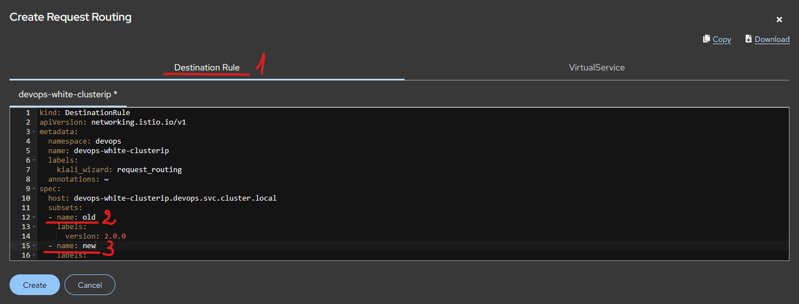
<br>
<br>

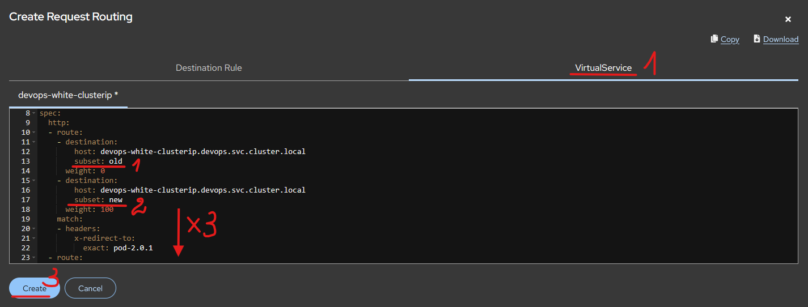
<br>
<br>

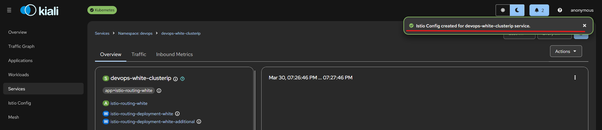
<br>
<br>

Or create them with manifest file

    CMD --> kubectl apply -f test-istio-preview-ready.yml

    # result:
    destinationrule.networking.istio.io/devops-white-clusterip created
    virtualservice.networking.istio.io/devops-white-clusterip created

The configuration was created successfully, as shown under Istio config. 

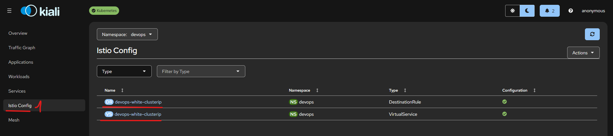
<br>
<br>

Make sure minikube tunnel is up

    CMD --> minikube tunnel

Now go back to Postman. And hit the chain five. When we add a specific header and an exact value, as defined in the Istio config, we will get 100% of traffic routed to the pod as defined in the rule.

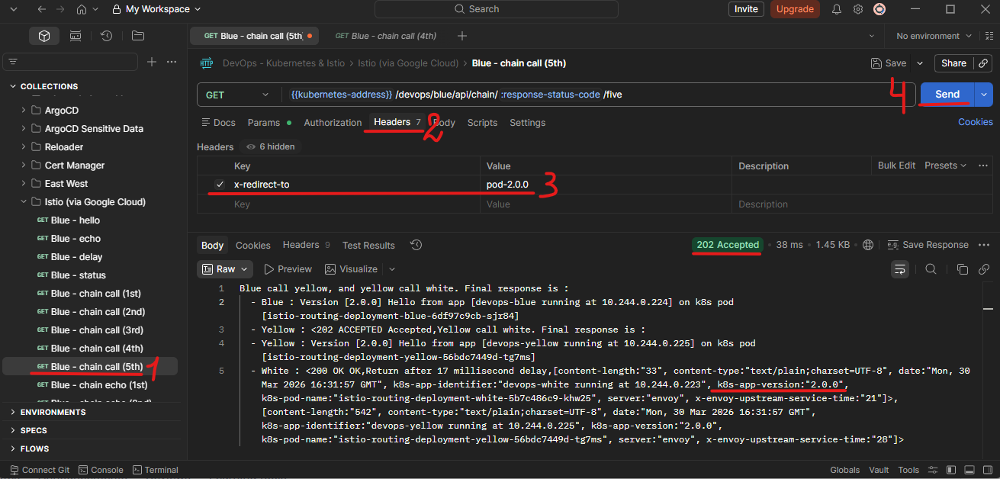
<br>
<br>

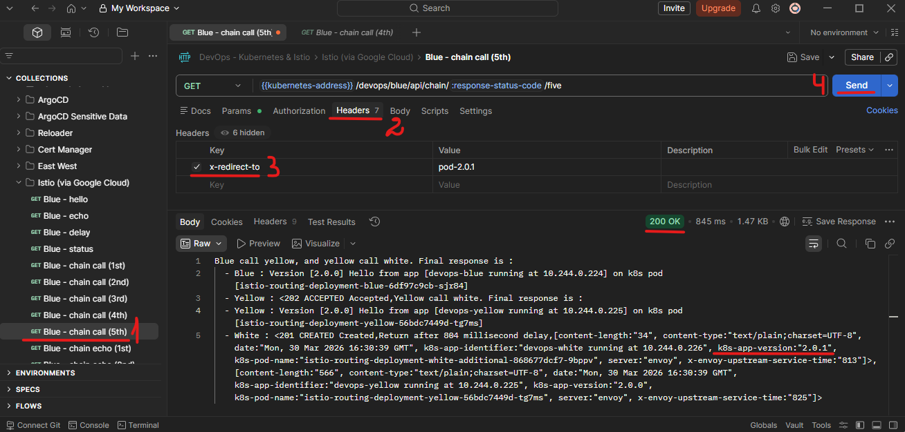
<br>
<br>

But if we don't add any header, the traffic will be split between 2.0.0 and 2.0.1, roughly 50% each.

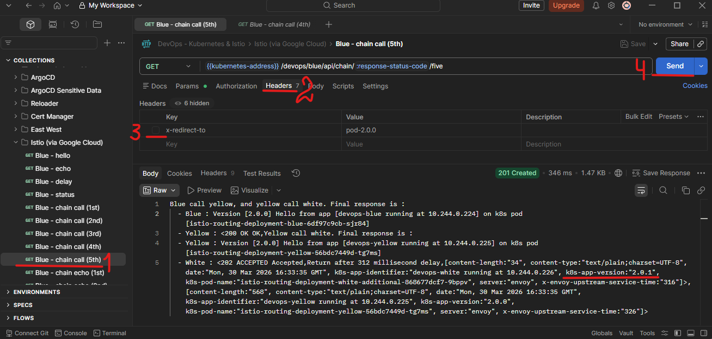
<br>
<br>

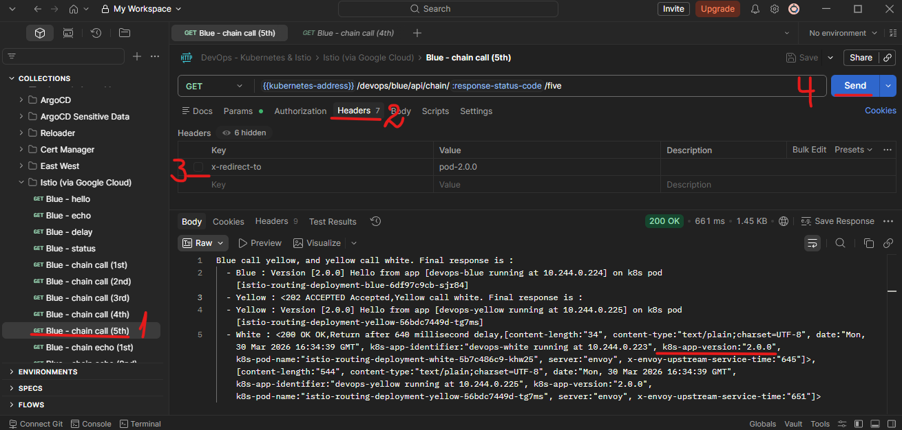
<br>
<br>

[⬆ Back to top](#top)


## 89 Istio Traffic Management

[⬆ Back to top](#top)

How does Istio traffic management work? Why does the traffic change after we set the destination rule and virtual service in Kiali? Remember, Kiali is just a user interface for Istio. Or, more precisely, for the Istio control plane. So the traffic management is due to Istio. 

Remember that each pod, if configured for Istio, will have an Istio sidecar (the Envoy proxy) that intercepts traffic to and from the pod. Istio can discover and manage all Envoy proxies. At all pods, the envoy proxy running inside needs to decide how to connect to other services. Such a decision requires information from Istio. In other words, we can configure the Istio control plane using YAML or Kiali. 

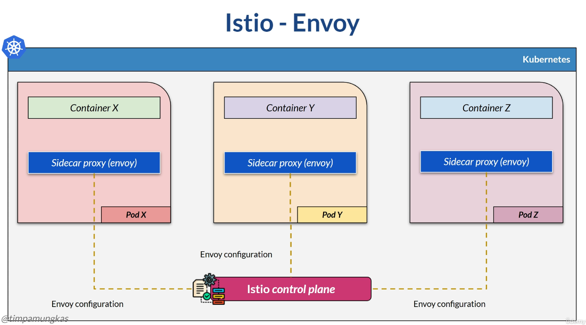
<br>
<br>

Three Istio objects can be involved for traffic management, though in this course, we use only two. 
- The first is a gateway, a load balancer, the first entry point. Think of it as an ingress. In the Istio lesson, we don't use it because we already use Nginx as an ingress controller. 
- Then we have Istio virtual services, which define traffic routing rules for how traffic will flow within the service mesh. During traffic flow, after virtual service, we can add policies using the Destination rule. 

Think of it like this analogy. I live in Indonesia, and I want to send a package. This package is the traffic. I want to send the package somewhere in England. Therefore, I go to a logistics company that can send the package. I can definitely ask the logistics company to send it, and they will deliver. This logistic company is Istio. They sent the packet to England. It arrives through an airport, an entry point to England. The airport is the gateway, the first entry point for traffic to reach its destination. The airport receives a package from outside England, or, in other words, the gateway receives traffic from outside the service mesh. The package was then sorted using a mechanism such as a postal code. Based on this mechanism, the logistics company knows whether this package must go to London, Liverpool, or another city. In Istio, this mechanism can be an HTTP header, method, URL, or any other parameter. In this step, we sort and define where the package must go. This sorting mechanism is Istio Virtual Service. The logistics company also needs to know the destination city and whether the package needs to be delivered to London, Liverpool, or another location. They might know this based on the postal code. Now that the logistics company knows where traffic must go, it's time to define how it gets there. The company has a fleet of delivery trucks. They need to put the package into a matching truck bound for a particular city. They can also define policy while sending to the destination. For example, the package must go round-robin among trucks. The same goes for the destination rule, where we can also define policy, such as how load balancing works, whether we use TLS for traffic, etc. This entire configuration will be pushed to the logistic branches that need it. These logistic branches are the envoy proxies.

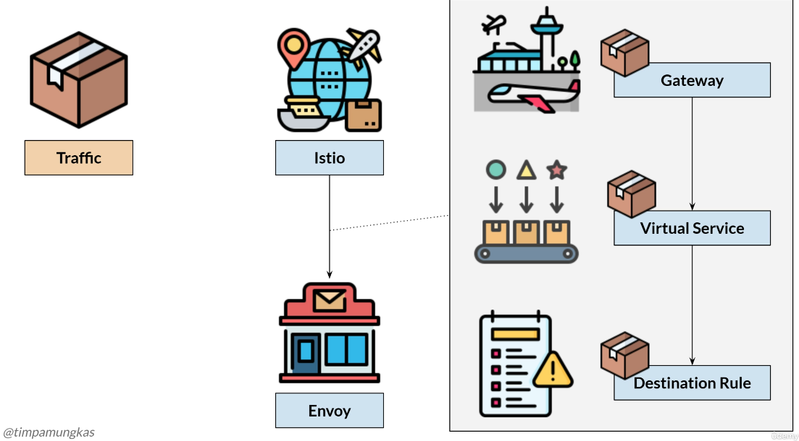
<br>
<br>


[⬆ Back to top](#top)


## 90 Istio Load Balancer

[⬆ Back to top](#top)

As we have learned, a load balancer can distribute traffic. If we have more than one replica, it is a good idea to distribute the traffic among them. With Istio and Envoy, we can also configure how load balancing works. There are several load-balancing algorithms available for the Envoy proxy. These are called a simple load balancer. 
- Round robin is a simple algorithm. If we have several replicas, traffic will be sent to the first, second, third, and so on. If it has already reached the last replica, the next traffic is sent to the first replica, and the loop repeats. 
- Istio also provides "random", which directs traffic to a random healthy host. 
- And then there is the least request, also known as the least connection. In this method, Istio estimates which pod replica is the least busy (the one currently serving the fewest clients) and directs traffic to it. In many scenarios, this method is the preferred configuration over round-robin. 

Istio also provides more advanced load balancing, including consistent hashing. For a given request item, traffic will always be routed to the same pod as long as the item's value remains the same. This method is sometimes known as sticky load balancing. The request items currently supported are: HTTP header, cookie, source IP address, and query parameter.

We can see the detailed parameters to use in the Istio destination rule documentation - . There are two possible load-balancing algorithms: simple or consistent hashing. Let's see some of them. Start with the simple - https://istio.io/latest/docs/reference/config/networking/destination-rule/#LoadBalancerSettings-SimpleLB. We will load balance on the yellow, so every call to the yellow (which, in this demo, is coming from blue) will be load-balanced.

Remove all deployments and Istio configuration to ensure we start fresh.

    CMD --> kubectl delete namespace devops

    # result: namespace "devops" deleted

Open the folder istio-load-balancer. In devops-istio-load-balancer.yml file, we create a blue, yellow, and white pod. The yellow pod has three replicas. Then the cluster IP and ingress.

Apply this file.

    CMD --> kubectl apply -f devops-istio-load-balancer.yml

    # result:
    namespace/devops created
    deployment.apps/istio-load-balancer-deployment-blue created
    deployment.apps/istio-load-balancer-deployment-yellow created
    deployment.apps/istio-load-balancer-deployment-white created
    service/devops-blue-clusterip created
    service/devops-yellow-clusterip created
    service/devops-white-clusterip created
    ingress.networking.k8s.io/ingress-istio-load-balancer-nginx-blue created

Make sure minikube tunnel is up

    CMD --> minikube tunnel

Now open Kiali - https://localhost/kiali/ and add request routing to the yellow service. 

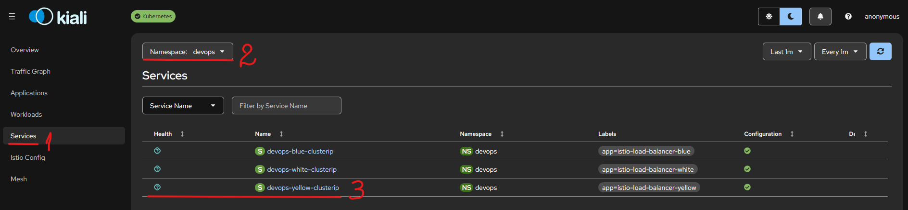
<br>
<br>

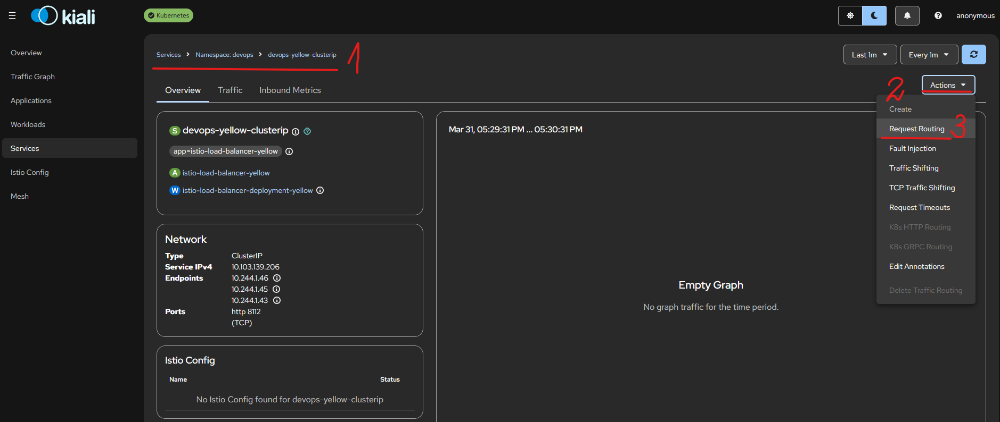
<br>
<br>

Let's see the setting. Remember that this is only YAML, which you can type yourself if you don't want to use the Kiali wizard. Open the advanced menu on request routing and see the traffic policy. We will try a simple round-robin load balancer.

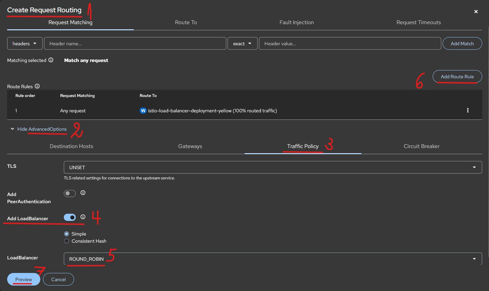
<br>
<br>

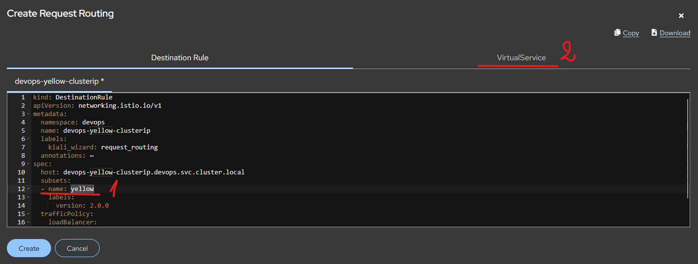
<br>
<br>

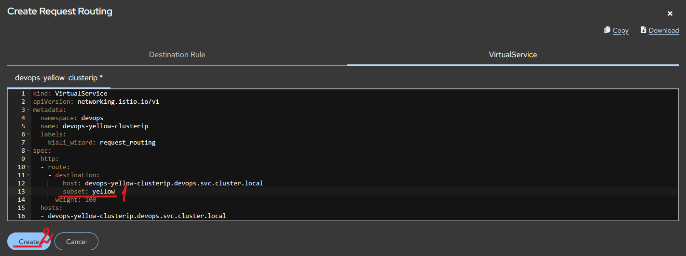
<br>
<br>

Back to Postman and hit "Blue chain call 1" several times. Notice that the IP addresses from yellow follow a pattern: first IP, second IP, third IP, back to first IP, and repeat. In other words, the round robin to yellow works.

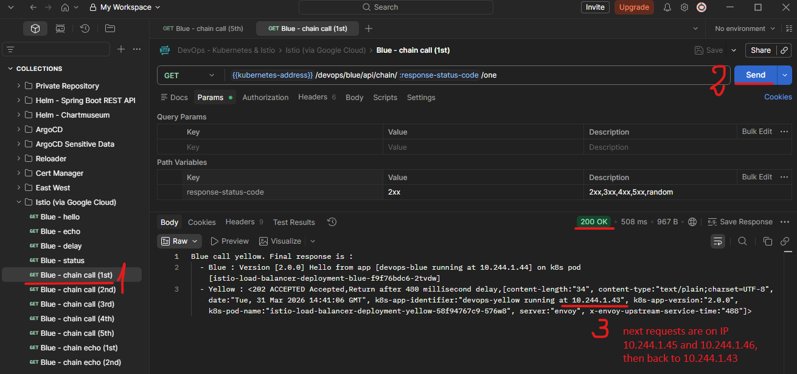
<br>
<br>

Now, let's see a demo of using another algorithm, such as random or least-requested. First delete the created configurations

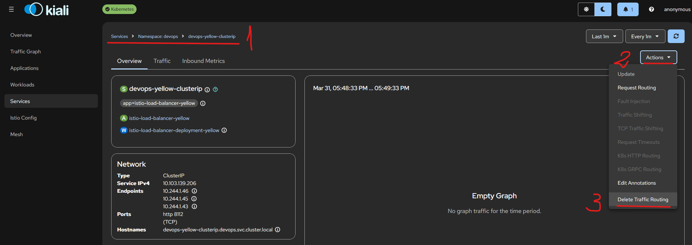
<br>
<br>

We can easily change the configuration. For example, let's use random, which means the pattern should not be predictable, unlike round robin.


<br>
<br>

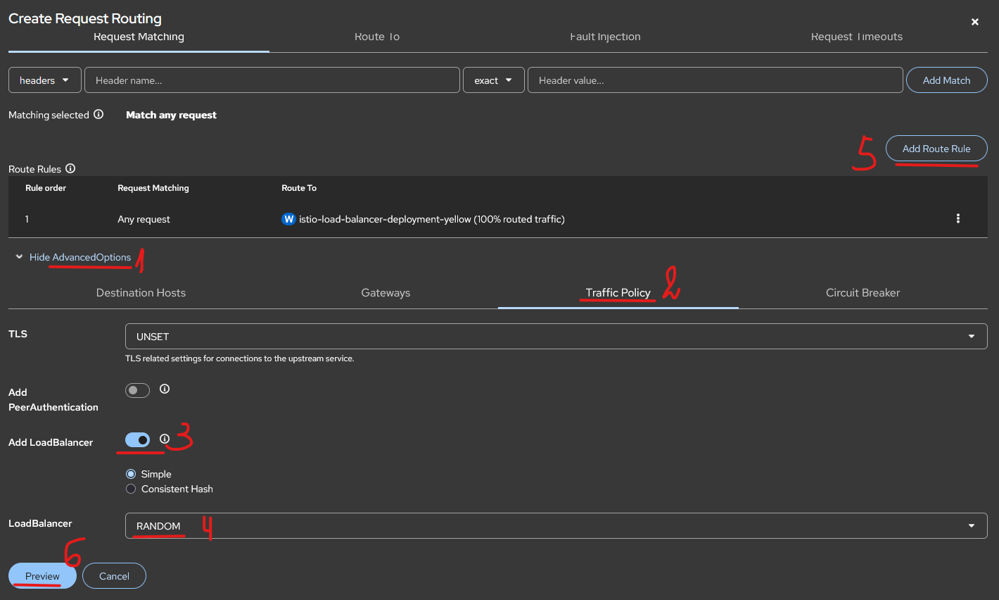
<br>
<br>


<br>
<br>


<br>
<br>

Try it with Postman and examine that the yellow IP address is now random.

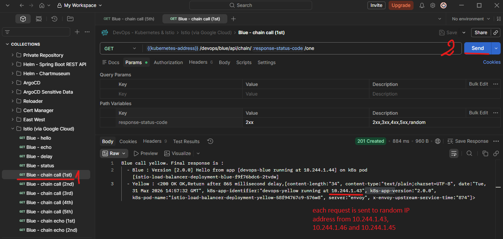
<br>
<br>

Let's talk about consistent hash - https://istio.io/latest/docs/reference/config/networking/destination-rule/#LoadBalancerSettings-ConsistentHashLB. Let's start with the source IP address. We have three pod replicas behind a Kubernetes service with an Istio destination rule configured for a load balancer using a consistent hash. We have some items on request, and in this sample, we will use the source IP, which is the IP address of the client that originated the request. Consistent hashing hashes the item (simply put, it calculates it using an algorithm), so the same input always produces the same output. So if this purple client sends a request, Envoy will produce this purple hash. Notice that this is only a sample; the actual hash will be longer and might not be readable text. 

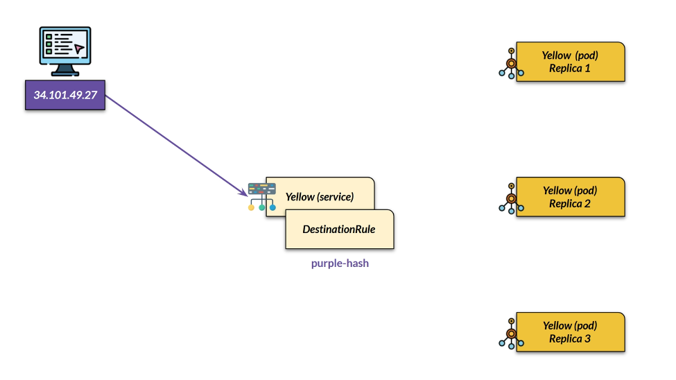
<br>
<br>

The concept is that giving a purple input will always produce a purple hash as output. Istio, or Envoy to be exact, will remember this hash and route all traffic with the same hash into a certain pod, say replica 3. No matter how many times the request comes, as long as it comes from a purple source IP, it will produce an exact purple hash and will always be routed to replica 3. 

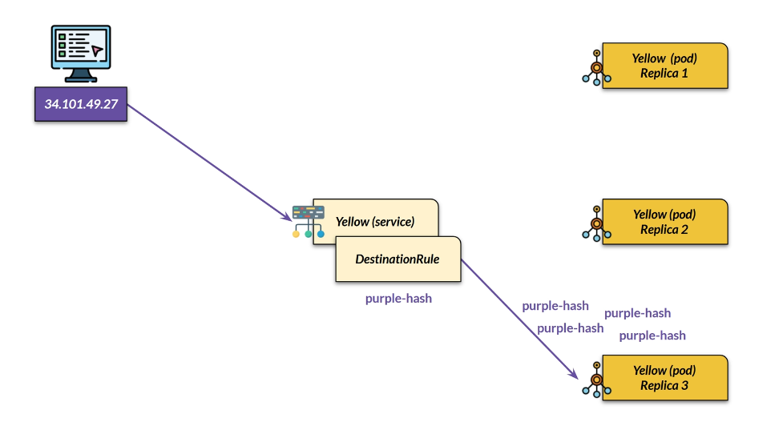
<br>
<br>

Then there is a pink client with a different source IP address. A request from a pink client will produce a pink hash. Which, in turn, will always be routed to a certain pod, for example, replica 1. And all requests with the same pink hash will always go to replica 1.

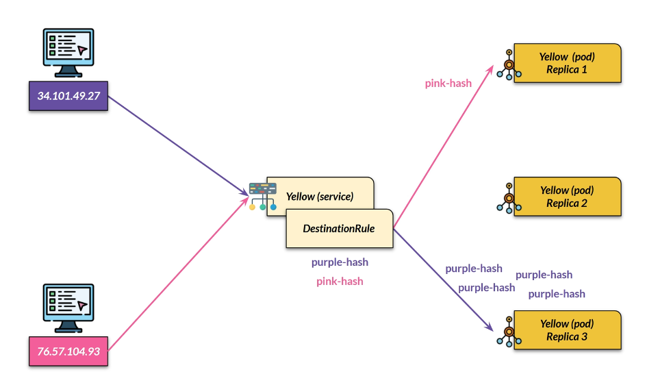
<br>
<br>

What if there is an orange client that produces orange hash? It will be routed, but not necessarily to replica 2, which, in this example, does not contain any hash entries. It might also be routed to pod replica 1, so all requests with the orange hash go to replica 1. The algorithm for this routing is Envoy internal: it maps each pod replica (or host) to a value and uses a consistent hash ring. 

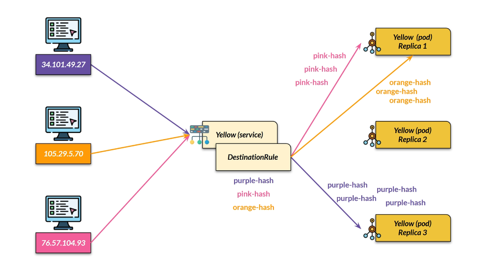
<br>
<br>

All possible items (request header, cookie, source IP, or query parameter ) use the same concept. For example, we can use the HTTP header as a hash value. We have only a purple client, but each request generates X-my-header with either a black or a red header value. So the hash is now calculated based on the header value, meaning it generates either a black or a red hash. And all requests with the same hash value will always be routed to the same pod. It can even be this way, where each hash maps to the same pod. Istio determines this routing, but one thing is for sure: each hash will always be served by the same pod. 

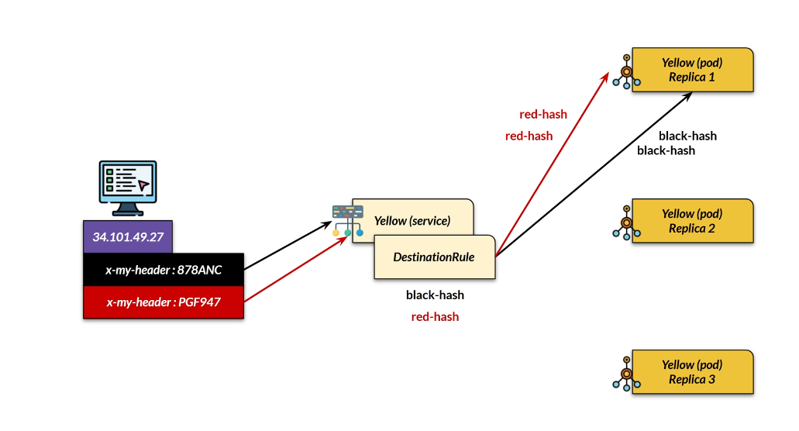
<br>
<br>

Let's try a consistent hash load balancer. First, delete the destination rule and virtual service.

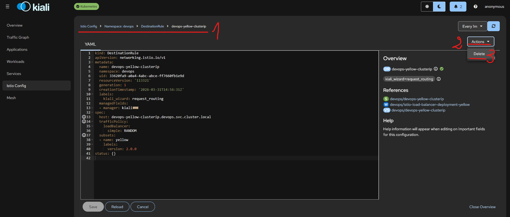
<br>
<br>

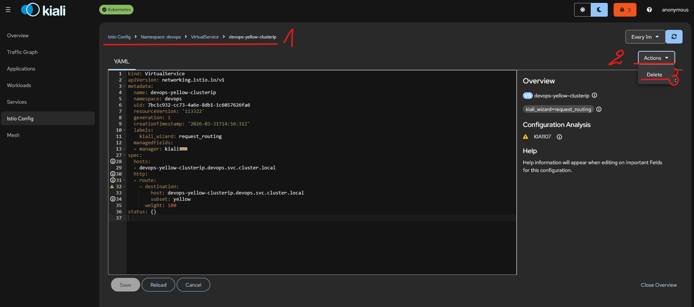
<br>
<br>

Then, create a new request routing on the yellow service.


<br>
<br>

Use a traffic policy load balancer, this time using consistent hash. Use http header. We can use any header name, but please use the exact name later during the request (x-my-header). Create the routing configuration.

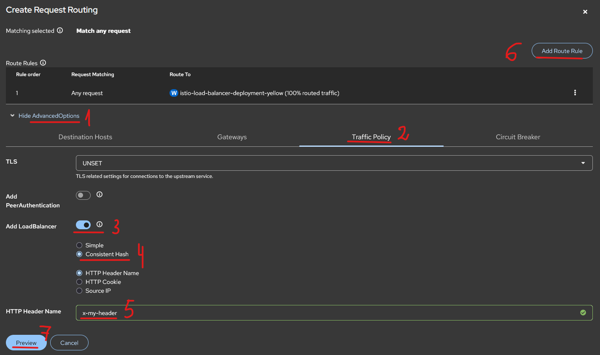
<br>
<br>


<br>
<br>


<br>
<br>

Now, hit the blue chain one endpoint with the exact header key defined in the traffic policy. Give the header any value. Now, if we hit this endpoint, no matter how many times, the same pod IP address will always handle the request.

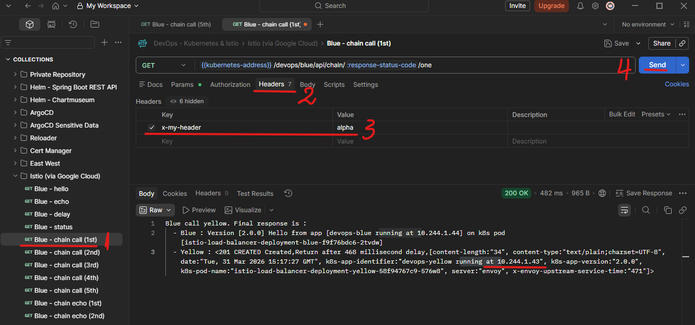
<br>
<br>

But when we change the header value, the pod IP address might change. If it isn't changed, please try the other header values.

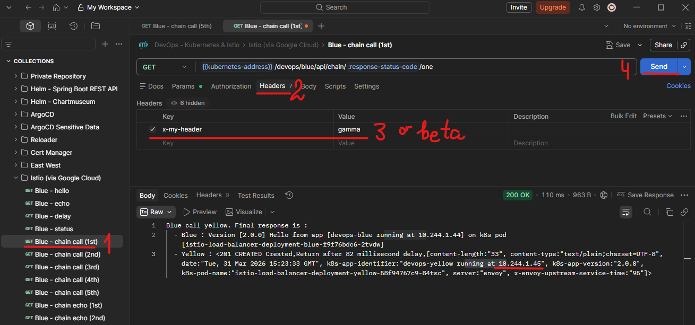
<br>
<br>

Please note that in this course, you can also try blue-call consistent hash. I set the blue so that each HTTP request header received by blue is passed to yellow. Therefore, the HTTP header consistent hash will also work for the blue-yellow call in this course. In real life, you need to implement your own headers, cookies, etc., for passing when needed.


[⬆ Back to top](#top)

## 91 Canary Release

[⬆ Back to top](#top)

One way we can leverage Istio traffic management is for a canary release. A Canary release is a way to release new features to only a subset of users. A simpler explanation is that we have old and new features. We route traffic x% to the old feature and y% to the new feature. Of course, x + y must be equal to 100. At the beginning, it might be 90% traffic to the old feature and 10% to the new feature, because we are not sure whether the new feature is stable or better. As the new feature matured, we gradually reduced the old feature's traffic to 70%, 50%, and 30%, while the new feature's traffic increased. And finally, 100% traffic is routed to the new feature. This gradual shift in traffic towards the new release is the canary. We can do this in Istio and use Kiali to help us set it up.

Can we do a canary release without Istio? Just using plain Kubernetes? The answer is: yes, we can. The Kubernetes service will distribute traffic in a round-robin fashion. Not the exact distribution, but if we have 2 pods, each will serve around 50% of the traffic. If we have 4 pods, each will serve around 25% traffic, etc. 

How can we do a canary release on plain Kubernetes? 

Suppose we have service pink with only one pod behind: pink version 1, so 100% of the traffic will go there. But then we have pink version 2, which we want to be a canary release. If we want 50% traffic routed to version 1 and 50% traffic to version 2, We need to add one pod version 2. But if we need to lower traffic to version 2 by 25%, we need 3 pods of version 1. 25% is a quarter, so we need 1 pink version 2 and 3 pod version 1 to make the round-robin calculation work at roughly 25%. So if we need 10% traffic to go to version 2, we need a total of 10 pods, with 1 pod for the pink version 2, to maintain the percentage. See the problem? We have so many pods.

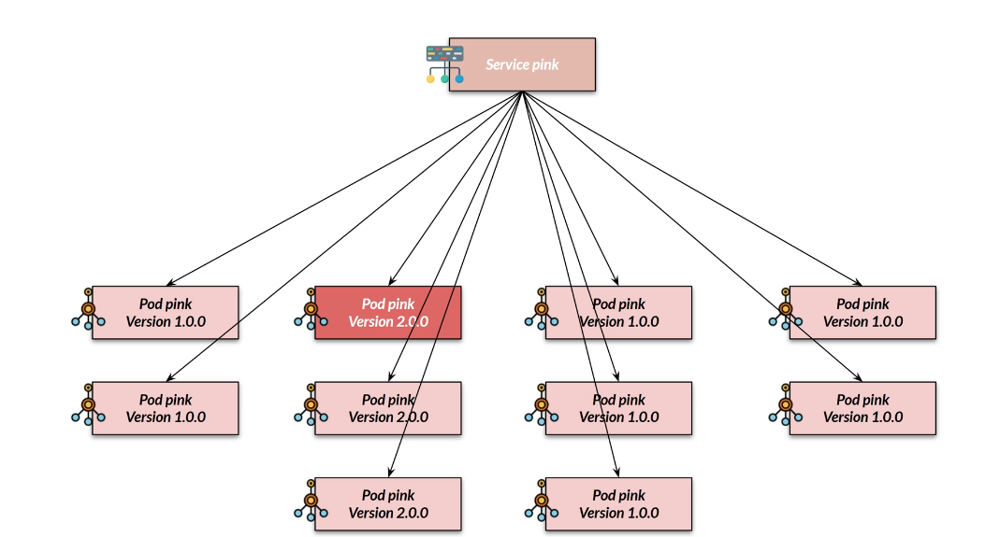
<br>
<br>

It is easy to provision a pod. We need to change the replica count. The problem is, each pod will require resources. If we have many pods and traffic increases only slightly, some of them might be underutilized. If we only have low traffic, what is the point of having 6, 7, or 8 pods, other than maintaining a percentage for canary? If each pod book resources, having multiple underutilized pods means We might need to add another Kubernetes node while those pods are mostly idle. 

This case is where Istio can help. Istio traffic management allows us to divide traffic by percentage. For simplicity, let's say it's low traffic, so we only need one pod version 1 and one pod version 2. If we want to start small (for example, only 10% of traffic goes to version 2), we can add an Istio virtual service on pink and a destination rule to split traffic based on the percentage. Istio will then split traffic: 90% to version 1 and 10% to version 2, using only 2 pods. 

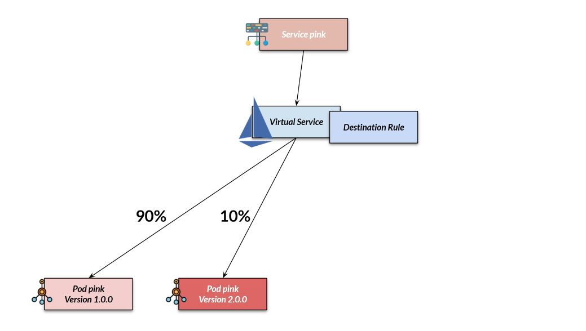
<br>
<br>

We can adjust the percentage as needed, such as 77% to version 1 and 23% to version 2. We only need to adjust the Istio percentage, and we still use two pods. 

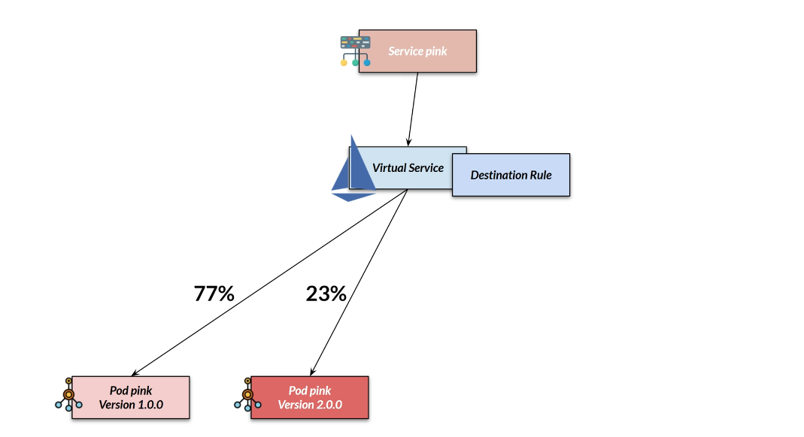
<br>
<br>

If we have 3 version 1 pods and we want to split traffic, say, 10% to version 2, we don't need to do any calculations. We only need to tell Istio the percentage, and it will split them. 

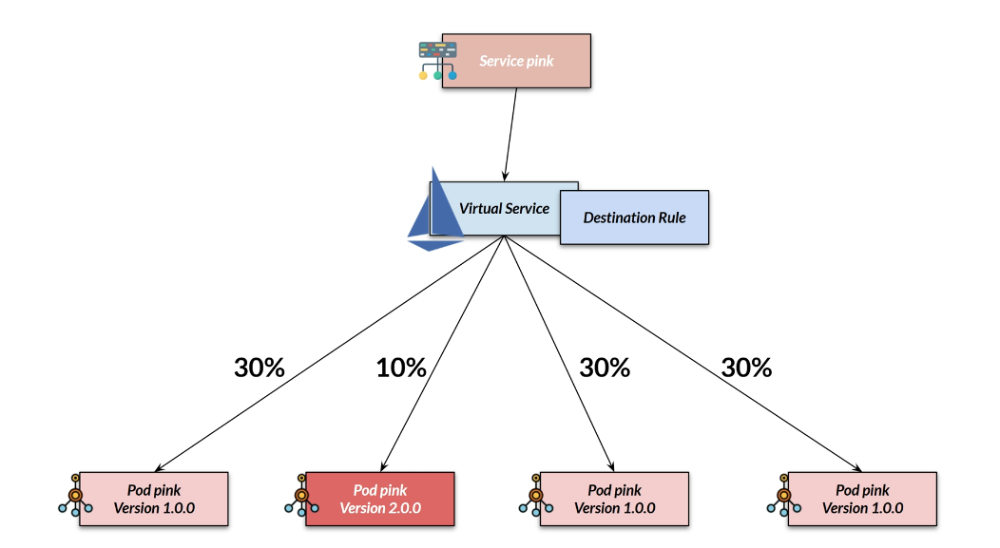
<br>
<br>

Even if the condition is now reversed (such as having 3 pods, version 2, and wanting to send 60% of traffic to version 2), we only need to ask Istio.

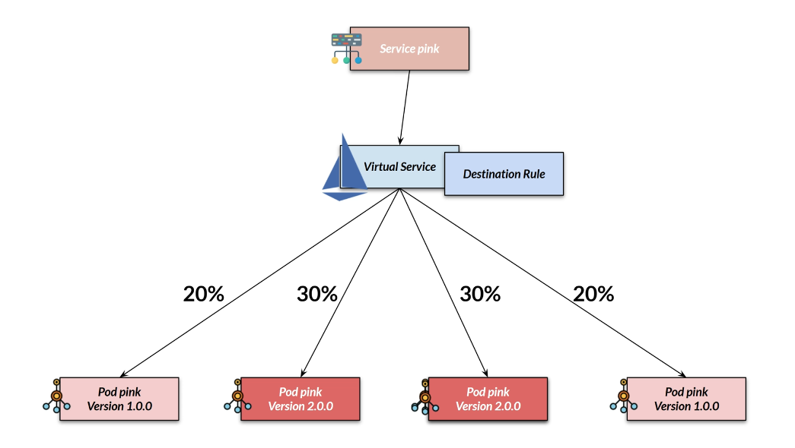
<br>
<br>

First, delete all existing deployments in the devops namespace so we can start fresh.

    CMD --> kubectl delete namespace devops

    # result: namespace "devops" deleted

Also, delete all Istio configuration for the virtual service and destination rule. 


<br>
<br>

Then open the course folder istio-canary. Open the DevOps 2.0.0. This configuration is a standard Kubernetes file that deploys blue, yellow, and white pods. In a later scenario, we will deploy white version 2.0.0 and white version 2.0.1. So the canary will be on white release.

Apply the file

    CMD --> kubectl apply -f devops-istio-canary-2.0.0.yml

    # result:
    namespace/devops created
    deployment.apps/istio-canary-deployment-blue created
    deployment.apps/istio-canary-deployment-yellow created
    deployment.apps/istio-canary-deployment-white created

Then open version 2.0.1. Ensure this deployment has a different name than the previous 2.0.0 deployment. Otherwise, this will replace that deployment. In here, I deploy white with version 2.0.1. I added a label here that differs from the 2.0.0 version so that we can see the version in Kiali. Use a newer white container image, version 2.0.1. We will deploy 2 replicas of the pod white here. This multiple replica is not a requirement. It's to show that we don't need to calculate the canary percentage, no matter how many pods are available.

Apply this file.

    CMD --> kubectl apply -f devops-istio-canary-2.0.1.yml

    # result: deployment.apps/istio-canary-deployment-white-new-release created

Now see the devops-istio-canary-service.yml file. This configuration will create Kubernetes services for each pod. Notice that on the white selector, we use a simple selector. Hence, this service will redirect traffic to any pod with this particular label. So it will be white pods, with any version. And we only open ingress to blue.

Apply this file.

    CMD --> kubectl apply -f devops-istio-canary-service.yml

    # result:
    service/devops-blue-clusterip created
    service/devops-yellow-clusterip created
    service/devops-white-clusterip created
    ingress.networking.k8s.io/ingress-istio-canary-nginx-blue created

Ensure we have 3 white pods: 1 pod is version 2.0.0, and 2 pods are version 2.0.1.

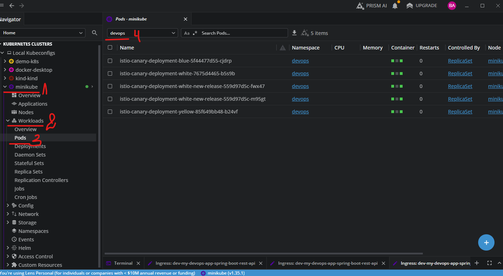
<br>
<br>

Check the service, especially white service, and make sure it redirects traffic to the three pods.

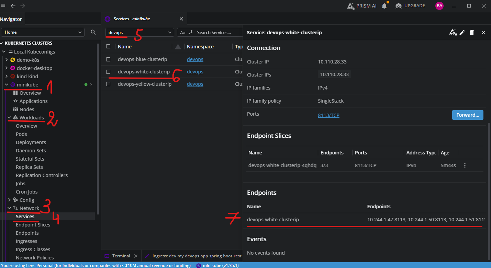
<br>
<br>

Make sure minikube tunnel is up:

    CMD --> minikube tunnel

Make sure minikube tunnel is up:

    CMD --> minikube tunnel

Now open Postman and call chain call two, or use another chain call. We can use whichever one has white on the chain call. Hit several times, and we will see that more traffic went to version 2.0.1, since we have two pods there and only one on version 2.0.0. It may not be exactly two-thirds of traffic, as the default Kubernetes service distributes traffic somewhat randomly. But the key point is that we got more traffic from white 2.0.1 because it has 2 pods.

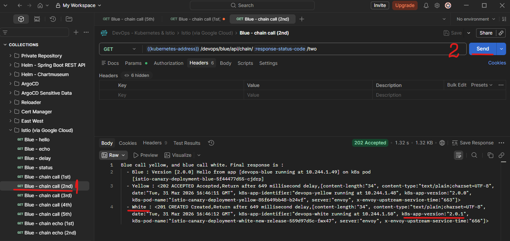
<br>
<br>

Let's start with only 10% traffic going to 2.0.1. How do we do that? Let's run a Postman collection that has traffic to the white service. This demonstration is just for illustration.

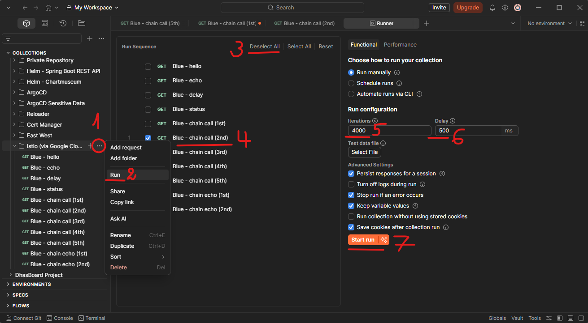
<br>
<br>

Wait a few minutes while Kiali gathers enough data to build the graph. 

Open Kiali - http://localhost/kiali/ and open Graph. Let's change the time range to last 30 minutes. The default should be on a versioned app graph, so we should have something like this. If it does not like this, choose the versioned app graph and reset the layout to factory settings.

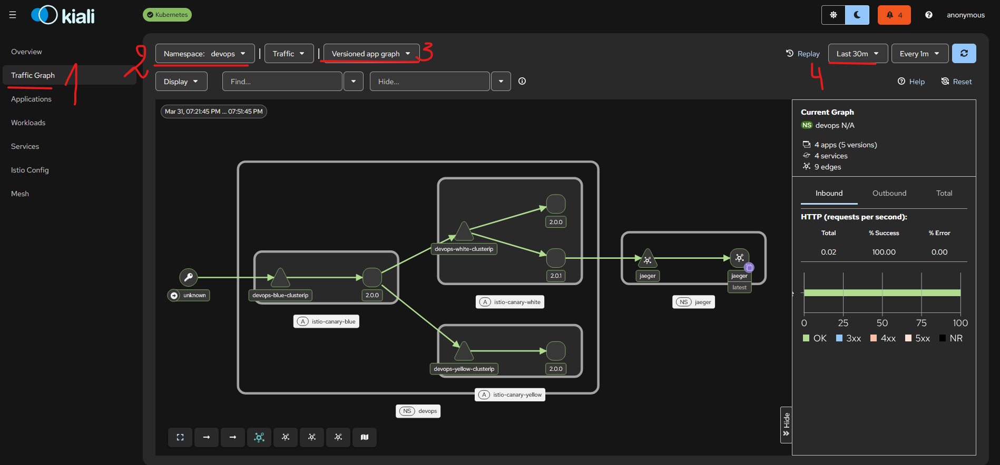
<br>
<br>

Let's hide the GRPC traffic. By hiding it, we can focus on the HTTP request flow here. Focus on this white block.

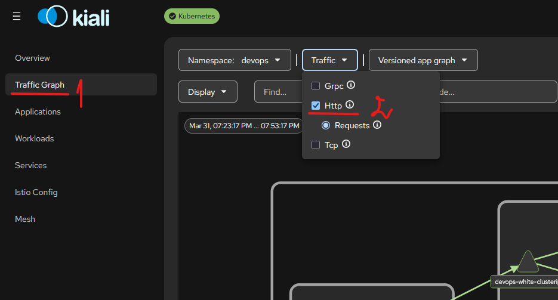
<br>
<br>

In here, we can see that there are actually two versions of white behind the service. If we display traffic animation and traffic distribution, it will show that the split is 50% between the two versions. But since we have two pods on 2.0.1, we get more responses from it. 

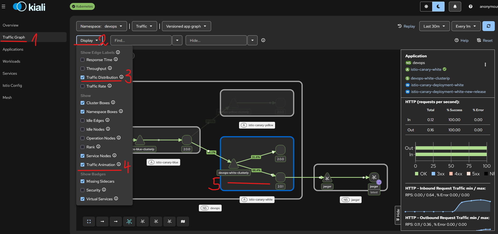
<br>
<br>

We can switch to another graph type to see the layout. To show the app and version, we need to put the correct label on the Kubernetes deployment. Let's configure the canary release. This means we need to add a traffic route to the white service. Go to the white service and add it. 

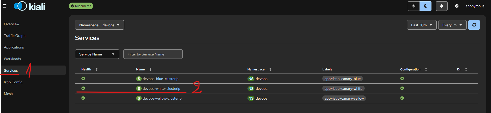
<br>
<br>

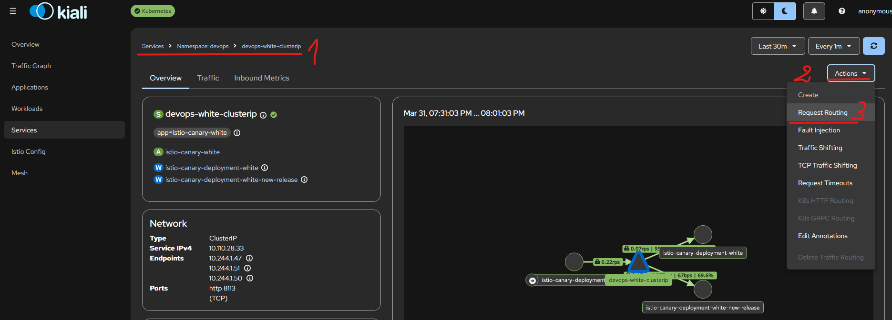
<br>
<br>

We want to split traffic: 10% to the new white version 2.0.1 and 90% to the old white version 2.0.0. We don't set any parameters, so there's no rule. We only adjust the percentage as needed. 

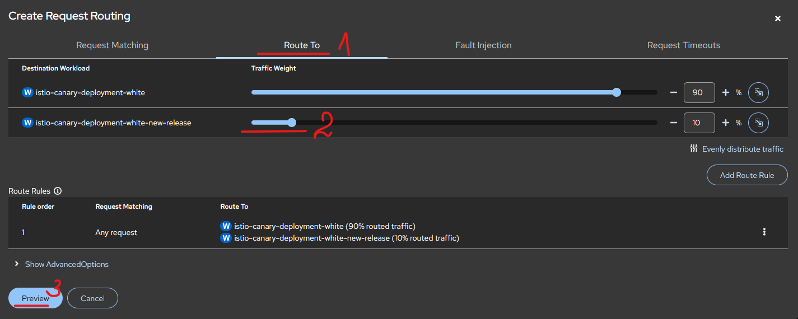
<br>
<br>

In the preview, don't forget to change the names of the virtual service and destination rule and apply it.

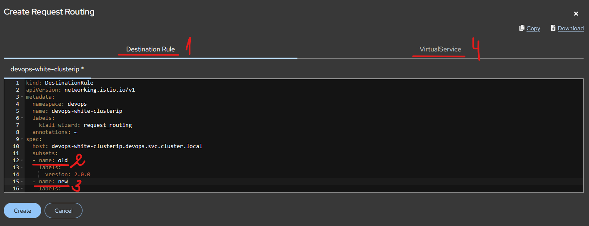
<br>
<br>

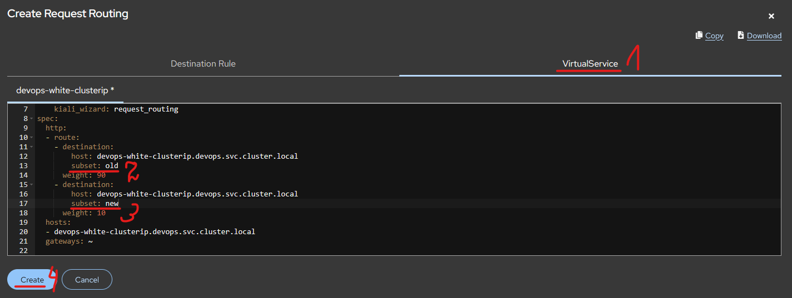
<br>
<br>

Currently, Kiali also provides a shortcut menu named "Traffic shifting" to adjust the weight. Feel free to use either the request routing or the traffic shifting menu.

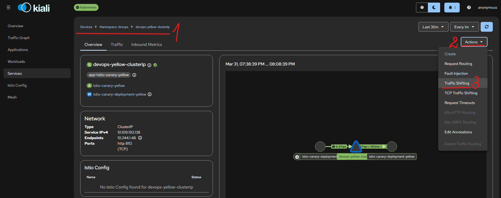
<br>
<br>

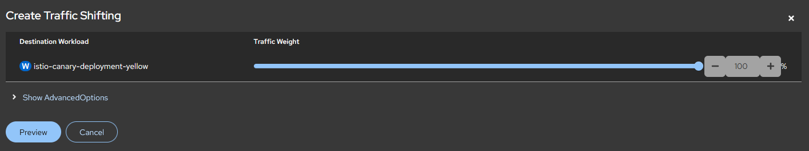
<br>
<br>

Ensure the Postman collection is still running to feed data. 

Get back to the Kiali graph. If we see this icon, that means this service has a custom rule. 

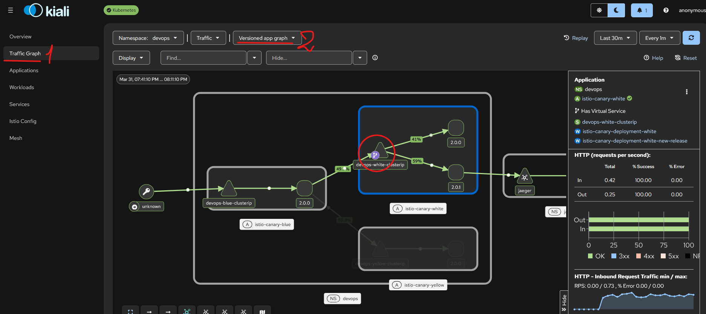
<br>
<br>

The rule will be applied and pushed to all Envoy proxies, and it needs time to be effective. Wait a few minutes, and we will get traffic after the route is applied. Let's shorten the time range to see the traffic after the route is applied. And we can see there that now the distribution is approximately 90% old and 10% new. The numbers might not be exactly 90 and 10, but they are approaching the desired distribution.

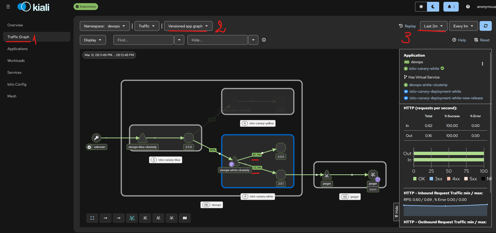
<br>
<br>

However, this shows us that it will be easy to adjust the percentage. Say, we now want 70% traffic to go to the new. To achieve it, we go to the Istio config and adjust the value on the virtual service.

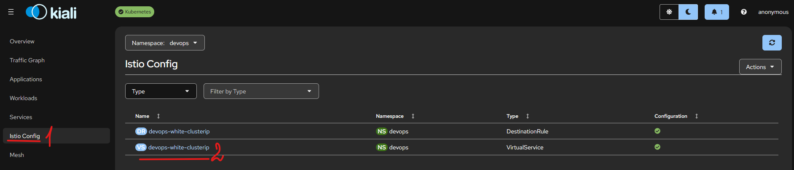
<br>
<br>

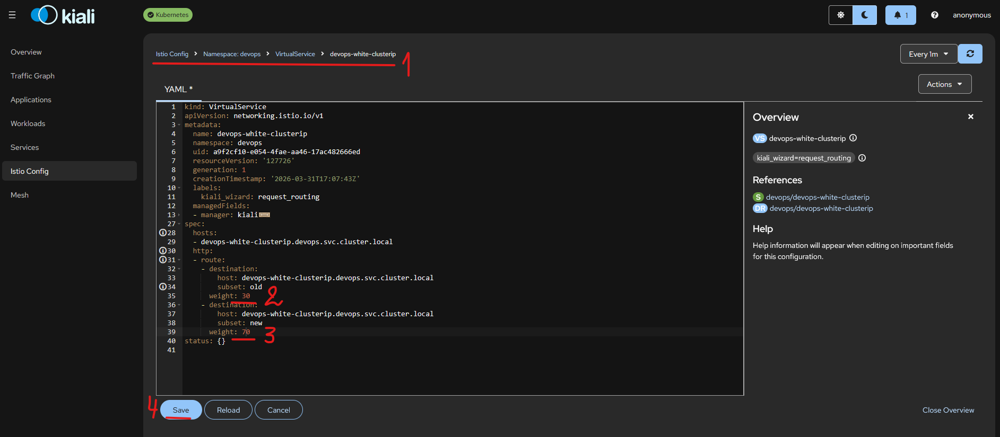
<br>
<br>

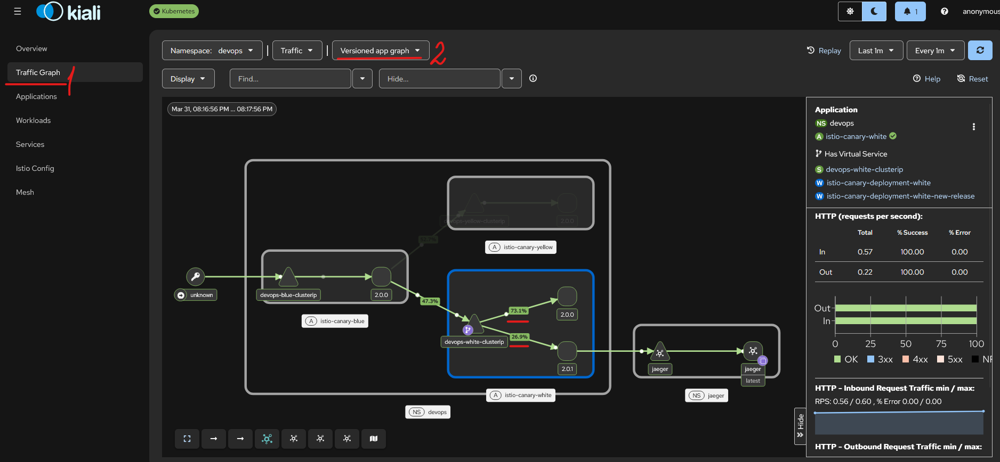
<br>
<br>

[⬆ Back to top](#top)

## 92 Istio Virtual Service

[⬆ Back to top](#top)

In this lesson, we will see more details about the Istio virtual service. It is basically a Kubernetes object. Thus, we can examine the YAML. There are several ways to get the YAML, such as from kubectl, kiali, or the Kubernetes UI. It does not matter. Similarly, we can edit and apply the change in several ways. Kiali is an Istio user interface, so it has a menu to display the YAML.

In Kiali, we can find the virtual service via the link in the service menu. 

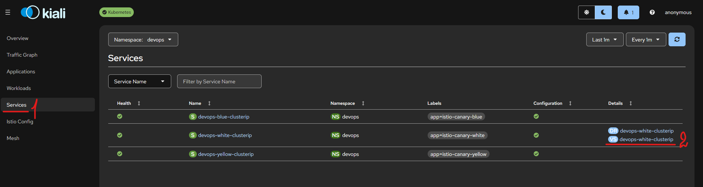
<br>
<br>

While on the lens, we can get from the CRD section, under networking.istio.io.

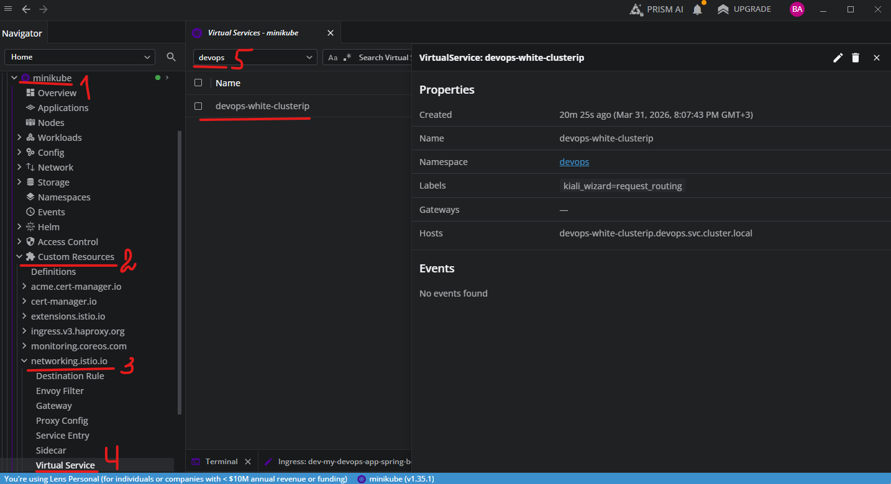
<br>
<br>

Or in kubectl, run
    
    CMD --> kubectl get virtualservice -n devops

    # result:
    NAME                     GATEWAYS   HOSTS                                                 AGE
    devops-white-clusterip              ["devops-white-clusterip.devops.svc.cluster.local"]   21m

Virtual service is a routing rule that allows us to configure traffic behaviour. In this sample, it says: "Hey, HTTP request, I will check whether you meet the criteria as defined in the match block, highlighted in blue." If you are matched, I will redirect you to the host highlighted in yellow. The host has two possibilities for receiving traffic: first, the red text; second, the orange text. My task is to redirect 25% traffic to the first and 75% to the second. But how do we define a subset? We will see it in the next lesson about the destination rule.

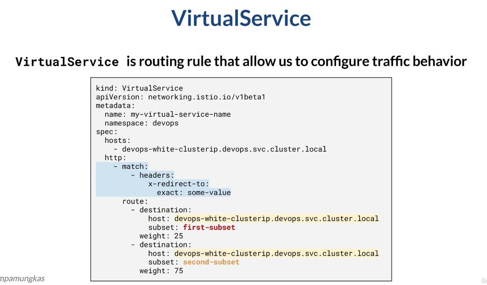
<br>
<br>

Istio virtual service does not replace the Kubernetes service. They do different jobs. We only create a virtual service when needed, not for every Kubernetes service. Think of virtual service as a partner for a regular Kubernetes service, where its task is to split traffic based on zero or more matching conditions. The match conditions may change, so I recommend reviewing the list on the Istio website. See the link in the course resources and references section of this course. If a request does not match any condition, the Kubernetes service will handle it as-is.

[⬆ Back to top](#top)

## 93 Istio Destination Rule

[⬆ Back to top](#top)

Istio VirtualService defines where traffic must go. How virtual service goes there is defined in the destination rule. We have already seen it in a previous example, where we defined a subset on the destination rule based on the version. Technically speaking, we define a subset based on pod labels, specifically the label "version". But the destination rule is more than just a subset. We can also define traffic policy using destination rules, which we will see later. The destination rule usually works with a virtual service, but that is not required. Virtual service needs a destination rule for routing. But in some use cases, the destination rule can work on its own, as we will see later.

The destination rule works together with the virtual service. It defines a subset that indicates which pod to route traffic to. For example, when we have this virtual service with three subsets, we also need to define all three in the destination rule. Something like this. Please note the colors: each color in the virtual service corresponds to a subset in the destination rule. These versions and experimental are actually labeled in pods. And we can use any combination for each subset. For example, the red subset has only one label, while the other subsets have two. 

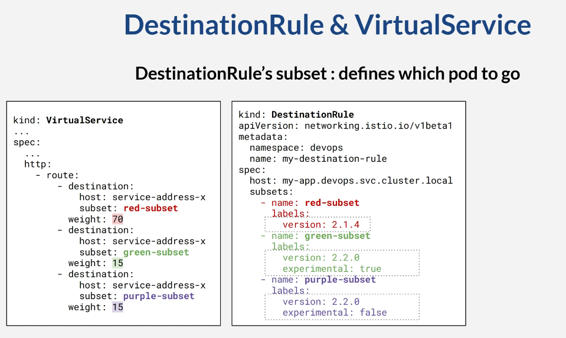
<br>
<br>

So we must have these three pods, with a matching label combination, to make traffic flow. Istio will direct traffic to each pod according to the requested split percentage. So 70% to red pod, 15% to green, and 15% to purple. It does not matter how many replicas each pod has, as long as the label matches, the Istio virtual service will handle the splitting percentage.

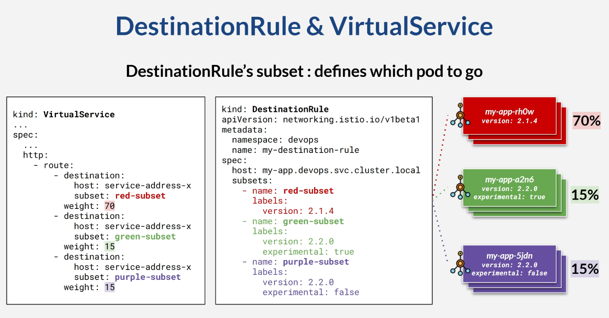
<br>
<br>

The destination rule provides a traffic policy section, where we can set some aspects regarding traffic, such as: Load balancer, connection pool, outlier detection, and TLS. We will see more about them later. We can apply the policy to all traffic on the destination rule, or only to a specific destination port.

Stop Postman traffic run.

[⬆ Back to top](#top)

## 94 Dark Launch

[⬆ Back to top](#top)

A dark launch is when we need to distribute traffic to a certain user. It's like a canary release, where we distribute traffic as in the following example: 90% to version 1, 10% to version 2, and gradually increase it towards version 2. On Canary, we don't have any criteria. As long as the total percentage is 100%, then we achieve the distribution goal. But what if we have a case that needs something specific to distribute? 

For example, we currently have an API for purchase recommendations. Let's call this a version 1 recommender API. Then there is the new version 2 recommender API. However, this version 2 API uses a new algorithm tailored to people aged 30 to 40. We want to test it first, before updating the entire recommender system. We need to monitor the results for the version 2 API. Let's call it version 2 analytics. Let's say we have this kind of data, where only 5 people fall into the version 2 category. If we are doing canary, giving 50% to version 1 and 50% to version 2, we will not get what we want. People outside the target age range will still be redirected to version 2, skewing analytics. Something like this could happen. 

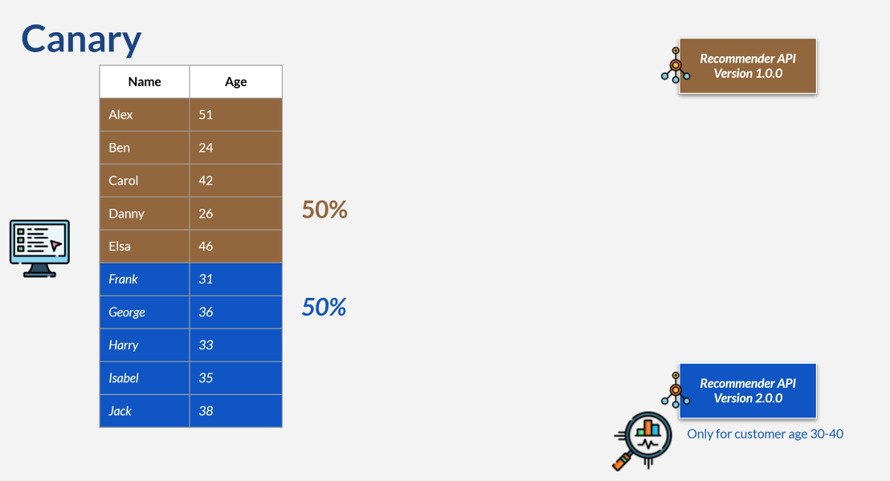
<br>
<br>

We need people in the blue row, aged 30-40, to go to version 2. But since canary is based on percentages, we might have 1, 2, or even 5 people in the brown category, which would go to version 2. After all, we can't say the exact percentage of traffic distribution like in Canary. We cannot know exactly the proportion for that particular age range, and it keeps changing. 

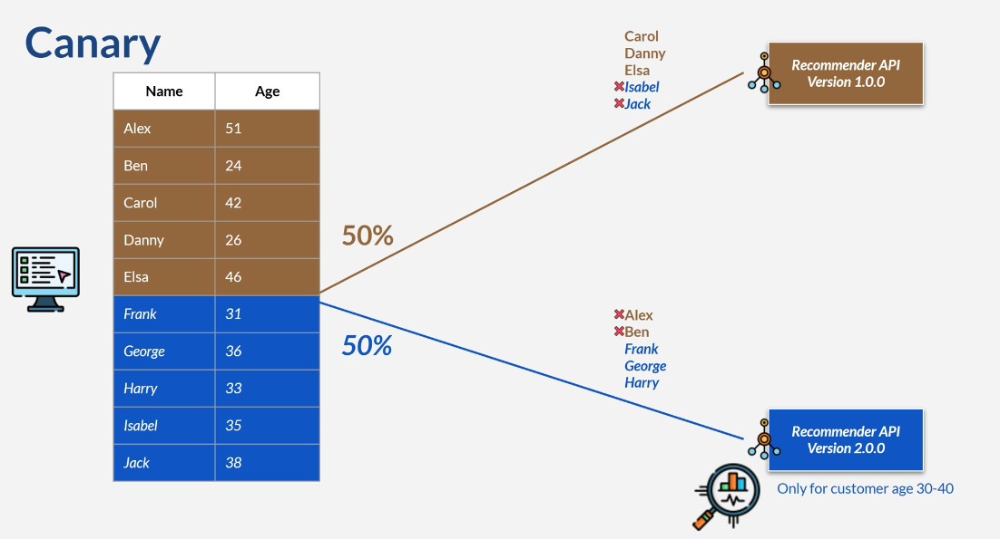
<br>
<br>

Assume we can determine the user's age, since they need to log in and enter their birth year. This criterion is where the dark launch takes place. We deploy two versions of the recommender API. But now, we don't say: 'Hi, Istio, please redirect 50% traffic here, and 50% there.' We now say: Hi Istio, please redirect traffic with a certain HTTP header to version 2, and traffic without that specific HTTP header to version 1.

During an API call, we can set the HTTP header value from the user interface or the web application's homepage, for example. In other words, if, after login, the customer's age is within the target range (the blue rows), we call the recommender API with an additional HTTP header. The endpoint is the same, but we only need a flag to enable the version 2 feature. In this case, it's an HTTP header. So the user is unaware that we are launching and testing a new feature based on specific criteria. Hence, it is called a dark launch. And we get traffic distribution as needed. The good news is we can do this kind of dark launch from Istio traffic routing. Istio also provides several criteria that we can use to match traffic and redirect to a specific version. For HTTP, Istio supports common http items like headers, URI, scheme, method, port, and query parameters.

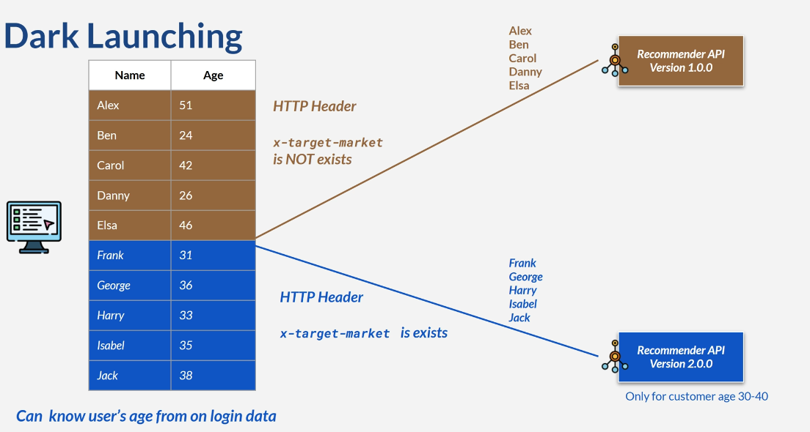
<br>
<br>

For TCP routes, Istio also supports criteria matching. But since most of the time we will use http traffic for microservice, let's focus there. 

Please remove all pods, services, and ingress from the devops namespace. 

    CMD --> kubectl delete namespace devops

    # result: namespace "devops" deleted

Also, remove any Istio configuration, including virtual services and destination rules.


<br>
<br>

We will try the white service. Open the 'dark launch' folder and view the YAML file. We deploy 4 pods here: 3 pods, version 2.0.0, for blue, yellow, and white. We also have 1 more pod: white version 2.0.1. We also deploy a service for each of them. Notice that on the white service, we use a simple selector (only the app name), so the service will have two pods behind it, just like a canary. Then we also have ingress for blue, nothing special here. 

Apply this file.

    CMD --> kubectl apply -f devops-istio-dark-launching.yml

    # result:
    namespace/devops created
    deployment.apps/istio-dark-launching-deployment-blue created
    deployment.apps/istio-dark-launching-deployment-yellow created
    deployment.apps/istio-dark-launching-deployment-white created
    deployment.apps/istio-dark-launching-deployment-white-new created
    service/devops-blue-clusterip created
    service/devops-yellow-clusterip created
    service/devops-white-clusterip created
    ingress.networking.k8s.io/ingress-istio-dark-launching-nginx-blue created

Make sure minukube tunnel is up

    CMD --> minikube tunnel

In Kiali - http://localhost/kiali/, go to the white service and add request routing. 

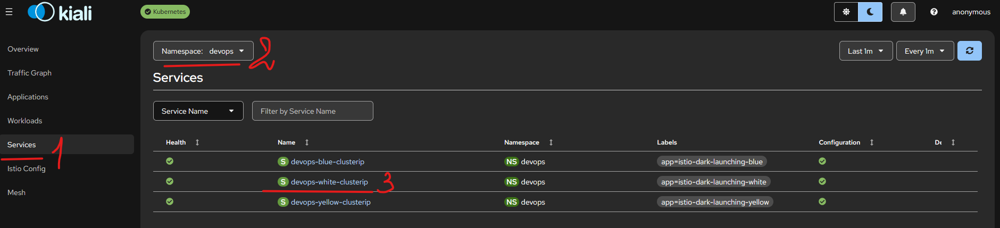
<br>
<br>

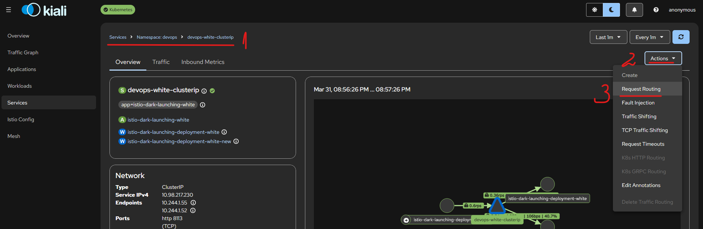
<br>
<br>

This time, we will add a match condition. There are several criteria available, and we can add multiple conditions. Right now, for simplicity, we will add the header 'X-target-market'. If the value is the string 'true', we will redirect to version 2.0.1. So 100% traffic to 2.0.1.

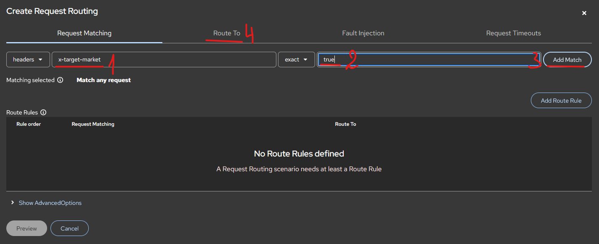
<br>
<br>

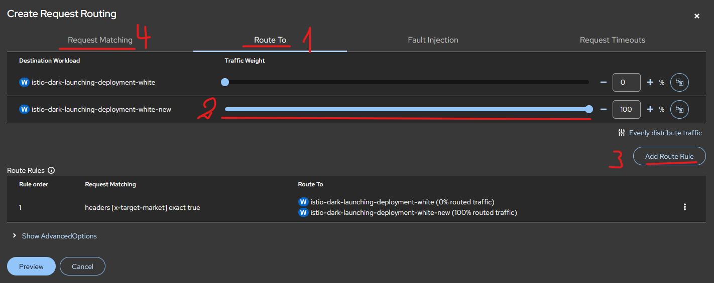
<br>
<br>

We also need to add a global route for all requests, so if a request does not include the X-target-market header, traffic will be redirected to version 2.0.0. 

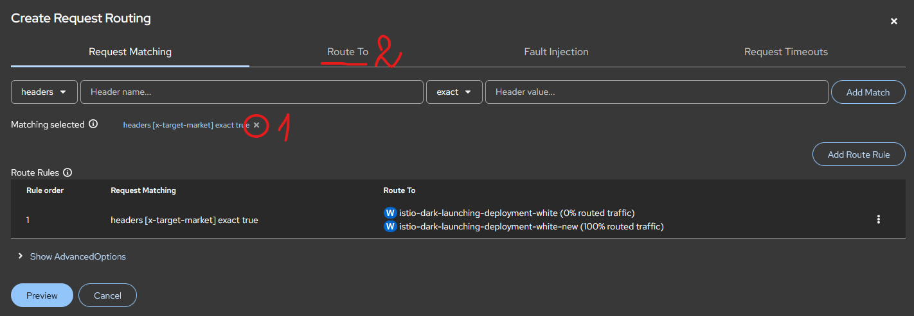
<br>
<br>

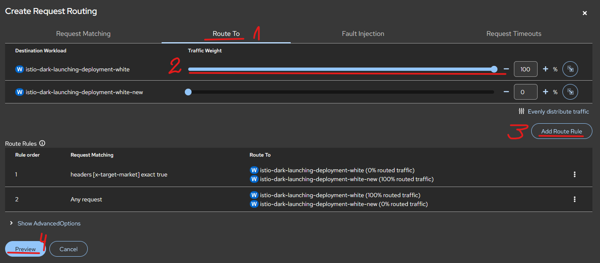
<br>
<br>

Don't forget to update the name in the Istio destination rule and the virtual service and pply the configuration.

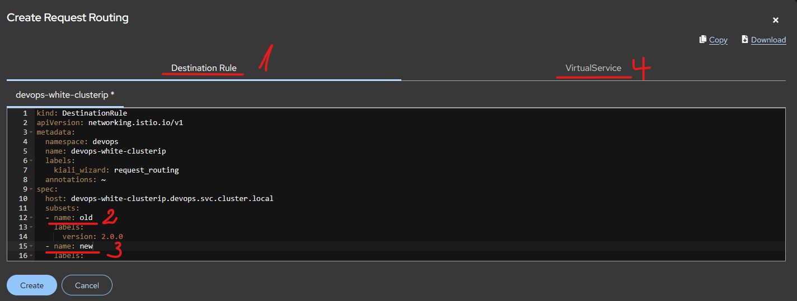
<br>
<br>

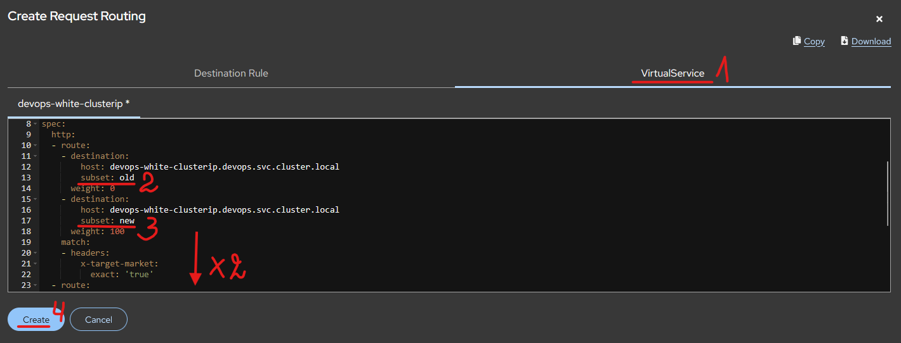
<br>
<br>

Try hitting the 'blue chain two' endpoint with the header 'X-target-market' set to 'true'. Hit it multiple times, and we will always get a response from white 2.0.1, which is what we want. 

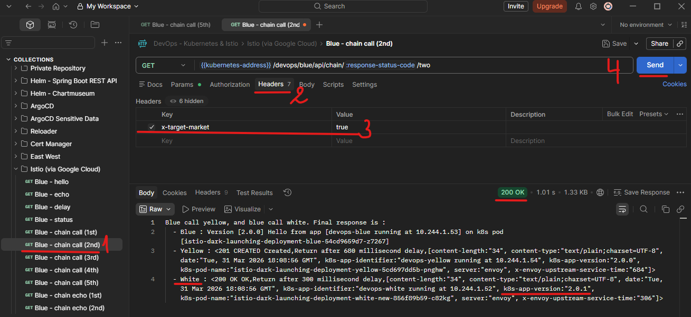
<br>
<br>

What if we remove this header and hit it again multiple times? We will be redirected to 2.0.0.


<br>
<br>

[⬆ Back to top](#top)

## 95 Fallacies Distributed System

[⬆ Back to top](#top)

A microservice architecture consists of multiple nodes that work together. We already know that one request can consist of multiple east-west calls. And there are even more than just the application: database, file storage, cache, etc. These nodes can be on the same machine or distributed to many machines. Hence, such a system is called a distributed system. 

We need to make sure that our entire system is reliable, means it must be available to serve requests at all times. Or at least most of the time, The thing that we sometimes refer to as SLO, or service level objective. One failure node in the east-west call chain can trigger a cascading failure, as we saw in the east-west lecture. This failure, in turn, will decrease SLO fulfillment, making the system less reliable. Unfortunately, some people new to distributed systems, such as microservices, make incorrect assumptions when implementing them. These are known as fallacies of distributed systems, and there are actually several of them. Let's see one by one. 

- First wrong assumption: the network is always reliable. The fact is, any particular communication can fail, and it will fail sometimes. Whether we know it or not, it is different. The target server might be down, the internet provider might fail, the hardware might be broken, or it might be a mysterious, intermittent problem. Note that this might not be a server issue. Ever try to access a popular website? However, sometimes we can access it, but sometimes we can't. Apparently, that's because our Wi-Fi provider has a connectivity issue, so it is not the website's problem—it's ours. An application needs to provide a way to deal with this potential miscommunication. We can handle this by retrying failed communication, which can come in many forms. One particular messaging pattern is the transactional outbox pattern. Instead of sending the data directly to the server, we store it locally or elsewhere, then retry unprocessed data. You can learn more about this pattern in my other course on microservice architecture and patterns. The discount code is available in the last section of this course. 

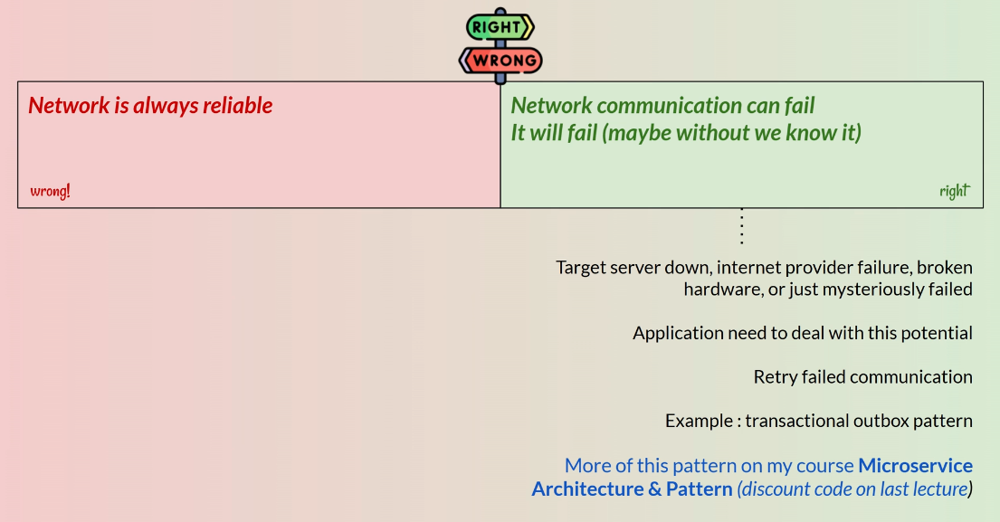
<br>
<br>

- Next wrong assumption: latency is zero. The request will send data, either small or large. The target will process the request and return the response. Latency is the time it takes for the service to send a request and receive a response. The assumption is that the latency for such transmission and processing is very small, or even zero. Bad news, it is not. Latency is always there, no matter how small it is (as little as 1 millisecond or as much as 10 seconds). and usually related to internet speed and the distance or path of communication. If I am in England, calling a service in France likely has lower latency than calling a service in Singapore, which is further away and involves more network paths in data transmission. This latency should be as small as possible. Take this as an analogy. If a restaurant wants to move groceries from the delivery van to the kitchen, where should the van park? Ideally, the restaurant has a door that provides direct access to a delivery van, so the distance and path are shorter, unloading latency is lower, and restaurant staff can work more effectively. In this case, we can use a CDN, or a content delivery network. They are trying to minimize the distance between the caller and the target by duplicating the data closer to where it is needed. 

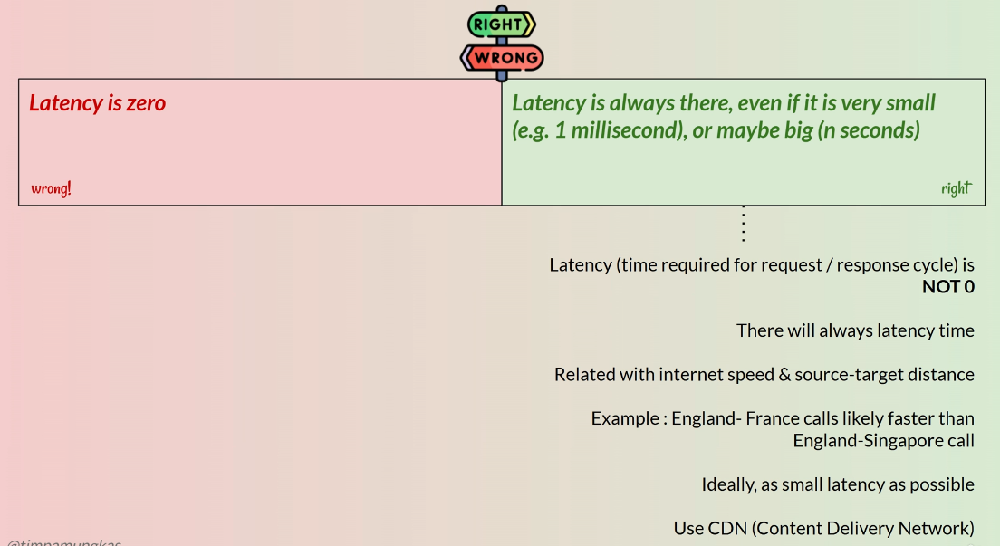
<br>
<br>
  
- Next is bandwidth. Let's say data is like water: it flows through a pipe. Bandwidth is like the pipe diameter, so it affects how much data can flow per second. When we talk about water, it might be measured in litres per second. When we talk about bandwidth, we measure it in bits per second. A pipe might be shared among many applications. This means that if we have 1 gigabit per second bandwidth, it does not mean our application can use the entire pipe. The network administrator might allocate only 100 megabits per second to the application, with the rest shared among other applications. So we cannot expect the target to receive all the data when we send it. A common example is playing a video on YouTube or Netflix. YouTube or Netflix does not send the entire 1-hour video at once, which may be 1 gigabyte of data. It sends it in small chunks, which is what we usually call streaming.

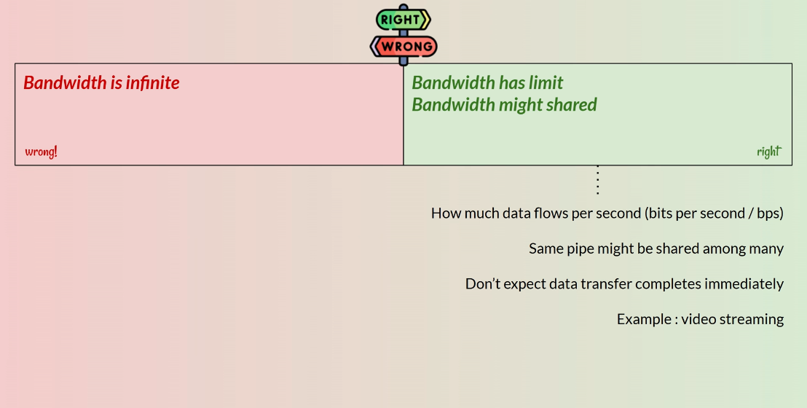
<br>
<br>

- Network issues. Assuming we can trust the network is wrong. At some point, it might have a security hole, whether in the operating system, hardware, the library used by the application, or even the application itself. Even large companies with well-known products are not free from this potential. On open source, this potential might be even higher. To minimize this, we can use tools to scan our application for known CVEs (common vulnerabilities and exposures) and fix them. We can also use encrypted communication, like HTTPS. But that might not be enough, so the company can use specialized people trying to break the system, and report the findings. This process is known as penetration testing, or some companies may have a bug bounty program that allows anyone to try to exploit security and report findings for a reward. And even if such a security hole isn't found now, it may not be because it's not there, but because nobody can find or exploit it yet. So, a security checkup should be held routinely. 

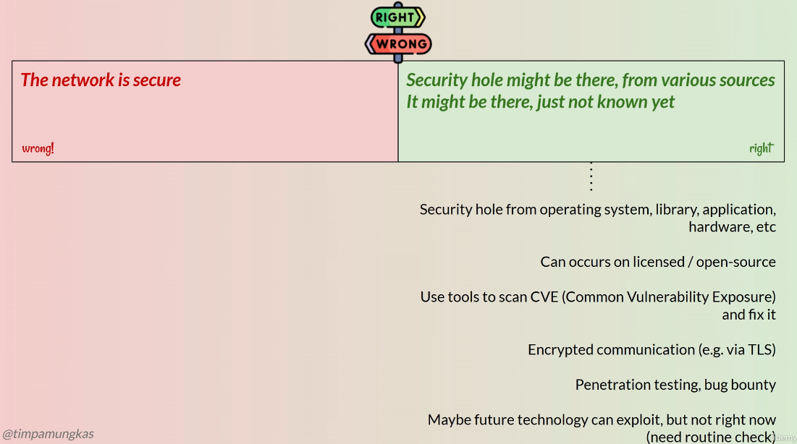
<br>
<br>

- Topology. Network structure will not always be the same. For example, we might not have a web application firewall right now, but two months from now the company will add one. Even if the node is not added, the application on the node or the configuration might change. We might have a cache node, and the configuration changed to set a default 1-hour cache time for all items. At the same time, our applications expect non-caching behavior, so they display obsolete data. Even deletion can happen. We could delete a cache node, but heavy traffic would cause 5-second delays to process it and eventually burden the system. There is no easy way to make a system that can adapt to any topology change. 

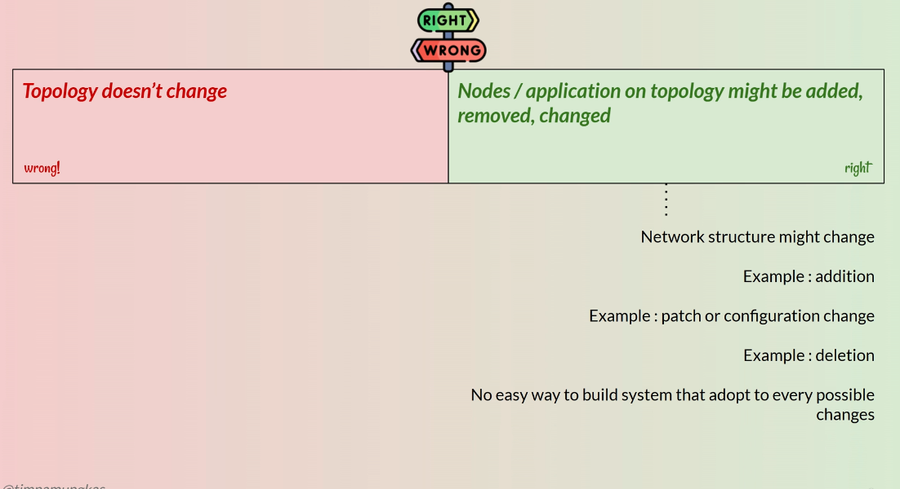
<br>
<br>

- Infrastructure. In many organizations, more than one person has the same privilege. They might not have god-level privilege or control everything, but due to the size of the application, one person will not be enough. Those administrators can manage items to complete their job. This can happen in the infrastructure area. For example, John and Linda both have the privilege to create a network, which includes defining an IP address range for Kubernetes pods. Unfortunately, there is no clear documentation indicating which IP range has been used and by whom. So John might use a specific IP address range for application A, and Linda uses a different IP range that overlaps with John's. This means some applications will work well, but others with conflicting IP addresses might behave unexpectedly. It's essential to have a way to manage our systems and document their configurations. Since manual configuration is risky, we can use IaC (Infrastructure as Code) to manage infrastructure provisioning and configuration. IAC, like Terraform or OpenTofu, is basically a configuration stored in a text file that goes through a process, like pull request approval on GitHub, before someone executes it. IaC makes it easier to edit and distribute configurations. It also ensures that you provision and configure the same environment every time. By using IaC, we also have documentation (the IaC itself), which helps us avoid undocumented, ad hoc configuration changes.

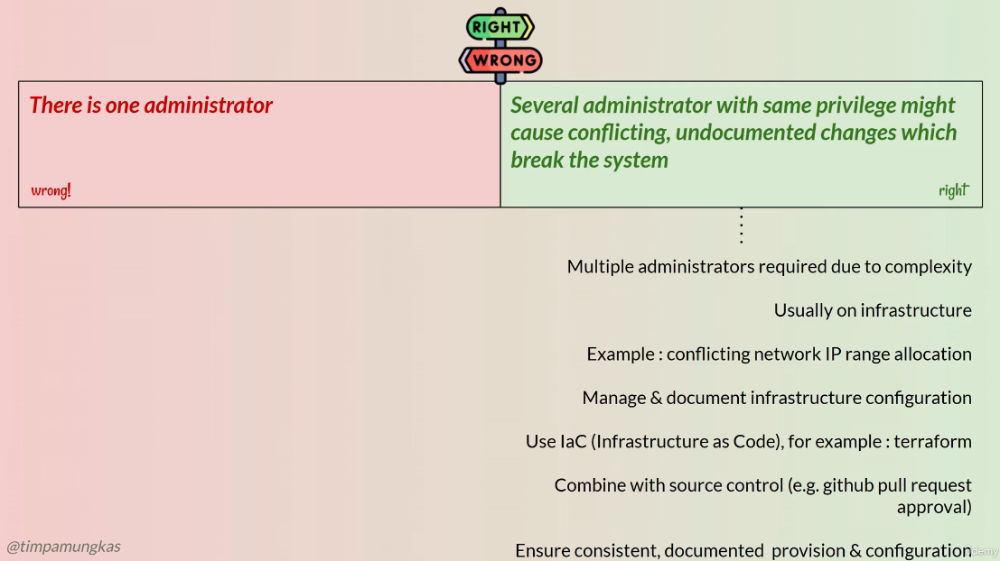
<br>
<br>

- Data transfer costs. When we use a database, for example, we only pay for that database license. Or we might only pay for the database product if we are using the cloud. Or even zero cost if we install an open-source database on our machine. But it is not. Yes, the database product might be free, but the data transport is not. Data will flow into the database through create, update, or delete transactions. And flow outside the database to the client, through a read transaction. Find a cloud bill or an infrastructure bill, and there are two items there: ingress network cost and egress network cost. Data in (ingress) and data out (egress) from that database incur costs. The cost might seem very small (say, 2 US cents per gigabyte) and can be ignored. But remember, we want more transactions in the business. When transactions are done through the system, more transactions mean more data to be transported in and out. Naturally, we may end up not only with 100 gigabytes per month, but with terabytes, or even more. And that kind of cost might no longer be ignored. So the application developer needs to be aware of the cost. For example, a picture might be resized when sending data from a phone to a server. Otherwise, people might send a 10-megabyte high-quality picture, while we only need a 2-megabyte medium-sized picture. The smaller picture size (20% of the original) will result in 80% lower transmission costs. Being aware of such costs is essential. However, it comes with its trade-offs. Avoid over-optimizing everything from the start. For example, a JSON response will be larger than an Avro response, since JSON is text rather than binary. But suppose we create an API that returns Avro. In that case, it is not as common as JSON, and fewer people are interested in using our API, which is bad for our business, which involves API monetization. 

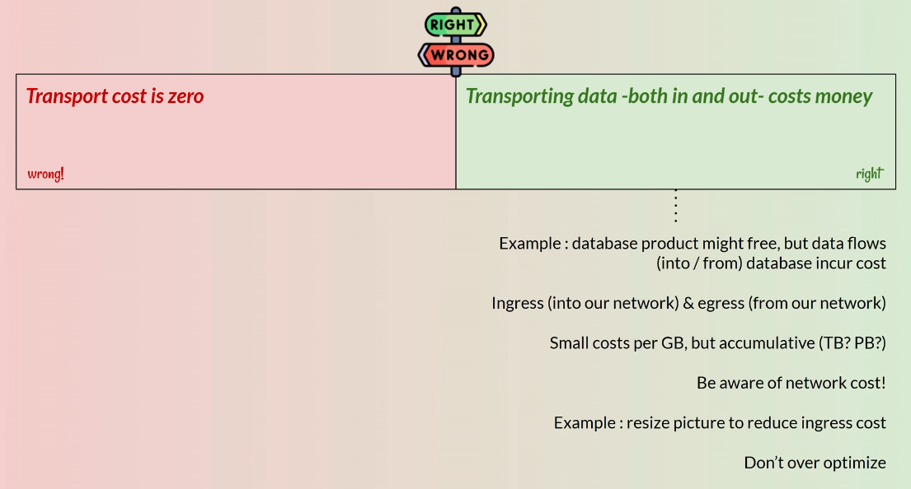
<br>
<br>

- OS autodetection. Assuming that everything in the network is the same is a latent danger. For example, an engineer writes an application on a Windows laptop, which needs to write to a local file. Since it is a Windows laptop, he writes file paths using drive letters and backslashes as separators. Everything works fine in the organization since they use Windows Server to deploy applications. But a client who buys the product apparently uses Linux, which does not use drive letters, and uses a slash as the file separator, so the application breaks because of this. So it is better to write an application that has high interoperability. In this sample, an engineer can use a programming language library to detect the default user home folder and file separator, and write the local file accordingly.

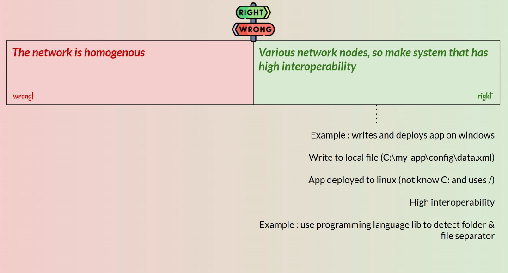
<br>
<br>

[⬆ Back to top](#top)

## 96 Fault Injection

[⬆ Back to top](#top)

What is the connection between fallacies and wrong assumptions with Istio? Well, we can use Istio to test some of the possible fallacies by purposely causing the system to misbehave. Hence, the application developer does not need to change code to simulate failure. Instead, they can use Istio's failure simulation to improve the application's handling of such failures.

Furthermore, we can easily add, change, or delete failures in Istio or Kiali. We purposely make the system misbehave by injecting a fault into Istio traffic. Hence the name, fault injection. 

Istio's fault injection can handle two incorrect assumptions: the network is reliable and latency is zero.

[⬆ Back to top](#top)

## 97 Fault Injection Delay

[⬆ Back to top](#top)

The first fault injection is adding a delay to the service response. This case tests the fallacy that latency is zero. In reality, high latency can occur due to network issues, heavy service load, high I/O activity, etc.

This time, we will add a delay to the yellow service call. We will use the same deployment method we learnt in the canary lesson. Please remove all Istio configurations, including virtual service and destination rule, so we can start fresh.

Delete devops namespace

    CMD --> kubectl delete namespace devops

    # result: namespace "devops" deleted

Make sure minikube tunnel is up:

    CMD --> minikube tunnel

Make sure that we don't have virtual services or destination rules in Kiali - http://localhost/kiali/


<br>
<br>

Deploy the application configuration

    CMD --> kubectl apply -f devops-istio-fault-injection.yml

    # result:
    namespace/devops created
    deployment.apps/istio-fault-deployment-blue created
    deployment.apps/istio-fault-deployment-yellow created
    deployment.apps/istio-fault-deployment-white created
    deployment.apps/istio-fault-deployment-white-new-release created
    service/devops-blue-clusterip created
    service/devops-yellow-clusterip created
    service/devops-white-clusterip created
    ingress.networking.k8s.io/ingress-istio-fault-nginx-blue created

Wait few minutes so the pods can start

    CMD --> kubectl get pods -n devops

To add fault injection, we can use the same button in the service.This time, add fault injection to the yellow service - http://localhost/kiali/. We can add from the request routing or fault injection menus. They produce the same result.

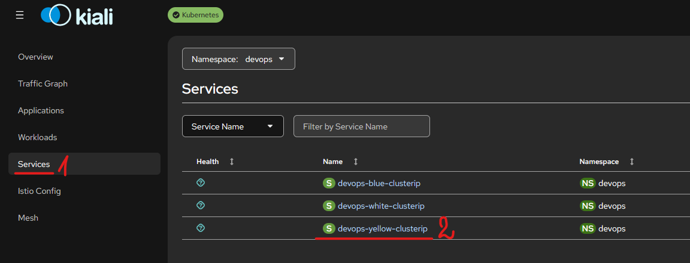
<br>
<br>

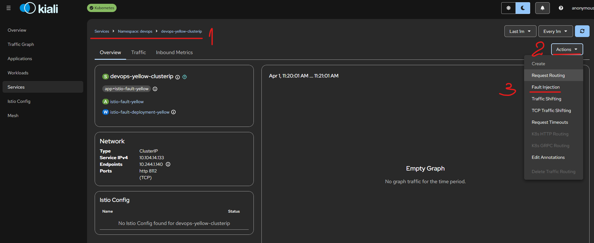
<br>
<br>

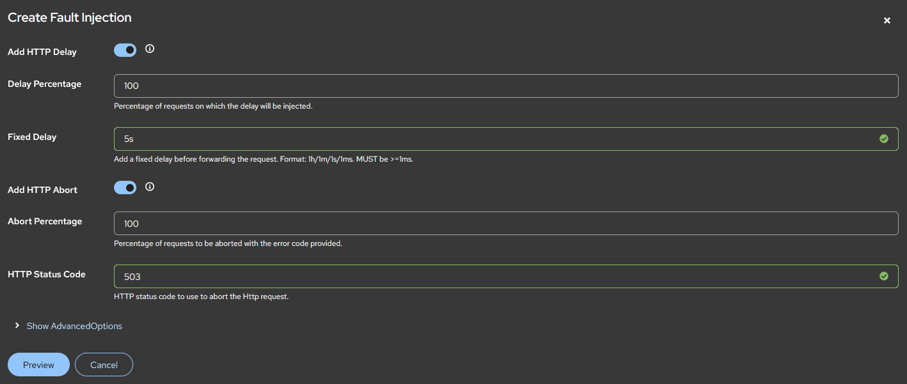
<br>
<br>

If we need a condition applied, use request routing, as the user interface is more complete. I will use the request routing menu, as the other menu is basically a simplification of it.

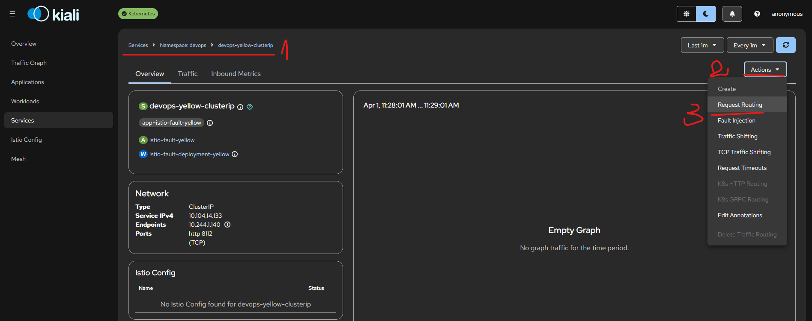
<br>
<br>

I will add a 5-second delay to any incoming yellow traffic.

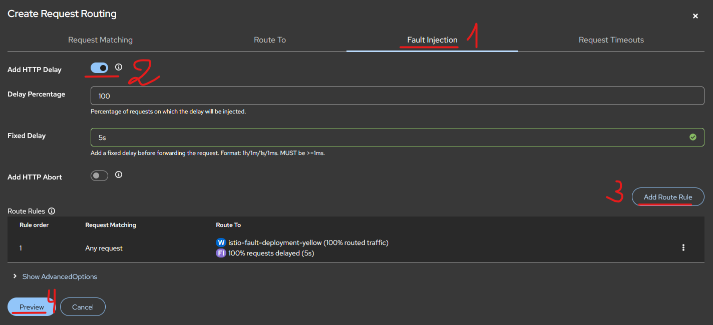
<br>
<br>

Convertthe virtual service and destination rule toa string, and create the fault injection. 

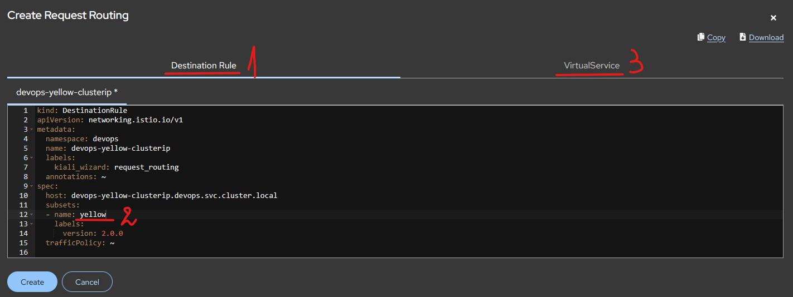
<br>
<br>

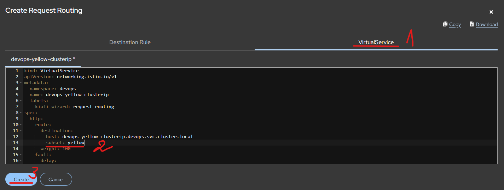
<br>
<br>

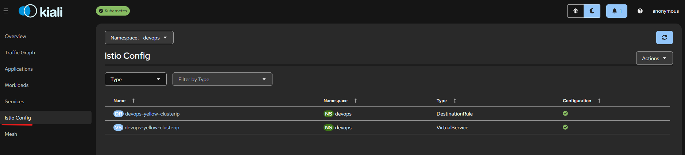
<br>
<br>

Make sure minikube tunnel is up

    CMD --> minikube tunnel

Open the Postman collection and hit the chain endpoint that calls yellow from blue. For example, I will call chain two several times. Now it has a response time of more than 5 seconds.

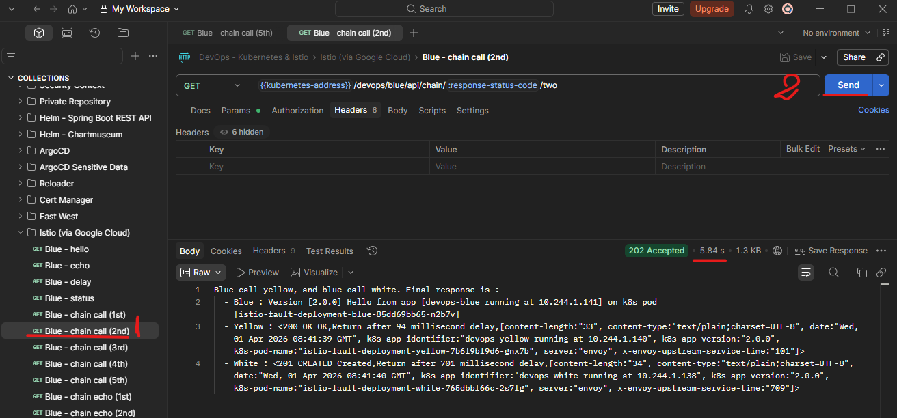
<br>
<br>

[⬆ Back to top](#top)

## 98 Fault Injection Abort

[⬆ Back to top](#top)

One type of fault injection is abortingthe service response; in other words, terminating the request without actually passing it to the application. This feature is to test the fallacy that the network is always reliable. If we speak about http, this is usually recognized with status 502, 503 or 504, which indicates unexpected rejection from the server. Or sometimes the client exceeds the request quota, indicated by a 429 Too Many Requests status. With Istio, we can abort the request and return the response status code we need. The application can then implement logic to handle situations based on the response status code.

This time, we will add abort to the white service call. We will use the same deployment method we learnt in the canary lesson. Please remove all Istio configuration (virtual services and destination rules), so we can start fresh.

Delete devops namespace

    CMD --> kubectl delete namespace devops

    # result: namespace "devops" deleted

Make sure minikube tunnel is up

    CMD --> minikube tunnel

Make sure that we don't have virtual services or destination rules in Kiali - http://localhost/kiali/


<br>
<br>

Deploy the application configuration

    CMD --> kubectl apply -f devops-istio-fault-injection.yml

    # result:
    namespace/devops created
    deployment.apps/istio-fault-deployment-blue created
    deployment.apps/istio-fault-deployment-yellow created
    deployment.apps/istio-fault-deployment-white created
    deployment.apps/istio-fault-deployment-white-new-release created
    service/devops-blue-clusterip created
    service/devops-yellow-clusterip created
    service/devops-white-clusterip created
    ingress.networking.k8s.io/ingress-istio-fault-nginx-blue created

Wait few minutes so the pods can start

    CMD --> kubectl get pods -n devops

To add fault injection, we can use the button in the service.This time, add a fault-injection abort to the white service. Configure it to return a 503 response status code. 

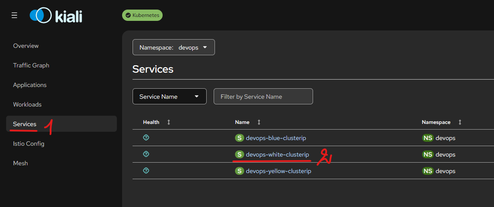
<br>
<br>

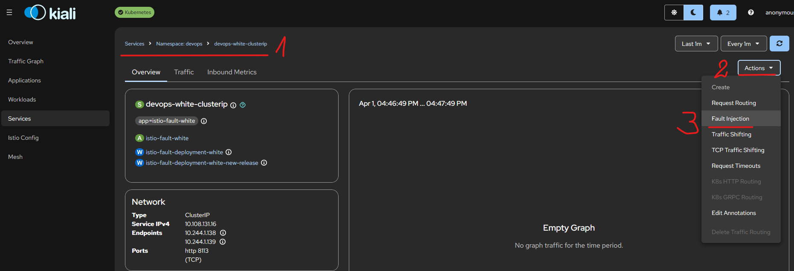
<br>
<br>

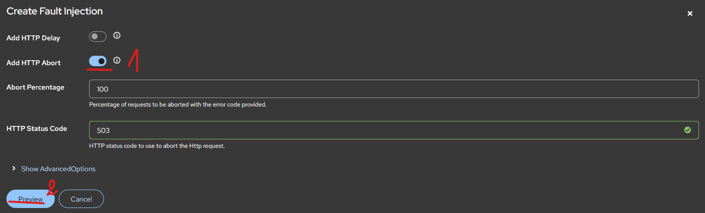
<br>
<br>

Convert the virtual service and destination rule to a string, and create the fault injection. 

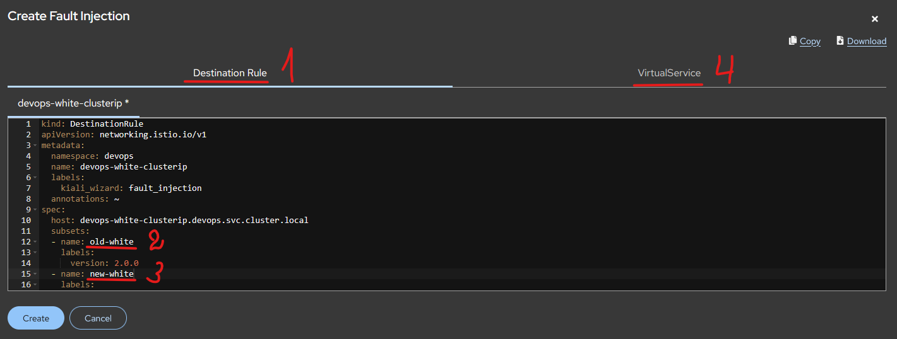
<br>
<br>

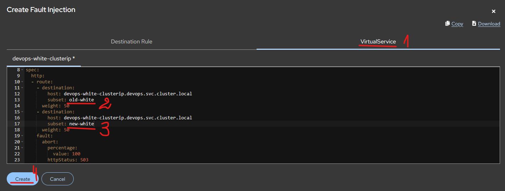
<br>
<br>

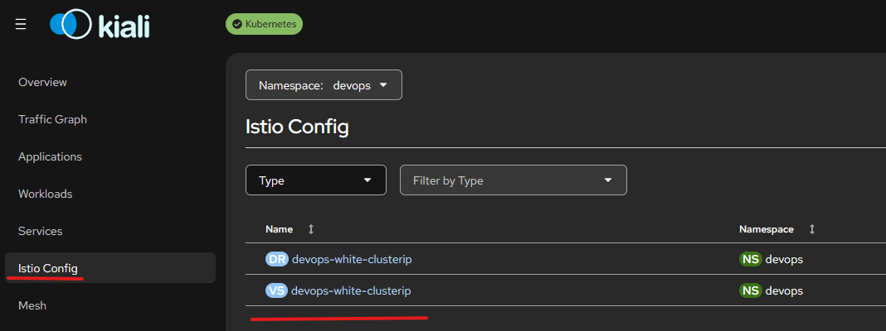
<br>
<br>


Make sure minikube tunnel is up

    CMD --> minikube tunnel

Open the Postman collection and hit the chain endpoint that calls white. For example, I will call chain two several times. Now it gives an error.

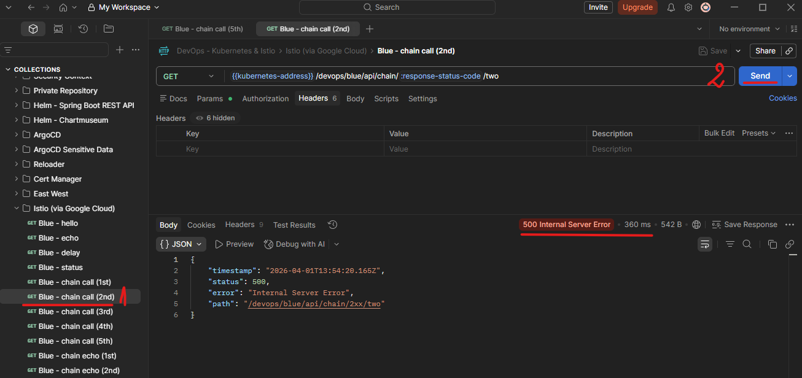
<br>
<br>

To make sure it comes from white, we can use Kiali or Jaeger to trace the call. Check that this call now contains a 503 error.

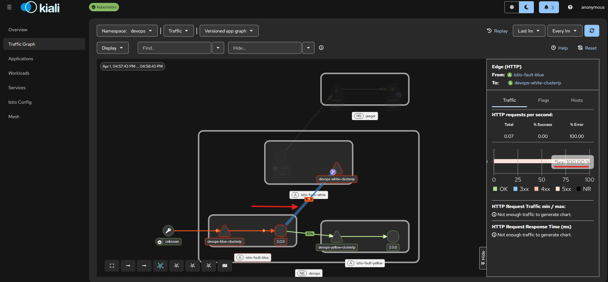
<br>
<br>

[⬆ Back to top](#top)

## 99 Fault Injection - Conditional Abort

[⬆ Back to top](#top)

Fault injection can also have match criteria. Abort fault injection can also be used to suspend traffic deliberately. A sample case is that we have bad traffic from yellow, which apparently calls white. But traffic from blue to white works just fine. We suspect the problem lies with the yellow-white call. But we can't block blue-yellow calls, since traffic that doesn't involve white runs well. So we will suspend yellow-white traffic, while keeping blue-yellow nad blue-white traffic. If we do this on production, blue-white will work as usual, but yellow-white will be suspended. While we fix the error, the application may display a temporary error message or use another workaround. 

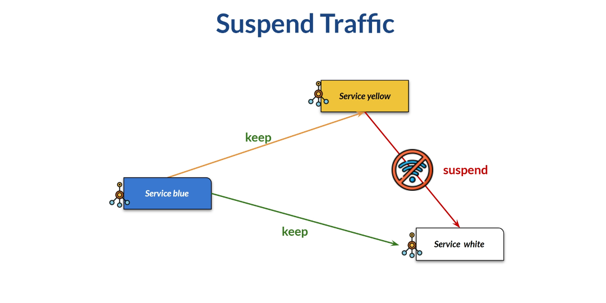
<br>
<br>

Once the white application is fixed, we only need to remove the fault injection. 

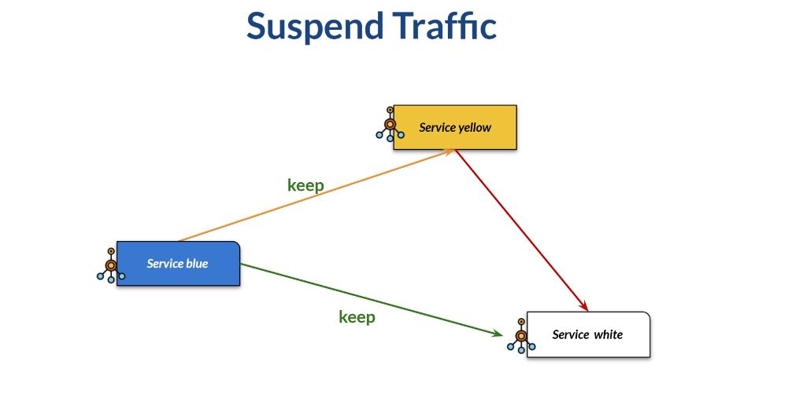
<br>
<br>

The virtual service documentation includes source-label criteria we can use. When this video was recorded, the Kiali user interface did not yet have this section, so we had to edit the YAML file manually. The YAML can also be edited with a text editor. It's just regular Kubernetes YAML - . The sample configuration is available in the istio-fault-injection folder. Let's add criteria so this suspends traffic only from yellow and returns a 429 response code.

conditional-abort-virtualservice.yml

```yaml
kind: VirtualService
apiVersion: networking.istio.io/v1
metadata:
  name: devops-white-clusterip
  namespace: devops
  labels:
    kiali_wizard: fault_injection
spec:
  hosts:
  - devops-white-clusterip.devops.svc.cluster.local
  http:
  - match:
    - sourceLabels:
        app: istio-fault-yellow
    route:
    - destination:
        host: devops-white-clusterip.devops.svc.cluster.local
        subset: old-white
      weight: 50
    - destination:
        host: devops-white-clusterip.devops.svc.cluster.local
        subset: new-white
      weight: 50
    fault:
      abort:
        httpStatus: 429
        percentage:
          value: 100
  - route:
    - destination:
        host: devops-white-clusterip.devops.svc.cluster.local
        subset: old-white
      weight: 50
    - destination:
        host: devops-white-clusterip.devops.svc.cluster.local
        subset: new-white
      weight: 50
status: {}
```

Don't delete the destination rules and virtual services from last example in Kiali - http://localhost/kiali/


<br>
<br>

Apply the new destination rules and virtual services

    CMD --> kubectl apply -f conditional-abort-virtualservice.yml

    # result: 
    Warning: resource virtualservices/devops-white-clusterip is missing the kubectl.kubernetes.io/last-applied-configuration annotation which is required by kubectl apply. kubectl apply should only be used on resources created declaratively by either kubectl create --save-config or kubectl apply. The missing annotation will be patched automatically.
    virtualservice.networking.istio.io/devops-white-clusterip configured

Make sure minikube tunnel is up

    CMD --> minikube tunnel
    
Now try on Postman. If we call the chain two (which is blue calling white) with parameter 2xx, it will have a good response.

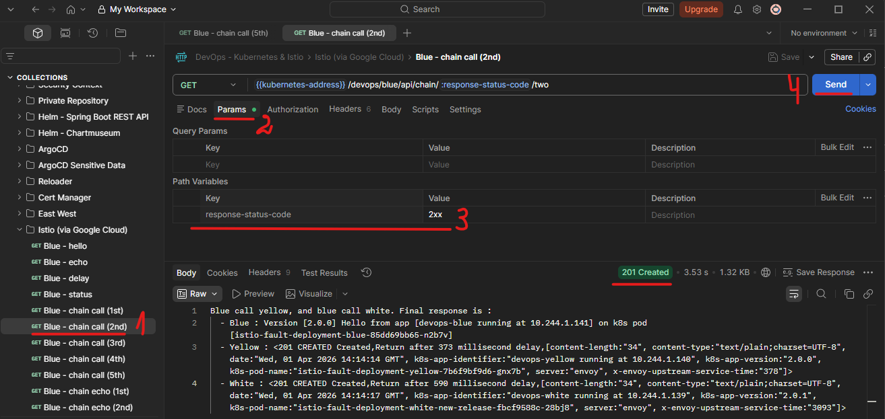
<br>
<br>

But if we call chain five (which is yellow calling white), it will be broken. 
 
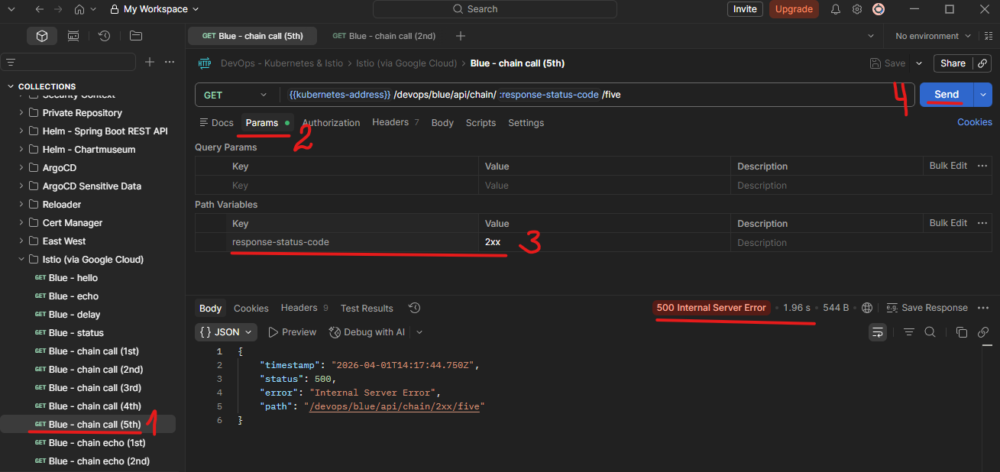
<br>
<br>

Run the Postman collection for chain two and chain five several times. 

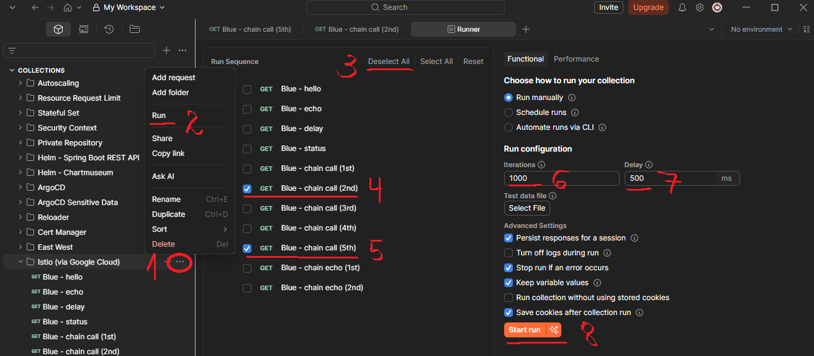
<br>
<br>

Then check from the Kiali graph - http://localhost/kiali/. Notice that the yellow-white traffic is now red, but the blue-white traffic is still green.

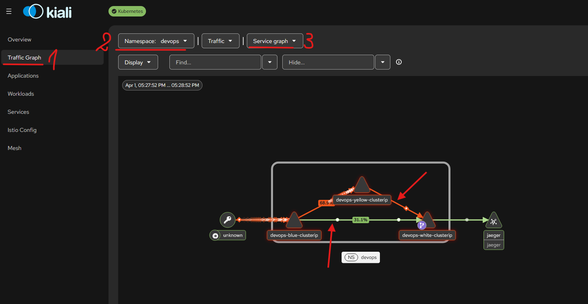
<br>
<br>

Stop Postman Run.

[⬆ Back to top](#top)
