# Section 3 Container Technology Notes

## Content
- [Section 3 Container Technology Notes](#section-3-container-technology-notes)
  - [Content](#content)
  - [Container](#container)
  - [Docker Hands on](#docker-hands-on)
  - [Building Docker Image](#building-docker-image)
  - [Semantic Versioning](#semantic-versioning)
  - [Docker Compose](#docker-compose)

## Container

The basic idea of microservices is to separate applications with their own technologies and releases. This principle means that service X might use Java technology. Service Y uses Go programming. Service Z requires Python because its logic is better suited to it.

The underlying technology, along with business logic from the source code, can be packaged into a single deployable application. Generally, each technology provides its own approach to creating a deployable application. 

For example, a Java application compiled and packaged as a runnable JAR requires the Java runtime to run. The Go toolchain can produce native Linux applications without the Go runtime running on the server. Python, on the other hand, does not need compilation. The Python runtime will interpret and execute the source code. 

In modern deployments, all the required items to run an application can be packaged into a container. The most common container technology right now is Docker. Using container technology means that container X will run a Linux operating system, a Java runtime environment, and the jar file. 

Service Y, on the other hand, does not need a go runtime. However, a Go-native application can only run in the environment where it was built. This means that if the Go compiler is built on Linux, the only operating system that can run that go-native code is Linux. If, for some reason, Windows must be used, then the binary cannot run. Using a container, we can also package the Go native, along with the Linux operating system. A Windows user can then run the container. At service Z, we package the Linux Operating system, Python runtime, and the source code as a container. 
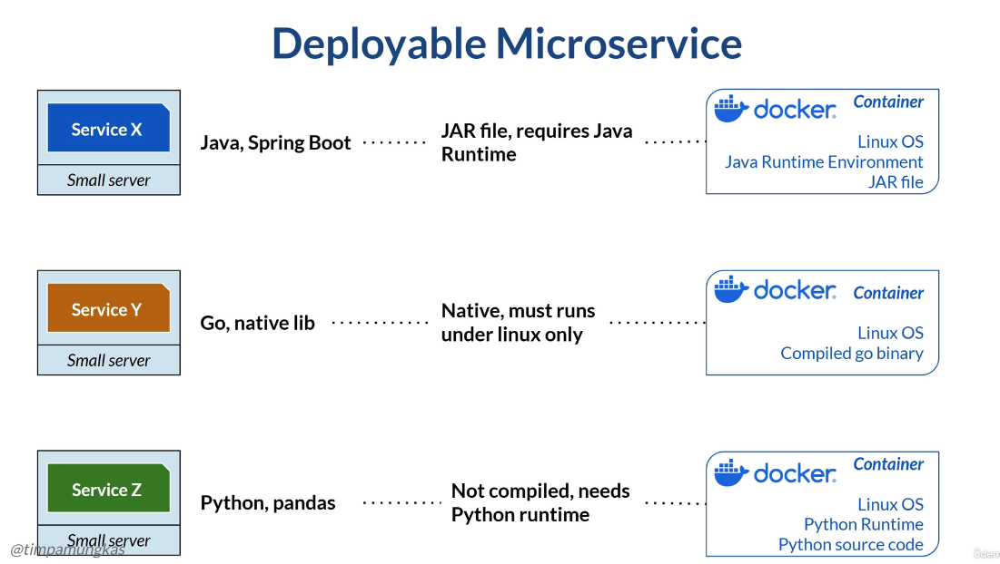


When a system consists of a small number of services, It's okay to assign a single service to a single server, usually a virtual machine rather than a physical server. Each server has its own operating system and runtime environment, such as Java or Python. 

As the system grows, the number of services will increase. Giving each service its own dedicated server might increase cost and waste resources. A service might not always keep the server busy, so the computing resources (CPU, memory, and disk) might idle at times. It's not just about wasting hardware resources. Each server typically needs to be configured and managed individually. The operating system needs to be hardened, the runtime version updated, etc. This approach means the more servers we use, the more effort we need to operate them, and eventually, more staff, which can lead to higher costs. In large microservice architectures, where systems consist of tens or even hundreds of service instances, an alternative was needed to address the hardware and maintenance challenges.

Meet the container technology! A container is like an independent package for an application, including everything required to run it. These include the minimalistic version of the operating system, any required runtime environment or library, and the application itself. For example, a RabbitMQ message broker container will include an Erlang runtime and can run on minimalistic Linux distributions like Alpine. 
A container also works when we write our own application. For example, a Java microservice container will include Alpine Linux, the Java runtime, Tomcat, required libraries, and the runnable JAR. 

Docker is the most popular container technology today, and most deployments in the DevOps stack use Docker containers. 

We can run multiple containers on the same host machine—either a bare-metal server or a virtual machine. Container technology will keep containers independent of each other. We don't need to think about the Python runtime environment for a Java container, or vice versa, even though those containers live on the same host. Also, when one container is crashed, the other containers will not be crashed. 

Docker is a popular container system That simplifies packaging the application, its programming libraries, and other dependencies, including the operating system. All the components required to run the application can be packaged into a Docker image that runs on any machine with Docker installed.

Docker runtime is supported in major operating systems: Linux, macOS, and Windows. Your package, or any other person's package, can be distributed through a Docker registry on the internet, sometimes also known as a Docker repository. So it is really a portable environment. The Docker logo is currently a whale carrying containers. 

The main components of Docker are images, containers, and registries (also known as repositories). When we package our application, its required libraries, the runtime, and operating system, we get a Docker image. Consider this like a zip archive, with additional metadata, such as the ports the application used, the specific folder for storing data, etc. Unlike a zip archive, we cannot just copy and paste into a Docker image and run it. To run the image, we need to run it as a container. Each container runs a single Docker image, and containers are independent of each other. Usually, it is a good practice for containers to access only limited resources, such as CPU or memory, allocated to each running container. To run a Docker container, we need a Docker runtime installed on the machine. One container can run only one Docker image, but one machine can run multiple Docker containers. Running three application instances means we need to run three containers with the same image. An image can be shared privately between individuals within an organization or publicly on the internet. To do that, we put the image into the Docker registry or repository. One popular registry is Docker Hub, though we can host our own. We package the application as an image and push it to the Docker registry. Other people will pull an image from the Docker registry and run it as a container.

The basic workflow for using Docker is as follows. 
- The developer builds a Docker image from her source code. Building an image requires Docker installed on her laptop, and she needs to create a Dockerfile. A Dockerfile is a text file containing instructions for building a Docker image. 
- She then pushes the image into the Docker registry. The operation team that has access to the production machine and the Docker registry will run the image as a container. 
- The production machine also has Docker runtime installed. Running the container means Docker pulls the image and creates a container from it. This is the most basic working process. 
- A DevOps engineer can create automated scripts or a pipeline to automate some or all of the process.
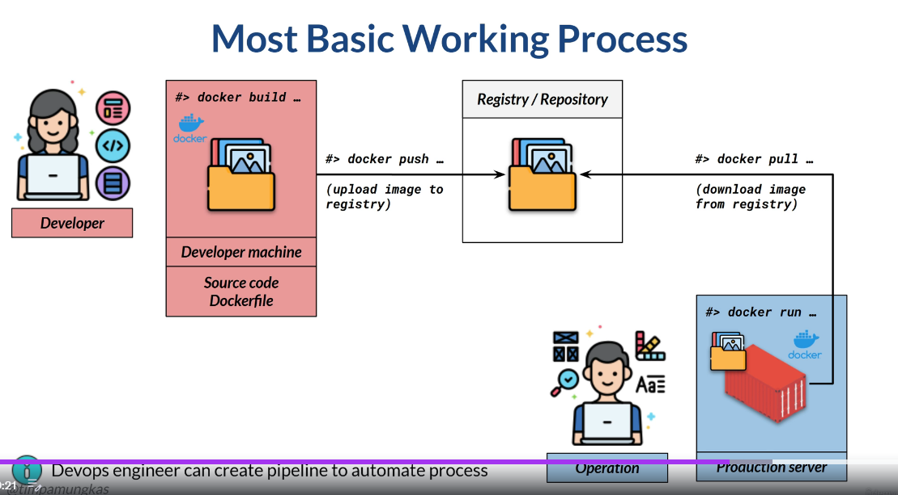

A Docker image will not care about the operating system on which it was built, or where it was pulled and run as a container. A Docker image contains its own operating system on which the application runs. For example, a person can use a Mac laptop, and build the image with packaged Ubuntu Linux. The image will always run on top of Ubuntu. Another developer who uses a Windows laptop pulls the image and runs it as a container. The image thinks it's running Ubuntu Linux. Even if a production server runs Red Hat Linux, a container running this image on that server will run on top of Ubuntu Linux. This portability is so wide that, in general, it will accommodate most cases. 
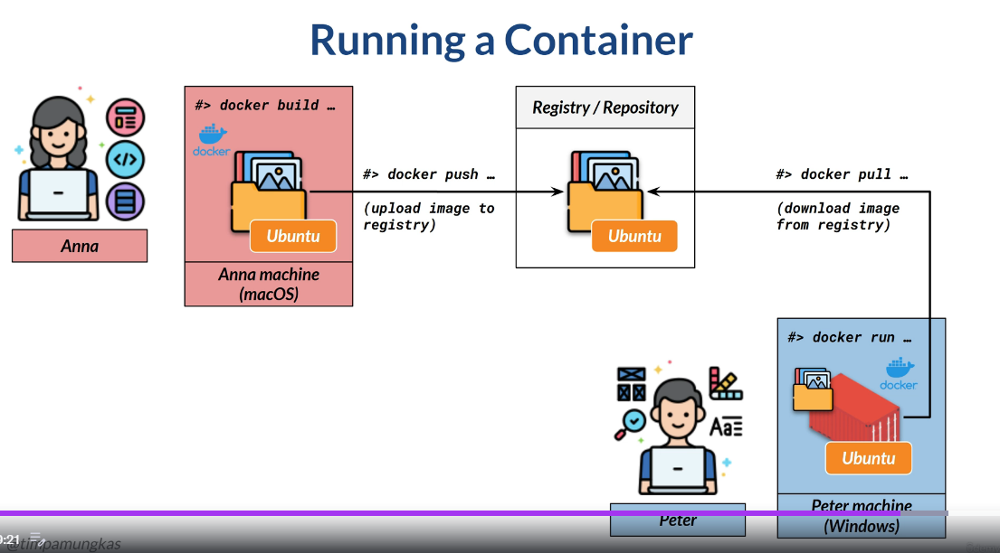

As we know, one host server can run multiple containers. A Docker image contains complete items, including the operating system and runtime libraries. An image size might be hundreds of megabytes. 

Suppose we have a 200 megabyte image. If we run five containers on one server with that particular image, does that mean it requires 1 gigabyte? The answer is no. Roughly, it will require only 200 megabytes, since all five containers use the same image. This efficient sizing is related to image layering. A container is a process that executes the image, so it does not create a copy of the image. It only runs the existing image. However, containers are independent of each other. This means if container two is modified or even broken, the other containers will not be affected.

A Docker image consists of layers. For example, a Java application image might contain layers. Then there is another Java application image, which contains layers. Notice that in the second image, the operating system, Java runtime, and library P are the same. At one server, there are two containers, one for each image. The Docker engine will know about the layers. Instead of using a distinct copy of the operating system, Java runtime, and library P for each container, it will share the same layer across containers. The disk space used on the server will roughly be this much. 60 + 75 + 40 + 30 + 20 + 34 + 17 = 259 MB.
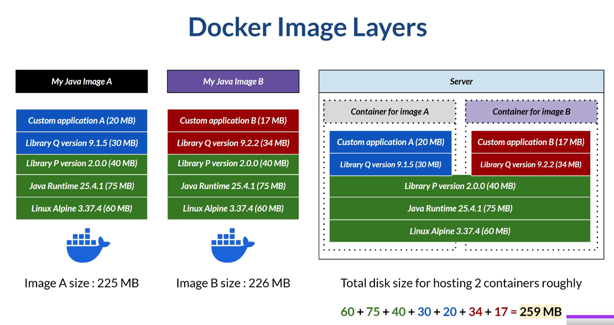

## Docker Hands on

Register and Install Docker Desktop - https://docs.docker.com/desktop/setup/install/windows-install/

Check if Docker is running with terminal
    terminal --> docker version

If everything goes well, it will show Docker information. If the Docker command is not recognized, restart your computer and try again.

For this course it is recommended that you allocate at least two cores and 4 GB of memory.

To do this, right-click the whale icon on the taskbar, then select the menu to change the Docker settings. Follow the instructions to configure resources.


For the first sample,

we will use an image built by others and published to Docker Hub, the public Docker registry. Search for 'Docker Hub' online and click the link on docker.com. We will run the Hello World image.

We can see the documentation here. There is a description section that may explain what the image is about if the image owner provides one. See the tag section. In here, we can see the image name and tag. Each Docker image can be tagged. This tag is free text, but should be something descriptive. Usually, this includes the image version, the operating system packaged with the image, and so on. The common image tag is 'latest', which indicates the most recent version of the image. Generally speaking, if we run a Docker container without specifying a tag, Docker will pull—or download—the image with tag latest—— assuming the image owner provides it.

To run a simple container, open a terminal and type 'Docker run image name colon tag'. To run Hello World with the latest tag, we can do this. 

    terminal --> docker run hello world

The Docker engine will check whether an image with a given tag is already available on our machine, pull it if it isn't, and then create a container.

For the second example, we will run busybox, a simple Linux image that provides many of the Linux command-line tools. When we search the busyboxtag on Docker Hub, we will see that it has many tags. This time, I will use the stable tag. So in the terminal, I will execute

    terminal --> docker run busybox:stable

Now that we have the container running, we actually have a busybox application on our laptop. 

An application is useful only if we can use it and interact with it. There are many commands that we can use to interact with Docker. Not only the container, but also the image, or even the Docker engine itself. Search for 'Docker command list' online, and we will find a reference for Docker commands here - https://docs.docker.com/reference/cli/docker/. This command can be used on any operating system that has Docker installed.

If you are a beginner in Docker, you might be confused about which command to use. This cheat sheet contains practical Docker commands for interacting with Docker and performing common tasks. 
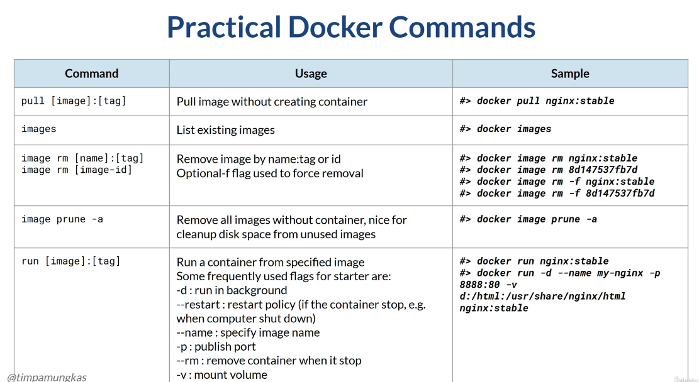

The run command is very important because it actually creates containers where we can run applications. Here, I provide a sample of the commonly used flag, but you can always refer to the documentation for a full reference. This part is for working with containers. 
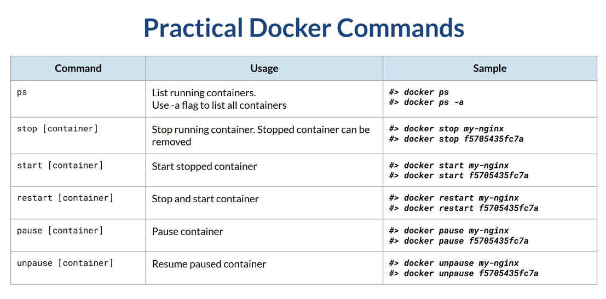

We have already seen how to run a hello-world and a busybox container, but neither is very useful. Let's see how we can interact with a container. We will run a simple nginx container. If you are not familiar, nginx is a simple web server. Run this command.

    terminal --> docekr run nginx

This command will pull the latest nginx image, then run it. This plain command starts nginx, but we cannot interact with it because it runs in the foreground and blocks the terminal. Close the terminal. Closing the terminal also stops the container.

Open a new one and execute this command to list all containers, including stopped containers. 

    terminal --> docker ps -a

See that it has an nginx container with status exit. 

Now we will run the nginx container in the background. 

    terminal --> docker run -d nginx
    
If we run the ps command again, even without the -a flag, we will see the running nginx container with status up. A container usually includes an operating system, so we can go inside it and interact with it. We can do this by using the Docker exec command. 

    terminal --> docker exec -it <container_id> bash

This line contains the container ID and name, both generated by the Docker engine. To run the bash shell within the container, execute this command. Notice that my laptop runs Windows, but I am now inside an nginx container running a packaged Linux distribution. 

This behavior means I can run Linux commands here. However, the packaged Linux is just a minimal operating system, so not all commands are available. For example, the top command usually displays resource usage, but it is not available in the packaged Linux. A web server is useful if it is, well, serving a web page. So we have an nginx container running, but it is not accessible. Default nginx runs on port 80, and the container has an nginx application running on the same port. But port 80 is only locally known within the container. Right now, we are inside the container, so if we curl 'localhost port 80', we will get a response.

    terminal --> curl http://localhost

Exit the container.

    terminal --> exit

Now, open a web browser and access localhost on port 80 We will get an error indicating that nothing is running on port 80. At this point, nginx is up and running but not accessible to the outside world. It is only accessible to the container. Having Docker is like having a virtual machine inside our machine. This means that if we have a laptop with this IP address and the Docker runtime installed, we will have the following conditions. This blue box is also called a Docker host. When a container runs an application, it will have its own virtual IP address. The container runs on a specific port, but the host cannot access the application on that port. The port number within the container is also like a virtual port number allocated by the Docker engine. The most common way is to publish the port on a container so it's accessible from the host. For example, we can publish container X on port 80 to port 8888 on the host machine. Make sure your 8888 port is free before this usage. It is not mandatory to expose the container port to the same host port number. This flexibility allows us to run another nginx instance on the same host. This second container also has a virtual IP address and a virtual port 80. To make the second container accessible, we also need to expose port 80. We can publish the port into any free host port. For example, we can publish the second nginx on port 8899.
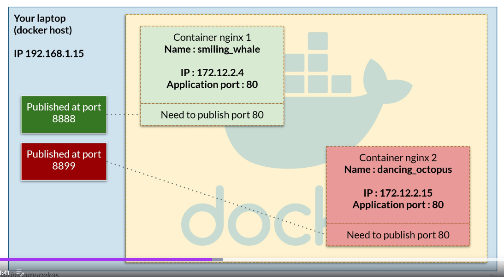

Let's doit. Remove the existing nginx container first.

    terminal --> docker rm -f <container_id?>

Let's create the first nginx container. We will use three flags. 

    terminal --> docker run -d -p 8088:80 --name smiling_whale --restart always nginx

- The 'd' flag makes the container run in the background, so it will keep running even after we close the terminal. 
- The 'p' flag publishes the container port to the designated host port. 
- The 'name' flag assigns a custom name to the container. We will use the latest nginx tag, so there's no need to specify a specific tag during Docker run. 
- We will publish container port 80 to host port 8888 and give the container the name smiling_whale. 
- If you want the container to run when the Docker engine starts, use the restart flag with the value 'always'.

Right now, the container is running. Open a web browser and navigate to localhost port 8888. We will see the Nginx welcome page. 

Notice that the container port is still virtual port 80, so if we go inside the container 

    terminal --> docker exec -it smiling_whale bash
    
and do curl, we need to curl to port 80.

    terminal --> curl https://localhost
    terminal --> exit

Let's create the second nginx container. This time, we will publish container port 80 to host port 8899 and give the container the name dancing_octopus. 

    terminal --> docker run -d -p 8899:80 --name dancing_octopus --restart always nginx

Open a web browser and navigate to localhost port 8899. We will see the Nginx welcome page. If we go inside the container. And do curl, we need to curl to port 80.

    terminal --> docker exec -it dancing_octopus bash
    terminal --> curl https://localhost

In a web browser, the localhost refers to your laptop. So this IP address is with the blue arrow. In the same way, if we run the host terminal. When we go inside the container, localhost refers to the container's virtual IP address. That means if we go into the smiling whale container and curl on the bash shell, The localhost refers to the green arrow. When we go into dancing octopus, The localhost refers to the red arrow. 
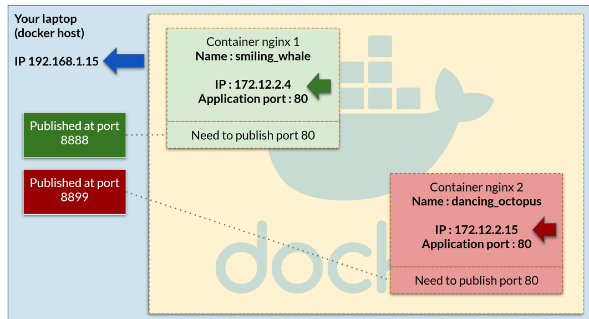

Another practical item when working with containers is volume mount. A Docker container is like a virtual machine with its own filesystem (or a volume). The smiling whale and dancing octopus container in the current sample has its own volume and contains different files.

For example, go inside the smiling whale container. 

    terminal --> docker exec -it smiling_whale bash

I will open a new terminal and enter the dancing octopus.

    terminal --> docker exec -it dancing_octopus bash

As a web server, nginx can serve static HTML files. The files are located in this folder.

    smiling_whale terminal --> cd /usr/share/nginx/html/

We can add a file, say whale.html, into the smiling whale container. Usually, Linux comes with an editor like vim or nano, but since Linux in a container is a minimal distribution, it might not include one. So we need to install it. I will install at the smiling whale.

    smiling_whale terminal --> apt update
    smiling_whale terminal --> apt install nano
    smiling_whale terminal --> Y

Now, add a whale.html file to the smiling whale.

    terminal --> nano whale.html 

    'I am a smiling whale'
save changes: esc, :wq!, enter

Now open a web browser and go to http://localhost:8888/whale.html.

Open another browser and go to http://localhost:8899/whale.html - 404 Not Found

This means we are accessing the dancing octopus container, but since that container does not include whale.html, we get a 404 error indicating the page does not exist. 

Go inside the dancing octopus.

    terminal --> docker exec -it dancing_octopus bash


This container does not have Nano installed. . This means when we change something in a container, the other containers will not be affected. In other words, containers are independent of each other. Let's install nano on dancing octopus.

    dancing_octopus terminal --> apt update && apt install -y nano

And add file octopus.html.

    dancing_octopus terminal --> /usr/share/nginx/html/ nano octopus.html

    'I am dancing octopus'
save changes: esc, :wq!, enter

Open another browser and go to http://localhost:8899/octopus.html

On the contrary, the smiling whale container will not get this octopus file. Open another browser and go to http://localhost:8888/octopus.html. What if we have an HTML file on the host machine and need to host it? Try it. Create a file atlantis.html under a folder containing 'This is atlantis'

We need to host this file, which means copying it into each container. We can do so by copying and pasting the file's content, which is troublesome. Or we can copy the file itself into the container. 

    terminal --> docker cp atlantis.html smiling_whale:/usr/share/nginx/html/

We can do so by using the Docker 'cp' command. Go into the host terminal and copy the atlantis.html file into the smiling whale container, folder /usr/share/nginx/html. 

    terminal --> docker exec -it smiling_whale bash
    smiling_whale terminal --> cd /usr/share/nginx/
    smiling_whale terminal --> ls

If we see the smiling whale filesystem, it will contain atlantis.html.

This means we can access atlantis.html using the smiling whale. But not on dancing octopus. If we want to use Atlantis on Dancing Octopus, we need to copy the Atlantis file into Dancing Octopus. We can also copy a file from the container to the host. 

For example, we can retrieve whale.html by using this command.

    terminal --> docker cp smiing_whale:/usr/share/nginx/html/whale.html whale_copy.html

All of these steps arequite annoying in practice. Furthermore, the container volume is ephemeral. If we remove the container, the volume and any files within it will be removed as well. For example, remove the dancing octopus. Then recreate it using the previous syntax. 


    terminal --> docker rm -f dancing_octopus
    terminal --> docker run -d -p 8899:80 --name dancing_octopus --restart always nginx

Now, if we go inside this newly created dancing octopus. 

    terminal --> docker exec -it dancing_octopus bash

It is a fresh volume, with no nano or octopus.html. Therefore, usually we do volume mounting.

    terminal --> ls /usr/share/nginx/html/

Volume mounting means we use a folder on the host machine and mount the container-specific folder into it. This action will treat the host folder as a container folder, so all files created, updated, or deleted in the host folder will be recognized in the container-mounted folder. Something like this, where we have the nginx-html folder on the host, and mount a specific folder on the smiling whale with it. We also have another folder on the host, and mount the dancing octopus to that folder. Better yet, we can mount the same host folder into multiple containers within that host. So we can mount the first host folder into the dancing octopus. Or even to the third container. 
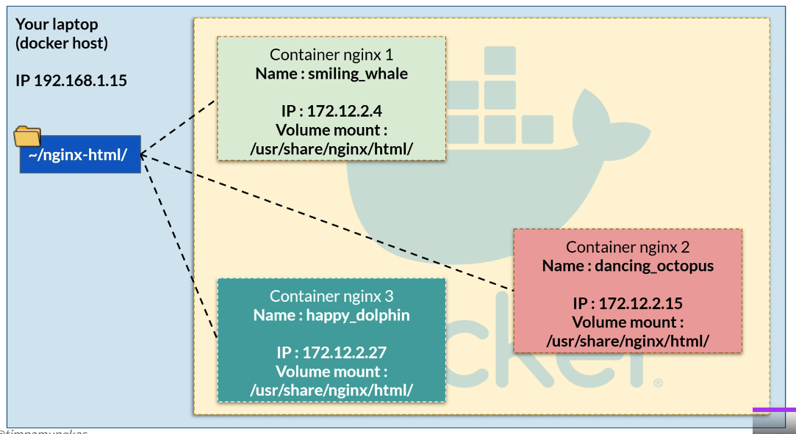


Let's try it. Remove the existing nginx containers.

    terminal --> docker rm -f smiling_whale dancing_octopus

Then recreate the smiling whale. I will mount the host folder containing atlantis.html into a specific folder on Smiling Whale. Please adjust the folder according to your own laptop. 

    terminal --> docker run -d -p 8088:80 --name smiling_whale -v d:/nginx-html:/usr/share/nginx/html/ --restart always nginx

Also, create a dancing octopus with a mounted folder. 

    terminal --> docker run -d -p 8888:80 --name dancing_octopus -v d:/nginx-html:/usr/share/nginx/html/ --restart always nginx

Open a web browser, and now we can access atlantis.html from both the smiling whale and the dancing octopus. This is because the host folder is mounted. 

    terminal --> docker exec -it smiling_whale bash
    smiling_whale terminal --> ls /usr/share/nginx/

    result: atlantis.html

    terminal --> docker exec -it dancing_octopus bash
    dancing_octopus terminal --> ls /usr/share/nginx/

    result: atlantis.html

If we open the smiling whale or dancing octopus container, we will see that the contents of the mounted folder match those of the host folder. If we add another file to the host folder, like northpole.html. The file will automatically be recognized on both containers. 

It is not uncommon to add or modify a file in a container-mounted folder. And if we did, the file would also be recognized in the containers. Since the host folder is mounted to both containers, we can access the North Pole from both. I will remove all the containers in this lesson.

    terminal --> docker rm -f dancing_octopus smiling_whale


## Building Docker Image

Containers play a significant role in DevOps, especially in deployment. In this lesson, we will learn how to create our own Docker image. We will create a Docker image for a Java application. To do this, we need to install Docker and Java. The source code is not a concern in this course. The application is a simple REST API with a few endpoints. The application will run at port 8111, so we need to expose that portlater.

To download Java, search 'download Amazon Corretto' - https://downloads.corretto.aws/#/downloads?version=25 and follow the installationinstructions for your operating system. If everything is installed, open the terminal and run this command to make sure. 

    terminal --> java -version

Ensure you have installed Docker. If needed, you can see the previous lesson about Docker installation.

The heart of building a Docker image is the Dockerfile. This file is literally a text file named Dockerfile, no extension. It is common practice to use capital case for the D and lowercase for the rest. It contains steps for building a Docker image. I provide sample Java source code, including a Dockerfile, in the last section of the course, in a lecture titled 'Resources & References'.

Generally speaking, tobuild an image from custom source code, We need to compile the application from source code into an executable. Notice that the steps may differ from one programming language to another. For example, in Java, we need to build using Maven or Gradle. In Python, we don't need to compile anything. On GO, we need to compile and build a binary, using the GO toolchain with specific syntax. Then we need a Dockerfile to instruct the Docker engine to build an image. Issue a Docker build command to execute Dockerfile instructions. This command will generate a Docker image on the local computer. We then tag the generated Docker image, Then push it to the Docker registry.
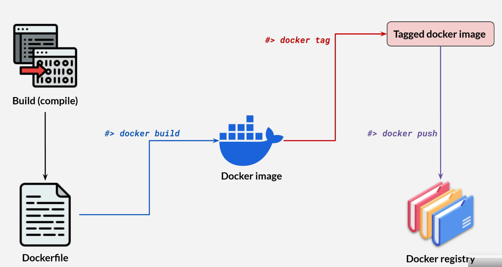

Use anytext editor to open the sample Dockerfile. A practical naming convention is that we use uppercase for instructions. Any line that starts with a hash character is just a comment. Here, we define the step-by-step instructions for building a Java image. Java source code needs to be compiled into a binary.

File kubernetes-istio\kubernetes-istio-java-code\release-1.0.0\devops.blue/Dockerfile
```Dockerfile
# Build command
# Adjust docker registry path (timpamungkas/...) into (your-docker-username/...)
#
# 1. [Linux/Mac] : ./gradlew clean bootJar 
#    [Windows]   : .\gradlew clean bootJar
# 2. docker build --tag devops-blue:1.0.0 . 
# 3. docker login (optional)
# 4. docker tag devops-blue:1.0.0 timpamungkas/devops-blue:1.0.0
# 5. docker push timpamungkas/devops-blue:1.0.0

# .\gradlew clean bootJar && docker build --tag devops-blue:1.0.0 . && docker tag devops-blue:1.0.0 timpamungkas/devops-blue:1.0.0 && docker push timpamungkas/devops-blue:1.0.0

# Start with a base image containing Java runtime
FROM amazoncorretto:17

# The application's jar file
ARG JAR_FILE=build/libs/devops-blue.jar

# Add the application's jar to the container
ADD ${JAR_FILE} devops-blue.jar

# Run the jar file 
ENTRYPOINT ["java", "-jar", "devops-blue.jar"]
```

Docker is not a compiler, so we need a compiler runtime to build the binary. That's why we need to install Java for this lesson. However, Docker also supports multi-stage builds, where compilation occurs in one stage (using a builder image that already includes a Java, Go, or other compiler). The final image contains only the compiled output. This way, we don't need to install Java locally, and the final Docker image stays small and clean. We will skip the multi-stage build and focus on the basics.

This Java source code uses Gradle to build a binary. From the terminal, go to the source code root folder and executethis command.

location - kubernetes-istio\kubernetes-istio-java-code\release-1.0.0\devops.blue

    terminal --> .\gradlew bootJar

If the build fail use Java17 

I'm using Windows, so I'm using backslashes as separators.

Please adjust theseparator to your operating system's settings.

When the command finishes, we will have a Java JAR file in this folder After the build is done we should have file: kubernetes-istio\kubernetes-istio-java-code\release-1.0.0\devops.blue\build\libs\devops-blue.jar. A JAR file is a Java executable. 

Now we need to package this JAR file into a Docker image. Remember the path and filename. 

Back to Dockerfile. The first thing we do is fetch the base image. Most of the time, we build an image from an existing one. This existing image already contains the Linux operating system and Java from Amazon. So we will use this base image. Then we put a reference to our executable, the jar file. The path and filename are the same as what we saw earlier.

```Dockerfile
# Build command
# Adjust docker registry path (timpamungkas/...) into (your-docker-username/...)
#
# 1. [Linux/Mac] : ./gradlew clean bootJar 
#    [Windows]   : .\gradlew clean bootJar
# 2. docker build --tag devops-blue:1.0.0 . 
# 3. docker login (optional)
# 4. docker tag devops-blue:1.0.0 timpamungkas/devops-blue:1.0.0
# 5. docker push timpamungkas/devops-blue:1.0.0

# .\gradlew clean bootJar && docker build --tag devops-blue:1.0.0 . && docker tag devops-blue:1.0.0 timpamungkas/devops-blue:1.0.0 && docker push timpamungkas/devops-blue:1.0.0

# Start with a base image containing Java runtime
FROM amazoncorretto:17

# The application's jar file
ARG JAR_FILE=build/libs/devops-blue.jar

# Add the application's jar to the container
ADD ${JAR_FILE} devops-blue.jar

# Run the jar file 
ENTRYPOINT ["java", "-jar", "devops-blue.jar"]
```

We then add the application's JAR to the image, naming it devops-dash-blue.jar. At this point, the application exists in an image. The image already includes Linux and Java. Hence, we can run our jar application. We can do that by using the following Linux command.

This last line is a Linux command. This command is the Docker image entrypoint, the command that will always be executed when the container starts using this image.

Run the Docker build command in the folder kubernetes-istio\kubernetes-istio-java-code\release-1.0.0\devops.blue

    terminal --> docker build --tag devops-blue:2.0.0 .

This command reads the Dockerfile and builds the image. We will name the resulting image as devops-blue, with tag 2.0.0. Notice the dot character at the end of the command. The Docker build command requires a path as the root working directory, usually the location of the Dockerfile. Since I'm currently on that path, I use a dot to indicate the current directory.

When the build is done,check the image on the local computer. We will have devops-blue with the defined tag.

    terminal --> docker images

We can runthis image locally if we want.

    terminal --> docker run -d -p 8888:8111 --name my-devops-blue devops-blue:2.0.0

The application runs on virtual port 8111, which I will exposeto port 8888. Give it the name my-devops-blue.

At this point, we can open a web browser to access the DevOps Blue application. Go to this

Browser - http://localhost:8888/devops/blue/swagger-ui/index.html

endpoint to show the API documentation. 

This API documentation is part of the application, not Docker.

We can also execute the endpoint. For example, open another tab and go to base URL, then

Browser - http://localhost:8888/devops/blue/actuator/health

This API is the health-check endpoint to verify that the application isrunning We have the image on the local computer. We need to push it to the registry so other people can use it too. Docker provides a free registry for public images. Go to docker.com and register.

When you are done, open Docker Desktop and log in. [docker login)

We then tag the image with our Docker username, so when we push it, it will be pushed to our repository. 

    termimnal --> docker tag devops-blue:2.0.0 docdanio/devops-blue:2.0.0

Please adjust this part to use your own Docker username.

So I'm tagging local devops-blue into my Docker repository slash devops-blue, tag 2.0.0.

Last, push the tagged image.

    terminal --> docker push <username>>/devops-blue:2.0.0

Check your Dockerrepository, and we will have devops-blue there

Let's remove the containers used in this lesson. Remove the image, too.

    terminal --> docker rm -f my-devops-blue
    terminal --> docker images                      # find image devops-blue:2.0.0 and copy the id
    terminal --> docker rmi <image devops-blue:2.0.0 id>

## Semantic Versioning

Why the tag is 1.0.0, and not v1, version 1, or simply 1? This kind of numbering is called semantic versioning, or semver for short. It is a convention for determining the version number of software releases. Using semantic versioning helps users to understand the severity of changes in each new release. We don't have to use semantic versioning, But using it is better, since it is a standard convention that software users have agreed to.

Semantic versioning has three parts: major, minor, and patch numbers for each release. The version string 1.3.2 in this example indicates 1 as the major, 3 as the minor, and 2 as the patch. Each of these parts is a number and increments according to certain rules.

For example, when we have version 1.3.2 as the current release of a payment software with this feature. The patch is incremented for bug fixes or other changes that do not change the software's behavior. For example, if there is a bug when we pay using QR code, we fix the code and ship the new release with a change to the patch number. Minor is incremented for new functionality or backward-compatible changes. For example, adding a new payment feature using PayPal, or changing two-factor authentication to a 6-digit alphanumeric code instead of just a numeric code. Incrementing the minor must reset the patch back to zero. The major version is incremented for breaking changes, which are not backward-compatible. For example, instead of payment, the application can now also be used to withdraw money from a merchant. To do that, the payment protocol must be changed, so the new release is a major update. Incrementing the major should reset the patch and minor to zero, although this is not a hard requirement.
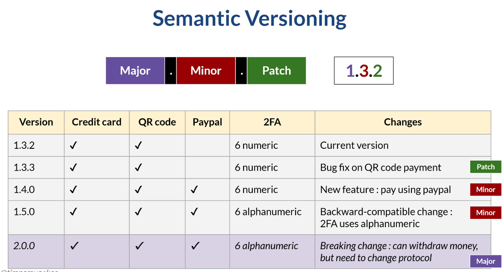

## Docker Compose

Sometimes, we will need more than one container on a single host to run an application. A container might only work if another container exists. For example, an application container needs a database container. Rather than running containers one at a time, Docker allows multiple containers to run simultaneously. For that purpose, we can use Docker Compose, a script that defines containers, images, and the configuration required. We will install using Docker Compose. 

For example, to use the WordPress content management system, we need to 'install' two things using Docker: a MySQL database and WordPress.

First, we must ensure Docker Compose is installed. Docker Compose should be automatically installed when we install Docker Desktop. For further information, search online for 'install Docker Compose' and consult the official Docker documentation. 

To verify thatDocker Compose is installed, open a console and type 

    terminal --> docker-compose version
    
If it shows the current version of Docker Compose, then we are ready to go.

In the last section of the course, the lecture titled 'Resources & References,' please download the Docker Compose WordPressscript.

A Docker Compose script is in YML format, with specific attributes. In the WordPress Docker script, we have two services (or technically, containers): MySQL and WordPress. We have already learned some of the attributes: image, container name, volume, restart, and port. Docker Compose is actually a script for creating containers. So it provides many more attributes for each container, but we will not see them all. In this script, there are two new attributes: environment and network.

'Environment' is the environment variables to be injected into the container. So it's like a Windows or Unix environment variable, with a value defined when we create the Docker container. In this case, we define the MySQL database name and credentials environment. In WordPress, we define the connection to the MySQL database. Since WordPress requires MySQL to run, we define the dependency. In this case, the MySQL container must be created first, then WordPress. Dependency here is more like a container creation order. Each container is still independent. For example, each will still have its own volume binding. Then there is a network field here. We define the network wordpress-net at the top and use it. One note: since we use the YML format, the order of attributes does not matter as long as the indentation is correct.

In a host machinewith multiple containers, this diagram illustrates the condition. This blue box is our computer environment, our 'localhost' with a certain IP address. We installed Docker in our environment. Docker itself is like a virtual machine inside our computer, the yellow box So our computer is acting as a 'Docker host'. When we create and run a container, such as MySQL, WordPress, or another container, it creates a separate environment inside Docker. Each container has its own environment and its own virtual IP address.

The virtual IP addresses for each container differ from those of the Docker host. The Docker host (the blue box) can access each container using the host IP address or localhost. However, the containers are not aware of each other. So, accessing localhost from the MySQL container uses its own virtual IP address, 178.1.1.1. But in this case, we need the MySQL and WordPress containers to talk to each other. In this case, we create a Docker network. In the Docker scripts, there will be a setup to create a network named 'wordpress-net'. Using this feature, each container in the same Docker network will be aware of and can access each other using IP addresses or service names. So if the WordPress container wants to access MySQL, it can do so using the virtual IP 178.1.1.1 or the MySQL name.

DockerCompose is not really relevant in this course. The purpose of knowing it is to demonstrate that we can manage or orchestrate multiple containers. This orchestration is so common because on a single host with sufficient CPU and memory, we can run multiple containers, sometimes dependent on each other. Tools for managing, scaling, and maintaining containerized applications are called orchestrators. Docker Compose is the simplest orchestrator and works on a single machine. In real life, we use Docker Swarm, Nomad, or Kubernetes as an orchestrator, with Kubernetes currently the most widely used. In this course, we will use Kubernetes as an orchestrator.

To runa Docker Compose script, run docker-compose up.

By default, the Docker engine will find a file nameddocker-compose.yml in the current directory.

Wecan also specify a Docker script to be executed by adding the 'F' flag. Since this sample uses a non-default filename, we can execute it like this. The 'F' flag specifies which file to use, and the ' d flag to run the containers in the background. Wait a moment while the Docker engine works. When it's done, open a web browser to localhost port 8000, and we will see the WordPress welcomepage.

If we look at the working folder, it alsohas a docker-data folder, which we mount a volume from the container to.

To terminate all containerswithin Docker, use the Docker down command.


