# Section 4 Kubernetes Basics

## Content
- 13 [Introducing Kubernetes](#13-introducing-kubernetes)
- 14 [Installing Kubernetes](#14-installing-kubernetes)
- 15 [Hello Kubernetes](#15-hello-kubernetes)
- 16 [Using Minikube](#16-using-minikube)
- 17 [Scaling Pod](#17-scaling-pod)


## 13 Introducing Kubernetes
[⬆ Back to top](#top)

A container provides an isolated environment in which an application and its dependencies can run. However, containers often need to be managed and connected to the external world. For example, shared file systems, networking, high availability, load balancing, and distribution. 

It is also impractical to have a single host (a machine) for a single container. It would be better if we used a single host machine to run many containers, enabling more efficient resource utilization. Such a thing is possible, and we can manage the containers on the host, using Kubernetes as an orchestrator.

Kubernetes is sometimes referred to as K8S because it has eight letters between k and s. As an orchestrator, Kubernetes lets us manage multiple containers within one or more hosts. The container can be a long-running service, like a web application. Kubernetes can manage application availability. Kubernetes can automatically start a container or restart it if it crashes. In the next few moments, I will explain Kubernetes using a ship as an analogy.

In an analogy, a container is a person. It has a brain, heart, lungs, etc., and can live on its own. Each person is independent. If one person gets heart surgery, the other person's heart will not be affected. To explore the wide sea of systems, a person can swim, but it won't be easy. Therefore, we need a ship to manage the person. Kubernetes is this ship. A person (the container) boards a ship. Kubernetes captain assigns a room to this person. Inside the room, there can be one or more people. This room is called a pod on Kubernetes. So a container (person in the analogy) lives in a pod (a ship's room in the analogy). A single pod can contain one or more containers. In Kubernetes, the smallest unit is a pod. On the ship, each container (hence the pod) performs a specific function. For example, Anna is an excellent chef, so she is responsible for providing food. This 'Anna' container can work alone, so she is alone in her pod. John is a master magician and is responsible for providing entertainment. However, John cannot work alone. He needs an assistant magician: Grace. In Kubernetes, John and Grace, both containers, must coexist to run. So they live in the same pod. 

We also have Kubernetes Captain. Kubernetes in a production environment is more like a fleet of ships. This fleet of ships is known as a Kubernetes cluster. The captain lives on a different ship, while containers and pods live on another ship. The captain's ship is called the Kubernetes control plane node. The ship where the pods live is called a Kubernetes worker node. Each Kubernetes cluster will have at least a control plane node and a worker node. In development, we can run them on the same machine to create a single-machine Kubernetes cluster. Anna is really good at cooking. The captain thinks: it would be nice if we let the outside world know there is an Anna pod so that end users can order food from Anna. The captain then posted an information board stating that food service is available on the ship. This information board, which exposes a pod, is known as a Kubernetes service. So now the outside world knows there is food service. However, end users (the application users) are not part of the ship. Consider them like drones that come to the ship to request services. A drone can request food through the Anna service. The Anna service acts as a load balancer, automatically distributing requests across all available Anna pods. The drone does not know or care which specific Anna pod serves the request. 
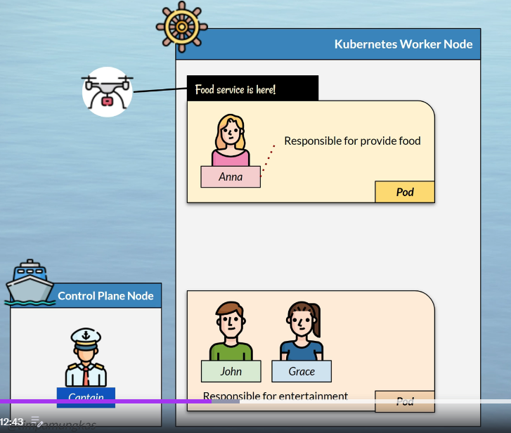

The drone just put the food order through the Anna service, which routes it to one of the available Anna pods. One of the Anna pods will serve the food, serve it back through the service, and then the drone will depart with it. At first, everything goes well. Anna pod can serve up to 20 food transactions per second. But then the food drones keep coming, and now there are 200 food transactions per second. Fortunately, the captain (the control plane node) can clone a pod whose function is the same across all pod clones. So the Kubernetes captain creates clones of Anna's pod, which, of course, include Anna's container. In Kubernetes, this clone is known as a replica. For 200 food transactions per second, the captain decides it needs 10 Anna pods, so he creates 10 replicas for the Anna pod. 
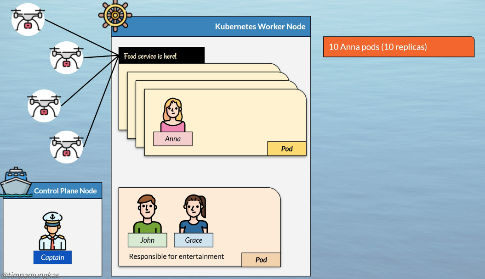

After further analysis, the transaction rate is not always 200 per second. It's only sometimes. Moreover, it does not always go directly to 200 transactions per second, but increases gradually: 50 per second, 100 per second, etc. So allocating 10 dedicated Anna pods on the ship is a waste of ship space, or, in the Kubernetes world, a waste of CPU and memory. So here is what is in the captain's mind. He will create at least two Anna pods. He can tell when those Anna pods are overwhelmed by watching their CPU and memory usage. If usage exceeds 80%, the captain will create a third pod and monitor it. If the third anna pod usage exceeds 80%, he will create the fourth pod and then watch it. On the contrary, if he has four anna pods and the 4th pod's usage is below 30%, he will reduce the pod replica to 3. The captain (the control plane node) will repeat this watch-create-or-remove process to ensure all food drones are served with the optimal number of Anna Pods. But he will have a minimum of 2 Anna Pod and a maximum of only 10. This automatic scaling feature is called Horizontal Pod Autoscaler (HPA). The HPA can automatically add or remove pods based on configurable thresholds, such as CPU or memory usage, or even custom metrics. Note that the service will not be affected by this replication. The service task exposes the pod to the external world. In this case, service is like an entry on the information board, so even if there are five Anna pods or only one, it does not matter. The information board only shows that food service is available.
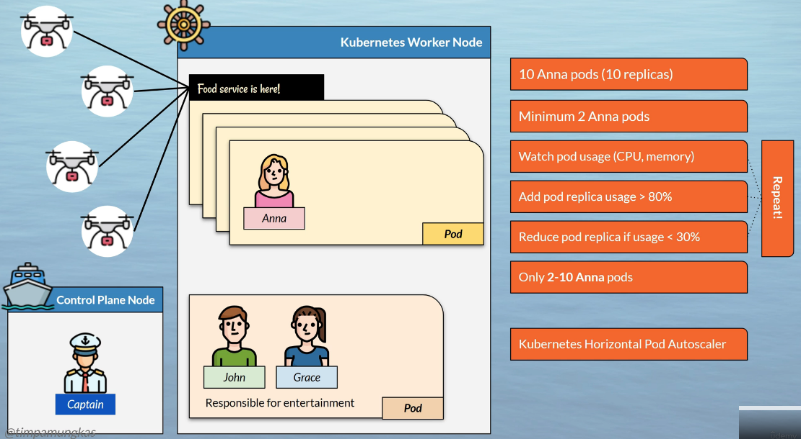

Pods areisolated from each other. Anna does not knowthe other pod's whereabouts, and vice versa. In Kubernetes, there is actually a Thomas Pod. Thomas is a nutritionist. His responsibility is to provide a diet and an eating menu. The captain thinks it will be good if Thomas and Anna can work together. The important thing is that everybody knows there is Anna and Thomas' pod. And so the captain created Thomas' service. Now, end users can interact with Anna, Thomas, or both. Even Thomas and Anna can interact with each other. The captain is also using horizontal replication on Thomas.

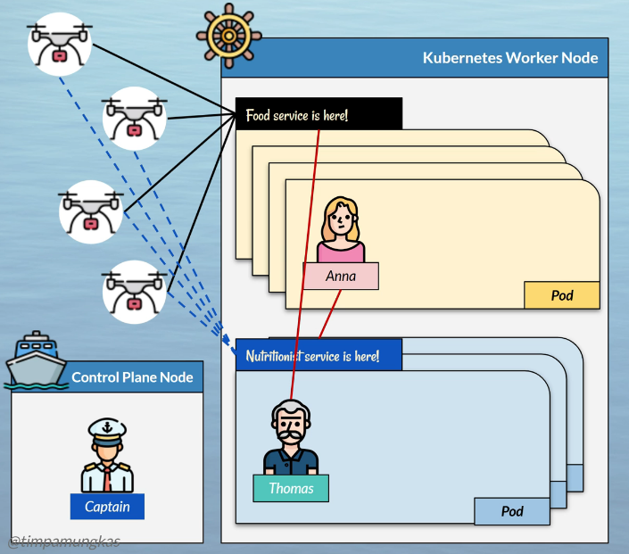

Let's stop here for a while. The actual Kubernetes will resemble the analogy, as shown in this diagram. There is a control plane node. The captain is the control plane node, consisting of the API server, scheduler, etcd, and controller manager. Most of the time, a Kubernetes admin or operator will manage a Kubernetes cluster by interacting with the control plane. Then there is a worker node, where the pod lives. Each pod can be exposed as a service, and each pod can have one or more replicas. A worker node usually has ample resources (CPU, memory, and disk) to allocate to pods. Kubernetes worker node components include kubelet, kube-proxy, and the container runtime. User access application in pods using services.

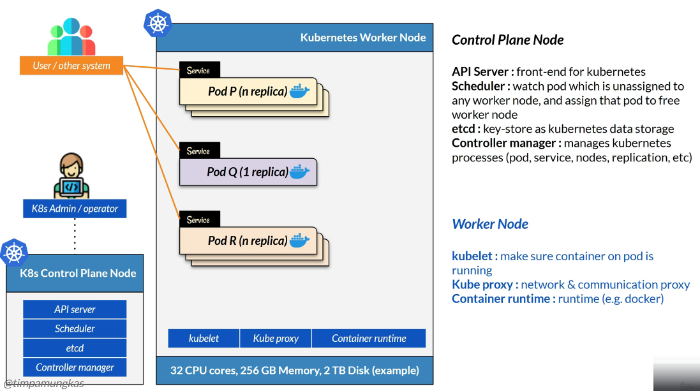

This process using Kubernetes goes so well, with many containers running across many pods and the pods exposed as services. Now the ship has Anna, Thomas, John (with Grace), Hannah, Justin, etc. The captain then uses a certain mechanism to manage pods. 
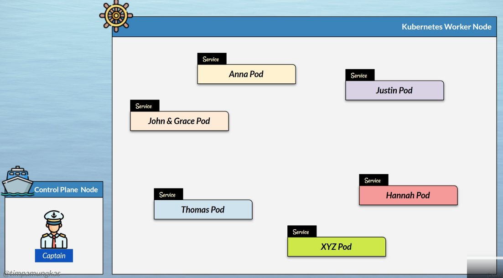

First, the captain separates the ship into distinct areas. In Kubernetes, this area is known as a namespace, where related pods are grouped. For example, the captain creates a namespace called health, where Anna (the chef), Thomas (the nutritionist), and Hannah (the fitness trainer) live. And then there is the entertainment namespace, where John (plus Grace) and Justin the singer live. The captain also said that each worker node will have a default namespace. Namespaces provide greater isolation, allowing pods in the same namespace to communicate and share resources more easily. For example, there might be a secret password accessible only by pods in the same namespace. For example, in real life, an application's namespace is currently in development, testing, and production. We can add as many namespaces as needed. Each Kubernetes cluster has a default namespace, though it is a better practice to put the application in a specific namespace. Second, we can label each container. This label can be very specific, like: bank transfer application, or more general, like 'finance', 'python app', etc. Each container can have zero to multiple labels. 


The actual Kubernetes will resemble the analogy, as shown in this diagram. There are default namespaces and other namespaces on the worker node. The namespace is up to you. This example uses the software development lifecycle: development, test, and production. Each namespace has its own pods. In this sample, each pod includes Q and R, but the content will differ slightly across namespaces depending on the progress of each software development lifecycle. Moreover, in production, we use a horizontal autoscaler, whereas on dev and test, we use only one replica.


One day, Anna comes and asks the captain, Where can she save her recipe books? These books represent data. The captain says he has some bookshelves for Anna to keep her books. In Kubernetes, a container may require a volume (a filesystem) to store data. Typically, data is saved on a dedicated database product outside Kubernetes. But sometimes non-database items exist, like specific XML configuration or PDF output from certain pod processes. In Kubernetes, we can mount volumes for use by pods. The captain said he has many types of bookshelves: short, tall, wide, etc. Kubernetes has many types of volumes. For example, a volume can be a local disk on a worker node, a dedicated persistent disk in cloud products, or another type of storage.
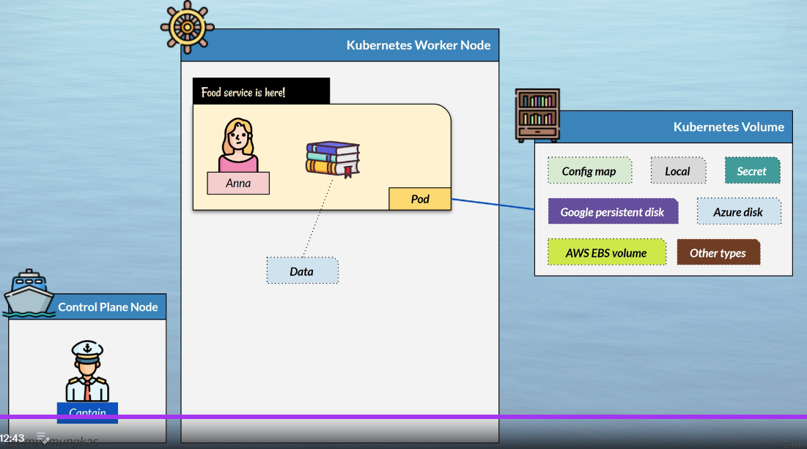


The Kubernetes way has become even more popular, and one ship (one worker node) is no longer enough. The captain then requested another ship. So the almighty Kubernetes admin provides two more ships, and the captain now manages three ships (three worker nodes). A Kubernetes cluster is so smart that it can allocate pods, or even pod replicas, to different nodes, and the user interacts only through the exposed service. The user does not need to know where the services are distributed. And so, this is the analogy for basic Kubernetes.
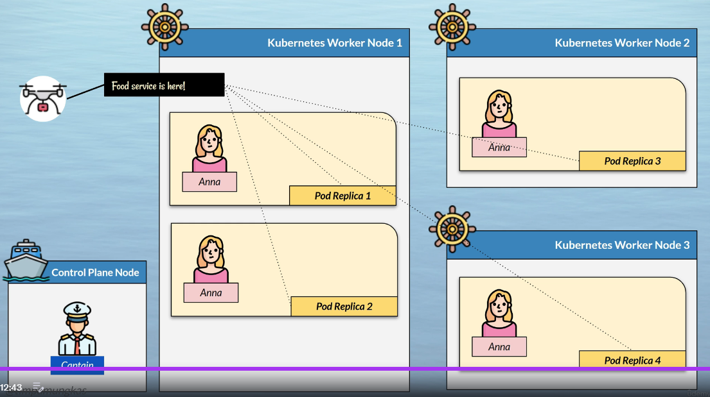

Each cluster will have a control plane node and one or more worker nodes. The worker node has namespaces. Each worker node runs a pod replica that contains one or more containers. Pods are exposed via the service, and the user can access pod functionality through it.
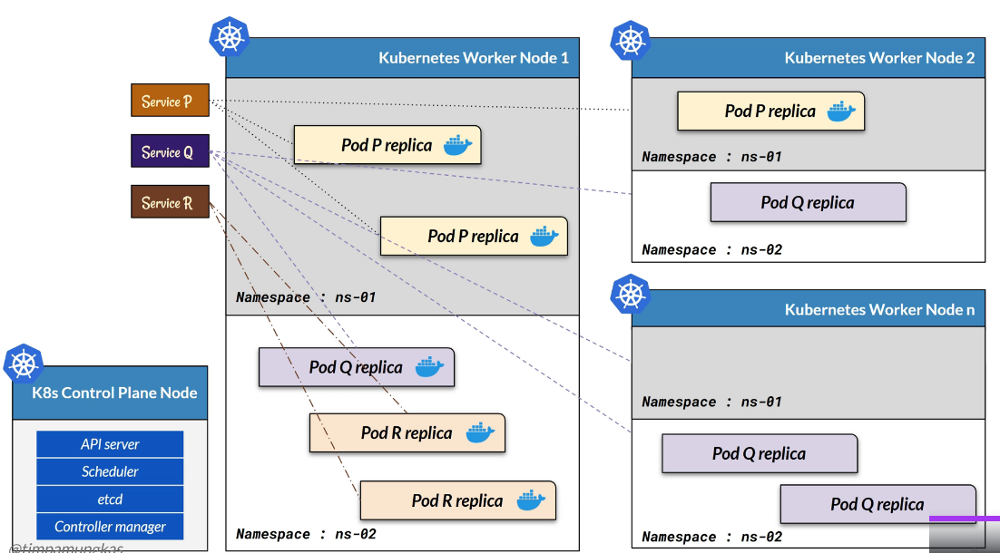

[⬆ Back to top](#top)


## 14 Installing Kubernetes
[⬆ Back to top](#top)

There are multiple ways to install Kubernetes. In the local environment, we can use Kubernetes embedded on Docker Desktop. If we use a Linux machine without a graphical user interface, we can install using minikube. In the cloud, each provider will have their own name. Google Cloud has Google Kubernetes Engine. Amazon provides Elastic Kubernetes Service. Azure provides Azure Kubernetes Service. Local installation for this course will use Kubernetes on Minikube. If you use Docker Desktop, you might need additional setup or commands, but that is out of scope for this course.

To interact with minikube, we need to install kubectl. Open a browser and find "install kubectl".

Go to this site. Follow the instructions to install kubectl - https://kubernetes.io/docs/tasks/tools/install-kubectl-windows/

Open a terminal and type kubectl, the Kubernetes command line tool. When everything goes fine, we should have something like this

```bash
$ kubectl version
Client Version: v1.34.0
Kustomize Version: v5.7.1
Server Version: v1.35.0
```

and local Kubernetes can be used.

Touse minikube, we still need Docker installed. Ensure you have it already. Search online for "install minikube" and go to this site - https://minikube.sigs.k8s.io/docs/start/?arch=%2Fwindows%2Fx86-64%2Fstable%2F.exe%20download

There are detailed installation guides for each operating system, and we only need to follow them. I will use the Windowsinstallation guide. After installing minikube, run it. Open a terminal and type 

Check current kubectl context
	terminal --> kubectl config get-contexts

If we have used kubectl with different driver we need to switch kubectil context to Docker driver

	terminal --> kubectl config use-context docker-desktop

Delete previous minikube work if any:

	terminal --> minikube delete

Start on clean minikube setup

	terminal --> minikube start --cpus 4 --memory 8192 --driver docker

Wait a while until it becomes ready.


[⬆ Back to top](#top)


## 15 Hello Kubernetes
[⬆ Back to top](#top)

In this lesson, we will deploy a single nginx pod to the local Kubernetes cluster. Mostly, we will work using kubectl on the terminal. I'm using Windows, but the kubectl command is the same for all operating systems. All commands in this course are available in the last section of the course, in the lecture titled 'Resources and References'. 

To deploy something to Kubernetes, we use the 'kubectl deploy' command. 

    terminal --> kubectl create deployment my-nginx --image nginx:stable

    # result: deployment.apps/my-nginx created

This sample tells Kubernetes to create a deployment named my-nginx using the nginx Docker image with the tag 'stable'. We can see objects in Kubernetes by using the syntax 'kubectl get object type'. So to see deployments, we can use this.

    terminal --> kubectl get deployment

    # result:
    NAME       READY   UP-TO-DATE   AVAILABLE   AGE
    my-nginx   1/1     1            1           50s


We will seethat it has a ready field here, which indicates how many pods are ready. Creating a deployment will create a pod. We can see the existing pod using this command.

    terminal --> kubectl get pods

    # result:
    NAME                        READY   STATUS    RESTARTS   AGE
    my-nginx-6799bfdf57-876wb   1/1     Running   0          91s


Each kubectl command has documentation by adding the 'H' flag. To read the documentation for kubectl get, run this. 

    terminal --> kubectl get -h

Back to the pod. 

    terminal --> kubectl get pods

    # result:
    NAME                        READY   STATUS    RESTARTS   AGE
    my-nginx-6799bfdf57-876wb   1/1     Running   0          91s

This command result indicates that there is one pod with status running. If your pod is not running, wait a while. Remember, a pod contains one or more containers running Docker images. Creating a pod eventually requires pulling an image from the Docker registry, and might takesome time.

To find detailed information on a pod, we can use the 'describe pod' command. 

    terminal --> kubectl describe pod my-nginx-6799bfdf57-876wb

If you failed to pull the Docker image due to a slow network, try pulling it manually withDocker.

Delete the deployment.

    terminal --> kubectl delete deployment my-nginx

    # result: deployment.apps "my-nginx" deleted from default namespace


And re-create it.

    terminal --> kubectl create deployment my-nginx --image nginx:stable

    # result: deployment.apps/my-nginx created

Now that we have a pod, we need to expose it to the outer world. In other words, we will create a service for the nginx pod. 

    terminal --> kubectl expose deployment my-nginx --type NodePort --port 80

    # result: service/my-nginx exposed

We will learn more about service later. This command creates a NodePort service, one of the service types in Kubernetes. We will expose port 80, the nginx port. Kubernetes will allocate a random free port for the nginx. If we see the service now. 

    terminal --> kubectl get service

    # result:
    NAME         TYPE        CLUSTER-IP       EXTERNAL-IP   PORT(S)        AGE
    kubernetes   ClusterIP   10.96.0.1        <none>        443/TCP        14m
    my-nginx     NodePort    10.102.163.173   <none>        80:31710/TCP   48s

It has this port setting, meaning that port 80 on the nginx deployment is exposed on port 30,000or so 

When I curl to localhost, or 127.0.0.1, we don't get a response. On minikube, we will need an additional step. We can ask minikube to tell the service URL using this command.

    terminal --> minikube service my-nginx --url

    # result:
    http://127.0.0.1:51635
    ! Because you are using a Docker driver on windows, the terminal needs to be open to run it.

Try to curl there, and we will get a response.

    cmd terminal --> curl http://127.0.0.1:52003

If we open a browser and go to localhost on that port, - http://localhost:52003/ I can access nginx on Kubernetes.

Although simple, this sample includes three types of Kubernetes resources: deployments, pods, and services. Kubernetes contains a lot more, as shown by this command. 

    terminal --> kubectl api-resources

The two commands we saw (get and describe) require a parameter from this API resource. So if we want to describe my-nginx deployment service, use this.

    terminal --> kubectl describe service my-nginx

    # result:
    Name:                     my-nginx
    Namespace:                default
    Labels:                   app=my-nginx
    Annotations:              <none>
    Selector:                 app=my-nginx
    Type:                     NodePort
    IP Family Policy:         SingleStack
    IP Families:              IPv4
    IP:                       10.102.163.173
    IPs:                      10.102.163.173
    Port:                     <unset>  80/TCP
    TargetPort:               80/TCP
    NodePort:                 <unset>  31710/TCP
    Endpoints:                10.244.0.4:80
    Session Affinity:         None
    External Traffic Policy:  Cluster
    Internal Traffic Policy:  Cluster
    Events:                   <none>


[⬆ Back to top](#top)


## 16 Using Minikube
[⬆ Back to top](#top)

The following terminal commands are for operating minikube in this course. "Minikube start" starts a Kubernetes cluster. We run this command when we restart our laptop, and after the Docker engine started. Minikube requires Docker to run. If you configure your Docker installation not to start automatically, please start Docker manually before starting minikube. We can configure minikube's memory and CPU by setting memory and CPU flags. 

"Minikube stop" stops Kubernetes. Stopping minikube will not delete resources, such as the application already deployed on Kubernetes.

Minikube tunnel will be used to create network tunneling from Kubernetes to the host machine. Hence, we will be able to access the cluster from the browser using the localhost address. If you haven't been able to access Kubernetes via a browser or an HTTP address, you may not have run the "minikube tunnel". Don't close the terminal where the minikube tunnel is running. Minikube has several add-on modules, and we will use some of them. To turn these add-ons on or off, use the command "minikube add-ons enable" or "minikube add-ons disable". We will see more details about this command later.

"Minikube delete" will stop Kubernetes, and remove all resources deployed on the local Kubernetes cluster, so we start from scratch. Think of it as a way of resetting Kubernetes to a clean slate. For the course, I recommend running "minikube delete" after each section. This way, we will start fresh in the next section and avoid confusion, since most sections use similar resources that differ only slightly based on what we will learn. 

[⬆ Back to top](#top)

## 17 Scaling Pod
[⬆ Back to top](#top)

In this lesson, we will learn how to scale a pod. Remember about scaling? We will create multiple instances of a pod on Kubernetes. To do this, we will use the devops-blue image from the previous lesson about building a Docker image. If you did not build the image, you can use my image on Docker Hub. For the command, you can copy and paste from the "Resources and References" section of the course.

For starters, create a deployment using the devops-blue image.

    terminal --> kubectl create deployment my-devops-blue --image docdanio/devops-blue:2.0.0

    # result: deployment.apps/my-devops-blue created

Then expose the pod as a service. This time, we will use a service-type load balancer with a specificname. Make sure your laptop is free on port 8111.

    terminal --> kubectl expose deployment my-devops-blue --type LoadBalancer --port 8111 --name my-devops-blue-lb

    # result: service/my-devops-blue-lb exposed

For minikube, please always run minikube tunnel after starting minikube so the pod is accessible from the host. Keep this window open.

    terminal --> minikube tunnel

Thus, we will need a second window to interact with other kubectl commands. At this point, we can access the DevOps Blue application on port 8111.

    browser --> http://localhost:8111/devops/blue/swagger-ui/index.html

The Kubernetes engine allocates a virtual IP address for the pod. We can see the virtual IP address in the output of the "describe service" command. 

    terminal --> kubectl describe service my-devops-blue-lb

    # result:
    Name:                     my-devops-blue-lb
    Namespace:                default
    Labels:                   app=my-devops-blue
    Annotations:              <none>
    Selector:                 app=my-devops-blue
    Type:                     LoadBalancer
    IP Family Policy:         SingleStack
    IP Families:              IPv4
    IP:                       10.98.39.118
    IPs:                      10.98.39.118
    LoadBalancer Ingress:     127.0.0.1 (VIP)
    Port:                     <unset>  8111/TCP
    TargetPort:               8111/TCP
    NodePort:                 <unset>  31123/TCP
    Endpoints:                10.244.0.5:8111           # Virtual IP field
    Session Affinity:         None
    External Traffic Policy:  Cluster
    Internal Traffic Policy:  Cluster
    Events:                   <none>


See the endpoints field, where we got this virtual IP. 


If you use the application from my Docker Hub, it also provides an API to find out the IP address. For example, let's curl to 

    terminal --> curl http://localhost:8111/devops/blue/api/hello

    # result: 
    Version [1.0.0] Hello from app [devops-blue running at 10.244.0.5] on k8s pod [my-devops-blue-77bbcb59f8-qsmvz]

As we can see, the IP address here is a pod virtual IP. If I refresh the URL, it will always get this IP address. Now here is the interesting part. We can scale the pods, but the service will only use one endpoint. To do this, we will use a service-type load balancer.

When we have more than one pod, we can distribute incoming traffic across them. The one responsible for distributing or balancing the load is the service with the load balancer type. This service type will distribute traffic even if the pod is located on separate worker nodes. Hence, no single pod handles 100% of the traffic. Each pod handles only partial traffic, not necessarily evenly. For example, if we have three pods, the proportion for each pod can be around one-third. Or it can be 20-40-40. This distribution depends on the algorithm used to distribute the load. The aim is to balance the load across available pods. So if the third pod is no longer available, the traffic only goes to pods one and two. On the contrary, when the fourth pod exists, traffic is distributed across the four pods. The user will only access the load balancer, without knowing what happens behind the scenes.
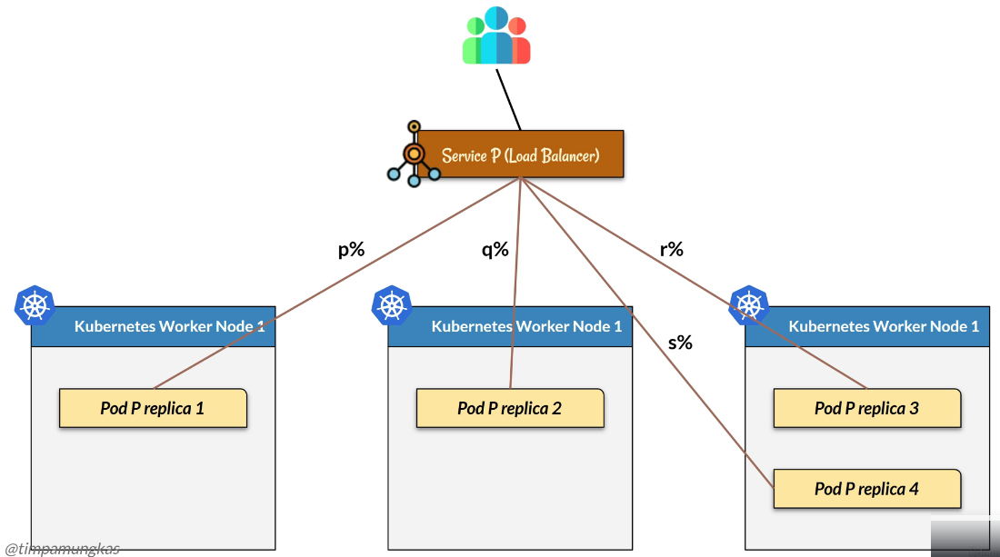

Now we go to the magic, the balancing. We scale the existing deployment to three replicas using the scale command.

    terminal --> kubectl scale deployment my-devops-blue --replicas 3

    # result: deployment.apps/my-devops-blue scaled

If we run the get pod command, it will have three instances of devops-blue. Add the wide output flag to see the virtual IP.

    terminal --> kubectl get pods -o wide

    # result:
    NAME                              READY   STATUS    RESTARTS   AGE   IP           NODE      
    my-devops-blue-77bbcb59f8-6bdwt   1/1     Running   0          63s   10.244.0.6   minikube   
    my-devops-blue-77bbcb59f8-jf55s   1/1     Running   0          63s   10.244.0.7   minikube   
    my-devops-blue-77bbcb59f8-qsmvz   1/1     Running   0          10m   10.244.0.5   minikube   

If we describe the load balancer service, we can also see that it has three virtual IP addresses. 

    terminal --> kubectl describe service my-devops-blue-lb

    # result:
    Name:                     my-devops-blue-lb
    Namespace:                default
    Labels:                   app=my-devops-blue
    Annotations:              <none>
    Selector:                 app=my-devops-blue
    Type:                     LoadBalancer
    IP Family Policy:         SingleStack
    IP Families:              IPv4
    IP:                       10.98.39.118
    IPs:                      10.98.39.118
    LoadBalancer Ingress:     127.0.0.1 (VIP)
    Port:                     <unset>  8111/TCP
    TargetPort:               8111/TCP
    NodePort:                 <unset>  31123/TCP
    Endpoints:                10.244.0.5:8111,10.244.0.7:8111,10.244.0.6:8111   # 3 IPs
    Session Affinity:         None
    External Traffic Policy:  Cluster
    Internal Traffic Policy:  Cluster
    Events:                   <none>


But we only access one endpoint, the load balancer.

Let's curl to http://localhost:8111 hello endpoint several times. As we can see, the IP address and application name can differ, meaning the pod receiving traffic is also different.

    terminal --> curl http://localhost:8111/devops/blue/api/hello

    # result:
    [1.0.0] Hello from app [devops-blue running at 10.244.0.6] on k8s pod [my-devops-blue-77bbcb59f8-6bdwt]
    [1.0.0] Hello from app [devops-blue running at 10.244.0.7] on k8s pod [my-devops-blue-77bbcb59f8-jf55s]
    [1.0.0] Hello from app [devops-blue running at 10.244.0.5] on k8s pod [my-devops-blue-77bbcb59f8-qsmvz]

Within Kubernetes, we actually have these resources. First, the deployment, where we indicate that we use a certain Docker image and three replicas. So we have three pods up. One pod equals one container, or one instance of an image. So each pod has a different name and a different virtual IP address. Then we have a load balancer service, a single communication entry point for pod replicas. Each traffic flowing through the service will be distributed to the pod.

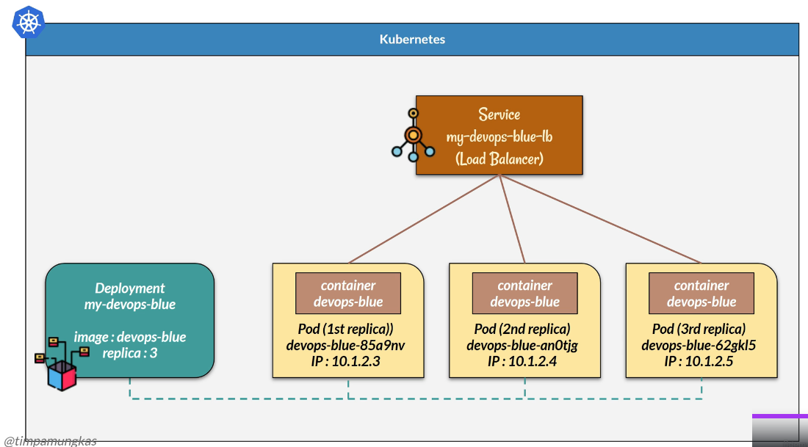


[⬆ Back to top](#top)
