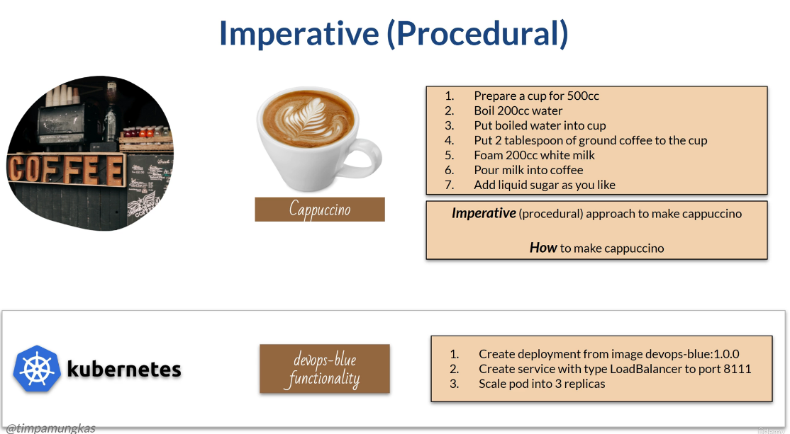
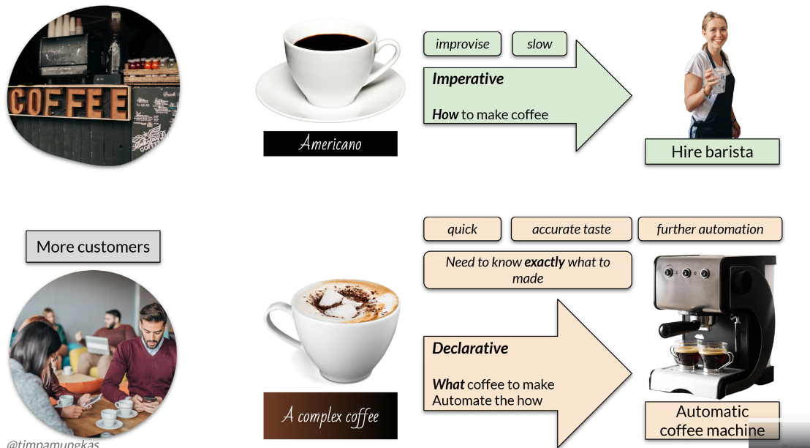
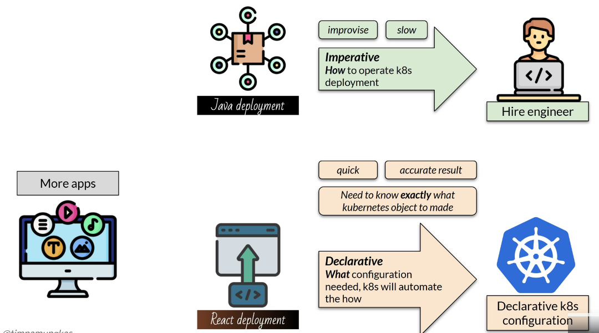
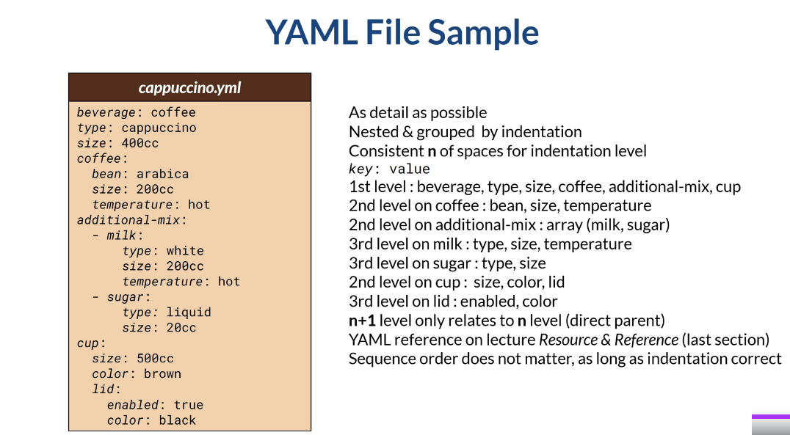
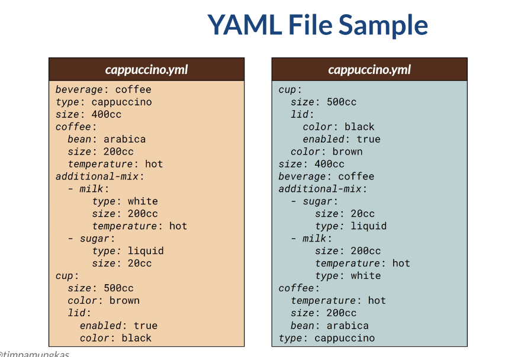
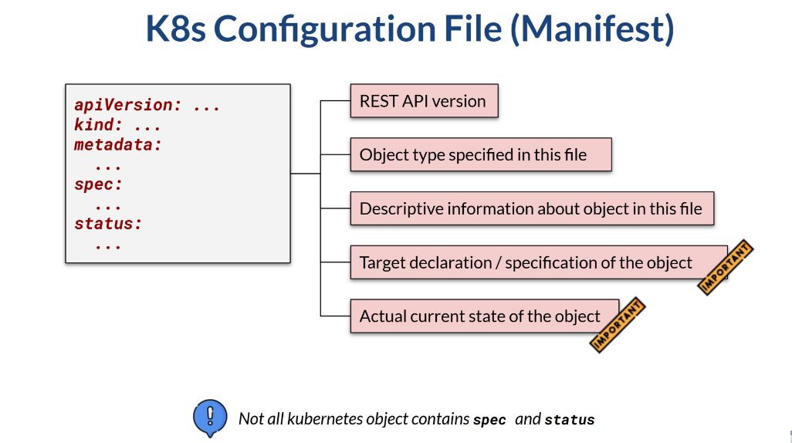
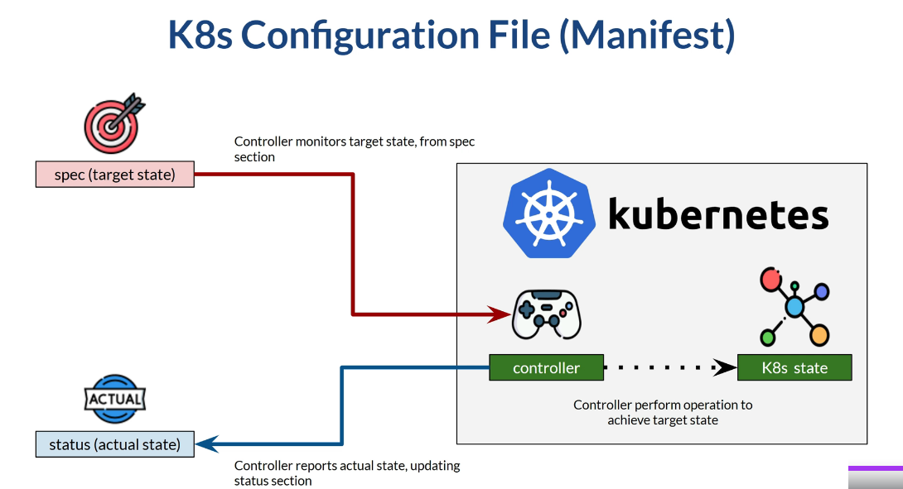

# Section 5 Declarative Kubernetes

## Content
- 18 [Imperative vs. Declarative](#18-imperative-vs-declarative)
- 19 [Declarative Kubernetes](#19-declarative-kubernetes)
- 20 [Declarative Kubernetes - Hello Sample](#20-declarative-kubernetes---hello-sample)
- 21 [Replica Set](#21-replica-set)
- 22 [Declarative Kubernetes - Update Delete](#22-declarative-kubernetes---update-delete)

Delete the previous minikube and start fresh Minikube cluster

    terminal --> minikube delete
    terminal --> minikube start --cpus 4 --memory 8192 --driver docker

Start minikube tunnel and don't close the terminal

    terminal --> minikube tunnel

## 18 Imperative vs. Declarative
[⬆ Back to top](#top)

The kubectl command-line tool is used to create, read, update, and even delete Kubernetes objects. Using kubectl, we take an imperative approach to configuring Kubernetes. In reality, we mostly use a declarative approach by writing a Kubernetes configuration file, and applying that file to Kubernetes. To continue, we must understand the difference between the imperative and the declarative.

Once upon a time, I had a coffee shop. As we know, there are many ways to serve coffee. Right now, the only menu item is cappuccino coffee. To create one cup of good cappuccino, I must do several steps. Each step is specific,and to get a perfect cappuccino, each step must be executed in order. Of course, some steps can be interchanged. I can put either milk first or sugar first.

However, some steps must be taken in order. For example, I cannot prepare the cup at the second step. It must be at the first step. This cappuccino-making (step-by-step, following the exact order) is called imperative or procedural. In other words, I must know how to make cappuccino coffee. That is what we did using kubectl in the previous example. We create a deployment, expose a service, and scale a replica. We can scale a replica first, or create a service first, but we cannot create a service without first creating a deployment. Generally speaking, they must be in the correct sequence.


Eventually,I have a lot of customers to serve, and even an additional menu, like Americano coffee, or even a complex menu like 'hazelnut coffee latte with chocolate chip'. I cannot handle my coffee shop alone, so I have two choices. First, hire a barista who knows how to make coffee. This choice means I will need another person to do the imperative approach (the 'how' approach). Or the second choice: I can buy a coffee machine. There is an amazing coffee machine. I tell the machine what kind of coffee I want, and the machine brews it for me. The machine is really accurate, so each cup of coffee will taste the same. The trade-off? I must know exactly what kind of coffee I want and learn how to instruct the machine accordingly. This kind of approach is called declarative. We tell what we want, and the machine will do the how. We don't need to know how. The machine will handle it automatically. So, the declarative approach is also called the 'what' approach. Generally speaking, the declarative approach with a coffee machine has benefits. We can serve coffee quickly, with the same taste each time. Of course, having a barista can be a benefit, as a barista is a human with specialized skills and can thus improvise. But serving coffee is somewhat repetitive. Therefore, a machine would be more beneficial. Also, we can even further automate the job later. On the other hand, using a human barista is slower and can become a bottleneck when many coffees need to be served.


The following case is what happens in the software world. 

As the business grows, there will be more applications to be deployed. Each deployment can have its own variation:

We need a different way to deploy a Java or React application. One person will not be enough to handle all applications on time, so we can hire someone who knows how to operate Kubernetes. The person follows the imperative kubectl steps, which can be slow, but can improvise commands when needed. Alternatively, we can use declarative Kubernetes configuration. We need to know exactly what kind of Kubernetes object & configuration we need, write it in the configuration file, and ask the Kubernetes engine to automate the how. This approach is faster, and the Kubernetes internal process will create the object accurately. Also, further automation will be possible later.


 Kubernetes provides a declarative way out of the box. We create a declarative configuration file that contains the 'what'. Specifically, the file defines what kind of Kubernetes object we want to create. This configuration file is a YAML-formatted text file. We then apply the configuration. In analogy, we press the 'create coffee' button. Kubernetes will then handle the object creation. We don't need to write multiple kubectl commands in order, as Kubernetes will handle those. We need to know exactly which object we need, along with each object's configuration. Do we need a deployment object? If so, which image to use? How many minimum and maximum replicas do we need? If we need service, will we need a type load balancer or a node port? Don't worry, although it seems complex, Kubernetes provides documentation on what to write.

In the long run, deploying an application to Kubernetes is a repetitive job. We build an image from source code, deploy it into a pod, and expose it. There will be slight configuration differences, such as the image to use, the port to expose, and so on. But the overall process is the same. Therefore, using a declarative approach, we can create a base configuration file. Change it slightly, then apply it. It will be much faster and less error-prone. DevOps tools are about automation. Having a declarative approach will open wider opportunities to automate the process. Thus, it is better always to use the Kubernetes declarative approach.

YAML, or 'Yet another markup language,' is a text file written following specific rules. A YAML file usually has the .yaml or .yml extension. Since it is a text file, we can use any text editor, such as Windows Notepad or Linux nano, to create or update it. YAML is usually used to write configuration files. The specific rule is that YAML elements must be maps or lists. This rule means that each YAML configuration is either a key-value pair or a list. Configuration grouped using space as indentation. In this course, I use Visual Studio Code as an editor. It has many plugins for YAML. Feel free to use any text editor you want. 

This is an example of a YAML file. This file represents the configuration for coffee. The configuration is as detailed as possible, for example, the coffee size, coffee bean type, etc. The configuration can be nested and grouped by indentation. It does not matter whether you use two spaces, three spaces, et cetera, as long as you are consistent. That means, if you use two spaces for one level of indentation, the entire YAML file must be consistent with that two-space-is-one-indentation rule. Most YAML elements are key-value pairs, where the italicized text is the key and the plain text is the value. In this sample, the fields 'beverage', 'type', 'size', 'coffee', 'additional-mix', and 'cup' are at the same level. These fields are at the first level and do not have indentation. Coffee has 2nd-level elements, nested with two spaces: bean, size, and temperature. The additional mix includes 2nd-level elements, which are lists, with a dash character indicating each element. The list consists of milk and sugar. Each list element is an object with its own 3rd level elements. Milk has element type, size, and temperature. Sugar has an element type and size. The 2nd-level elements on the cup are size, color, and lid. Third-level elements on the lid are 'enabled' and 'colored'. The 2nd-level elements ('coffee', 'additional-mix', and 'cup') do not correlate with each other. The 2nd-level element is only related to the 1st-level element. It is a part of the 1st-level element. This lesson is just an introduction to YAML. The complete syntax reference is available in the last lecture of the course, titled 'Resources and References'. The sequence of elements does not matter in YAML, so I can write 'coffee' element first or 'cup' first, as long as the indentation is correct. 


For example, like this, where the order is totally different from the previous sample. This order does not matter, since the indentation is the same as the previous.



[⬆ Back to top](#top)


## 19 Declarative Kubernetes
[⬆ Back to top](#top)

Declarative Kubernetes means we write a YAML configuration file, or a manifest. This YAML file leverages the Kubernetes REST API. Although the Kubernetes REST API can be accessed via HTTP, a common approach is to write a YAML manifest and apply it to Kubernetes. Since YAML uses the Kubernetes REST API, the documentation for YAML manifests is available at the same website as the Kubernetes REST API. We can also use the kubectl explain command to read the reference. 

For a documentation sample, deployment object documentation can be seen here - https://kubernetes.io/docs/reference/kubernetes-api/workload-resources/deployment-v1/. It has many elements, some of which are otherobjects. We can also see the documentation using the kubectl 'explain' command. As aparameter, use the API resource name. This one explains deployment elements. To view the nested element documentation, use the dot character. 

Generally, a Kubernetes configuration file is a YAML file containing the following elements. 
- The api version contains the REST API version used. Kind is the object type specified in this file.
- The API version and kind are fixed and can be found in the Kubernetes API reference. 
- Metadata contains basic information about an object instance, such as its name, version, owner, and creation date. The metadata fields are the same for all object types. 
- Spec is the part in which you declare or specify the target state of the object. The spec fields will vary by object type. For example, when declaring a pod, this section specifies the pod's containers, ports, volumes, and other operational details. When declaring a service, the fields will differ, such as the service type (load balancer or node port), IP address specification, etc. 
- The status field contains the object's current state. For example, on a pod, this includes the pod's condition, the status of its containers, its virtual IP address, and other information that reveals what's happening to the pod. 

Spec and status are the important parts of configuration. However, not all Kubernetes object contains spec and status. For example, an event object. Such a Kubernetes object typically contains static data, so it is not necessary to monitor the target or the object's actual state.


The spec is what we usually define. It is the target state we need to define —or, in the previous analogy, the kind of coffee we want. We don't define the actual state. Kubernetes has several components, called controllers, that continuously monitor the target versus the actual state, In analogy, if we want cappuccino—the target state—the controller is monitoring which step of cappuccino-making we are at, or the cappuccino's actual state. The controller will then perform the necessary operations to achieve the target state in Kubernetes.


[⬆ Back to top](#top)

## 20 Declarative Kubernetes - Hello Sample
[⬆ Back to top](#top)

Download the course script from the last section of the course, with the title "Resources & References". Navigate to the "declarative" folder, then in the subfolder "hello". There will be two scripts: one for deployment and one for service. Open the deployment script.

devops-blue-deployment.yml

```yaml 
# See https://kubernetes.io/docs/reference/kubernetes-api/workload-resources/deployment-v1/

apiVersion: apps/v1
kind: Deployment
metadata:
  name: devops-blue-deployment
  labels:
    app.kubernetes.io/name: devops-blue
spec:
  selector:
    matchLabels:
      app.kubernetes.io/name: devops-blue
  template:
    metadata:
      labels:
        app.kubernetes.io/name: devops-blue
        app.kubernetes.io/version: 1.0.0
    spec:
      containers:
      - name: devops-blue
        image: timpamungkas/devops-blue:1.0.1
        resources:
          limits:
            cpu: "0.5"
            memory: 500M
        ports:
        - name:  http
          containerPort: 8111
          protocol: TCP
  replicas: 2
```

As explained previously, the first-level elements in YAML files are API Version, kind, metadata, and spec. The metadata has a "labels" subelement, which is a list of values used to add labels to the deployment. If you still remember the ship analogy, labelling something is how we can group Kubernetes objects. We can add as many label key-value pairs as needed. Some common labels exist, such as the one on app.kubernetes.io/name. For the list of common labels to use, see the link in the course's resources and references. 

The spec part is the target state we want. Here, we use a label selector to select any pod that matches a given label. The label on the spec selector must match the label on the spec template for the pod to be created during deployment. 

The spec template itself describes the kind of pod to be created. In here, we create a pod that contains one container: devops-blue version 1.0.0, limiting CPU and memory usage to a specified limit, and the container application running on TCP port 8111. In this deployment, we will create two replicas.

The configuration file contains so many elements, and we must tell Kubernetes exactly what we want. We can't remember the full configuration, but we can refer to the documentation - https://kubernetes.io/docs/reference/kubernetes-api/workload-resources/. The Kubernetes website provides complete documentation. If we want to create a deployment configuration, we can navigate here to view the elements, their structure, valid values, etc. If the element contains nested elements, we can drill down to their documentation.

As with service configuration, we can use the documentation as a reference - https://kubernetes.io/docs/reference/kubernetes-api/service-resources/service-v1/. 

This file configures a load balancer service that exposes port 8111 in the pod to port 8111 on the host. The load balancer service type is the one that is commonly used to create a service in practice.

devops-blue-service.yml

```yaml
# See https://kubernetes.io/docs/reference/kubernetes-api/service-resources/service-v1/

apiVersion: v1
kind: Service
metadata:
  name: devops-blue-service
  labels:
    app.kubernetes.io/name: devops-blue
spec:
  selector:
    app.kubernetes.io/name: devops-blue
  type:  LoadBalancer
  ports:
  - name: devops-blue-port
    port: 8111         # port number to be available at host
    targetPort: 8111   # port on pod
```

We have the configuration files. How do we apply them to Kubernetes? For that, we can use the command "kubectl apply" with the -f flag and the filename as parameters.

So this one will apply to the deployment.

    terminal --> kubectl apply -f \kubernetes-istio\kubernetes-istio-scripts\kubernetes\declarative-hello\devops-blue-deployment.yml

    # result: deployment.apps/devops-blue-deployment created

If we examine the Kubernetes cluster, it will have a deployment object.

    terminal --> kubectl get deployment

    # result:
    NAME                     READY   UP-TO-DATE   AVAILABLE   AGE
    devops-blue-deployment   2/2     2            2           45s  
    
And two pods with the label as defined in the configuration file.

    terminal --> kubectl get pods --show-labels

    # result:
    NAME                                      READY   STATUS    RESTARTS   AGE    LABELS
    devops-blue-deployment-588bfd6766-hlxbs   1/1     Running   0          104s   app.kubernetes.io/name=devops-blue,app.kubernetes.io/version=1.0.0,pod-template-hash=588bfd6766
    devops-blue-deployment-588bfd6766-nqsrb   1/1     Running   0          104s   app.kubernetes.io/name=devops-blue,app.kubernetes.io/version=1.0.0,pod-template-hash=588bfd6766

The same goes for the service object; to apply it, use this command.

    terminal --> kubectl apply -f \kubernetes-istio\kubernetes-istio-scripts\kubernetes\declarative-hello\devops-blue-service.yml

    # result: service/devops-blue-service created

And we got a service object.

    terminal --> kubectl get service --show-labels

    # result:
    NAME                  TYPE           CLUSTER-IP      EXTERNAL-IP   PORT(S)          AGE    LABELS
    devops-blue-service   LoadBalancer   10.109.73.251   <pending>     8111:31386/TCP   59s    app.kubernetes.io/name=devops-blue
    kubernetes            ClusterIP      10.96.0.1       <none>        443/TCP          6m3s   component=apiserver,provider=kubernetes

This service is a load balancer service exposing two virtual IP addresses.

    terminal --> kubectl describe service devops-blue-service

    # result:
    Name:                     devops-blue-service
    Namespace:                default
    Labels:                   app.kubernetes.io/name=devops-blue
    Annotations:              <none>
    Selector:                 app.kubernetes.io/name=devops-blue
    Type:                     LoadBalancer
    IP Family Policy:         SingleStack
    IP Families:              IPv4
    IP:                       10.109.73.251
    IPs:                      10.109.73.251
    Port:                     devops-blue-port  8111/TCP
    TargetPort:               8111/TCP
    NodePort:                 devops-blue-port  31386/TCP
    Endpoints:                10.244.0.3:8111,10.244.0.4:8111
    Session Affinity:         None
    External Traffic Policy:  Cluster
    Internal Traffic Policy:  Cluster
    Events:                   <none>

Start minikube tunnel and try accessing the service from a web browser on the specified port.

    terminal --> minikube tunnel
    browser --> http://localhost:8111/devops/blue/api/hello

    # result:
    Version [1.0.1] Hello from app [devops-blue running at 10.244.0.3] on k8s pod [devops-blue-deployment-588bfd6766-hlxbs]

[⬆ Back to top](#top)

## 21 Replica Set
[⬆ Back to top](#top)

When we create a deployment, Kubernetes creates several resources. 
- First is the deployment. 

Think of this as a high-level resource, a specification for what we want to deploy. Mostly, we will work on the deployment object, creating and customizing it. 

- Second, pod. 

The pod is the actual application that will run. We define pod specification in the deployment YAML.

Between the deployment and the pod, there is a replica set. A replica set is created internally in Kubernetes to maintain the requested number of pods. So if we request a replica count of 5, it is the replicaset's responsibility to add or remove replicas until the number becomes 5. We usually do not configure many things on a replica set.


[⬆ Back to top](#top)

## 22 Declarative Kubernetes - Update Delete
[⬆ Back to top](#top)

In practice, an image will be built and updated whenever a feature changes. If you look at the devops-blue repository, I have several tags - https://hub.docker.com/r/timpamungkas/devops-blue/tags. Currently, we deploy tag 1.0.0. What if we must deploy a different tag? Remember that the spec in the configuration file is the target state that we want. Kubernetes controller's responsibility is to implement that target state.

Currently, wehave two blue pods with image version 2.0.0.

    terminal --> kubectl get pods

    # result:
    NAME                                      READY   STATUS    RESTARTS   AGE
    devops-blue-deployment-588bfd6766-hlxbs   1/1     Running   0          16m
    devops-blue-deployment-588bfd6766-nqsrb   1/1     Running   0          16m

    terminal --> kubectl describe pod devops-blue-deployment-588bfd6766-hlxbs

    # result:
    ...
    Image:          timpamungkas/devops-blue:2.0.0
    ...


If we need to change the image, it means our target state in the container section has changed. For example, I will change the tag in the configuration file to 2.0.1.

devops-blue-deployment.yml

```yaml 
# See https://kubernetes.io/docs/reference/kubernetes-api/workload-resources/deployment-v1/

apiVersion: apps/v1
kind: Deployment
metadata:
  name: devops-blue-deployment
  labels:
    app.kubernetes.io/name: devops-blue
spec:
  selector:
    matchLabels:
      app.kubernetes.io/name: devops-blue
  template:
    metadata:
      labels:
        app.kubernetes.io/name: devops-blue
        app.kubernetes.io/version: 1.0.0
    spec:
      containers:
      - name: devops-blue
        image: timpamungkas/devops-blue:2.0.1       # changed
        resources:
          limits:
            cpu: "0.5"
            memory: 500M
        ports:
        - name:  http
          containerPort: 8111
          protocol: TCP
  replicas: 2
```

Now, if we apply the configuration again, we will see that Kubernetes recognizes the configuration file as 'configured' and attempts to match the target state. 

    terminal --> kubectl apply -f \kubernetes-istio\kubernetes-istio-scripts\kubernetes\declarative-hello\devops-blue-deployment.yml

    # result: deployment.apps/devops-blue-deployment configured

See that kubectl is terminating existing pods and creating new pods. Thesenew pods will use version 2.0.1 of the image.

    terminal --> kubectl get pods -w

    # result:
    NAME                                     READY   STATUS    RESTARTS   AGE
    devops-blue-deployment-d9dd4c669-mhm28   1/1     Running   0          22s
    devops-blue-deployment-d9dd4c669-nh8tw   1/1     Running   0          12s

    terminal --> kubectl describe pod devops-blue-deployment-d9dd4c669-mhm28

    # result:
    ...
    Image:          timpamungkas/devops-blue:2.0.1
    ...

If we examine the event log during deployment, we will see that it scaled down a replica (or, in other words, terminated pods), then scaled up (or created pods). So, with a declarative file, we only tell Kubernetes what we want, and it handles the rest.

    terminal --> kubectl get deployment

    # result:
    NAME                     READY   UP-TO-DATE   AVAILABLE   AGE
    devops-blue-deployment   2/2     2            2           25m

    terminal --> kubectl describe deployment devops-blue-deployment

    # result:
    ...
    Events:
        Type    Reason             Age    From                   Message
        ----    ------             ----   ----                   -------
        Normal  ScalingReplicaSet  25m    deployment-controller  Scaled up replica set devops-blue-deployment-588bfd6766 from 0 to 2
        Normal  ScalingReplicaSet  7m3s   deployment-controller  Scaled up replica set devops-blue-deployment-7b877665dd from 0 to 1
        Normal  ScalingReplicaSet  6m33s  deployment-controller  Scaled down replica set devops-blue-deployment-588bfd6766 from 2 to 1
        Normal  ScalingReplicaSet  6m33s  deployment-controller  Scaled up replica set devops-blue-deployment-7b877665dd from 1 to 2
        Normal  ScalingReplicaSet  6m32s  deployment-controller  Scaled down replica set devops-blue-deployment-588bfd6766 from 1 to 0
        Normal  ScalingReplicaSet  3m36s  deployment-controller  Scaled up replica set devops-blue-deployment-d9dd4c669 from 0 to 1
        Normal  ScalingReplicaSet  3m26s  deployment-controller  Scaled down replica set devops-blue-deployment-7b877665dd from 2 to 1
        Normal  ScalingReplicaSet  3m26s  deployment-controller  Scaled up replica set devops-blue-deployment-d9dd4c669 from 1 to 2
        Normal  ScalingReplicaSet  3m25s  deployment-controller  Scaled down replica set devops-blue-deployment-7b877665dd from 1 to 0

If we curl it, notice that the string is now different, showing version 2.0.1. 

    browser --> http://localhost:8111/devops/blue/api/hello
    
    # result:
    Version [2.0.1] Hello from app [devops-blue running at 10.244.0.7] on k8s pod [devops-blue-deployment-d9dd4c669-mhm28]

Another example: if we need to change the image to tag 2.0.1 with three replicas, all I have to do is modify the configuration and apply it. And the state will be implemented after some time.

devops-blue-deployment.yml

```yaml 
# See https://kubernetes.io/docs/reference/kubernetes-api/workload-resources/deployment-v1/

apiVersion: apps/v1
kind: Deployment
metadata:
  name: devops-blue-deployment
  labels:
    app.kubernetes.io/name: devops-blue
spec:
  selector:
    matchLabels:
      app.kubernetes.io/name: devops-blue
  template:
    metadata:
      labels:
        app.kubernetes.io/name: devops-blue
        app.kubernetes.io/version: 1.0.0
    spec:
      containers:
      - name: devops-blue
        image: timpamungkas/devops-blue:2.0.1
        resources:
          limits:
            cpu: "0.5"
            memory: 500M
        ports:
        - name:  http
          containerPort: 8111
          protocol: TCP
  replicas: 3                                  # changed
```

    terminal --> kubectl apply -f \kubernetes-istio\kubernetes-istio-scripts\kubernetes\declarative-hello\devops-blue-deployment.yml

    # result: deployment.apps/devops-blue-deployment configured

    terminal --> kubectl get pods

    # result:
    NAME                                     READY   STATUS    RESTARTS   AGE
    devops-blue-deployment-d9dd4c669-mhm28   1/1     Running   0          8m
    devops-blue-deployment-d9dd4c669-ml6z5   1/1     Running   0          57s           # new pod
    devops-blue-deployment-d9dd4c669-nh8tw   1/1     Running   0          7m50s


The same way with service. For example, if we need to expose the service port to 8888 on the host, we only change this part. Apply it.

devops-blue-service.yml

```yaml
# See https://kubernetes.io/docs/reference/kubernetes-api/service-resources/service-v1/

apiVersion: v1
kind: Service
metadata:
  name: devops-blue-service
  labels:
    app.kubernetes.io/name: devops-blue
spec:
  selector:
    app.kubernetes.io/name: devops-blue
  type:  LoadBalancer
  ports:
  - name: devops-blue-port
    port: 8888         # port number to be available at host
    targetPort: 8111   # port on pod
```

    terminal --> kubectl apply -f \kubernetes-istio\kubernetes-istio-scripts\kubernetes\declarative-hello\devops-blue-service.yml

    # result: service/devops-blue-service configured

Wait a moment, and I can access the service at port 8888.

    browser --> http://localhost:8888/devops/blue/api/hello

    # result:
    Version [2.0.1] Hello from app [devops-blue running at 10.244.0.7] on k8s pod [devops-blue-deployment-d9dd4c669-mhm28]

Deleting an object created from a configuration file is alsosimple Just use kubectl delete with the -f flag and the path to the file.

    terminal --> kubectl delete -f \kubernetes-istio\kubernetes-istio-scripts\kubernetes\declarative-hello\devops-blue-service.yml

    # result: service "devops-blue-service" deleted from default namespace

    terminal --> kubectl delete -f \kubernetes-istio\kubernetes-istio-scripts\kubernetes\declarative-hello\devops-blue-deployment.yml

    # result: deployment.apps "devops-blue-deployment" deleted from default namespace

We can also create multiple objects in one file. For example, open folder declarative-hello-single-file - \kubernetes-istio\kubernetes-istio-scripts\kubernetes\declarative-single-file\devops-blue.yml. It has only one YAML file, but there are three objects: namespace, deployment, and service. Each object is separated with three dashes.

devops-blue.yml

```yaml
apiVersion: v1
kind: Namespace
metadata:
  name:  devops

---

apiVersion: apps/v1
kind: Deployment
metadata:
  namespace: devops
  name: devops-blue-deployment
  labels:
    app.kubernetes.io/name: devops-blue
spec:
  selector:
    matchLabels:
      app.kubernetes.io/name: devops-blue
  template:
    metadata:
      labels:
        app.kubernetes.io/name: devops-blue
        app.kubernetes.io/version: 1.0.0
    spec:
      containers:
      - name: devops-blue
        image: timpamungkas/devops-blue:1.0.0
        resources:
          limits:
            cpu: "0.5"
            memory: 500M
        ports:
        - name:  http
          containerPort: 8111
          protocol: TCP
  replicas: 2

---

apiVersion: v1
kind: Service
metadata:
  namespace: devops
  name: devops-blue-service
  labels:
    app.kubernetes.io/name: devops-blue
spec:
  selector:
    app.kubernetes.io/name: devops-blue
  type:  LoadBalancer
  ports:
  - name: devops-blue-port
    port: 8112         # port number to be available at host
    targetPort: 8111   # port on pod
```

So if we apply this file. We will get namespace devops with deployment and pod under that namespace. Also service. The service makesthe pod accessible at port 8112.

    terminal --. kubectl apply -f \kubernetes-istio\kubernetes-istio-scripts\kubernetes\declarative-single-file\devops-blue.yml

    # result: 
    namespace/devops created
    deployment.apps/devops-blue-deployment created
    service/devops-blue-service created

List namespaces

    terminal --> kubectl get namespace

    # result:
    NAME              STATUS   AGE
    default           Active   42m
    devops            Active   52s      # created
    kube-node-lease   Active   42m
    kube-public       Active   42m
    kube-system       Active   42m

List deployments in the newly created 'devops' namespace

    terminal --> kubectl get deployment -n devops

    # result:
    NAME                     READY   UP-TO-DATE   AVAILABLE   AGE
    devops-blue-deployment   2/2     2            2           103s

List services in the newly created 'devops' namespace

    terminal --> kubectl get services -n devops

    # result:
    NAME                  TYPE           CLUSTER-IP       EXTERNAL-IP   PORT(S)          AGE
    devops-blue-service   LoadBalancer   10.105.101.239   127.0.0.1     8112:32723/TCP   2m7s

List pods in the newly created 'devops' namespace

    terminal --> kubectl get pods -n devops

    # result:
    NAME                                     READY   STATUS    RESTARTS   AGE
    devops-blue-deployment-c7778c9d7-fm2t9   1/1     Running   0          3m
    devops-blue-deployment-c7778c9d7-s8lql   1/1     Running   0          3m

Access the application in the browser

    browser --> http://localhost:8112/devops/blue/api/hello

    # result: 
    Version [1.0.0] Hello from app [devops-blue running at 10.244.0.10] on k8s pod [devops-blue-deployment-c7778c9d7-s8lql]

Let's delete the deployment so we can start fresh on the next lesson.

    terminal --> kubectl delete -f \kubernetes-istio\kubernetes-istio-scripts\kubernetes\declarative-single-file\devops-blue.yml

    # result:
    namespace "devops" deleted
    deployment.apps "devops-blue-deployment" deleted from devops namespace
    service "devops-blue-service" deleted from devops namespace

[⬆ Back to top](#top)
