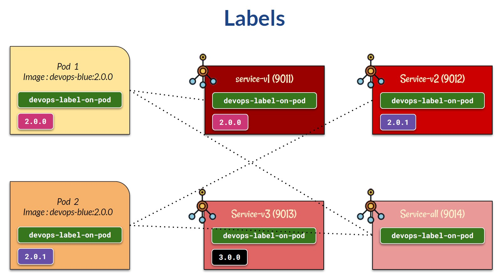
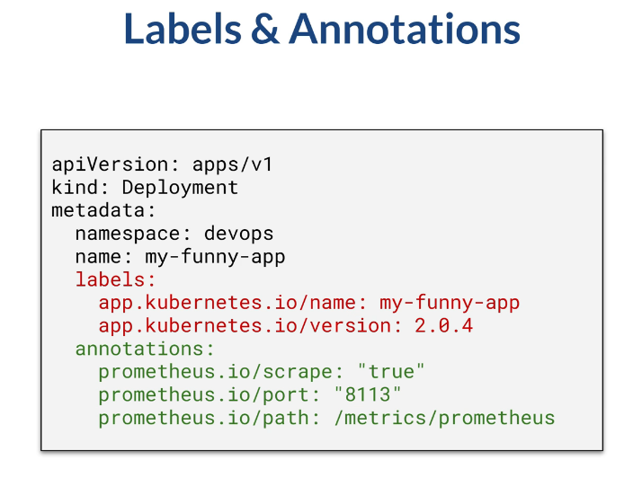
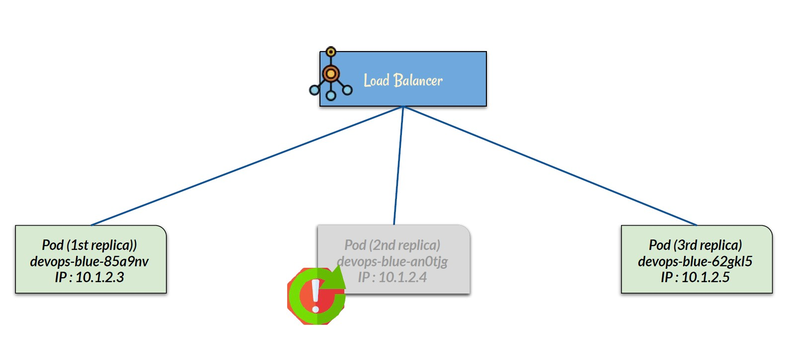

# Section 6 Operating Kubernetes

## Content
- 23 [Labels](#23-labels)
- 24 [Annotations](#24-annotations)
- 25 [Port Forwarfing](#25-port-forwarding)
- 26 [Health Check](#26-health-check)
- 27 [Pod Lifecycle](#27-pod-lifecycle)
- 28 [Log](#28-log)


Delete the previous minikube and start fresh Minikube cluster

    bash --> minikube delete
    bash --> minikube start --cpus 4 --memory 8192 --driver docker

Start minikube tunnel and don't close the terminal

    bash --> minikube tunnel

## 23 Labels
[⬆ Back to top](#top)

A label identifies a Kubernetes object. One object can have multiple labels, and one label can be attached to multiple objects. Once labels have been attached to an object, we can use a label selector to select objects based on a matching expression. For example, we can find objects with the label "environment" and a value of "production". In this hands-on, we will create several services that expose only certain pods. We will use the namespace "devops" for the rest of this lesson. Ensure these ports are free on your laptop.

Ports: 9011, 9012, 9013, 9014

Check if the ports are used

    bash --> netstat -ano | findstr :9011
    bash --> netstat -ano | findstr :9012
    bash --> netstat -ano | findstr :9013
    bash --> netstat -ano | findstr :9014

    # no result means that the port is free 

For a hands-on example, we will have two pods. The first pod has a green and pink label. The second pod has a green and purple label. Then we will have several services. First service runs on port 9011 and has a label selector that matches green and pink, so this will only expose pod 1. Second service runs on port 9012 and has a label selector that matches green and purple, so this will only expose pod 2. The third service, which runs on port 9013, has a label selector that matches the green and black labels. Since we don't have a black label on any pod, this service will not expose any pod. The fourth service runs on port 9014 and has a label selector that matches only green. This labeling means that the fourth service will expose pods 1 and 2.



Open the sample file in the folder label - \devops-kubernetes-resources-references\kubernetes-istio-scripts\kubernetes\label\devops-label.yml. Here is a configuration file that corresponds to the previous slide. So there are two deployments. 

The first deployment pod has two labels — call them green and pink, as shown on the previous slide. The second deployment pod has a green and purple label. Each pod has a different image so that we can examine them later. Thereare four services. Keep an eye on each service selector element. The service will apply onlyto pods that match the selector criteria.

As shown on the previous slide, we will have four services when we apply this configuration file. 

    bash --> kubectl apply -f \devops-kubernetes-resources-references\kubernetes-istio-scripts\kubernetes\label\devops-label.yml

    # result: 
    namespace/devops created
    deployment.apps/devops-label-deployment-v200 created
    deployment.apps/devops-label-deployment-v201 created
    service/devops-label-service-v1 created
    service/devops-label-service-v2 created
    service/devops-label-service-v3 created
    service/devops-label-service-all created

List services

    bash --> kubectl get services -n devops

    # result:
    NAME                       TYPE           CLUSTER-IP       EXTERNAL-IP   PORT(S)          AGE
    devops-label-service-all   LoadBalancer   10.106.88.199    127.0.0.1     9014:31355/TCP   56s
    devops-label-service-v1    LoadBalancer   10.101.50.225    127.0.0.1     9011:30095/TCP   56s
    devops-label-service-v2    LoadBalancer   10.100.130.22    127.0.0.1     9012:31639/TCP   56s
    devops-label-service-v3    LoadBalancer   10.101.190.130   127.0.0.1     9013:31295/TCP   56s

Try curl several times on service one, port 9011, and we will see that it only redirects traffic to pod 1, which runs Dockerversion 2.0.0.

    bash --> curl http://localhost:9011/devops/blue/api/hello

    # result:
    Version [2.0.0] Hello from app [devops-blue running at 10.244.0.14] on k8s pod [devops-label-deployment-v200-7975b55755-q2brh]
    Version [2.0.0] Hello from app [devops-blue running at 10.244.0.14] on k8s pod [devops-label-deployment-v200-7975b55755-q2brh]
    Version [2.0.0] Hello from app [devops-blue running at 10.244.0.14] on k8s pod [devops-label-deployment-v200-7975b55755-q2brh]
    Version [2.0.0] Hello from app [devops-blue running at 10.244.0.14] on k8s pod [devops-label-deployment-v200-7975b55755-q2brh]

On service two, port 9012, it only redirects traffic to pod 2, with Dockerimage version 2.0.1.

    bash --> curl http://localhost:9012/devops/blue/api/hello

    # result:
    Version [2.0.1] Hello from app [devops-blue running at 10.244.0.13] on k8s pod [devops-label-deployment-v201-7f999576f7-456sk]
    Version [2.0.1] Hello from app [devops-blue running at 10.244.0.13] on k8s pod [devops-label-deployment-v201-7f999576f7-456sk]
    Version [2.0.1] Hello from app [devops-blue running at 10.244.0.13] on k8s pod [devops-label-deployment-v201-7f999576f7-456sk]
    Version [2.0.1] Hello from app [devops-blue running at 10.244.0.13] on k8s pod [devops-label-deployment-v201-7f999576f7-456sk]

On service three, port 9013, there is no pod-matching selector, so itdoes not redirect traffic.

    bash --> curl http://localhost:9013/devops/blue/api/hello

    # result: no connection

On service four, on port 9014, the selector matchestwo pods, so traffic is redirectedto both.

    bash --> curl http://localhost:9014/devops/blue/api/hello

    # result:
    Version [2.0.1] Hello from app [devops-blue running at 10.244.0.13] on k8s pod [devops-label-deployment-v201-7f999576f7-456sk]
    Version [2.0.0] Hello from app [devops-blue running at 10.244.0.14] on k8s pod [devops-label-deployment-v200-7975b55755-q2brh]


Let's delete the deployment so we can start fresh on the next lesson.

    bash --> kubectl delete -f kubectl apply -f \devops-kubernetes-resources-references\kubernetes-istio-scripts\kubernetes\label\devops-label.yml

    # result:
    namespace "devops" deleted
    deployment.apps "devops-label-deployment-v200" deleted from devops namespace
    deployment.apps "devops-label-deployment-v201" deleted from devops namespace
    service "devops-label-service-v1" deleted from devops namespace
    service "devops-label-service-v2" deleted from devops namespace
    service "devops-label-service-v3" deleted from devops namespace
    service "devops-label-service-all" deleted from devops namespace

[⬆ Back to top](#top)

## 24 Annotations
[⬆ Back to top](#top)

We can add annotations to each Kubernetes resource. Like a label, an annotation is a key-value pair that we add to the Kubernetes object. Although label and annotation have a similar format, which is key-value, Labels are used more in Kubernetes, such as to identify pods. 

Annotation is for a human or a third-party application that is installed on the same Kubernetes cluster. For example, while a label is used to propagate a pod to a specific node, we can annotate a pod with our own custom annotation or with a specific annotation required by performance metric tools installed on the same Kubernetes cluster.

We can put both the label and the annotation in the metadata section of a Kubernetes object.

For example, this deployment object has two labels in red and three annotations in green.



[⬆ Back to top](#top)

## 25 Port Forwarding
[⬆ Back to top](#top)

In development, it may be necessary to access a pod directly. In such a case, we cannot use a load balancer if we have multiple replicas, because it would distribute traffic across them. In development, we can access a pod by opening its application port, making it directly accessible from the host. This technique is called port-forwarding. The syntax is simple. We use 'kubectl port forward' with the pod name and port binding. The left side of the colon is the host port, and the right side is the application port on the pod.

Example:

    bash --> kubectl port-forward [pod-or-service-name] host-port:pod-port

Open the sample file in the folder port-forward - \devops-kubernetes-resources-references\kubernetes-istio-scripts\kubernetes\port-forward\devops-port-forward.yml.

Here,we only create a deployment with three replicas and no service.

devops-port-forward.yml

```yaml
apiVersion: v1
kind: Namespace
metadata:
  name:  devops

---

apiVersion: apps/v1
kind: Deployment
metadata:
  namespace: devops
  name: devops-port-forward-deployment
  labels:
    app.kubernetes.io/name: devops-port-forward
spec:
  selector:
    matchLabels:
      app.kubernetes.io/name: devops-port-forward
  template:
    metadata:
      labels:
        app.kubernetes.io/name: devops-port-forward
        app.kubernetes.io/version: 2.0.0
    spec:
      containers:
      - name: devops-blue
        image: timpamungkas/devops-blue:2.0.0
        resources:
          limits:
            cpu: "0.3"
            memory: 200M
        ports:
        - name:  http
          containerPort: 8111
          protocol: TCP
  replicas: 3
```

Apply this file.

    bash --> kubectl apply -f devops-port-forward.yml

    # result
    namespace/devops created
    deployment.apps/devops-port-forward-deployment created

Check that it now has three pods in the devops namespace.

    bash --> kubectl get pods -n devops

    # result
    NAME                                              READY   STATUS    RESTARTS   AGE
    devops-port-forward-deployment-6696f94794-9x8mq   1/1     Running   0          40s
    devops-port-forward-deployment-6696f94794-ffjxc   1/1     Running   0          40s
    devops-port-forward-deployment-6696f94794-sms5v   1/1     Running   0          40s

Try forwarding one of the pods to the host on port 9111.

    bash --> kubectl port-forward -n devops devops-port-forward-deployment-6696f94794-9x8mq 9111:8111

    # result:
    Forwarding from 127.0.0.1:9111 -> 9111
    Forwarding from [::1]:9111 -> 9111

Curl to localhost port 9111, where we actually access the first forwardedpod.

    bash --> curl http://localhost:9111/devops/blue/api/hello

    # result
    Version [2.0.0] Hello from app [devops-blue running at 10.244.0.24] on k8s pod [devops-port-forward-deployment-6696f94794-fwjl2]
    Version [2.0.0] Hello from app [devops-blue running at 10.244.0.24] on k8s pod [devops-port-forward-deployment-6696f94794-fwjl2]
    Version [2.0.0] Hello from app [devops-blue running at 10.244.0.24] on k8s pod [devops-port-forward-deployment-6696f94794-fwjl2]

Notice the IP address.

Open a new terminal and port-forward to another pod.

    bash --> kubectl port-forward -n devops devops-port-forward-deployment-6696f94794-ffjxc 9112:8111

    # result:
    Forwarding from 127.0.0.1:9112 -> 8111
    Forwarding from [::1]:9112 -> 8111


Thistime, forward to the host on port 9112.

    bash --> curl http://localhost:9112/devops/blue/api/hello

    # result:
    Version [2.0.0] Hello from app [devops-blue running at 10.244.0.26] on k8s pod [devops-port-forward-deployment-6696f94794-lw8pz]
    Version [2.0.0] Hello from app [devops-blue running at 10.244.0.26] on k8s pod [devops-port-forward-deployment-6696f94794-lw8pz]
    Version [2.0.0] Hello from app [devops-blue running at 10.244.0.26] on k8s pod [devops-port-forward-deployment-6696f94794-lw8pz]

No matter how many times we curl into the host port, we will always get the same result, since we access the pod directly.

Delete the resources to start fresh in the next example

    bash --> kubectl delete -f evops-port-forward.yml

    # result:
    namespace "devops" deleted
    deployment.apps "devops-port-forward-deployment" deleted from devops namespace


[⬆ Back to top](#top)

## 26 Health Check
[⬆ Back to top](#top)

In practice, there might be more than one pod replica. For example, we ask Kubernetes to create three replicas of a pod. The load balancer service will then distribute traffic among them. However, there may be a case where the 2nd pod crashes due to incorrect application logic. In that case, Kubernetes will do two things: 1st, the load balancer will distribute traffic only among healthy pods. 2nd, restart the crashed pod to achieve the target of 3 replicas. After the restart, when the 2nd pod is back to healthy, the load balancer will also distribute traffic to the restarted pod.


Kubernetes will know whether a pod is healthy using the health check mechanism. We can ask Kubernetes to periodically run a terminal command, HTTP, TCP, or gRPC request. The protocol varies, but the key is periodic checks. Kubernetes will execute the defined health check protocol, and if the response is successful, it will mark the pod as healthy. This health check will be run periodically, for example, every 1 minute. When a certain threshold is met, Kubernetes marks the pod as unhealthy. For example, if the response is bad or times out after 5 seconds, for three consecutive attempts. There are two important states in a health check: readiness and liveness.

The readiness state indicates whether the pod is ready to accept client requests. In other words, Kubernetes will only redirect traffic to a pod whose state is ready. A pod is ready when all its containers are ready. Kubernetes checks the pods' liveness to determine whether it is still alive.

If a pod is not alive, Kubernetes will attempt to restart it.

We can create a probe on a Kubernetes pod to gather state. There are readiness probes and liveness probes. Actually, there is a third probe: the startup probe. But this probe is generally used only on applications that take a long time to start. We will focus on readiness and liveness probe. The devops-blue sample application is created using Java Spring Boot, which has an HTTP health check endpoint for readiness and liveness. When you use a health check probe, make sure that the probe (HTTP GET or other) does not require authentication, or you provide valid authentication. Otherwise, the health check will fail. The common approach is to use no authentication at all for the health check endpoint.

Open the configuration file in the health check folder - \devops-kubernetes-resources-references\kubernetes-istio-scripts\kubernetes\health-check\devops-health-check.yml

devops-health-check.yml

```yaml
apiVersion: v1
kind: Namespace
metadata:
  name:  devops

---

apiVersion: apps/v1
kind: Deployment
metadata:
  namespace: devops
  name: devops-health-check-deployment
  labels:
    app.kubernetes.io/name: devops-health-check
spec:
  selector:
    matchLabels:
      app.kubernetes.io/name: devops-health-check
  template:
    metadata:
      labels:
        app.kubernetes.io/name: devops-health-check
        app.kubernetes.io/version: 2.0.0
    spec:
      containers:
      - name: devops-blue
        image: timpamungkas/devops-blue:2.0.0
        resources:
          limits:
            cpu: "0.3"
            memory: 200M
        ports:
        - name:  http
          containerPort: 8111
          protocol: TCP
        readinessProbe:
          httpGet:
            path: /devops/blue/actuator/health/readiness
            port: 8111
            scheme: HTTP
          initialDelaySeconds: 60
          periodSeconds: 30
          timeoutSeconds: 5
          failureThreshold: 4
        livenessProbe:
          httpGet:
            path: /devops/blue/actuator/health/liveness
            port: 8111
            scheme: HTTP
          initialDelaySeconds: 60
          periodSeconds: 30
          timeoutSeconds: 5
          failureThreshold: 4
  replicas: 3
---

apiVersion: v1
kind: Service
metadata:
  namespace: devops
  name: devops-health-check-service
  labels:
    app.kubernetes.io/name: devops-health-check
spec:
  selector:
    app.kubernetes.io/name: devops-health-check
  type:  LoadBalancer
  ports:
  - port: 9011         # port number to be available at host
    targetPort: 8111   # port on pod
```

In the deployment section, we define the readiness and liveness probes. In this sample, we use an HTTP probe, which means Kubernetes will hit using HTTP GET to this path and port, using the HTTP scheme. In this sample, we have the same periodic threshold setting sample for both probes. Kubernetes will wait 60 seconds before it starts probing, which in this case means hitting the HTTP endpoint. Then it will periodically hit the http endpoint every 30 seconds. The timeout is 5 seconds, so if the http response is bad or a timeout, usually this means not something with a 2xx http response status, it will be considered as a possible unhealthy pod. The failure threshold is 4. It means it will take four consecutive negative responses before the pod is considered unhealthy.

If we apply this file. And check the pods. The pod will not be ready forat least 60 seconds.

    bash --> kubectl apply -f devops-health-check.yml

    # result:
    namespace/devops created
    deployment.apps/devops-health-check-deployment created
    service/devops-health-check-service created

    bash --> kubectl get pods -n devops -w

    # result:
    NAME                                              READY   STATUS    RESTARTS   AGE
    devops-health-check-deployment-6fd8b77fd9-9xkt5   0/1     Running   0          59s
    devops-health-check-deployment-6fd8b77fd9-k4rlr   0/1     Running   0          59s
    devops-health-check-deployment-6fd8b77fd9-w7p5g   0/1     Running   0          59s

That is the initial delay.

All pods will be ready within 60 + 30 seconds, since Kubernetes will check the readiness probe after a 60-second delay within a 30-second period. Please note that, depending on your laptop's resources, the readiness may take longer. 

In the next lesson,we will use Postman to hit the API. If you arenot familiar with Postman, it is a development environment specifically for APIs. Download it from postman.com and open it. Download the Postman collection from the last lecture of the course, and import it into Postman. 

Note that for this course, when you use the devops-blue image, all API will return a custom HTTP response header. These headers are custom-made for this course's purpose. They have nothing to do with Kubernetes. By examining the response header, you will know which app version (the Docker tag) was used. Application name that contains a random number, and the pod virtual IP address. And the pod name. These are for examination when later needed.

Start minikube tunnel and don't close the terminal

    bash --> minikube tunnel

For example, run the hello endpoint in the Postman health check folder.

    # result: 
    Version [2.0.0] Hello from app [devops-blue running at 10.244.0.27] on k8s pod [devops-health-check-deployment-6fd8b77fd9-9xkt5]

Examine the response header, and we will see those two custom headers.

If the pod crashes, see what happens. Port forward one of the pods. I will open another terminal and port-forward this one to a specific IP address on port 9111.

List pods in devops namespace

    bash --> kubectl get pods -n devops

    # result:
    NAME                                              READY   STATUS    RESTARTS       AGE
    devops-health-check-deployment-6fd8b77fd9-9xkt5   1/1     Running   0              8m20s
    devops-health-check-deployment-6fd8b77fd9-k4rlr   1/1     Running   1 (7m6s ago)   8m20s
    devops-health-check-deployment-6fd8b77fd9-w7p5g   1/1     Running   0              8m20s

Foreward port for one of the pods

    bash --> kubectl port-forward -n devops devops-health-check-deployment-6fd8b77fd9-9xkt5 9111:8111

    # result:
    Forwarding from 127.0.0.1:9111 -> 8111
    Forwarding from [::1]:9111 -> 8111

    # DONT CLOSE THE TERMINAL !!!

In the Postman collection, I provide an endpoint to shut down the pod under the health check folder. Execute it.

    # result:
    {
        "message": "Shutting down, bye..."
    }

At this point, check the pod again, and we will see that one pod is not ready.

    bash --> kubectl get pods -n devops

    # result:
    NAME                                              READY   STATUS    RESTARTS      AGE
    devops-health-check-deployment-6fd8b77fd9-9xkt5   0/1     Running   1 (39s ago)   11m   # NOT READY
    devops-health-check-deployment-6fd8b77fd9-k4rlr   1/1     Running   1 (10m ago)   11m
    devops-health-check-deployment-6fd8b77fd9-w7p5g   1/1     Running   0             11m

Notice the IP address for the unhealthy pod.

If we continuously curl the load balancer, it will not redirect traffic to an unhealthy pod. However, Kubernetes will attempt to restart the pod. See here: it has a 'restart' field that indicates how many times this pod has been restarted. Within 60 to 90 seconds after a restart, the pod will be back up and running. Then, if we curl continuously to the load balancer, it will redirect traffic to the restarted pod.

We're done here, let's delete the deployment.

    bash --> kubectl delete -f devops-health-check.yml

    # result:
    namespace "devops" deleted
    deployment.apps "devops-health-check-deployment" deleted from devops namespace
    service "devops-health-check-service" deleted from devops namespace

Please note that from this point forward, I will provide readiness and liveness probes for each pod. When you apply the configuration file, it might take a few seconds to a minute to be ready. Feel free to comment on the probe section if you like, But I recommend keeping it and building the habit of configuring your own probes.


[⬆ Back to top](#top)

## 27 Pod Lifecycle
[⬆ Back to top](#top)

When we run kubectl get pod, there is a status field. There are several possible statuses. 
- Running means the pod has been scheduled to a node, and at least one container is currently running.
- Pending means Kubernetes has the pod, but containers within it have not started yet. It may be because Kubernetes is still downloading container images, the scheduler cannot find enough resources (CPU or memory), or the pod is waiting for other resources, such as volume binding. 
- ContainerCreating indicates Kubernetes is actively setting up the pod's containers. During this phase, Kubernetes prepares the container runtime, mounts volumes, sets up networking, and pulls images if needed.
- Succeeded appears when all containers in the pod have terminated successfully and will not be restarted. Pods created by Deployments with the restartPolicy: Always will not reach this state.
- Failed means all containers in the pod have terminated, but at least one exited with an error code. Common reasons include application crashes, invalid arguments, or misconfiguration. 
- Unknown means Kubernetes cannot determine the pod status. This status may occur when the node running the pod is unreachable because of a network issue or node failure. 
- Terminating appears when a pod is being deleted. During this phase, Kubernetes sends a graceful shutdown signal, waits for the containers to stop, and then removes the pod's resources from the node. If the process takes too long, Kubernetes may force-delete the pod.
- ImagePullBackOff means Kubernetes attempted to pull the image but failed, and it is now retrying with a backoff period. Common causes include an incorrect image name or tag, a private registry without credentials, or a slow network. Describe the pod to know the exact reason. If this is due to the network, ensure you have a strong internet connection, then delete the pod. Kubernetes will try to pull the image again. 
- CrashLoopBackOff. However, this state is not a pod. It is a container state. It appears when a container repeatedly crashes after restarting. Kubernetes keeps retrying and increases the delay between restarts (hence the name, backoff). Common causes include application logic errors, missing environment variables, failing dependencies, or incorrect startup commands.


[⬆ Back to top](#top)

## 28 Log
[⬆ Back to top](#top)

When something goes wrong, we must check it. In most applications, it will have an exception log.

We can see the log from the Kubernetes pod. For this lesson, I provide two endpoints to generate logs and errors on the DevOps Hello Docker image. 
- /api/log?text=somthing
- /api/exception

A reference to them is available in the Postman collection we imported earlier.

Apply the deployment file at the folder log.

    bash --> kubectl apply -f devops-log.yml

    # result:
    namespace/devops created
    deployment.apps/devops-log-deployment created
    service/devops-log-service created

It will create two replicas.

Start minikube tunnel and don't close the terminal

    bash --> minikube tunnel

Open the Postman collection and try to execute the log endpoint.

    # result: devops-blue running at 10.244.0.31 logging : Earlene

Also, the exception endpoint.

    # result:
    {
        "timestamp": "2026-02-28T08:29:36.222Z",
        "status": 500,
        "error": "Internal Server Error",
        "path": "/devops/blue/api/exception"
    }

We can see the log on the pod by the command kubectl logs pod name. Since we have two pods, we need to check each of them.

List pods in devops namespace

    bash --> kubectl get pods -n devops

    # result:
    NAME                                     READY   STATUS    RESTARTS   AGE
    devops-log-deployment-7b9fc54fbd-4nwpt   1/1     Running   0          4m25s
    devops-log-deployment-7b9fc54fbd-r2pjn   1/1     Running   0          4m25s

Show logs for the first pod

    bash --> kubectl logs -n devops devops-log-deployment-7b9fc54fbd-4nwpt   
    bash --> kubectl logs -n devops devops-log-deployment-7b9fc54fbd-r2pjn 

This method can be annoying if we have many replicas. Fortunately, we can display logs from all pods that matcha given label selector.

Try to describe one of the pods.

    bash --> kubectl describe pod devops-log-deployment-7b9fc54fbd-4nwpt -n devops

    # result:
    Name:             devops-log-deployment-7b9fc54fbd-4nwpt
    Namespace:        devops
    Priority:         0
    Service Account:  default
    Node:             minikube/192.168.49.2
    Start Time:       Sat, 28 Feb 2026 10:28:09 +0200
    Labels:           app.kubernetes.io/name=devops-log-pod
                    app.kubernetes.io/version=2.0.0
                    pod-template-hash=7b9fc54fbd
    Annotations:      <none>
    Status:           Running
    ...

And we can see that it has a label name.

All pods created in the deployment file will have the same labels, so we can displaylogs from each pod using a selector like this.

Let's add the optional "f" flag so the log command follows the newest log and displays it.

    bash --> kubectl logs -n devops -f --selector app.kubernetes.io/name=devops-log-pod

Now, if we hit the exception endpoint, the error will be shown in the logs, regardless of which replica generated it.

    # result:
    {
        "timestamp": "2026-02-28T08:38:17.089Z",
        "status": 500,
        "error": "Internal Server Error",
        "path": "/devops/blue/api/exception"
    }

Check the logs again to see the latest

Although possible, checking text logs from pods is quite difficult, especially if we have many pods.

The log is usually stored in a centralized, searchable log. This storage is usually done from either the development side or by attaching a log agent. We can store logs in tools like Elasticsearch, Sentry, Datadog, or a centralized log management system, depending on the cloud provider.

[⬆ Back to top](#top)