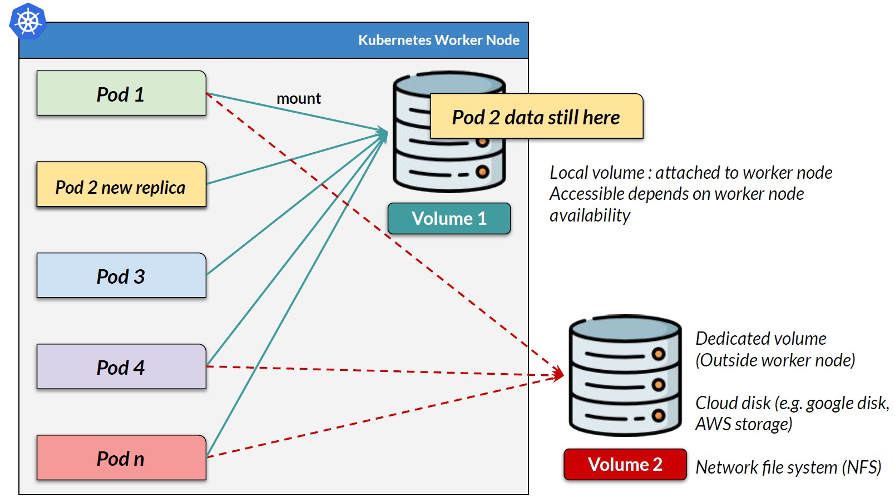
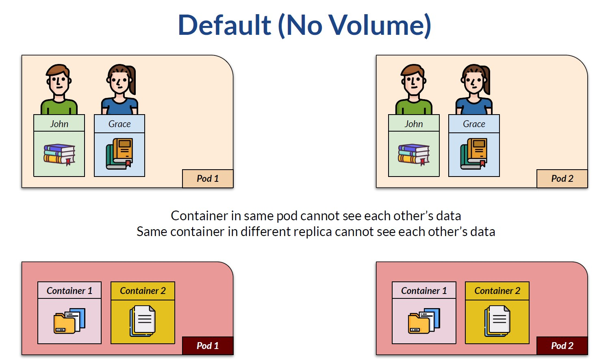
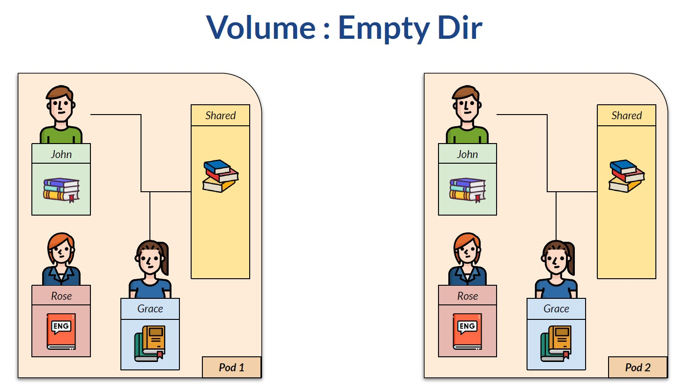
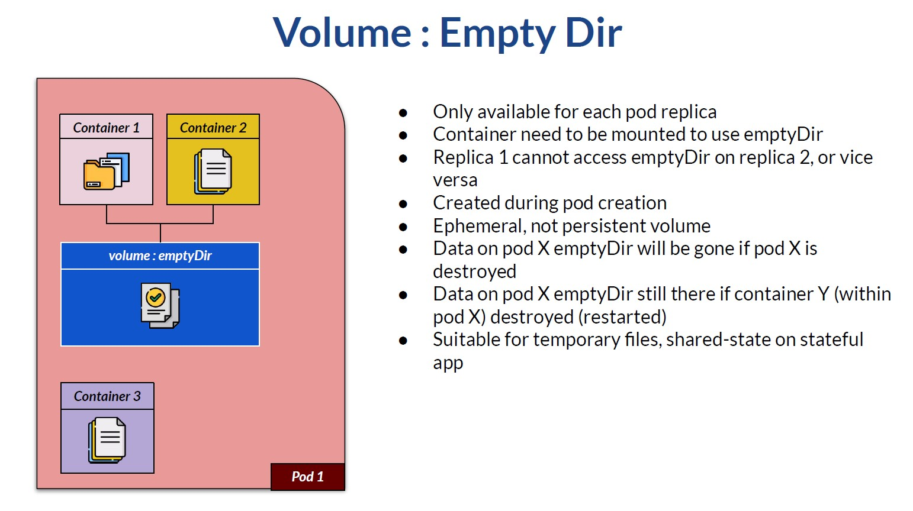
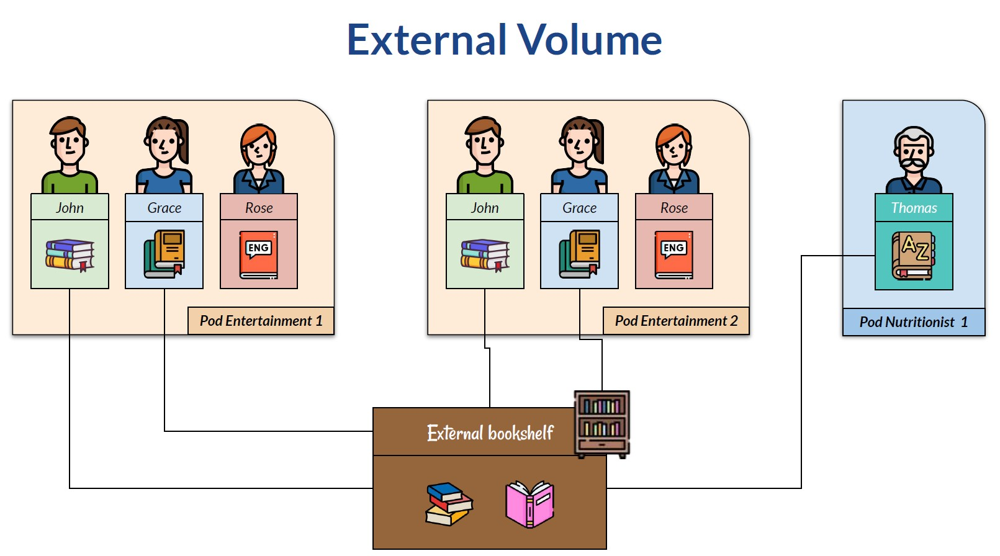
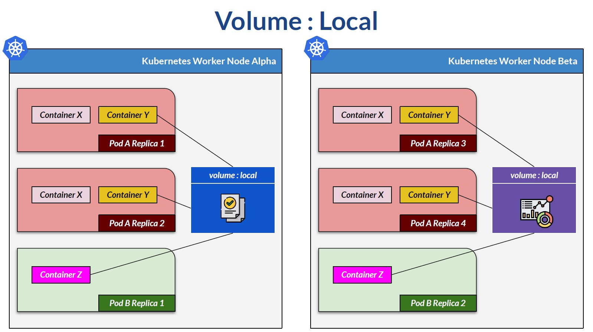
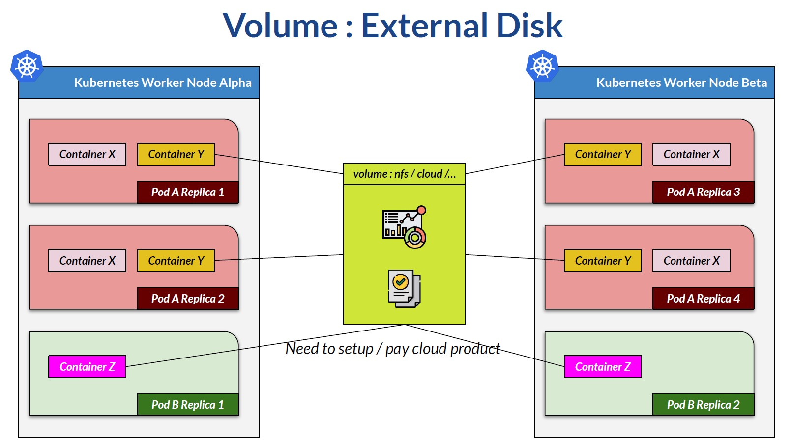

# Section 8 Volumes - Theory

## Content
- 31 [Volume - Theory](#31-volume---theory)
- 32 [EmptyDir](#32-emptydir)
- 33 [HostPath](#33-hostpath)
- 34 [Local](#34-local)
  
Delete the previous minikube and start fresh Minikube cluster

    bash --> minikube delete
    bash --> minikube start --cpus 4 --memory 8192 --driver docker

Start minikube tunnel and don't close the terminal

    bash --> minikube tunnel

## 31 Volume - Theory
[⬆ Back to top](#top)

Pod is not something permanent. A pod can be destroyed. For example, when we reduce the pod replicas. When a pod is destroyed, its containers are also destroyed, along with all data stored in them. When we need persistent data, we have two choices.
- First, most of the time, data is stored in an external service, such as a dedicated database node, cloud object storage like AWS S3, or big-data storage.
- Second, we can use Kubernetes volumes and mount them into pods. 
 
We create a Persistent Volume outside any pod. Then we mount a pod to that volume through a Persistent Volume Claim. Multiple pods can mount the same volume if the volume supports multi-access, such as NFS or cloud disks that support ReadWriteMany.

Not all volume types can be mounted by many pods. This way, when a container or pod terminates, the data is not lost. Also, when a new pod replica is created, it can access the existing data if the volume is persistent.

We can also mount multiple volumes into a single pod. Some volumes are node-local (such as local persistent volume or host Path). If the worker node crashes, the volume becomes inaccessible.

We can use external volumes such as cloud disks or network file systems. These volumes remain available even when nodes are recreated. When discussing volume, we should remember that a pod can contain multiple containers.



Let's go back to the early ship analogy. When a pod has a container (John and Grace in the analogy), each container, by default, has its own private shelf for storing data (books in the analogy). This means John cannot see Grace's book, and vice versa. Even if there is a second pod replica, John in replica 1 cannot see data in replica 2, and Grace in replica 2 cannot see the other Grace's data. By default, containers in the same pod cannot see each other's data, nor can containers across different replicas. 


However, some books might be shared between John and Grace. So they decided to buy a shared bookshelf and put it on the pod. So John and Grace have their own book, as well as some shared data. The shared bookshelf can be limited to John and Grace only. Therefore, even if there is a third container, Rose, in the same pod, Rose cannot access the shared book.

This shared bookshelf is known as an "empty directory" volume. The second pod replica will have this behaviour, but the shared bookshelf will only be on the pod scope. This means that John on pod 1 can only access the shared bookshelf on his own pod replica.


Containers can also share an empty Directory volume that is local to their pod replica. This means pod X replica 1 has its own empty directory and is not accessible to other replicas of pod X. Not all containers in the same pod automatically gain access to this volume. They need to be configured to use the empty directory. An Empty Directory volume is, well, empty when a pod is created. So it is not a persistent volume.

When a pod is destroyed, like when a replica is reduced or a deployment is restarted, the data will be lost. However, when the container within a pod is crashed and destroyed, or restarted, the empty directory data remains intact because it is local to the pod, not to the container. By nature, an empty directory is suitable for writing temporary files or application state to be shared among multiple containers in a pod.


What if John needs to share a book among themselves, including other pod replicas? Or even another kind of pod? In that case, we can use an external bookshelf and let other replicas or pods know about it. In this case, all replicas will have the same access. So if John and Grace's container has access to the bookshelf, all John and Grace's replicas of this pod will have it too. Also, we can give Thomas access, even if Thomas lives in a different pod. 


Such an external bookshelf is called a persistent volume in Kubernetes. They can be local disks, network disks, or various cloud disks. Kubernetes also has some built-in volume types. They are configmap and secret, stored on the Kubernetes control plane node. 

Local persistent volume is a disk attached to a worker node. This means all pods on the same worker node have access to the local volume. But different worker nodes do not have access to each other.

In this sample, the local volume on worker node alpha is accessible only by pod "A" replica 1, pod "A" replica 2, and pod B replica 1. Local volume on worker node beta can only be accessed by pod "A" replica 3, pod "A" replica 4, and pod B replica 2. Also, data on volume alpha may differ from data on volume beta.


Data at Local volume persists across pod restarts, but if a worker node is destroyed, the data on that node will be lost.

The most persistent data is when Kubernetes uses an external disk, An external disk can be on-premises network storage, a file server, or a cloud disk like Google Persistent Disk, AWS Storage, Azure Disk, or another provider. A container is then mounted to this volume, and this can be from anywhere. Since this volume is dedicated, any changes to a Kubernetes node, such as destroying a node, will not affect the volume, and the data will persist.


The trade-off is that we need to set up our own server or pay for a cloud product for this volume. 

When defining a Kubernetes persistent volume, several access mode parameters are available. 
- ReadWriteOnce means read and write are allowed by only one pod at a time. 
- ReadOnlyMany means that multiple pods can read from the volume. 
- ReadWriteMany means multiple pods can perform read & write operations from the volume.

[⬆ Back to top](#top)

## 32 EmptyDir
[⬆ Back to top](#top)

Open the configuration file in the volume folder - \devops-kubernetes-resources-references\kubernetes-istio-scripts\kubernetes\volume\devops-volume-empty-dir.yml. We will see the configuration for the empty directory. 

In here, we have two containers within a pod: devops-blue and alpine-linux. See this part, where we define volume. If we examine the indentation, this volume definition is indented the same as the container definition, meaning the volume is defined as part of the pod. Here we have two empty directory volumes: one for uploading images and one for uploading documents. 

devops-volume-empty-dir.yml

```yaml
...
      volumes:
        - name: upload-image-empty-dir
          emptyDir: {}
        - name: upload-doc-empty-dir
          emptyDir: {}
  replicas: 2
...
```

On the devops-blue container, we mount the container's volume. So the file path /upload/image in the container will be mounted to the first empty dir, and/upload/doc will be mounted to the second empty dir. 

devops-volume-empty-dir.yml

```yaml
...
        volumeMounts:
          - name: upload-image-empty-dir
            mountPath: /upload/image
          - name: upload-doc-empty-dir
            mountPath: /upload/doc
...
```

In the same way as Alpine Linux container. We mount two folders within the Alpine Linux container, one into each volume. Notice that the mount path can be different between containers. 

devops-volume-empty-dir.yml

```yaml
...
        volumeMounts:
          - name: upload-image-empty-dir
            mountPath: /upload-on-alpine/image
          - name: upload-doc-empty-dir
            mountPath: /upload-on-alpine/doc
...
```

We also have two pod replicas. Let's see what happens. 

Apply this configuration.

    bash --> kubectl apply -f devops-volume-empty-dir.yml
    
    # result:
    namespace/devops created
    deployment.apps/devops-volume-deployment-empty-dir created
    service/devops-volume-service created

Ensure two podsare running, each with two running containers. 

    bash --> kubectl get pods -n devops

    # result:
    NAME                                                  READY   STATUS    RESTARTS   AGE
    devops-volume-deployment-empty-dir-578cc99468-lsw79   2/2     Running   0          80s
    devops-volume-deployment-empty-dir-578cc99468-pxzwq   2/2     Running   0          80s

Open Postman and open the endpoint inthe volume folder. Upload one image,any image.

    # result: Saved : 311ec165-e479-4acb-a7c7-90d28e295720

Notice the UUID generated. This UUID is the filename stored at the volume, generated by the devops-blue API. See the response header to find out which pod was accessed by the load balancer.

    # Headers/ K8s-Pod-Name / devops-volume-deployment-empty-dir-578cc99468-lsw79

Then open a terminal. In each pod, we have two containers: devops-blue and alpine-linux. 

    bash --> kubectl get pods -n devops

    # result:
    NAME                                                  READY   STATUS    RESTARTS   AGE
    devops-volume-deployment-empty-dir-578cc99468-lsw79   2/2     Running   0          6m20s
    devops-volume-deployment-empty-dir-578cc99468-pxzwq   2/2     Running   0          6m20s

We will run a shell inside the devops-blue container on the pod where we upload the document. You can copy and paste the syntax from the lesson \"resources and references\", the last section of the course. Adjust the pod name accordingly.

    bash --> kubectl exec -n devops devops-volume-deployment-empty-dir-578cc99468-lsw79 -c devops-blue -ti -- /bin/sh

    devops-blue shell --> ls

    devops-blue shell --> ls upload/image

    # result: 311ec165-e479-4acb-a7c7-90d28e295720      # UID of the image we uploaded

On the container's shell, we will have mounted paths: one for the image and one for the doc, as defined. If we see inside the image folder, we will see the file that was just uploaded. The UUID matches the API response.

Open another terminal. This time, shell into an Alpine Linux container on the same pod. 

    bash --> kubectl exec -n devops devops-volume-deployment-empty-dir-578cc99468-lsw79 -c alpine-linux -ti -- /bin/sh

See that we also have a mounted folder, namely upload-on-alpine, with two subfolders, each mounted to a different empty dir. Check out the image subfolder; we will see the same file uploaded from the devops-blue container. 

    alpine shell --> ls upload-on-alpine/image

    # result: 311ec165-e479-4acb-a7c7-90d28e295720

The other way around: if we add a file to the Alpine Linux folder on the image or the doc subfolder, the devops-blue on the same pod will see the file. Let's add a dummy file to the doc subfolder on Alpine.

    alpine shell --> cd upload-on-alpine/doc
    alpine shell --> echo "Created from alpine linux container 1st pod" > demo_file
    alpine shell --> ls

    # result: demo_file

    alpine shell --> cat demo_file

    # result: Created from alpine linux container 1st pod

Then go to the devops-blue container and check the contents of the doc subfolder. 

    devops-blue shell --> ls upload/doc

    # result: demo_file

    devops-blue shell --> cat upload/doc/demo_file

    # result: Created from alpine linux container 1st pod

The sample API has endpoints to list files within an image or a document (Postman/Volume/GET List image, GET List doc). I will also list the demo file. If it is not the list demo file, it might be because the load balancer redirects traffic to the second pod. You can try again or use port forwarding to access the pod directly.

    # GET List image result:
    [
        "311ec165-e479-4acb-a7c7-90d28e295720"
    ]

    # GET List doc result: 
    [
        "demo_file"
    ]

And we can also get it from the API, since it reads from the mounted directory. The API can be anything you want, but it basically readsfrom a mounted volume.

The empty dir volume is only available on the pod level. Let's close the terminal on the first pod. Try to open a shell on the second pod. [-c devops-blue -ti bash] This container also has the same folder structure.
But the folders are empty, since the uploaded file is in an empty directory at the first pod. 

    bash --> kubectl exec -n devops devops-volume-deployment-empty-dir-578cc99468-pxzwq -c devops-blue -ti -- /bin/sh

    devops-blue shell --> ls upload/image

    # no result

If we add a file to this container on the second pod. 

    devops-blue shell --> echo "Created from devops-blue container 2st pod" > upload/doc/demo_file_two
    devops-blue shell --> ls upload/doc/        
    
    # result: demo_file_two

    devops-blue shell --> cat upload/doc/demo_file_two  
    
    # result: Created from devops-blue container 2st pod

Then open a terminal on the second pod running Alpine Linux. It will be able to see the second demo file.

    bash --> kubectl exec -n devops devops-volume-deployment-empty-dir-578cc99468-pxzwq -c alpine-linux -ti -- /bin/sh

    alpine-linux shell --> ls upload-on-alpine/doc

    # result: demo_file_two

    alpine-linux shell --> cat upload-on-alpine/doc/demo_file_two

    # result: Created from devops-blue container 2st pod

From here, we can see the risk of using an empty directory. When exposing a pod via a load balancer, traffic is routed to the multiple pods. So if we make several curl requests to the list image endpoint, sometimes it returns an empty array because the load balancer routes traffic to a second pod that doesn't have any image.

Delete the resources to start fresh to the next lesson

    bash --> kubectl delete -f devops-volume-empty-dir.yml

[⬆ Back to top](#top)

## 33 HostPath
[⬆ Back to top](#top)

Minikube supports volume with type hostPath. This volume mounts a file or directory from the host node's filesystem into the pod. If we have a multi-node cluster and a pod is restarted for some reason and ends up on another node, the new pod will not be able to access the old data. That's why hostPath volumes work well only on single-node clusters like minikube.

Minikube is actually a virtual machine running inside a laptop. So hostPath will use storage on that virtual machine. We can go inside the minikube virtual machine to see the file later.

See file volume-host - \devops-kubernetes-resources-references\kubernetes-istio-scripts\kubernetes\volume\devops-volume-host-path.yml.

Here, we define a persistent volume.

devops-volume-host-path.yml

```yaml
---
apiVersion: v1
kind: PersistentVolume
metadata:
#  namespace: devops
  name: upload-minikube-persistent-volume
spec:
  capacity:
    storage: 100Mi
  accessModes:
  - ReadWriteOnce
  persistentVolumeReclaimPolicy: Retain
  storageClassName: standard  # A
  hostPath:                               
    path: /data/upload/minikube           
---
```

We need a storage class, which tells Kubernetes what kind of storage to provision. We use the minikube default storage class name, which refers to the host path within the minikube virtual machine. 

Now that we have the volume, we create a claim to that volume, which, as the name suggests, is used to claim it. To link the claim, we use the same storage class name. 

devops-volume-host-path.yml

```yaml
---
kind: PersistentVolumeClaim
apiVersion: v1
metadata:
  namespace: devops
  name: upload-minikube-pv-claim-name     # B
spec:
  accessModes:
  - ReadWriteOnce
  storageClassName: standard  # A
  resources:
    requests:
      storage: 100Mi
---
```

In the deployment specification, we define a single volume because we only have one persistent volume. Then we mount the volume into each container. 

devops-volume-host-path.yml

```yaml
---
apiVersion: apps/v1
kind: Deployment
...
    spec:
      volumes:
        - name: pod-minikube-storage   # C
          persistentVolumeClaim:
            claimName: upload-minikube-pv-claim-name   # B
      containers:
      - name: devops-blue
...
        volumeMounts:
          - name: pod-minikube-storage   # C
            mountPath: /upload/image
          - name: pod-minikube-storage     # C
            mountPath: /upload/doc
...
---
```

These configurations are for mounting the image to the blue container. And mount the doc to the blue container. 

While these mount the image and doc storage to the second container, the Alpine Linux container.

devops-volume-host-path.yml

```yaml
---
apiVersion: apps/v1
kind: Deployment
...
        volumeMounts:
          - name: pod-minikube-storage   # C
            mountPath: /upload-on-alpine/image
          - name: pod-minikube-storage     # C
            mountPath: /upload-on-alpine/doc
...
---
```

Apply the configuration.

    bash --> kubectl apply -f devops-volume-host-path.yml

    # result:
    namespace/devops created
    persistentvolume/upload-minikube-persistent-volume created
    persistentvolumeclaim/upload-minikube-pv-claim-name created
    deployment.apps/devops-volume-deployment-local created
    service/devops-volume-service created

List pods in devops namespace

    bash --> kubectl get pods -n devops

    # result:
    NAME                                              READY   STATUS    RESTARTS   AGE
    devops-volume-deployment-local-7c4dfd77b9-fzp58   2/2     Running   0          4m36s
    devops-volume-deployment-local-7c4dfd77b9-qdtwz   2/2     Running   0          4m36s


Start minikube tunnel.

    bash --> minikube tunnel

OpenPostman on the volume folder, and try to upload an image.

    # result: Saved : 5972dd11-8f3d-490b-bd76-64d8382b7d0e
    # Headers/ K8s-Pod-Name  /  devops-volume-deployment-local-7c4dfd77b9-qdtwz

Also, try to upload a document.

    # result: Saved : 1cedc5d7-b4d5-4321-b49f-9c42b4f1587f
    # Headers/ K8s-Pod-Name  /  devops-volume-deployment-local-7c4dfd77b9-qdtwz

Then list the image and the doc.

    GET List images
    # result:
    [
        "1cedc5d7-b4d5-4321-b49f-9c42b4f1587f",
        "5972dd11-8f3d-490b-bd76-64d8382b7d0e"
    ]

    GET List doc
    # result:
    [
        "1cedc5d7-b4d5-4321-b49f-9c42b4f1587f",
        "5972dd11-8f3d-490b-bd76-64d8382b7d0e"
    ]

Since we mount one volume for images and documents, they will be mixed.

But how can we explore the file storage? One way is by entering the minikube virtual machine. Then see the data in the folder that we defined on the Kubernetes persistent volume.

    bash --> minikube ssh
    minikube shell --> ls /data/upload/minikube

    # result: 1cedc5d7-b4d5-4321-b49f-9c42b4f1587f  5972dd11-8f3d-490b-bd76-64d8382b7d0e

Delete the resources so we can start fresh the next lesson

    bash --> kubectl delete -f devops-volume-host-path.yml

[⬆ Back to top](#top)

## 34 Local
[⬆ Back to top](#top)

Minikube supports local volume. However, we need a workaround in this lesson to ensure the designated folder exists on the minikube. For this lesson, we will SSH into minikube and create the folders to be bound to the volume. Unlike hostPath, Kubernetes ensures that a pod using a local volume is always provisioned on the same node as the volume. This behavior remains even after a pod restarts.

Create a new directory for the local storage. SSH to minikube.

    bash --> minikube ssh

Create the required directories.

    minikube shell --> sudo mkdir -p /data/k8s-volume/image
    minikube shell --> sudo mkdir -p /data/k8s-volume/doc

Set appropriate permissions.

    minikube shell --> sudo chmod -R 777 /data/k8s-volume/

Exit minikube.

    minikube shell --> exit

We must set node affinity later when using a local volume so Kubernetes can create the volume on the correct node. Node affinity is like telling Kubernetes to deploy a resource only to a specific node that matches the node affinity specification. For this, we will use the matching hostname from the node label.

To see the host name, open a terminal and use kubectl describe node. 

    bash --> kubectl describe node

    # result:
    Roles:              control-plane
    Labels:             beta.kubernetes.io/arch=amd64
                        beta.kubernetes.io/os=linux
                        kubernetes.io/arch=amd64
                        kubernetes.io/hostname=minikube                         # we will use this label
                        kubernetes.io/os=linux
                        minikube.k8s.io/commit=de81223c61ab1bd97dcfcfa6d9d5c59e5da4a0cf
                        minikube.k8s.io/name=minikube
                        minikube.k8s.io/primary=true
                        minikube.k8s.io/updated_at=2026_02_27T19_05_31_0700
                        minikube.k8s.io/version=v1.38.0
                        node-role.kubernetes.io/control-plane=
                        node.kubernetes.io/exclude-from-external-load-balancers=
    Annotations:        node.alpha.kubernetes.io/ttl: 0
                        volumes.kubernetes.io/controller-managed-attach-detach: true

We will use this node, which is currently "minikube". Adjust as needed on your own laptop.

Open the configuration file in the volume folder - \devops-kubernetes-resources-references\kubernetes-istio-scripts\kubernetes\volume\devops-volume-local.yml

We will see the local configuration. To use local volume, several things are needed. We will use two storage classes, each bound to a different folder on the laptop.

This approach is optional. If we want to use only one folder, we can use the built-in storage class name "local-storage". Keep in mind the name field for the storage class.

devops-volume-local.yml

```yaml
---
apiVersion: storage.k8s.io/v1
kind: StorageClass
metadata:
  namespace: devops
  name: upload-image-storage-class-name    # A1
provisioner: kubernetes.io/no-provisioner
volumeBindingMode: WaitForFirstConsumer
---
```

We can use any name, but please remember it, as we will use it later.

Then we create the persistent volume, Give it a certain name.

devops-volume-local.yml

```yaml
---
apiVersion: v1
kind: PersistentVolume
metadata:
  namespace: devops
  name: upload-image-persistent-volume     # B1
spec:
  capacity:
    storage: 100M                           # storage size
  accessModes:
  - ReadWriteOnce
  persistentVolumeReclaimPolicy: Retain
  storageClassName: upload-image-storage-class-name    # A1
  local:
    path: /data/k8s-volume/image   # Path inside minikube VM
  nodeAffinity:
    required:
      nodeSelectorTerms:
      - matchExpressions:
        - key: kubernetes.io/hostname               # match node selector to the minikube label
          operator: In
          values:
          - minikube    # Changed from 'docker-desktop' to 'minikube'
---
```

In the specification, we use the storage class that we have just created. The storage size is 100 megabytes. The type is local, with a path to a specific directory in the node. In this case, my laptop, which was created earlier. Then see the node affinity specification, which is mandatory for local storage. Here, we match the node selector to the Docker Desktop label, as seen previously in describe node. 

Now that we have the volume, we need to use it.

devops-volume-local.yml

```yaml
---
kind: PersistentVolumeClaim
apiVersion: v1
metadata:
  namespace: devops
  name: upload-image-pv-claim-name    # C1
spec:
  accessModes:
  - ReadWriteOnce
  storageClassName: upload-image-storage-class-name  # A1
  resources:
    requests:
      storage: 50M              # storage size 50 MB

##########
# Image local volume - END
##########
---
```
Using a persistent volume, also known as a claim volume, we create a persistent volume claim object. We use this claim name with the previous storage class name. Here, we request 50 megabytes of storage.

For the doc volume, we also create a storage class, a persistent volume, and a persistent volume claim. The structure is the same as the image volume, just with different names, as indicated by these labels.

devops-volume-local.yml

```yaml
---

##########
# doc local volume - START
##########

apiVersion: storage.k8s.io/v1
kind: StorageClass
metadata:
  namespace: devops
  name: upload-doc-storage-class-name    # A2
provisioner: kubernetes.io/no-provisioner
volumeBindingMode: WaitForFirstConsumer

---

apiVersion: v1
kind: PersistentVolume
metadata:
  namespace: devops
  name: upload-doc-persistent-volume     # B2
spec:
  capacity:
    storage: 100M
  accessModes:
  - ReadWriteOnce
  persistentVolumeReclaimPolicy: Retain
  storageClassName: upload-doc-storage-class-name    # A2
  local:
    path: /data/k8s-volume/doc   # Path inside minikube VM
  nodeAffinity:
    required:
      nodeSelectorTerms:
      - matchExpressions:
        - key: kubernetes.io/hostname
          operator: In
          values:
          - minikube

---

kind: PersistentVolumeClaim
apiVersion: v1
metadata:
  namespace: devops
  name: upload-doc-pv-claim-name    # C2
spec:
  accessModes:
  - ReadWriteOnce
  storageClassName: upload-doc-storage-class-name  # A2
  resources:
    requests:
      storage: 50M

##########
# doc local volume - END
##########
---
```

On the deployment, we will have two volumes, one for each claim.

devops-volume-local.yml

```yaml
---
apiVersion: apps/v1
kind: Deployment
metadata:
  namespace: devops
  name: devops-volume-deployment-local-two
  labels:
    app.kubernetes.io/name: devops-volume
spec:
  selector:
    matchLabels:
      app.kubernetes.io/name: devops-volume-pod
  template:
    metadata:
      labels:
        app.kubernetes.io/name: devops-volume-pod
        app.kubernetes.io/version: 2.0.0
    spec:
      volumes:
        - name: pod-image-storage   # D1
          persistentVolumeClaim:
            claimName: upload-image-pv-claim-name   # C1
        - name: pod-doc-storage     # D2
          persistentVolumeClaim:
            claimName: upload-doc-pv-claim-name   # C2
      containers:
      - name: devops-blue
        image: timpamungkas/devops-blue:2.0.0
        resources:
          limits:
            cpu: "0.3"
            memory: 200M
        ports:
        - name:  http
          containerPort: 8111
          protocol: TCP
        readinessProbe:
          httpGet:
            path: /devops/blue/actuator/health/readiness
            port: 8111
            scheme: HTTP
          initialDelaySeconds: 60
          periodSeconds: 30
          timeoutSeconds: 5
          failureThreshold: 4
        livenessProbe:
          httpGet:
            path: /devops/blue/actuator/health/liveness
            port: 8111
            scheme: HTTP
          initialDelaySeconds: 60
          periodSeconds: 30
          timeoutSeconds: 5
          failureThreshold: 4
        volumeMounts:                           # mount configuration on devops-blue container
          - name: pod-image-storage   # D1
            mountPath: /upload/image
          - name: pod-doc-storage     # D2
            mountPath: /upload/doc
      - name: alpine-linux
        image: alpine
        command: ['sh', '-c', 'echo alpine-linux-container is running ; sleep 3600 ']
        resources:
          limits:
            cpu: "0.3"
            memory: 200M
        volumeMounts:                           # mount configuration on alpine-linux container
          - name: pod-image-storage   # D1
            mountPath: /upload-on-alpine/image
          - name: pod-doc-storage     # D2
            mountPath: /upload-on-alpine/doc
  replicas: 2
---
```

We later had two containers for each pod: DevOps Blue and Alpine Linux. For volume, it is at the pod level, where we use a persistent volume claim. So, two claims, one for image and one for doc. We have two pod replicas. To mount it, we use this configuration on the devops-blue container. And this configuration is on an Alpine Linux container. So both containers use the same claim, just different mount paths.

Apply the configuration.

    bash --> kubectl apply -f devops-volume-local.yml

    # result:
    namespace/devops created
    storageclass.storage.k8s.io/upload-image-storage-class-name created
    persistentvolume/upload-image-persistent-volume created
    persistentvolumeclaim/upload-image-pv-claim-name created
    storageclass.storage.k8s.io/upload-doc-storage-class-name created
    persistentvolume/upload-doc-persistent-volume created
    persistentvolumeclaim/upload-doc-pv-claim-name created
    deployment.apps/devops-volume-deployment-local-two created
    service/devops-volume-service created

List pods in devops namespace

    bash --> kubectl get pods

    # result:
    NAME                                                 READY   STATUS    RESTARTS   AGE
    devops-volume-deployment-local-two-976bb7d6f-2svwj   2/2     Running   0          78s
    devops-volume-deployment-local-two-976bb7d6f-skwgz   2/2     Running   0          78s

Start minikube tunnel and don't close the terminal

    bash --> minikube tunnel

Open Postman, and try to upload an image. See the response header and notice the pod name.

    POST Upload image
    result: Saved : 0657076f-5d86-4b83-8ec8-ed562f606af2
    Headers: K8s-Pod-Name  /  devops-volume-deployment-local-two-976bb7d6f-2svwj

Now, curl to the load balancer until we get a response from a different pod. Notice that the response is still the same.

    bash --> curl http://localhost:9011/devops/blue/api/images

    # result:
    StatusCode        : 200
    StatusDescription :
    Content           : ["0657076f-5d86-4b83-8ec8-ed562f606af2"]
    RawContent        : HTTP/1.1 200
                        K8s-App-Version: 2.0.0
                        K8s-App-Identifier: devops-blue running at 10.244.0.48
                        K8s-Pod-Name: devops-volume-deployment-local-two-976bb7d6f-2svwj
                        Transfer-Encoding: chunked
                        Keep-Alive:...
    Forms             : {}
    Headers           : {[K8s-App-Version, 2.0.0], [K8s-App-Identifier, devops-blue running at 10.244.0.48], [K8s-Pod-Name,
                        devops-volume-deployment-local-two-976bb7d6f-2svwj], [Transfer-Encoding, chunked]...}
    Images            : {}
    InputFields       : {}
    Links             : {}
    ParsedHtml        : mshtml.HTMLDocumentClass
    RawContentLength  : 40


    bash --> curl http://localhost:9011/devops/blue/api/images

    # result:
    StatusCode        : 200
    StatusDescription :
    Content           : ["0657076f-5d86-4b83-8ec8-ed562f606af2"]
    RawContent        : HTTP/1.1 200
                        K8s-App-Version: 2.0.0
                        K8s-App-Identifier: devops-blue running at 10.244.0.49             # different IP
                        K8s-Pod-Name: devops-volume-deployment-local-two-976bb7d6f-skwgz   # different pod
                        Transfer-Encoding: chunked
                        Keep-Alive:...
    Forms             : {}
    Headers           : {[K8s-App-Version, 2.0.0], [K8s-App-Identifier, devops-blue running at 10.244.0.49], [K8s-Pod-Name,
                        devops-volume-deployment-local-two-976bb7d6f-skwgz], [Transfer-Encoding, chunked]...}
    Images            : {}
    InputFields       : {}
    Links             : {}
    ParsedHtml        : mshtml.HTMLDocumentClass
    RawContentLength  : 40

We get the same file name even for different pods.

Now, open a terminal and go to Alpine Linux on the second pod, where we did not upload the image. See that we have a mounted folder for images and documents, and that the image folder contains uploaded files.

    bash --> kubectl exec -n devops devops-volume-deployment-local-two-976bb7d6f-skwgz -c alpine-linux -ti -- /bin/sh

    alpine-linux shell --> ls upload-on-alpine/image

    # result: 0657076f-5d86-4b83-8ec8-ed562f606af2

Since the mounted folder is actually a local directory on my laptop, those files will exist in my local folder. And if I add a file here, in the doc folder and list the doc using the endpoint or directly from the container. We will get the file. 

    bash --> minikube ssh
    minikube shell --> cd /data/k8s-volume/doc
    minikube shell --> echo "This file was created manually" > doc
    minikube shell --> ls

    # result: doc

    minikube shell --> cat doc

    # result: This file was created manually

     minikube shell --> exit

Use postman GET List doc request

    # result: 
    [
        "doc"
    ]

Let's delete the configuration file, so we can start fresh.

    bash --> kubectl delete -f devops-volume-local.yml

[⬆ Back to top](#top)
