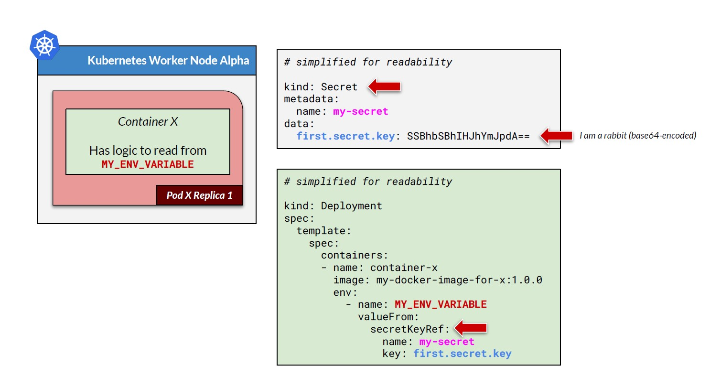

# Section 9 Application Configuration in Kubernetes

## Content
- 35 [ConfigMap](#35-configmap)
- 36 [Secret](#36-secret)
  
Delete the previous minikube and start fresh Minikube cluster

    bash --> minikube delete
    bash --> minikube start --cpus 4 --memory 8192 --driver docker

Start minikube tunnel and don't close the terminal

    bash --> minikube tunnel

## 35 ConfigMap
[⬆ Back to top](#top)

Sometimes, we need to configure application parameters. For example, when we need to hit a partner API, we need to save the URL, which can differ between the staging and production environments. Another example is configuring the maximum number of database connections, but the value for this setting depends on the server's size. So the configuration can change at times, but the source code must remain the same. Most programming languages can read values from the operating system environment variables. In Kubernetes, we can define environment variables for a container, which the application then reads. However, an environment variable alone does not solve the problem when the configuration value can change. For this, we can store the configuration parameter in a Kubernetes ConfigMap and pass the ConfigMap value to the container's environment variable. When there are any changes, we can update the configmap value and then restart the pod. ConfigMap data can be accessed by any container in any pod on any worker node, making it suitable for configuration parameters.

In the following example, we will create an HTML page. The color and text will be taken from the configmap via the environment variable. So when we later need to change the color or text, wedon't need to change the source code, just the configmap.


Open the configuration file in the folder configmap - \devops-kubernetes-resources-references\kubernetes-istio-scripts\kubernetes\configmap\devops-configmap.yml.

This is a simple configmap example.

devops-configmap.yml

```yaml
...
---
kind: ConfigMap 
apiVersion: v1 
metadata:
  namespace: devops
  name: devops-blue-configmap                                   # configmap-name
immutable: false    # optional, if set to true then data cannot be changed later
data:
  html.color.background: "#288240"                              # configmap-key-A
  html.color.text: "#eaf27c"                                    # configmap-key-B
  html.text.one: "This is the FIRST text from k8s configmap"    # configmap-key-C
  html.text.two: "This is the SECOND text from k8s configmap"   # configmap-key-D
  html.text.three: "This is the THIRD text from k8s configmap"  # configmap-key-E
  html.text.four: "This is the FOURTH text from k8s configmap"  # configmap-key-F
  html.text.five: "This is the FIFTH text from k8s configmap"   # configmap-key-G
  html.text.six: "This is the SIXTH text from k8s configmap"    # configmap-key-H
---
...
```


The name is devops-blue-configmap. It has several configmap examples.

During deployment, we pass an environment variable to the container in the container specification.


```yaml
...
---
apiVersion: apps/v1
kind: Deployment
metadata:
  namespace: devops
  name: devops-configmap-deployment
  labels:
    app.kubernetes.io/name: devops-configmap
spec:
...
        env:
          - name: HARDCODED_ENVIRONMENT_VARIABLE
            value: "Hello! I am hardcoded on k8s deployment yml file"
          - name: DEVOPS_BLUE_HTML_BG_COLOR     # environment variable name, can be anything (according to coding logic on container)
            valueFrom:
              configMapKeyRef:
                name: devops-blue-configmap     # configmap name to be used (in this sample uses configmap-name)
                key: html.color.background      # any key on configmap (in this sample uses configmap-key-A)
          - name: DEVOPS_BLUE_HTML_TEXT_COLOR   # environment variable name, can be anything (according to coding logic on container)
            valueFrom:
              configMapKeyRef:
                name: devops-blue-configmap     # configmap name to be used (in this sample uses configmap-name)
                key: html.color.text            # any key on configmap (in this sample uses configmap-key-B)
          - name: DEVOPS_BLUE_HTML_TEXT_ONE     # environment variable name, can be anything (according to coding logic on container)
            valueFrom:
              configMapKeyRef:
                name: devops-blue-configmap     # configmap name to be used (in this sample uses configmap-name)
                key: html.text.one              # any key on configmap (in this sample uses configmap-key-C)
          - name: DEVOPS_BLUE_HTML_TEXT_TWO     # environment variable name, can be anything (according to coding logic on container)
            valueFrom:
              configMapKeyRef:
                name: devops-blue-configmap     # configmap name to be used (in this sample uses configmap-name)
                key: html.text.two              # any key on configmap (in this sample uses configmap-key-D)
          - name: DEVOPS_BLUE_HTML_TEXT_THREE   # environment variable name, can be anything (according to coding logic on container)
            valueFrom:
              configMapKeyRef:
                name: devops-blue-configmap     # configmap name to be used (in this sample uses configmap-name)
                key: html.text.three            # any key on configmap (in this sample uses configmap-key-E)
          - name: DEVOPS_BLUE_HTML_TEXT_FOUR    # environment variable name, can be anything (according to coding logic on container)
            valueFrom:
              configMapKeyRef:
                name: devops-blue-configmap     # configmap name to be used (in this sample uses configmap-name)
                key: html.text.four             # any key on configmap (in this sample uses configmap-key-F)
          - name: DEVOPS_BLUE_HTML_TEXT_FIVE    # environment variable name, can be anything (according to coding logic on container)
            valueFrom:
              configMapKeyRef:
                name: devops-blue-configmap     # configmap name to be used (in this sample uses configmap-name)
                key: html.text.five             # any key on configmap (in this sample uses configmap-key-G)
          - name: DEVOPS_BLUE_HTML_TEXT_SIX     # environment variable name, can be anything (according to coding logic on container)
            valueFrom:
              configMapKeyRef:
                name: devops-blue-configmap     # configmap name to be used (in this sample uses configmap-name)
                key: html.text.six              # any key on configmap (in this sample uses configmap-key-H)
  replicas: 1
---
...
```


The names of each environment variable are free. Later, the devops-blue application will take a particular environment variable and process it. This method for retrieving data from environment variables is part of the application logic, not Kubernetes. Kubernetes supplies the environment variable name and its value. Environment variable values can be hardcoded in the deployment script, as in this first example. But we can also retrieve values from a configmap using the valueFrom element and a path to the configmap.

Here isa diagram that visualizes how config maps and environment variables work. Notice the text color, which is not black as they refer. Of course, an application as a container image runs on a pod. The application has logic to read from an environment variable named MY_ENV_VARIABLE. This logic has nothing to do with Kubernetes. It depends on the application logic on how to read the environment variable. We create a configmap, which is stored in the Kubernetes cluster. This configmap, with a name in pink text, has data with a blue key. During deployment, we set an environment variable for container x that points to the pink config map with the blue key. This value is passed as a red environment variable name, which is then read by the logic in container X. If the other pod has a different container, where this second container also has logic to read from the same environment variable, We can configure in the same way, referring to the pink configmap with the blue key, as the red environment variable name.


Try it. Run theconfiguration.

    bash --> kubectl apply -f devops-configmap.yml

    # result:
    namespace/devops created
    configmap/devops-blue-configmap created
    deployment.apps/devops-configmap-deployment created
    service/devops-configmap-service created

Check that the configmap exists.

    bash --> kubectl get configmap -n devops

    # result:
    NAME                    DATA   AGE
    devops-blue-configmap   8      37s
    kube-root-ca.crt        1      37s

To see the value of the configmap, we can use this. The output is in YAML format.

    bash --> kubectl get configmap -n devops devops-blue-configmap -o yaml 

    # result:
    apiVersion: v1
    data:
    html.color.background: '#288240'
    html.color.text: '#eaf27c'
    html.text.five: This is the FIFTH text from k8s configmap
    html.text.four: This is the FOURTH text from k8s configmap
    html.text.one: This is the FIRST text from k8s configmap
    html.text.six: This is the SIXTH text from k8s configmap
    html.text.three: This is the THIRD text from k8s configmap
    html.text.two: This is the SECOND text from k8s configmap
    immutable: false
    kind: ConfigMap
    metadata:
    annotations:
        kubectl.kubernetes.io/last-applied-configuration: |
        {"apiVersion":"v1","data":{"html.color.background":"#288240","html.color.text":"#eaf27c","html.text.five":"This is the FIFTH text from k8s configmap","html.text.four":"This is the FOURTH text from k8s configmap","html.text.one":"This is the FIRST text from k8s configmap","html.text.six":"This is the SIXTH text from k8s configmap","html.text.three":"This is the THIRD text from k8s configmap","html.text.two":"This is the SECOND text from k8s configmap"},"immutable":false,"kind":"ConfigMap","metadata":{"annotations":{},"name":"devops-blue-configmap","namespace":"devops"}}
    creationTimestamp: "2026-03-01T06:24:45Z"
    name: devops-blue-configmap
    namespace: devops
    resourceVersion: "35883"
    uid: 9be31149-f928-4fa1-885c-44e7a31f6587


Open the Postman collection or the browser and go to http://localhost:9011/devops/blue/html/configmap-secret

Notice that the text in the top section is from a hardcoded environment variable. But the color and text at the bottom are taken from the config map. 

What if we change the value in the config map? Try it. Edit the configmap using this

    bash --> kubectl edit configmap -n devops devops-blue-configmap

    # result:
    # Please edit the object below. Lines beginning with a '#' will be ignored,
    # and an empty file will abort the edit. If an error occurs while saving this file will be
    # reopened with the relevant failures.
    #
    apiVersion: v1
    data:
    html.color.background: '#00ff00'                                # changed color
    html.color.text: '#eaf27c'
    html.text.five: This is the FIFTH text from k8s configmap
    html.text.four: This is the FOURTH text from k8s configmap
    html.text.one: This is the 1st text from k8s configmap              # changed text FIRST to 1st
    html.text.six: This is the SIXTH text from k8s configmap
    html.text.three: This is the THIRD text from k8s configmap
    html.text.two: This is the SECOND text from k8s configmap
    immutable: false
    kind: ConfigMap
    metadata:
    annotations:
        kubectl.kubernetes.io/last-applied-configuration: |
        {"apiVersion":"v1","data":{"html.color.background":"#288240","html.color.text":"#eaf27c","html.text.five":"This is the FIFTH text from k8s configmap","html.text.four":"This is the FOURTH text from k8s configmap","html.text.one":"This is the FIRST text from k8s configmap","html.text.six":"This is the SIXTH text from k8s configmap","html.text.three":"This is the THIRD text from k8s configmap","html.text.two":"This is the SECOND text from k8s configmap"},"immutable":false,"kind":"ConfigMap","metadata":{"annotations":{},"name":"devops-blue-configmap","namespace":"devops"}}
    creationTimestamp: "2026-03-01T06:24:45Z"
    name: devops-blue-configmap
    namespace: devops
    resourceVersion: "35883"
    uid: 9be31149-f928-4fa1-885c-44e7a31f6587

Save the changes.

Then reload the deployment. A tip: we don't need to delete the deployment. We can roll it out, and Kubernetes will handle pod restarts without downtime.

    bash --> kubectl get deployment -n devops

    # result:
    NAME                          READY   UP-TO-DATE   AVAILABLE   AGE
    devops-configmap-deployment   1/1     1            1           10m

    bash --> kubectl rollout restart deployment devops-configmap-deployment -n devops 

    # result: deployment.apps/devops-configmap-deployment restarted

See here: new pods have been created.

    bash --> kubectl get pods -n devops

    # result:
    NAME                                           READY   STATUS    RESTARTS   AGE
    devops-configmap-deployment-5566ff9bf4-bvw9w   0/1     Running   0          29s
    devops-configmap-deployment-6cb5d8d6f4-mphrv   1/1     Running   0          11m

Kubernetes will manage the termination of the old pod and switch traffic to the new pod. So when the new pod is active and we access the HTML again, the color and text will change. 

    browser --> http://localhost:9011/devops/blue/html/configmap-secret

There are several common ways to create a configmap. The first thing that we saw was using declarative configuration. We can use a single declarative file or split the configmap into its own declarative file. We can also create a configmap from the terminal, as we will see soon.

In the sample file, folder configmap - \devops-kubernetes-resources-references\kubernetes-istio-scripts\kubernetes\configmap\, we will find several text-based files: .json, .yml, .properties, or .txt. And there is a binary file, using an image as an example. We also have a folder containing several files, including text and binary files. The syntax for creating a configmap is available in the last section of the course, lecture resource, and reference. We can create a ConfigMap from a file, where the filename serves as the ConfigMap key and the file contents as the ConfigMap value. 

configmap-source.yml

```yaml
key-on-yml:
  something:
    first: Hello, I am a value on yml file
    second: And I am another value on yml file
```

For example, this one creates a ConfigMap with a single key from the file parameter.

    bash --> kubectl create configmap configmap-file-single -n devops --from-file=configmap-source.yml

    # result: configmap/configmap-file-single created

See the configmap content, where it contains one key.

    bash --> kubectl get configmap -n devops -o json configmap-file-single

    # result:
    {
        "apiVersion": "v1",
        "data": {
            "configmap-source.yml": "key-on-yml:\r\n  something:\r\n    first: Hello, I am a value on yml file\r\n    second: And I am another value on yml file"
        },
        "kind": "ConfigMap",
        "metadata": {
            "creationTimestamp": "2026-03-01T06:41:45Z",
            "name": "configmap-file-single",
            "namespace": "devops",
            "resourceVersion": "36772",
            "uid": "845f59eb-b586-4f8f-984d-73ecba00d643"
        }
    }

Thevalue is file content, including all whitespace.

So the application logic that pulls data from this configmap might need to parse the content further, since it's actually a YAML file.

When passing multiple from-file parameters into a single configmap, each filename becomes a key, and each file's content becomes its respective value.

configmap-source.json

```json
{
  "something" : [
    {
      "name" : "first",
      "text" : "I am a text in json"
    },
    {
      "name" : "second",
      "text" : "I am the second text in json"
    }
  ]
}
```

configmap-source.properties

```properties
property.key.one=This is a value from properties file
property.key.two=And this is another value, also from properties file
```

configmap-source.txt

```text
I am just a text file, but I can go into kubernetes configmap.

All of my content will be available as value in configmap.

See it for yourself!
```

Create configmap from text file

    bash --> kubectl create configmap configmap-file-multi -n devops --from-file=configmap-source.json --from-file=configmap-source.properties --from-file=configmap-source.txt

    # result: configmap/configmap-file-multi created

Examine the content, and we will see that this configmap has several key-value pairs, one for each file.

    bash --> kubectl get configmap -n devops -o json configmap-file-multi

    # result:
    {
        "apiVersion": "v1",
        "data": {
            "configmap-source.json": "{\r\n  \"something\" : [\r\n    {\r\n      \"name\" : \"first\",\r\n      \"text\" : \"I am a text in json\"\r\n    },\r\n    {\r\n      \"name\" : \"second\",\r\n      \"text\" : \"I am the second text in json\"\r\n    }\r\n  ]\r\n}",
            "configmap-source.properties": "property.key.one=This is a value from properties file\r\nproperty.key.two=And this is another value, also from properties file",
            "configmap-source.txt": "I am just a text file, but I can go into kubernetes configmap.\r\n\r\nAll of my content will be available as value in configmap.\r\n\r\nSee it for yourself!"
        },
        "kind": "ConfigMap",
        "metadata": {
            "creationTimestamp": "2026-03-01T06:51:03Z",
            "name": "configmap-file-multi",
            "namespace": "devops",
            "resourceVersion": "37234",
            "uid": "dd1f98f3-10d1-4a95-8781-c4ca6b467e62"
        }
    }

We can also pass a binary file, such as an image. Kubernetes will base64-encode the file content and set the configmap as a base64-encoded string.

    bash --> kubectl create configmap configmap-file-binary -n devops --from-file=configmap-source.png

    # result: configmap/configmap-file-binary created

See the content. If I decode the base64 string, I will get the image back.

    bash --> kubectl get configmap -n devops -o json configmap-file-binary

    # result:
    {
    "apiVersion": "v1",
        "binaryData": {
            "configmap-source.png": "iVBORw0KGg...QmCC"
        },
        "kind": "ConfigMap",
        "metadata": {
            "creationTimestamp": "2026-03-01T06:58:54Z",
            "name": "configmap-file-binary",
            "namespace": "devops",
            "resourceVersion": "37621",
            "uid": "3b24f512-2eec-469a-9f02-07351f79d160"
        }
    }

If we have multiple files to put into a single configmap, we can put them into a folder and pass the folder name as the from-file parameter.

    bash --> kubectl create configmap configmap-folder -n devops --from-file=configmap-sources

    # result: configmap/configmap-folder created

    bash --> kubectl get configmap -n devops -o json configmap-folder

    # result:
    {
        "apiVersion": "v1",
        "binaryData": {
            "configmap-in-folder-two.png": "iVBORw0...U5ErkJggg=="
        },
        "data": {
            "configmap-in-folder-one.yml": "lorem: \r\n  ipsum: \u003e\r\n    Lorem ipsum dolor sit amet, consectetur adipiscing elit.  \r\n    Aenean in finibus sem. \r\n    Nulla egestas aliquet velit, at posuere dolor pellentesque non. \r\n  dolor:\r\n    sit: Praesent vulputate euismod dolor sed condimentum.\r\n    amet: Donec id eleifend sapien, vitae facilisis justo.\r\n",
            "configmap-in-folder-three.json": "{\r\n    \"lorem\" : {\r\n        \"ipsum\" : [\r\n            \"Nullam libero nisi, maximus fermentum convallis ac, tempus quis purus.\",\r\n            \"Quisque vestibulum accumsan felis.\",\r\n            \"Praesent vitae gravida ex.\"\r\n        ]\r\n    },\r\n    \"dolor\": [\r\n        \"Cras vulputate tortor nec imperdiet fringilla.\",\r\n        \"Donec pulvinar ultrices semper.\",\r\n        \"Nunc congue faucibus est, vitae iaculis arcu accumsan vitae.\"\r\n    ]\r\n}"
        },
        "kind": "ConfigMap",
        "metadata": {
            "creationTimestamp": "2026-03-01T07:03:28Z",
            "name": "configmap-folder",
            "namespace": "devops",
            "resourceVersion": "37846",
            "uid": "eb2fcbd9-7d7e-4226-a018-73c72d5517ec"
        }
    }

This configmap will have three key-value pairs. One pair is binary data, an image. Two pairs are text-based data.

Delete the devops namespace to delete all resources in it and start the next section fresh

    bash --> kubectl delete namespace devops

[⬆ Back to top](#top)

## 36 Secret
[⬆ Back to top](#top)

Other than configmap, Kubernetes also provides secret, which stores data as a key-value pair, like configmap, but the value is base64 encoded, even for text data. Note that the value is still in plain text, not encrypted. It's only base64 encoded. Encoding is not encryption, and the term 'secret' can sometimes mislead. Base64 encoded data means that, although it will be difficult for the human eye to read the data, The machine can easily parse the base64-encoded string and retrieve the actual data. Even if humans get the base64 string, there are many free tools to decode it into its original, human-readable form.

In the following example, we will use the same HTML page from the configmap lesson. The color and some text will be taken from a secret, via an environment variable. Some other text will be taken from a configmap, via an environment variable. As we will see, we can mix configmap and secret usage. 

The process for using secrets is the same as for configmaps, as shown in this diagram. The difference is in the configuration file as indicated by the red arrows. First, the Kubernetes object is a secret. The secret's value is base64-encoded. So instead of a readable string 'I am a rabbit', this is the base64 encoded value. And to refer to the secret, we use the element 'secret key ref' instead of 'configmap key ref'


Try it.Run the devops-secret configuration file - \devops-kubernetes-resources-references\kubernetes-istio-scripts\kubernetes\secret\devops-secret.yml. 

    bash --> kubectl apply -f devops-secret.yml

    # result:
    namespace/devops created
    secret/devops-blue-secret created
    configmap/devops-blue-configmap created
    deployment.apps/devops-secret-deployment created
    service/devops-secret-service created

    browser --> http://localhost:9011/devops/blue/html/configmap-secret

Secrets are the same as ConfigMaps. We can list a secret. See the secret content.

    bash --> kubectl get secret -n devops -o json devops-blue-secret

    # result:
    {
        "apiVersion": "v1",
        "data": {
            "html.color.background": "I2MzZmFmOA==",
            "html.color.text": "IzVlM2VkZQ==",
            "html.text.four": "VGhpcyBpcyB0aGUgRk9VUlRIIHRleHQgZnJvbSBrOHMgc2VjcmV0",
            "html.text.one": "VGhpcyBpcyB0aGUgRklSU1QgdGV4dCBmcm9tIGs4cyBzZWNyZXQ=",
            "html.text.three": "VGhpcyBpcyB0aGUgVEhJUkQgdGV4dCBmcm9tIGs4cyBzZWNyZXQ=",
            "html.text.two": "VGhpcyBpcyB0aGUgU0VDT05EIHRleHQgZnJvbSBrOHMgc2VjcmV0"
        },
        "immutable": false,
        "kind": "Secret",
        "metadata": {
            "annotations": {
                "kubectl.kubernetes.io/last-applied-configuration": "{\"apiVersion\":\"v1\",\"data\":{\"html.color.background\":\"I2MzZmFmOA==\",\"html.color.text\":\"IzVlM2VkZQ==\",\"html.text.four\":\"VGhpcyBpcyB0aGUgRk9VUlRIIHRleHQgZnJvbSBrOHMgc2VjcmV0\",\"html.text.one\":\"VGhpcyBpcyB0aGUgRklSU1QgdGV4dCBmcm9tIGs4cyBzZWNyZXQ=\",\"html.text.three\":\"VGhpcyBpcyB0aGUgVEhJUkQgdGV4dCBmcm9tIGs4cyBzZWNyZXQ=\",\"html.text.two\":\"VGhpcyBpcyB0aGUgU0VDT05EIHRleHQgZnJvbSBrOHMgc2VjcmV0\"},\"immutable\":false,\"kind\":\"Secret\",\"metadata\":{\"annotations\":{},\"name\":\"devops-blue-secret\",\"namespace\":\"devops\"}}\n"
            },
            "creationTimestamp": "2026-03-01T07:15:02Z",
            "name": "devops-blue-secret",
            "namespace": "devops",
            "resourceVersion": "38509",
            "uid": "1c6d2d70-782a-4bf9-9100-615e21d8cfdf"
        },
        "type": "Opaque"
    }

Edit the secret content. Of course, we need the base64-encoded text. For example, this will change the color to black, the text colorto yellow, and the header text to 'I am a tiger'.

    bash --> kubectl edit secret -n devops devops-blue-secret
```yaml
    # Please edit the object below. Lines beginning with a '#' will be ignored,
    # and an empty file will abort the edit. If an error occurs while saving this file will be
    # reopened with the relevant failures.
    #
    apiVersion: v1
    data:
    html.color.background: IzAwMDAwMA==                 # changed
    html.color.text: I0ZGRkYwMA==                       # changed
    html.text.four: VGhpcyBpcyB0aGUgRk9VUlRIIHRleHQgZnJvbSBrOHMgc2VjcmV0
    html.text.one: SSBhbSBhIHRpZ2Vy                     # changed
    html.text.three: VGhpcyBpcyB0aGUgVEhJUkQgdGV4dCBmcm9tIGs4cyBzZWNyZXQ=
    html.text.two: VGhpcyBpcyB0aGUgU0VDT05EIHRleHQgZnJvbSBrOHMgc2VjcmV0
    immutable: false
...
```
Save the changes - Ctrl + S

Restart the deployment.

    bash --> kubectl get deployment -n devops

    # result:
    NAME                       READY   UP-TO-DATE   AVAILABLE   AGE
    devops-secret-deployment   1/1     1            1           14m

    bash --> kubectl rollout restart deployment -n devops devops-secret-deployment

    # result: deployment.apps/devops-secret-deployment restarted

And check the html again after about a minute.

    browser --> http://localhost:9011/devops/blue/html/configmap-secret

The way we create a secret, other than a declarative configuration file, is also from the terminal or a file, just like a configmap. 

    # Use --from-literal [key]=[value]
    # Or  --from-literal=[key]=[value]
    bash --> kubectl create secret generic secret-literal -n devops --from-literal key.literal.one="This is my secret value for first key" --from-literal key.literal.two="While this is the secret  value for second key"

    # result: secret/secret-literal created

    bash --> kubectl get secret -n devops -o json secret-literal

    # result:
    {
        "apiVersion": "v1",
        "data": {
            "key.literal.one": "VGhpcyBpcyBteSBzZWNyZXQgdmFsdWUgZm9yIGZpcnN0IGtleQ==",
            "key.literal.two": "V2hpbGUgdGhpcyBpcyB0aGUgc2VjcmV0ICB2YWx1ZSBmb3Igc2Vjb25kIGtleQ=="
        },
        "kind": "Secret",
        "metadata": {
            "creationTimestamp": "2026-03-01T07:35:24Z",
            "name": "secret-literal",
            "namespace": "devops",
            "resourceVersion": "39560",
            "uid": "4d0d52c4-16ce-4687-ae4e-30ec88e643c7"
        },
        "type": "Opaque"
    }

So this one is for creating from the terminal, with two key pairs on secrets. Notice that the literal is plain text, but Kubernetes will automatically encode it as base64. 

This one is for creating a secret from a single file. The file is just a regular text file. We create the secret. Kubernete will encode the file content as base 64. And if we decode it, we will get the plain format.

    bash --> kubectl create secret generic secret-file-single -n devops --from-file=secret-source.yml

    # result: secret/secret-file-single created

    bash --> kubectl get secret -n devops -o json secret-file-single

    # result:
    {
        "apiVersion": "v1",
        "data": {
            "secret-source.yml": "a2V5LW9uLXltbDoNCiAgc29tZXRoaW5nOg0KICAgIGZpcnN0OiBIZWxsbywgSSBhbSBhIHZhbHVlIG9uIHltbCBmaWxlDQogICAgc2Vjb25kOiBBbmQgSSBhbSBhbm90aGVyIHZhbHVlIG9uIHltbCBmaWxl"
        },
        "kind": "Secret",
        "metadata": {
            "creationTimestamp": "2026-03-01T07:39:02Z",
            "name": "secret-file-single",
            "namespace": "devops",
            "resourceVersion": "39737",
            "uid": "2281edaf-76a4-45cf-bb45-798173f2d623"
        },
        "type": "Opaque"
    }

Decode the secret

    bash --> echo "a2V5LW9uLXltbDoNCiAgc29tZXRoaW5nOg0KICAgIGZpcnN0OiBIZWxsbywgSSBhbSBhIHZhbHVlIG9uIHltbCBmaWxlDQogICAgc2Vjb25kOiBBbmQgSSBhbSBhbm90aGVyIHZhbHVlIG9uIHltbCBmaWxl" | base64 -d

    # result:
    key-on-yml:
    something:
        first: Hello, I am a value on yml file
        second: And I am another value on yml file

This one creates asingle secret from multiple from-file parameters, where each filename becomes a key in the secret, and each file's content is its respective value, base64-encoded. Notice here, we can also pass a binary file, like an image. 

    bash --> kubectl create secret generic secret-file-multi -n devops --from-file=secret-source.json --from-file=secret-source.properties --from-file=secret-source.txt --from-file=secret-source.png

    # result: secret/secret-file-multi created

    bash --> kubectl get secret secret-file-multi -n devops -o json

    # result:
    {
        "apiVersion": "v1",
        "data": {
            "secret-source.json": "ew0KIC...XJzZWxmIQ=="
        },
        "kind": "Secret",
        "metadata": {
            "creationTimestamp": "2026-03-01T07:46:00Z",
            "name": "secret-file-multi",
            "namespace": "devops",
            "resourceVersion": "40073",
            "uid": "65e07ac1-6248-4072-82e7-7cf3bce828f8"
        },
        "type": "Opaque"
    }

Examine the content, and we will see that this secret has several key-value pairs. Since all values are base64-encoded, the secret contains only the 'data' element, not 'binary data', even for the image.

We can also create the Kubernetes secret from a folder.

    bash --> kubectl create secret generic secret-folder -n devops --from-file=secret-sources

    # result: secret/secret-folder created

See the content.

    bash --> kubectl get secret secret-folder -n devops -o json

    # result:
    {
        "apiVersion": "v1",
        "data": {
            "secret-in-folder-one.yml": "bG9yZW06IA0K...ErkJggg=="
        },
        "kind": "Secret",
        "metadata": {
            "creationTimestamp": "2026-03-01T07:47:44Z",
            "name": "secret-folder",
            "namespace": "devops",
            "resourceVersion": "40157",
            "uid": "be595a4d-bcfd-45af-a249-aa83716eeddf"
        },
        "type": "Opaque"
    }

[⬆ Back to top](#top)

